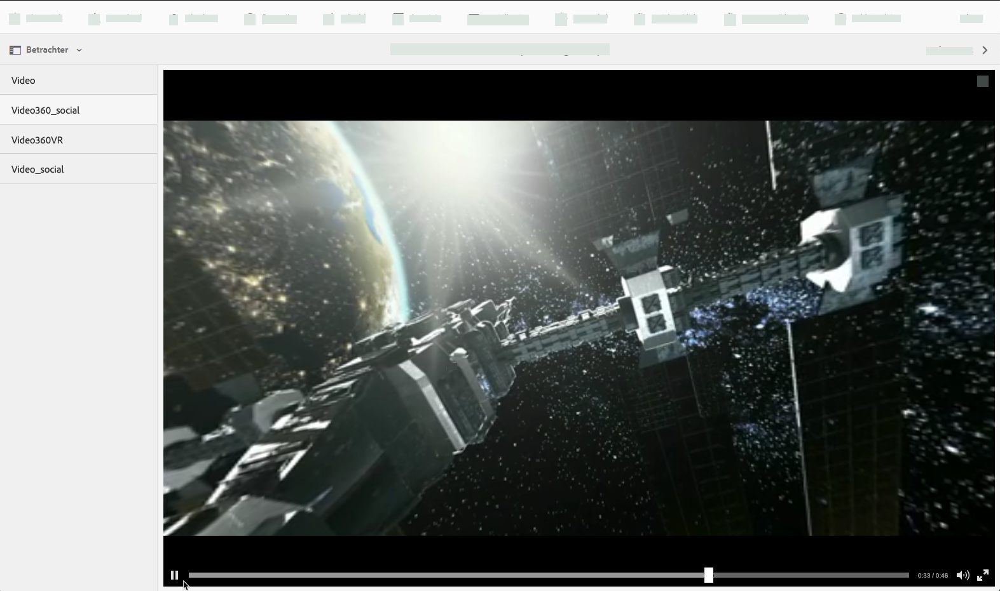
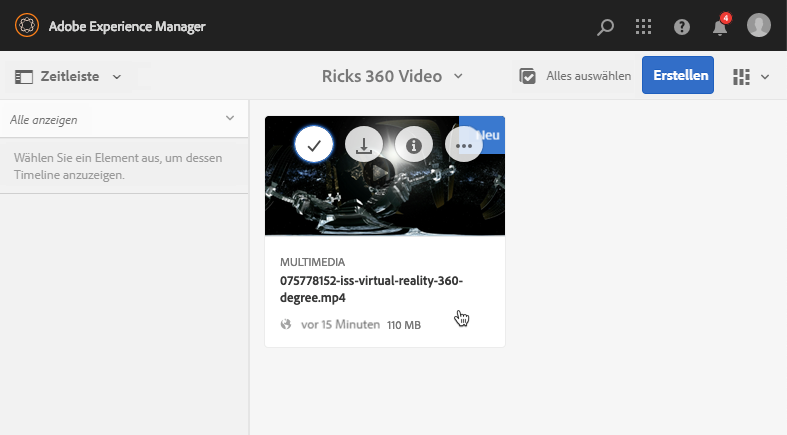
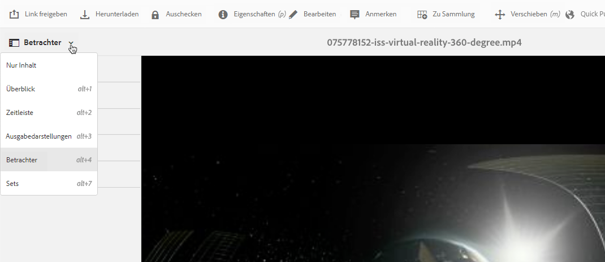
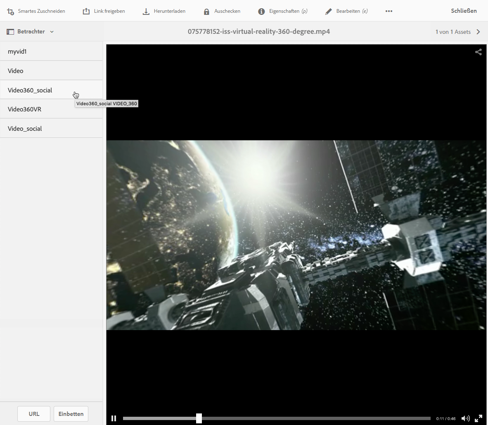
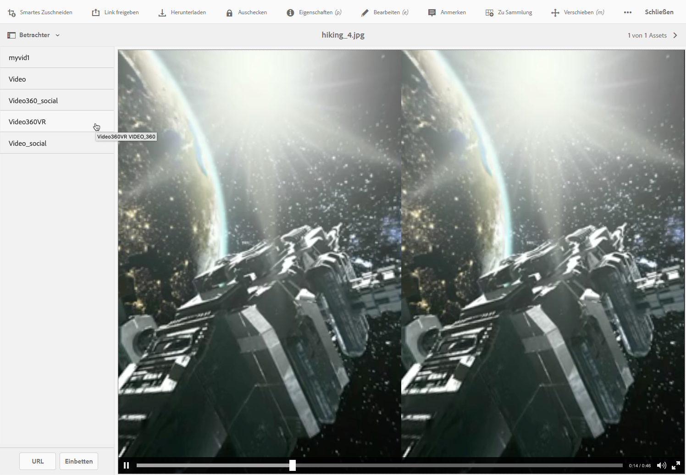

# 360-Grad-/VR-Video {#vr-video}

360-Grad-Videos zeichnen ein Motiv aus allen Richtungen gleichzeitig auf. Sie werden mit einer omnidirektionalen Kamera oder mit mehreren Kameras aufgenommen. Während der Wiedergabe auf einer flachen Anzeige hat der Benutzer die Kontrolle über den Anzeigewinkel. -Wiedergabe auf Mobilgeräten verwendet in der Regel die integrierten gyroskopischen Steuerelemente.

Dynamic Media – Scene7-Modus bietet native Unterstützung für die Bereitstellung von 360-Grad-Videoassets. Standardmäßig ist keine weitere Konfiguration für die Anzeige oder die Wiedergabe erforderlich. 360-Grad-Videos werden mit Standardvideoerweiterungen wie .mp4, .mkv und .mov bereitgestellt. Der am häufigsten verwendete Codec ist H.264.

In diesem Abschnitt erfahren Sie, wie Sie mit dem 360-Grad-/VR-Video-Viewer ein Panoramavideo für eine interaktive Anzeige eines Raums, einer Eigenschaft, eines Standorts, einer Landschaft oder eines medizinischen Verfahrens rendern.

Räumliches Audio wird derzeit nicht unterstützt. Falls Audio in Stereo gemischt wird, ändert sich die Balance (L/R) nicht, wenn der Kunde den Anzeigewinkel der Kamera ändert.

Informationen hierzu finden Sie in [Verwalten von Viewer-Vorgaben](/help/assets/managing-viewer-presets.md).

## 360-Grad-Video in Aktion {#video-in-action}

Wählen Sie [Space Station 360](https://mobiletest.scene7.com/s7viewers/html5/Video360Viewer.html?asset=Viewers/space_station_360-AVS) aus, um ein Browserfenster zu öffnen und ein 360-Grad-Video anzuzeigen. Ziehen Sie während der Videowiedergabe den Mauszeiger an eine neue Position, um den Anzeigewinkel zu ändern.

-*Videoframe aus Space Station 360*

## 360-Grad-/VR-Video und Adobe Premiere Pro {#vr-video-and-adobe-premiere-pro}

Sie können 360-Grad-/VR-Videos mit Adobe Premiere Pro anzeigen und bearbeiten. Beispielsweise können Sie Logos und Text in einer Szene platzieren sowie speziell für Panoramavideos entwickelte Effekte und Überblendungen anwenden.

Weitere Informationen finden Sie unter [Bearbeiten von 360-Grad-/VR-Videos](https://helpx.adobe.com/de/premiere-pro/how-to/edit-360-vr-video.html).

## Hochladen von Assets zur Verwendung mit dem 360-Grad-Video-Viewer {#uploading-assets-for-use-with-the-video-viewer}

360 Video-Assets, die in Adobe Experience Manager hochgeladen werden, werden auf einer Asset-Seite wie normale Video-Assets als **Multimedia** gekennzeichnet.

*Ein hochgeladenes 360-Grad-Video-Asset in der Kartenansicht. Das Asset wird als „Multimedia“ gekennzeichnet.*

**Hochladen von Assets zur Verwendung mit dem 360-Grad-Video-Viewer:**

1. Erstellen Sie einen Ordner für Ihr 360-Grad-Video-Asset.
1. [Wenden Sie ein adaptives Videoprofil auf den Ordner an](/help/assets/video-profiles.md#applying-a-video-profile-to-folders).

   Das Rendern von 360-Grad-Videos ist mit höheren Anforderungen an die Auflösung des Quellvideos sowie der kodierten Ausgabedarstellungen verbunden als Standard-Videoinhalte.

   Sie können das vordefinierte adaptive Videoprofil von Dynamic Media verwenden. Mit diesem erzielen Sie jedoch eine etwas schlechtere Qualität bei 360-Grad-Videos als bei normalen Videos, die mit den gleichen Einstellungen kodiert und mit einem normalen Video-Viewer gerendert wurden. Wenn Sie hochwertige 360-Grad-Videos benötigen, gehen Sie wie folgt vor:

   * Idealerweise sollten Sie Ihren ursprünglichen 360-Grad-Videoinhalt mit einer der folgenden Auflösungen verwenden:

      * 1080p – 1920 x 1080 (Full HD- oder FHD-Auflösung) oder
      * 2160p - 3840 x 2160, auch als 4k-, UHD- oder Ultra HD-Auflösung bezeichnet. Diese hohe Auflösung ist häufig auf Premium-Fernsehgeräten und Computermonitoren verfügbar. Die 2160p-Auflösung wird oft als &quot;4k&quot;bezeichnet, da die Breite nahe 4000 Pixel liegt. Das heißt, sie bietet viermal so viele Pixel wie 1080p.
   * [Erstellen Sie ein benutzerdefiniertes adaptives Videoprofil](/help/assets/video-profiles.md#creating-a-video-encoding-profile-for-adaptive-streaming) mit hochwertigeren Ausgabedarstellungen. Erstellen Sie beispielsweise ein adaptives Videoprofil, das die folgenden drei Einstellungen enthält:

      * width=auto; height=720; bitrate=2500 kbps
      * width=auto; height=1080; bitrate=5000 kbps
      * width=auto; height=1440; bitrate=6600 kbps
   * Verarbeiten Sie 360-Grad-Videoinhalte in einem Ordner, der ausschließlich 360-Grad-Video-Assets enthält.

   Dieser Ansatz stellt höhere Anforderungen an das Netzwerk und die CPU des Endbenutzers.

1. [Laden Sie Ihr Video in den Ordner hoch](/help/assets/managing-video-assets.md#upload-and-preview-video-assets).

## Standardseitenverhältnis von 360 Videos überschreiben  {#overriding-the-default-aspect-ratio-of-videos}

Hochgeladene Assets sind als 360-Grad-Videos und für die Verwendung mit dem 360-Grad-Video-Viewer geeignet, wenn sie ein Seitenverhältnis von 2 aufweisen.

Standardmäßig erkennt Experience Manager das Video als &quot;360&quot;, wenn das Seitenverhältnis (Breite/Höhe) 2,0 beträgt. Wenn Sie Administrator sind, können Sie die standardmäßige Seitenverhältniseinstellung von 2 überschreiben, indem Sie die optionale Eigenschaft `s7video360AR` in CRXDE Lite wie folgt festlegen:

* `/conf/global/settings/cloudconfigs/dmscene7/jcr:content`

   * **Eigenschaftstyp**  - Double
   * **Wert**  - Gleitkommaseitenverhältnis, Standardwert 2.0.

Wenn Sie diese Eigenschaft festlegen, wird sie umgehend auf vorhandene und neu hochgeladene Videos angewendet.

Das Seitenverhältnis gilt für 360-Grad-Video-Assets für die Asset-Detailseite und die [WCM-Komponente für 360-Grad-Videos](/help/assets/adding-dynamic-media-assets-to-pages.md#dynamic-media-components).

Laden Sie zunächst 360-Grad-Videos hoch.

## Vorschau 360-Grad-Video {#previewing-video}

Mit der Vorschau können Sie prüfen, wie das 360-Grad-Video bei Ihren Kunden aussieht, und sicherstellen, dass es sich wie erwartet verhält.

Siehe auch [Viewer-Vorgaben bearbeiten](/help/assets/managing-viewer-presets.md#editing-viewer-presets).

Wenn das 360-Grad-Video Ihren Vorstellungen entspricht, können Sie es veröffentlichen.

Siehe [Einbetten des Video- oder Bild-Viewers auf einer Web-Seite](/help/assets/embed-code.md).
Siehe [Verknüpfen von URLs mit einer Webanwendung](/help/assets/linking-urls-to-yourwebapplication.md). Die URL-basierte Verknüpfungsmethode ist nicht möglich, wenn Ihr interaktiver Inhalt über Links mit relativen URLs verfügt, insbesondere über Links zu Seiten in Adobe Experience Manager Sites.
Siehe [Hinzufügen von Dynamic Media Assets zu Seiten](/help/assets/adding-dynamic-media-assets-to-pages.md).

**Vorschau von 360-Grad-Videos:**

1. Navigieren Sie in **[!UICONTROL Assets]** zu einem von Ihnen erstellten 360-Grad-Video. Wählen Sie das 360-Grad-Video-Asset aus, damit Sie es im Vorschaumodus öffnen können.

   

   Wählen Sie das 360-Grad-Video-Asset aus, damit Sie eine Vorschau des Videos anzeigen können.

1. Wählen Sie auf der Vorschauseite links oben auf der Seite die Dropdown-Liste aus und klicken Sie dann auf **[!UICONTROL Viewer]**.

   

   Wählen Sie in der Viewer-Liste **[!UICONTROL Video360_social]** aus und führen Sie dann einen der folgenden Schritte aus:

   * Ziehen Sie den Mauszeiger über das Video, wenn Sie den Anzeigewinkel der statischen Szene ändern möchten.
   * Wählen Sie die Schaltfläche **[!UICONTROL Wiedergabe]** des Videos aus, wenn Sie die Wiedergabe starten möchten. Ziehen Sie bei der Wiedergabe des Videos den Mauszeiger über das Video, um den Anzeigewinkel zu ändern.

   *Screenshot eines 360-Grad-Videos.*

   * Wählen Sie in der Viewer-Liste **[!UICONTROL Video360VR]** aus.

      Virtual Reality (VR)-Videos sind interaktive Videoinhalte, die über Virtual Reality-Headsets angezeigt werden. Wie bei herkömmlichen Videos erstellen Sie VR-Videos zu Beginn, wenn ein Video mit 360-Grad-Videokameras aufgezeichnet oder erfasst wird.
   
   *Screenshot eines 360-Grad-VR-Videos.*

1. Wählen Sie rechts oben auf der Vorschauseite **[!UICONTROL Close]** aus.

## Veröffentlichen von 360-Grad-Videos {#publishing-video}

Veröffentlichen Sie das 360-Grad-Video, damit Sie es verwenden können. Die Veröffentlichung eines 360-Grad-Videos aktiviert die URL und den Einbettungs-Code. Außerdem wird das 360-Grad-Video in der Dynamic Media-Cloud veröffentlicht, die für eine skalierbare und leistungsfähige Bereitstellung mit einem CDN integriert ist.

Weitere Informationen zum Veröffentlichen von 360-Grad-Videos finden Sie unter [Veröffentlichen von Dynamic Media-Assets](/help/assets/publishing-dynamicmedia-assets.md) .
Siehe auch [Einbetten des Video- oder Bild-Viewers auf einer Web-Seite](/help/assets/embed-code.md).
Siehe auch [Verknüpfen von URLs mit einer Webanwendung](/help/assets/linking-urls-to-yourwebapplication.md). Die URL-basierte Verknüpfungsmethode ist nicht möglich, wenn Ihr interaktiver Inhalt über Links mit relativen URLs verfügt, insbesondere über Links zu Seiten in Adobe Experience Manager Sites.
Siehe auch [Hinzufügen von Dynamic Media-Assets zu Seiten](/help/assets/adding-dynamic-media-assets-to-pages.md).
