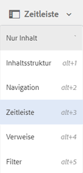
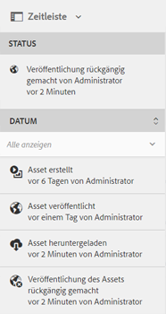

# Aktivitäts-Stream in der Zeitleiste {#activity-stream-in-timeline}

Diese Funktion zeigt Aktivitätsprotokolle für Assets in der Zeitleiste an. Wenn Sie einen der folgenden Asset-bezogenen Vorgänge in [!DNL Adobe Experience Manager Assets] ausführen, wird die Zeitschiene durch die Stream-Funktion der Aktivität aktualisiert, um die Aktivität widerzuspiegeln.

Folgende Vorgänge werden im Aktivitäts-Stream protokolliert:

* Erstellen
* Löschen
* Download (einschließlich Ausgabedarstellungen)
* Veröffentlichen
* Veröffentlichung rückgängig machen
* Genehmigen
* Ablehnen
* Verschieben

Die in der Zeitleiste angezeigten Aktivitätsprotokolle werden aus dem Ordner `/var/audit/com.day.cq.dam/content/dam` in CRX abgerufen, in dem Protokolldateien gespeichert werden. Darüber hinaus wird die Aktivität der Zeitschiene protokolliert, wenn neue Assets hochgeladen oder vorhandene Assets geändert und über [Adobe Asset Link](https://helpx.adobe.com/enterprise/admin-guide.html/enterprise/using/manage-assets-using-adobe-asset-link.ug.html) oder [Experience Manager Desktop-App](https://experienceleague.adobe.com/docs/experience-manager-desktop-app/using/release-notes.html) in [!DNL Experience Manager] eingecheckt werden.

>[!NOTE]
>
>Übergangsarbeitsabläufe werden nicht in der Zeitleiste angezeigt, da keine Verlaufsinformationen für diese Arbeitsabläufe gespeichert werden.

Um den Aktivitäts-Stream anzuzeigen, führen Sie einen oder mehrere Vorgänge für die Assets aus, wählen Sie das Asset aus und wählen Sie dann **[!UICONTROL Zeitleiste]** aus der GlobalNav-Liste aus.

In der Zeitleiste wird der Aktivitäts-Stream für die mit den Assets ausgeführten Vorgänge angezeigt.

>[!NOTE]
>
>Der standardmäßige Speicherort für Aufgaben des Typs **[!UICONTROL Veröffentlichen]** und **[!UICONTROL Veröffentlichung rückgängig machen]** befindet sich in `/var/audit/com.day.cq.replication/content`. Für Aufgaben des Typs **[!UICONTROL Verschieben]** ist der standardmäßige Speicherort `/var/audit/com.day.cq.wcm.core.page`.
