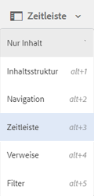
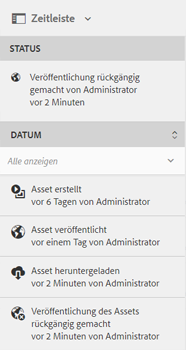

# Aktivitäts-Stream in der Timeline {#activity-stream-in-timeline}

Diese Funktion zeigt Aktivitätsprotokolle für Assets in der Timeline an. Wenn Sie einen der folgenden Asset-bezogenen Vorgänge in [!DNL Adobe Experience Manager Assets]durchführen, aktualisiert die Aktivitäts-Stream-Funktion die Timeline, um die Aktivität anzuzeigen.

Folgende Vorgänge werden im Aktivitäts-Stream protokolliert:

* Erstellen
* Löschen
* Download (einschließlich Ausgabedarstellungen)
* Veröffentlichen
* Veröffentlichung aufheben
* Genehmigen
* Ablehnen
* Verschieben

Die in der Timeline angezeigten Aktivitätsprotokolle werden aus dem Ordner `/var/audit/com.day.cq.dam/content/dam` in CRX abgerufen, in dem Protokolldateien gespeichert werden. Außerdem wird die Timeline-Aktivität protokolliert, wenn neue Assets hochgeladen oder vorhandene Assets geändert und in [!DNL Experience Manager] über [Adobe Asset Link](https://helpx.adobe.com/de/enterprise/admin-guide.html/enterprise/using/manage-assets-using-adobe-asset-link.ug.html) oder das [Experience Manager Desktop-Programm](https://experienceleague.adobe.com/docs/experience-manager-desktop-app/using/release-notes.html?lang=de) gespeichert werden.

>[!NOTE]
>
>ÜbergangsWorkflows werden nicht in der Timeline angezeigt, da keine Verlaufsinformationen für diese Workflows gespeichert werden.

Um den Aktivitäts-Stream anzuzeigen, führen Sie einen oder mehrere Vorgänge für die Assets aus, wählen Sie das Asset aus und wählen Sie dann **[!UICONTROL Timeline]** aus der GlobalNav-Liste aus.

In der Timeline wird der Aktivitäts-Stream für die mit den Assets ausgeführten Vorgänge angezeigt.

>[!NOTE]
>
>Der standardmäßige Speicherort für Aufgaben des Typs **[!UICONTROL Veröffentlichen]** und **[!UICONTROL Veröffentlichung aufheben]** befindet sich in `/var/audit/com.day.cq.replication/content`. Für Aufgaben des Typs **[!UICONTROL Verschieben]** ist der standardmäßige Speicherort `/var/audit/com.day.cq.wcm.core.page`.
