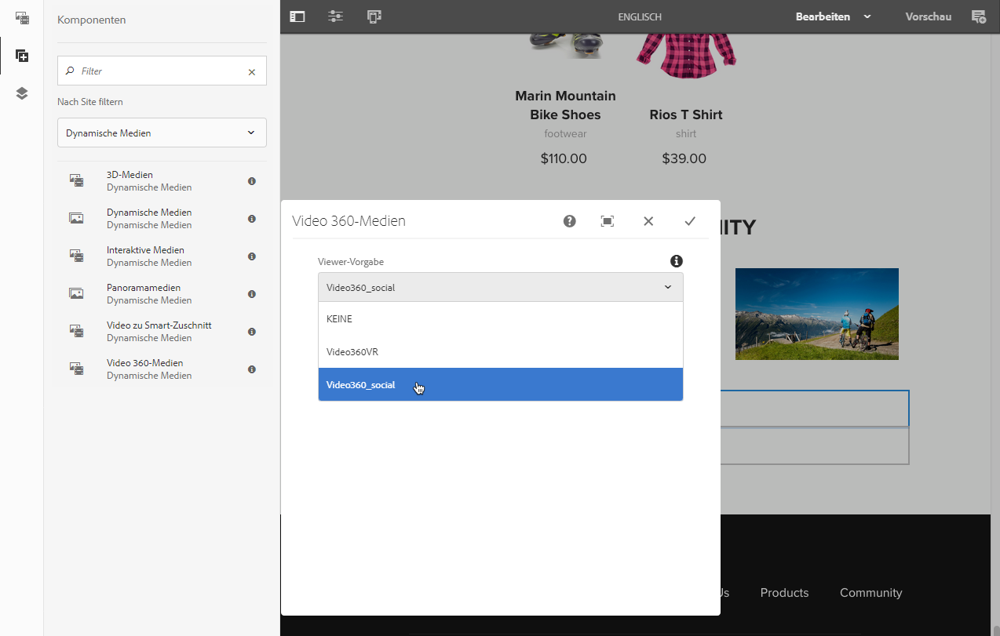

# Hinzufügen von Dynamic Media-Assets zu Seiten{#adding-dynamic-media-assets-to-pages}

Wenn Sie den Assets auf Ihren Websites Dynamic Media-Funktionen hinzufügen möchten, können Sie die Komponente für **Dynamic Media**,**interaktive Medien**, **Panoramamedien** oder **Video-360-Medien** direkt auf der Seite hinzufügen. Wechseln Sie dazu in den Layout-Modus und aktivieren Sie die Komponenten für Dynamic Media. Anschließend können Sie der Seite diese Komponenten und der Komponente Assets hinzufügen. Die Komponenten für Dynamic Media sind smart – sie erkennen, ob Sie ein Bild oder ein Video hinzufügen. Die verfügbaren Konfigurationsoptionen ändern sich entsprechend.

Sie fügen Dynamic Media-Assets direkt zur Seite hinzu, wenn Sie Adobe Experience Manager als WCM verwenden. Wenn Sie einen Drittanbieter für Ihr WCM verwenden, [verknüpfen](/help/assets/linking-urls-to-yourwebapplication.md) Sie Ihre Assets oder [betten](/help/assets/embed-code.md) Sie sie ein. Eine responsive Website von Drittanbietern finden Sie unter [Bereitstellen optimierter Bilder für eine responsive Site](/help/assets/responsive-site.md).

>[!NOTE]
>
>Sie müssen Assets veröffentlichen, um sie Seiten in Experience Manager hinzuzufügen. Siehe [Veröffentlichen von Dynamic Media-Assets](/help/assets/publishing-dynamicmedia-assets.md).

## Hinzufügen einer Dynamic Media-Komponente zu einer Seite  {#adding-a-dynamic-media-component-to-a-page}

Beim Hinzufügen einer Komponente für 3D Media, Dynamic Media, interaktive Medien, Panoramamedien, Smart-Zuschnitt-Videos oder 360-Grad-Videomedien gehen Sie genauso vor wie beim Hinzufügen einer Komponente zu einer beliebigen Seite. Die Dynamic Media-Komponenten werden in den folgenden Abschnitten beschrieben.

1. Öffnen Sie in Experience Manager die Seite, auf der Sie die Dynamic Media-Komponente hinzufügen möchten.
1. Klicken Sie im Bedienfeld auf der linken Seite der Seite (möglicherweise müssen Sie die Anzeige des Seitenbedienfelds umschalten) auf das Symbol **[!UICONTROL Komponenten]**.
1. Wählen Sie unter der Überschrift **[!UICONTROL Komponenten]** in der Dropdown-Liste **[!UICONTROL Dynamic Media.]**

   Wenn keine Liste der Dynamic Media-Komponenten verfügbar ist, müssen Sie wahrscheinlich die zu verwendenden Dynamic Media-Komponenten aktivieren. Informationen hierzu finden Sie unter [Aktivieren von Dynamic Media-Komponenten](#enabling-dynamic-media-components).

   

1. Ziehen Sie eine **[!UICONTROL Dynamic Media]**-Komponente, die Sie verwenden möchten, und legen Sie sie an der gewünschten Position auf der Seite ab.

1. Bewegen Sie den Mauszeiger direkt über die Komponente. Wenn die Komponente blau hervorgehoben wird, tippen Sie einmal darauf, um die Symbolleiste der Komponente anzuzeigen. Tippen Sie auf das Symbol **[!UICONTROL Konfiguration]**(Schraubenschlüssel).

   

1. Je nachdem, welche Dynamic Media-Komponente Sie auf der Seite abgelegt haben, wird ein Konfigurationsdialogfeld geöffnet. [Legen Sie die Optionen der Komponente](/help/assets/adding-dynamic-media-assets-to-pages.md#dynamic-media-components) wie gewünscht fest.

   Im folgenden Beispiel sehen Sie das Dialogfeld der Dynamic Media-Komponente **[!UICONTROL Video-360-Medien]** und die verfügbaren Optionen in der Dropdown-Liste für Viewer-Vorgaben.

   

   Die Dynamic Media-Komponente für 360-Grad-Videomedien

1. Wenn Sie fertig sind, tippen Sie oben rechts im Dialogfeld auf das Häkchen, um Ihre Änderungen zu speichern.

### Aktivieren von Dynamic Media-Komponenten {#enabling-dynamic-media-components}

Wenn keine Dynamic Media-Komponenten zum Hinzufügen zu einer Seite verfügbar sind, bedeutet dies wahrscheinlich, dass Sie zunächst die zu verwendenden Komponenten aktivieren müssen.

1. Öffnen Sie in Experience Manager die Seite, auf der Sie die Dynamic Media-Komponente hinzufügen möchten.
1. Tippen Sie links oben auf der Seite in der Symbolleiste auf das Symbol „Seiteninformationen“ und dann in der Dropdown-Liste auf **[!UICONTROL Vorlage bearbeiten]**.

   

1. Tippen Sie oben rechts auf der Seite in der Symbolleiste in der Dropdown-Liste auf **[!UICONTROL Struktur.]**

   

1. Tippen Sie unten auf der Seite auf **[!UICONTROL Layout-Container]**, um die Symbolleiste zu öffnen. Tippen Sie anschließend auf das Symbol „Richtlinie“.
1. Stellen Sie auf der Seite **[!UICONTROL Layout-Container]** unter der Überschrift **[!UICONTROL Eigenschaften]** sicher, dass die Registerkarte **[!UICONTROL Zugelassene Komponenten]** ausgewählt ist.

   

1. Scrollen Sie, bis **[!UICONTROL Dynamic Media.]**
1. Tippen Sie links neben **[!UICONTROL Dynamic Media]** auf „>“, um die Liste zu erweitern, und wählen Sie die Dynamic Media-Komponenten aus, die Sie aktivieren möchten.

   

1. Tippen Sie rechts oben auf der Seite **[!UICONTROL Layout-Container]** auf das Symbol „Fertig“ (Häkchen).

1. Tippen Sie oben rechts auf der Seite in der Symbolleiste in der Dropdown-Liste auf **[!UICONTROL Anfänglicher Inhalt]** und [fügen Sie dann wie gewohnt eine Dynamic Media-Komponente zu einer Seite hinzu](#adding-a-dynamic-media-component-to-a-page).

## Lokalisieren von Dynamic Media-Komponenten {#localizing-dynamic-media-components}

Zum Lokalisieren von Dynamic Media-Komponenten stehen Ihnen zwei Möglichkeiten zur Verfügung:

* Öffnen Sie auf einer Web-Seite unter „Sites“ die Option **[!UICONTROL Eigenschaften]** und wählen Sie die Registerkarte **[!UICONTROL Erweitert]** aus. Wählen Sie die gewünschte Sprache für die Lokalisierung aus.

   

* Wählen Sie über den Site-Selector die gewünschte Seite oder Seitengruppe aus. Tippen Sie auf **[!UICONTROL Eigenschaften]** und wählen Sie die Registerkarte **[!UICONTROL Erweitert]** aus. Wählen Sie die gewünschte Sprache für die Lokalisierung aus.

   >[!NOTE]
   >
   >Nicht allen im Menü **[!UICONTROL Sprache]** verfügbaren Sprachen sind derzeit Tokens zugewiesen.

## Komponenten vom Typ „Dynamische Medien“{#dynamic-media-components}

Dynamic Media-Komponenten sind verfügbar, wenn Sie auf das Symbol **[!UICONTROL Komponenten]** tippen und dann auf **[!UICONTROL Dynamic Media filtern.]**

Zu den verfügbaren Dynamic Media-Komponenten zählen:

* **[!UICONTROL Dynamic Media]**: Assets wie Bilder, Videos, E-Kataloge und Rotationssets.
* **[!UICONTROL Interaktive Medien]**: interaktive Assets wie interaktive Videos, interaktive Bilder oder Karussellsets.
* **[!UICONTROL Panoramamedien]**: Panoramabilder oder VR-Panoramabilder.
* **[!UICONTROL Video-360-Medien]**: 360-Grad-Videos und 360-Grad-VR-Videos.

>[!NOTE]
>
>Diese Komponenten sind nicht standardmäßig verfügbar und müssen zunächst über den Vorlageneditor bereitgestellt werden. [Nachdem die Komponenten ](/help/sites-authoring/templates.md#editing-templates-template-authors)im Vorlageneditor verfügbar gemacht wurden, können Sie sie wie jede andere Experience Manager-Komponente zu Ihrer Seite hinzufügen.

### Komponente „Dynamische Medien“{#dynamic-media-component}

Die Dynamic Media-Komponente ist intelligent. In Abhängigkeit davon, ob Sie ein Bild oder Video hinzufügen, haben Sie verschiedene Optionen. Die Komponente unterstützt Bildvorgaben, bildbasierte Viewer wie Bildsets sowie Rotationssets, Sets für gemischte Medien und Videos. Zudem ist der Viewer dynamisch. Die Größe des Bildschirms ändert sich demnach automatisch auf Grundlage der Bildschirmgröße. Bei allen Viewern handelt es sich um HTML5-Viewer.

>[!NOTE]
>
>Wenn Folgendes auf Ihre Web-Seite zutrifft:
>
>* Mehrere Instanzen der Dynamic Media-Komponente werden auf derselben Seite verwendet.
>* Jede Instanz verwendet denselben Asset-Typ.

>
>
Beachten Sie, dass Sie den einzelnen Dynamic Media-Komponenten auf dieser Seite nicht unterschiedliche Viewer-Vorgaben zuweisen können.
>
>Sie können jedoch dieselbe Viewer-Vorgabe für alle Dynamic Media-Komponenten, die Assets desselben Typs verwenden, auf der Seite verwenden.

Wenn Sie die Dynamic Media-Komponente hinzufügen und **[!UICONTROL Einstellungen für Dynamic Media]** leer ist, ist es nicht möglich, ein Asset ordnungsgemäß hinzuzufügen. Überprüfen Sie Folgendes:

* Sie [Dynamic Media aktiviert](/help/assets/config-dynamic.md) haben. Dynamic Media ist standardmäßig deaktiviert.
* das Bild eine Pyramid TIFF-Datei aufweist. Bilder, die importiert wurden, bevor Dynamic Media aktiviert wurde, haben keine Pyramidenzeitsdatei.

#### Arbeiten mit Bildern   {#when-working-with-images}

Mit der Komponente „Dynamic Media“ können Sie dynamische Bilder, einschließlich Bildsets, Rotationssets und Sets für gemischte Medien, hinzufügen. Sie können Vergrößerungen sowie Verkleinerungen vornehmen und (sofern zutreffend) ein Bild in einem Rotationsset drehen oder ein Bild aus einem anderen Set auswählen.

Sie können zudem die Viewer-Vorgabe, Bildvorgabe oder das Bildformat direkt in der Komponente konfigurieren. Um ein Bild dynamisch zu machen, können Sie die Haltepunkte festlegen oder eine dynamische Bildvorgabe anwenden.

Sie müssen *die folgenden Dynamic Media-Einstellungen bearbeiten, indem Sie auf das Symbol **[!UICONTROL Bearbeiten]**in der Komponente und dann auf **[!UICONTROL Dynamic Media-Einstellungen tippen.*]**

>[!NOTE]
>
>Standardmäßig ist die Bildkomponente für Dynamic Media adaptiv. Wenn Sie eine feste Größe festlegen möchten, setzen Sie sie in der Komponente auf der Registerkarte **[!UICONTROL Erweitert]** mit den Registerkarten **[!UICONTROL Breite]** und **[!UICONTROL Höhe.]**

* **[!UICONTROL Viewer-Vorgabe]**: Wählen Sie im Dropdown-Menü eine vorhandene Viewer-Vorgabe aus. Wenn die gewünschte Viewer-Vorgabe nicht sichtbar ist, müssen Sie sie möglicherweise sichtbar machen. Siehe „Verwalten von Viewer-Vorgaben“. Es ist nicht möglich, eine Viewer-Vorgabe auszuwählen, wenn Sie eine Bildvorgabe verwenden, und umgekehrt.

   Dies ist die einzig verfügbare Option beim Anzeigen von Bildsets, Rotationssets oder Sets für gemischte Medien. Die angezeigten Viewer-Vorgaben sind ebenfalls intelligent – es werden nur relevante Viewer-Vorgaben angezeigt.

* **[!UICONTROL Viewer-Modifikatoren]**: Viewer-Modifikatoren haben die Form „name=value pair with a &amp; delimiter“ und ermöglichen eine Viewer-Bearbeitung, wie im Viewer-Referenzhandbuch beschrieben. Ein Beispiel für einen Viewer-Modifikator ist `posterimage=img.jpg&caption=text.vtt,1`. Damit wird ein anderes Bild für die Videominiatur festgelegt und eine Untertiteldatei mit dem Video verknüpft.

* **[!UICONTROL Bildvorgabe]**: Wählen Sie im Dropdown-Menü eine vorhandene Bildvorgabe aus. Wenn die gewünschte Bildvorgabe nicht sichtbar ist, müssen Sie sie möglicherweise sichtbar machen. Siehe „Verwalten von Bildvorgaben“. Es ist nicht möglich, eine Viewer-Vorgabe auszuwählen, wenn Sie eine Bildvorgabe verwenden, und umgekehrt.

   Diese Option ist beim Anzeigen von Bildsets, Rotationssets oder Sets für gemischte Medien nicht verfügbar.

* **[!UICONTROL Bildmodifikatoren]**: Sie können Bildeffekte anwenden, indem Sie zusätzliche Bildbefehle bereitstellen. Diese werden unter „Bildvorgaben“ und in der Referenz zum Image-Serving-Befehl beschrieben.

   Diese Option ist beim Anzeigen von Bildsets, Rotationssets oder Sets für gemischte Medien nicht verfügbar.

* **[!UICONTROL Haltepunkte]**: Wenn Sie dieses Asset auf einer dynamischen Website verwenden, müssen Sie die Bildhaltepunkte hinzufügen. Bildhaltepunkte müssen durch Kommas (,) voneinander getrennt werden. Diese Option kann verwendet werden, wenn in einer Bildvorgabe keine Höhe oder Breite festgelegt ist.

   Diese Option ist beim Anzeigen von Bildsets, Rotationssets oder Sets für gemischte Medien nicht verfügbar.

   Sie können die folgenden erweiterten Einstellungen bearbeiten, indem Sie in der Komponente auf **[!UICONTROL Bearbeiten]** tippen.

* **[!UICONTROL Titel]**: Ändern Sie den Bildtitel.

* **[!UICONTROL Alternativer Text]**: Benennen Sie das Bild für die Benutzer, deren Grafiken deaktiviert sind.

   Diese Option ist beim Anzeigen von Bildsets, Rotationssets oder Sets für gemischte Medien nicht verfügbar.

* **[!UICONTROL URL, Öffnen in]**: Sie können ein Asset so einrichten, dass ein Link geöffnet wird. Legen Sie die URL fest. Geben Sie in „Öffnen in“ an, ob der Link im selben oder einem neuen Fenster geöffnet werden soll.

   Diese Option ist beim Anzeigen von Bildsets, Rotationssets oder Sets für gemischte Medien nicht verfügbar.

* **[!UICONTROL Breite]**: Geben Sie einen Wert in Pixel an, wenn das Bild eine feste Größe aufweisen soll. Wenn die Werte leer gelassen werden, ist das Asset adaptiv.

* **[!UICONTROL Höhe]**: Geben Sie einen Wert in Pixel an, wenn das Bild eine feste Größe aufweisen soll. Wenn die Werte leer gelassen werden, ist das Asset adaptiv.

#### Arbeiten mit Videos {#when-working-with-video}

Verwenden Sie die Dynamic Media-Komponente, um Ihren Web-Seiten dynamische Videos hinzuzufügen. Beim Bearbeiten der Komponente können Sie eine vordefinierte Video-Viewer-Vorgabe für das Wiedergeben des Videos auf der Seite verwenden.

Sie müssen die folgenden Dynamic Media-Einstellungen bearbeiten, indem Sie in der Komponente auf **[!UICONTROL Bearbeiten]** klicken.

>[!NOTE]
>
>Die Videokomponente für Dynamic Media ist standardmäßig adaptiv. Wenn sie eine feste Größe aufweisen soll, müssen Sie dies in der Komponente auf der Registerkarte **[!UICONTROL Erweitert]** mit **[!UICONTROL Breite]** und **[!UICONTROL Höhe]** festlegen.

* **[!UICONTROL Viewer-Vorgabe]**: Wählen Sie im Dropdown-Menü eine vorhandene Video-Viewer-Vorgabe aus. Wenn die gewünschte Viewer-Vorgabe nicht sichtbar ist, müssen Sie sie möglicherweise sichtbar machen. Siehe „Verwalten von Viewer-Vorgaben“.

* **[!UICONTROL Viewer-Modifikatoren]**: Viewer-Modifikatoren haben die Form „Name=Wertpaar mit einem &amp;-Trennzeichen“ und ermöglichen eine Viewer-Bearbeitung, wie im Adobe Viewer-Referenzhandbuch beschrieben. Ein Beispiel für einen Viewer-Modifikator ist `posterimage=img.jpg&caption=text.vtt,1`.

   Viewer-Modifikatoren ermöglichen z. B. Folgendes:

   * Verknüpfen einer Untertiteldatei mit einem Video: [Untertitel][https://experienceleague.adobe.com/docs/dynamic-media-developer-resources/library/viewers-aem-assets-dmc/video/command-reference-url-video/r-html5-video-viewer-url-caption.html](https://experienceleague.adobe.com/docs/dynamic-media-developer-resources/library/viewers-aem-assets-dmc/video/command-reference-url-video/r-html5-video-viewer-url-caption.html)
   * Verknüpfen Sie eine Navigationsdatei mit einem Video: [navigation][https://experienceleague.adobe.com/docs/dynamic-media-developer-resources/library/viewers-aem-assets-dmc/video/command-reference-url-video/r-html5-video-viewer-url-navigation.html](https://experienceleague.adobe.com/docs/dynamic-media-developer-resources/library/viewers-aem-assets-dmc/video/command-reference-url-video/r-html5-video-viewer-url-navigation.html)

   Sie können die folgenden erweiterten Einstellungen bearbeiten, indem Sie in der Komponente auf **[!UICONTROL Bearbeiten]** klicken.

* **[!UICONTROL Titel]**: Ändern Sie den Videotitel.

* **[!UICONTROL Breite]**: Geben Sie einen Wert in Pixel an, wenn das Bild eine feste Größe aufweisen soll. Wenn die Werte leer gelassen werden, ist das Asset adaptiv.

* **[!UICONTROL Höhe]**: Geben Sie einen Wert in Pixel an, wenn das Bild eine feste Größe aufweisen soll. Wenn die Werte leer gelassen werden, ist das Asset adaptiv.

#### Bei der Arbeit mit smartem Zuschneiden {#when-working-with-smart-crop}

Verwenden Sie die Dynamic Media-Komponente, um Bild-Assets für smartes Zuschneiden zu Ihren Web-Seiten hinzuzufügen. Beim Bearbeiten der Komponente können Sie eine vordefinierte Video-Viewer-Vorgabe für das Wiedergeben des Videos auf der Seite verwenden.

Weitere Informationen finden Sie unter [Bildprofile](/help/assets/image-profiles.md).

Sie müssen die folgenden Dynamic Media-Einstellungen bearbeiten, indem Sie in der Komponente auf **[!UICONTROL Bearbeiten]** klicken.

>[!NOTE]
>
>Standardmäßig ist die Bildkomponente für Dynamic Media adaptiv. Wenn Sie eine feste Größe festlegen möchten, setzen Sie sie in der Komponente auf der Registerkarte **[!UICONTROL Erweitert]** mit den Registerkarten **[!UICONTROL Breite]** und **[!UICONTROL Höhe.]**

* **[!UICONTROL Bildmodifikatoren]**: Sie können Bildeffekte anwenden, indem Sie zusätzliche Bildbefehle bereitstellen. Diese werden unter „Bildvorgaben“ und in der Referenz zum Image-Serving-Befehl beschrieben.

   Diese Option ist beim Anzeigen von Bildsets, Rotationssets oder Sets für gemischte Medien nicht verfügbar.

   Sie können die folgenden erweiterten Einstellungen bearbeiten, indem Sie in der Komponente auf **[!UICONTROL Bearbeiten]** klicken.

* **[!UICONTROL Titel]**: Ändern Sie den Titel des Smart-Zuschnitt-Bildes.

* **[!UICONTROL Alternativer Text]**: Benennen Sie das Smart-Zuschnitt-Bild für die Benutzer, deren Grafiken deaktiviert sind.

   Diese Option ist beim Anzeigen von Bildsets, Rotationssets oder Sets für gemischte Medien nicht verfügbar.

* **[!UICONTROL URL, Öffnen in]**: Sie können ein Asset so einrichten, dass ein Link geöffnet wird. Legen Sie die URL fest. Geben Sie in „Öffnen in“ an, ob der Link im selben oder einem neuen Fenster geöffnet werden soll.

   Diese Option ist beim Anzeigen von Bildsets, Rotationssets oder Sets für gemischte Medien nicht verfügbar.

* **[!UICONTROL Breite]**: Geben Sie einen Wert in Pixel an, wenn das Bild eine feste Größe aufweisen soll. Wenn die Werte leer gelassen werden, ist das Asset adaptiv.

* **[!UICONTROL Höhe]**: Geben Sie einen Wert in Pixel an, wenn das Bild eine feste Größe aufweisen soll. Wenn die Werte leer gelassen werden, ist das Asset adaptiv.

### Komponente für interaktive Medien {#interactive-media-component}

Die Komponente „Interaktive Medien“ ist für Assets mit interaktiven Elementen wie Hotspots oder Imagemaps vorgesehen. Verwenden Sie bei interaktiven Bildern, interaktiven Videos oder Karussellbannern die Komponente **[!UICONTROL Interaktive Medien]**.

Die Komponente „Interaktive Medien“ ist eine intelligente Komponente. Je nachdem, ob Sie ein Bild oder Video hinzufügen, werden Ihnen unterschiedliche Optionen zur Verfügung gestellt. Zudem ist der Viewer dynamisch. Die Größe des Bildschirms ändert sich demnach automatisch auf Grundlage der Bildschirmgröße. Bei allen Viewern handelt es sich um HTML5-Viewer.

>[!NOTE]
>
>Wenn Folgendes auf Ihre Web-Seite zutrifft:
>
>* Mehrere Instanzen der Komponente für interaktive Medien werden auf derselben Seite verwendet.
>* Jede Instanz verwendet denselben Asset-Typ.

>
>
Beachten Sie, dass Sie den einzelnen Komponenten für interaktive Medien auf dieser Seite nicht unterschiedliche Viewer-Vorgaben zuweisen können.
>
>Sie können jedoch dieselbe Viewer-Vorgabe für alle interaktiven Medienkomponenten, die Assets desselben Typs verwenden, auf der Seite verwenden.

Sie können die folgenden allgemeinen **[!UICONTROL Einstellungen]** bearbeiten, indem Sie in der Komponente auf **[!UICONTROL Bearbeiten]** tippen.

* **[!UICONTROL Viewer-Vorgabe]**: Wählen Sie im Dropdown-Menü eine vorhandene Viewer-Vorgabe aus. Wenn die gewünschte Viewer-Vorgabe nicht sichtbar ist, müssen Sie sie möglicherweise sichtbar machen. Viewer-Vorgaben müssen veröffentlicht werden, bevor sie verwendet werden können. Siehe „Verwalten von Viewer-Vorgaben“.

* **[!UICONTROL Titel]**: Ändern Sie den Videotitel.

* **[!UICONTROL Breite]**: Geben Sie einen Wert in Pixel an, wenn das Bild eine feste Größe aufweisen soll. Wenn die Werte leer gelassen werden, ist das Asset adaptiv.

* **[!UICONTROL Höhe]**: Geben Sie einen Wert in Pixel an, wenn das Bild eine feste Größe aufweisen soll. Wenn die Werte leer gelassen werden, ist das Asset adaptiv.

   Sie können die folgenden Einstellungen von **[!UICONTROL Zu Warenkorb hinzufügen]** bearbeiten, indem Sie in der Komponente auf **[!UICONTROL Bearbeiten]** klicken.

* **[!UICONTROL Produkt-Asset anzeigen]**: Standardmäßig ist dieser Wert ausgewählt. Das Produkt-Asset zeigt ein Bild des Produkts, wie im Commerce-Modul definiert. Deaktivieren Sie das Kontrollkästchen, um das Produkt-Asset nicht anzuzeigen.

* **[!UICONTROL Produktpreis anzeigen]**: Dieser Wert ist standardmäßig ausgewählt. Der Produktpreis gibt den Preis des Artikels an, wie im Commerce-Modul definiert. Deaktivieren Sie das Kontrollkästchen, um den Produktpreis nicht anzuzeigen.

* **[!UICONTROL Produktformular anzeigen]**: Standardmäßig ist dieser Wert nicht ausgewählt. Das Produktformular beinhaltet jegliche Produktvarianten, etwa hinsichtlich der Größe und der Farbe. Deaktivieren Sie das Kontrollkästchen, um die Produktvarianten nicht anzuzeigen.

### Panoramamedienkomponente {#panoramic-media-component}

Die Panoramamedienkomponente bezieht sich auf Kugelpanoramen. Solche Bilder bieten ein 360°-Zuschauererlebnis eines Raums, einer Immobile, eines Ortes oder einer Landschaft. Damit ein Bild als Kugelpanorama gilt, muss MINDESTENS eine der beiden folgenden Eigenschaften zutreffen:

* Ein Seitenverhältnis von 2:1.
* Mit den Keywords `equirectangular` oder (`spherical` + `panorama`) oder (`spherical` + `panoramic`) markiert. Weitere Informationen finden Sie unter [Verwenden von Tags](/help/sites-authoring/tags.md).

Die Kriterien für das Seitenverhältnis sowie die Keywords gelten für Panorama-Assets für die Asset-Detailseite und die WCM-Komponente **[!UICONTROL Panoramamedien]**.

>[!NOTE]
>
>Wenn Folgendes auf Ihre Web-Seite zutrifft:
>
>* Mehrere Instanzen der Komponente für **[!UICONTROL Panoramamedien]** werden auf derselben Seite verwendet.
>* Jede Instanz verwendet denselben Asset-Typ.

>
>
Beachten Sie, dass Sie den einzelnen Komponenten für **[!UICONTROL Panoramamedien]** auf dieser Seite nicht unterschiedliche Viewer-Vorgaben zuweisen können.
>
>Sie können jedoch dieselbe Viewer-Vorgabe für alle Komponenten für Panoramamedien, die Assets desselben Typs verwenden, auf der Seite verwenden.

Sie können die folgenden erweiterten Einstellungen bearbeiten, indem Sie in der Komponente auf **[!UICONTROL Konfigurieren]** tippen.

* **[!UICONTROL Viewer-Vorgabe]**: Wählen Sie einen vorhandenen Viewer aus dem Dropdown-Menü „Viewer-Vorgaben“ aus.

Wenn die gesuchte Viewer-Vorgabe nicht angezeigt wird, stellen Sie sicher, dass sie veröffentlicht wurde. Sie müssen Viewer-Vorgaben veröffentlichen, bevor Sie sie verwenden können. Siehe [Verwalten von Viewer-Vorgaben](/help/assets/managing-viewer-presets.md).

### Komponente für 360-Grad-Videomedien {#video-media-component}

Verwenden Sie die Komponente für **[!UICONTROL Video-360-Medien]**, um ein Panoramavideo auf Ihrer Web-Seite für eine interaktive Anzeige eines Raums, einer Eigenschaft, eines Standorts, einer Landschaft oder eines medizinischen Verfahrens zu rendern.

Während der Wiedergabe auf einer flachen Anzeige kann der Benutzer den Anzeigewinkel bestimmen; bei der Wiedergabe auf Mobilgeräten werden in der Regel die integrierten gyroskopischen Funktionen verwendet.

Der Viewer bietet native Unterstützung für die Bereitstellung von 360-Grad-Video-Assets. Standardmäßig ist keine weitere Konfiguration für die Anzeige oder die Wiedergabe erforderlich. 360-Grad-Videos werden mit Standardvideoerweiterungen wie .mp4, .mkv und .mov bereitgestellt. Der am häufigsten verwendete Codec ist H.264.

Sie können die folgenden erweiterten Einstellungen bearbeiten, indem Sie in der Komponente auf **[!UICONTROL Konfigurieren]** tippen.

* **[!UICONTROL Viewer-Vorgabe]**: Wählen Sie einen vorhandenen Viewer aus dem Dropdown-Menü „Viewer-Vorgaben“ aus. Verwenden Sie „Video360VR“ für Endbenutzer, die Virtual-Reality-Brillen verwenden. Enthält grundlegende Steuerelemente für die Videowiedergabe und Social-Media-Eigenschaften. Verwenden Sie „Video360_social“ mit grundlegenden Steuerelementen für die Videowiedergabe. Videorendering erfolgt im Stereomodus. Die manuelle Blickwinkelsteuerung ist deaktiviert, aber gyroskopische Steuerelemente sind aktiviert. Social-Media-Eigenschaften sind nicht verfügbar.

Wenn die gesuchte Viewer-Vorgabe nicht angezeigt wird, stellen Sie sicher, dass sie veröffentlicht wurde. Sie müssen Viewer-Vorgaben veröffentlichen, bevor Sie sie verwenden können. Siehe [Verwalten von Viewer-Vorgaben](/help/assets/managing-viewer-presets.md).

### Bereitstellen von Dynamic Media-Assets mit HTTP/2 {#using-http-to-delivery-dynamic-media-assets}

HTTP/2 ist das neue, aktualisierte Web-Protokoll, das die Kommunikation zwischen Browser und Servern verbessert. Es beschleunigt die Übertragung von Informationen und reduziert die erforderliche Prozessorleistung. Es ist jetzt möglich, Dynamic Media-Assets über HTTP/2 bereitzustellen, das schnellere Reaktions- und Ladezeiten bietet.

Vollständige Informationen zu den ersten Schritten mit HTTP/2 und Ihrem Dynamic Media-Konto finden Sie unter [Bereitstellung von Inhalt über HTTP/2](/help/assets/http2.md).

>[!MORELIKETHIS]
>
>* [Verwenden des Video-Players in AEM Dynamic Media](https://helpx.adobe.com/experience-manager/kt/assets/using/dynamic-media-video-player-feature-video-use.html)
>* [Verwenden von interaktiven Videos mit AEM Dynamic Media](https://helpx.adobe.com/experience-manager/kt/assets/using/dynamic-media-interactive-video-feature-video-use.html)
>* [Verwenden des Asset-Viewers mit AEM Dynamic Media](https://helpx.adobe.com/experience-manager/kt/assets/using/dynamic-media-viewer-feature-video-understand.html)
>* [Verwenden der benutzerdefinierten Videominiatur mit AEM Dynamic Media](https://helpx.adobe.com/experience-manager/kt/assets/using/dynamic-media-video-thumbnails-feature-video-use.html)
>* [Farb-Management mit AEM Dynamic Media](https://helpx.adobe.com/experience-manager/kt/assets/using/dynamic-media-color-management-technical-video-setup.html)
>* [Verwenden des Scharfzeichnens von Bildern mit AEM Dynamic Media](https://helpx.adobe.com/experience-manager/kt/assets/using/dynamic-media-image-sharpening-feature-video-use.html)

