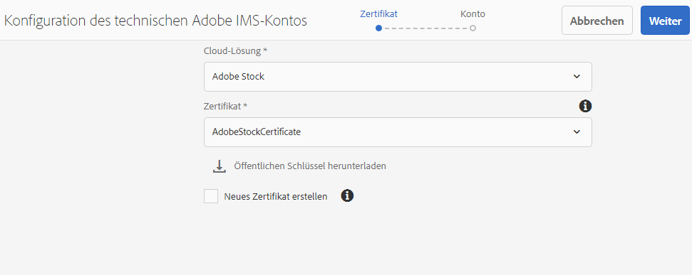
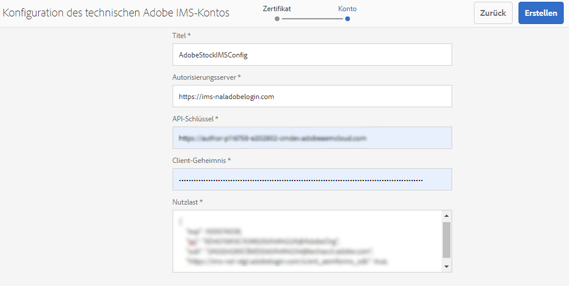
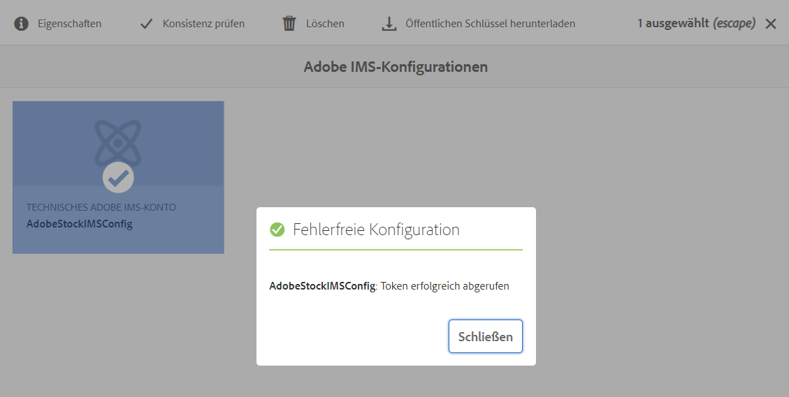
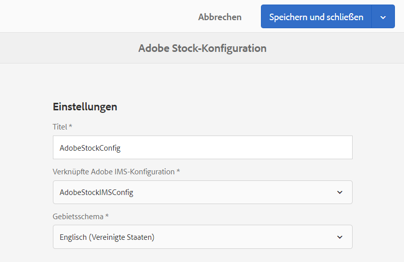
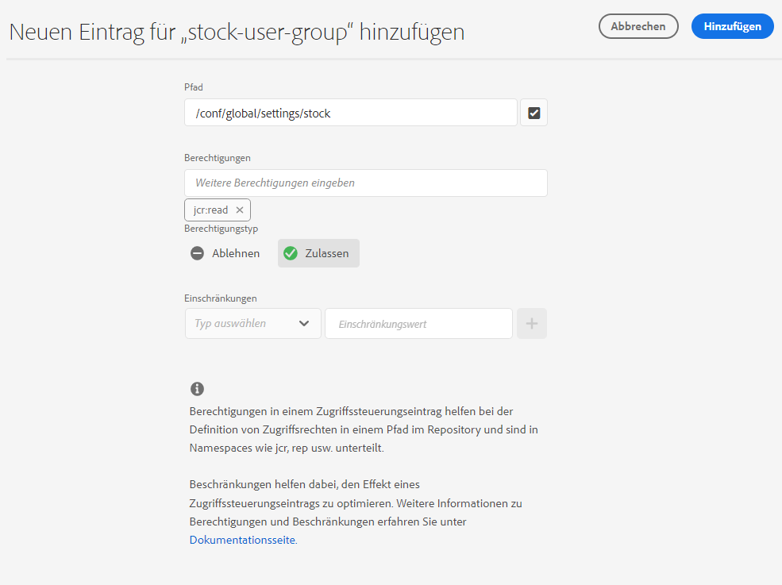
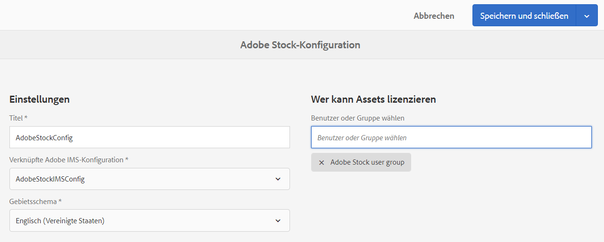
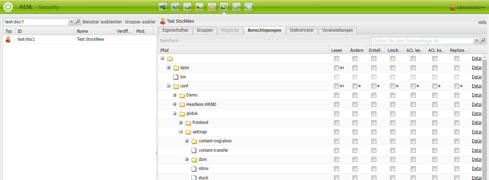
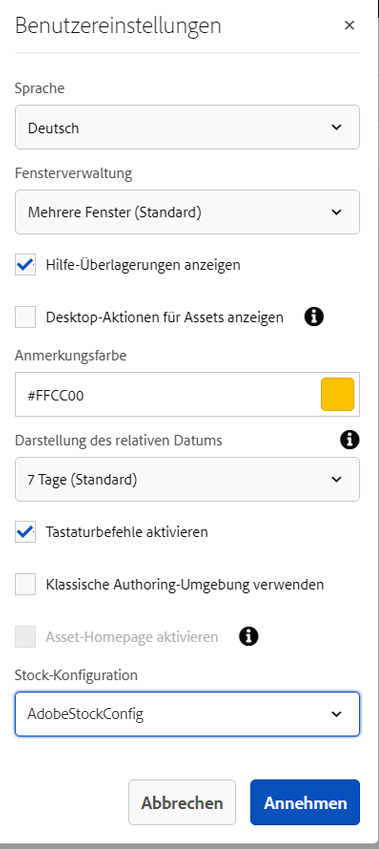
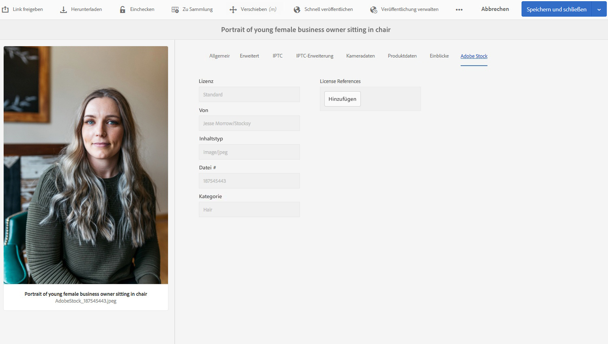

# Verwenden von [!DNL Adobe Stock]-Assets in [!DNL Adobe Experience Manager Assets] {#use-adobe-stock-assets-in-aem-assets}

| Version | Artikellink |
| -------- | ---------------------------- |
| AEM as a Cloud Service | [Hier klicken](https://experienceleague.adobe.com/docs/experience-manager-cloud-service/content/assets/manage/aem-assets-adobe-stock.html?lang=en) |
| AEM 6.5 | Dieser Artikel |
| AEM 6.4 | [Hier klicken](https://experienceleague.adobe.com/docs/experience-manager-64/assets/using/aem-assets-adobe-stock.html?lang=en) |

<!-- old content

[!DNL Experience Manager Assets] provides users the ability to search, preview, save, and license [!DNL Adobe Stock] assets directly from [!DNL Experience Manager]. 

Organizations can integrate their [!DNL Adobe Stock] enterprise plan with [!DNL Experience Manager Assets] to ensure that licensed assets are broadly available for their creative and marketing projects, with the powerful asset management capabilities of [!DNL Experience Manager].

[!DNL Adobe Stock] service provides designers and businesses with access to millions of high-quality, curated, royalty-free photos, vectors, illustrations, videos, templates, and 3D assets for all their creative projects. [!DNL Experience Manager] users are able to quickly find, preview, and license [!DNL Adobe Stock] assets that are saved in [!DNL Experience Manager], without leaving the [!DNL Experience Manager] interface.
-->

<!-- New overview content
-->

Der [!DNL Adobe Stock]-Service bietet Designern und Unternehmen Zugang zu Millionen von hochwertigen, kuratierten und gebührenfreien Fotos, Vektorgrafiken, Illustrationen, Videos, Vorlagen und 3D-Assets für sämtliche Kreativprojekte. 

Das Angebot von [!DNL Adobe Stock] für Unternehmen umfasst standardmäßig Freigabeberechtigungen innerhalb der Organisation. Nachdem ein Asset von einem Benutzer Ihrer Organisation lizenziert wurde, können andere Benutzer Ihrer Organisation dieses Asset identifizieren, herunterladen und verwenden, ohne es erneut lizenzieren zu müssen. Sobald ein Asset von Ihrer Organisation lizenziert wurde, ist das Recht zur Verwendung dieses Assets dauerhaft.

Organisationen können ihr [!DNL Adobe Stock]-Unternehmensabo mit [!DNL Experience Manager Assets] integrieren, damit lizenzierte Assets für kreative und Marketing-Projekte umfassend verfügbar sind und mit den leistungsstarken Asset-Management-Funktionen von [!DNL Experience Manager] verwaltet werden können. [!DNL Experience Manager]-Benutzer können Adobe Stock-Assets, die in [!DNL Experience Manager] gespeichert sind, schnell finden, eine Vorschau anzeigen und die Lizenz abrufen, ohne die [!DNL Experience Manager]-Oberfläche zu verlassen.

<!-- Old content
## Prerequisites {#prerequisites}

The integration requires an [enterprise [!DNL Adobe Stock] plan](https://stockenterprise.adobe.com/).
-->

## Integrieren von [!DNL Experience Manager] und [!DNL Adobe Stock] {#integrate-aem-and-adobe-stock}

[!DNL Experience Manager Assets] bietet Benutzern die Möglichkeit, [!DNL Adobe Stock]-Assets direkt aus [!DNL Experience Manager] zu suchen, eine Vorschau anzuzeigen, sie zu speichern und zu lizenzieren.

**Voraussetzungen**

Die Integration setzt Folgendes voraus:

* Ein [Unternehmens- [!DNL Adobe Stock] Abo](https://stockenterprise.adobe.com/de/home.html)
* Ein Benutzer mit Berechtigungen in Admin Console für das standardmäßige Stock-Produktprofil
* Ein Benutzer mit Berechtigungen für das Entwicklerzugriffsprofil zum Erstellen der Integration in der Adobe Developer Console

Ein Unternehmens-Abo von [!DNL Adobe Stock],

* Bietet Produktberechtigungen für [!DNL Adobe Stock] (Stocks im Zusammenhang mit Experience Manager)
* Guthaben, das für Ihre Stock-Berechtigung in [!DNL Adobe Admin Console] erworben wurde
* Aktiviert die Authentifizierung des Service-Kontos (JWT) innerhalb von [!DNL Adobe Developer Console] für Ihre Stock-Berechtigung
* Ermöglicht die globale Verwaltung der Gutschriften und Lizenzen innerhalb von [!DNL Adobe Admin Console]

Im Rahmen der Berechtigung ist ein standardmäßiges Produktprofil für [!DNL Adobe Stock] in [!DNL Admin Console] vorhanden. Es können mehrere Profile erstellt werden. Diese Profile bestimmen, wer Stock-Assets lizenzieren kann. Ein Benutzer mit direktem Zugriff auf das Produktprofil kann auf [https://stock.adobe.com/](https://stock.adobe.com/de) und Lizenzierung von Stock-Assets. Es gibt jedoch eine andere Methode, den Entwicklerzugriff zu verwenden, um eine Integration (API) zu erstellen, um die Kommunikation zwischen [!DNL Experience Manager] und [!DNL Adobe Stock].

>[!NOTE]
>
>Die Authentifizierung für das Stock-Service-Konto (JWT) ist im Lieferumfang der Stock-Berechtigung für Unternehmen enthalten.
>
>Die Integration unterstützt keine OAuth-Authentifizierung für die Stock-Berechtigung für Unternehmen.

<!-- old content
To allow communication between [!DNL Experience Manager] and [!DNL Adobe Stock], create an IMS configuration and an [!DNL Adobe Stock] configuration in [!DNL Experience Manager].

>[!NOTE]
>
>Only [!DNL Experience Manager] administrators and [!DNL Admin Console] administrators for an organization can perform the integration as it requires administrator privileges.
-->

## Schritte zur Integration von [!DNL Experience Manager] und [!DNL Adobe Stock] {#integration-steps}

Zur Integration von [!DNL Experience Manager] und [!DNL Adobe Stock] führen Sie die folgenden Schritte in der angegebenen Reihenfolge aus:

1. [Abrufen eines öffentlichen Zertifikats](#public-certificate)

   Erstellen Sie in [!DNL Experience Manager] ein IMS-Konto und generieren Sie ein öffentliches Zertifikat (einen öffentlichen Schlüssel).

1. [Erstellen einer Verbindung für ein Service-Konto (JWT)](#createnewintegration)

   Erstellen Sie in [!DNL Adobe Developer Console] ein Projekt für Ihre Organisation von [!DNL Adobe Stock]. Konfigurieren Sie unter dem Projekt eine API mithilfe des öffentlichen Schlüssels, um eine Verbindung für ein Service-Konto (JWT) zu erstellen. Rufen Sie die Anmeldedaten für das Service-Konto und die JWT-Payload-Informationen ab.

1. [Konfigurieren des IMS-Kontos](#create-ims-account-configuration)

   Konfigurieren Sie in [!DNL Experience Manager] das IMS-Konto mit den Anmeldedaten für das Service-Konto und der JWT-Payload.

1. [Konfigurieren von Cloud Service](#configure-the-cloud-service)

   Konfigurieren Sie in [!DNL Experience Manager] einen [!DNL Adobe Stock]-Cloud-Service mit dem IMS-Konto.

### Erstellen einer IMS-Konfiguration {#create-an-ims-configuration}

Die IMS-Konfiguration authentifiziert Ihre [!DNL Experience Manager Assets]-Autoreninstanz mit der [!DNL Adobe Stock]-Berechtigung.

Die IMS-Konfiguration umfasst zwei Schritte:

* [Abrufen eines öffentlichen Zertifikats](#public-certificate)
* [Konfigurieren des IMS-Kontos](#create-ims-account-configuration)

### Abrufen eines öffentlichen Zertifikats {#public-certificate}

Der öffentliche Schlüssel (Zertifikat) authentifiziert Ihr Produktprofil in der Adobe Developer Console.

1. Melden Sie sich bei Ihrer [!DNL Experience Manager Assets] Autoreninstanz. Die Standard-URL ist `http://localhost:4502/aem/start.html`.

1. Navigieren Sie im Bedienfeld **[!UICONTROL Tools]** zu **[!UICONTROL Sicherheit]** > **[!UICONTROL Adobe IMS-Konfigurationen]**.

1. Klicken Sie auf der Seite mit den Adobe IMS-Konfigurationen auf **[!UICONTROL Erstellen]**. Die Seite **[!UICONTROL Technische Konfiguration des Adobe IMS-Kontos]** wird geöffnet.

1. Wählen Sie auf der Registerkarte **[!UICONTROL Zertifikat]** die Option **[!UICONTROL Adobe Stock]** aus der Dropdown-Liste **[!UICONTROL Cloud-Lösung]**.

1. Sie können für die Konfiguration ein Zertifikat erstellen oder ein vorhandenes Zertifikat wiederverwenden.

   Aktivieren Sie das Kontrollkästchen **[!UICONTROL Neues Zertifikat erstellen]** und geben Sie einen **Alias** für den öffentlichen Schlüssel an. Der Alias dient als Name des öffentlichen Schlüssels.

1. Klicken Sie auf **[!UICONTROL Zertifikat erstellen]**. Klicken Sie auf **[!UICONTROL OK]**, um den öffentlichen Schlüssel zu generieren.

1. Klicken Sie auf das Symbol **[!UICONTROL Öffentlichen Schlüssel herunterladen]** und speichern Sie die erhaltene Datei (.crt) auf Ihrem Computer. Der öffentliche Schlüssel wird später zum Konfigurieren der API für Ihren Brand Portal-Mandanten und zum Generieren von Anmeldedaten für Service-Konten in der Adobe-Entwicklerkonsole verwendet.

   Klicken Sie auf **[!UICONTROL Weiter]**.

   

1. Auf der Registerkarte **Konto** wird das Adobe IMS-Konto erstellt, für das die Anmeldedaten des Service-Kontos erforderlich sind.

   Öffnen Sie eine neue Registerkarte und [erstellen Sie eine Verbindung für ein Service-Konto (JWT) in Adobe Developer Console](#createnewintegration).

### Erstellen einer JWT-Verbindung (Service-Konto) {#createnewintegration}

In der Adobe Developer Console werden Projekte und APIs auf Unternehmensebene konfiguriert. Beim Konfigurieren einer API wird eine Service-Konto-Verbindung (JWT-Verbindung) hergestellt. Es gibt zwei Methoden zum Konfigurieren der API: Generieren eines Schlüsselpaars (privater und öffentlicher Schlüssel) oder Hochladen eines öffentlichen Schlüssels. In diesem Beispiel werden die Anmeldedaten für Service-Konten durch Hochladen des öffentlichen Schlüssels generiert.

So generieren Sie die Anmeldedaten für das Service-Konto und die JWT-Payload:

1. Melden Sie sich bei der Adobe Developer Console mit Berechtigungen als Systemadministrator an. Die Standard-URL lautet [https://www.adobe.com/go/devs_console_ui](https://www.adobe.com/go/devs_console_ui).

   Stellen Sie sicher, dass Sie die richtige IMS-Organisation (Stock-Berechtigungen) aus der Dropdown-Liste (Organisation) ausgewählt haben.

1. Klicken Sie auf **[!UICONTROL Neues Projekt erstellen]**. Für Ihre Organisation wird ein leeres Projekt mit einem systemgenerierten Namen erstellt.

   Klicken Sie auf **[!UICONTROL Projekt bearbeiten]**. Aktualisieren Sie **[!UICONTROL Projekttitel]** und **[!UICONTROL Beschreibung]** und klicken Sie anschließend auf **[!UICONTROL Speichern]**.

1. Klicken Sie auf der Registerkarte mit der **[!UICONTROL Projektübersicht]** auf **[!UICONTROL API hinzufügen]**.

1. Wählen Sie im Fenster **[!UICONTROL API hinzufügen]** die Option **[!UICONTROL Adobe Stock]**. Klicken Sie auf **[!UICONTROL Weiter]**.

1. Wählen Sie im Fenster **[!UICONTROL API konfigurieren]** die Authentifizierung **[!UICONTROL Service-Konto (JWT)]**. Klicken Sie auf **[!UICONTROL Weiter]**.

   

1. Klicken Sie auf **[!UICONTROL Öffentlichen Schlüssel hochladen]**. Klicken Sie dann auf **[!UICONTROL Datei auswählen]** und laden Sie den öffentlichen Schlüssel (.crt-Datei) hoch, den Sie im Abschnitt zum [Abrufen des öffentlichen Zertifikats](#public-certificate) heruntergeladen haben. Klicken Sie auf **[!UICONTROL Weiter]**.

1. Überprüfen Sie den öffentlichen Schlüssel und klicken Sie auf **[!UICONTROL Weiter]**.

1. Wählen Sie das Standardproduktprofil **[!UICONTROL Adobe Stock]** und klicken Sie auf **[!UICONTROL Konfigurierte API speichern]**.

1. Sobald die API konfiguriert ist, werden Sie zur Seite mit der API-Übersicht weitergeleitet. Klicken Sie in der linken Navigation unter **[!UICONTROL Anmeldedaten]** auf die Option **[!UICONTROL Service-Konto (JWT)]**. Sie können hier die Anmeldedaten einsehen und weitere Aktionen durchführen, beispielsweise JWT-Token generieren, Anmeldedaten kopieren und Client-Geheimnisse abrufen.

1. Kopieren Sie auf der Registerkarte **[!UICONTROL Client-Anmeldedaten]** die **[!UICONTROL Client-ID]**.

   Klicken Sie auf **[!UICONTROL Client-Geheimnis abrufen]** und kopieren Sie das **[!UICONTROL Client-Geheimnis]**.

   

1. Navigieren Sie zur Registerkarte **[!UICONTROL JWT generieren]** und kopieren Sie die Informationen zur **[!UICONTROL JWT-Payload]**.

Sie können jetzt die Client-ID (API-Schlüssel), das Client-Geheimnis und die JWT-Payload verwenden, um das [IMS-Konto in [!DNL Experience Manager Assets] zu konfigurieren](#create-ims-account-configuration).

### Konfigurieren des IMS-Kontos {#create-ims-account-configuration}

Sie müssen über das [Zertifikat](#public-certificate) und die [Anmeldeinformationen für das Service-Konto (JWT)](#createnewintegration) verfügen, um das IMS-Konto zu konfigurieren.

So konfigurieren Sie das IMS-Konto:

1. Öffnen Sie die IMS-Konfiguration und navigieren Sie zur Registerkarte **[!UICONTROL Konto]**. Sie haben die Seite offen gelassen, während Sie das [öffentliche Zertifikat abgerufen](#public-certificate) haben.

1. Geben Sie einen **[!UICONTROL Titel]** für das IMS-Konto an.

   Geben Sie in das Feld **[!UICONTROL Autorisierungs-Server]** die URL [https://ims-na1.adobelogin.com/](https://ims-na1.adobelogin.com/) ein.

   Geben Sie in das Feld **[!UICONTROL API-Schlüssel]** die Client-ID sowie das **[!UICONTROL Client-Geheimnis]** und **[!UICONTROL Payload]** (JWT-Payload) ein, die Sie beim [Erstellen der Verbindung für das Service-Konto (JWT)](#createnewintegration) kopiert haben.

1. Klicken Sie auf **[!UICONTROL Erstellen]**. Es wird eine IMS-Kontokonfiguration erstellt.

   

1. Wählen Sie die IMS-Kontokonfiguration aus und klicken Sie auf **[!UICONTROL Systemdiagnose]**.

   Klicken Sie im Dialogfeld auf **[!UICONTROL Prüfen]**. Bei erfolgreicher Konfiguration wird eine Meldung angezeigt, dass das *Token erfolgreich abgerufen* wurde.

   

### Konfigurieren von Cloud Service {#configure-the-cloud-service}

So konfigurieren Sie den [!DNL Adobe Stock]-Cloud-Service:

1. Navigieren Sie in der [!DNL Experience Manager] Benutzeroberfläche zu **[!UICONTROL Tools]** > **[!UICONTROL Cloud Services]** > **[!UICONTROL Adobe Stock]**.

1. Klicken Sie auf der Seite [!DNL Adobe Stock Configurations] auf **[!UICONTROL Erstellen]**.

1. Geben Sie einen **[!UICONTROL Titel]** für die Cloud-Konfiguration an.

   Wählen Sie die IMS-Konfiguration aus, die Sie beim [Konfigurieren des IMS-Kontos](#create-ims-account-configuration) erstellt haben.

   Wählen Sie Ihr Gebietsschema aus der Dropdown-Liste aus.

   

1. Klicken Sie auf **[!UICONTROL Speichern und schließen]**.

   Ihre [!DNL Experience Manager Assets]-Autoreninstanz ist jetzt in [!DNL Adobe Stock] integriert. Sie können mehrere [!DNL Adobe Stock]-Konfigurationen (z. B. gebietsschemabasierte Konfigurationen) erstellen. Sie können nun über die [!DNL Experience Manager]-Benutzeroberfläche auf die [!DNL Adobe Stock]-Assets zugreifen, sie durchsuchen und lizenzieren.

   

   >[!NOTE]
   >
   >In diesem Stadium der Integration können nur die Administratoren auf die [!DNL Adobe Stock]-Assets zugreifen, Stock-Assets suchen (mit Omnisearch) und die [!DNL Adobe Stock]-Assets lizenzieren.
   >
   >Administratoren können außerdem Benutzer oder Gruppen zum [!DNL Adobe Stock]-Cloud-Service hinzufügen und diesen Benutzern ohne Administratorrechte in [!DNL Experience Manager] Berechtigungen für den Zugriff auf die Stock-Konfiguration erteilen.

1. Um Benutzer oder Gruppen hinzuzufügen, wählen Sie die [!DNL Adobe Stock]-Cloud-Konfiguration und klicken Sie auf **[!UICONTROL Eigenschaften]**.

1. Suchen Sie nach den Benutzern oder Gruppen, denen Sie Zugriffsberechtigungen für die Adobe Stock-Konfiguration zugewiesen haben. Siehe [Zuweisen von Berechtigungen an Benutzergruppen](#assign-permissions-to-group).

## Zuweisen von Berechtigungen an Benutzergruppen {#assign-permissions-to-group}

Administratoren können Benutzergruppen erstellen und bestimmten Benutzern oder Gruppen Berechtigungen für den Zugriff auf den [!DNL Adobe Stock]-Cloud-Service erteilen.

Im Folgenden finden Sie die Berechtigungen, die ein Benutzer benötigt, um Adobe Stock-Assets zu suchen und zu lizenzieren:

* Konfigurieren des Pfads: `/conf/global/settings/stock`
* Berechtigungen: `jcr:read`
* Berechtigungstyp: `Allow`

Sie können eine Benutzergruppe erstellen oder einer vorhandenen Benutzergruppe Berechtigungen zuweisen. Berechtigungen können über die [!DNL Experience Manager Assets]-Benutzeroberfläche oder über die [!DNL User Admin]-Konsole erteilt werden.

**So gewähren Sie einer Benutzergruppe von [!DNL Experience Manager] Zugriff:**

1. Navigieren Sie in der [!DNL Experience Manager]-Benutzeroberfläche zu **[!UICONTROL Tools]** > **[!UICONTROL Sicherheit]** > **[!UICONTROL Gruppen]**. Erstellen Sie eine Benutzergruppe für [!DNL Adobe Stock].

1. Navigieren Sie zu **[!UICONTROL Tools]** > **[!UICONTROL Sicherheit]** > **[!UICONTROL Berechtigungen]**.

1. Suchen Sie im linken Bereich nach der Benutzergruppe und fügen Sie einen neuen **[!UICONTROL Zugriffskontrolleintrag (ACE)]** für Adobe Stock hinzu.

   * Konfigurieren des Pfads: `/conf/global/settings/stock`
   * Berechtigungen: `jcr:read`
   * Berechtigungstyp: `Allow`

   Klicken Sie auf **[!UICONTROL Hinzufügen]**.

   

1. Navigieren Sie zu **[!UICONTROL Tools]** > **[!UICONTROL Cloud-Services]** > **[!UICONTROL Adobe Stock]** Wählen Sie die [!DNL Adobe Stock]-Cloud-Konfiguration und klicken Sie auf **[!UICONTROL Eigenschaften]**.

1. Fügen Sie die neu erstellte Benutzergruppe zur [!DNL Adobe Stock]-Konfiguration hinzu. Klicken Sie auf **[!UICONTROL Speichern und schließen]**.

   

**So gewähren Sie einem Benutzer von [!DNL User Admin Console] Zugriff:**

1. Öffnen Sie die Admin Console des [!DNL Experience Manager]-Benutzers. Die Standard-URL ist `http://localhost:4502/userdamin`.

1. Suchen Sie im linken Bereich nach dem Benutzer, indem Sie die `user_id` oder `name` eingeben. Doppelklicken Sie, um die Benutzereigenschaften zu öffnen.

1. Navigieren Sie zur Registerkarte **[!UICONTROL Berechtigungen]** und erlauben Sie `read`-Berechtigungen für die [!DNL Adobe Stock]-Cloud-Konfiguration: `/conf/global/settings/stock`.

   >[!CAUTION]
   >
   >Wenn die Cloud-Konfiguration nicht zulässig ist, kann der Benutzer nur in der [!DNL Experience Manager]-Benutzeroberfläche auf **[!UICONTROL Assets]** zugreifen.
   >
   >Um den Zugriff auf [!UICONTROL Assets] und [!DNL Adobe Stock]-Assets zu ermöglichen, stellen Sie sicher, dass die Cloud-Konfiguration für den Benutzer zulässig ist.

1. Klicken Sie auf **[!UICONTROL Speichern]**, um die Berechtigungen zu aktualisieren.

   

1. Fügen Sie den Benutzer oder die Gruppe zur [!DNL Adobe Stock]-Cloud-Konfiguration hinzu.

## Zugreifen auf Adobe Stock-Assets {#access-stock-assets}

Ein Benutzer, der kein Administrator ist, aber Berechtigungen für die [!DNL Adobe Stock]-Cloud-Konfiguration hat, kann die [!DNL Adobe Stock]-Assets über die [!DNL Experience Manager]-Benutzeroberfläche suchen und lizenzieren.

Der Benutzer muss in einem zusätzlichen Schritt die [!DNL Adobe Stock]-Cloud-Konfiguration aktivieren, bevor er auf [!DNL Adobe Stock]-Assets zugreifen kann. Es handelt sich um eine einmalige Aktivität. Wenn dem Benutzer Berechtigungen für mehrere [!DNL Adobe Stock]-Cloud-Konfigurationen zugewiesen sind, kann der Benutzer die gewünschte Konfiguration in den **[!UICONTROL Benutzereinstellungen]** auswählen.

So aktivieren Sie die [!DNL Adobe Stock]-Cloud-Konfiguration:

1. Melden Sie sich bei [!DNL Experience Manager] an.

1. Klicken Sie oben rechts auf das Benutzersymbol und dann auf **[!UICONTROL Benutzereinstellungen]**. Das Fenster **[!UICONTROL Benutzereinstellungen]** wird geöffnet.

1. Wählen Sie die gewünschte **[!UICONTROL Stock-Konfiguration]** aus der Dropdown-Liste aus und klicken Sie auf **[!UICONTROL Akzeptieren]**, um die Konfiguration zu aktivieren.

   

1. Navigieren Sie zu **[!UICONTROL Assets]** > **[!UICONTROL Adobe Stock]**. Sie können jetzt [!DNL Adobe Stock]-Assets anzeigen, suchen und lizenzieren.

In der folgenden Tabelle wird erläutert, wie die Benutzerberechtigungen beim Zugriff auf die [!DNL Adobe Stock]-Assets funktionieren:

| Benutzer | Gruppe | Berechtigungen | Akzeptieren der Stock-Konfiguration in den Benutzereinstellungen | Zugriff auf Assets | Zugriff auf Adobe Stock |
| --- | --- | --- | --- | --- | --- |
| admin | Nicht zutreffend | Alle | Nicht zutreffend | Ja | Ja |
| test-doc1 | DAM-Benutzer | /conf/global/settings/stock/cloud-config | Ja | Ja | Ja |
| test-doc1 | DAM-Benutzer | /conf/global/settings/stock/cloud-config | Nein | Fehler: Laden der Daten fehlgeschlagen | Nein |
| test-doc1 | DAM-Benutzer | **allow**: /conf/global/settings/stock **deny**: /cloud-config | Stock-Konfiguration ist nicht sichtbar | Ja | Nein |

## Verwenden und Verwalten von [!DNL Adobe Stock]-Assets in [!DNL Experience Manager] {#usemanage}

Mit dieser Funktion können Organisationen ihren Benutzern die Arbeit mit [!DNL Adobe Stock]-Assets in [!DNL Experience Manager Assets] ermöglichen. Benutzer können aus der [!DNL Experience Manager]-Benutzeroberfläche heraus nach [!DNL Adobe Stock]-Assets suchen und die erforderlichen Assets lizenzieren.

Sobald ein [!DNL Adobe Stock]-Asset in [!DNL Experience Manager] lizenziert ist, kann es wie ein typisches Asset verwendet und verwaltet werden. Benutzer können Assets in [!DNL Experience Manager] suchen und eine Vorschau zu diesen anzeigen, Assets kopieren und veröffentlichen, Assets in [!DNL Brand Portal] teilen, Assets per [!DNL Experience Manager]-Desktop-Programm aufrufen und verwenden und vieles mehr.

![Suchen nach [!DNL Adobe Stock]-Assets und Filtern der Ergebnisse aus Ihrem [!DNL Adobe Experience Manager]-Arbeitsbereich](assets/adobe-stock-search-results-workspace.png)

**A.** Suche nach Assets, die den Assets ähneln, deren [!DNL Adobe Stock]-ID angegeben ist. **B.** Suche nach Assets, die Ihrer Form- und Ausrichtungswahl entsprechen. **C.** Suche nach einem von mehreren unterstützten Asset-Typen **D.** Öffnen oder Reduzieren des Filterbereichs **E.** Lizenzieren und Speichern des ausgewählten Assets in [!DNL Experience Manager] **F.** Speichern des Assets in [!DNL Experience Manager] mit Wasserzeichen **G.** Erkunden von Assets auf der [!DNL Adobe Stock]-Website, die dem ausgewählten Asset ähnlich sind **H.** Anzeigen der ausgewählten Assets auf der [!DNL Adobe Stock]-Website **I.** Anzahl der ausgewählten Assets aus den Suchergebnissen **J.** Umschalten zwischen Kartenansicht und Listenansicht

### Suchen von Assets {#find-assets}

Ihre [!DNL Experience Manager]-Benutzer können in [!DNL Experience Manager] und [!DNL Adobe Stock] nach Assets suchen. Wenn die Suche nicht auf [!DNL Adobe Stock] beschränkt ist, werden Suchergebnisse aus [!DNL Experience Manager] und [!DNL Adobe Stock] angezeigt.

* Um nach [!DNL Adobe Stock]-Assets zu suchen, klicken Sie auf **[!UICONTROL Navigation]** > **[!UICONTROL Assets]** > **[!UICONTROL Adobe Stock durchsuchen]**.

* Um in [!DNL Adobe Stock] und [!DNL Experience Manager Assets] nach Assets zu suchen, klicken Sie auf .

Geben Sie alternativ `Location: Adobe Stock` in die Suchleiste ein, um [!DNL Adobe Stock]-Assets auszuwählen. [!DNL Experience Manager] bietet erweiterte Filterfunktionen, mit denen Benutzer schnell die gewünschten Assets finden können. Hierzu stehen Filter, wie z. B. unterstützte Asset-Typen, Bildausrichtung und Lizenzstatus, zur Verfügung.

>[!NOTE]
>
>Assets, die in [!DNL Adobe Stock] gesucht wurden, werden in [!DNL Experience Manager] angezeigt. [!DNL Adobe Stock]-Assets werden nur dann abgerufen und im [!DNL Experience Manager]-Repository gespeichert, wenn Benutzer [Assets speichern](/help/assets/aem-assets-adobe-stock.md#saveassets) oder [Assets lizenzieren und speichern](/help/assets/aem-assets-adobe-stock.md#licenseassets). Assets, die bereits in [!DNL Experience Manager] gespeichert sind, werden angezeigt und hervorgehoben, um einfachen Zugriff und eine schnelle Referenzierung zu ermöglichen. Außerdem werden die [!DNL Stock]-Assets mit einigen zusätzlichen Metadaten gespeichert, um die Quelle als [!DNL Stock] anzugeben.

![Suchfilter in [!DNL Experience Manager] und hervorgehobene [!DNL Adobe Stock]-Assets in den Suchergebnissen](assets/aem-search-filters2.jpg)

### Speichern und Anzeigen erforderlicher Assets {#saveassets}

Wählen Sie ein Asset aus, das Sie in [!DNL Experience Manager] speichern möchten. Klicken Sie in der oberen Symbolleiste auf [!UICONTROL Speichern] und geben Sie den Namen und Speicherort des Assets an. Unlizenzierte Assets werden lokal mit Wasserzeichen gespeichert.

Wenn Sie erneut nach Assets suchen, werden die gespeicherten Assets durch ein Symbol hervorgehoben, um anzuzeigen, dass diese Assets in [!DNL Experience Manager Assets] verfügbar sind.

>[!NOTE]
>
>Bei den kürzlich hinzugefügten Assets wird das Symbol „Neu“ anstelle des Symbols „Lizenziert“ angezeigt.

### Lizenzieren von Assets {#licenseassets}

Benutzer können [!DNL Adobe Stock]-Assets über das Kontingent ihres [!DNL Adobe Stock]-Unternehmensplans lizenzieren. Wenn Sie ein Asset lizenzieren, wird es ohne Wasserzeichen gespeichert und ist in der Suche sowie für die Verwendung in [!DNL Experience Manager Assets] verfügbar.

![Dialogfeld zum Lizenzieren und Speichern von [!DNL Adobe Stock]-Assets in [!DNL Experience Manager Assets]](assets/aem-stock_licenseandsave.jpg)

### Anzeigen von Metadaten und Asset-Eigenschaften {#access-metadata-and-asset-properties}

Benutzer können Metadaten, einschließlich der [!DNL Adobe Stock]-Metadateneigenschaften für Assets, die in [!DNL Experience Manager] gespeichert wurden, öffnen bzw. eine Vorschau dieser Daten anzeigen und **[!UICONTROL Lizenzreferenzen]** für Assets hinzufügen. Die Änderungen an der Lizenzreferenz werden zwischen [!DNL Experience Manager] und der [!DNL Adobe Stock]-Website jedoch nicht synchronisiert.

Benutzer können die Eigenschaften für lizenzierte und unlizenzierte Assets anzeigen.

## Bekannte Einschränkungen {#known-limitations}

* **Probleme bei der Integration mit [!DNL Experience Manager] Service Pack 6.5.7.0 und höher**: Bei der Integration mit [!DNL Experience Manager] 6.5.7.0 und höher. Das Problem wird derzeit getestet und dürfte in [!DNL Experience Manager] 6.5.11.0. Kontakt [!DNL Customer Support] für einen sofortigen Hotfix.

* **Die Funktion zur Einschränkung von Benutzern bei der Lizenzierung funktioniert nicht ordnungsgemäß**: Alle Benutzer mit `read`-Berechtigungen für die Stock-Konfiguration dürfen die [!DNL Adobe Stock]-Assets suchen und lizenzieren.

* **Benutzer ohne Administratorrechte müssen die [!DNL Adobe Stock]-Cloud-Konfiguration manuell aktivieren**: Im Fenster **[!UICONTROL Benutzereinstellungen]** zeigt die **[!UICONTROL Stock-Konfiguration]** die [!DNL Adobe Stock]-Cloud-Konfiguration zwar als aktiviert an, aber sie funktioniert für Benutzer ohne Administratorrechte nicht. Der Benutzer muss auf die Schaltfläche **[!UICONTROL Akzeptieren]** klicken, um die Stock-Konfiguration zu aktivieren. In Ermangelung dieses Schritts gibt das System eine Fehlermeldung beim Zugriff auf **[!UICONTROL Assets]** zurück.

* **Redaktionelle Bildwarnung wird nicht angezeigt**: Bei der Lizenzierung eines Bilds können Benutzer nicht prüfen, ob ein Bild ausschließlich der redaktionellen Verwendung dient. Um zu verhindern, dass Bilder falsch verwendet werden, können Administratoren den Zugriff auf redaktionelle Assets über die Admin Console deaktivieren.

* **Falscher Lizenztyp wird angezeigt**: Es ist möglich, dass in [!DNL Experience Manager] ein falscher Lizenztyp für ein Asset angezeigt wird. Benutzer können sich bei der [!DNL Adobe Stock]-Website anmelden, um den richtigen Lizenztyp zu ermitteln.

* **Referenzfelder und Metadaten werden nicht synchronisiert**: Wenn ein Benutzer ein Lizenzreferenzfeld aktualisiert, werden die Lizenzreferenzdaten in [!DNL Experience Manager] aktualisiert, jedoch nicht auf der [!DNL Adobe Stock]-Website. Ebenso werden Änderungen, die Benutzer an den Referenzfeldern auf der [!DNL Adobe Stock]-Website vornehmen, nicht mit [!DNL Experience Manager] synchronisiert.

>[!MORELIKETHIS]
>
>* [Video-Tutorial zur Verwendung von [!DNL Adobe Stock] Assets mit [!DNL Experience Manager Assets]](https://experienceleague.adobe.com/docs/experience-manager-learn/assets/creative-workflows/adobe-stock.html?lang=de)
>* [[!DNL Adobe Stock] Hilfe zum Unternehmensplan](https://helpx.adobe.com/de/enterprise/using/adobe-stock-enterprise.html)
>* [[!DNL Adobe Stock] Häufig gestellte Fragen (FAQ)](https://helpx.adobe.com/de/stock/faq.html)

<!--old content

### Create an IMS configuration {#create-an-ims-configuration}

1. In the [!DNL Experience Manager] user interface, navigate to **[!UICONTROL Tools]** > **[!UICONTROL Security]** > **[!UICONTROL Adobe IMS Configurations]**. Click **[!UICONTROL Create]** and select **[!UICONTROL Cloud Solution]** > **[!UICONTROL Adobe Stock]**.
1. Either reuse an existing certificate or select **[!UICONTROL Create new certificate]**.
1. Click **[!UICONTROL Create certificate]**. Once created, download the public key. Click **[!UICONTROL Next]**. Leave the [!UICONTROL Adobe IMS Technical Account Configuration] screen open to provide the required values shortly.
1. Access [Adobe Developer Console](https://console.adobe.io). Ensure that your account has administrator permissions for the organization for which the integration is required.
1. Click **[!UICONTROL Create new project]** and click **[!UICONTROL Add API]**. Select **[!UICONTROL Adobe Stock]** from the list of APIs that are available to you. Select [!UICONTROL OAUTH 2.0 Web].
1. Provide **[!UICONTROL Default redirect URI]** and **[!UICONTROL Redirect URI pattern]** values. Click **[!UICONTROL Save configured API]**. Copy the generated ID and secret.
1. In [!UICONTROL Adobe IMS Technical Account Configuration] screen, provide the values in the boxes titled **[!UICONTROL Title]**, **[!UICONTROL Authorization Server]**, **[!UICONTROL API Key]**, **[!UICONTROL Client Secret]**, and **[!UICONTROL Payload]**. For detailed information about these values, see [JWT authentication quick start](https://www.adobe.io/authentication/auth-methods.html#!AdobeDocs/adobeio-auth/master/JWT/JWT.md).

-->

<!-- TBD: Update the URL to update the terminology when AIO team updates their documentation URL. Logged issue github.com/AdobeDocs/adobeio-auth/issues/63.
-->

<!--
### Create [!DNL Adobe Stock] configuration in [!DNL Experience Manager] {#create-adobe-stock-configuration-in-aem}

1. In the [!DNL Experience Manager], navigate to **[!UICONTROL Tools]** > **[!UICONTROL Cloud Services]** > **[!UICONTROL Adobe Stock]**.
1. Click **[!UICONTROL Create]** to create a configuration and associate it with your existing IMS Configuration. Select `PROD` as the environment parameter.
1. In **[!UICONTROL Licensed Assets Path]** field, leave a location as is. Do not change the location where you want to store the [!DNL Adobe Stock] assets.
1. Complete creation by adding all the required properties. Click **[!UICONTROL Save & Close]**.
1. Add [!DNL Experience Manager] users or groups, who can license the assets.

>[!NOTE]
>
>If there are multiple [!DNL Adobe Stock] configurations, select the desired configuration in [!UICONTROL User Preferences] panel. To access the panel from [!DNL Experience Manager] home page, click the user icon and then click **[!UICONTROL User Preferences]** > **[!UICONTROL Stock Configuration]**.
-->

