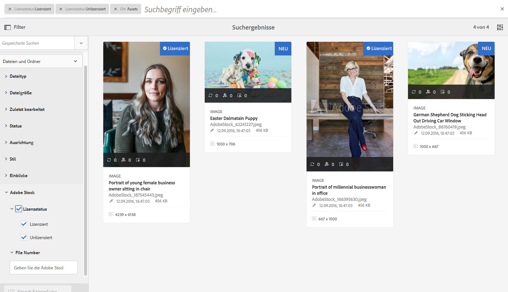
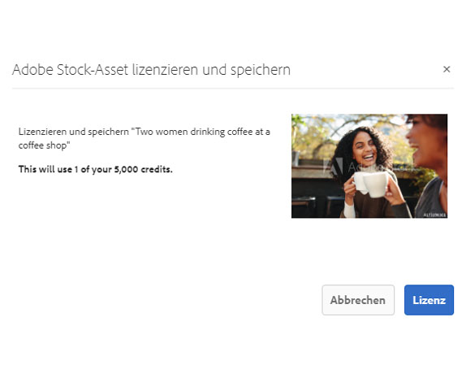

# Verwenden Sie [!DNL Adobe Stock] Assets in [!DNL Adobe Experience Manager Assets] {#use-adobe-stock-assets-in-aem-assets}

Organizations can integrate their [!DNL Adobe Stock] enterprise plan with [!DNL Experience Manager Assets] to ensure that licensed assets are broadly available for their creative and marketing projects, with the powerful asset management capabilities of [!DNL Experience Manager].

[!DNL Adobe Stock] Der Dienst bietet Designern und Unternehmen Zugriff auf Millionen von hochwertigen, kuratierten, gebührenfreien Fotos, Vektoren, Illustrationen, Videos, Vorlagen und 3D-Assets für all ihre kreativen Projekte. [!DNL Experience Manager] Benutzer können Assets, die in [!DNL Adobe Stock] der Benutzeroberfläche gespeichert sind, schnell finden, Vorschau erteilen und lizenzieren, ohne die [!DNL Experience Manager][!DNL Experience Manager] Oberfläche zu verlassen.

## Voraussetzungen {#prerequisites}

Für die Integration ist ein Adobe Stock [Plan](https://stockenterprise.adobe.com/)für Unternehmen erforderlich.

## Integrieren [!DNL Experience Manager] und [!DNL Adobe Stock] {#integrate-aem-and-adobe-stock}

To allow communication between [!DNL Experience Manager] and [!DNL Adobe Stock], create an IMS configuration and an [!DNL Adobe Stock] configuration in [!DNL Experience Manager].

>[!NOTE]
>
>Only [!DNL Experience Manager] administrators and [!DNL Admin Console] administrators for an organization can perform the integration as it requires administrator privileges.

### Erstellen einer IMS-Konfiguration       {#create-an-ims-configuration}

1. In the [!DNL Experience Manager] user interface, navigate to **[!UICONTROL Tools]** > **[!UICONTROL Security]** > **[!UICONTROL Adobe IMS Configurations]**. Klicken Sie auf **[!UICONTROL Erstellen]** und wählen Sie **[!UICONTROL Cloudlösung]** > **[!UICONTROL Adobe Stock]**.
1. Verwenden Sie entweder ein bestehendes Zertifikat oder wählen Sie **[!UICONTROL Neues Zertifikat erstellen]** aus.
1. Klicken Sie auf **[!UICONTROL Zertifikat erstellen]**. Laden Sie nach der Erstellung den öffentlichen Schlüssel herunter. Klicken Sie auf **[!UICONTROL Weiter]**.
1. Add the downloaded public key to your [!DNL Adobe Developer Console] service account. Klicken Sie auf **[!UICONTROL Weiter]**. Lassen Sie den Bildschirm &quot;Konfiguration [!UICONTROL des technischen Kontos von] Adobe IMS&quot;geöffnet, um die Werte in Kürze bereitzustellen.
1. Zugriff auf [Adobe Developer Console](https://console.adobe.io). Stellen Sie sicher, dass Ihr Konto über Administratorberechtigungen für das Unternehmen verfügt, für das die Integration erforderlich ist.
1. Klicken Sie auf Neues Projekt **[!UICONTROL erstellen]** und dann auf **[!UICONTROL Hinzufügen API]**. Wählen Sie **[!UICONTROL Adobe Stock]** aus der Liste der APIs, die Ihnen [!UICONTROL zur Verfügung stehen]. Wählen Sie [!UICONTROL OAUTH 2.0 Web]. Konfigurieren und kopieren Sie die verschiedenen angezeigten Werte.
1. In [!DNL Experience Manager] provide the values in the fields titled **[!UICONTROL Title]**, **[!UICONTROL Authorization Server]**, **[!UICONTROL API Key]**, **[!UICONTROL Client Secret]**, and **[!UICONTROL Payload]**. Detaillierte Informationen zu diesen Werten finden Sie im Beginn [zur](https://www.adobe.io/authentication/auth-methods.html#!AdobeDocs/adobeio-auth/master/JWT/JWT.md)JWT-Authentifizierung.

<!-- TBD: Update the URL when the new URL is available. Logged issue github.com/AdobeDocs/adobeio-auth/issues/63.
-->

### Erstellen Sie [!DNL Adobe Stock] die Konfiguration in [!DNL Experience Manager] {#create-adobe-stock-configuration-in-aem}

1. In the [!DNL Experience Manager] user interface, navigate to **[!UICONTROL Tools]** > **[!UICONTROL Cloud Services]** > **[!UICONTROL Adobe Stock]**.
1. Klicken Sie auf **[!UICONTROL Erstellen]**, um eine Konfiguration zu erstellen und sie Ihrer bestehenden IMS-Konfiguration zuzuordnen. Wählen Sie `PROD` als Umgebungsparameter aus.
1. Lassen Sie den Speicherort im Feld **[!UICONTROL Pfad lizenzierter Assets]** unverändert. Do not change the location where you want to store the [!DNL Adobe Stock] assets.
1. Schließen Sie die Erstellung ab, indem Sie alle erforderlichen Eigenschaften hinzufügen. Klicken Sie auf **[!UICONTROL Speichern und schließen]**.
1. Add [!DNL Experience Manager] users or groups, who can license the assets.

>[!NOTE]
>
>If there are multiple [!DNL Adobe Stock] configurations, select the desired configuration in User Preferences panel (**[!UICONTROL AEM]** > **[!UICONTROL User Icon]** > **[!UICONTROL User Preferences]** > **[!UICONTROL Stock Configuration]**).

## Verwenden und Verwalten von [!DNL Adobe Stock] Assets in [!DNL Experience Manager] {#usemanage}

Using this capability, organizations can allow its users to work using [!DNL Adobe Stock] assets in [!DNL Experience Manager Assets]. From within the [!DNL Experience Manager] user interface, users can search [!DNL Adobe Stock] assets and license the required assets.

Once an [!DNL Adobe Stock] asset is licensed in [!DNL Experience Manager], it can be used and managed like a typical asset. In [!DNL Experience Manager], the users can search and preview the assets; copy and publish the assets; share the assets on [!DNL Brand Portal]; access and use the assets via [!DNL Experience Manager] desktop app; and so on.

*Abbildung: Suchen Sie nach[!DNL Adobe Stock]Assets und filtern Sie die Ergebnisse aus Ihrer[!DNL Experience Manager]Oberfläche.*

**A.**[!DNL Adobe Stock] Suchen Sie Assets, die den Assets ähneln, deren ID bereitgestellt wird. **B.** Nach Assets suchen, die Ihrer Form- und Ausrichtungswahl entsprechen. **C.** Suchen Sie nach einem der unterstützten Asset-Typen **D.** Öffnen oder reduzieren Sie den Bereich Filter **E.** Legen Sie eine Lizenz für das ausgewählte Asset in [!DNL Experience Manager] F **fest.** Speichern Sie das Asset [!DNL Experience Manager] mit dem Wasserzeichen **G.** Durchsuchen Sie Assets auf [!DNL Adobe Stock] Websites, die dem ausgewählten Asset **H ähnlich sind.** Ansicht der ausgewählten Assets auf [!DNL Adobe Stock] Website **I.** Anzahl der ausgewählten Assets aus den Suchergebnissen **J.** Wechseln zwischen Ansicht und Ansicht der Liste

### Suchen von Assets {#find-assets}

Your [!DNL Experience Manager] users, can search for assets in both, [!DNL Experience Manager] and [!DNL Adobe Stock]. When the search location is not limited to [!DNL Adobe Stock], the search results from [!DNL Experience Manager] and [!DNL Adobe Stock] are displayed.

* To search for [!DNL Adobe Stock] assets, click **[!UICONTROL Navigation]** > **[!UICONTROL Assets]** > **[!UICONTROL Search Adobe Stock]**.

* Um nach Assets zu suchen [!DNL Adobe Stock] und [!DNL Experience Manager Assets], klicken Sie auf search .

Alternatively, start typing `Location: Adobe Stock` in the search bar to select [!DNL Adobe Stock] assets. [!DNL Experience Manager] bietet erweiterte Filterfunktionen, mit denen Benutzer schnell die gewünschten Assets finden können. Hierzu stehen Filter, wie z. B. unterstützte Asset-Typen, Bildausrichtung und Lizenzstatus, zur Verfügung.

>[!NOTE]
>
>Assets searched from [!DNL Adobe Stock] are just displayed in [!DNL Experience Manager]. [!DNL Adobe Stock] Assets werden erst abgerufen und im [!DNL Experience Manager] Repository gespeichert, nachdem ein Benutzer ein Asset [oder](/help/assets/aem-assets-adobe-stock.md#saveassets) Lizenzen [gespeichert und ein Asset](/help/assets/aem-assets-adobe-stock.md#licenseassets)gespeichert hat. Assets that are already stored in [!DNL Experience Manager] are displayed and highlighted for ease of reference and access. Also, the [!DNL Stock] assets are saved with some additional metadata to indicate the source as [!DNL Stock].

*Abbildung: Suchen Sie in den Suchergebnissen nach Filtern[!DNL Experience Manager]und markierten[!DNL Adobe Stock]Assets.*

### Speichern und Anzeigen erforderlicher Assets {#saveassets}

Select an asset that you want to save in [!DNL Experience Manager]. Click [!UICONTROL Save] in the toolbar at the top and provide the name and location of the asset. Unlizenzierte Assets werden lokal mit Wasserzeichen gespeichert.

Next time when you search for assets, the saved assets are highlighted with a badge, to indicate that such assets are available in [!DNL Experience Manager Assets].

>[!NOTE]
>
>Bei den kürzlich hinzugefügten Assets wird das Symbol „Neu“ anstelle des Symbols „Lizenziert“ angezeigt.

### Lizenzieren von Assets {#licenseassets}

Benutzer können [!DNL Adobe Stock] Assets über die Quote ihres [!DNL Adobe Stock] Unternehmensplans lizenzieren. When you license an asset, it is saved without a watermark and is available for searching and using in [!DNL Experience Manager Assets].

*Abbildung: Dialogfeld zum Lizenzieren und Speichern von[!DNL Adobe Stock]Assets[!DNL Experience Manager Assets].*

### Anzeigen von Metadaten und Asset-Eigenschaften {#access-metadata-and-asset-properties}

Users can access and preview the metadata, including the [!DNL Adobe Stock] metadata properties for the assets saved in [!DNL Experience Manager], and add **[!UICONTROL License References]** for an asset. However, the updates to license reference are not synced between [!DNL Experience Manager] and [!DNL Adobe Stock] website.

Benutzer können die Eigenschaften für lizenzierte und unlizenzierte Assets anzeigen.

*Abbildung: Ansicht und Zugriff auf Metadaten und Lizenzverweise für gespeicherte Assets.*

## Bekannte Einschränkungen {#known-limitations}

* **Eine redaktionelle Bildwarnung wird nicht angezeigt**: Bei der Lizenzierung eines Bildes können Benutzer nicht überprüfen, ob es sich bei einem Bild um eine redaktionelle Verwendung handelt. Um zu verhindern, dass Bilder falsch verwendet werden, können Administratoren den Zugriff auf redaktionelle Assets über die Admin Console deaktivieren.

* **Falscher Lizenztyp wird angezeigt**: Es ist möglich, dass ein falscher Lizenztyp in [!DNL Experience Manager] für ein Asset angezeigt wird. Users can log into the [!DNL Adobe Stock] website to see the license type.

* **Referenzfelder und Metadaten werden nicht synchronisiert**: Wenn ein Benutzer ein Lizenzreferenzfeld aktualisiert, werden die Lizenzverweisinformationen in der Website aktualisiert, [!DNL Experience Manager] jedoch nicht auf der [!DNL Adobe Stock] Website. Similarly, if the user updates the reference fields on the [!DNL Adobe Stock] website, the updates are not synchronized in [!DNL Experience Manager].

>[!MORELIKETHIS]
>
>* [Videoschulung zur Verwendung von Adobe Stock-Assets mit Experience Manager Assets](https://helpx.adobe.com/de/experience-manager/kt/assets/using/stock-assets-feature-video-use.html)
>* [Hilfe zum Adobe Stock-Unternehmensplan](https://helpx.adobe.com/de/enterprise/using/adobe-stock-enterprise.html)
>* [Häufig gestellte Fragen zu Adobe Stock](https://helpx.adobe.com/de/stock/faq.html)

