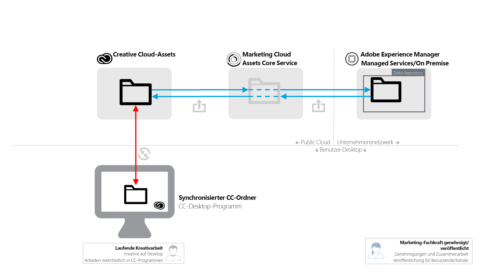
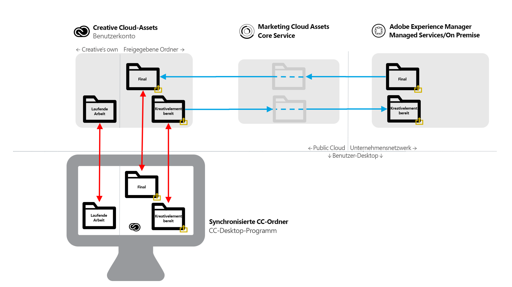

# [!DNL Adobe Experience Manager] zur  [!DNL Adobe Creative Cloud] Ordnerfreigabe {#aem-to-creative-cloud-folder-sharing-best-practices}

>[!CAUTION]
>
>Die Funktion [!DNL Experience Manager] bis [!DNL Creative Cloud] Ordnerfreigabe wird nicht mehr unterstützt. Adobe empfiehlt dringend die Verwendung neuerer Funktionen wie [Adobe Asset Link](https://helpx.adobe.com/de/enterprise/admin-guide.html/enterprise/using/adobe-asset-link.ug.html) oder [Experience Manager-Desktop-Programm](https://experienceleague.adobe.com/docs/experience-manager-desktop-app/using/using.html?lang=de). Weitere Informationen finden Sie unter [Best Practices für die Integration von Experience Managern und Creative Clouden](/help/assets/aem-cc-integration-best-practices.md).

[!DNL Adobe Experience Manager] kann so konfiguriert werden, dass Benutzer in Ordner  [!DNL Assets] für die Benutzer von  [!DNL Adobe Creative Cloud] Apps freigeben können, sodass sie als freigegebene Ordner im  [!DNL Adobe Creative Cloud] Assets-Dienst verfügbar sind. Die Funktion kann zum Austausch von Dateien zwischen Kreativ-Teams und [!DNL Assets] Benutzern verwendet werden, insbesondere wenn kreative Benutzer keinen Zugriff auf die [!DNL Assets]-Implementierung haben (sie befinden sich nicht im Unternehmensnetzwerk).

Dieser Integrationstyp kann in den folgenden Anwendungsfällen verwendet werden, insbesondere bei der Arbeit mit Benutzern, die keinen direkten Zugriff auf [!DNL Assets] haben:

* [!DNL Assets] -Benutzer können eine Reihe bestimmter digitaler Assets für Benutzer von  [!DNL Adobe Creative Cloud] Dateien freigeben (z. B. eine Kreativbeschreibung und eine Reihe genehmigter Assets für die Designarbeit für eine neue Marketingaktivität).
* [!DNL Assets] -Benutzer erhalten neue Dateien, die von  [!DNL Adobe Creative Cloud] App-Benutzern erstellt wurden.

>[!NOTE]
>
>Bevor Sie dieses Dokument lesen, können Sie sich die allgemeinen Best Practices für die Integration von Experience Managern und Creative Clouden von ](/help/assets/aem-cc-integration-best-practices.md) ansehen, um einen Überblick über die Integration zu erhalten.[

## Übersicht {#overview}

[!DNL Experience Manager] Die  [!DNL Creative Cloud] Ordnerfreigabe beruht auf der serverseitigen Freigabe von Ordnern und Dateien zwischen  [!DNL Assets] und  [!DNL Creative Cloud] Konten. Kreativprofis, die das [!DNL Creative Cloud]-Desktop-Programm auf ihren Desktops verwenden, können die freigegebenen Ordner zusätzlich mithilfe der [!DNL Adobe CreativeSync]-Technologie direkt auf ihren Datenträgern verfügbar machen.

Das folgende Diagramm bietet einen Überblick über die Integration.

Die Integration umfasst folgende Elemente:

* **[!DNL Experience Manager Assets]** im Unternehmensnetzwerk (Managed Services oder On-Premise) bereitgestellt werden: Die Ordnerfreigabe wird hier initiiert.
* **[!DNL Adobe Marketing Cloud Assets]Hauptdienst**: fungiert als Vermittler zwischen  [!DNL Experience Manager] und  [!DNL Creative Cloud] Speicherdiensten. Ein Administrator einer Organisation, die die Integration verwendet, muss eine Vertrauensbeziehung zwischen der Marketing Cloud-Organisation und der [!DNL Assets]-Implementierung herstellen. Sie definieren außerdem [eine Liste der zugelassenen Creative Cloud-Mitwirkenden](https://experienceleague.adobe.com/docs/core-services/interface/assets/t-admin-add-cc-user.html), die [!DNL Assets]-Benutzer für zusätzliche Sicherheitsfunktionen freigeben können.

* **[!DNL Creative Cloud]Assets-Webdienste**  (Web-Benutzeroberfläche für Speicherung und  [!DNL Creative Cloud] Dateien): Hier können bestimmte Creative Cloud-App-Benutzer, für die ein  [!DNL Assets] Ordner freigegeben wurde, die Einladung annehmen und den Ordner in ihrem Creative Cloud-Kontospeicher anzeigen.
* **Creative Cloud-Desktop-Programm**: (Optional) Ermöglicht den direkten Zugriff auf freigegebene Ordner/Dateien vom Desktop des kreativen Benutzers über die Synchronisierung mit dem  [!DNL Creative Cloud] Asset-Speicher.

## Funktionen und Einschränkungen {#characteristics-and-limitations}

* **Einwegübertragung von Änderungen:**  Dateiänderungen werden nur in eine Richtung propagiert - vom System ([!DNL Experience Manager] oder  [!DNL Creative Cloud Assets]), in dem das Asset ursprünglich erstellt (hochgeladen) wurde. Die Integration bietet keine vollautomatische Zweiwegsynchronisierung zwischen beiden Systemen.
* **Versionierung:**

   * [!DNL Experience Manager] erstellt bei Aktualisierungen nur dann Versionen eines Assets, wenn die Datei von stammt und dort aktualisiert wird.[!DNL Experience Manager]
   * [!DNL Creative Cloud] Assets bietet eine eigene [Versionierungsfunktion](https://helpx.adobe.com/de/creative-cloud/help/versioning-faq.html), die für laufende Aktualisierungen vorgesehen ist (Aktualisierungen werden bis zu zehn Tage gespeichert).

* **Speicherplatzbeschränkungen:** Die Größe und die Menge der ausgetauschten Dateien ist durch die für kreative Benutzer  [angegebenen Asset-](https://helpx.adobe.com/de/creative-cloud/kb/file-storage-quota.html) Creative Cloud (abhängig von der Abonnementebene) und eine Beschränkung der Dateigröße auf maximal 5 GB beschränkt. Darüber hinaus wird der Speicherplatz durch das Assets-Kontingent beschränkt, die das Unternehmen im zentralen Assets-Dienst von Adobe Marketing Cloud festgelegt hat.

* **Speicherplatzanforderungen:** Die Dateien in freigegebenen Ordnern müssen ebenfalls physisch in  [!DNL Experience Manager] und dann in  [!DNL Creative Cloud] Konto gespeichert werden, wobei eine zwischengespeicherte Kopie im  [!DNL Marketing Cloud Assets] Hauptdienst enthalten sein muss.
* **Netzwerke und Bandbreite:** Die Dateien in freigegebenen Ordnern und alle Updates müssen über das Netzwerk zwischen den Systemen übertragen werden. Sie sollten sicherstellen, dass nur relevante Dateien und Aktualisierungen freigegeben werden.
* **Ordnertyp**: Die Freigabe eines  [!DNL Assets] Ordners vom Typ  `sling:OrderedFolder`wird im Zusammenhang mit der Freigabe in nicht unterstützt  [!DNL Adobe Marketing Cloud]. Wenn Sie einen Ordner freigeben möchten, wählen Sie beim Erstellen in [!DNL Assets] nicht die Option [!UICONTROL Bestellt] aus.

## Best Practices {#best-practices}

Zu den Best Practices für die Nutzung der Ordnerfreigabe [!DNL Experience Manager] bis [!DNL Creative Cloud] gehören:

* **Überlegungen zum Volumen:** [!DNL Experience Manager] und die  [!DNL Creative Cloud] Ordnerfreigabe sollten verwendet werden, um eine kleinere Anzahl von Dateien freizugeben, z. B. für eine bestimmte Kampagne oder Aktivität. Verwenden Sie andere Verteilungsmethoden (z. B. [!DNL Assets Brand Portal]) oder das [!DNL Experience Manager]-Desktop-Programm, um größere Asset-Sets wie alle genehmigten Assets in der Organisation freizugeben.
* **Vermeiden Sie die Freigabe tiefer Hierarchien:**  Die Freigabe funktioniert rekursiv und lässt keine selektive Aufhebung der Freigabe zu. In der Regel sollten nur Ordner ohne Unterordner oder mit einer sehr flachen Hierarchie, z. B. 1 Unterordnerebene, für die Freigabe berücksichtigt werden.
* **Separate Ordner für die unidirektionale Freigabe:** Separate Ordner sollten verwendet werden, um endgültige Assets von  [!DNL Assets] in  [!DNL Creative Cloud] Dateien freizugeben und Kreativ-bereitgestellte Assets wieder aus  [!DNL Creative Cloud] Dateien in  [!DNL Assets]freizugeben. Zusammen mit einer guten Benennungskonvention für diese Ordner wird eine besser verständliche Arbeitsumgebung für [!DNL Assets]- und [!DNL Creative Cloud]-Benutzer erstellt.
* **Vermeiden Sie WIP im freigegebenen Ordner:** Der freigegebene Ordner sollte nicht für laufende Arbeiten verwendet werden. Verwenden Sie einen separaten Ordner in Creative Cloud Files , um Arbeiten durchzuführen, die häufige Dateiänderungen erfordern.
* **Beginnen Sie neue Arbeit außerhalb des freigegebenen Ordners:** Neue Designs (Kreativdateien) sollten im separaten WIP-Ordner in den Creative Cloud-Dateien gestartet werden. Sobald sie für die Freigabe für  [!DNL Assets] Benutzer bereit sind, sollten sie verschoben oder im freigegebenen Ordner gespeichert werden.
* **Vereinfachung der Freigabestruktur:** Für eine besser verwaltbare Funktionsweise sollten Sie über eine Vereinfachung der Freigabestruktur nachdenken. Statt für alle kreativen Benutzer freizugeben, sollten [!DNL Assets]-Ordner nur für Teammitarbeiter freigegeben werden, z. B. für einen Creative Director oder Teammanager. Auf diese Weise kann der Leiter des Kreativbereichs endgültige Assets erhalten, über die Arbeitsaufteilung entscheiden und dann die Designer in ihren eigenen Creative Cloud-Konten an den unfertigen Assets arbeiten lassen. Sie können Funktionen für die Zusammenarbeit mit Creative Clouden verwenden, um die Arbeit zu koordinieren, Assets, die bereit sind, für [!DNL Assets] freizugeben, auszuwählen und schließlich in ihren kreativen freigegebenen Ordner zu verschieben.

Das folgende Diagramm veranschaulicht eine Beispielkonfiguration zum Erstellen neuer Designs auf der Basis bestehender endgültiger Assets von [!DNL Assets].

