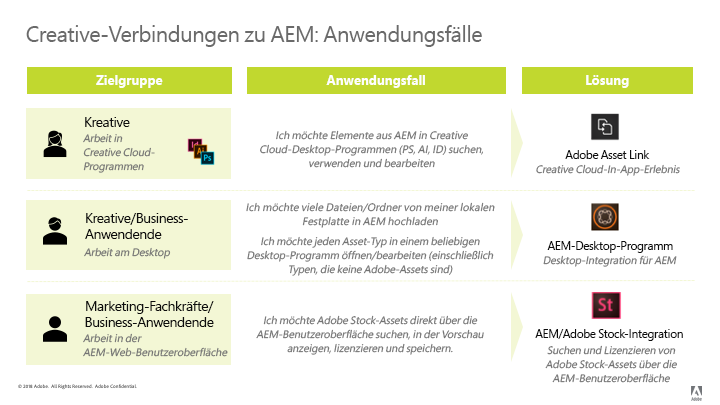

# [!DNL Adobe Experience Manager] und  [!DNL Creative Cloud] Best Practices für die Integration  {#aem-and-creative-cloud-integration-best-practices}

[!DNL Adobe Experience Manager Assets] ist eine DAM-Lösung (Digital Asset Management),  [!DNL Adobe Creative Cloud] die DAM-Benutzer bei der Zusammenarbeit mit Kreativteams unterstützen und so die Zusammenarbeit bei der Inhaltserstellung optimieren kann.

[!DNL Adobe Creative Cloud] bietet Kreativ-Teams ein System von Lösungen und Services, um digitale Assets zu erstellen. Es umfasst Desktop- und Mobilanwendungen, Cloud-Services wie Datenspeicherung mit Desktop-Synchronisierung oder Web-Erfahrung sowie Märkte wie [!DNL Adobe Stock].

Lesen Sie weiter, um mehr darüber zu erfahren, welche Integration Sie zwischen Desktop und DAM-Enterprise-System abhängig vom Nutzungsszenario und von den entsprechenden Best Practices für die Verbindungs-Workflows wählen sollten.

>[!NOTE]
>
>[!DNL Experience Manager] zum  [!DNL Creative Cloud] Freigeben von Ordnern wird nicht mehr unterstützt und in diesem Handbuch nicht mehr behandelt. Adobe empfiehlt die Verwendung neuerer Funktionen wie [Adobe Asset Link](https://helpx.adobe.com/de/enterprise/using/adobe-asset-link.html) oder [Experience Manager Desktop-App](https://experienceleague.adobe.com/docs/experience-manager-desktop-app/using/troubleshoot.html), um dem Kreativbenutzer Zugriff auf die unter [!DNL Experience Manager] verwalteten Assets zu gewähren.

## Anforderungen an die Zusammenarbeit von Kreativen, Marketingexperten und DAM-Benutzern {#collaboration-needs-of-creatives-marketers-and-dam-users}

| Voraussetzungen | Anwendungsfall | Betroffene Oberflächen |
|---|---|---|
| Vereinfachtes Desktop-Erlebnis für Kreative | Straffen Sie den Zugriff auf Assets aus einem DAM ([!DNL Experience Manager Assets]) für Kreativprofis oder allgemeiner für Benutzer auf dem Desktop, die in nativen Asset-Erstellungsanwendungen arbeiten. Sie benötigen eine einfache und unkomplizierte Möglichkeit, um Änderungen zu finden, zu verwenden (öffnen), zu bearbeiten und zu speichern sowie neue Dateien hochzuladen.[!DNL Experience Manager] | Win- oder Mac-Desktop; [!DNL Creative Cloud]-Apps |
| Bereitstellung hochwertiger, gebrauchsfertiger Elemente von [!DNL Adobe Stock] | Marketer tragen zu einer schnelleren Inhaltserstellung bei, indem sie beim Beschaffen von und Suchen nach Assets helfen. Kreativprofis verwenden die genehmigten Assets direkt in ihren Kreativ-Tools. | [!DNL Experience Manager Assets];  [!DNL Adobe Stock] Marktplatz; Metadatenfelder |
| Verteilen und Freigeben von Assets nach Organisationen | Interne Abteilungen/Zweigstellen und externe Partner, Distributoren und Agenturen verwenden die genehmigten Assets, die von der übergeordneten Organisation freigegeben wurden. Die Organisation möchte die erstellten Assets sicher und nahtlos für eine größere Wiederverwendung freigeben. | Brand Portal, Asset Share Commons |

## Adobe-Angebote zur Unterstützung von Kooperationsbedarf {#adobe-offerings-to-support-the-collaboration-need}

| Wertangebot für die betroffenen Benutzer | Adobe-Angebot | Betroffene Oberflächen |
|---|---|---|
| Kreative Benutzer können Assets aus [!DNL Experience Manager] entdecken, öffnen und verwenden, Änderungen bearbeiten und hochladen sowie neue Dateien in [!DNL Experience Manager] hochladen, ohne die Apps [!DNL Creative Cloud] zu verlassen.[!DNL Experience Manager] | [Adobe Asset Link](https://helpx.adobe.com/enterprise/using/adobe-asset-link.html) | .[!DNL Adobe Photoshop], [!DNL Adobe Illustrator] und [!DNL Adobe InDesign]. |
| Geschäftsbenutzer vereinfachen das Öffnen und Verwenden von Assets, das Bearbeiten und Hochladen von Änderungen zu [!DNL Experience Manager] und das Hochladen neuer Dateien von der Desktop-Umgebung nach [!DNL Experience Manager]. Sie nutzen eine generische Integration, um jeden Asset-Typ in nativen Desktop-Programmen, auch Adobe-fremden, zu öffnen. | [Experience Manager-Desktop-Programm](https://experienceleague.adobe.com/docs/experience-manager-desktop-app/using/using.html) | [!DNL Experience Manager] Desktop App auf Windows- und Mac-Desktop |
| Marketingexperten und Geschäftsbenutzer können die [!DNL Adobe Stock]-Assets innerhalb von [!DNL Experience Manager] entdecken, Vorschau, lizenzieren und speichern und verwalten. Lizenzierte und gespeicherte Assets bieten ausgewählte [!DNL Adobe Stock]-Metadaten für eine bessere Verwaltung. | [Integration von Experience Manager und Adobe Stock](aem-assets-adobe-stock.md) | [!DNL Experience Manager] Weboberfläche |

Dieser Artikel konzentriert sich in erster Linie auf die ersten beiden Aspekte der Zusammenarbeit. Die Verteilung und Beschaffung von Vermögenswerten im entsprechende Maß wird kurz als Verwendungsfall genannt. Für solche Lösungen sollten Sie Adobe Brand Portal oder Asset Share Commons beachten. Alternativlösungen wie [Markenportal](https://experienceleague.adobe.com/docs/experience-manager-brand-portal/using/home.html), Lösungen, die basierend auf [Asset-Freigabe-Commons](https://adobe-marketing-cloud.github.io/asset-share-commons/)-Komponenten erstellt werden können, [Linkfreigabe](/help/assets/link-sharing.md), unter Verwendung von [Experience Manager-Assets](/help/assets/manage-assets.md) sollten auf der Grundlage spezifischer Anforderungen überprüft werden.

### Zuordnen von Nutzungsszenarien und Adobe-Lösungen  {#mapping-of-use-cases-and-adobe-solutions}

<!-- TBD: Add some info about XD integration and possibly info about DA v2.0.
-->

| Nutzungsszenario  | [!DNL Adobe Asset Link] | [!DNL Experience Manager]-Desktop-Programm | Anmerkungen/sonstige Lösungen |
|---|---|---|---|
| Discover - DAM-Ordner durchsuchen | Ja | [!DNL Experience Manager] Web-Oberfläche und Desktop-Aktionen |  |
| Discover - Zugriff auf DAM-Sammlungen | Ja | [!DNL Experience Manager] Web-Oberfläche und Desktop-Aktionen |  |
| Discover - Suche nach Assets aus DAM | Ja | [!DNL Experience Manager] Web-Oberfläche und Desktop-Aktionen |  |
| Verwenden – Öffnen von Assets | Ja | Ja | [Öffnen über die Web-Benutzeroberfläche](manage-assets.md#previewing-assets) oder den Finder |
| Verwenden - Platzieren Sie Assets aus DAM in ein Dokument | Ja – Einbetten | Ja – Verknüpfen oder Einbetten | [!DNL Experience Manager] Desktop App ermöglicht den Zugriff auf Assets als Dateien im lokalen Dateisystem. Diese Links in den nativen Programmen werden durch lokale Pfade dargestellt. |
| Bearbeiten – Öffnen zur Bearbeitung | Ja – Checkout-Aktion | Ja – Öffnen-Aktion (über die Netzwerkfreigabe) | Beim [Checkout in AAL](https://helpx.adobe.com/de/enterprise/using/manage-assets-using-adobe-asset-link.html) wird standardmäßig das Asset für das Creative Cloud-Speicherkonto des Benutzers (synchronisiert durch das Creative Cloud-Programm) gespeichert. |
| Bearbeiten - Arbeiten, die außerhalb von DAM ausgeführt werden | Ja – Asset im mit dem Desktop synchronisierten Creative Cloud-Speicherkonto des Benutzers verfügbar. | Ja |  |
| Bearbeiten – Hochladen von Änderungen | Ja – [Checkin-Aktion](https://helpx.adobe.com/enterprise/using/manage-assets-using-adobe-asset-link.html) mit optionalem Kommentar | Ja |  |
| Hochladen – einzelne Datei | Ja – Hochladen des aktuellen aktiven Dokuments | Ja | [Hochladen über die Web-Oberfläche](manage-assets.md#uploading-assets) |
| Hochladen – mehrere Dateien/hierarchische Ordnerstrukturen | Nein | Ja | [Hochladen über die Web-Oberfläche](manage-assets.md#uploading-assets) oder über benutzerdefinierte Skripten oder Tools. |
| Sonstiges – Benutzer und Anmeldung | Erkennung des Creative Cloud-Benutzers, der beim Creative Cloud-Desktop-Programm angemeldet ist (SSO) | [!DNL Experience Manager] Benutzer und Berechtigungen | Benutzer beider Lösungen zählen auf das [!DNL Experience Manager] Benutzerkontingent. |
| Sonstiges – Netzwerk und Zugriff | Erfordert Zugriff vom Desktop des Benutzers auf die [!DNL Experience Manager]-Bereitstellung über das Netzwerk | Erfordert Zugriff vom Desktop des Benutzers auf die [!DNL Experience Manager]-Bereitstellung über das Netzwerk | [!DNL Adobe Asset Link] hat keine Netzwerk-Proxy-Umgebung. |
| Sonstiges – Migrieren einer großen Anzahl von Assets | Nein | Nein | [Handbuch zur Asset-Migration](assets-migration-guide.md) |

Um Nutzungsszenarien zum Verteilen von Assets zu unterstützen, sollten andere Lösungen in Betracht gezogen werden:

* [Branding ](https://experienceleague.adobe.com/docs/experience-manager-brand-portal/using/home.html) Portalfor ein konfigurierbares SaaS-Add-on  [!DNL Experience Manager Assets] zum Veröffentlichen von Assets.
* Benutzerdefinierte Lösungen, erstellt auf Grundlage der [Asset Share Commons](https://adobe-marketing-cloud.github.io/asset-share-commons/)-Code-Basis
* [!DNL Experience Manager][-Linkfreigabe](/help/assets/link-sharing.md), um Assets ad hoc mithilfe von Links freizugeben
* [Experience Manager Assets Web-](/help/assets/manage-assets.md) Schnittstelle mit durch  [!DNL Experience Manager] Zugriffskontrolle-Setup abgesicherten Bereichen und mit notwendigen IT-/Netzwerkkonfigurationsanpassungen, die diesen externen Nutzern Zugriff gewähren  [!DNL Experience Manager].

## Grundlegende Konzepte und Nutzungsszenarien {#key-concepts-and-use-cases}

### Glossar der allgemeinen Begriffe {#glossary-of-common-terms}

* **Laufende Arbeit oder laufende kreative Arbeit (Work-In-Progress, WIP):** Eine Phase im Asset-Lebenszyklus, in der ein Asset mehrfach geändert wird und in der Regel noch nicht zur Freigabe für breitere Teams bereit ist.
* **Kreativfähige Assets:** [!DNL Assets] die für ein breiteres Team freigegeben werden können oder die vom Kreativteam für die Freigabe für Marketing- oder LOB-Teams ausgewählt oder genehmigt wurden.
* **Asset-Genehmigungen:** Der Genehmigungsprozess, der für Assets ausgeführt wird, die bereits auf DAM hochgeladen wurden. Dazu gehören in der Regel Markengenehmigungen, Genehmigungen usw.
* **Abgeschlossenes Asset:** Ein Asset, für das alle   Genehmigungen/Metadaten-Tagging durchgeführt wurden und das bereit für die Verwendung durch das breitere Team ist. Ein solches Asset wird in DAM gespeichert und allen (bzw. allen interessierten) Benutzern zur Verfügung gestellt. Es kann in Marketing-Kanälen oder von Kreativ-Teams verwendet werden, um Designs zu erstellen.
* **Kleinere Asset-Aktualisierung/-Änderung:** Schnelle, kleine Änderung an einem digitalen Asset. Diese wird häufig aufgrund einer Retuschieranfrage oder einer kleineren Bearbeitungsanfrage, einer Asset-Überprüfung oder einer Genehmigung (z. B. Neupositionierung, Änderung der Textgröße, Anpassung der Sättigung/Helligkeit, Farbe usw.) durchgeführt.
* **Größere Asset-Aktualisierung/-Änderung:** Änderung eines digitalen Assets, die viel Arbeit erfordert und manchmal über einen längeren Zeitraum erfolgen muss. Diese umfasst in der Regel mehrere Änderungen. Das Asset muss während der Aktualisierung mehrmals gespeichert werden. Bei umfangreichen Asset-Aktualisierungen wird das Asset in der Regel in eine WIP-Phase versetzt.
* **DAM:** Digital Asset Management. In diesem Dokument ist es mit [!DNL Experience Manager Assets] synonym, sofern nicht ausdrücklich anders angegeben.
* **Kreativer Benutzer:** Kreativprofi, der digitale Assets mit Creative Cloud-Programmen und -Services erstellt. In einigen Fällen kann ein kreativer Benutzer Mitglied eines Kreativ-Teams sein, das möglicherweise Creative Cloud verwendet, aber keine digitalen Assets erstellt (z. B. Creative Director oder Creative Team Manager).
* **DAM-Benutzer:** Ein typischer Benutzer eines DAM-Systems. Je nach Organisation kann ein DAM-Benutzer ein Marketing- oder Nicht-Marketing-Benutzer sein, z. B. Branchenbenutzer, Bibliothekar, Vertriebsmitarbeiter usw.

### Überlegungen bei der Verwendung von [!DNL Experience Manager] und [!DNL Creative Cloud] Integration {#considerations-when-using-aem-and-creative-cloud-integration}

* Siehe [Best Practices für die Desktop-App](https://experienceleague.adobe.com/docs/experience-manager-desktop-app/using/troubleshoot.html?lang=en#best-practices-to-prevent-troubles)
* Siehe [Adobe Stock-Integration](aem-assets-adobe-stock.md)
* Weitere Informationen finden Sie unter [Adobe Asset Link](https://helpx.adobe.com/enterprise/using/adobe-asset-link.html)

Dies ist eine kurze Zusammenfassung der Best Practices für [!DNL Experience Manager] und [!DNL Creative Cloud] Integration. Lesen Sie den Rest dieses Dokuments, um detaillierte Informationen dazu zu erhalten.

* **Für kreative Benutzer, die in Photoshop, InDesign oder Illustrator arbeiten: Der Asset Link &quot;** Adobe&quot;bietet die beste Benutzererfahrung, einschließlich einer sauberen Handhabung der laufenden Bearbeitung von Assets, die aus dem Projekt ausgecheckt wurden  [!DNL Experience Manager].
* **Zur Vereinfachung des Zugriffs auf Assets vom Desktop für ein beliebiges generisches Dateiformat oder eine Anwendung:** Verwenden Sie die  [!DNL Experience Manager] Desktop-App.
* **Erläutern Sie, warum und wann Assets in DAM gespeichert werden:** Aktualisierungen, die dem breiteren Team in Ihrem Unternehmen zur Verfügung gestellt werden.
* **Beachten des Volumens freigegebener Assets:** Wenn Ihr Anwendungsfall die Asset-Verteilung ist, könnten Governance und Sicherheit die wichtigsten Aspekte sein. Erwägen Sie die Verwendung von Tools, die für eine skalierte Vorgehensweise entwickelt wurden, wie z. B. Brand Portal.
* **Wissenswertes über den Asset-Lebenszyklus:** Sie müssen wissen, welche Assets in Ihrer Organisation von den verschiedenen Teams genutzt werden.
* **Sorgfältige Verarbeitung häufiger Asset-Speichervorgänge:** Adobe Asset Link übernimmt diese Aufgabe für Sie – mit PS, AI und ID. Führen Sie für andere Programme keine laufenden Arbeitsaufgaben im zugeordneten/freigegebenen Ordner aus, es sei denn, Sie benötigen alle Änderungen in DAM.

### Zugriff auf [!DNL Adobe Stock]-Assets von [!DNL Assets] {#access-to-adobe-stock-assets-from-aem-assets}

[Experience Manager und Adobe Stock ](/help/assets/aem-assets-adobe-stock.md) Integration bieten  [!DNL Experience Manager] Benutzern die Möglichkeit, Assets von  [!DNL Adobe Stock] nach  [!DNL Experience Manager]zu suchen, zu Vorschau, zu lizenzieren und zu speichern. Die lizenzierten und gespeicherten [!DNL Stock]-Assets haben [!DNL Stock]-Metadaten ausgewählt, mit denen sie mit zusätzlichen Filtern gesucht werden können.

Einige wichtige Punkte zu dieser Integration:

* Wenn Assets aus dem Adoben-Bestand auf [!DNL Experience Manager] gespeichert werden, werden sie zu einem normalen [!DNL Assets]-Element, wobei die Binärdatei im [!DNL Experience Manager]-Repository gespeichert wird. Einige mit [!DNL Adobe Stock] zusammenhängende Metadaten werden für das Asset in [!DNL Experience Manager] gespeichert. Andernfalls sieht der Erfassungsvorgang genauso aus wie für jede andere Datei. Wenn beispielsweise Smart-Tags aktiv sind, werden die Tags beim Speichern diesen Assets hinzugefügt.
* Das unter [!DNL Experience Manager] gespeicherte Asset ist eine Kopie, kein Link zurück zu [!DNL Adobe Stock].

**Arbeiten mit Assets, die von  [!DNL Adobe Stock] in  [!DNL Experience Manager] in gespeichert wurden[!DNL Creative Cloud]**. Diese Integration ist unabhängig von [!DNL Adobe Asset Link], aber [!DNL Adobe Asset Link] erkennt diese von [!DNL Stock] gespeicherten Assets auf diese Weise und zeigt zusätzliche Metadaten und ein [!DNL Adobe Stock]-Logo auf diesen Assets in der [!DNL Adobe Asset Link]-Erweiterungs-Benutzeroberfläche in [!DNL Photoshop], [!DNL Illustrator] oder [!DNL InDesign] an. Die Dateien stehen zum Durchsuchen, Öffnen usw. zur Verfügung, da es sich bei ihnen um normale Assets handelt, wenn sie unter [!DNL Experience Manager] gespeichert werden.
Creative-Benutzer, die in [!DNL Creative Cloud]-Apps mit der Erweiterung [!DNL Adobe Asset Link] arbeiten, können nicht nur auf bereits lizenzierte Assets von [!DNL Adobe Stock] bis [!DNL Experience Manager] zugreifen, sondern auch im Bedienfeld [!DNL Creative Cloud] &quot;Bibliotheken&quot;nach Assets suchen, Vorschauen durchführen und [!DNL Adobe Stock] lizenzieren.
[!DNL Assets] von  [!DNL Adobe Stock] lizenzierten und gespeicherten Assets  [!DNL Experience Manager] werden für breiter angelegte Teams verfügbar, die auf die  [!DNL Experience Manager Assets] Bereitstellung zugreifen, während kreative Elemente, die Assets  [!DNL Adobe Stock] über das  [!DNL Creative Cloud] Bibliothekenbedienfeld lizenzieren, sie für sich selbst nur standardmäßig in ihrem  [!DNL Creative Cloud] Konto verfügbar machen.

<!-- 
TBD: A condensed version of the below content is better placed in the Adobe DAM introduction article.
-->

## Informationen zum Speichern von Assets in DAM {#about-storing-assets-in-a-dam}

Für das Entwickeln eines effizienten Workflows zwischen Kreativ-Teams und Marketing-/Branchen-Teams sowie für die Auswahl der besten Begleitfunktionen ist es wichtig zu verstehen, wann und warum Assets in DAM gespeichert werden.

### Warum Assets in DAM gespeichert werden   {#why-assets-are-stored-in-dam}

Das Speichern von Assets in DAM macht sie leicht zugänglich und auffindbar. Es wird sichergestellt, dass die Assets von verschiedenen Benutzern in der gesamten Organisation oder im gesamten System genutzt werden, z. B. von Kunden, Partnern usw.

Die meisten Unternehmen entscheiden sich dafür, nur Assets zu speichern, die für die nachgelagerten Marketing-/LOB-Prozesse relevant sind (Veröffentlichung auf Kanälen wie Web-Kanal über [!DNL Experience Manager Sites] oder andere Kanal, die von Adobe Experience Cloud - Marketing Cloud, Advertising Cloud und Analytics Cloud gemessen werden, Bereitstellung für Benutzer/Partner usw.). Außerdem speichern Organisationen Assets, für die möglicherweise ein Prüfungs-/Genehmigungsprozess in DAM erfolgt. Auf diese Weise werden hauptsächlich Assets in DAM gespeichert, die mit hoher Wahrscheinlichkeiten genutzt werden, und das Speichern von Assets im Leerlauf wird vermieden.

Die Speicherung von Assets hängt außerdem von Überlegungen zu technischen Aspekten und zur Ressourcennutzung ab. DAM bietet zusätzliche Services rund um gespeicherte Assets, darunter Extrahieren von Metadaten, Versionierung, Erstellen von Vorschauen/Transcodierung, Verwalten von Referenzen und Hinzufügen von Informationen zur Zugriffssteuerung. Diese Services erfordern zusätzlich Zeit und Infrastrukturressourcen.

Häufig ist das Speichern aller Assets und Aktualisierungen nicht empfehlenswert. Beispiel: Wenn Aktualisierungen von schlechter Qualität sind und einen unverhältnismäßigen Ressourcenverbrauch aufweisen, sollten die Assets nicht in DAM gespeichert werden.

#### Wann Assets in DAM gespeichert werden   {#when-assets-are-stored-in-dam}

Kreativ-Teams (und Organisationen) sind in der Regel nicht daran interessiert, Assets in jeder Phase des Asset-Lebenszyklus zu speichern. Beispielsweise vermeiden sie das Speichern von Assets in den folgenden Fällen:

* Assets, die noch nicht abgeschlossen sind, oder zum Experimentieren verwendet werden.
* Assets, die den Prüfungszyklus des Kreativ-Teams/internen Teams nicht bestehen.
* Verglichen mit dem fraglichen Asset verfügt das Team über bessere Kandidaten, um seine Arbeit für externe Teams zu repräsentieren.

In der Regel werden Assets der folgenden Klassen in DAM gespeichert:

* Assets, die einen bestimmten Reifegrad erreicht haben und als bereit zur Freigabe für andere Benutzer gelten.
* Assets, die vorab vom Kreativ-Team ausgewählt wurden.
* Bestimmte Asset-Formate, die vom Marketing-Team verwendet werden können oder abhängig von einem bestimmten Vertrag bzw. einer Vereinbarung angefordert wurden (z. B. aus RAW-Dateien konvertierte JPG-Dateien, TIFF-Dateien/-Bilder aus PSD-Originaldateien).

#### Wann Aktualisierungen von Assets in DAM gespeichert werden   {#when-updates-to-assets-are-stored-in-dam}

In der Regel sollten nur Aktualisierungen von Assets in DAM gespeichert werden, die für den Großteil der DAM-Benutzer relevant sind. Dadurch wird sichergestellt, dass Benutzern (Marketing- und ähnliche Funktionen) in der DAM-Asset-Zeitleiste nur relevante Versionen angezeigt werden.

Normalerweise handelt es sich dabei um Änderungen in Bezug auf die wichtigsten Meilensteine im Asset-Lebenszyklus. Beispielsweise sollte das ursprüngliche fertige Marketing-Asset oder eine offizielle Aktualisierung basierend auf Anfragen/Überprüfungen durch das Kreativ-Team in DAM gespeichert und versioniert werden.

Die Aktualisierung des Kreativ-Teams zur Überprüfung durch das Marketing-Team nach einer Änderungsanfrage für ein vorhandenes Asset in DAM ist ein Beispiel für eine relevante Aktualisierung. Diese sollte als Referenzmaterial oder zum Zurücksetzen auf die letzte Version in DAM gespeichert und versioniert werden.

Es folgen Beispiele für Updates, die normalerweise nicht relevant sind:

* Frühe Versionen von Assets, die hochgeladen wurden, bevor sie für die Marketingüberprüfung bereit waren
* Häufige kreative Änderungen am Asset in der WIP-Phase, bevor die Kreativ- und Marketing-Teams das Asset für fertig erklären

### Benutzerzugriff auf DAM {#user-access-to-dam}

[!DNL Assets] unterstützt zwei Benutzertypen je nach Zugriff auf die  [!DNL Assets] Bereitstellung. Normalerweise haben Benutzer innerhalb des Unternehmensnetzwerks (Firewall) direkten Zugriff auf DAM. Andere Benutzer außerhalb des Unternehmensnetzwerks haben dagegen keinen direkten Zugriff. Der Benutzertyp bestimmt, welche Integrationen aus technischer Sicht verwendet werden können.

#### Kreative Benutzer mit direktem Zugriff auf DAM   {#creative-users-with-direct-access-to-dam}

In der Regel haben interne Kreativteams oder Agenturen/Kreativprofis, die an das interne Netzwerk angeschlossen sind, Zugriff auf die DAM-Bereitstellung, einschließlich der [!DNL Experience Manager]-Anmeldung. [!DNL Experience Manager] und die Netzinfrastruktur so eingerichtet werden kann, dass sie direkten Zugang zu externen Parteien - meist vertrauenswürdigen Organisationen wie Kundenagenturen - ermöglicht, z. B. über VPN oder IP-Zulassungslisten, auf  [!DNL Experience Manager] ein Netzwerk zuzugreifen.

In solchen Fällen erleichtert die Adobe-Asset-Verknüpfung oder die [!DNL Experience Manager]-Desktop-App den Zugriff auf endgültige/genehmigte Assets und ermöglicht Ihnen das Speichern kreativer Assets in DAM.

#### Kreative Benutzer ohne Zugriff auf DAM {#creative-users-without-access-to-dam}

Externe Agenturen und Freiberufler ohne direkten Zugriff auf die DAM-Bereitstellung benötigen möglicherweise Zugriff auf genehmigte Assets oder möchten dem DAM ihre neuen Designs hinzufügen.

Stellen Sie mit den folgenden Strategien Zugriff auf abgeschlossene/genehmigte Assets bereit:

* Verwenden des Desktop-Programms, wenn Asset Link nicht funktioniert.
* Verwenden Sie das Markenportal [Experience Manager Assets](https://experienceleague.adobe.com/docs/experience-manager-brand-portal/using/home.html), um Assets sicher an externe Partner zu verteilen.
* Verwenden einer benutzerdefinierten Implementierung eines Verteilungs- und Quellportals basierend auf [Asset Share Commons](https://adobe-marketing-cloud.github.io/asset-share-commons/).
* Verwenden Sie die in [!DNL Experience Manager] eingerichtete Zugriffskontrolle und die erforderliche Netzwerkinfrastruktur (z. B. VPN- und IP-Zulassungsliste), um externen Parteien Zugriff auf einen speziellen Inhaltsbereich in Ihrem DAM zu gewähren. Sie können die [!DNL Experience Manager] Web-Benutzeroberfläche verwenden, um Assets abzurufen und neue Inhalte in Ihren DAM hochzuladen.

#### Laufende Arbeiten an Assets über [!DNL Experience Manager] {#work-in-progress-on-assets-from-aem}

Wie in diesem Dokument erläutert, wird empfohlen, wichtige Aktualisierungen für Assets durchzuführen, die manchmal als &quot;Arbeiten in Bearbeitung&quot;bezeichnet werden, ohne dass alle in der lokalen Datei gespeicherten Änderungen als Änderungen auch nach [!DNL Experience Manager] hochgeladen werden. Dies beschleunigt die Arbeit von Desktop-Benutzern, schränkt die verwendete Netzwerkbandbreite ein und sorgt dafür, dass die Assets-Zeitleiste „sauber“ bleibt und auf kontrollierte, größere Aktualisierungen ausgerichtet ist.

Adobe Asset Link bietet eine gute Unterstützung für dieses Nutzungsszenario:

* Wenn Benutzer in der Absicht [!DNL Photoshop], [!DNL InDesign] oder [!DNL Illustrator], eine Datei zu bearbeiten, führen sie einen Checkout-Vorgang für das angegebene Asset aus
* Das Asset wird im Hintergrund heruntergeladen, in das Benutzerkonto, das mit der Creative Cloud-Desktop-App auf die Festplatte synchronisiert wurde, und das Checkout-Flag wird auf dem Asset in [!DNL Experience Manager] umgeschaltet, um Bearbeitungskonflikte zu minimieren
* Von diesem Zeitpunkt an arbeiten die Benutzer in einer Datei, die lokal am synchronisierten Speicherort abgelegt ist. Sie können weiterarbeiten und die erforderlichen Änderungen so oft wie gewünscht speichern.
* Da sich das Asset im Creative Cloud-Konto befindet, ist es auch auf etwaigen anderen Benutzergeräten verfügbar (z. B. zum Öffnen oder Bearbeiten in einer dedizierten Creative Cloud-Mobile-App). Außerdem kann es für andere Creative Cloud-Benutzer zwecks Zusammenarbeit freigegeben werden.
* Wenn kreative Benutzer keine weiteren Änderungen vornehmen möchten, können sie diese Datei in ihrem Creative Cloud-Programm mit einem optionalen Kommentar einchecken. Das entsprechende Asset in [!DNL Experience Manager] wird versioniert und mit der neuen Binärdatei aktualisiert. [!DNL Experience Manager] Benutzer wie Marketingexperten oder LOB-Benutzer haben über die Benutzeroberfläche der  [!DNL Experience Manager] Asset-Zeitschiene Zugriff auf wichtige Asset-Änderungen oder Meilensteine.

[!DNL Experience Manager] Desktop App bietet eine Netzwerkfreigabe für in der nativen App geöffnete Assets. Standardmäßig werden alle lokal vorgenommenen Änderungen nach einer kurzen Zeit automatisch nach [!DNL Experience Manager] hochgeladen. Bei einer solchen Konfiguration würden häufige Speicherungen während der laufenden Phase nach [!DNL Experience Manager] hochgeladen und versioniert, was zu einer Menge Netzwerkverkehr und möglichen Skalierungsproblemen führen würde - von unnötigen Versionen in [!DNL Experience Manager] ganz zu schweigen.

Die empfohlene Vorgehensweise ist hier die Verwendung einer Option in der Desktop-App [!DNL Experience Manager], um automatisierte Updates zu deaktivieren und Änderungen an Assets manuell in [!DNL Experience Manager] hochzuladen, wobei die Aktion zum Hochladen von Änderungen in der Asset-Status-Benutzeroberfläche der App genutzt wird.

#### Massen-Upload in DAM {#bulk-upload-to-dam}

In einigen Szenarien müssen Sie möglicherweise eine größere Anzahl von Dateien gleichzeitig in DAM hochladen. Beispiele dafür sind:

* Hochladen der Ergebnisse von  Fotoschuhe oder größere Projekte
* Hochladen von Assets von Kreativagenturen
* Hochladen von Assets aus einem größeren Satz, wenn die Auswahl außerhalb von DAM erfolgt

Die Beschreibung bezieht sich auf das operationelle Hochladen von Dateien (z. B. jede Woche oder bei jedem Fotoshot) als normalen Teil des Arbeitsablaufs des Desktop-Benutzers. Das Migrieren großer Assets wird hier nicht behandelt.

Sie können die folgenden Upload-Funktionen nutzen:

* Um große/hierarchische Ordner stapelweise hochzuladen, verwenden Sie die Desktop-App [!DNL Experience Manager], die die Funktionalität [Ordner-Upload](https://experienceleague.adobe.com/docs/experience-manager-desktop-app/using/using.html?lang=en#upload-and-add-new-assets-to-aem) bietet. Sie können auch hierarchische Ordnerstrukturen hochladen. [!DNL Assets]Das Hochladen von erfolgt im Hintergrund und ist daher nicht an eine Webbrowser-Sitzung gebunden.
* Um einige Dateien aus einem einzelnen Ordner hochzuladen, ziehen Sie die Dateien direkt in die Weboberfläche oder verwenden Sie die Option &quot;Erstellen&quot;in der [!DNL Assets]-Weboberfläche.
* Je nach Ihren Geschäftsanforderungen können Sie auch benutzerdefinierte Upload-Programme verwenden.

#### Digitale Assets direkt vom Desktop aus verwalten{#managing-digital-assets-directly-from-desktop}

Wenn Sie Netzwerkdateifreigabe verwenden, um digitale Assets zu verwalten, kann die Verwendung der Netzwerkfreigabe, die von der Desktop-App [!DNL Experience Manager] zugeordnet wird, als praktischer Ersatz angesehen werden. Bei der Umstellung von freigegebenen Netzwerkdateien bietet die [!DNL Experience Manager]-Weboberfläche eine umfangreiche Palette an Funktionen für die digitale Asset-Verwaltung, die weit über das hinausgehen, was bei einer Netzwerkfreigabe möglich ist (Suche, Sammlungen, Metadaten, Zusammenarbeit, Vorschauen usw.). Die [!DNL Experience Manager]-Desktop-App bietet eine praktische Verknüpfung, um das serverseitige DAM-Repository mit der Arbeit auf dem Desktop zu verbinden.

Vermeiden Sie die Verwendung der Desktop-App [!DNL Experience Manager], um Assets direkt im Netzwerk-Share von [!DNL Assets] zu verwalten. Vermeiden Sie zum Beispiel die Verwendung der Desktop-App [!DNL Experience Manager], um mehrere Dateien zu verschieben/zu kopieren. Verwenden Sie stattdessen die [!DNL Assets]-Schnittstelle, um Ordner vom Finder/Explorer in die Netzwerkfreigabe zu ziehen, oder verwenden Sie die Funktion [!DNL Assets] &quot;Ordner hochladen&quot;.

#### Asset-Migration {#asset-migration}

Informationen zum Planen und Ausführen von Asset-Migrationen von vorhandenen Systemen in ein neues System oder Migrieren großer Mengen von auf Servern gespeicherten Assets finden Sie im [Migrationshandbuch](/help/assets/assets-migration-guide.md). [!DNL Experience Manager] Desktop-Apps und  [!DNL Experience Manager] zu  [!DNL Creative Cloud] Integrationen unterstützen solche Migrationen nicht. Aufgrund der großen Menge an aufzunehmenden Assets und der zusätzlichen Anforderungen rund um Metadatenzuordnungen, Transformationen und Aufnahmen sollten Migrationen mithilfe anderer Tools und Ansätze erfolgen.

>[!MORELIKETHIS]
>
>* [Adobe-Asset-Link](https://helpx.adobe.com/enterprise/using/adobe-asset-link.html)
>* [Best Practices für die Desktop-App von Experience Manager](https://experienceleague.adobe.com/docs/experience-manager-desktop-app/using/archive/best-practices-for-v1.html)
>* [Markenportal für Experience Manager](https://experienceleague.adobe.com/docs/experience-manager-brand-portal/using/introduction/brand-portal.html?lang=de)
>* [Integration von Experience Manager und Adobe Stock](aem-assets-adobe-stock.md)

