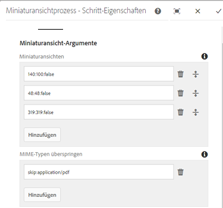
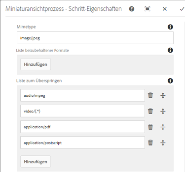
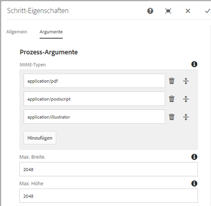
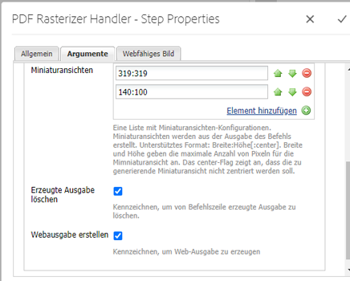
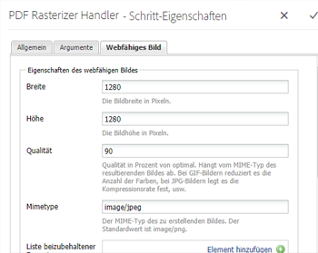
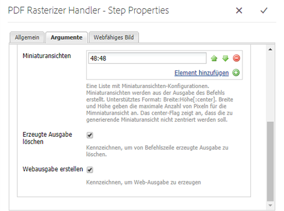
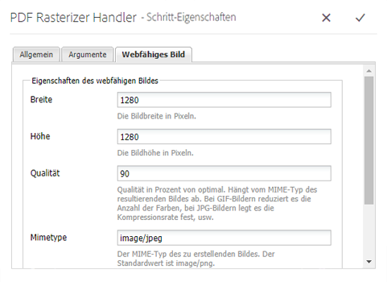

# PDF-Rasterfunktion verwenden {#using-pdf-rasterizer}

Wenn Sie große, inhaltsintensive PDF- oder AI-Dateien zu [!DNL Adobe Experience Manager Assets] hochladen, erzeugt die Standardbibliothek möglicherweise keine korrekte Ausgabe. Die PDF-Rasterbibliothek der Adobe kann eine zuverlässigere und genauere Ausgabe im Vergleich zur Ausgabe aus einer Standardbibliothek generieren. Adobe empfiehlt die Verwendung der PDF-Rasterbibliothek für folgende Szenarien:

Adobe empfiehlt die Verwendung der PDF Rasterizer-Bibliothek für folgende Dateien:

* Starke, inhaltsintensive AI-Dateien oder PDF-Dateien.
* AI-Dateien und PDF-Dateien mit Miniaturansichten, die nicht standardmäßig generiert werden.
* AI-Dateien mit PMS-Farben (Pantone Matching System)

Mit PDF Rasterizer erstellte Miniaturansichten und Vorschauen weisen im Vergleich mit der standardmäßigen Ausgabe eine bessere Qualität auf und bieten daher eine konsistente Darstellung auf allen Geräten. Die Adobe PDF Rasterizer-Bibliothek unterstützt keine Farbraumkonvertierung. Die Ausgabe erfolgt unabhängig vom Farbraum der Quelldatei immer in RGB.

1. Installieren Sie das PDF-Rasterpaket auf Ihrer [!DNL Adobe Experience Manager]-Bereitstellung von [Softwareverteilung](https://experience.adobe.com/#/downloads/content/software-distribution/en/aem.html?package=/content/software-distribution/en/details.html/content/dam/aem/public/adobe/packages/cq640/product/assets/aem-assets-pdf-rasterizer-pkg).

   >[!NOTE]
   >
   >Die PDF Rasterizer-Bibliothek ist nur für Windows und Linux verfügbar.

1. Greifen Sie auf die Workflow-Konsole [!DNL Assets] unter `https://[aem_server]:[port]/workflow` zu. Öffnen Sie den Workflow [!UICONTROL DAM Update Asset].

1. Gehen Sie wie folgt vor, um die Generierung von Miniaturbildern und Webdarstellungen für PDF- und AI-Dateien mithilfe der Standardmethoden zu verhindern:

   * Öffnen Sie den Schritt **[!UICONTROL Prozessminiaturen]** und fügen Sie `application/pdf` oder `application/postscript` in das Feld **[!UICONTROL Mime-Typen]** unter der Registerkarte **[!UICONTROL Miniaturansichten]** nach Bedarf überspringen ein.

   

   * Fügen Sie auf der Registerkarte **[!UICONTROL Web-aktiviertes Bild]** unter **[!UICONTROL Liste]** überspringen `application/pdf` entsprechend Ihren Anforderungen hinzu.`application/postscript`

   

1. Öffnen Sie den Schritt **[!UICONTROL PDF/AI Image Vorschau Rendering]** und entfernen Sie den MIME-Typ, für den Sie die Standardgeneration der Vorschau-Bilddarstellungen überspringen möchten. Entfernen Sie beispielsweise den MIME-Typ `application/pdf`, `application/postscript` oder `application/illustrator` aus der Liste **[!UICONTROL MIME-Typen]**.

   

1. Ziehen Sie den Schritt **[!UICONTROL PDF Rasterizer-Handler]** aus dem Seitenbereich unter den Schritt **[!UICONTROL Miniaturansichten verarbeiten]**.
1. Konfigurieren Sie die folgenden Argumente für den Schritt **[!UICONTROL PDF Raster Handler]**:

   * MIME-Typen: `application/pdf` oder `application/postscript`
   * Befehle: `PDFRasterizer -d -s 1280 -t PNG -i ${file}`
   * Fügen Sie Größen für Miniaturansichten hinzu: 319:319, 140:100, 48:48. Fügen Sie ggf. eine benutzerdefinierte Konfiguration für Miniaturansichten hinzu.

   Die Befehlszeilenargumente für den `PDFRasterizer`-Befehl können Folgendes enthalten:

   * `-d`: Markieren, um eine reibungslose Wiedergabe von Text, Vektorgrafiken und Bildern zu ermöglichen. Erstellt Bilder mit besserer Qualität. Die Verwendung dieses Parameters führt allerdings zu einer langsamen Ausführung des Befehls und zu größeren Bildern.

   * `-s`: Maximale Bildabmessungen (Höhe oder Breite). Dieser Wert wird für jede Seite in DPI umgewandelt. Bei Seiten mit unterschiedlichen Größen wird u. U. jede Seite mit einem anderen Wert skaliert. Der Standardwert ist die tatsächliche Seitengröße.

   * `-t`: Ausgabebildtyp. Gültige Formate sind JPEG, PNG, GIF und BMP. Das Standardformat ist JPEG.

   * `-i`: Pfad für die Eingabe-PDF. Dieser Parameter ist erforderlich.

   * `-h`: Hilfe

1. Um Zwischenausgabeformate zu löschen, wählen Sie **[!UICONTROL Erzeugte Ausgabe löschen]**.
1. Damit PDF Renderer Webdarstellungen generieren kann, wählen Sie **[!UICONTROL Web-Darstellung erstellen]**.

   

1. Legen Sie die Einstellungen auf der Registerkarte **[!UICONTROL Web-aktiviertes Bild]** fest.

   

1. Speichern Sie den Workflow.
1. Damit PDF Raster PDF-Seiten mit PDF-Bibliotheken verarbeiten kann, öffnen Sie das Modell **[!UICONTROL DAM-Prozess-Subasset]** in der Konsole [!UICONTROL Workflow].
1. Ziehen Sie den Schritt für den PDF-Rasterassistenten aus dem Seitenbedienfeld unter den Schritt **[!UICONTROL Web-fähige Bildwiedergabe erstellen]**.
1. Konfigurieren Sie die folgenden Argumente für den Schritt **[!UICONTROL PDF Raster Handler]**:

   * MIME-Typen: `application/pdf` oder `application/postscript`
   * Befehle: `PDFRasterizer -d -s 1280 -t PNG -i ${file}`
   * hinzufügen Größe der Miniaturansichten: `319:319`, `140:100`, `48:48`. hinzufügen benutzerdefinierte Miniaturansicht-Konfiguration nach Bedarf.

   Die Befehlszeilenargumente für den `PDFRasterizer`-Befehl können Folgendes enthalten:

   * `-d`: Markieren, um eine reibungslose Wiedergabe von Text, Vektorgrafiken und Bildern zu ermöglichen. Erstellt Bilder mit besserer Qualität. Die Verwendung dieses Parameters führt allerdings zu einer langsamen Ausführung des Befehls und zu größeren Bildern.

   * `-s`: Maximale Bildabmessungen (Höhe oder Breite). Dieser Wert wird für jede Seite in DPI umgewandelt. Bei Seiten mit unterschiedlichen Größen wird u. U. jede Seite mit einem anderen Wert skaliert. Der Standardwert ist die tatsächliche Seitengröße.

   * `-t`: Ausgabebildtyp. Gültige Formate sind JPEG, PNG, GIF und BMP. Das Standardformat ist JPEG.

   * `-i`: Pfad für die Eingabe-PDF. Dieser Parameter ist erforderlich.

   * `-h`: Hilfe

1. Um Zwischenausgabeformate zu löschen, wählen Sie **[!UICONTROL Erzeugte Ausgabe löschen]**.
1. Damit PDF Renderer Webdarstellungen generieren kann, wählen Sie **[!UICONTROL Web-Darstellung erstellen]**.

   

1. Legen Sie die Einstellungen auf der Registerkarte **[!UICONTROL Web-aktiviertes Bild]** fest.

   

1. Speichern Sie den Workflow.
1. Laden Sie eine PDF- oder AI-Datei auf [!DNL Experience Manager Assets] hoch. PDF Rasterizer erstellt die Miniaturansichten und Webausgaben für die Datei.
