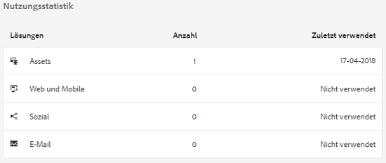
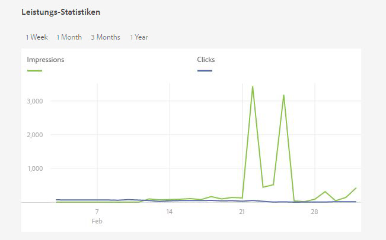

# Assets Insights {#asset-insights}

Mit der Asset Insights-Funktion können Sie Benutzerbewertungen und Nutzungsstatistiken von Bildern verfolgen, die in Websites von Drittanbietern, Marketing-Kampagnen und kreativen Lösungen der Adobe verwendet werden. Sie hilft, Erkenntnisse über ihre Leistung und Beliebtheit abzuleiten.

[!DNL Assets] Insights hält Details zu Benutzeraktivitäten wie Anzahl der Bildbewertungen, Klickraten und Impressionen (Häufigkeit des Ladens eines Bildes auf einer Website) fest. Basierend auf diesen Statistiken werden Bildern Bewertungen zugewiesen. Sie können Bewertungs- und Leistungsstatistiken nutzen, um beliebte Bilder für Kataloge, Marketing-Kampagnen usw. auszuwählen. Sie können außerdem Richtlinien zu Archivierungen und Lizenzerneuerungen anhand dieser Statistiken formulieren.

Damit [!DNL Assets] Insights Nutzungsstatistiken für Bilder von einer Website erfassen kann, müssen Sie den Einbettungscode für das Bild in den Website-Code aufnehmen.

Damit Assets Insights Nutzungsstatistiken für Assets anzeigen kann, konfigurieren Sie zunächst die Funktion, um Berichte-Daten von Adobe Analytics abzurufen. Weitere Informationen finden Sie unter [Assets Insights](/help/assets/configure-asset-insights.md) konfigurieren. Um diese Funktion zu verwenden, kaufen Sie die [!DNL Adobe Analytics]-Lizenz separat. Kunden mit [!DNL Managed Services] erhalten eine [!DNL Analytics] Lizenz, die mit [!DNL Experience Manager] gebündelt wird. Siehe [Managed Services Produktbeschreibung](https://helpx.adobe.com/legal/product-descriptions/adobe-experience-manager-managed-services.html).

>[!NOTE]
>
>Insights werden nur für Bilder unterstützt und bereitgestellt.

## Anzeigen von Statistiken für Bilder {#viewing-statistics-for-an-image}

Sie können die Assets Insights-Bewertungen auf der Metadaten-Seite Ansicht haben.

1. Wählen Sie in der Benutzeroberfläche von [!DNL Assets] das Bild aus und klicken Sie dann in der Symbolleiste auf **[!UICONTROL Eigenschaften]**.
1. Klicken Sie auf der Seite „Eigenschaften“ auf die Registerkarte **[!UICONTROL Statistiken]**.
1. Überprüfen Sie die Nutzungsdetails für das Asset auf der Registerkarte **[!UICONTROL Insights]**. Der Abschnitt **[!UICONTROL Bewertung]** beschreibt die gesamte Asset-Nutzung und die Leistungsbewertungen eines Assets.

   Die Nutzungsbewertung beschreibt, wie oft ein Asset in verschiedenen Lösungen verwendet wird.

   Die Bewertung **[!UICONTROL Impressionen]** beschreibt, wie oft das Asset auf der Website geladen wurde. Die unter **[!UICONTROL Klicks]** angezeigte Zahl beschreibt, wie oft Benutzer auf das Asset geklickt haben.

1. Im Abschnitt **[!UICONTROL Nutzungsstatistiken]** können Sie ermitteln, in welchen Elementen das Asset enthalten war und in welchen Kreativlösungen es vor Kurzem verwendet wurde. Je höher die Nutzung, desto größer ist die Wahrscheinlichkeit, dass das Asset bei Benutzern beliebt ist. Nutzungsdaten werden unter den folgenden Überschriften angezeigt:

   * **Asset**: Wie oft war das Asset Teil einer Sammlung oder eines zusammengesetzten Assets
   * **Web und Mobile**: Wie oft wurde das Asset in Websites und Apps verwendet
   * **Social**: Wie oft wurde das Asset in Lösungen wie Adobe Social und Adobe Campaign verwendet
   * **E-Mail**: Wie oft wurde das Asset in E-Mail-Kampagnen verwendet

   

   >[!NOTE]
   >
   >Da die Asset Insights-Funktion in der Regel die Lösungsdaten regelmäßig von Adobe Analytics abruft, werden im Abschnitt &quot;Lösungen&quot;möglicherweise nicht die neuesten Daten angezeigt. Der Zeitraum, für den die Daten angezeigt werden, hängt vom Zeitplan des Abrufvorgangs ab, den Assets Insights zum Abrufen von Analytics-Daten ausführt.

1. Um Leistungsstatistiken für das Asset für einen bestimmten Zeitraum grafisch anzuzeigen, wählen Sie den gewünschten Zeitraum im Abschnitt **[!UICONTROL Leistungsstatistiken]** aus. Details wie Klicks und Impressions werden als Trend-Linien eines Diagramms angezeigt.

   

   >[!NOTE]
   >
   >Im Gegensatz zu den Daten im Abschnitt „Lösungen“ zeigt der Abschnitt „Leistungsstatistiken“ die neuesten Daten an.

1. Um den Einbettungscode für das Asset abzurufen, das Sie in Websites einschließen, um Leistungsdaten abzurufen, klicken Sie unter der Asset-Miniaturansicht auf **[!UICONTROL Einbettungscode abrufen]**. Weitere Informationen zum Einbettungscode in Webseiten von Drittanbietern finden Sie unter [Verwenden von Seiten-Tracker und Einbettungscode in Webseiten](/help/assets/use-page-tracker.md).

   

## Anzeigen von zusammengefassten Statistiken für Bilder {#viewing-aggregate-statistics-for-images}

Mit der **[!UICONTROL Insights-Ansicht]** können Sie Bewertungen aller Assets in einem Ordner gleichzeitig anzeigen.

1. Navigieren Sie in der Benutzeroberfläche [!DNL Assets] zu dem Ordner, der die Assets enthält, für die Sie Einblicke Ansicht wünschen.
1. Klicken Sie in der Symbolleiste auf Layout und wählen Sie dann **[!UICONTROL Insight-Ansicht]**.
1. Die Seite zeigt die Nutzungsbewertungen für die Assets an. Vergleichen Sie die Bewertungen der verschiedenen Assets und ziehen Sie Ihre Erkenntnisse daraus.

## Planen von Hintergrundaufträgen {#scheduling-background-job}

Assets Insights ruft in regelmäßigen Abständen Nutzungsdaten für Assets aus Adobe Analytics Report Suites ab. Standardmäßig führt Assets Insights alle 24 Stunden um 2 Uhr einen Hintergrundauftrag aus, um die Daten abzurufen. Sie können jedoch die Häufigkeit und die Zeit ändern, indem Sie den Dienst **[!UICONTROL Adobe CQ DAM Asset Performance Report Sync Job]** von der Web-Konsole aus konfigurieren.

1. Klicken Sie auf das [!DNL Experience Manager]-Logo und gehen Sie zu **[!UICONTROL Tools]** > **[!UICONTROL Vorgänge]** > **[!UICONTROL Webkonsole]**.
1. Öffnen Sie die Service-Konfiguration **[!UICONTROL Adobe CQ DAM Asset Performance Report Sync Job]**.

   

1. Geben Sie die gewünschte Terminplaner-Häufigkeit und Startzeit für den Auftrag im Eigenschaftsplanerausdruck ein. Speichern Sie die Änderungen.
