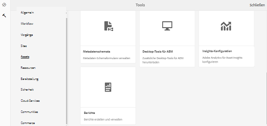
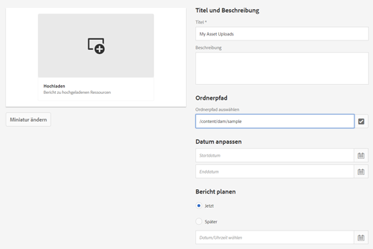
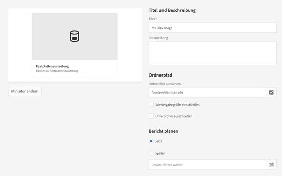
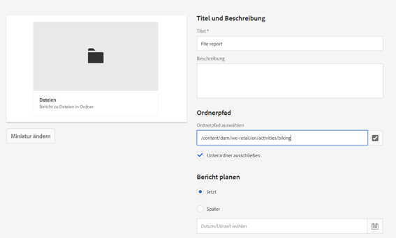
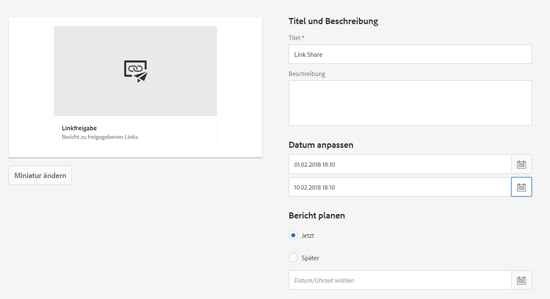
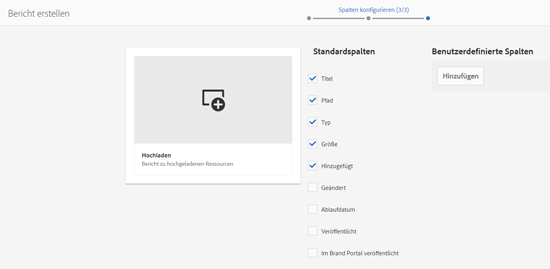
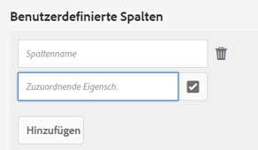
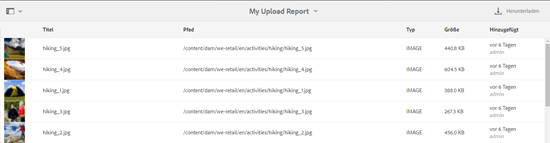
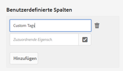
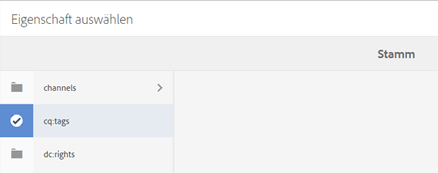

# Asset-Berichte {#asset-reports}

| Version | Artikellink |
| -------- | ---------------------------- |
| AEM as a Cloud Service | [Hier klicken](https://experienceleague.adobe.com/docs/experience-manager-cloud-service/content/assets/admin/asset-reports.html?lang=en) |
| AEM 6.5 | Dieser Artikel |
| AEM 6.4 | [Hier klicken](https://experienceleague.adobe.com/docs/experience-manager-64/assets/administer/asset-reports.html?lang=en) |

Mit Asset-Berichten können Sie die Nützlichkeit Ihrer [!DNL Adobe Experience Manager Assets]-Implementierung bewerten. Mit [!DNL Assets] können Sie verschiedene Berichte für Ihre digitalen Assets erstellen. Die Berichte bieten hilfreiche Informationen über die Nutzung Ihres Systems, über die Art und Weise, wie Benutzer mit Assets interagieren, und die Frage, welche Assets heruntergeladen und freigegeben werden.

Verwenden Sie die Informationen aus den Berichten, um wesentliche Erfolgsmetriken abzuleiten und so festzustellen, wie gut [!DNL Assets] innerhalb Ihrer Organisation und von Ihren Kunden angenommen wird.

Das [!DNL Assets]-Berichterstellungs-Framework nutzt [!DNL Sling]-Aufträge, um Berichtsanfragen auf überschaubare Art asynchron zu verarbeiten. Es ist für große Repositorys skalierbar. Die asynchrone Berichtsverarbeitung steigert die Effizienz und Geschwindigkeit der Berichtsgenerierung.

Die Berichtsverwaltungsoberfläche ist intuitiv und umfasst detaillierte Optionen und Steuerelemente für den Zugriff auf archivierte Berichte und das Anzeigen des Ausführungsstatus von Berichten („Erfolg“, „Fehlgeschlagen“ und „In Warteschlange“).

Wenn ein Bericht generiert wird, werden Sie mit einer E-Mail (optional) und einer Benachrichtigung im Posteingang benachrichtigt. Sie können einen Bericht auf der Berichtslistenseite anzeigen, herunterladen oder löschen. Dort werden alle zuvor generierten Berichte angezeigt.

## Voraussetzung {#prerequisite-for-reporting}

Gehen Sie wie folgt vor, um Berichte zu erstellen:

* Aktivieren [!UICONTROL Day CQ DAM Event Recorder] Dienst von **[!UICONTROL Instrumente]** > **[!UICONTROL Aktivitäten]** > **[!UICONTROL Web-Konsole]**.
* Wählen Sie die Aktivitäten oder Ereignisse aus, für die Sie Berichte erstellen möchten. Um beispielsweise einen Bericht zu heruntergeladenen Assets zu generieren, wählen Sie [!UICONTROL Asset heruntergeladen (HERUNTERGELADEN)].

## Erzeugen von Berichten {#generate-reports}

[!DNL Experience Manager Assets] generiert die folgenden standardmäßigen Berichte für Sie:

* Hochladen
* Download
* Ablauf
* Änderung
* Veröffentlichung
* [!DNL Brand Portal]-Veröffentlichung
* Festplattenauslastung
* Dateien
* Link-Freigabe

[!DNL Adobe Experience Manager]-Administratoren können diese Berichte einfach für Ihre Implementierung erstellen und anpassen. Um einen Bericht zu erstellen, müssen Administratoren folgende Schritte durchführen:

1. Klicken Sie in der [!DNL Experience Manager]-Benutzeroberfläche auf **[!UICONTROL Tools]** > **[!UICONTROL Assets]** > **[!UICONTROL Berichte]**.

   

1. Klicken Sie auf der Seite [!UICONTROL Asset-Berichte] in der Symbolleiste auf **[!UICONTROL Erstellen]**.
1. Wählen Sie auf der Seite **[!UICONTROL Bericht erstellen]** den Bericht aus, den Sie erstellen möchten, und klicken Sie auf **[!UICONTROL Weiter]**.

   

   >[!NOTE]
   >
   >Standardmäßig sind die Inhaltsfragmente und Link-Freigaben im Bericht [!UICONTROL Download] für das Asset enthalten. Wählen Sie die passende Option aus, um einen Bericht zu Link-Freigaben zu erstellen oder Inhaltsfragmente aus dem Download-Bericht auszuschließen.

   >[!NOTE]
   >
   >Der Bericht [!UICONTROL Download] zeigt nur Details zu den Assets an, die heruntergeladen werden, nachdem sie einzeln ausgewählt wurden, bzw. die per Schnellzugriff heruntergeladen werden. Er enthält jedoch keine Details zu den Assets, die sich in einem heruntergeladenen Ordner befinden.

1. Konfigurieren Sie die Berichtdetails wie Titel, Beschreibung, Miniaturansicht sowie den Ordnerpfad im CRX-Repository, der den Speicherort des Berichts angibt. Der standardmäßige Ordnerpfad lautet `/content/dam`. Sie können auch einen anderen Pfad festlegen.

   

   Wählen Sie den Datumsbereich für Ihren Bericht aus.

   Sie können den Bericht wahlweise sofort oder zu einem zukünftigen Zeitpunkt generieren lassen.

   >[!NOTE]
   >
   >Wenn Sie sich dafür entscheiden, den Bericht für einen späteren Zeitpunkt zu planen, geben Sie unbedingt das Datum und die Uhrzeit in das Feld „Datum und Uhrzeit“ ein. Wenn Sie keinen Wert angeben, behandelt die Reporting-Engine den Bericht als einen sofort zu erstellenden Bericht.

   Die Konfigurationsfelder unterscheiden sich möglicherweise basierend auf der Art des erstellten Berichts. Beispielsweise bietet der Bericht zur **[!UICONTROL Festplattenauslastung]** Optionen, um bei der Berechnung des von Assets genutzten Festplattenvolumens Asset-Ausgabedarstellungen miteinzubeziehen. Sie können Assets in Unterordnern bei der Berechnung der Festplattenauslastung miteinbeziehen oder ausschließen.

   >[!NOTE]
   >
   >Der Bericht zur **[!UICONTROL Festplattenauslastung]** umfasst keine Felder für den Datumsbereich, da er nur den aktuellen Speicherbedarf angibt.

   

   Wenn Sie den Bericht **[!UICONTROL Dateien]** erstellen, können Sie Unterordner miteinbeziehen/ausschließen. Bei diesem Bericht können Sie jedoch keine Asset-Ausgabedarstellungen miteinbeziehen.

   

   Der Bericht **[!UICONTROL Linkfreigabe]** zeigt URLs zu Assets an, die für externe Benutzer aus [!DNL Assets] freigegeben wurden. Er enthält E-Mail-IDs des Benutzers, der die Assets freigegeben hat, E-Mail-IDs von Benutzern, für die die Assets freigegeben wurden, Freigabedatum und Ablaufdatum des Links. Die Spalten können nicht angepasst werden.

   Der Bericht **[!UICONTROL Linkfreigabe]** umfasst keine Optionen für Unterordner und Ausgabedarstellungen, da er lediglich die freigegebenen URLs veröffentlicht, die unter `/var/dam/share` zu finden sind.

   

1. Klicken Sie in der Symbolleiste auf **[!UICONTROL Weiter]**.

1. Auf der Seite **[!UICONTROL Spalten konfigurieren]** sind einige Spalten standardmäßig für den Bericht ausgewählt. Sie können zusätzliche Spalten auswählen. Heben Sie die Auswahl einer Spalte auf, um sie im Bericht auszuschließen.

   

   Um einen benutzerdefinierten Spaltennamen oder Eigenschaftspfad anzuzeigen, konfigurieren Sie die Eigenschaften für die Asset-Binärdatei im `jcr:content`-Knoten in CRX. Alternativ können Sie sie über die Auswahl für den Eigenschaftspfad hinzufügen.

   

1. Klicken Sie in der Symbolleiste auf **[!UICONTROL Erstellen]**. Eine Meldung benachrichtigt Sie darüber, dass die Berichtserstellung startet.
1. Auf der Seite [!UICONTROL Asset-Berichte] basiert der angezeigte Berichterstellungsstatus auf dem aktuellen Status des Berichtauftrags, zum Beispiel [!UICONTROL Erfolg], [!UICONTROL Fehlgeschlagen], [!UICONTROL In Warteschlange] oder [!UICONTROL Geplant]. Derselbe Status wird auch im Benachrichtigungseingang angezeigt. Klicken Sie zur Ansicht der Berichtsseite auf den Berichts-Link. Alternativ wählen Sie den Bericht aus und klicken Sie in der Symbolleiste auf **[!UICONTROL Anzeigen]**.

   

   Klicken Sie in der Symbolleiste auf **[!UICONTROL Download]**, um den Bericht im CSV-Format herunterzuladen.

## Hinzufügen benutzerdefinierter Spalten {#add-custom-columns}

Sie können folgenden Berichten benutzerdefinierte Spalten hinzufügen, um weitere Daten für Ihre speziellen Anforderungen anzuzeigen:

* Hochladen
* Download
* Ablauf
* Änderung
* Veröffentlichung
* [!DNL Brand Portal]-Veröffentlichung
* Dateien

Gehen Sie wie folgt vor, um den Berichten benutzerspezifische Spalten hinzuzufügen:

1. Klicken Sie in der [!DNL Manager interface] auf **[!UICONTROL Tools]** > **[!UICONTROL Assets]** > **[!UICONTROL Berichte]**.
1. Klicken Sie auf der Seite [!UICONTROL Asset-Berichte] in der Symbolleiste auf **[!UICONTROL Erstellen]**.

1. Wählen Sie auf der Seite **[!UICONTROL Bericht erstellen]** den Bericht aus, den Sie erstellen möchten, und klicken Sie auf **[!UICONTROL Weiter]**.
1. Konfigurieren Sie je nach Bedarf Berichtdetails wie den Titel, eine Beschreibung, eine Miniaturansicht, den Ordnerpfad und den Datumsbereich.

1. Um eine benutzerdefinierte Spalte anzuzeigen, geben Sie den Namen der Spalte unter **[!UICONTROL Benutzerdefinierte Spalten]** an.

   

1. Fügen Sie den Eigenschaftspfad mit der Auswahl für den Eigenschaftspfad im `jcr:content`-Knoten in CRXDE hinzu. Alternativ können Sie den Pfad im Feld „Eigenschaftspfad“ eingeben.

   

   Klicken Sie auf **[!UICONTROL Hinzufügen]** und wiederholen Sie die Schritte 5 und 6, um weitere benutzerdefinierte Spalten hinzuzufügen.

1. Klicken Sie in der Symbolleiste auf **[!UICONTROL Erstellen]**. Eine Meldung benachrichtigt Sie darüber, dass die Berichtserstellung startet.

## Konfigurieren des Bereinigungs-Service {#configure-purging-service}

Um nicht mehr benötigte Berichte zu entfernen, konfigurieren Sie den Bereinigungs-Service für DAM-Berichte über die Web-Konsole, um vorhandene Berichte basierend auf Menge und Alter zu bereinigen.

1. Greifen Sie über `https://[aem_server]:[port]/system/console/configMgr` auf die Web-Konsole (Configuration Manager) zu.
1. Öffnen Sie die Konfiguration für den **[!UICONTROL Bereinigungs-Service für DAM-Berichte]**.
1. Geben Sie die Häufigkeit (Zeitintervall) für den Bereinigungs-Service in das Feld `scheduler.expression.name` ein. Sie können auch die Schwellenwerte für das Alter und die Menge der Berichte konfigurieren.
1. Speichern Sie die Änderungen.

## Informationen zur Fehlerbehebung, Tipps und Einschränkungen {#best-practices-and-limitations}

* Wenn einige Berichte oder Zahlen in den Berichten nicht verfügbar oder wie erwartet sind, stellen Sie sicher, dass [!UICONTROL Day CQ DAM Event Recorder] -Dienst aktiviert ist.

* Entfernen Sie nicht mehr benötigte Berichte. Verwenden Sie die Konfigurationsoptionen im DAM Report Purge-Dienst, um die Kriterien zum Bereinigen von Berichten zu konfigurieren.

* Wenn der Bericht zur Speichernutzung nicht generiert wird und Sie [!DNL Dynamic Media] verwenden, stellen Sie sicher, dass alle Assets ordnungsgemäß verarbeitet werden. Verarbeiten Sie zur Behebung die Assets erneut und erstellen Sie dann den Bericht erneut.
