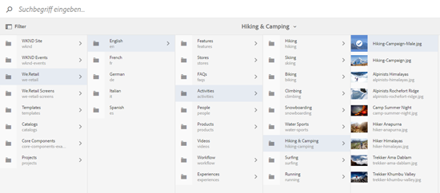

# Asset-Wähler {#asset-selector}

>[!NOTE]
>
>Die [Asset-Wähler](https://experienceleague.adobe.com/docs/experience-manager-cloud-service/content/assets/manage/asset-selector.html?lang=en) hieß [Asset-Auswahl](https://helpx.adobe.com/de/experience-manager/6-2/assets/using/asset-picker.html) in früheren Versionen von [!DNL Experience Manager].

Mit dem Asset-Wähler können Sie Assets in [!DNL Adobe Experience Manager]-Assets durchsuchen, suchen und filtern. Sie können auch die Metadaten von Assets abrufen, die Sie mit dem Asset-Wähler auswählen. Um die Oberfläche des Asset-Wählers anzupassen, können Sie ihn mit unterstützten Anfrageparametern starten. Diese Parameter legen den Kontext des Asset-Wählers für ein bestimmtes Szenario fest.

Derzeit können Sie die Anfrageparameter `assettype` (*Bild/Video/Text*) und die Auswahl `mode` (*einzeln/mehrfach*) als Kontextinformationen für den Asset-Wähler übergeben, die während der gesamten Auswahl erhalten bleiben.

Der Asset-Wähler verwendet die HTML5-Meldung **Window.postMessage**, um Daten für das ausgewählte Asset an die Empfängerin bzw. den Empfänger zu senden.

Der Asset-Wähler basiert auf dem Vokabular der Foundation-Auswahl von Granite. Standardmäßig arbeitet der Asset-Wähler im Suchmodus. Sie können jedoch mithilfe des Omnisearch-Erlebnisses Filter anwenden, um Ihre Suche nach bestimmten Assets zu verfeinern.

Sie können jede Web-Seite (unabhängig davon, ob sie Teil des CQ-Containers ist oder nicht) mit dem Asset-Wähler (`https://[AEM_server]:[port]/aem/assetpicker.html`) einbinden.

## Kontextparameter {#contextual-parameters}

Sie können die folgenden Anfrageparameter in einer URL übergeben, um den Asset-Wähler in einem bestimmten Kontext zu starten:

| Name | Werte | Beispiel | Zweck |
|---|---|---|---|
| resource suffix (B) | Ordnerpfad als Ressourcensuffix in der URL:`http://localhost:4502/aem/` `assetpicker.html/<folder_path>` | Zum Starten des Asset-Wählers mit einem bestimmten Ordner, z. B. mit ausgewähltem Ordner `/content/dam/we-retail/en/activities`, sollte die URL wie folgt aussehen: `http://localhost:4502/aem/assetpicker.html` `/content/dam/we-retail/en/activities?assettype=images` | Wenn beim Starten des Asset-Wählers ein bestimmter Ordner ausgewählt sein soll, können Sie ihn als Ressourcensuffix übergeben. |
| mode | single, multiple | `http://localhost:4502/aem/assetpicker.html` `?mode=multiple`   `http://localhost:4502/aem/assetpicker.html` `?mode=single` | Im Modus „multiple“ können Sie mit dem Asset-Wähler mehrere Assets gleichzeitig auswählen. |
| dialog | true, false | `http://localhost:4502/aem/assetpicker.html` `?dialog=true` | Verwenden Sie diese Parameter, um den Asset-Wähler als Granite-Dialogfeld zu öffnen. Diese Option ist nur relevant, wenn Sie den Asset-Wähler per Granite-Pfadfeld starten und als pickerSrc-URL konfigurieren. |
| root | `<folder_path>` | `http://localhost:4502/aem/` `assetpicker.html?assettype=images` `&root=/content/dam/we-retail/en/activities` | Verwenden Sie diese Option, um den Stammordner für den Asset-Wähler anzugeben. In diesem Fall können Sie mit dem Asset-Wähler nur untergeordnete Assets (direkt/indirekt) unter dem Stammordner auswählen. |
| viewmode | search |  | Um den Asset-Wähler im Suchmodus mit den Parametern „assettype“ und „mimetype“ zu starten. |
| assettype (S) | Bilder, Dokumente, Multimedia, Archive | <ul><li>`http://localhost:4502/aem/assetpicker.html?viewmode=search&assettype=images`</li> <li>`http://localhost:4502/aem/assetpicker.html?viewmode=search&assettype=documents`</li> <li>`http://localhost:4502/aem/assetpicker.html?viewmode=search&assettype=multimedia`</li> <li>`http://localhost:4502/aem/assetpicker.html?viewmode=search&assettype=archives`</li> | Verwenden Sie diese Option, um Asset-Typen auf der Grundlage des übergebenen Wertes zu filtern. |
| mimetype | MIME-Typen (`/jcr:content/metadata/dc:format`) eines Assets (Platzhalter wird ebenfalls unterstützt) | <ul><li>`http://localhost:4502/aem/assetpicker.html?viewmode=search&mimetype=image/png`</li>  <li>`http://localhost:4502/aem/assetpicker.html?viewmode=search&?mimetype=*png`</li>  <li>`http://localhost:4502/aem/assetpicker.html?viewmode=search&mimetype=*presentation`</li>  <li>`http://localhost:4502/aem/assetpicker?viewmode=search&mimetype=*presentation&mimetype=*png`</li></ul> | Verwenden Sie diese Option zum Filtern von Assets anhand von MIME-Typen |

## Verwenden des Asset-Wählers {#using-the-asset-selector}

1. Wechseln Sie für den Zugriff auf die Oberfläche des Asset-Wählers zu `https://[AEM_server]:[port]/aem/assetpicker`.
1. Navigieren Sie zum gewünschten Ordner und wählen Sie ein oder mehrere Assets aus.

   

   Alternativ können Sie im OmniSearch-Feld nach dem gewünschten Asset suchen und es dann auswählen.

   

   Wenn Sie über das OmniSearch-Feld nach Assets suchen, können Sie verschiedene Filter aus dem Bereich **[!UICONTROL Filter]** auswählen, um die Suche zu verfeinern.

   

1. Klicks **[!UICONTROL Auswählen]** aus der Symbolleiste.

>[!MORELIKETHIS]
>
>* [Micro-Frontend-Asset-Auswahl in AEM as a Cloud Service](https://experienceleague.adobe.com/docs/experience-manager-cloud-service/content/assets/manage/asset-selector.html?lang=en)
