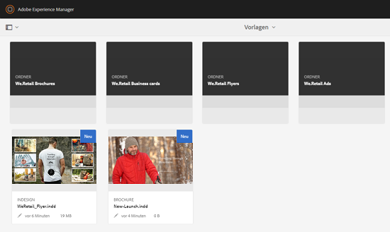

# Asset-Vorlagen {#asset-templates}

Asset-Vorlagen sind eine spezielle Asset-Klasse, die eine schnelle Wiederverwendung visuell reicher Inhalte für digitale und Druckmedien ermöglicht. Eine Asset-Vorlage enthält zwei Teile: den unveränderlichen Messagingabschnitt und den bearbeitbaren Abschnitt. Der unveränderliche Messagingabschnitt kann proprietären Inhalt enthalten, z. B. das Markenlogo und Copyright-Informationen, die nicht bearbeitet werden können. Der bearbeitbare Abschnitt kann visuelle und textuelle Inhalte in Feldern enthalten, die bearbeitet werden können, um Messaging anzupassen.

Die Flexibilität, begrenzte Bearbeitungen bei gleichzeitiger Sicherung globaler Signaturen vorzunehmen, macht Asset-Vorlagen zu idealen Bausteinen für die schnelle Anpassung und Verteilung von Inhalten als Inhaltsartefakte für verschiedene Funktionen. Die Wiederverwendung von Inhalten trägt dazu bei, die Kosten für die Verwaltung von Print- und digitalen Kanälen zu senken und ganzheitliche und konsistente Erlebnisse in diesen Kanälen bereitzustellen.

Marketingexperten können Vorlagen innerhalb von [!DNL Experience Manager Assets] speichern und verwalten und eine einzelne Basisvorlage verwenden, um mühelos mehrere personalisierte Druckerlebnisse zu erstellen. Sie können verschiedene Arten von Marketingmaterial erstellen, z. B. Broschüren, Flyer, Postkarten, Visitenkarten usw., um Kunden Ihre Marketingbotschaft eindeutig und klar zu vermitteln. Außerdem können Sie aus vorhandenen oder neuen Druckausgaben mehrseitige Druckausgaben zusammenstellen. Und das Beste ist: Sie können ohne großen Aufwand gleichzeitig digitale Umgebungen und Printumgebungen bereitstellen, um für Benutzer eine konsistente integrierte Erfahrung zu schaffen.

Während Asset-Vorlagen meist [!DNL Adobe InDesign]-Dateien sind, stellt die Kompetenz in [!DNL Adobe InDesign] keine Barriere für das Erstellen von Sternartefakten dar. Sie müssen die Felder Ihrer [!DNL Adobe InDesign]-Vorlage nicht Ihren Produktfeldern zuordnen, die Sie sonst beim Erstellen von Katalogen benötigen. Sie können die Vorlagen im WYSIWYG-Modus direkt auf der Weboberfläche bearbeiten. Damit [!DNL Adobe InDesign] Ihre Bearbeitungsänderungen verarbeitet, müssen Sie [!DNL Experience Manager Assets] zunächst konfigurieren, um [!DNL Adobe InDesign Server] zu integrieren.

Die Möglichkeit, [!DNL Adobe InDesign]-Vorlagen über die Weboberfläche zu bearbeiten, trägt dazu bei, die Zusammenarbeit zwischen Kreativ- und Marketingmitarbeitern zu verbessern. Die höhere Inhaltsgeschwindigkeit verringert die Markteinführungszeit für Marketingsicherheiten.

Mit Asset-Vorlagen können Sie Folgendes erreichen:

* Ändern von bearbeitbaren Vorlagenfeldern über die Webbenutzeroberfläche.
* Steuern der grundlegenden Textformatierung, z. B. Schriftgröße, -stil und -typ auf Tag-Ebene.
* Ändern von Bildern in der Vorlage per Inhaltsauswahl.
* Anzeigen von Vorlagenbearbeitungen in der Vorschau.
* Zusammenführen mehrerer Vorlagendateien zum Erstellen eines mehrseitigen Artefakts.

Wenn Sie eine Vorlage für Ihre Sicherheit auswählen, erstellt [!DNL Experience Manager Assets] eine Kopie der Vorlage, die Sie bearbeiten können. Die ursprüngliche Vorlage wird beibehalten, um sicherzustellen, dass Ihre globalen Logos und Unternehmenskennzeichnungen intakt bleiben und wiederverwendet werden können, um für eine einheitliche Markendarstellung zu sorgen.

Sie können die aktualisierte Datei im übergeordneten Ordner in die Formate INDD, PDF oder JPG exportieren. Sie können die Ausgabe in diesen Formaten auch in Ihr lokales Dateisystem herunterladen.

## Erstellen von Sicherheiten {#creating-a-collateral}

Stellen Sie sich einen Fall vor, in dem Sie digitales druckbares Marketingmaterial, z. B. Broschüren, Flyer und Anzeigen, für eine anstehende Kampagne erstellen und für Ihre Geschäfte weltweit bereitstellen möchten. Wenn Sie das Material basierend auf einer Vorlage erstellen, können Sie kanalübergreifend eine einheitliche Kundenerfahrung erzielen. Designer können die Kampagnenvorlagen (einseitige oder mehrseitige) mit einer Kreativlösung wie [!DNL InDesign] erstellen und die Vorlagen für Sie nach [!DNL Experience Manager Assets] hochladen. Bevor Sie eine Sicherheit erstellen, lassen Sie eine oder mehrere INDD-Vorlagen im Voraus hochladen und verfügbar sein.[!DNL Experience Manager]

1. Klicken Sie in der [!DNL Experience Manager]-Schnittstelle auf [!UICONTROL Assets].

1. Wählen Sie in den Optionen die Option **[!UICONTROL Vorlagen]**.

   

1. Klicken Sie auf **[!UICONTROL Erstellen]** und wählen Sie dann im Menü die zu erstellenden Sicherheiten aus. Wählen Sie beispielsweise **[!UICONTROL Prospekt]**.

   

1. Lassen Sie eine oder mehrere INDD-Vorlagen im Voraus hochladen und verfügbar sein. [!DNL Experience Manager] Wählen Sie eine Vorlage für Ihre Broschüre und klicken Sie auf **[!UICONTROL Weiter]**.
1. Geben Sie einen Namen und eine optionale Beschreibung für die Broschüre an.

   

1. (Optional) Klicken Sie auf **[!UICONTROL Tags]** und wählen Sie eines oder mehrere Tags für die Broschüre aus. Klicken Sie auf **[!UICONTROL Bestätigen]**, um Ihre Auswahl zu bestätigen.
1. Klicken Sie auf **[!UICONTROL Erstellen]**. In einem Dialogfeld mit einem Hinweis wird bestätigt, dass eine neue Broschüre erstellt wurde. Klicken Sie auf **[!UICONTROL Öffnen]**, um die Broschüre im Bearbeitungsmodus zu öffnen.

   <!-- -->

   Alternativ hierzu können Sie das Dialogfeld schließen und auf der Seite „Vorlagen“ zu dem Ordner navigieren, mit dem Sie den Vorgang begonnen haben, um die erstellte Broschüre anzuzeigen. Der Typ des Materials wird in der Kartenansicht in der dazugehörigen Miniaturansicht angezeigt. In diesem Fall wird beispielsweise das Wort [!UICONTROL Prospekt] auf der Miniaturansicht angezeigt.

   

## Bearbeiten von Sicherheiten {#editing-a-collateral}

Sie können Material sofort nach dem Erstellen bearbeiten. Alternativ können Sie sie auf der Seite [!UICONTROL Vorlagen] oder auf der Asset-Seite öffnen.

1. Sie haben folgende Möglichkeiten, um das Material zur Bearbeitung zu öffnen:

   * Öffnen Sie die in Schritt 7 von [Erstellen Sie eine Sicherheit](/help/assets/asset-templates.md#creating-a-collateral) erstellten Sicherheiten (in diesem Fall eine Broschüre).
   * Navigieren Sie auf der Seite &quot;Vorlagen&quot;zu einem Ordner, in dem Sie die Sicherheit erstellt haben, und klicken Sie auf die Schnellaktion [!UICONTROL Bearbeiten] in der Miniaturansicht eines Assets.
   * Klicken Sie auf der Asset-Seite für die Sicherheit in der Symbolleiste auf **[!UICONTROL Bearbeiten]**.
   * Wählen Sie die Sicherheit aus und klicken Sie in der Symbolleiste auf **[!UICONTROL Bearbeiten]**.

   <!-- -->

   Links auf der Seite werden die Asset-Suche und der Text-Editor angezeigt. Der Text-Editor ist standardmäßig geöffnet.

   Sie können den Text-Editor verwenden, um den Text zu ändern, der im Textfeld angezeigt werden soll. Sie können Schriftgröße, -stil, -farbe und -typ auf der Tag-Ebene ändern.

   Mit der Asset-Suche können Sie Bilder innerhalb von [!DNL Experience Manager Assets] suchen oder suchen und die bearbeitbaren Bilder in der Vorlage durch Bilder Ihrer Wahl ersetzen.

   

   Die bearbeitbaren Bilder werden rechts angezeigt. Damit ein Feld in [!DNL Experience Manager Assets] bearbeitet werden kann, muss das entsprechende Feld in der Vorlage mit [!DNL InDesign] gekennzeichnet werden. Mit anderen Worten, sie sollten in [!DNL InDesign] als bearbeitbar markiert werden.

   >[!NOTE]
   >
   >Stellen Sie sicher, dass Ihre [!DNL Experience Manager]-Bereitstellung in eine [!DNL InDesign Server] integriert ist, damit [!DNL Experience Manager Assets] Daten aus der [!DNL InDesign]-Vorlage extrahieren und zur Bearbeitung verfügbar machen kann. Weitere Informationen finden Sie unter [Experience Manager-Assets mit InDesign Server](/help/assets/indesign.md) integrieren.

1. Um den Text in einem bearbeitbaren Feld zu ändern, klicken Sie in der Liste der bearbeitbaren Felder auf das Textfeld und bearbeiten Sie den Text im Feld.

   

   Sie können die Texteigenschaften, z. B. Schriftschnitt, Farbe und Größe, mithilfe der bereitgestellten Optionen bearbeiten.

1. Klicken Sie auf **[!UICONTROL Vorschau]**, um die Textänderungen Vorschau.

1. Um ein Bild auszutauschen, klicken Sie auf **[!UICONTROL Asset Finder]** .

1. Wählen Sie in der Liste mit den bearbeitbaren Feldern das Bildfeld aus und ziehen Sie das gewünschte Bild dann aus der Asset-Auswahl in das bearbeitbare Feld.

   

   Sie können auch nach Bildern suchen, indem Sie Stichwörter, Tags und den Veröffentlichungsstatus angeben. Sie können das [!DNL Experience Manager Assets]-Repository durchsuchen und zum Speicherort des gewünschten Bildes navigieren.

   

1. Klicken Sie auf **[!UICONTROL Vorschau]**, um das Bild Vorschau.
1. Verwenden Sie den Seitennavigator unten, um eine bestimmte Seite in einem mehrseitigen Begleitmaterial zu bearbeiten.

1. Klicken Sie in der Symbolleiste auf **[!UICONTROL Vorschau]**, um alle Änderungen Vorschau. Klicken Sie auf **[!UICONTROL Fertig]**, um die Bearbeitungsänderungen an den Sicherheiten zu speichern.

   >[!NOTE]
   >
   >Die Optionen &quot;Vorschau&quot;und &quot;Fertig&quot;sind nur aktiviert, wenn die bearbeitbaren Bildfelder in den Zusätzen keine fehlenden Symbole aufweisen. Wenn in Ihren Zusätzen Symbole fehlen, liegt dies daran, dass [!DNL Experience Manager] die Bilder in der [!DNL InDesign]-Vorlage nicht auflösen kann. Normalerweise kann [!DNL Experience Manager] in folgenden Fällen keine Bilder auflösen:
   >
   >* Bilder werden nicht in die zugrunde liegende [!DNL InDesign]-Vorlage eingebettet.
   >* Bilder verfügen über Verknüpfungen mit dem lokalen Dateisystem.

   >
   >Gehen Sie wie folgt vor, um [!DNL Experience Manager] zum Auflösen von Bildern zu aktivieren:
   >
   >* Betten Sie Bilder beim Erstellen von [!DNL InDesign]-Vorlagen ein (siehe [Links und eingebettete Grafiken](https://helpx.adobe.com/de/indesign/using/graphics-links.html)).
   >* Bereiten Sie [!DNL Experience Manager] in Ihr lokales Dateisystem ein und ordnen Sie dann fehlende Symbole mit vorhandenen Elementen in [!DNL Experience Manager] zu.

   >
   >Weitere Informationen zum Arbeiten mit [!DNL InDesign]-Dokumenten finden Sie unter [Best Practices für das Arbeiten mit InDesign-Dokumenten in Experience Manager](https://helpx.adobe.com/de/experience-manager/kb/best-practices-idd-docs-aem.html).

1. Wählen Sie zum Generieren einer PDF-Ausgabe für die Broschüre im Dialogfeld die Acrobat-Option aus und klicken Sie anschließend auf **[!UICONTROL Weiter]**.
1. Das Marketingmaterial wird in dem Ordner erstellt, in dem Sie den Vorgang begonnen haben. Öffnen Sie das Marketingmaterialelement und wählen Sie in der GlobalNav-Liste die Option **[!UICONTROL Ausgabeformate]**, um die Ausgabeformate anzuzeigen.

   

1. Klicken Sie in der Liste der Darstellungen auf die PDF-Darstellung, um die PDF-Datei herunterzuladen. Öffnen Sie die PDF-Datei, um das Material zu überprüfen.

   

## Zusammenführen von Sicherheiten {#merge-collateral}

1. Klicken Sie in der Oberfläche [!DNL Experience Manager] auf der Navigationsseite auf [!UICONTROL Assets].

1. Wählen Sie in den Optionen die Option **[!UICONTROL Vorlagen]**.

1. Klicken Sie auf **[!UICONTROL Erstellen]** und wählen Sie **[!UICONTROL Zusammenführen]** aus dem Menü.

   

1. Klicken Sie auf der Seite [!UICONTROL Vorlagenzusammenführung] auf **[!UICONTROL Zusammenführen]** .

1. Navigieren Sie zum Speicherort der zusammenzuführenden Sicherheiten und klicken Sie auf die Miniaturansichten der zusammenzuführenden Sicherheiten, um sie auszuwählen.

   

   Sie können auch über das Omniture Suchfeld nach Vorlagen suchen.

   Sie können durch das [!DNL Experience Manager Assets]-Repository oder die Sammlungen navigieren, zum Speicherort der gewünschten Vorlagen navigieren und diese dann zum Zusammenführen auswählen.

   Sie können verschiedene Filter anwenden, um nach den gewünschten Vorlagen zu suchen. Es ist beispielsweise möglich, basierend auf dem Dateityp oder auf Tags nach Vorlagen zu suchen.

1. Klicken Sie in der Symbolleiste auf **[!UICONTROL Weiter]**.
1. Ordnen Sie die Vorlagen im Bildschirm **[!UICONTROL Vorschau und neu anordnen]** bei Bedarf neu an und Vorschau der Vorlagenauswahl für das Zusammenführen. Klicken Sie dann in der Symbolleiste auf **[!UICONTROL Weiter]**.

   

1. Geben Sie im Bildschirm [!UICONTROL Vorlage konfigurieren] einen Namen für die Sicherheit ein. Geben Sie optional Tags an, die jeweils geeignet sind. Wenn Sie die Ausgabe im PDF-Format exportieren möchten, wählen Sie **[!UICONTROL Acrobat (.PDF)]**. Standardmäßig werden die Sicherheiten im JPG- und [!DNL InDesign]-Format exportiert. Klicken Sie zum Ändern der Miniaturansicht der mehrseitigen Sicherheit auf **[!UICONTROL Miniaturansicht ändern]**.

   

1. Klicken Sie auf **[!UICONTROL Speichern]** und dann auf **[!UICONTROL OK]** im Dialogfeld, um das Dialogfeld zu schließen. Die mehrseitigen Sicherheiten werden in dem Ordner erstellt, mit dem Sie begonnen haben.

   >[!NOTE]
   >
   >Es ist nicht möglich, zusammengeführtes Material später zu ändern oder zum Erstellen von anderem Material zu verwenden.

## Best Practices und Einschränkungen {#best-practices-limitations-tips}

* Der [!DNL InDesign]-Editor in [!DNL Experience Manager] funktioniert auf Tag-Ebene und der gesamte Text unter einem einzelnen Tag wird als einzelne Entität betrachtet. Um Textformatierung und -stile bei der Bearbeitung beizubehalten, müssen Sie jeden Absatz (oder Text mit einem anderen Stil) separat taggen.
