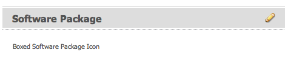

# Create and configure Asset Editor pages {#creating-and-configuring-asset-editor-pages}

Dieses Dokument beschäftigt sich mit den folgenden Fragestellungen:

* Was spricht für die Erstellung angepasster Asset-Editor-Seiten?
* Wie werden Asset-Editor-Seiten erstellt und angepasst? (Hierbei handelt es sich um WCM-Seiten, mit denen Sie Metadaten anzeigen und bearbeiten sowie Aktionen für ein Asset ausführen können.)
* Wie werden mehrere Assets gleichzeitig bearbeitet?

<!-- TBD: Add UICONTROL tags. Need PM review. Flatten the structure a bit. Re-write to remove Geometrixx mentions and to adhere to 6.5 OOTB samples. -->

>[!NOTE]
>
>Asset-Freigabe ist als Open-Source-Refrerenzimplementierung verfügbar. Siehe [Asset-Freigabe](https://adobe-marketing-cloud.github.io/asset-share-commons/). Wird nicht offiziell unterstützt.

## Why create and configure Asset Editor pages? {#why-create-and-configure-asset-editor-pages}

Digital Asset Management wird in einer immer größeren Anzahl von Szenarien eingesetzt. Beim Umstieg von einer kleinen Lösung für eine kleine Gruppe professionell ausgebildeter Benutzer (beispielsweise Fotografen oder Taxonome) auf ein System für größere und vielfältigere Benutzergruppen (beispielsweise Geschäftsbenutzer, WCM-Autoren, Journalisten usw.) stellt die leistungsstarke Benutzeroberfläche von Adobe Experience Manager (AEM) Assets für professionelle Benutzer möglicherweise zu viele Informationen bereit, sodass die beteiligten Personen für den Zugriff auf die für sie relevanten digitalen Assets spezielle Benutzeroberflächen oder Anwendungen anfragen.

Bei diesen Asset-orientierten Anwendungen kann es sich um einfache Fotogalerien im Internet handeln, über die Mitarbeiter Fotos von Messebesuchen hochladen können, oder um Pressezentren öffentlicher Websites, wie etwa hier im Geometrixx-Beispiel zu sehen. Asset-orientierte Anwendungen können sich auch auf Komplettlösungen, einschließlich Warenkorb, Kassen- und Prüfprozessen, erstrecken.

Eine Asset-orientierte Anwendung zu erstellen, wird so in erster Linie zu einem Konfigurationsvorgang, der keinerlei Kodierung erfordert. Sie müssen lediglich mit den Benutzergruppen, deren Bedürfnissen und den verwendeten Metadaten vertraut sein. Mit AEM Assets erstellte Asset-orientierte Anwendungen sind erweiterbar: Mit moderatem Kodierungsaufwand können Sie wiederverwendbare Komponenten für die Suche, Anzeige und Bearbeitung von Assets erstellen.

Eine Asset-orientierte Anwendung in AEM besteht aus einer Asset-Editor-Seite, die eine detaillierte Ansicht eines bestimmten Assets liefert. Über eine Asset-Editor-Seite können zudem Metadaten bearbeitet werden, sofern der Benutzer, der auf das Asset zugreift, über die erforderlichen Berechtigungen verfügt.

## Erstellen und Konfigurieren der Seite &quot;Asset-Freigabe&quot; {#creating-and-configuring-an-asset-share-page}

Sie können die DAM Finder-Funktionsweise anpassen und Seiten mit allen benötigten Funktionen erstellen. Diese Seiten werden als Asset-Freigabe-Seiten bezeichnet. Um eine neue Asset-Freigabe-Seite zu erstellen, fügen Sie zunächst die Seite mithilfe der Vorlage „Geometrixx-Asset-Freigabe“ hinzu. Sie können dann die von den Benutzern ausführbaren Aktionen anpassen, bestimmen, wie Assets dargestellt werden, und festlegen, wie Benutzer ihre Abfragen erstellen können.

Einige Anwendungsbeispiele zum Erstellen einer angepassten Asset-Freigabe-Seite:

* Pressezentrum für Journalisten
* Bildsuchmaschine für interne Geschäftsbenutzer
* Bilddatenbank für Website-Benutzer
* Medien-Tagging-Benutzeroberfläche für Metadaten-Editoren

### Create an Asset Share page {#creating-an-asset-share-page}

Neue Asset-Freigabe-Seiten können entweder beim Arbeiten auf Websites oder über den Digital Asset Manager erstellt werden.

>[!NOTE]
>
>Standardmäßig werden beim Erstellen einer Asset-Freigabe-Seite über die Option **Neu** im Digital Asset Manager ein Asset-Viewer und ein Asset-Editor automatisch für Sie erstellt.

So erstellen Sie eine neue Asset-Freigabe-Seite in der **Websites-Konsole**:

1. Navigieren Sie auf der Registerkarte **Websites** an die Stelle, an der eine Asset-Freigabe-Seite erstellt werden soll, und klicken Sie auf **Neu**.

1. Select the **Asset Share** page and click **Create**. Die neue Seite wird erstellt und die Asset-Freigabe-Seite wird auf der Registerkarte **Websites** aufgeführt.

Die mit der Geometrixx-DAM-Asset-Freigabe-Vorlage erstellte Standardseite sieht wie folgt aus:

Die Asset-Freigabe-Seite kann über die Elemente aus dem Sidekick angepasst werden. Dabei können Sie auch die Query-Builder-Eigenschaften bearbeiten. The page **Geometrixx Press Center** is a customized version of a page based on this template:

So erstellen Sie eine neue Asset-Freigabe-Seite mit dem Digital Asset Manager:

1. Wählen Sie im Digital Asset Manager unter **Neu** die Option **Neue Asset-Freigabe**.
1. Geben Sie in das Feld **Titel** den Namen der Asset-Freigabe-Seite ein. Geben Sie ggf. einen Namen für die URL ein.

   

1. Doppelklicken Sie auf die Asset-Freigabe-Seite, um die Seite zu öffnen und zu konfigurieren.

   

   Standardmäßig werden beim Erstellen einer Asset-Freigabe-Seite über die Option **Neu** ein Asset-Viewer und ein Asset-Editor automatisch für Sie erstellt.

#### Aktionen anpassen {#customizing-actions}

Sie können anhand einer Auswahl vordefinierter Aktionen festlegen, welche Aktionen Benutzer für ausgewählte digitale Assets ausführen können.

So fügen Sie der Asset-Freigabe-Seite Aktionen hinzu:

1. Klicken Sie auf der anzupassenden Asset-Freigabe-Seite im Sidekick auf **Aktionen.**

Die folgenden Aktionen stehen zur Verfügung:

| Aktion | Beschreibung |
|---|---|
| [!UICONTROL Löschen-Aktion] | Benutzer können die ausgewählten Assets löschen. |
| [!UICONTROL Download-Aktion] | Ermöglicht Benutzern das Herunterladen ausgewählter Assets auf ihren Computern. |
| [!UICONTROL Lightbox-Aktion] | Speichert Assets in einem &quot;Leuchtkasten&quot;, in dem Sie andere Aktionen ausführen können. Dies ist praktisch, wenn über mehrere Seiten hinweg an Assets gearbeitet wird. Die Lightbox kann ebenfalls als Warenkorb für Assets verwendet werden. |
| [!UICONTROL Verschieben-Aktion] | Benutzer können das Asset an einen anderen Speicherort verschieben |
| [!UICONTROL Tags-Aktion] | Ermöglicht Benutzern das Hinzufügen von Tags zu ausgewählten Assets |
| [!UICONTROL Asset-Aktion anzeigen] | Öffnet das Asset im Asset-Editor zur Bearbeitung durch den Benutzer. |

1. Ziehen Sie die entsprechende Aktion in den Bereich **Aktionen** auf der Seite. Hierdurch wird eine Schaltfläche zum Ausführen dieser Aktion erstellt.

#### Determine how search results are presented {#determining-how-search-results-are-presented}

Sie können über eine vordefinierte Liste von Linsen bestimmen, wie Ergebnisse gezeigt werden.

So ändern Sie die Anzeige von Suchergebnissen:

1. Klicken Sie auf der anzupassenden Asset-Freigabe-Seite auf Suchen.

1. Ziehen Sie die entsprechende Linse in den oberen Seitenbereich. Im Pressezentrum sind die Linsen bereits verfügbar. Durch Auswahl des entsprechenden Linsensymbols können Benutzer die Suchergebnisse wie gewünscht anzeigen.

Die folgenden Linsen stehen zur Verfügung:

| Objektiv | Beschreibung |
|---|---|
| **[!UICONTROL Listenlinse]** | Stellt die Assets mit Details in einer Liste dar. |
| **[!UICONTROL Mosaik-Linse]** | Stellt Assets in einer Mosaik dar. |

#### Mosaik-Linse {#mosaic-lens}

#### Listenlinse {#list-lens}

#### Customize the Query Builder {#customizing-the-query-builder}

Über den Query Builder können Sie Suchbegriffe eingeben und Inhalt für die Asset-Freigabe-Seite erstellen. Wenn Sie den Query Builder bearbeiten, können Sie auch festlegen, wie viele Suchergebnisse pro Seite angezeigt werden und welcher Asset-Editor beim Doppelklicken auf ein Asset geöffnet wird. Außerdem können Sie den Pfad bestimmen, der über die Abfrage durchsucht wird, und wie Knotentypen angepasst werden.

So passen Sie den Query Builder an:

1. Klicken Sie auf der anzupassenden Asset-Freigabe-Seite im Query Builder auf **Bearbeiten**. Standardmäßig wird die Registerkarte **Allgemein** geöffnet.
1. Wählen Sie die Anzahl der Ergebnisse pro Seite, den Pfad des Asset-Editors (im Falle eines angepassten Asset-Editors) und den Aktionstitel aus.

1. Klicken Sie auf die Registerkarte **Pfade**. Geben Sie einen Pfad oder mehrere Pfade zum Ausführen des Suchvorgangs ein. Diese Pfade werden überschrieben, wenn der Benutzer die Pfad-Eigenschaft verwendet.

1. Geben Sie ggf. einen weiteren Knotentyp ein.

1. Im Feld **Query-Builder-URL** können Sie den Query Builder überschreiben oder umschließen und neue Servlet-URLs mit dem vorhandenen Query Builder eingeben. Im Feld **Feed-URL** können Sie zudem die Feed-URL überschreiben.

1. In das Feld **Text** können Sie den für die Ergebnisse anzuzeigenden Text und die Seitenzahlen der Ergebnisse eingeben. Klicken Sie auf **OK**, wenn Sie keine weiteren Änderungen vornehmen möchten.

#### Vorhersagen hinzufügen {#adding-predicates}

AEM Assets beinhaltet eine Reihe von Eigenschaften, die Sie der Asset-Freigabe-Seite hinzufügen können. So können Benutzer Suchvorgänge weiter eingrenzen. Mitunter können sie auch einen Query-Builder-Parameter (etwa den Pfad-Parameter) überschreiben.

So fügen Sie Eigenschaften hinzu:

1. Klicken Sie auf der anzupassenden Asset-Freigabe-Seite auf **Suchen**.

1. Ziehen Sie die entsprechenden Eigenschaften auf die Asset-Freigabe-Seite unterhalb des Query Builders. Hierdurch werden die entsprechenden Felder erstellt.

Die folgenden Prognosen stehen zur Verfügung:

| Eigenschaft | Beschreibung |
|---|---|
| **[!UICONTROL Datumseigenschaft]** | Ermöglicht Benutzern die Suche nach Assets, die vor und nach bestimmten Daten geändert wurden. |
| **[!UICONTROL Options-Eigenschaft]** | Der Site-Eigentümer kann eine Eigenschaft angeben, nach der gesucht werden soll (wie in der Eigenschaft &quot;Predicate&quot;, z. B. &quot;cq:tags&quot;), und eine Inhaltsstruktur, aus der die Optionen gefüllt werden (z. B. die Tag-Struktur). Hierdurch wird eine Liste von Optionen generiert, aus der der Benutzer die gewünschten Werte (Tags) für die ausgewählte Eigenschaft (Tag-Eigenschaft) auswählen kann. Über diese Eigenschaft können Sie Steuerungen wie eine Tag-Liste, Dateitypen, Bildausrichtungen usw. erstellen – ideal geeignet für einen festen Satz an Optionen. |
| **[!UICONTROL Pfad-Eigenschaft]** | Ermöglicht Benutzern, bei Bedarf den Pfad und die Unterordner zu definieren. |
| **[!UICONTROL Eigenschaftsprädikat]** | Der Site-Eigentümer gibt eine Eigenschaft an, nach der gesucht werden soll, z. B. tiff:ImageLength, und der Benutzer kann dann einen Wert, z. B. 800, eingeben. Dadurch werden alle Bilder mit einer Höhe von 800 Pixel zurückgegeben. Dies ist nützlich, wenn eine Eigenschaft beliebige Werte aufweisen darf. |

For more information, see the [predicate Javadocs](https://helpx.adobe.com/experience-manager/6-5/sites/developing/using/reference-materials/javadoc/com/day/cq/search/eval/package-summary.html).

1. Um die Eigenschaft weiter zu konfigurieren, doppelklicken Sie darauf. Wenn Sie beispielsweise die Pfad-Eigenschaft öffnen, müssen Sie den Stammpfad zuweisen.

## Erstellen und Konfigurieren der Seite &quot;Asset Editor&quot; {#creating-and-configuring-an-asset-editor-page}

Durch Anpassen des Asset-Editors können Sie bestimmen, wie Benutzer digitale Assets anzeigen und bearbeiten können. Hierzu erstellen Sie eine neue Asset-Editor-Seite und passen dann die Ansichten und die Aktionen, die der Benutzer ausführen kann, auf dieser Seite an.

>[!NOTE]
>
>If you want to add custom fields to the DAM asset editor, add new cq:Widget nodes to `/apps/dam/content/asseteditors.`

### Create an Asset Editor page {#creating-the-asset-editor-page}

Beim Erstellen von Asset-Editor-Seiten hat es sich bewährt, die Seite direkt unter der Asset-Freigabe-Seite anzulegen.

So erstellen Sie eine Asset-Editor-Seite:

1. Navigieren Sie auf der Registerkarte **Websites** an die Stelle, an der eine Asset-Editor-Seite erstellt werden soll, und klicken Sie auf **Neu**.
1. Wählen Sie **Geometrixx-Asset-Editor** und klicken Sie auf **Erstellen**. Die neue Seite wird erstellt und auf der Registerkarte **Websites** aufgeführt.

Die mit der Vorlage „Geometrixx-Asset-Editor“ erstellte Standardseite sieht wie folgt aus:

Anpassen können Sie die Asset-Editor-Seite mithilfe der Elemente aus dem Sidekick. The Asset Editor page that is accessed from the **Geometrixx Press Center** is a customized version of a page based on this template:

#### Asset-Editor zum Öffnen über die Seite &quot;Asset-Freigabe&quot;festlegen {#setting-which-asset-editor-opens-from-an-asset-share-page}

Nachdem Sie die angepasste Asset-Editor-Seite erstellt haben, müssen Sie sicherstellen, dass beim Doppelklicken auf Assets über die von Ihnen erstellte angepasste Asset-Freigabe die Assets auf der angepassten Editorseite geöffnet werden.

So stellen Sie die Asset-Editor-Seite ein:

1. Klicken Sie auf der Asset-Freigabe-Seite neben dem Query Builder auf **Bearbeiten**.

1. Klicken Sie auf die Registerkarte **Allgemein**, sofern diese nicht bereits ausgewählt ist.

1. Geben Sie in das Feld **Pfad des Asset-Editors** den Pfad zu dem Asset-Editor ein, in dem die Asset-Freigabe-Seite Assets öffnen soll, und klicken Sie auf **OK**.

#### Add Asset Editor components {#adding-asset-editor-components}

Sie können bestimmen, welche Funktionen ein Asset-Editor besitzt, indem Sie der Seite Komponenten hinzufügen.

So fügen Sie Asset-Editor-Komponenten hinzu:

1. Klicken Sie auf der anzupassenden Asset-Editor-Seite im Sidekick auf **Asset-Editor**. Alle verfügbaren Asset-Editor-Komponenten werden angezeigt.

>[!NOTE]
>
>Was angepasst werden kann, hängt von den verfügbaren Komponenten ab. Zum Aktivieren von Komponenten wechseln Sie in den Designmodus und wählen Sie die zu aktivierenden Komponenten aus.

1. Ziehen Sie die Komponenten aus dem Sidekick in den Asset-Editor und nehmen Sie Änderungen in den Komponentendialogen vor. Die Komponenten werden in der folgenden Tabelle kurz und in den darauffolgenden Anweisungen ausführlicher beschrieben.

>[!NOTE]
>
>Beim Entwerfen der Asset-Editor-Seite können Sie Komponenten erstellen, die entweder schreibgeschützt oder bearbeitbar sind. Benutzer wissen, dass ein Feld bearbeitet werden kann, wenn ein Bleistiftsymbol in einer Komponente angezeigt wird. Standardmäßig sind die meisten Komponenten mit Schreibschutz eingerichtet.

| Komponente | Beschreibung |
|---|---|
| **[!UICONTROL Metadatenformular]und[!UICONTROL Metadatentextfeld]** | Ermöglicht das Hinzufügen zusätzlicher Metadaten zu einem Asset und das Durchführen einer Aktion, z. B. das Senden, zu diesem Asset. |
| **[!UICONTROL Unter-Assets]** | Hiermit können Sie Teilassets anpassen. |
| **Tags** | Ermöglicht Benutzern das Auswählen und Hinzufügen von Tags zu einem Asset. |
| **[!UICONTROL Miniatur]** | Zeigt eine Miniaturansicht des Assets und den Dateinamen an und ermöglicht das Hinzufügen eines alternativen Textes. Hierüber können Sie zudem Asset-Editor-Aktionen hinzufügen. |
| **[!UICONTROL Titel]** | Zeigt den Asset-Titel an, der angepasst werden kann. |

#### Metadatenformular und Textfeld – Konfigurieren der Komponente für die Metadatenanzeige {#metadata-form-and-text-field-configuring-the-view-metadata-component}

Das Metadatenformular ist ein Formular mit Start- und Endaktion. Dazwischen nehmen Sie Eingaben in die **Textfelder** vor. Weitere Informationen über das Arbeiten mit Formularen finden Sie unter [Formulare](/help/sites-authoring/default-components-foundation.md#form-component).

1. Erstellen Sie eine Startaktion, indem Sie im Startbereich des Formulars auf **Bearbeiten** klicken. Sie können einen Box-Titel eingeben, sofern gewünscht. Standardmäßig lautet der Box-Titel **Metadaten**. Aktivieren Sie das Kontrollkästchen „Client-Validierung“, wenn JavaScript-Clientcode zwecks Validierung generiert werden soll.

1. Erstellen Sie eine Endaktion, indem Sie im Endbereich des Formulars auf **Bearbeiten** klicken. Beispielsweise können Sie eine Schaltfläche **Absenden** erstellen, damit Benutzer geänderte Metadaten übermitteln können. Sie können auch eine Schaltfläche **Zurücksetzen** hinzufügen, um den ursprünglichen Status der Metadaten wiederherzustellen.

1. Ziehen Sie zwischen **Formular-Start** und **Formular-Ende** die Metadaten-Textfelder in das Formular. Benutzer füllen diese Textfelder mit Metadaten auf, die übermittelt werden können oder für die eine weitere Aktion ausgeführt werden kann.

1. Doppelklicken Sie auf den Feldnamen, z. B. **Titel**, um das Metadatenfeld zu öffnen und Änderungen vorzunehmen. Auf der Registerkarte **Allgemein** des Fensters **Komponente bearbeiten** definieren Sie den Namespace und die Feldbezeichnung sowie den Typ, z. B. `dc:title`.

See [Customizing and Extending AEM Assets](/help/assets/extending-assets.md) for information on modifying the namespaces available in the metadata form.

1. Klicken Sie auf die Registerkarte **Beschränkungen**. Hier können Sie festlegen, ob ein Feld erforderlich ist, und ggf. weitere Beschränkungen hinzufügen.

1. Klicken Sie auf die Registerkarte **Anzeigen**. Hier können Sie einen neuen Breitenwert und die Anzahl der Zeilen für das Metadatenfeld eingeben. Aktivieren Sie das Kontrollkästchen **Feld ist schreibgeschützt**, damit Benutzer die Metadaten bearbeiten können.

Es folgt ein Beispiel für ein Metadatenformular mit verschiedenen Feldern:

Auf der Asset-Editor-Seite können Benutzer dann Werte in die Metadatenfelder eingeben (sofern diese bearbeitbar sind) und die Endaktion ausführen (etwa Änderungen übermitteln).

#### Unter-Assets {#sub-assets}

Über die Komponente „Unter-Assets“ können Sie Unter-Assets anzeigen und auswählen. Sie können festlegen, welche Namen unter dem [Haupt-Asset](/help/assets/assets.md#what-are-digital-assets) und den Unter-Assets angezeigt werden.

Doppelklicken Sie auf die Komponente „Unter-Assets“, um das gleichnamige Dialogfeld zu öffnen, in dem Sie die Titel für das Haupt-Asset und etwaige Unter-Assets ändern können. Die Standardwerte werden unter dem entsprechenden Feld angezeigt.

Es folgt ein Beispiel für eine ausgefüllte Komponente „Unter-Assets“:

Achten Sie z. B. bei Auswahl eines Unter-Assets darauf, wie die Komponente die entsprechende Seite anzeigt und sich der Box-Titel von „Unter-Assets“ zu „Gleichgeordnete“ ändert.

#### Tags {#tags}

Mit der Komponente „Tags“ können Benutzer einem Asset vorhandene Tags zuweisen, was sich später bei Organisation und Abruf als hilfreich erweist. Sie können diese Komponente mit Schreibschutz versehen, sodass Benutzer Tags zwar anzeigen, aber nicht hinzufügen können.

Doppelklicken Sie auf die Komponente „Tags“, um das gleichnamige Dialogfeld zu öffnen, in dem Sie den Titel „Tags“ ggf. ändern und die zugewiesenen Namespaces auswählen können. To make this field editable, clear the **[!UICONTROL Hide Edit]** check box. Standardmäßig können Tags bearbeitet werden.

Wenn Benutzer Tags bearbeiten können, können sie auf das Bleistiftsymbol klicken, um Tags durch Auswahl aus dem Dropdownmenü hinzuzufügen.

Es folgt ein Beispiel für eine ausgefüllte Komponente „Tags“:

#### Miniatur {#thumbnail}

In der Komponente „Miniatur“ zeigt das Asset die ausgewählte Miniatur an (für eine Vielzahl der Formate wird die Miniatur automatisch extrahiert). Außerdem präsentiert die Komponente den Dateinamen und [von Ihnen veränderbare Aktionen](/help/assets/assets-finder-editor.md#adding-asset-editor-actions).

Doppelklicken Sie auf die Komponente „Miniatur“, um den gleichnamigen Dialog zum Ändern des ALT-Texts zu öffnen. By default, the thumbnail alt text defaults to **Click to download** asset.

Es folgt ein Beispiel für eine ausgefüllte Komponente „Miniatur“:

#### Titel {#title}

Über die Komponente „Titel“ werden der Titel des Assets sowie eine Beschreibung angezeigt.

Standardmäßig liegt die Komponente im schreibgeschützten Modus vor, um eine Bearbeitung durch Benutzer zu verhindern. Damit sie bearbeitet werden kann, doppelklicken Sie auf die Komponente und deaktivieren Sie das Kontrollkästchen **Bearbeitungsschaltfläche ausblenden**. Geben Sie außerdem einen Titel für mehrere Assets ein.

Wenn der Titel bearbeitbar ist, können Sie einen Titel und eine Beschreibung hinzufügen, indem Sie auf das Bleistiftsymbol klicken und so das Fenster **Asset-Eigenschaften** öffnen. Darüber hinaus ist es möglich, das Asset durch Auswahl von Datum und Uhrzeit zu aktiveren bzw. zu deaktivieren.

Wenn Benutzer den Titel durch Klicken auf das Bleistiftsymbol bearbeiten, können Sie den **Titel** und die **Beschreibung** ändern und die **Einschaltzeit** sowie die **Ausschaltzeit** zum Aktivieren und Deaktivieren des Assets eingeben.

Es folgt ein Beispiel für eine ausgefüllte Komponente „Titel“:

#### Asset Editor-Aktionen hinzufügen {#adding-asset-editor-actions}

Sie können anhand einer Auswahl vordefinierter Aktionen festlegen, welche Aktionen Benutzer für ausgewählte digitale Assets ausführen können.

So fügen Sie der Asset-Editor-Seite Aktionen hinzu:

1. In the Asset Editor page that you want to customize, click **Asset Editor** in the sidekick.

Die folgenden Aktionen stehen zur Verfügung:

| Aktion | Beschreibung |
|---|---|
| [!UICONTROL Download] | Ermöglicht Benutzern das Herunterladen ausgewählter Assets auf ihren Computern. |
| [!UICONTROL Editoren] | Ermöglicht Benutzern die Bearbeitung eines Bildes (interaktive Bearbeitung) |
| [!UICONTROL Lightbox] | Speichert Assets in einem &quot;Leuchtkasten&quot;, in dem Sie andere Aktionen ausführen können. Dies ist praktisch, wenn über mehrere Seiten hinweg an Assets gearbeitet wird. |
| [!UICONTROL Sperren] | Hiermit können Benutzer ein Asset sperren. Diese Funktion ist nicht standardmäßig aktiviert und muss in der Liste der Komponenten aktiviert werden. |
| [!UICONTROL Verweise] | Klicken Sie auf diese Option, um anzuzeigen, auf welchen Seiten das Asset verwendet wird. |
| [!UICONTROL Versionierung] | Ermöglicht das Erstellen und Wiederherstellen von Versionen eines Assets. |

1. Ziehen Sie die entsprechende Aktion in den Bereich **Aktionen** auf der Seite. Hierdurch wird eine Schaltfläche zum Ausführen dieser Aktion erstellt.

## Multi-edit assets with the Asset Editor page {#multi-editing-assets-with-the-asset-editor-page}

Mit AEM Assets können Sie Änderungen an mehreren Assets gleichzeitig vornehmen. Nach Auswahl der Assets können Sie bei diesen gleichzeitig Folgendes ändern:

* Tags
* Metadaten

So führen Sie eine Mehrfachbearbeitung von Assets mit der Asset-Editor-Seite durch:

1. Öffnen Sie die Seite Geometrixx **Press Center** :
   `https://localhost:4502/content/geometrixx/en/company/press.html`

1. Wählen Sie die Assets aus:

   * Windows: jedes `Ctrl + click` Assets.
   * Mac: jedes `Cmd + click` Assets.
   To select a range of assets: click the first asset then `Shift + click` the last asset.

1. Klicken Sie im Feld **Aktionen** auf **Metadaten bearbeiten** (linker Seitenbereich).
1. Die Geometrixx-Seite mit dem **Pressezentrum-Asset-Editor** wird auf einer neuen Registerkarte geöffnet. Die Metadaten der Assets werden wie folgt angezeigt:

   * Ein Tag, das nicht für alle Assets gilt, sondern nur für einige wenige, wird kursiv dargestellt.
   * Ein Tag, das für alle Assets gilt, wird mit einer normalen Schriftart angezeigt.
   * Andere Metadaten als Tags: Der Wert des Felds wird nur angezeigt, wenn dieser für alle ausgewählten Assets identisch ist.

1. Klicken Sie auf **Herunterladen**, um eine ZIP-Datei mit den ursprünglichen Wiedergaben des Assets herunterzuladen.
1. Klicken Sie auf das Bleistiftsymbol neben dem Feld **Tags**, um die Tags zu bearbeiten:

   * Ein Tag, das nicht für alle Assets gilt, sondern nur für einige wenige, hat einen grauen Hintergrund.
   * Ein Tag, das für alle Assets gilt, hat einen weißen Hintergrund.
   Sie haben folgende Möglichkeiten:

   * Klicken Sie auf das Symbol **x**, um das Tag für alle Assets zu entfernen.
   * Klicken Sie auf das Symbol **+**, um das Tag allen Assets hinzuzufügen.
   * Klicken Sie auf den **Pfeil** und wählen Sie ein Tag aus, um allen Assets ein neues Tag hinzuzufügen.
   Klicken Sie auf **OK**, um die Änderungen in das Formular zu schreiben. Das Kästchen neben dem Feld **Tags** wird automatisch aktiviert.

1. Bearbeiten Sie das Feld Beschreibung. Legen Sie beispielsweise Folgendes fest:

   `This is a common description`

   Wenn ein Feld bearbeitet wird, überschreibt sein Wert die vorhandenen Werte der ausgewählten Assets, wenn das Formular gesendet wird.

   Hinweis: Das Kästchen neben dem Feld wird automatisch aktiviert, wenn das Feld bearbeitet wird.

1. Klicken Sie auf **Metadaten aktualisieren**, um das Formular abzusenden und die Änderungen für alle Assets zu speichern.

   Hinweis: nur die geprüften Metadaten geändert werden.
