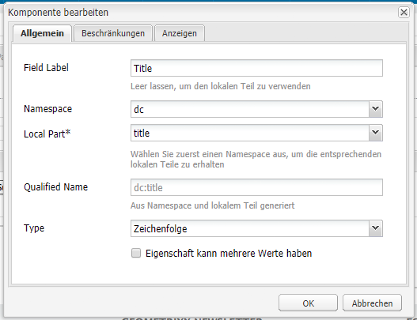
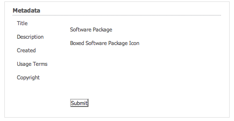
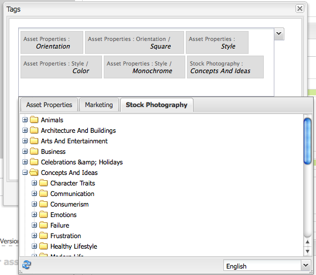

# Erstellen und Konfigurieren der Asset Editor-Seiten {#creating-and-configuring-asset-editor-pages}

Dieses Dokument beschäftigt sich mit den folgenden Fragestellungen:

* Was spricht für die Erstellung angepasster Asset-Editor-Seiten?
* Wie werden Asset-Editor-Seiten erstellt und angepasst? (Hierbei handelt es sich um WCM-Seiten, mit denen Sie Metadaten anzeigen und bearbeiten sowie Aktionen für ein Asset ausführen können.)
* Wie werden mehrere Assets gleichzeitig bearbeitet?

<!-- TBD: Add UICONTROL tags. Need PM review. Flatten the structure a bit. Re-write to remove Geometrixx mentions and to adhere to 6.5 default samples. -->

>[!NOTE]
>
>Asset-Freigabe ist als Open-Source-Refrerenzimplementierung verfügbar. Siehe [Asset-Freigabe](https://adobe-marketing-cloud.github.io/asset-share-commons/). Wird nicht offiziell unterstützt.

## Warum Assets Editor-Seiten erstellen und konfigurieren? {#why-create-and-configure-asset-editor-pages}

Digital Asset Management wird in einer immer größeren Anzahl von Szenarien eingesetzt. Wenn Sie von einer kleinen Benutzergruppe mit professionell geschulten Benutzern - z. B. Fotografen oder Taxonomen - zu größeren und vielfältigeren Benutzergruppen - wie z. B. Geschäftskunden, WCM-Autoren, Journalisten usw. wechseln, kann die leistungsstarke Benutzeroberfläche von [!DNL Adobe Experience Manager Assets] für professionelle Anwender zu viele Informationen und Interessengruppen-Beginn bereitstellen, um bestimmte Benutzeroberflächen oder Anwendungen für den Zugriff auf die für sie relevanten digitalen Assets anzufordern.

Diese Asset-orientierten Anwendungen können einfache Fotogalerien in einem Intranet sein, in denen Mitarbeiter Fotos von Messebesuchen oder einem Pressezentrum auf einer öffentlich zugänglichen Website hochladen können. Asset-orientierte Anwendungen können sich auch auf Komplettlösungen, einschließlich Warenkorb, Kassen- und Prüfprozessen, erstrecken.

Eine Asset-orientierte Anwendung zu erstellen, wird so in erster Linie zu einem Konfigurationsvorgang, der keinerlei Kodierung erfordert. Sie müssen lediglich mit den Benutzergruppen, deren Bedürfnissen und den verwendeten Metadaten vertraut sein. Asset-orientierte Anwendungen, die mit [!DNL Assets] erstellt wurden, sind erweiterbar: Mit moderatem Kodieraufwand können wiederverwendbare Komponenten für die Suche, Anzeige und Bearbeitung von Assets erstellt werden.

Eine Asset-orientierte Anwendung in [!DNL Experience Manager] besteht aus einer Asset-Editor-Seite, mit der eine detaillierte Ansicht eines bestimmten Assets abgerufen werden kann. Über eine Asset-Editor-Seite können zudem Metadaten bearbeitet werden, sofern der Benutzer, der auf das Asset zugreift, über die erforderlichen Berechtigungen verfügt.

<!--
## Create and configure an Asset Share page {#creating-and-configuring-an-asset-share-page}

You customize the DAM Finder functionality and create pages that have all the functionality you require, which are called Asset Share pages. To create a new Asset Share page, you add the page using the Geometrixx Asset Share template and then you customize the actions users can perform on that page, determine how viewers see the assets, and decide how users can build their queries.

Here are some use cases for creating a customized Asset Share page:

* Press Center for Journalists.
* Image Search Engine for internal business users.
* Image Database for website users.
* Media Tagging Interface for metadata editors.

### Create an Asset Share page {#creating-an-asset-share-page}

To create a new Asset Share page, you can either create it when you are working on web sites or from the digital asset manager.

>[!NOTE]
>
>By default, when you create an Asset Share page from **New** in the digital asset manager, an Asset viewer and Asset editor are automatically created for you.

To create an new Asset Share page in the **Websites** console:

1. In the **Websites** tab, navigate to the place where you want to create an asset share page and click **New**.

1. Select the **Asset Share** page and click **Create**. The new page is created and the asset share page is listed in the **Websites** tab.

The basic page created using the Geometrixx DAM Asset Share template looks as follows:

To customize your Asset Share page, you use elements from the sidekick and you also edit query builder properties. The page **Geometrixx Press Center** is a customized version of a page based on this template:

To create a new asset share page via the digital asset manager:

1. In the digital asset manager, in **New**, select **New Asset Share**.
1. In the **Title**, enter the name of the asset share page. If desired, enter a name for the URL.

   

1. Double-click the asset share page to open it and configure the page.

   

   By default, when you create an Asset Share page from **New**, an Asset viewer and Asset editor are automatically created for you.

#### Customize actions {#customizing-actions}

You can determine what actions users can perform on selected digital assets from a selection of predefined actions.

To add actions to the Asset Share page:

1. In the Asset Share page that you want to customize, click **Actions** in the sidekick.

The following actions are available:

 | Action | Description |
 |---|---|
 | [!UICONTROL Delete Action] | Users can delete the selected assets. |
 | [!UICONTROL Download Action] | Lets users download selected assets to their computers. |
 | [!UICONTROL Lightbox Action] | Saves assets to a "lightbox"   where you can perform other actions on them. This comes in handy when working   with assets across multiple pages. The lightbox can also be used as a   shopping cart for assets. |
 | [!UICONTROL Move Action] | Users can move the asset to another   location |
 | [!UICONTROL Tags Action] | Lets users add tags to selected assets |
 | [!UICONTROL View Asset Action] | Opens the asset in the Asset editor for   user manipulation. |

1. Drag the appropriate action to the **Actions** area on the page. Doing so creates a button that is used to execute that action.

#### Determine how search results are presented {#determining-how-search-results-are-presented}

You determine how results are displayed from a predefined list of lenses.

To change how search results are viewed:

1. In the Asset Share page that you want to customize, click Search.

1. Drag the appropriate lens to the top center of the page. In the Press Center, the lenses are already available. Users press the appropriate lens icon to display search results as desired.

The following lenses are available:

| Lens | Description |
|---|---|
| **[!UICONTROL List Lens]** |Presents the assets in a list fashion with details. |
| **[!UICONTROL Mosaic Lens]** |Presents assets in a mosaic fashion. |

#### Mosaic Lens {#mosaic-lens}

#### List Lens {#list-lens}

#### Customize the Query Builder {#customizing-the-query-builder}

The query builder lets you enter search terms and create content for the Asset Share page. When you edit the query builder, you also get to determine how many search results are displayed per page, which asset editor opens when you double-click an asset, the path the query searches, and customizes nodetypes.

To customize the query builder:

1. In the Asset Share page that you want to customize, click **Edit** in the Query Builder. By default, the **General** tab opens.
1. Select the number of results per page, the path of the asset editor (if you have a customized asset editor) and the Actions title.

1. Click the **Paths** tab. Enter a path or multiple paths that the search will run. These paths are overwritten if the user uses the Paths predicate.

1. Enter another node type, if desired.

1. In the **Query Builder URL** field, you can override or wrap the query builder and enter the new servlet URLs with the existing query builder component. In the **Feed URL** field, you can override the Feed URL as well.

1. In the **Text** field, enter the text you want to appear for results and page numbers of results. Click **OK** when finished making changes.

#### Add predicates {#adding-predicates}

Experience Manager Assets includes a number of predicates that you can add to the Asset Share page. These let your users further narrow searches. In some cases, they may override a query builder parameter (for example, the Path parameter).

To add predicates:

1. In the Asset Share page that you want to customize, click **Search**.

1. Drag the appropriate predicates to the Asset Share page underneath the query builder. Doing so creates the appropriate fields.

The following predicates are available:

| Predicate | Description |
|---|---|
| **[!UICONTROL Date Predicate]** |Lets users search for assets that were modified before and after certain dates. |
| **[!UICONTROL Options Predicate]** |The site owner can specify a property to search for (as in the property predicate, for example cq:tags) and a content tree to populate the options from (for example the tag tree). Doing so generates a list of options where the users can select the values (tags) that the selected property (tag property) should have. This predicate lets you build list controls like the list of tags, file types, image orientations, and so on. It is great for a fixed set of options. |
| **[!UICONTROL Path Predicate]** |Lets users define the path and subfolders, if desired. |
| **[!UICONTROL Property Predicate]** |The site owner specifies a property to search for, e.g. tiff:ImageLength and the user can then enter a value, e.g. 800. This returns all images that are 800 pixels high. Useful predicate if your property can have arbitrary values. |

For more information, see the [predicate Javadocs](https://helpx.adobe.com/experience-manager/6-5/sites/developing/using/reference-materials/javadoc/com/day/cq/search/eval/package-summary.html).

1. To configure the predicate further, double-click it. For example, when you open the Path Predicate, you need to assign the root path.

-->

## Erstellen und Konfigurieren einer Asset Editor-Seite {#creating-and-configuring-an-asset-editor-page}

Durch Anpassen des Asset-Editors können Sie bestimmen, wie Benutzer digitale Assets anzeigen und bearbeiten können. Hierzu erstellen Sie eine neue Asset-Editor-Seite und passen dann die Ansichten und die Aktionen, die der Benutzer ausführen kann, auf dieser Seite an.

>[!NOTE]
>
>Wenn Sie benutzerdefinierte Felder zum DAM-Asset-Editor hinzufügen möchten, fügen Sie `cq:Widget`-Knoten zu `/apps/dam/content/asseteditors.` hinzu

### Erstellen einer Asset-Editor-Seite {#creating-the-asset-editor-page}

Beim Erstellen von Asset-Editor-Seiten hat es sich bewährt, die Seite direkt unter der Asset-Freigabe-Seite anzulegen.

So erstellen Sie eine Asset-Editor-Seite:

1. Navigieren Sie auf der Registerkarte **[!UICONTROL Websites]** an die Stelle, an der eine Asset-Editor-Seite erstellt werden soll, und klicken Sie auf **Neu**.
1. Wählen Sie **Geometrixx-Asset-Editor** und klicken Sie auf **Erstellen**. Die neue Seite wird erstellt und auf der Registerkarte **Websites** aufgeführt.

Die mit der Vorlage „Geometrixx-Asset-Editor“ erstellte Standardseite sieht wie folgt aus:

Anpassen können Sie die Asset-Editor-Seite mithilfe der Elemente aus dem Sidekick. Die Asset Editor-Seite, auf die über das **Geometrixx Press Center** zugegriffen wird, ist eine benutzerdefinierte Version einer Seite, die auf dieser Vorlage basiert:

#### Asset-Editor zum Öffnen auf einer Asset-Freigabeseite {#setting-which-asset-editor-opens-from-an-asset-share-page} festlegen

Nachdem Sie die angepasste Asset-Editor-Seite erstellt haben, müssen Sie sicherstellen, dass beim Doppelklicken auf Assets über die von Ihnen erstellte angepasste Asset-Freigabe die Assets auf der angepassten Editorseite geöffnet werden.

So stellen Sie die Asset-Editor-Seite ein:

1. Klicken Sie auf der Asset-Freigabe-Seite neben dem Query Builder auf **Bearbeiten**.

1. Klicken Sie auf die Registerkarte **Allgemein**, sofern diese nicht bereits ausgewählt ist.

1. Geben Sie in das Feld **Pfad des Asset-Editors** den Pfad zu dem Asset-Editor ein, in dem die Asset-Freigabe-Seite Assets öffnen soll, und klicken Sie auf **OK**.

#### hinzufügen Asset Editor-Komponenten {#adding-asset-editor-components}

Sie können bestimmen, welche Funktionen ein Asset-Editor besitzt, indem Sie der Seite Komponenten hinzufügen.

So fügen Sie Asset-Editor-Komponenten hinzu:

1. Klicken Sie auf der anzupassenden Asset-Editor-Seite im Sidekick auf **Asset-Editor**. Alle verfügbaren Asset-Editor-Komponenten werden angezeigt.

>[!NOTE]
>
>Was angepasst werden kann, hängt von den verfügbaren Komponenten ab. Zum Aktivieren von Komponenten wechseln Sie in den Designmodus und wählen Sie die zu aktivierenden Komponenten aus.

1. Ziehen Sie die Komponenten aus dem Sidekick in den Asset-Editor und nehmen Sie Änderungen in den Komponentendialogen vor. Die Komponenten werden in der folgenden Tabelle kurz und in den darauffolgenden Anweisungen ausführlicher beschrieben.

>[!NOTE]
>
>Beim Entwerfen der Asset-Editor-Seite können Sie Komponenten erstellen, die entweder schreibgeschützt oder bearbeitbar sind. Benutzer wissen, dass ein Feld bearbeitet werden kann, wenn ein Bleistiftsymbol in einer Komponente angezeigt wird. Standardmäßig sind die meisten Komponenten mit Schreibschutz eingerichtet.

| Komponente | Beschreibung |
|---|---|
| **[!UICONTROL Metadaten-] Formular- und  [!UICONTROL Metadaten-Textfeld]** | Ermöglicht das Hinzufügen zusätzlicher Metadaten zu einem Asset und das Durchführen einer Aktion, z. B. das Senden, zu diesem Asset. |
| **[!UICONTROL Unter-Assets]** | Ermöglicht das Anpassen von Teilassets. |
| **Tags** | Ermöglicht Benutzern das Auswählen und Hinzufügen von Tags zu einem Asset. |
| **[!UICONTROL Miniaturansicht]** | Zeigt eine Miniaturansicht des Assets und den Dateinamen an und ermöglicht das Hinzufügen eines alternativen Textes. Hierüber können Sie zudem Asset-Editor-Aktionen hinzufügen. |
| **[!UICONTROL Titel]** | Zeigt den Asset-Titel an, der angepasst werden kann. |

#### Metadatenformular und Textfeld – Konfigurieren der Komponente für die Metadatenanzeige {#metadata-form-and-text-field-configuring-the-view-metadata-component}

Das Metadatenformular ist ein Formular mit Start- und Endaktion. Dazwischen nehmen Sie Eingaben in die **Textfelder** vor. Weitere Informationen über das Arbeiten mit Formularen finden Sie unter [Formulare](/help/sites-authoring/default-components-foundation.md#form-component).

1. Erstellen Sie eine Startaktion, indem Sie im Startbereich des Formulars auf **Bearbeiten** klicken. Sie können einen Box-Titel eingeben, sofern gewünscht. Standardmäßig lautet der Box-Titel **Metadaten**. Aktivieren Sie das Kontrollkästchen „Client-Validierung“, wenn JavaScript-Clientcode zwecks Validierung generiert werden soll.

1. Erstellen Sie eine Endaktion, indem Sie im Endbereich des Formulars auf **Bearbeiten** klicken. Sie können beispielsweise eine Option **[!UICONTROL Senden]** erstellen, mit der Benutzer ihre Metadatenänderungen senden können. Optional können Sie eine Option **Zurücksetzen** hinzufügen, mit der die Metadaten auf ihren ursprünglichen Status zurückgesetzt werden.

1. Ziehen Sie zwischen **Formular-Start** und **Formular-Ende** die Metadaten-Textfelder in das Formular. Benutzer füllen diese Textfelder mit Metadaten auf, die übermittelt werden können oder für die eine weitere Aktion ausgeführt werden kann.

1. Doppelklicken Sie auf den Feldnamen, z. B. **Titel**, um das Metadatenfeld zu öffnen und Änderungen vorzunehmen. Auf der Registerkarte **Allgemein** des Fensters **Komponente bearbeiten** definieren Sie den Namespace und die Feldbezeichnung sowie den Typ, z. B. `dc:title`.

Informationen zum Ändern der im Metadatenformular verfügbaren Namensraum finden Sie unter [Anpassen und Erweitern von Assets](/help/assets/extending-assets.md).

1. Klicken Sie auf die Registerkarte **Beschränkungen**. Hier können Sie festlegen, ob ein Feld erforderlich ist, und ggf. weitere Beschränkungen hinzufügen.

1. Klicken Sie auf die Registerkarte **Anzeigen**. Hier können Sie einen neuen Breitenwert und die Anzahl der Zeilen für das Metadatenfeld eingeben. Aktivieren Sie das Kontrollkästchen **Feld ist schreibgeschützt**, damit Benutzer die Metadaten bearbeiten können.

Es folgt ein Beispiel für ein Metadatenformular mit verschiedenen Feldern:

Auf der Asset-Editor-Seite können Benutzer dann Werte in die Metadatenfelder eingeben (sofern diese bearbeitbar sind) und die Endaktion ausführen (etwa Änderungen übermitteln).

#### Unter-Assets {#sub-assets}

Über die Komponente „Unter-Assets“ können Sie Unter-Assets anzeigen und auswählen. Sie können festlegen, welche Namen unter dem [Haupt-Asset](/help/assets/assets.md#what-are-digital-assets) und den Unter-Assets angezeigt werden.

Doppelklicken Sie auf die Komponente „Unter-Assets“, um das gleichnamige Dialogfeld zu öffnen, in dem Sie die Titel für das Haupt-Asset und etwaige Unter-Assets ändern können. Die Standardwerte werden unter dem entsprechenden Feld angezeigt.

Es folgt ein Beispiel für eine ausgefüllte Komponente „Unter-Assets“:

Achten Sie z. B. bei Auswahl eines Unter-Assets darauf, wie die Komponente die entsprechende Seite anzeigt und sich der Box-Titel von „Unter-Assets“ zu „Gleichgeordnete“ ändert.

#### Tags {#tags}

Mit der Komponente „Tags“ können Benutzer einem Asset vorhandene Tags zuweisen, was sich später bei Organisation und Abruf als hilfreich erweist. Sie können diese Komponente mit Schreibschutz versehen, sodass Benutzer Tags zwar anzeigen, aber nicht hinzufügen können.

Doppelklicken Sie auf die Komponente „Tags“, um das gleichnamige Dialogfeld zu öffnen, in dem Sie den Titel „Tags“ ggf. ändern und die zugewiesenen Namespaces auswählen können. Um dieses Feld bearbeitbar zu machen, deaktivieren Sie das Kontrollkästchen **[!UICONTROL Bearbeiten]** ausblenden. Standardmäßig können Tags bearbeitet werden.

Wenn Benutzer Tags bearbeiten können, können sie auf das Bleistiftsymbol klicken, um Tags durch Auswahl aus dem Dropdownmenü hinzuzufügen.

Es folgt ein Beispiel für eine ausgefüllte Komponente „Tags“:

#### Miniaturansicht  {#thumbnail}

In der Komponente „Miniatur“ zeigt das Asset die ausgewählte Miniatur an (für eine Vielzahl der Formate wird die Miniatur automatisch extrahiert). Außerdem präsentiert die Komponente den Dateinamen und [von Ihnen veränderbare Aktionen](/help/assets/assets-finder-editor.md#adding-asset-editor-actions).

Doppelklicken Sie auf die Komponente „Miniatur“, um den gleichnamigen Dialog zum Ändern des ALT-Texts zu öffnen. Standardmäßig ist der alt-Text für die Miniaturansicht standardmäßig auf **Klicken, um das**-Asset herunterzuladen.

Es folgt ein Beispiel für eine ausgefüllte Komponente „Miniatur“:

#### Titel {#title}

Über die Komponente „Titel“ werden der Titel des Assets sowie eine Beschreibung angezeigt.

Standardmäßig liegt die Komponente im schreibgeschützten Modus vor, um eine Bearbeitung durch Benutzer zu verhindern. Damit sie bearbeitet werden kann, doppelklicken Sie auf die Komponente und deaktivieren Sie das Kontrollkästchen **Bearbeitungsschaltfläche ausblenden**. Geben Sie außerdem einen Titel für mehrere Assets ein.

Wenn der Titel bearbeitbar ist, können Sie einen Titel und eine Beschreibung hinzufügen, indem Sie auf das Bleistiftsymbol klicken und so das Fenster **Asset-Eigenschaften** öffnen. Darüber hinaus ist es möglich, das Asset durch Auswahl von Datum und Uhrzeit zu aktiveren bzw. zu deaktivieren.

Beim Bearbeiten von [!UICONTROL Titel] können Benutzer die **Titel**, **Beschreibung** ändern und **An- und** Aus-Zeiten **eingeben, um das Asset zu aktivieren bzw. zu deaktivieren.**

Es folgt ein Beispiel für eine ausgefüllte Komponente „Titel“:

#### hinzufügen Asset Editor-Aktionen {#adding-asset-editor-actions}

Sie können anhand einer Auswahl vordefinierter Aktionen festlegen, welche Aktionen Benutzer für ausgewählte digitale Assets ausführen können.

So fügen Sie der Asset-Editor-Seite Aktionen hinzu:

1. Klicken Sie auf der Seite &quot;Asset-Editor&quot;, die Sie anpassen möchten, im Sidekick auf **Asset-Editor**.

Die folgenden Aktionen stehen zur Verfügung:

| Aktion | Beschreibung |
|---|---|
| [!UICONTROL Download] | Ermöglicht Benutzern das Herunterladen der ausgewählten   Assets auf ihren Computern. |
| [!UICONTROL Editoren] | Ermöglicht Benutzern das Bearbeiten eines Bildes   (Interaktive Bearbeitung) |
| [!UICONTROL Lightbox] | Speichert Assets in einem   &quot;lightbox&quot;, wo Sie andere Aktionen ausführen können. Dies ist praktisch, wenn über mehrere Seiten hinweg an Assets gearbeitet wird. |
| [!UICONTROL Sperren] | Ermöglicht Benutzern das Sperren eines Assets. Diese Funktion ist nicht standardmäßig aktiviert und muss in der Liste der Komponenten aktiviert werden. |
| [!UICONTROL Verweise] | Klicken Sie hier, um auf welchen Seiten anzuzeigen   das Asset verwendet wird. |
| [!UICONTROL Versionierung] | Ermöglicht die Erstellung und Wiederherstellung   Versionen eines Assets. |

1. Ziehen Sie die entsprechende Aktion in den Bereich **Aktionen** auf der Seite. Es wird eine Option erstellt, mit der die Aktion ausgeführt wird, die auf die Seite gezogen wird.

## Assets mit der Asset-Editor-Seite {#multi-editing-assets-with-the-asset-editor-page} bearbeiten

Mit [!DNL Experience Manager Assets] können Sie Änderungen an mehreren Assets gleichzeitig vornehmen. Nach Auswahl der Assets können Sie bei diesen gleichzeitig Folgendes ändern:

* Tags
* Metadaten

So führen Sie eine Mehrfachbearbeitung von Assets mit der Asset-Editor-Seite durch:

1. Öffnen Sie die Seite Geometrixx **Pressezentrum**:
   `https://localhost:4502/content/geometrixx/en/company/press.html`

1. Wählen Sie die Assets aus:

   * Windows: `Ctrl + click` jedes Asset.
   * Mac: `Cmd + click` jedes Asset.

   So wählen Sie einen Asset-Bereich aus: Klicken Sie auf das erste Asset und dann auf das letzte Asset.`Shift + click`

1. Klicken Sie im Feld **Aktionen** auf **Metadaten bearbeiten** (linker Seitenbereich).
1. Die Geometrixx-Seite mit dem **Pressezentrum-Asset-Editor** wird auf einer neuen Registerkarte geöffnet. Die Metadaten der Assets werden wie folgt angezeigt:

   * Ein Tag, das nicht für alle Assets gilt, sondern nur für einige wenige, wird kursiv dargestellt.
   * Ein Tag, das für alle Assets gilt, wird mit einer normalen Schriftart angezeigt.
   * Andere Metadaten als Tags: Der Wert des Felds wird nur angezeigt, wenn dieser für alle ausgewählten Assets identisch ist.

1. Klicken Sie auf **Herunterladen**, um eine ZIP-Datei herunterzuladen, die die ursprünglichen Ausgabeformate der Assets enthält.
1. Klicken Sie auf die Option Tags bearbeiten, die neben dem Feld **Tags** steht.

   * Ein Tag, das nicht für alle Assets gilt, sondern nur für einige wenige, hat einen grauen Hintergrund.
   * Ein Tag, das für alle Assets gilt, hat einen weißen Hintergrund.

   Sie haben folgende Möglichkeiten:

   * Klicken Sie auf `x`, um das Tag für alle Assets zu entfernen.
   * Klicken Sie auf `+`, um das Tag allen Assets hinzuzufügen.
   * Klicken Sie auf den **Pfeil** und wählen Sie ein Tag aus, um allen Assets ein neues Tag hinzuzufügen.

   Klicken Sie auf **OK**, um die Änderungen in das Formular zu schreiben. Das Kästchen neben dem Feld **Tags** wird automatisch aktiviert.

1. Bearbeiten Sie das Feld Beschreibung. Legen Sie beispielsweise Folgendes fest:

   `This is a common description`

   Wenn ein Feld bearbeitet wird, überschreibt sein Wert die vorhandenen Werte der ausgewählten Assets, wenn das Formular gesendet wird.

   Hinweis: Das Kästchen neben dem Feld wird automatisch aktiviert, wenn das Feld bearbeitet wird.

1. Klicken Sie auf **Metadaten aktualisieren**, um das Formular abzusenden und die Änderungen für alle Assets zu speichern.

   Hinweis: nur die geprüften Metadaten geändert werden.
