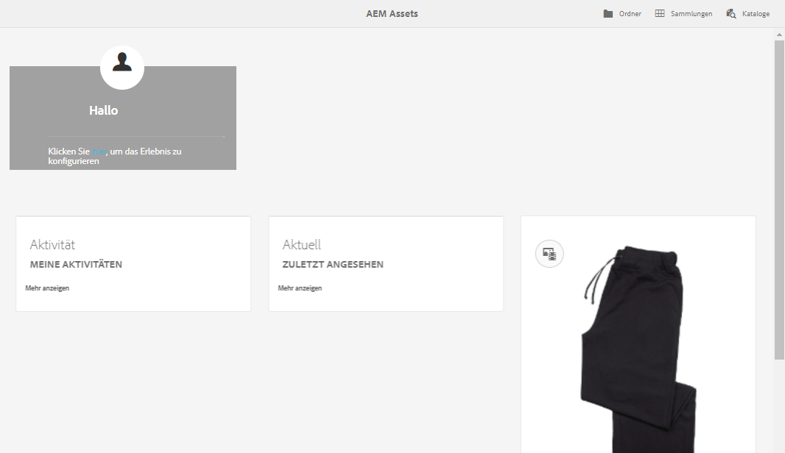

# [!DNL Adobe Experience Manager Assets] Startseite  {#aem-assets-home-page-experience}

Personalisieren Sie die [!DNL Adobe Experience Manager Assets]-Startseite für einen umfassenden Begrüßungsbildschirm, einschließlich einer Momentaufnahme der letzten Aktivitäten um Assets.

[!DNL Assets] Die Startseite bietet eine umfassende und personalisierte Benutzeroberfläche, die eine Momentaufnahme der letzten Aktivitäten enthält, z. B. der zuletzt angezeigten oder hochgeladenen Assets.

Die Startseite [!DNL Assets] ist standardmäßig deaktiviert. Gehen Sie wie folgt vor, um sie zu aktivieren:

1. Öffnen Sie [!DNL Experience Manager] Configuration Manager `https://[aem_server]:[port]/system/console/configMgr`.
1. Öffnen Sie den Dienst **[!UICONTROL Day CQ DAM Ereignis Recorder]**.
1. Wählen Sie **[!UICONTROL Aktivieren Sie diesen Dienst]**, um die Aufzeichnung der Aktivität zu aktivieren.

   

1. Wählen Sie in der Liste **[!UICONTROL Ereignistyp]** die aufzuzeichnenden Ereignis aus und speichern Sie die Änderungen.

   >[!CAUTION]
   >
   >Die Aktivierung der Optionen „Angezeigte Assets“, „Angezeigte Projekte“ und „Angezeigte Sammlungen“ erhöht die Anzahl der aufgezeichneten Ereignisse erheblich.

1. Öffnen Sie den Dienst **[!UICONTROL DAM Asset Startseite Feature Flag]** in Configuration Manager `https://[aem_server]:[port]/system/console/configMgr`.
1. Wählen Sie die Option `isEnabled.name`, um die Funktion [!DNL Assets] &quot;Startseite&quot;zu aktivieren. Speichern Sie die Änderungen.

   

1. Öffnen Sie das Dialogfeld **[!UICONTROL Benutzereinstellungen]** und wählen Sie **[!UICONTROL Startseite &quot;Elemente aktivieren]**&quot;aus. Speichern Sie die Änderungen.

   

Nachdem Sie die [!DNL Assets]-Startseite aktiviert haben, navigieren Sie zur [!DNL Assets]-Benutzeroberfläche entweder von der Navigationsseite oder greifen Sie direkt über die URL `https://[aem_server]:[port]/aem/assetshome.html/content/dam` zu.

Klicken Sie auf **[!UICONTROL Klicken Sie hier, um Ihren Erlebnis-Link]** zu konfigurieren, um Ihren Benutzernamen, Ihr Hintergrundbild und Ihr Profil-Bild hinzuzufügen.

Die [!DNL Assets]-Startseite umfasst die folgenden Abschnitte:

* Begrüßungsabschnitt
* Widget-Abschnitt

**Begrüßungsabschnitt** 

Wenn Ihr Profil vorhanden ist, wird im Begrüßungsabschnitt eine Begrüßungsnachricht für Sie angezeigt. Außerdem werden Ihr Profil und ein Begrüßungsbild angezeigt (falls bereits konfiguriert).

Wenn Ihr Profil unvollständig ist, zeigt der Begrüßungsabschnitt eine generische Begrüßungsnachricht und einen Platzhalter für Ihr Profilbild an.

**Widget-Abschnitt** 

Dieser Abschnitt wird unter dem Begrüßungsabschnitt angezeigt und bietet fertige Widgets unter den folgenden Abschnitten:

* Aktivität
* Aktuell
* Entdecken

**Aktivität**: Unter diesem Abschnitt zeigt das  **[!UICONTROL My]** Activity Widget die letzten Aktivitäten an, die der angemeldete Benutzer mit Assets (einschließlich Assets ohne Ausgabeformate) durchgeführt hat, z. B. Asset-Uploads, Downloads, Asset-Erstellung, Bearbeitungen, Kommentare, Anmerkungen und Teilen-Vorgänge.

**Zuletzt**: Das  **[!UICONTROL Widget &quot;Zuletzt]** angezeigt&quot;unter diesem Abschnitt zeigt kürzlich aufgerufene Entitäten des angemeldeten Benutzers an, einschließlich Ordner, Sammlungen und Projekte.

**Discover**: Das  **** Widget unter diesem Abschnitt zeigt die Assets und Darstellungen an, die kürzlich in die  [!DNL Assets] Bereitstellung hochgeladen wurden.

Um das Bereinigen von Benutzerdaten zu aktivieren, aktivieren Sie den Dienst **[!UICONTROL DAM Ereignis Purge Service]** in Configuration Manager. Nachdem Sie den Dienst aktiviert haben, werden die Aktivitäten des angemeldeten Benutzers, die eine bestimmte Anzahl überschreiten, vom System gelöscht.

Der Begrüßungsbildschirm enthält einfache Navigationshilfen, z. B. Symbole in der Symbolleiste für das Zugreifen auf Ordner, Sammlungen und Kataloge.

>[!NOTE]
>
>Durch Aktivierung der Dienste [!UICONTROL Day CQ DAM Ereignis Recorder] und [!UICONTROL DAM Ereignis Purge] erhöhen Sie die Schreibvorgänge in JCR und die Suchindizierung, was die Belastung des [!DNL Experience Manager]-Servers erheblich erhöht. Die zusätzliche Belastung des [!DNL Experience Manager]-Servers kann sich auf seine Leistung auswirken.

>[!CAUTION]
>
>Das Erfassen, Filtern und Bereinigen von Aktivitäten, die für die [!DNL Assets]-Startseite erforderlich sind, bedeutet einen Leistungsaufwand. Daher sollten Administratoren die Homepage für Zielbenutzer effektiv konfigurieren.
>
>Adobe empfiehlt Administratoren und Benutzern, die mit großen Datenmengen arbeiten, die Verwendung der Asset-Homepage-Funktion zu vermeiden, um einen Anstieg der Benutzeraktivitäten zu verhindern. Außerdem können Administratoren Aufzeichnungsaktivitäten von bestimmten Benutzern unterbinden, indem sie den [!UICONTROL Day CQ DAM Event Recorder][!UICONTROL  vom Configuration Manager aus konfigurieren].
>
>Wenn Sie die Funktion verwenden, empfiehlt Adobe, dass Sie die Bereinigungsfrequenz auf der Grundlage der Serverlast planen.
