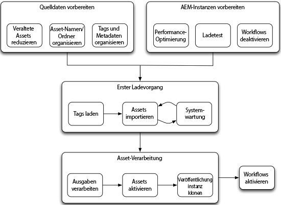

# Massenmigrierung von Assets {#assets-migration-guide}

Bei der Migration von Assets zu [!DNL Adobe Experience Manager] sind mehrere Schritte zu beachten. Das Extrahieren von Assets und Metadaten aus ihrer aktuellen Startseite fällt nicht in den Geltungsbereich dieses Dokuments, da es bei den Implementierungen stark variiert. In diesem Dokument wird jedoch beschrieben, wie Sie diese Assets in [!DNL Experience Manager] einbinden, ihre Metadaten anwenden, Ausgabedarstellungen generieren und sie für Veröffentlichungsinstanzen aktivieren können.

## Voraussetzungen {#prerequisites}

Bevor Sie einen der Schritte in dieser Methode tatsächlich durchführen, überprüfen und implementieren Sie die Anleitungen in [Tipps zur Leistungsoptimierung von Assets](performance-tuning-guidelines.md). Viele dieser Schritte, etwa die Konfiguration einer maximalen Anzahl gleichzeitiger Aufträge, führt zu einer deutlich höheren Stabilität und Leistung der Server unter Last. Andere Schritte wie die Konfiguration eines Dateidatenspeichers erweisen sich als wesentlich schwieriger, nachdem Assets in das System geladen wurden.

>[!NOTE]
>
>Die folgenden Tools zur Asset-Migration sind nicht Teil von [!DNL Experience Manager] und werden von Adobe nicht unterstützt:
>
>* Tag Maker von ACS AEM-Tools
>* CSV Asset Importer von ACS AEM-Tools
>* Bulk Workflow Manager von ACS Commons
>* Fast Action Manager von ACS Commons
>* Synthetic Workflow

>
>
Hierbei handelt es sich um eine Open-Source-Software. Sie wird mit der [Apache v2-Lizenz](https://adobe-consulting-services.github.io/pages/license.html) abgedeckt. Um eine Frage zu stellen oder ein Problem zu melden, besuchen Sie den Bereich für die entsprechenden [GitHub-Probleme für ACS AEM-Tools](https://github.com/Adobe-Consulting-Services/acs-aem-commons/issues) und [ACS AEM Commons](https://github.com/Adobe-Consulting-Services/acs-aem-tools/issues).

## Migration zu [!DNL Experience Manager] {#migrating-to-aem}

Die Migration von Assets zu [!DNL Experience Manager] erfordert mehrere Schritte und sollte als stufenweiser Prozess betrachtet werden. Die Migrationsphasen lauten wie folgt:

1. Deaktivieren von Workflows.
1. Laden von Tags.
1. Aufnehmen von Assets.
1. Verarbeiten von Wiedergaben.
1. Aktivieren von Assets.
1. Aktivieren von Workflows.

### Deaktivieren von Workflows {#disabling-workflows}

Deaktivieren Sie vor Beginn der Migration Ihre Starter für den Workflow [!UICONTROL DAM Update Asset] . Am besten nehmen Sie zunächst alle Assets in das System auf und führen dann die Workflows stapelweise aus. Wenn Ihr System bereits „live“ ist, während die Migration durchgeführt wird, können Sie diese Aktivitäten so planen, dass sie außerhalb der Arbeitszeiten ausgeführt werden.

### Laden von Tags {#loading-tags}

Womöglich verfügen Sie bereits über eine Tag-Taxonomie für Ihre Bilder. Während Tools wie der CSV Asset Importer und die [!DNL Experience Manager]-Unterstützung für Metadatenprofile den Prozess der Anwendung von Tags auf Assets automatisieren können, müssen die Tags in das System geladen werden. Mit [Tag Maker von ACS AEM-Tools](https://adobe-consulting-services.github.io/acs-aem-tools/features/tag-maker/index.html) können Sie Tags mithilfe einer in das System geladenen Microsoft Excel-Tabelle auffüllen.

### Aufnehmen von Assets {#ingesting-assets}

Leistung und Stabilität sind wichtige Faktoren bei der Aufnahme von Assets in das System. Da Sie eine große Datenmenge in das System laden, sollten Sie eine möglichst optimale Systemleistung sicherstellen, um den erforderlichen Zeitaufwand zu minimieren und eine Überlastung des Systems zu vermeiden, die zu einem Systemabsturz führen kann. Dies gilt insbesondere für Systeme, die bereits produktiv eingesetzt werden.

Es gibt zwei Herangehensweisen zum Laden von Assets in das System: ein Push-basierter Ansatz mit HTTP oder ein Pull-basierter Ansatz mit JCR-APIs.

#### Senden über HTTP {#pushing-through-http}

Das Managed Services-Team von Adobe lädt Daten mit einem Tool namens Glutton in Kundenumgebungen. Glutton ist eine kleine Java-Anwendung, die alle Assets aus einem Verzeichnis in ein anderes Verzeichnis in einer [!DNL Experience Manager] -Implementierung lädt. Statt Glutton können Sie auch Tools wie Perl-Skripts zum Posten der Assets in das Repository verwenden.

Der Push-basierte Ansatz mit HTTP hat zwei wesentliche Nachteile:

1. Die Assets müssen über HTTP an den Server übertragen werden. Dies ist mit einem gewissen (zeitlichen) Mehraufwand verbunden, sodass die Migration länger dauert.
1. Wenn Tags und benutzerdefinierte Metadaten auf die Assets angewendet werden müssen, erfordert dieser Ansatz einen zweiten benutzerdefinierten Prozess, der zum Anwenden dieser Metadaten auf die Assets durchgeführt werden muss (nach dem Asset-Import).

Der andere Ansatz zur Aufnahme von Assets sieht einen Pull der Assets aus dem lokalen Dateisystem vor. Kann jedoch kein externes Laufwerk bzw. keine Netzwerkfreigabe an den Server angebunden werden, um den Pull-basierten Ansatz durchzuführen, sollten die Assets am besten über HTTP gepostet werden.

#### Abrufen aus dem lokalen Dateisystem {#pulling-from-the-local-filesystem}

[CSV Asset Importer von ACS AEM-Tools](https://adobe-consulting-services.github.io/acs-aem-tools/features/csv-asset-importer/index.html) ruft Assets aus dem Dateisystem sowie Asset-Metadaten aus einer CSV-Datei zwecks Asset-Import ab. Die Experience Manager Asset Manager-API wird verwendet, um die Assets in das System zu importieren und die konfigurierten Metadateneigenschaften anzuwenden. Im Idealfall werden die Assets über eine Netzwerkdateibereitstellung oder über ein externes Laufwerk auf dem Server bereitgestellt.

Da Assets nicht über ein Netzwerk übertragen werden müssen, verbessert sich die Gesamtleistung erheblich, sodass diese Methode allgemein als effizienteste Möglichkeit zum Laden von Assets in das Repository gilt. Des Weiteren unterstützt das Tool auch die Aufnahme von Metadaten. Daher können Sie alle Assets und Metadaten in einem einzigen Schritt importieren und müssen keinen zusätzlichen zweiten Schritt zum Anwenden der Metadaten durch ein separates Tool erstellen.

### Verarbeiten von Wiedergaben {#processing-renditions}

Nachdem Sie die Assets in das System geladen haben, müssen Sie sie über den Workflow [!UICONTROL DAM Update Asset] verarbeiten, um Metadaten zu extrahieren und Ausgabeformate zu generieren. Bevor Sie diesen Schritt durchführen, müssen Sie den Workflow [!UICONTROL DAM Update Asset] duplizieren und an Ihre Anforderungen anpassen. Der vordefinierte Workflow enthält viele Schritte, die möglicherweise nicht für Sie erforderlich sind, z. B. die Dynamic Media-PTIFF-Generierung oder die Integration von [!DNL InDesign Server].

Wenn Sie den Workflow den Anforderungen entsprechend konfiguriert haben, stehen Ihnen zwei Optionen zur Ausführung zur Verfügung:

1. Die einfachste Herangehensweise bietet [Bulk Workflow Manager von ACS Commons](https://adobe-consulting-services.github.io/acs-aem-commons/features/bulk-workflow-manager.html). Mit diesem Tool können Sie eine Abfrage ausführen und die Ergebnisse der Abfrage durch einen Workflow verarbeiten. Darüber hinaus gibt es auch Optionen zum Festlegen von Stapelgrößen.
1. Sie können [Fast Action Manager von ACS Commons](https://adobe-consulting-services.github.io/acs-aem-commons/features/fast-action-manager.html) zusammen mit [Synthetic Workflows](https://adobe-consulting-services.github.io/acs-aem-commons/features/synthetic-workflow.html) verwenden. Dieser Ansatz ist zwar viel stärker involviert, ermöglicht jedoch die Beseitigung des Mehraufwands für die Workflow-Engine [!DNL Experience Manager] bei gleichzeitiger Optimierung der Nutzung von Serverressourcen. Darüber hinaus steigert der Fast Action Manager die Leistung durch die dynamische Überwachung der Serverressourcen und die Einschränkung der Systemlast. Beispielskripte wurden auf der Seite mit den ACS Commons-Funktionen bereitgestellt.

### Aktivieren von Assets {#activating-assets}

Bei Bereitstellungen mit einer Veröffentlichungsstufe müssen Sie die Assets für die Veröffentlichungsfarm aktivieren. Zwar empfiehlt Adobe die Ausführung von mehr als einer Veröffentlichungsinstanz, dennoch ist es am effizientesten, alle Assets in einer Veröffentlichungsinstanz zu replizieren und dann diese Instanz zu klonen. Wird eine große Anzahl von Assets nach Auslösen einer Strukturaktivierung aktiviert, müssen Sie ggf. eingreifen. Dies ist der Grund: Beim Auslösen von Aktivierungen werden Elemente zur Sling-Auftrags-/Ereigniswarteschlange hinzugefügt. Bei einer Warteschlangengröße von mehr als ca. 40.000 Elementen wird die Verarbeitung deutlich langsamer. Wenn die Größe dieser Warteschlange die Zahl von 100.000 Elementen übersteigt, wird die Systemstabilität beeinträchtigt.

Um hier Abhilfe zu schaffen, können Sie [Fast Action Manager](https://adobe-consulting-services.github.io/acs-aem-commons/features/fast-action-manager.html) für die Asset-Verwaltung einsetzen. Dies funktioniert ohne Sling-Warteschlangen und sorgt für weniger Mehraufwand, während der Workload gedrosselt wird, um eine Überlastung des Servers zu vermeiden. Ein Beispiel für die Verwendung von FAM zur Replikationsverwaltung finden Sie auf der Dokumentationsseite für die Funktion.

Zu weiteren Optionen zum Übertragen von Assets in die Veröffentlichungsfarm gehören u. a. [vlt-rcp](https://jackrabbit.apache.org/filevault/rcp.html) und [oak-run](https://github.com/apache/jackrabbit-oak/tree/trunk/oak-run), die als Tools mit Jackrabbit bereitgestellt werden. Eine weitere Möglichkeit ist die Verwendung eines Open-Source-Tools für Ihre [!DNL Experience Manager]-Infrastruktur mit dem Namen [Grabbit](https://github.com/TWCable/grabbit), das schneller sein soll als vlt.

Jeder dieser Ansätze ist dahingehend eingeschränkt, dass die Assets in der Autoreninstanz nicht als aktiviert angezeigt werden. Um diese Assets mit dem korrekten Aktivierungsstatus zu kennzeichnen, müssen Sie ein Skript ausführen, damit die Assets als aktiviert markiert werden.

>[!NOTE]
>
>Adobe bietet weder Wartung noch Unterstützung für Grabbit.

### Klonen von Veröffentlichungen {#cloning-publish}

Nach Aktivierung der Assets können Sie Ihre Veröffentlichungsinstanz klonen, um die zur Bereitstellung benötigte Anzahl an Kopien zu erstellen. Einen Server zu klonen, ist ein relativ unkomplizierter Vorgang. Dabei müssen jedoch einige wichtige Schritte berücksichtigt werden. So klonen Sie eine Veröffentlichungsinstanz:

1. Sichern Sie die Quellinstanz und den Datenspeicher.
1. Stellen Sie die Sicherung der Instanz und des Datenspeichers am Zielspeicherort wieder her. Die folgenden Schritte beziehen sich allesamt auf diese neue Instanz.
1. Führen Sie unter `crx-quickstart/launchpad/felix` eine Dateisystemsuche nach `sling.id` durch. Löschen Sie diese Datei.
1. Suchen und löschen Sie etwaig vorhandene `repository-XXX`-Dateien im Stammverzeichnis.
1. Bearbeiten Sie `crx-quickstart/install/org.apache.jackrabbit.oak.plugins.blob.datastore.FileDataStore.config` und `crx-quickstart/launchpad/config/org/apache/jackrabbit/oak/plugins/blob/datastore/FileDataStore.config`, um auf den Speicherort des Datenspeichers in der neuen Umgebung zu zeigen.
1. Starten Sie die Umgebung.
1. Aktualisieren Sie die Konfiguration aller Replikationsagenten auf Autorseite so, dass auf die korrekten Veröffentlichungsinstanzen verwiesen wird, bzw. die Agenten „Dispatcher leeren“ der neuen Instanz so, dass auf die korrekten Dispatcher für die neue Umgebung verwiesen wird.

### Aktivieren von Workflows {#enabling-workflows}

Nach Abschluss der Migration sollten die Starter für die Workflows [!UICONTROL DAM Update Asset] erneut aktiviert werden, um die Ausgabegenerierung und Metadatenextraktion für die laufende tägliche Systemnutzung zu unterstützen.

## Migrieren zwischen [!DNL Experience Manager] -Implementierungen {#migrating-between-aem-instances}

Obwohl dies nicht so häufig vorkommt, müssen Sie manchmal große Datenmengen von einer [!DNL Experience Manager] -Implementierung zu einer anderen migrieren. Wenn Sie beispielsweise ein [!DNL Experience Manager]-Upgrade durchführen, aktualisieren Sie Ihre Hardware oder migrieren Sie zu einem neuen Rechenzentrum, z. B. mit einer AMS-Migration.

In diesem Fall sind die Assets schon mit Metadaten aufgefüllt und Wiedergaben sind bereits generiert. Sie können sich einfach darauf konzentrieren, Assets zwischen Instanzen zu verschieben. Führen Sie bei der Migration zwischen der [!DNL Experience Manager]-Bereitstellung die folgenden Schritte aus:

1. Workflows deaktivieren: Da Sie Ausgabeformate zusammen mit unseren Assets migrieren, möchten Sie die Workflow-Starter für den Workflow [!UICONTROL DAM Update Asset] deaktivieren.

1. Tags migrieren: Da Sie bereits Tags in der [!DNL Experience Manager]-Bereitstellung geladen haben, können Sie sie in einem Inhaltspaket erstellen und das Paket auf der Zielinstanz installieren.

1. Migrieren von Assets: Es werden zwei Tools zum Verschieben von Assets von einer [!DNL Experience Manager]-Bereitstellung in eine andere empfohlen:

   * **Vault Remote** Copyor vlt rcp ermöglicht Ihnen die Verwendung von vlt in einem Netzwerk. Nach Angabe eines Quell- und Zielverzeichnisses lädt vlt alle Repositorydaten von einer Instanz herunter und lädt diese in die andere Instanz. Die Dokumentation zum vlt rcp-Tool finden Sie unter [https://jackrabbit.apache.org/filevault/rcp.html](https://jackrabbit.apache.org/filevault/rcp.html)
   * **** Grabbitis ist ein Open-Source-Tool zur Inhaltssynchronisierung, das von Time Warner Cable für ihre  [!DNL Experience Manager] Implementierung entwickelt wurde. Durch die Nutzung kontinuierlicher Datenströme weist das Tool im Vergleich zu vlt rcp eine geringere Latenz auf. Darüber hinaus soll es zwei- bis zehnmal schneller sein als vlt rcp. Grabbit unterstützt zudem die alleinige Synchronisierung von Delta-Inhalten, sodass Änderungen nach erfolgreich abgeschlossener Erstmigration synchronisiert werden.

1. Aktivieren von Assets: Befolgen Sie die Anweisungen für [Aktivieren von Assets](#activating-assets), dokumentiert für die Erstmigration nach [!DNL Experience Manager].

1. Clone publish: Wie bei einer neuen Migration ist es effizienter, eine einzelne Veröffentlichungsinstanz zu laden und zu klonen, als den Inhalt auf beiden Knoten zu aktivieren. Siehe [Klonen von Veröffentlichungsinstanzen](#cloning-publish).

1. Aktivieren Sie Workflows: Nachdem Sie die Migration abgeschlossen haben, aktivieren Sie die Starter für den Workflow [!UICONTROL DAM Update Asset] erneut, um die Ausgabegenerierung und Metadatenextraktion für die laufende, tagtägliche Systemnutzung zu unterstützen.
