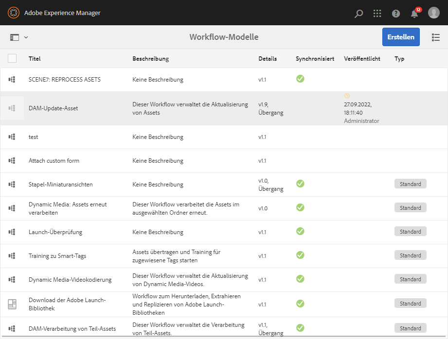
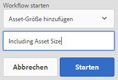
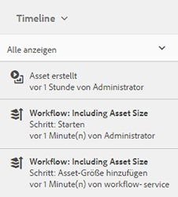
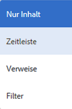

# Digitale Assets verarbeiten {#process-assets}

[!DNL Adobe Experience Manager Assets] ermöglicht Ihnen, Ihre digitalen Assets auf vielfältige Weise zu bearbeiten, um eine robuste Asset-Verarbeitung zu ermöglichen. Sie können die standardmäßigen oder angepassten Verarbeitungsmethoden verwenden, um den Abschluss von End-to-End-Geschäftsprozessen, Prüfungen und Kompatibilität, Erkennung und Verteilung sowie die grundlegende Zuverlässigkeit Ihrer digitalen Assets sicherzustellen. Sie können die Asset-Management-Aufgaben ausführen und dabei die erforderliche Skalierung und Anpassung durchführen.

## Verstehen Sie Workflows {#understand-workflows}

Bei der Asset-Verarbeitung verwendet [!DNL Experience Manager] Workflows. Workflows helfen bei der Automatisierung der Geschäftslogik oder der Aktivitäten. Granuläre Schritte zum Ausführen bestimmter Aufgaben werden standardmäßig bereitgestellt, und Entwickler können eigene benutzerdefinierte Schritte erstellen. Diese Schritte können in einer logischen Reihenfolge kombiniert werden, um Workflows zu erstellen. Ein Workflow kann beispielsweise Wasserzeichen auf hochgeladene Bilder anwenden, die auf bestimmten Kriterien basieren, wie dem hochgeladenen Ordner, der Bildauflösung usw. Ein weiteres Beispiel ist ein Workflow, der für Wasserzeichen konfiguriert ist und gleichzeitig Metadaten hinzufügt, Darstellungen erstellt, intelligente Tags hinzugefügt und in einem Datenspeicher veröffentlicht wird.

## Workflows verfügbar in [!DNL Experience Manager] {#default-workflows}

Standardmäßig werden alle hochgeladenen Assets mit dem Arbeitsablauf [!UICONTROL DAM Update Asset] verarbeitet. Der Arbeitsablauf wird für jedes hochgeladene Asset ausgeführt und führt grundlegende Aufgaben zur Asset-Verwaltung durch, wie z. B. Generierung von Ausgabeformaten, Schreibback von Metadaten, Extraktion von Seiten, Extraktion von Medien und Transkodierung.

Die verschiedenen Workflow-Modelle, die standardmäßig verfügbar sind, finden Sie unter **[!UICONTROL Werkzeuge > Workflow > Modelle]** in [!DNL Experience Manager].

*Abbildung: Einige der standardmäßigen Workflows in  [!DNL Experience Manager].*

## Anwenden von Workflows auf die Verarbeitung von Assets {#applying-workflows-to-assets}

Das Anwenden von Workflows auf digitale Assets entspricht dem Vorgehen bei den Seiten einer Website. Eine vollständige Anleitung zum Erstellen und Verwenden von Workflows finden Sie unter [Beginn Workflows](/help/sites-authoring/workflows-participating.md).

Nutzen Sie Workflows in digitalen Assets, um das Asset zu aktivieren oder Wasserzeichen zu erstellen. Viele Workflows für Assets werden automatisch aktiviert. Beispielsweise wird der Workflow, mit dem nach der Bearbeitung eines Bildes automatisch ein Ausgabeformat erstellt wird, automatisch aktiviert.

>[!NOTE]
>
>Wenn ein in der klassischen Benutzeroberfläche verfügbarer Workflow in der touchfähigen Benutzeroberfläche nicht verfügbar ist, wie z. B. [!UICONTROL Aktivieren] und [!UICONTROL Deaktivieren]-Anforderung, siehe [Workflow-Modelle erstellen](/help/sites-developing/workflows-models.md#classic2touchui).

## Anwenden eines Workflows auf ein Asset {#apply-a-workflow-to-an-asset}

<!-- 
TBD: Add animated GIF for these steps instead of all these screenshots.
-->
Gehen Sie wie folgt vor, um einen Workflow auf ein Asset anzuwenden:

1. Navigieren Sie zum Speicherort des Assets, für das Sie einen Workflow erstellen möchten, und klicken Sie auf das Asset, um die Asset-Seite zu öffnen. Wählen Sie **[!UICONTROL Zeitschiene]** aus dem Menü, um die Zeitschiene anzuzeigen.

   

1. Klicken Sie unten auf **[!UICONTROL Aktionen]**, um die Liste der für das Asset verfügbaren Aktionen zu öffnen.

1. Klicken Sie in der Liste auf **[!UICONTROL Beginn-Workflow]**.

1. Wählen Sie im Dialogfeld **[!UICONTROL Workflow starten]** ein Workflow-Modell aus der Liste.

1. (Optional) Geben Sie einen Titel für den Workflow an, der verwendet werden kann, um auf die Instanz des Workflows zu verweisen.

   

1. Klicken Sie auf **[!UICONTROL Beginn]** und dann auf **[!UICONTROL Fortfahren]**. Jeder Schritt des Workflows wird in der Zeitleiste als ein Ereignis angezeigt.

   

## Anwenden eines Workflows auf mehrere Assets {#applying-a-workflow-to-multiple-assets}

1. Navigieren Sie in der Konsole [!DNL Assets] zum Speicherort der Assets, für die Sie einen Workflow Beginn haben möchten, und wählen Sie die Assets aus. Wählen Sie **[!UICONTROL Zeitschiene]** aus dem Menü, um die Zeitschiene anzuzeigen.

   

1. Klicken Sie unten auf **[!UICONTROL Aktionen]** .
1. Klicken Sie auf **[!UICONTROL Workflow starten]**. Wählen Sie im Dialogfeld **[!UICONTROL Workflow starten]** ein Workflow-Modell aus der Liste.

   

1. (Optional) Geben Sie einen Titel für den Workflow an, der für den Verweis auf die Workflow-Instanz verwendet werden kann.
1. Klicken Sie auf **[!UICONTROL Starten]** und anschließend im Dialogfeld auf **[!UICONTROL Bestätigen]**. Der Workflow wird für alle Assets ausgeführt, die Sie ausgewählt haben.

## Anwenden eines Workflows auf mehrere Ordner {#applying-a-workflow-to-multiple-folders}

Die Vorgehensweise zum Anwenden eines Workflows auf mehrere Ordner ähnelt der Vorgehensweise beim Anwenden eines Workflows auf mehrere Assets. Wählen Sie die Ordner in der [!DNL Assets]-Schnittstelle aus und führen Sie die Schritte 2-7 des Verfahrens [Einen Workflow auf mehrere Assets](/help/assets/assets-workflow.md#applying-a-workflow-to-multiple-assets) aus.

## Anwenden eines Workflows auf eine Sammlung {#applying-a-workflow-to-a-collection}

Siehe [Einen Workflow auf eine Sammlung anwenden](/help/assets/manage-collections.md#running-a-workflow-on-a-collection).

## Automatisches Beginn eines Workflows zur bedingten Verarbeitung von Assets{#auto-execute-workflow-on-some-assets}

Administratoren können Arbeitsabläufe so konfigurieren, dass Assets auf der Grundlage vordefinierter Bedingungen automatisch ausgeführt und verarbeitet werden. Diese Funktion ist beispielsweise nützlich für Benutzer und Marketingfachleute, um einen benutzerdefinierten Workflow für bestimmte Ordner zu erstellen. Angenommen, alle Assets aus dem Foto einer Agentur können mit einem Wasserzeichen versehen oder alle von einem freiberuflichen Anbieter hochgeladenen Assets können verarbeitet werden, um bestimmte Darstellungen zu erstellen.

Für ein Workflow-Modell können Benutzer einen Workflow-Starter erstellen, der es ausführt. Ein Workflow-Starter überwacht Änderungen im Inhalts-Repository und führt den Workflow aus, wenn die vordefinierten Bedingungen erfüllt sind. Administratoren können Marketingexperten Zugriff gewähren, um die Workflows zu erstellen und den Starter zu konfigurieren. Benutzer können den standardmäßigen Arbeitsablauf [!UICONTROL DAM Update Asset] ändern, um die zusätzlichen Schritte hinzuzufügen, die zur Verarbeitung bestimmter Assets erforderlich sind. Der Workflow wird für alle neu hochgeladenen Assets ausgeführt. Verwenden Sie einen der folgenden Ansätze, um die Ausführung der zusätzlichen Schritte für bestimmte Assets zu beschränken:

* Erstellen Sie eine Kopie des Workflows [!UICONTROL DAM Update Asset] und ändern Sie ihn, um es in einer bestimmten Ordnerhierarchie auszuführen. Dieser Ansatz ist für einige Ordner nützlich.
* Die zusätzlichen Verarbeitungsschritte können mit einem [OR split](/help/sites-developing/workflows-step-ref.md#or-split) hinzugefügt werden, sofern dies bedingt für so viele Ordner wie erforderlich gilt.

## Best Practices und Einschränkungen {#best-practices-limitations-tips}

* Berücksichtigen Sie beim Entwickeln von Workflows Ihre Anforderungen für alle Arten von Ausgabedarstellungen. Wenn Sie der Meinung sind, dass eine Ausgabedarstellung in Zukunft nicht erforderlich sein wird, entfernen Sie den Erstellungsschritt aus dem Workflow. Ausgabedarstellungen können später nicht mehr stapelweise gelöscht werden. Unerwünschte Ausgabedarstellungen können nach längerer Nutzung von [!DNL Experience Manager] viel Speicherplatz beanspruchen. Bei einzelnen Assets können Sie Ausgabedarstellungen manuell aus der Benutzeroberfläche entfernen. Bei mehreren Assets können Sie [!DNL Experience Manager] so anpassen, dass entweder bestimmte Ausgabedarstellungen gelöscht oder die Assets gelöscht und die gelöschten Assets erneut hochgeladen werden.
* Der Arbeitsablauf für [!UICONTROL DAM-Aktualisierung von Asset] umfasst standardmäßig einige Schritte zum Erstellen von Miniaturbildern und Webdarstellungen. Wenn Standarddarstellungen aus dem Workflow entfernt werden, wird die Benutzeroberfläche von [!DNL Assets] nicht richtig dargestellt.

>[!MORELIKETHIS]
>
>* [Workflows](/help/sites-authoring/workflows.md)
>* [Erstellen von Workflow-Modellen und Erweitern der Workflow-Funktionalität](/help/sites-developing/workflows.md)
>* [Methoden zum Ausführen Workflows](/help/sites-administering/workflows-starting.md)
>* [Best Practices für Arbeitsabläufe](/help/sites-developing/workflows-best-practices.md)

