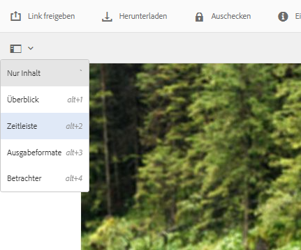

# Verarbeiten digitaler Assets {#process-assets}

[!DNL Adobe Experience Manager Assets] ermöglicht es Ihnen, auf vielerlei Weise an Ihren digitalen Assets zu arbeiten, um eine robuste Asset-Verarbeitung zu ermöglichen. Sie können die standardmäßigen oder benutzerdefinierten Verarbeitungsmethoden verwenden, um die End-to-End-Fertigstellung von Geschäftsprozessen, Audits und Compliance, Erkennung und Verteilung sowie grundlegende Sicherheit Ihrer digitalen Assets sicherzustellen. Sie können die Asset-Management-Aufgaben ausführen und dabei die erforderliche Skalierung und Anpassung erreichen.

## Grundlegendes zu Workflows {#understand-workflows}

Für die Asset-Verarbeitung verwendet [!DNL Experience Manager] Workflows. Workflows helfen bei der Automatisierung der Geschäftslogik oder der Aktivitäten. Granulare Schritte zum Ausführen bestimmter Aufgaben werden standardmäßig bereitgestellt und Entwickler können eigene benutzerdefinierte Schritte erstellen. Diese Schritte können in logischer Reihenfolge kombiniert werden, um Workflows zu erstellen. Beispielsweise kann ein Workflow Wasserzeichen auf hochgeladene Bilder anwenden, die auf bestimmten Kriterien basieren, z. B. auf den Ordner, in den er hochgeladen wird, die Auflösung des Bildes usw. Ein weiteres Beispiel ist ein Workflow, der für Wasserzeichen konfiguriert ist und gleichzeitig Metadaten hinzufügt, Ausgabeformate erstellt, intelligente Tags hinzufügt und in einem Datenspeicher veröffentlicht.

## Standard-Workflows verfügbar in [!DNL Experience Manager] {#default-workflows}

Standardmäßig werden alle hochgeladenen Assets mit dem Workflow [!UICONTROL DAM Update Asset] verarbeitet. Der Workflow wird für jedes hochgeladene Asset ausgeführt und führt grundlegende Asset-Verwaltungsaufgaben wie Ausgabegenerierung, Metadaten-Writeback, Seitenextraktion, Medienextraktion und Transkodierung durch.

Die verschiedenen Workflow-Modelle, die standardmäßig verfügbar sind, finden Sie unter **[!UICONTROL Tools > Workflow > Modelle]** in [!DNL Experience Manager].

*Abbildung: Einige der standardmäßigen Workflows sind in verfügbar  [!DNL Experience Manager].*

## Anwenden von Workflows zur Verarbeitung von Assets {#applying-workflows-to-assets}

Das Anwenden von Workflows auf digitale Assets entspricht dem Vorgehen bei den Seiten einer Website. Eine vollständige Anleitung zum Erstellen und Verwenden von Workflows finden Sie unter [Starten von Workflows](/help/sites-authoring/workflows-participating.md).

Nutzen Sie Workflows in digitalen Assets, um das Asset zu aktivieren oder Wasserzeichen zu erstellen. Viele Workflows für Assets werden automatisch aktiviert. Beispielsweise wird der Workflow, mit dem nach der Bearbeitung eines Bildes automatisch ein Ausgabeformat erstellt wird, automatisch aktiviert.

>[!NOTE]
>
>Wenn ein in der klassischen Benutzeroberfläche verfügbarer Workflow in der Touch-optimierten Benutzeroberfläche nicht verfügbar ist, z. B. [!UICONTROL Aktivierungsanfrage] und [!UICONTROL Deaktivierungsanfrage], siehe [Workflow-Modelle erstellen](/help/sites-developing/workflows-models.md#classic2touchui).

## Anwenden eines Workflows auf ein Asset {#apply-a-workflow-to-an-asset}

<!-- 
TBD: Add animated GIF for these steps instead of all these screenshots.
-->
Gehen Sie wie folgt vor, um einen Workflow auf ein Asset anzuwenden:

1. Navigieren Sie zum Speicherort des Assets, für das Sie einen Workflow starten möchten, und klicken Sie auf das Asset, um die Asset-Seite zu öffnen. Wählen Sie **[!UICONTROL Timeline]** aus dem Menü aus, um die Timeline anzuzeigen.

   

1. Klicken Sie unten auf **[!UICONTROL Aktionen]** , um die Liste der für das Asset verfügbaren Aktionen zu öffnen.

1. Klicken Sie in der Liste auf **[!UICONTROL Workflow]** starten .

1. Wählen Sie im Dialogfeld **[!UICONTROL Workflow starten]** ein Workflow-Modell aus der Liste.

1. (Optional) Geben Sie einen Titel für den Workflow an, mit dem auf die Workflow-Instanz verwiesen werden kann.

   

1. Klicken Sie auf **[!UICONTROL Start]** und dann auf **[!UICONTROL Fortfahren]**. Jeder Schritt des Workflows wird in der Zeitleiste als ein Ereignis angezeigt.

   

## Anwenden eines Workflows auf mehrere Assets {#applying-a-workflow-to-multiple-assets}

1. Navigieren Sie in der Konsole [!DNL Assets] zum Speicherort der Assets, für die Sie einen Workflow starten möchten, und wählen Sie die Assets aus. Wählen Sie **[!UICONTROL Timeline]** aus dem Menü aus, um die Timeline anzuzeigen.

   

1. Klicken Sie unten auf **[!UICONTROL Actions]**  .
1. Klicken Sie auf **[!UICONTROL Workflow starten]**. Wählen Sie im Dialogfeld **[!UICONTROL Workflow starten]** ein Workflow-Modell aus der Liste.

   

1. (Optional) Geben Sie einen Titel für den Workflow an, der für den Verweis auf die Workflow-Instanz verwendet werden kann.
1. Klicken Sie auf **[!UICONTROL Starten]** und anschließend im Dialogfeld auf **[!UICONTROL Bestätigen]**. Der Workflow wird für alle Assets ausgeführt, die Sie ausgewählt haben.

## Anwenden eines Workflows auf mehrere Ordner {#applying-a-workflow-to-multiple-folders}

Die Vorgehensweise zum Anwenden eines Workflows auf mehrere Ordner ähnelt der Vorgehensweise beim Anwenden eines Workflows auf mehrere Assets. Wählen Sie die Ordner in der [!DNL Assets]-Benutzeroberfläche aus und führen Sie die Schritte 2 bis 7 des Verfahrens [Anwenden eines Workflows auf mehrere Assets](/help/assets/assets-workflow.md#applying-a-workflow-to-multiple-assets) aus.

## Anwenden eines Workflows auf eine Sammlung {#applying-a-workflow-to-a-collection}

Siehe [Anwenden eines Workflows auf eine Sammlung](/help/assets/manage-collections.md#running-a-workflow-on-a-collection).

## Workflow automatisch starten, um Assets bedingt zu verarbeiten {#auto-execute-workflow-on-some-assets}

Administratoren können Workflows so konfigurieren, dass Assets basierend auf vordefinierten Bedingungen automatisch ausgeführt und verarbeitet werden. Die Funktion ist nützlich für Benutzer und Marketingexperten in Unternehmen, z. B. zum Erstellen eines benutzerdefinierten Workflows für bestimmte Ordner. Angenommen, alle Assets aus dem Foto-Shooting einer Agentur können mit einem Wasserzeichen versehen werden oder alle von einem Freiberufler hochgeladenen Assets können verarbeitet werden, um bestimmte Ausgabeformate zu erstellen.

Für ein Workflow-Modell können Benutzer einen Workflow-Starter erstellen, der ihn ausführt. Ein Workflow-Starter überwacht Änderungen im Inhalts-Repository und führt den Workflow aus, wenn die vordefinierten Bedingungen erfüllt sind. Administratoren können Marketing-Experten Zugriff gewähren, um die Workflows zu erstellen und den Starter zu konfigurieren. Benutzer können den standardmäßigen Workflow [!UICONTROL DAM Update Asset] ändern, um die zusätzlichen Schritte hinzuzufügen, die zur Verarbeitung bestimmter Assets erforderlich sind. Der Workflow wird für alle neu hochgeladenen Assets ausgeführt. Verwenden Sie einen der folgenden Ansätze, um die Ausführung der zusätzlichen Schritte für bestimmte Assets zu begrenzen:

* Erstellen Sie eine Kopie des Workflows [!UICONTROL DAM Update Asset] und ändern Sie ihn so, dass er in einer bestimmten Ordnerhierarchie ausgeführt wird. Dieser Ansatz ist für einige Ordner nützlich.
* Die zusätzlichen Verarbeitungsschritte können mit einer [ODER-Teilung](/help/sites-developing/workflows-step-ref.md#or-split) hinzugefügt werden, sofern sie bedingt für so viele Ordner wie erforderlich anwendbar sind.

## Best Practices und Einschränkungen {#best-practices-limitations-tips}

* Berücksichtigen Sie beim Entwickeln von Workflows Ihre Anforderungen für alle Arten von Ausgabedarstellungen. Wenn Sie der Meinung sind, dass eine Ausgabedarstellung in Zukunft nicht erforderlich sein wird, entfernen Sie den Erstellungsschritt aus dem Workflow. Ausgabedarstellungen können später nicht mehr stapelweise gelöscht werden. Unerwünschte Ausgabedarstellungen können nach längerer Nutzung von [!DNL Experience Manager] viel Speicherplatz beanspruchen. Bei einzelnen Assets können Sie Ausgabedarstellungen manuell aus der Benutzeroberfläche entfernen. Bei mehreren Assets können Sie [!DNL Experience Manager] so anpassen, dass entweder bestimmte Ausgabedarstellungen gelöscht oder die Assets gelöscht und die gelöschten Assets erneut hochgeladen werden.
* Standardmäßig umfasst der Workflow [!UICONTROL DAM Update Asset] einige Schritte zum Erstellen von Miniaturansichten und Web-Ausgabeformaten. Wenn Standardausgabeformate aus dem Workflow entfernt werden, wird die Benutzeroberfläche von [!DNL Assets] nicht ordnungsgemäß gerendert.

>[!MORELIKETHIS]
>
>* [Anwenden und Teilnahme an Workflows](/help/sites-authoring/workflows.md)
* [Erstellen von Workflow-Modellen und Erweitern der Workflow-Funktionalität](/help/sites-developing/workflows.md)
* [Methoden zum Ausführen von Workflows](/help/sites-administering/workflows-starting.md)
* [Best Practices bei Workflows](/help/sites-developing/workflows-best-practices.md)

