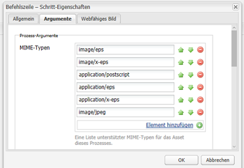
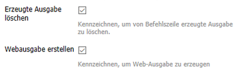
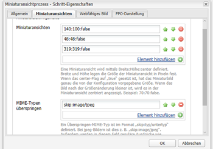
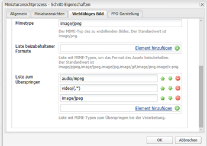

# Installieren und konfigurieren Sie ImageMagick für die Verwendung mit [!DNL Experience Manager Assets] {#install-and-configure-imagemagick-to-work-with-aem-assets}

ImageMagick ist ein Software-Plug-in zum Erstellen, Bearbeiten, Zusammenstellen oder Konvertieren von Bitmap-Bildern. Es kann Bilder in verschiedenen Formaten (über 200) lesen und schreiben, darunter PNG, JPEG, JPEG-2000, GIF, TIFF, DPX, EXR, WebP, Postscript, PDF und SVG. Verwenden Sie ImageMagick, um die Größe von Bildern zu ändern, Bilder zu kippen, zu spiegeln, zu drehen, zu verzerren, zuzuschneiden und umzuwandeln. Darüber hinaus können Sie mit ImageMagick die Bildfarben anpassen, verschiedene Spezialeffekte anwenden oder Text, Linien, Polygone, Ellipsen und Kurven zeichnen.

Verwenden Sie den Medien-Handler [!DNL Adobe Experience Manager] aus der Befehlszeile, um Bilder über ImageMagick zu verarbeiten. Unter [Best Practices für Assets-Dateiformate](/help/assets/assets-file-format-best-practices.md) finden Sie weitere Informationen zur Verwendung verschiedener Dateiformate mit ImageMagick. Unter [Von Assets unterstützte Formate](/help/assets/assets-formats.md) erfahren Sie mehr zu allen unterstützten Dateiformaten.

Um große Dateien mit ImageMagick zu verarbeiten, sollten Sie höhere Speicheranforderungen, potenzielle Änderungen an IM-Richtlinien und die Gesamtauswirkung auf die Leistung berücksichtigen. Die Speicheranforderungen hängen von verschiedenen Faktoren wie Auflösung, Bittiefe, Farbprofil und Dateiformat ab. Wenn Sie sehr große Dateien mit ImageMagick verarbeiten möchten, sollten Sie den [!DNL Experience Manager]-Server ordnungsgemäß als Benchmark verwenden. Einige hilfreiche Ressourcen finden Sie weiter unten.

>[!NOTE]
>
>Wenn Sie [!DNL Experience Manager] unter [!DNL Adobe Managed Services] (AMS) verwenden, wenden Sie sich an die Kundenunterstützung von Adobe, wenn Sie viele hochauflösende PSD- oder PSB-Dateien verarbeiten möchten. [!DNL Experience Manager] kann keine sehr hochauflösenden PSB-Dateien verarbeiten, die mehr als 30000 x 23000 Pixel sind.

## Installieren von ImageMagick {#installing-imagemagick}

Es sind mehrere ImageMagick-Installationsdateien für verschiedene Betriebssysteme verfügbar. Verwenden Sie die entsprechende Version für Ihr Betriebssystem.

1. Laden Sie die entsprechenden [ImageMagick-Installationsdateien](https://www.imagemagick.org/script/download.php) für Ihr Betriebssystem herunter.
1. Um ImageMagick auf dem Datenträger zu installieren, der den Server [!DNL Experience Manager] hostet, starten Sie die Installationsdatei.

1. Legen Sie die Path-Umgebungsvariable auf das ImageMagick-Installationsverzeichnis fest.
1. Um zu überprüfen, ob die Installation erfolgreich war, führen Sie den Befehl `identify -version` aus.

## Einrichten eines Befehlszeilenprozessschritts {#set-up-the-command-line-process-step}

Sie können den Befehlszeilenprozesssschritt für Ihren jeweiligen Anwendungsfall einrichten. Führen Sie diese Schritte aus, um jedes Mal, wenn Sie eine JPEG-Bilddatei zu `/content/dam` auf dem [!DNL Experience Manager]-Server hinzufügen, ein gespiegeltes Bild und Miniaturansichten (140x100, 48x48, 319x319 und 1280) zu generieren:

1. Wechseln Sie auf dem Server [!DNL Experience Manager] zur Workflow-Konsole (`https://[aem_server]:[port]/workflow`) und öffnen Sie das Workflow-Modell **[!UICONTROL DAM Update Asset]** .
1. Öffnen Sie im Workflow-Modell **[!UICONTROL DAM Update Asset]** den Schritt **[!UICONTROL EPS-Miniaturansichten (unterstützt von ImageMagick)]** .
1. Fügen Sie auf der Registerkarte **[!UICONTROL Argumente]** `image/jpeg` der Liste **[!UICONTROL MIME-Typen]** hinzu.

   

1. Geben Sie im Feld **[!UICONTROL Befehle]** folgenden Befehl ein:

   `convert ./${filename} -flip ./${basename}.flipped.jpg`

1. Wählen Sie die Flags **[!UICONTROL Erzeugte Ausgabe löschen]** und **[!UICONTROL Web-Ausgabe generieren]** aus.

   

1. Legen Sie auf der Registerkarte **[!UICONTROL Webfähiges Bild]** die Details für die Ausgabedarstellung mit 1280x1280 Pixel fest. Geben Sie außerdem `image/jpeg` im Feld **[!UICONTROL Mimetype]** an.

   

1. Klicken Sie auf **[!UICONTROL OK]**, um die Änderungen zu speichern.

   >[!NOTE]
   >
   >Der Befehl `convert` wird möglicherweise nicht mit bestimmten Windows-Versionen (z. B. Windows SE) ausgeführt, da er in Konflikt mit dem nativen Dienstprogramm `convert` steht, das Teil der Windows-Installation ist. Geben Sie in diesem Fall den vollständigen Pfad zum ImageMagick-Programm an. Geben Sie zum Beispiel Folgendes an:
   >
   >
   >`"C:\Program Files\ImageMagick-6.8.9-Q16\convert.exe" -define jpeg:size=319x319 ./${filename} -thumbnail 319x319 cq5dam.thumbnail.319.319.png`

1. Öffnen Sie den Schritt **[!UICONTROL Miniaturansichten verarbeiten]** und fügen Sie den MIME-Typ `image/jpeg` unter **[!UICONTROL MIME-Typen überspringen]** hinzu.

   

1. Fügen Sie auf der Registerkarte **[!UICONTROL Webfähiges Bild]** den MIME-Typ `image/jpeg` unter **[!UICONTROL Liste zum Überspringen]** hinzu. Klicken Sie auf **[!UICONTROL OK]**, um die Änderungen zu speichern.

   

1. Speichern Sie den Workflow.

1. Um die ordnungsgemäße Verarbeitung zu überprüfen, laden Sie ein JPG-Bild in [!DNL Assets] hoch. Überprüfen Sie nach Abschluss der Verarbeitung, ob ein gespiegeltes Bild und die Ausgabeformate generiert wurden oder nicht.

## Minimieren von Sicherheitslücken {#mitigating-security-vulnerabilities}

Aus der Verwendung von ImageMagick für die Bearbeitung von Bildern resultieren mehrere Sicherheitslücken. Beispielsweise bringt die Verarbeitung von Bildern, die von Benutzern übermittelt wurden, das Risiko der Ferncodeausführung mit sich.

Außerdem ist eine Reihe von Bildverarbeitungs-Plug-ins von der ImageMagick-Bibliothek abhängig, darunter „imagick“ von PHP, „rmagick“ und „paperclip“ von Ruby sowie „imagemagick“ von Nodejs.

Wenn Sie ImageMagick oder eine betroffene Bibliothek verwenden, empfiehlt Adobe, die bekannten Sicherheitslücken zu minimieren, indem Sie mindestens eine der folgenden Aufgaben ausführen (vorzugsweise beide):

1. Stellen Sie sicher, dass alle Bilddateien mit den erwarteten [&quot;magischen Bytes&quot;](https://en.wikipedia.org/wiki/List_of_file_signatures) beginnen, die den von Ihnen unterstützten Bilddateitypen entsprechen, bevor Sie sie zur Verarbeitung an ImageMagick senden.
1. Verwenden Sie eine Richtliniendatei, um die verwundbaren ImageMagick-Codes zu deaktivieren. Die globale Richtlinie für ImageMagick finden Sie unter `/etc/ImageMagick`.
