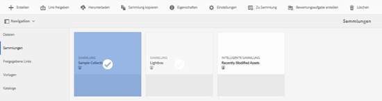

# Veröffentlichen von Sammlungen in Brand Portal {#publish-collections-to-brand-portal}

Als Adobe Experience Manager (AEM) Assets-Administrator können Sie für Ihre Organisation Sammlungen in der AEM Assets Brand Portal-Instanz veröffentlichen. Allerdings müssen Sie zunächst AEM Assets mit Brand Portal integrieren. Weitere Informationen finden Sie unter [Konfigurieren der von AEM Assets mit Brand Portal](/help/assets/configure-aem-assets-with-brand-portal.md).

Wenn Sie nachfolgende Änderungen an der ursprünglichen Sammlung in AEM Assets vornehmen, werden die Änderungen erst dann in Brand Portal übernommen, wenn Sie die Sammlung erneut veröffentlichen. Diese Eigenschaft stellt sicher, dass laufende Änderungen in Brand Portal nicht verfügbar sind. Nur genehmigte, von einem Administrator veröffentlichte Änderungen sind in Brand Portal verfügbar.

>[!NOTE]
>
>Inhaltsfragmente können nicht in Brand Portal veröffentlicht werden. Wenn Sie daher in der AEM-Autoreninstanz Inhaltsfragmente auswählen, ist die Aktion **In Brand Portal veröffentlichen** nicht verfügbar.
>
>Wenn Sammlungen, die Inhaltsfragmente enthalten, über die AEM-Autoreninstanz in Brand Portal veröffentlicht werden, wird der gesamte Inhalt des Ordners mit Ausnahme der Inhaltsfragmente auf der Brand Portal-Oberfläche repliziert.

## Veröffentlichen einer Sammlung in Brand Portal {#publish-a-collection-to-brand-portal}

1. Klicken Sie in der Benutzeroberfläche von AEM Assets auf das AEM-Logo.
1. Gehen Sie von der Seite **Navigation** aus zu **Assets > Sammlungen**.
1. Wählen Sie in der Konsole &quot;Sammlungen&quot;die Sammlung aus, die Sie in Brand Portal veröffentlichen möchten.

   

1. Klicken Sie in der Symbolleiste auf **In Brand Portal veröffentlichen**.
1. Klicken Sie im Bestätigungsdialogfeld auf **Veröffentlichen**.
1. Schließen Sie die Bestätigungsmeldung.
1. Melden Sie sich bei Brand Portal als Administrator an. Die veröffentlichte Sammlung steht in der Konsole „Sammlungen“ zur Verfügung.

   

## Veröffentlichung von Sammlungen rückgängig machen {#unpublish-collections}

Sie können die Veröffentlichung von Sammlungen, die Sie aus AEM Assets in Brand Portal veröffentlichen, rückgängig machen. Nachdem Sie die Veröffentlichung der ursprünglichen Sammlung rückgängig gemacht haben, ist die Kopie nicht mehr für Brand Portal-Benutzer verfügbar.

1. Wählen Sie über die Konsole „Sammlungen“ der AEM Assets-Instanz die Sammlung aus, deren Veröffentlichung rückgängig gemacht werden soll.

   

1. Klicken Sie in der Symbolleiste auf das Symbol **Aus Brand Portal löschen**.
1. Klicken Sie im Dialogfeld auf **Veröffentlichung rückgängig machen**.
1. Schließen Sie die Bestätigungsmeldung. Die Sammlung wird aus der Brand Portal-Oberfläche entfernt.
