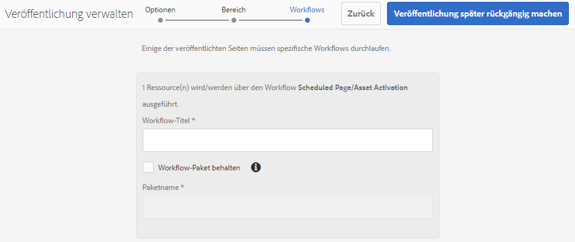

# Veröffentlichen von Ordnern in Brand Portal{#publish-folders-to-brand-portal}

Als Adobe Experience Manager (AEM) Assets-Administrator können Sie für Ihre Organisation Assets und Ordner in der AEM Assets Brand Portal-Instanz veröffentlichen (oder den Veröffentlichungs-Workflow für einen späteren Zeitpunkt planen). Allerdings müssen Sie zunächst AEM Assets mit Brand Portal integrieren. Weitere Informationen finden Sie unter [Konfigurieren der von AEM Assets mit Brand Portal](/help/assets/configure-aem-assets-with-brand-portal.md).

Nachdem Sie ein Asset oder einen Ordner veröffentlicht haben, ist es für Benutzer in Brand Portal verfügbar.

Wenn Sie nachfolgende Änderungen am ursprünglichen Asset oder Ordner in AEM Assets vornehmen, werden die Änderungen erst dann in Brand Portal übernommen, wenn Sie das Asset oder den Ordner erneut veröffentlichen. Mit dieser Funktion wird sichergestellt, dass Änderungen im Rahmen der laufenden Bearbeitung nicht in Brand Portal verfügbar sind. Nur genehmigte, von einem Administrator veröffentlichte Änderungen sind in Brand Portal verfügbar.

## Veröffentlichen von Ordnern in Brand Portal {#publish-folders-to-brand-portal-1}

1. Bewegen Sie in der AEM Assets-Benutzeroberfläche den Mauszeiger über den gewünschten Ordner und wählen Sie in den Schnellaktionen die Option **Publish** aus.

   Alternativ können Sie den gewünschten Ordner auswählen und den weiteren Schritten folgen.

   

1. **Ordner jetzt veröffentlichen** 

   Um die ausgewählten Ordner in Brand Portal zu veröffentlichen, führen Sie einen der folgenden Schritte aus:

   * Wählen Sie in der Symbolleiste **Quick Publish** aus. Wählen Sie dann im Menü **In Brand Portal veröffentlichen** aus.

   * Wählen Sie in der Symbolleiste **Veröffentlichung verwalten** aus.
   1. Wählen Sie **Aktion** **Auf Brand Portal veröffentlichen** aus, wählen Sie **Planung** **Jetzt** aus und klicken Sie auf **Weiter**.
   1. Bestätigen Sie Ihre Auswahl in **Umfang** und klicken Sie auf **In Brand Portal veröffentlichen**.

   Eine Meldung erscheint, die besagt, dass der Ordner zur Veröffentlichung in Brand Portal in die Warteschlange gestellt wurde. Melden Sie sich bei der Brand Portal-Benutzeroberfläche an, um den veröffentlichten Ordner zu sehen.

   **Ordner später veröffentlichen**

   So planen Sie die Veröffentlichung von Asset-Ordnern in Brand Portal auf einen späteren Zeitpunkt:

   1. Nachdem Sie die zu veröffentlichenden Assets/Ordner ausgewählt haben, wählen Sie in der Symbolleiste oben **Veröffentlichung verwalten** aus.
   1. Wählen Sie unter **Aktion** **Auf Brand Portal veröffentlichen** und unter **Planung** **Später** aus.

      

   1. Wählen Sie ein **Aktivierungsdatum** aus und geben Sie die Zeit an. Klicken Sie auf **Weiter**.
   1. Bestätigen Sie Ihre Auswahl unter **Umfang**. Klicken Sie auf **Weiter**.
   1. Geben Sie einen Workflow-Titel unter **Workflows** an. Klicken Sie auf **Später veröffentlichen**.

      

## Veröffentlichung von Ordnern in Brand Portal rückgängig machen {#unpublish-folders-from-brand-portal}

Sie können alle in Brand Portal veröffentliche Assets/Ordner entfernen, indem Sie die Veröffentlichung über die AEM-Autoreninstanz rückgängig machen. Nachdem Sie die Veröffentlichung des ursprünglichen Ordners aufgehoben haben, ist dessen Kopie nicht mehr für Brand Portal-Benutzer verfügbar.

Sie können die Veröffentlichung der Ordner in Brand Portal sofort rückgängig machen oder diesen Vorgang für einen späteren Zeitpunkt planen. So machen Sie die Veröffentlichung von Assets/Ordnern in Brand Portal rückgängig:

1. Wählen Sie in der AEM Assets-Benutzeroberfläche in der AEM-Autoreninstanz den Ordner aus, dessen Veröffentlichung Sie rückgängig machen möchten.

   

1. Klicken Sie in der Symbolleiste auf **Veröffentlichung verwalten**.

1. **Veröffentlichung in Brand Portal jetzt rückgängig machen**

   So können Sie die Veröffentlichung des gewünschten Ordners in Brand Portal schnell rückgängig machen:

   1. Wählen Sie in der Symbolleiste **Veröffentlichung verwalten** aus.
   1. Wählen Sie unter **Aktion** **Veröffentlichung in Brand Portal rückgängig machen**, unter **Planung** **Jetzt** und klicken Sie auf **Weiter**.
   1. Bestätigen Sie Ihre Auswahl in **Umfang** und klicken Sie auf **Veröffentlichung in Brand Portal rückgängig machen**.

   

   **Veröffentlichung später in Brand Portal rückgängig machen**

   So können Sie die Veröffentlichung eines Ordners in Brand Portal zu einem späteren Zeitpunkt rückgängig machen:

   1. Wählen Sie in der Symbolleiste **Veröffentlichung verwalten** aus.
   1. Wählen Sie unter **Aktion** **Veröffentlichung in Brand Portal rückgängig machen** und unter **Planung** **Später** aus.
   1. Wählen Sie ein **Aktivierungsdatum** aus und geben Sie die Zeit an. Klicken Sie auf **Weiter**.
   1. Bestätigen Sie Ihre Auswahl unter **Umfang** und klicken Sie auf **Weiter**.
   1. Geben Sie einen **Workflow-Titel** in **Workflows** an. Klicken Sie auf **Veröffentlichung später rückgängig machen.**

      

>[!NOTE]
>
>Das Veröffentlichen/Rückgängigmachen der Veröffentlichung eines Assets in/von Brand Portal ähnelt dem entsprechenden Verfahren für einen Ordner.
