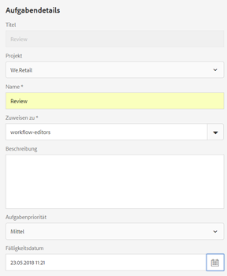
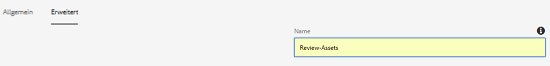
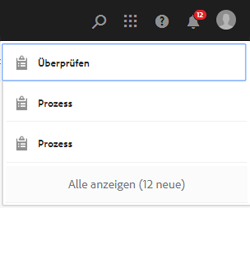
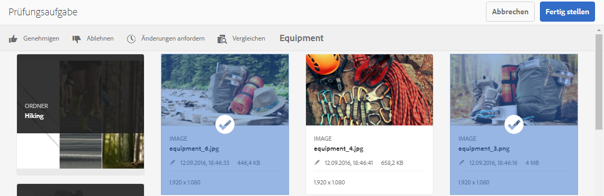
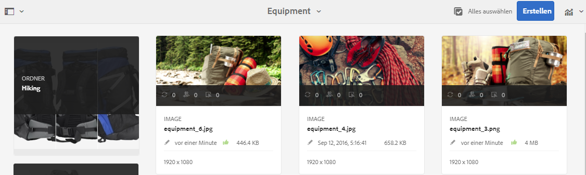
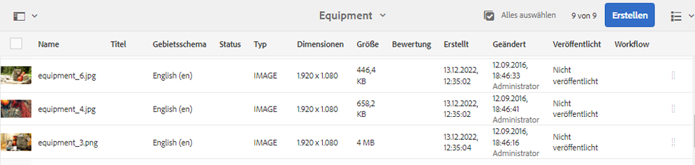
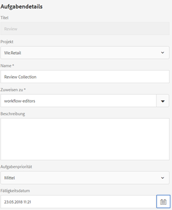
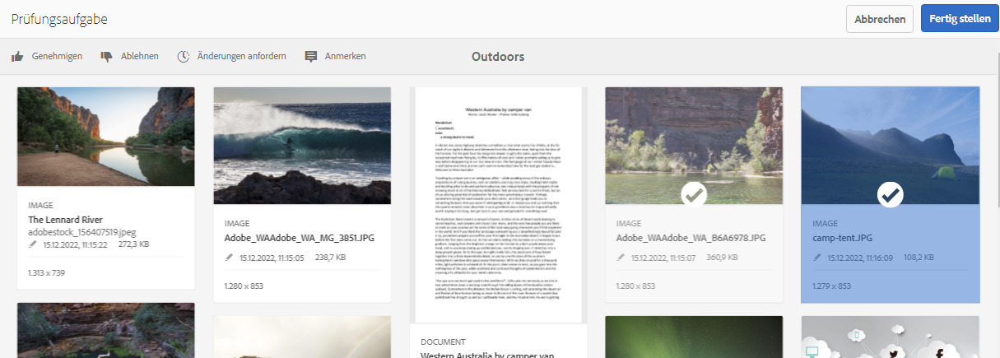
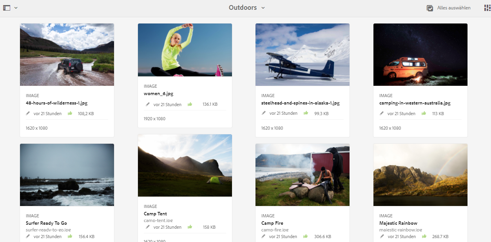
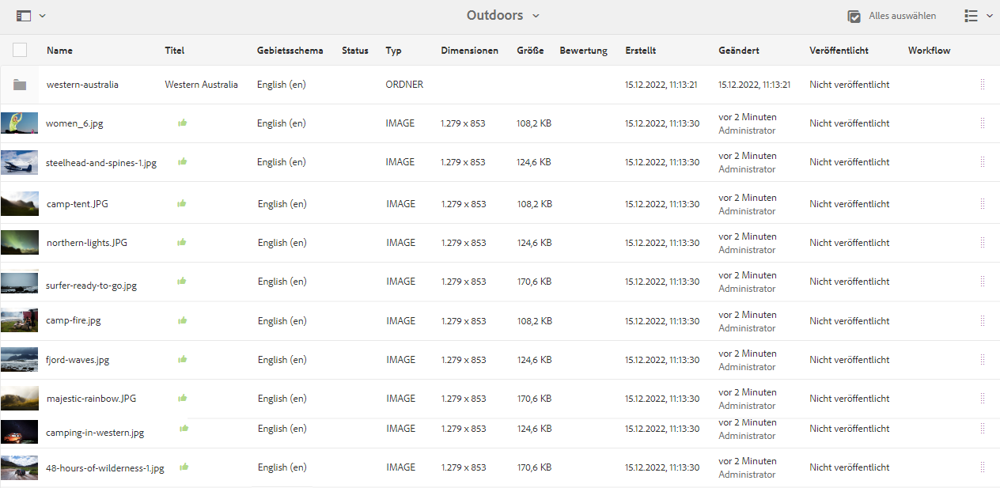

# Überprüfen von Ordner-Assets und Sammlungen {#review-folder-assets-and-collections}

Richten Sie Prüfungs-Workflows für Assets innerhalb eines Ordners oder einer Sammlung ein und geben Sie diese für Prüfer oder kreative Partner frei, um Feedback zu erhalten.

[!DNL Adobe Experience Manager Assets]Mit können Sie einen Ad-hoc-Prüfungs-Workflow für Assets innerhalb eines Ordners oder einer Sammlung einrichten und ihn für Prüfer oder kreative Partner freigeben, um Feedback zu erhalten.

Sie können den Prüfungs-Workflow entweder mit einem Projekt verbinden oder eine eigenständige Prüfungsaufgabe erstellen.

Wenn Sie die Assets freigeben, können Prüfer sie genehmigen oder ablehnen. Benachrichtigungen werden in verschiedenen Phasen des Workflows gesendet, um die beabsichtigten Empfänger über die Ausführung verschiedener Aufgaben zu informieren. Wenn Sie beispielsweise einen Ordner oder eine Sammlung freigeben, erhält der Prüfer eine Benachrichtigung, dass ein Ordner/eine Sammlung zur Prüfung freigegeben wurde.

Nachdem der Prüfer die Prüfung abgeschlossen hat (Assets genehmigt oder ablehnt), erhalten Sie eine Benachrichtigung über den Abschluss der Prüfung.

## Erstellen einer Review-Aufgabe für Ordner {#creating-a-review-task-for-folders}

1. Wählen Sie in der Benutzeroberfläche [!DNL Assets] den Ordner aus, für den Sie eine Review-Aufgabe erstellen möchten.
1. Klicken Sie in der Symbolleiste auf **[!UICONTROL Review-Aufgabe erstellen]** , um die Seite **[!UICONTROL Aufgabe überprüfen]** zu öffnen. Wenn die Option in der Symbolleiste nicht angezeigt wird, klicken Sie auf **[!UICONTROL Mehr]** und wählen Sie die Option aus.

1. (Optional) Wählen Sie in der Liste **[!UICONTROL Projekt]** das Projekt aus, mit dem Sie die Prüfungsaufgabe verbinden möchten. Standardmäßig ist die Option **[!UICONTROL Ohne]** ausgewählt. Wenn Sie kein Projekt mit der Prüfungsaufgabe verbinden möchten, behalten Sie diese Auswahl bei.

   >[!NOTE]
   >
   >Nur die Projekte, für die Sie Berechtigungen auf Editor-Ebene (oder höher) haben, sind in der Liste **[!UICONTROL Projekte]** sichtbar.

1. Geben Sie einen Namen für die Prüfungsaufgabe ein und wählen Sie einen Genehmigenden aus der Liste **[!UICONTROL Zuweisen zu]** aus.

   >[!NOTE]
   >
   >Die Mitglieder/Gruppen des ausgewählten Projekts sind als Genehmigende in der Liste **[!UICONTROL Zuweisen zu]** verfügbar.

1. Geben Sie eine Beschreibung, die Aufgabenpriorität und das Fälligkeitsdatum für die Prüfungsaufgabe ein.

   

1. Geben Sie auf der Registerkarte „Erweitert“ eine Beschriftung ein, die zum Erstellen der URI verwendet werden soll.

   

1. Klicken Sie auf **[!UICONTROL Senden]** und dann auf **[!UICONTROL Fertig]**, um die Bestätigungsmeldung zu schließen. Eine Benachrichtigung für die neue Aufgabe wird an den Genehmiger gesendet.
1. Melden Sie sich bei [!DNL Assets] als Genehmiger an und navigieren Sie zur [!DNL Assets]-Benutzeroberfläche. Um Assets zu genehmigen, klicken Sie auf **[!UICONTROL Benachrichtigungen]** und wählen Sie dann die Review-Aufgabe aus der Liste aus.

   

1. Überprüfen Sie auf der Seite **[!UICONTROL Aufgabe überprüfen]** die Details der Review-Aufgabe und klicken Sie dann auf **[!UICONTROL Überprüfen]**.
1. Wählen Sie auf der Seite **[!UICONTROL Aufgabe überprüfen]** Assets aus und klicken Sie auf **[!UICONTROL Genehmigen/Ablehnen]**, um sie zu genehmigen oder abzulehnen.

   

1. Klicken Sie in der Symbolleiste auf **[!UICONTROL Complete]**. Geben Sie im Dialogfeld einen Kommentar ein und klicken Sie zur Bestätigung auf **[!UICONTROL Complete]**.
1. Navigieren Sie zur Benutzeroberfläche [!DNL Assets] und öffnen Sie den Ordner. Die Symbole für den Genehmigungsstatus für die Assets werden in der Ansicht für die Ansicht und Liste der Karte angezeigt.

   **Kartenansicht**

   

   **Listenansicht**

   

## Erstellen einer Review-Aufgabe für Sammlungen {#creating-a-review-task-for-collections}

1. Wählen Sie auf der Seite „Sammlungen“ die Sammlung aus, für die Sie eine Prüfungsaufgabe erstellen möchten.
1. Klicken Sie in der Symbolleiste auf **[!UICONTROL Review-Aufgabe erstellen]** , um die Seite **[!UICONTROL Aufgabe überprüfen]** zu öffnen. Wenn die Option in der Symbolleiste nicht angezeigt werden kann, klicken Sie auf **[!UICONTROL Mehr]** und wählen Sie die Option aus.

1. (Optional) Wählen Sie in der Liste **[!UICONTROL Projekt]** das Projekt aus, mit dem Sie die Prüfungsaufgabe verbinden möchten. Standardmäßig ist die Option **[!UICONTROL Ohne]** ausgewählt. Wenn Sie kein Projekt mit der Prüfungsaufgabe verbinden möchten, behalten Sie diese Auswahl bei.

   >[!NOTE]
   >
   >Nur die Projekte, für die Sie Berechtigungen auf Editor-Ebene (oder höher) haben, sind in der Liste **[!UICONTROL Projekte]** sichtbar.

1. Geben Sie einen Namen für die Prüfungsaufgabe ein und wählen Sie einen Genehmigenden aus der Liste **[!UICONTROL Zuweisen zu]** aus.

   >[!NOTE]
   >
   >Die Mitglieder/Gruppen des ausgewählten Projekts sind als Genehmigende in der Liste **[!UICONTROL Zuweisen zu]** verfügbar.

1. Geben Sie eine Beschreibung, die Aufgabenpriorität und das Fälligkeitsdatum für die Prüfungsaufgabe ein.

   

1. Klicken Sie auf **[!UICONTROL Senden]** und dann auf **[!UICONTROL Fertig]**, um die Bestätigungsmeldung zu schließen. Eine Benachrichtigung für die neue Aufgabe wird an den Genehmiger gesendet.
1. Melden Sie sich bei [!DNL Assets] als Genehmiger an und navigieren Sie zur Konsole [!DNL Assets]. Um Assets zu genehmigen, klicken Sie auf **[!UICONTROL Benachrichtigungen]** und wählen Sie dann die Review-Aufgabe aus der Liste aus.
1. Überprüfen Sie auf der Seite **[!UICONTROL Aufgabe überprüfen]** die Details der Review-Aufgabe und klicken Sie dann auf **[!UICONTROL Überprüfen]**.
1. Alle Assets in der Sammlung sind auf der Prüfungsseite sichtbar. Wählen Sie die Assets aus und klicken Sie auf **[!UICONTROL Genehmigen/Ablehnen]**, um Assets zu genehmigen oder abzulehnen.

   

1. Klicken Sie in der Symbolleiste auf **[!UICONTROL Complete]**. Geben Sie im Dialogfeld einen Kommentar ein und klicken Sie zur Bestätigung auf **[!UICONTROL Complete]**.
1. Gehen Sie zur Konsole „Sammlungen“ und öffnen Sie die Sammlung. Die Symbole für den Genehmigungsstatus der Assets werden in der Karten- sowie in der Listenansicht angezeigt.

   

   *Abbildung: Ansicht der Karte.*

   

   *Abbildung: Ansicht der Liste.*
