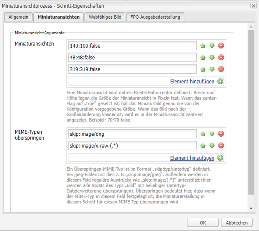
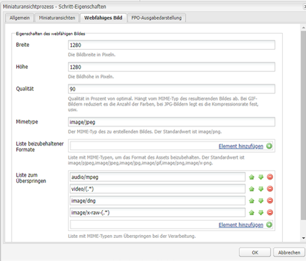
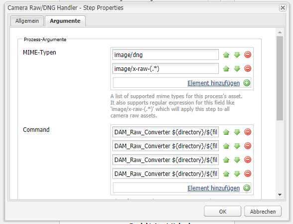
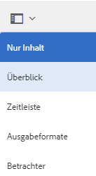
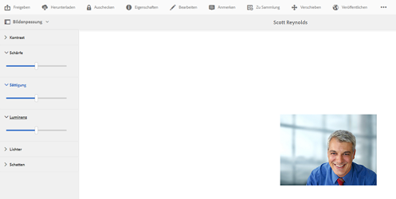

# Verarbeiten von Bildern mit Camera Raw {#camera-raw-support}

Sie können die [!DNL Adobe Camera Raw]-Unterstützung aktivieren, um Rohdateiformate wie CR2, NEF und RAF zu verarbeiten und die Bilder im JPEG-Format zu rendern. Die Funktionalität wird in [!DNL Adobe Experience Manager Assets] unter Verwendung des [Camera Raw Pakets](https://experience.adobe.com/#/downloads/content/software-distribution/en/aem.html?package=/content/software-distribution/en/details.html/content/dam/aem/public/adobe/packages/aem630/product/assets/aem-assets-cameraraw-pkg) unterstützt, das über Softwareverteilung verfügbar ist.

>[!NOTE]
>
>Die Funktion unterstützt nur JPEG-Darstellungen. Es wird unter Windows 64 Bit, Mac OS und RHEL 7.x unterstützt.

Gehen Sie wie folgt vor, um die [!DNL Camera Raw]-Unterstützung in [!DNL Experience Manager Assets] zu aktivieren:

1. Laden Sie das Camera Raw Paket [a1/> von Softwareverteilung herunter.](https://experience.adobe.com/#/downloads/content/software-distribution/en/aem.html?package=/content/software-distribution/en/details.html/content/dam/aem/public/adobe/packages/aem630/product/assets/aem-assets-cameraraw-pkg)
1. Greife Sie auf `https://[aem_server]:[port]/workflow` zu. Öffnen Sie den Workflow **[!UICONTROL DAM Update Asset]** .
1. Öffnen Sie den Schritt **[!UICONTROL Miniaturansichten verarbeiten]** .
1. Geben Sie die folgende Konfiguration auf der Registerkarte **[!UICONTROL Miniaturansichten]** an:

   * **[!UICONTROL Miniaturansichten]**:  `140:100:false, 48:48:false, 319:319:false`
   * **[!UICONTROL MIME-Typen überspringen]**: `skip:image/dng, skip:image/x-raw-(.*)`

   

1. Geben Sie auf der Registerkarte **[!UICONTROL Webfähiges Bild]** im Feld **[!UICONTROL Liste überspringen]** `audio/mpeg, video/(.*), image/dng, image/x-raw-(.*)` an.

   

1. Fügen Sie im Seitenbereich den Schritt **[!UICONTROL Camera Raw/DNG Handler]** unter dem Schritt **[!UICONTROL Erstellung von Miniaturbildern]** hinzu.
1. Fügen Sie im Schritt **[!UICONTROL Camera Raw/DNG Handler]** die folgende Konfiguration auf der Registerkarte **[!UICONTROL Argumente]** hinzu:

   * **[!UICONTROL MIME-Typen]**:  `image/dng` und  `image/x-raw-(.*)`
   * **[!UICONTROL Befehl]**:

      * `DAM_Raw_Converter ${directory}/${filename} ${directory} cq5dam.web.1280.1280.jpeg 1280 1280`
      * `DAM_Raw_Converter ${directory}/${filename} ${directory} cq5dam.thumbnail.319.319.jpeg 319 319`
      * `DAM_Raw_Converter ${directory}/${filename} ${directory} cq5dam.thumbnail.140.100.jpeg 140 100`
      * `DAM_Raw_Converter ${directory}/${filename} ${directory} cq5dam.thumbnail.48.48.jpeg 48 48`

   

1. Klicken Sie auf **[!UICONTROL Speichern]**.

>[!NOTE]
>
>Stellen Sie sicher, dass die oben aufgeführte Konfiguration mit der Konfiguration **** Beispiel-DAM-Update-Asset mit Schritt für Camera RAW- und DNG-Handling übereinstimmt.

Nun können Sie Camera Raw-Dateien in  Assets importieren. Nachdem Sie das Camera Raw Paket installiert und den erforderlichen Workflow konfiguriert haben, wird die Option **[!UICONTROL Bildanpassung]** in der Liste der Seitenfenster angezeigt.

*Abbildung: Optionen im Seitenbereich.*

*Abbildung: Verwenden Sie die Option , um Ihre Bilder geringfügig zu bearbeiten.*

Nach dem Speichern der Änderungen in einem [!DNL Camera Raw]-Bild wird eine neue Ausgabe `AdjustedPreview.jpg` für das Bild generiert. Bei anderen Bildtypen außer [!DNL Camera Raw] werden die Änderungen in allen Ausgabedarstellungen übernommen.

## Best Practices, bekannte Probleme und Einschränkungen {#best-practices}

Für die Funktionalität gelten folgende Einschränkungen:

* Die Funktion unterstützt nur JPEG-Darstellungen. Sie wird unter 64-Bit Windows, macOS und RHEL 7.x unterstützt.
* Metadaten-Writeback wird für RAW- und DNG-Formate nicht unterstützt.
* Die Bibliothek [!DNL Camera Raw] weist Einschränkungen hinsichtlich der Gesamtpixel auf, die gleichzeitig verarbeitet werden können. Derzeit kann es eine maximale Größe von 65000 Pixel auf der langen Seite einer Datei oder 512 MP verarbeiten, je nachdem, welches Kriterium zuerst erfüllt wird.
