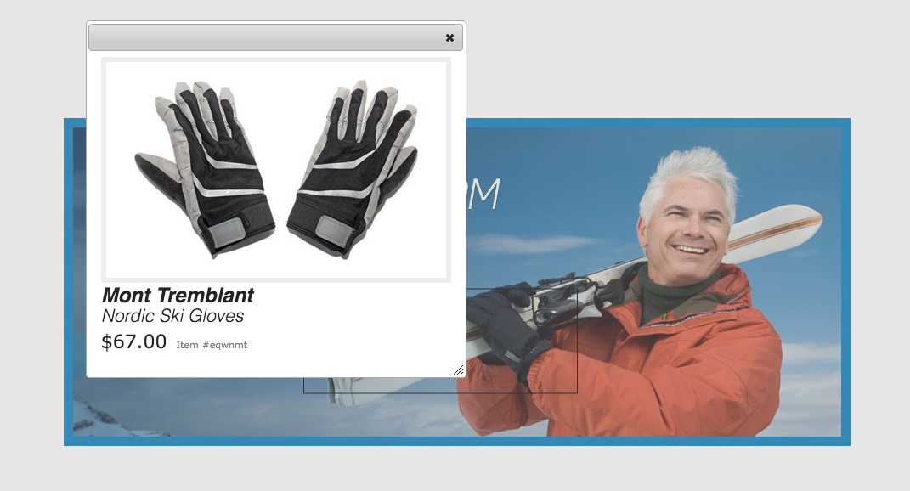

# Karussellbanner{#carousel-banners}

Mit Karussellbannern können Marketingexperten die Konversionsrate steigern, indem sie auf einfache Art Drehbanner mit Promo-Inhalten erstellen, die auf beliebigen Bildschirmen bereitgestellt werden können.

Das Erstellen und Ändern von Inhalten auf Werbebannern kann zeitaufwendig sein und Ihre Fähigkeit beeinträchtigen, neue Inhalte schnell zu veröffentlichen oder zielgerichteter zu gestalten. Mit Karussellbannern können Sie sich schnell drehende Banner erstellen oder ändern. Sie können Interaktivität hinzufügen, z. B. Hotspots, die mit Produktdetails oder zugehörigen Ressourcen verknüpft sind, und diese auf jedem Bildschirm bereitstellen, sodass Sie neue Werbeinhalte schneller auf den Markt bringen können.

Karussellbanner werden durch ein Banner mit dem Wort **[!UICONTROL CAROUSELSET]** gekennzeichnet

Auf Ihrer Website kann ein Karussellbanner wie folgt aussehen:

Hier können Sie durch die Bilder navigieren (durch Klicken auf die Zahlen). Zusätzlich drehen sich die Folien automatisch basierend auf einem Intervall, das Sie anpassen können. Bilder, die Sie in Karussellbannern hinzufügen, unterstützen sowohl Hotspots als auch Imagemaps, bei denen Benutzer einen Hyperlink auswählen oder aufrufen oder auf ein Schnellansichtsfenster zugreifen können.

In diesem Beispiel hat ein Benutzer auf eine Imagemap getippt oder geklickt und auf das Schnellansichtsfenster für Handschuhe zugegriffen:

## Video zur Erstellung von Karussellbannern {#watch-how-carousel-banners-are-created}

Führen Sie eine exemplarische Anleitung dazu durch, wie Karussellbanner erstellt werden](https://s7d5.scene7.com/s7viewers/html5/VideoViewer.html?videoserverurl=https://s7d5.scene7.com/is/content/&amp;emailurl=https://s7d5.scene7.com/s7/emailFriend&amp;serverUrl=https://s7d5.scene7.com/is/image/&amp;config=Scene7SharedAssets/Universal_HTML5_Video_social&amp;contenturl=https://s7d5.scene7.com/skins/&amp;asset=S7tutorials/InteractiveCarouselBanner) (10 Minuten und 33 Sekunden). [ Außerdem erfahren Sie, wie Sie Karussellbanner in der Vorschau anzeigen, bearbeiten und bereitstellen.

>[!NOTE]
>
>Benutzer, die keine Administratoren sind, müssen der Gruppe **[!UICONTROL dam-users]** hinzugefügt werden, damit sie Karussellbanner erstellen oder bearbeiten können. Sollten Sie Schwierigkeiten beim Erstellen oder Bearbeiten haben, wenden Sie sich an den Systemadministrator, der Sie der Gruppe **[!UICONTROL dam-users]** hinzufügen kann.

## Schnellstart: Karussellbanner {#quick-start-carousel-banners}

So schaffen Sie einen schnellen Einstieg in die Arbeit mit Karussellbannern:

1. [Ermitteln Sie Hotspot- und Imagemap-Variablen](#identifying-hotspot-and-image-map-variables) (nur für Kunden, die Experience Manager Assets und Dynamic Media verwenden).

   Ermitteln Sie zunächst die von der vorhandenen Schnellansichtsimplementierung verwendeten dynamischen Variablen, damit Sie Hotspots und Imagemap-Daten während der Erstellung von Karussellbannern in Adobe Experience Manager Assets korrekt eingeben können.

   >[!NOTE]
   >
   >Wenn Sie Experience Manager-Sites oder E-Commerce-Kunde sind, können Sie die integrierte Funktion verwenden, um zu Produktseiten zu navigieren und die vorhandenen SKUs (Stock Keeping Unit, Bestandskatalog) im Produktkatalog zu suchen. Sie müssen keine Hotspot- oder Imagemap-Variablen manuell eingeben. Weitere Informationen finden Sie unter [Einrichten von eCommerce](/help/commerce/cif-classic/administering/generic.md).
   >
   >
   >Wenn Sie Experience Manager Assets und Dynamic Media sind, geben Sie Daten für Hotspots und Imagemaps manuell ein und integrieren Sie dann die veröffentlichte URL oder den Einbettungscode in Ihr Drittanbieter-Content-Management-System.

1. Optional: [Erstellen Sie eine Viewer-Vorgabe für Karussellsets](/help/assets/managing-viewer-presets.md) bei Bedarf.

   Wenn Sie ein Administrator sind, können Sie das Verhalten und das Erscheinungsbild des Karussells anpassen, indem Sie eine eigene Karussell-Viewer-Vorgabe erstellen. Der größte Vorteil besteht darin, dass diese benutzerdefinierte Viewer-Vorgabe für mehrere Karussells wiederverwendet werden kann. Benutzer haben jedoch auch die Möglichkeit, das Verhalten und das Erscheinungsbild des Karussells direkt bei der Erstellung anzupassen. Diese Methode ist der bevorzugte Ansatz, wenn Sie ein bestimmtes Design für ein bestimmtes Karussell wünschen.

1. [Laden Sie ein Bildbanner hoch](#uploading-image-banners).

   Laden Sie Bildbanner hoch, die interaktiv sein sollen.

1. [Erstellen Sie Karussellsets](#creating-carousel-sets).

   In Karussellsets navigieren Benutzer durch Bannerbilder und wählen Hotspots oder Imagemaps aus, um auf relevante Inhalte zuzugreifen.

   Um ein Karussellset in Assets zu erstellen, wählen Sie **[!UICONTROL Erstellen]** und dann **[!UICONTROL Karussellsets]** aus. Fügen Sie den Folien Assets hinzu und wählen Sie **[!UICONTROL Speichern]** aus. Sie können das Erscheinungsbild und Verhalten des Karussells auch direkt im Editor bearbeiten.

1. [Fügen Sie einem Bildbanner](#adding-hotspots-or-image-maps-to-an-image-banner) Hotspots oder Imagemaps hinzu.

   Fügen Sie einem Bildbanner mindestens einen Hotspot oder eine Imagemap hinzu und weisen Sie allen von ihnen eine Aktion wie einen Link, eine Schnellansicht oder ein Experience Fragment zu. Nachdem Sie Hotspots oder Imagemaps hinzugefügt haben, schließen Sie diese Aufgabe ab, indem Sie das Karussellset veröffentlichen. Durch das Veröffentlichen wird der Einbettungs-Code erstellt, den Sie kopieren und auf die Landingpage Ihrer Website anwenden können.

   Siehe [(Optional) Anzeigen einer Vorschau für Karussellbanner](#optional-previewing-carousel-banners) - Optional. Bei Bedarf können Sie eine Darstellung des Karussellsets anzeigen und dessen Interaktivität testen.

1. [Veröffentlichen Sie Karussellbanner](#publishing-carousel-banners).

   Sie veröffentlichen ein Karussellset wie jedes andere Asset. Navigieren Sie in Assets zum Karussellset, wählen Sie es aus und klicken Sie auf **[!UICONTROL Veröffentlichen]**. Durch Veröffentlichen eines Karussellsets wird die URL und die Einbettungszeichenfolge aktiviert.

1. Führen Sie einen der folgenden Schritte aus:

   * [Fügen Sie ein Karussellbanner zu Ihrer Website-Seite hinzu.](#adding-a-carousel-banner-to-your-website-page) Sie können die Karussellbanner-URL oder den Einbettungs-Code hinzufügen, die oder den Sie auf die Website-Seite kopiert haben.

      * [Integrieren Sie das Karussellbanner in eine Schnellansicht.](#integrating-the-carousel-banner-with-an-existing-quickview) Wenn Sie ein Drittanbieter-Web-Content-Management-System verwenden, müssen Sie das neue Karussellbanner in die vorhandene Schnellansichtsimplementierung auf Ihrer Website integrieren.
   * [Fügen Sie ein Karussellbanner zu Ihrer Website in Experience ](/help/assets/adding-dynamic-media-assets-to-pages.md) Manager hinzu. Wenn Sie Experience Manager-Sites-Kunde sind, können Sie das Karussellset direkt zur Seite in Experience Manager hinzufügen, indem Sie die interaktive Medienkomponente verwenden.

Informationen zum Bearbeiten von Karussellsets finden Sie unter [Bearbeiten von Karussellsets](#editing-carousel-sets). Darüber hinaus können Sie [Eigenschaften von Karussellsets](manage-assets.md#editing-properties) anzeigen und bearbeiten.

## Ermitteln von Hotspot- und Imagemap-Variablen {#identifying-hotspot-and-image-map-variables}

Ermitteln Sie zunächst die von der vorhandenen Schnellansichtsimplementierung verwendeten dynamischen Variablen, damit Sie Hotspots oder Imagemap-Daten während der Erstellung von Karussellsets in Experience Manager Assets korrekt eingeben können.

Wenn Sie einem Bannerbild in Experience Manager Assets Hotspots oder Imagemaps hinzufügen, weisen Sie jedem Hotspot oder jeder Imagemap eine SKU und optional zusätzliche Variablen zu. Diese Variablen werden später verwendet, um Hotspots oder Imagemaps mit Schnellansichtsinhalten abzugleichen.

>[!NOTE]
>
>Wenn Sie Experience Manager-Sites und/oder Experience Manager-E-Commerce-Kunde sind, überspringen Sie diesen Schritt. Sie müssen keine Hotspot- oder Imagemap-Variablen manuell ermitteln. Sie können die Integration mit eCommerce für die Produktintegration verwenden. Weitere Informationen finden Sie unter [Einrichten von eCommerce](/help/commerce/cif-classic/administering/generic.md). Darüber hinaus können Sie die interaktive Komponente verwenden und in Ihre Webseite einfügen.
>
>Wenn Sie Experience Manager Assets oder Media sind, veröffentlichen Sie die URL oder den Einbettungscode und integrieren Sie ihn dann in Ihr Drittanbieter-Content-Management-System und identifizieren Sie Hotspots und Imagemaps manuell.

Es ist wichtig, die Anzahl und den Typ der Variablen, denen Hotspot- oder Imagemap-Daten zugewiesen werden sollen, korrekt zu ermitteln. Jeder Hotspot bzw. jede Imagemap, der/die einem Bannerbild hinzugefügt wird, muss genügend Informationen enthalten, um das Produkt im vorhandenen Backend-System eindeutig zu identifizieren. Gleichzeitig darf jeder Hotspot oder jede Imagemap nicht mehr Daten enthalten, als erforderlich sind. Dies würde die Dateneingabe unnötig erschweren und bei der Verwaltung von Hotspots und Imagemaps könnten leichter Fehler auftreten.

Es gibt verschiedene Möglichkeiten, den für Hotspot- oder Imagemap-Daten zu verwendenden Variablensatz zu ermitteln,

Manchmal ist es ausreichend, IT-Experten zu konsultieren, die für die vorhandene Schnellansichtsimplementierung verantwortlich sind. Wahrscheinlich wissen sie, welcher Mindestsatz an Daten erforderlich ist, um die Schnellansicht im System zu identifizieren. Normalerweise ist es jedoch auch möglich, einfach das vorhandene Verhalten des Frontend-Codes zu analysieren.

Die meisten Schnellansichtsimplementierungen verwenden das folgende Paradigma:

* Benutzer aktiviert ein Benutzeroberflächenelement auf der Website. Tippen Sie beispielsweise auf eine **[!UICONTROL Schnellansicht]**-Schaltfläche.
* Die Website sendet eine Ajax-Anfrage an das Backend, um bei Bedarf die Schnellansichtsdaten oder -inhalte zu laden.
* Die Schnellansichtsdaten werden in den Inhalt übersetzt, um für das Rendern auf der Web-Seite vorbereitet zu werden.
* Schließlich zeigt der Frontend-Code diesen Inhalt visuell auf dem Bildschirm an.

Dann werden verschiedene Bereiche der vorhandenen Website besucht, auf denen die Schnellansichtsfunktion implementiert ist. Trigger der Schnellansicht und Erfassen der Ajax-URL, die von der Webseite zum Laden der Schnellansichtsdaten oder -inhalte gesendet wird.

Normalerweise müssen Sie keine speziellen Debugging-Tools verwenden. Moderne Webbrowser verfügen über Web-Inspektoren, die dafür ausreichend sind. Die folgenden Webbrowser beispielsweise umfassen Web-Inspektoren:

* Um alle ausgehenden HTTP-Anfragen in Google Chrome anzuzeigen, drücken Sie F12 (Windows) oder Befehlstaste+Wahltaste+I (Mac), um den Bereich für Entwicklertools zu öffnen, und wählen Sie dann die Registerkarte &quot;Netzwerk&quot;aus.
* In Firefox können Sie das Firebug-Plug-in aktivieren, indem Sie F12 (Windows) bzw. Befehlstaste + Wahltaste + I (Mac) drücken und die Registerkarte „Netz“ öffnen, oder Sie öffnen die Registerkarte „Netzwerk“ im integrierten Inspektor-Tool.

Wenn die Netzwerküberwachung im Browser aktiviert ist, lösen Sie die Schnellansicht auf der Seite aus.

Suchen Sie nun die Schnellansichts-Ajax-URL im Netzwerkprotokoll und kopieren Sie die aufgezeichnete URL für die zukünftige Analyse. Normalerweise werden beim Trigger der Schnellansicht zahlreiche Anfragen an den Server gesendet. In der Regel ist die Schnellansichts-Ajax-URL die erste URL in der Liste. Sie weist einen Teil oder Pfad mit einer komplexen Abfragezeichenfolge auf und ihr MIME-Typ lautet entweder `text/html`, `text/xml` oder `text/javascript`.

Während dieses Vorgangs müssen Sie verschiedene Bereiche der Website mit verschiedenen Produktkategorien und -typen besuchen. Der Grund dafür ist, dass Schnellansichts-URLs Teile aufweisen, die für eine bestimmte Website-Kategorie häufig vorkommen, sich aber nur ändern, wenn Sie einen anderen Bereich der Website besuchen.

Im einfachsten Fall ist der einzige variable Teil der Schnellansichts-URL die Produkt-SKU. In diesem Fall ist der SKU-Wert der einzige Datenteil, den Sie benötigen, um dem Bannerbild Hotspots oder Imagemaps hinzuzufügen.

In komplexen Fällen verfügt die Schnellansichts-URL jedoch zusätzlich zur SKU über verschiedene Elemente, wie z. B. Kategorie-ID, Farbcode und Größencode. In diesen Fällen ist jedes Element eine separate Variable in der Hotspot- oder Imagemap-Datendefinition innerhalb der Karussellbanner-Funktion.

Sehen Sie sich die folgenden Beispiele für Schnellansichts-URLs und die resultierenden Hotspot- oder Imagemap-Variablen an:

<table>
 <tbody>
  <tr>
   <td>Einzelne SKU, befindet sich in der Abfragezeichenfolge.</td>
   <td>
Die aufgezeichneten Schnellansichts-URLs enthalten Folgendes:

    <ul>
     <li>
<code>https://server/json?productId=866558&amp;source=100</code>
 </li>
     <li>
<code>https://server/json?productId=1196184&amp;source=100</code>
 </li>
     <li>
<code>https://server/json?productId=1081492&amp;source=100</code>
 </li>
     <li>
<code>https://server/json?productId=1898294&amp;source=100</code>
 </li>
    </ul> 
Der einzige variable Teil der URL ist der Wert des Abfrageparameters <code>productId=</code> und es ist offensichtlich ein SKU-Wert. Daher müssen Sie nur die SKU-Felder der Hotspots oder Imagemaps ausfüllen, etwa mit folgenden Werten: <code>866558,</code> <code>1196184,</code> <code>1081492,</code> <code>1898294.</code>
 </td>
  </tr>
  <tr>
   <td>Einzelne SKU, befindet sich im URL-Pfad.</td>
   <td>
Die aufgezeichneten Schnellansichts-URLs enthalten Folgendes:

    <ul>
     <li>
<code>https://server/product/6422350843</code>
 </li>
     <li>
<code>https://server/product/1607745002</code>
 </li>
     <li>
<code>https://server/product/0086724882</code>
 </li>
    </ul> 
Der variable Teil befindet sich im letzten Abschnitt des Pfads und wird zum SKU-Wert der Hotspots/Imagemaps:<strong><code>6422350843</code>, <code>1607745002,</code> </strong><code>0086724882.</code>
 </td>
  </tr>
  <tr>
   <td>SKU und Kategorie-ID in der Abfragezeichenfolge.</td>
   <td>
Die aufgezeichneten Schnellansichts-URLs enthalten Folgendes:

    <ul>
     <li>
<code>https://server/quickView/product/?category=1100004&amp;prodId=305466</code>
 </li>
     <li>
<code>https://server/quickView/product/?category=1100004&amp;prodId=310181</code>
 </li>
     <li>
<code>https://server/quickView/product/?category=1740148&amp;prodId=308706</code>
 </li>
    </ul> 
In diesem Fall liegen zwei abweichende Teile in der URL vor. Die SKU wird im Parameter <code>prodId</code> gespeichert, während die Kategorie-ID im Parameter <code>category=</code> gespeichert wird.
 
Bei den Hotspot- oder Imagemap-Definitionen selbst handelt es sich um Paare. Also einen SKU-Wert und eine weitere Variable mit dem Namen <code>categoryId</code>. Die resultierenden Paare lauten wie folgt:

    <ul>
     <li>
Die SKU lautet <strong><code>305466</code></strong> und <code>categoryId</code> lautet <code>1100004</code>.
 </li>
     <li>
Die SKU lautet <strong><code>310181</code></strong> und <code>categoryId</code> lautet <strong><code>1100004</code></strong>.
 </li>
     <li>
Die SKU lautet <strong><code>308706</code></strong> und <code>categoryId</code> lautet <strong><code>1740148</code></strong>.
 </li>
    </ul> </td>
  </tr>
 </tbody>
</table>

## Hochladen von Bildbannern {#uploading-image-banners}

Wenn Sie die Bilder, die Sie verwenden möchten, bereits hochgeladen haben, fahren Sie mit dem nächsten Schritt [Karussellsets erstellen](#creating-carousel-sets) fort. Beachten Sie, dass die im Karussell verwendeten Bilder nach dem Aktivieren von Dynamic Media hochgeladen werden müssen.

Informationen zum Hochladen von Bildbannern finden Sie unter [Hochladen von Assets](/help/assets/manage-assets.md).

## Erstellen von Karussellsets {#creating-carousel-sets}

>[!NOTE]
>
>Benutzer, die keine Administratoren sind, müssen der Gruppe **[!UICONTROL dam-users]** hinzugefügt werden, damit sie Karussellbanner erstellen oder bearbeiten können. Sollten Sie Schwierigkeiten beim Erstellen oder Bearbeiten haben, wenden Sie sich an den Systemadministrator, der Sie der Gruppe **[!UICONTROL dam-users]** hinzufügen kann.

**So erstellen Sie Karussellsets:**

1. Navigieren Sie in Assets zu dem Ordner, in dem Sie das Karussellset erstellen möchten, und navigieren Sie zu **[!UICONTROL Erstellen]** > **[!UICONTROL Karussellset]**.
1. Wählen Sie auf der Seite des Karussellbanner-Editors die Option **[!UICONTROL Tippen, um die Asset-Auswahl]** zu öffnen, um das Bild für die erste Folie auszuwählen.

   Führen Sie auf der Seite des Karussellbanner-Editors einen der folgenden Schritte aus:

   * Wählen Sie links oben auf der Seite das Symbol **[!UICONTROL Folie hinzufügen]** aus.

   * Wählen Sie in der Mitte der Seite **[!UICONTROL Tippen, um die Asset-Auswahl]** zu öffnen.
   Wählen Sie diese Option aus, um Assets auszuwählen, die Sie in das Karussellset aufnehmen möchten. Die ausgewählten Assets sind mit einem Häkchen versehen. Wenn Sie fertig sind, wählen Sie in der Nähe der oberen rechten Ecke der Seite **[!UICONTROL Auswählen]**.

   Mit der Asset-Auswahl können Sie nach Assets suchen, indem Sie ein Keyword eingeben und auf **[!UICONTROL Zurück]** tippen/klicken. Sie können auch Filter anwenden, um Ihre Suchergebnisse genauer abzustimmen. Sie können nach Pfad, Sammlung, Dateityp und Tag filtern. Wählen Sie den Filter aus und wählen Sie dann in der Symbolleiste das Symbol **[!UICONTROL Filter]** aus. Ändern Sie die Ansicht, indem Sie das Symbol „Ansicht“ tippen und dann **[!UICONTROL Spaltenansicht]**, **[!UICONTROL Kartenansicht]** oder **[!UICONTROL Listenansicht]** wählen.

   Weitere Informationen finden Sie unter [Arbeiten mit Selektoren](/help/assets/working-with-selectors.md) .

1. Fügen Sie weitere Folien hinzu, bis Sie alle gewünschten Bilder für das Karussellset ausgewählt haben.
1. (Optional) Führen Sie einen der folgenden Schritte aus:

   * Ziehen Sie bei Bedarf Folien, um die Anordnung der Bilder im Bildset zu ändern.
   * Um ein Bild zu löschen, wählen Sie das Bild aus und klicken Sie dann in der Symbolleiste auf **[!UICONTROL Folie löschen]** .

   * Um eine Vorgabe anzuwenden, wählen Sie rechts oben auf der Seite die Dropdown-Liste Vorgabe aus und wählen Sie dann eine Vorgabe aus, die auf das Set gleichzeitig angewendet werden soll.
   Um eine Folie zu löschen, wählen Sie die Folie aus und klicken Sie dann in der Symbolleiste auf **[!UICONTROL Folie löschen]**. Um eine Folie zu verschieben, wählen Sie das Symbol für die Neuanordnung aus, halten Sie die Taste gedrückt und verschieben Sie sie an die gewünschte Position.

1. Nachdem Sie die Bilder in den Folien hinzugefügt haben, können Sie einen Hotspot, eine Imagemap oder beides in die Bilder einfügen. Siehe [Hinzufügen von Hotspots oder Imagemaps zu einem Bildbanner](#adding-hotspots-or-image-maps-to-an-image-banner).
1. Sie können das visuelle Design und das Verhalten von Karussellsets ändern. Wählen Sie die Registerkarten **[!UICONTROL Verhalten]** und **[!UICONTROL Erscheinungsbild]** aus und passen Sie an, wie das Karussellbanner angezeigt wird oder wie sich bestimmte Komponenten verhalten. Weitere Informationen zur Verwendung des Viewer-Editors finden Sie unter [Verwalten von Viewer-Vorgaben](/help/assets/viewer-presets.md) .

   >[!NOTE]
   >
   >Für Karussellbanner können Sie die folgenden Elemente anpassen:
   >
   >    * Dauer der Anzeige eines Bildes Standardmäßig wird jedes Bild für 9 Sekunden angezeigt.
   >    * Animation. Standardmäßig sind alle Folienübergänge Überblendungen. Sie können einen anderen Übergang auswählen.
   >    * Stil der Schaltflächen Benutzer können die Banner durchlaufen, indem sie auf die jeweiligen Punkte oder Zahlen tippen. Sie können ändern, wo die Set-Indikatoren angezeigt werden (und ob es sich um einen numerischen oder Punktstil handelt). Sie können auch ihre Größe bestimmen.
   >    * Ändern des Markierungsstils einer Imagemap oder des Symbols für Hotspots.
   >    * Bevor Sie eine Viewer-Vorgabe bearbeiten, wählen Sie den Stil aus, auf dem die Vorgabe basieren soll. Wenn Sie keinen Stil auswählen, verlieren Sie beim Bearbeiten der Viewer-Vorgabe alle Änderungen, wenn Sie sich für eine andere Vorgabe entscheiden.

   >
   >Detaillierte Anweisungen und weitere Informationen zum Viewer-Editor finden Sie unter [Besondere Hinweise für Karussellbanner](/help/assets/managing-viewer-presets.md#special-considerations-for-creating-a-carousel-banner-viewer-preset) .

   Sie können auch eine Vorschau des Karussellbanners anzeigen. Siehe [(Optional) Anzeigen einer Vorschau für Karussellbanner](#optional-previewing-carousel-banners).

1. Wählen Sie **[!UICONTROL Speichern]**, wenn Sie fertig sind.

## Hinzufügen von Hotspots oder Imagemaps zu einem Bildbanner {#adding-hotspots-or-image-maps-to-an-image-banner}

Sie können einem Banner mithilfe des Karussellset-Editors Hotspots oder Imagemaps hinzufügen.

Beim Hinzufügen von Hotspots oder Imagemaps können Sie sie als eine Schnellansichts-Popup-Anzeige, als einen Hyperlink oder als Experience Fragment definieren.

Siehe [Experience Fragment](/help/sites-authoring/experience-fragments.md).

>[!NOTE]
>
>Die Tools zur Freigabe in Social Media im Karussellbanner werden nicht unterstützt, wenn Sie den Viewer in ein Experience Fragment einbetten.
>
>Um dies zu vermeiden, können Sie Viewer-Vorgaben verwenden oder erstellen, die keine Tools zur Freigabe in Social Media aufweisen. Mit diesen Viewer-Vorgaben können Sie sie erfolgreich in Experience Fragments einbetten.

Vergessen Sie nicht, Ihre Arbeit zu speichern, wenn Sie einem Bild Hotspots oder Imagemaps hinzufügen. Die Optionen „Rückgängig“ und „Wiederholen“ in der Nähe der oberen rechten Ecke der Seite werden während der aktuellen Erstellungs-/Bearbeitungssitzung unterstützt.

Wenn Sie die Erstellung des Karussellbanners abgeschlossen haben, können Sie optional eine Vorschau anzeigen, um das Karussellbanner aus der Perspektive der Kunden zu sehen.

Siehe [(Optional) Anzeigen einer Vorschau für Karussellbanner](#optional-previewing-carousel-banners).

>[!NOTE]
>
>Wenn Sie einem Bild in einem [interaktiven Bild](/help/assets/interactive-images.md) oder einem Karussellbanner Hotspots hinzufügen, werden die Hotspot-Informationen am selben Metadatenspeicherort gespeichert. Diese Position ist relativ zur Position des Bildes, unabhängig davon, ob es sich um ein interaktives Bild oder ein Karussellbanner handelt. Das bedeutet, dass Sie dasselbe Bild zusammen mit den definierten Hotspot-Daten in beiden Viewern einfach wiederverwenden können.
Beachten Sie jedoch, dass Karussellbanner Imagemaps auf Bildern unterstützen, die auch Hotspots enthalten können. ein interaktives Bild nicht. Beachten Sie diese Regel, wenn Sie ein interaktives Bild oder Karussellbanner erstellen möchten, das dasselbe Bild verwendet. Erwägen Sie stattdessen das Erstellen von interaktiven Bildern und Karussellbannern mit separaten Kopien desselben Bildes.

>[!NOTE]
Wenn Sie interaktive Bilder mit Hotspots bearbeiten, um das Bild zu beschneiden, werden die Hotspots entfernt.

Siehe auch [Hinzufügen von Imagemaps](/help/assets/image-maps.md).

**So fügen Sie einem Bildbanner Hotspots oder Imagemaps hinzu:**

1. Navigieren Sie in Assets zu dem Karussellset, das interaktiv werden soll.
1. Wählen Sie das Karussellset und danach **[!UICONTROL Bearbeiten]** aus. Der Karussell-Viewer-Editor wird geöffnet.
1. Wählen Sie die Folie aus, die interaktiv sein soll.
1. Wählen Sie links oben auf der Seite **[!UICONTROL Hotspot]** oder **[!UICONTROL Imagemap]** aus.
1. Führen Sie einen der folgenden Schritte aus:

   * Für Hotspots: Wählen Sie im Bild einen Ort aus, an dem der Hotspot angezeigt werden soll.
   * Für Imagemaps: Wählen Sie das Bild aus und ziehen Sie es dann von oben links nach unten rechts, um den Imagemap-Bereich zu erstellen. Sie können die Größe der Imagemap anpassen, indem Sie an den Ecken ziehen.

   Ziehen Sie den Hotspot oder die Imagemap ggf. an eine neue Position. Fügen Sie weitere Hotspots oder Imagemaps nach Bedarf hinzu.

   Um einen Hotspot oder eine Imagemap zu löschen, wählen Sie die Registerkarte **[!UICONTROL Aktionen]** aus. Wählen Sie unter der Überschrift **[!UICONTROL Maps und Hotspots]** aus dem Dropdown-Menü **[!UICONTROL Ausgewählter Typ]** den Namen des Hotspots oder der Landkarte aus, den/die Sie entfernen möchten. Wählen Sie neben dem Menü das Symbol **[!UICONTROL Papierkorb]** und dann **[!UICONTROL Löschen]** aus.

1. Geben Sie im Textfeld „Name“ den Namen des Hotspots oder der Imagemap ein. Dieser Name wird auch in der Dropdown-Liste **[!UICONTROL Karten und Hotspots]** angezeigt. Wenn Sie einen Namen angeben, können Sie den Hotspot oder die Imagemap einfach erkennen, sollten Sie später Änderungen vornehmen.
1. Führen Sie einen der folgenden Schritte auf der Registerkarte **[!UICONTROL Aktion]** aus:

   * Wählen Sie **[!UICONTROL Schnellansicht]** aus.

      * Wenn Sie Experience Manager Sites und E-Commerce-Kunde sind, wählen Sie das Produktauswahlsymbol (Lupe) aus, um die Seite &quot; auswählen&quot;zu öffnen. Wählen Sie das Produkt aus, das Sie verwenden möchten, und klicken Sie dann oben rechts auf der Seite auf das Häkchen, damit Sie zum Karussellbanner-Editor zurückkehren können.
      * Wenn Sie kein Experience Manager Sites- oder E-Commerce-Kunde sind, gehen Sie wie folgt vor:

         * Informationen zum Definieren dieser Variablen finden Sie unter [Ermitteln von Hotspot-Variablen](#identifying-hotspot-and-image-map-variables) .
         * Geben Sie anschließend manuell den SKU-Wert ein. Geben Sie im Textfeld „SKU-Wert“ die Bestandseinheit (Stock Keeping Unit, SKU) des Produkts ein. Hierbei handelt es sich um eine eindeutige Kennung für die jeweiligen von Ihnen angebotenen Produkte oder Services. Der variable Teil der Schnellansichtsvorlage wird automatisch mit dem eingegebenen SKU-Wert ausgefüllt, sodass das System den Hotspot, auf den getippt wird, mit der Schnellansicht einer bestimmten SKU verbinden kann.
         * (Optional) Wenn es in der Schnellansicht andere Variablen gibt, die Sie zur weiteren Identifizierung eines Produkts verwenden müssen, wählen Sie **[!UICONTROL Generische Variable hinzufügen]**. Geben Sie im Textfeld eine zusätzliche Variable an. Beispielsweise ist category=Men eine hinzugefügte Variable.

         * Weitere Informationen finden Sie unter [Arbeiten mit Selektoren](/help/assets/working-with-selectors.md) .
   * Wählen Sie **[!UICONTROL Hyperlink]** aus.

      * Wenn Sie Experience Manager-Sites-Kunde sind, wählen Sie das Symbol &quot;Site-Selektor&quot;(Ordner) aus, um zu einer URL zu navigieren.
         >[!NOTE]
         Die URL-basierte Verknüpfungsmethode ist nicht möglich, wenn Ihr interaktiver Inhalt über Links mit relativen URLs verfügt, insbesondere über Links zu Seiten in Adobe Experience Manager Sites.

      * Wenn Sie Einzelkunde sind, geben Sie im Textfeld „HREF“ den vollständigen URL-Pfad zu einer verknüpften Web-Seite an.

   Vergessen Sie nicht anzugeben, ob der Link auf einer neuen Browser-Registerkarte (empfohlener Standard) oder auf derselben Registerkarte geöffnet werden soll.

   Weitere Informationen finden Sie unter [Arbeiten mit Selektoren](/help/assets/working-with-selectors.md).

   * Wählen Sie **[!UICONTROL Experience Fragment]** aus.

      * Wenn Sie Experience Manager Sites-Kunde sind, wählen Sie das Suchsymbol (Lupe) aus, um die Seite &quot;Experience Fragment&quot;zu öffnen. Wählen Sie das Experience Fragment aus, das Sie verwenden möchten, und klicken Sie dann oben rechts auf der Seite auf **[!UICONTROL Wählen Sie]** , um zur Hotspot-Verwaltungsseite zurückzukehren.
Weitere Informationen finden Sie unter [Experience Fragments](/help/sites-authoring/experience-fragments.md).

      * Legen Sie die Breite und Höhe des Experience Fragment fest, so wie es im Banner angezeigt werden soll.

         >[!NOTE]
         Die Tools zur Freigabe in Social Media im Karussellbanner werden nicht unterstützt, wenn Sie den Viewer in ein Experience Fragment einbetten.
         Um dieses Problem zu umgehen, erstellen Sie Viewer-Vorgaben, die keine Tools zur Freigabe in Social Media haben. Mit diesen Viewer-Vorgaben können Sie sie erfolgreich in Experience Fragments einbetten.
   

   Sie können auch eine Vorschau des Karussellbanners anzeigen. Siehe [(Optional) Anzeigen einer Vorschau für Karussellbanner](#optional-previewing-carousel-banners).

1. Wählen Sie **[!UICONTROL Speichern]** aus.
1. Veröffentlichen Sie das Karussellset. Durch das Veröffentlichen wird der Einbettungs-Code oder die URL erstellt, den/die Sie auf der Web-Seite verwenden können. Wenn Sie Experience Manager-Sites-Kunde sind, können Sie das Karussellset direkt zu Ihrer Webseite hinzufügen.

   Siehe [Veröffentlichen von Assets](/help/assets/publishing-dynamicmedia-assets.md).

   Siehe [Hinzufügen eines Karussellsets zur Landingpage Ihrer Website](#adding-a-carousel-banner-to-your-website-page).

## Bearbeiten von Karussellsets {#editing-carousel-sets}

>[!NOTE]
Benutzer, die keine Administratoren sind, müssen der Gruppe **[!UICONTROL dam-users]** hinzugefügt werden, damit sie Karussellbanner erstellen oder bearbeiten können. Sollten Sie Schwierigkeiten beim Erstellen oder Bearbeiten haben, wenden Sie sich an den Systemadministrator, der Sie der Gruppe **[!UICONTROL dam-users]** hinzufügen kann.

Sie können mehrere Bearbeitungsaufgaben für Karussellsets ausführen, z. B. die folgenden:

* einem Karussellset Folien hinzufügen. Siehe auch [Arbeiten mit Selektoren](/help/assets/working-with-selectors.md).
* die Anordnung der Folien im Karussellset ändern.
* Assets im Karussellset löschen
* Viewer-Vorgaben anwenden.
* das Karussellset löschen.
* Hotspots und Imagemaps hinzufügen oder bearbeiten. Siehe auch [Arbeiten mit Selektoren](/help/assets/working-with-selectors.md).

**So bearbeiten Sie Karussellsets:**

1. Führen Sie einen der folgenden Schritte aus:

   * Bewegen Sie den Mauszeiger über ein Karussellset-Asset und wählen Sie **[!UICONTROL Bearbeiten]** (Stiftsymbol).
   * Bewegen Sie den Mauszeiger über ein Karussellset-Asset, wählen Sie **[!UICONTROL Wählen Sie]** (Häkchensymbol) und klicken Sie dann in der Symbolleiste auf **[!UICONTROL Bearbeiten]**.

   * Wählen Sie ein Karussellset-Asset aus und klicken Sie dann oben links auf der Seite auf **[!UICONTROL Bearbeiten]** (Stiftsymbol).

1. Um das Karussellset zu bearbeiten, führen Sie einen der folgenden Schritte aus:

   * Um eine Folie hinzuzufügen, wählen Sie das Symbol **[!UICONTROL Folie hinzufügen]** aus, navigieren Sie dann zu dem Asset, das Sie der Folie hinzufügen möchten, und wählen Sie das Häkchen aus.
   * Um die Folien neu anzuordnen, ziehen Sie eine Folie an eine neue Position (wählen Sie das Symbol für die Neuanordnung aus, um Elemente zu verschieben).
   * Um einen Hotspot oder eine Imagemap hinzuzufügen, wählen Sie die Hotspot- oder Imagemap-Symbole aus und lesen Sie [Hinzufügen von Hotspots und Imagemaps](#adding-hotspots-or-image-maps-to-an-image-banner).
   * Um das Erscheinungsbild oder Verhalten des Karussellsets zu bearbeiten, wählen Sie die Registerkarte **[!UICONTROL Erscheinungsbild]** oder **[!UICONTROL Verhalten]** aus und legen Sie dann die gewünschten Optionen fest.
   * Um Hotspots oder Imagemaps zu bearbeiten, wählen Sie auf der entsprechenden Folie einen Hotspot oder eine Imagemap aus und ändern Sie sie nach Bedarf auf der Registerkarte **[!UICONTROL Aktionen]** .
   * Um eine Folie zu löschen, wählen Sie sie aus und klicken Sie dann in der Symbolleiste auf **[!UICONTROL Folie löschen]** .
   * Um eine Vorgabe anzuwenden, wählen Sie in der Nähe der oberen rechten Ecke der Seite die Dropdownliste **[!UICONTROL Vorgabe]** und dann eine Viewer-Vorgabe aus.
   * Um ein ganzes Karussellset zu löschen, navigieren Sie zum Karussellset, wählen Sie es aus und klicken Sie dann auf **[!UICONTROL Löschen]**.

   >[!NOTE]
   Wenn Sie interaktive Bilder mit Hotspots bearbeiten, um das Bild zu beschneiden, werden die Hotspots entfernt.

## (Optional) Anzeigen einer Vorschau für Karussellbanner {#optional-previewing-carousel-banners}

Sie können die Vorschau verwenden, um zu sehen, wie das Karussellbanner Kunden angezeigt wird, und um die Hotspots und Imagemaps des Karussellbanners zu testen, um sicherzustellen, dass sie sich wie erwartet verhalten.

Wenn das Karussellbanner Ihren Vorstellungen entspricht, können Sie es veröffentlichen.
Siehe [Einbetten des Video- oder Bild-Viewers auf einer Web-Seite](/help/assets/embed-code.md).
Siehe [Verknüpfen von URLs mit einer Web-Anwendung](/help/assets/linking-urls-to-yourwebapplication.md). Die URL-basierte Verknüpfungsmethode ist nicht möglich, wenn Ihr interaktiver Inhalt über Links mit relativen URLs verfügt, insbesondere über Links zu Seiten in Adobe Experience Manager Sites.
Siehe [Hinzufügen von Dynamic Media-Assets zu Seiten](/help/assets/adding-dynamic-media-assets-to-pages.md).

Um eine Vorschau für ein Karussellbanner anzuzeigen, verwenden Sie entweder den Karusselleditor (bevorzugte Methode) oder die **[!UICONTROL Viewer]**-Liste.

**So erstellen Sie eine Vorschau von Karussellbannern:**

1. Navigieren Sie in **[!UICONTROL Assets]** zu einem vorhandenen Karussellbanner, das Sie erstellt haben, und wählen Sie es aus, um es zu öffnen.
1. Wählen Sie **[!UICONTROL Bearbeiten]** aus.
1. Wählen Sie in der Viewer-Vorgabenliste in der rechten Ecke der Symbolleiste einen Viewer aus, um eine Vorschau des Karussellbanners anzuzeigen.

   

1. Wählen Sie **[!UICONTROL Vorschau]**.
1. Wählen Sie die Hotspots oder Imagemaps auf dem Bild aus, damit Sie die zugehörigen Aktionen testen können.

**So zeigen Sie eine Vorschau für Karussellbanner über die Viewer-Liste an:**

1. Navigieren Sie in **[!UICONTROL Assets]** zu einem vorhandenen Karussellbanner, das Sie erstellt haben, und wählen Sie es aus, um es zu öffnen.
1. Wählen Sie links oben auf der Seite &quot;Vorschau&quot;das Symbol Inhalt aus.
1. Wählen Sie in der Liste **[!UICONTROL Viewer]** im Bedienfeld auf der linken Seite der Seite den Namen der Viewer-Vorgabe für Karussellbanner aus, die Sie verwenden möchten.
1. Wählen Sie die Hotspots oder Imagemaps auf dem Bild aus, damit Sie die zugehörigen Aktionen testen können.

## Veröffentlichen von Karussellbannern {#publishing-carousel-banners}

Veröffentlichen Sie das Karussell, damit Sie es verwenden können. Durch Veröffentlichen eines Karussellsets werden die URL und der Einbettungs-Code aktiviert. Außerdem wird das Karussell in der Dynamic Media-Cloud veröffentlicht, die für skalierbare und leistungsfähige Bereitstellung in ein CDN integriert ist.

>[!NOTE]
Wenn Sie ein vorhandenes interaktives Bild mit Hotspots für Ihr Karussellbanner verwenden, müssen Sie das interaktive Bild separat veröffentlichen, nachdem Sie das Karussellbanner veröffentlicht haben.
Wenn Sie ein bereits vorhandenes und veröffentlichtes interaktives Bild ändern, das Sie in einem Karussellbanner verwenden, müssen Sie das interaktive Bild veröffentlichen, bevor die Änderungen im Karussellbanner sichtbar werden.

Informationen zum Veröffentlichen von Karussellbannern finden Sie unter [Dynamic Media Assets veröffentlichen](/help/assets/publishing-dynamicmedia-assets.md) .

## Fügen Sie ein Karussellbanner zu Ihrer Website-Seite hinzu. {#adding-a-carousel-banner-to-your-website-page}

Nachdem Sie Bannerbilder hochgeladen haben, um ein Karussell zu erstellen, dem Banner Hotspots und/oder Imagemaps hinzugefügt und das Karussellset veröffentlicht haben, können Sie es jetzt einer vorhandenen Website hinzufügen.

>[!NOTE]
Wenn Sie Experience Manager-Sites-Kunde sind, können Sie das Karussellbanner direkt zu Ihrer Seite hinzufügen, indem Sie die interaktive Medienkomponente auf Ihre Seite ziehen. Siehe [Hinzufügen von Dynamic Media-Assets zu Seiten](/help/assets/adding-dynamic-media-assets-to-pages.md).

Wenn Sie jedoch nur Experience Manager-Assets verwenden, können Sie das Karussellbanner manuell zu Ihrer Website-Landingpage hinzufügen, wie in diesem Abschnitt beschrieben.

1. Kopieren Sie den Einbettungs-Code des veröffentlichten Karussellsets.
Siehe [Einbetten des Video- oder Bild-Viewers auf einer Web-Seite](/help/assets/embed-code.md).

1. Fügen Sie den Einbettungscode, den Sie aus Experience Manager Assets kopiert haben, zu Ihrer Webseite hinzu.
Der kopierte Einbettungscode ist responsiv und muss daher automatisch in den Einbettungsbereich der Seite passen.

## Integrieren Sie das Karussellbanner in eine Schnellansicht {#integrating-the-carousel-banner-with-an-existing-quickview}

>[!NOTE]
Dieser Schritt gilt nur, wenn Sie ein Einzelkunde von Experience Manager Assets sind.

Der letzte Schritt in diesem Prozess ist die Integration des Karussellbanners in eine vorhandene Schnellansichtsimplementierung auf Ihrer Website. Jede Schnellansichtsimplementierung ist einzigartig und es ist ein spezifischer Ansatz erforderlich, der die Unterstützung einer Frontend-IT-Person erfordert.

Die vorhandene Schnellansichtsimplementierung stellt normalerweise eine Kette von untereinander verknüpften Aktionen dar, die auf der Web-Seite in der folgenden Reihenfolge stattfinden:

1. Ein Benutzer löst ein Element auf der Benutzeroberfläche Ihrer Website aus.
1. Der Frontend-Code ruft anhand des in Schritt 1 ausgelösten Benutzeroberflächenelements eine Schnellansichts-URL auf.
1. Der Frontend-Code sendet mithilfe der in Schritt 2 abgerufenen URL eine Ajax-Anfrage.
1. Die Backend-Logik gibt dem Frontend-Code die entsprechenden Schnellansichtsdaten oder -inhalte zurück.
1. Der Frontend-Code lädt die Schnellansichtsdaten oder -inhalte.
1. Optional wandelt der Frontend-Code die geladenen Schnellansichtsdaten in eine HTML-Darstellung um.
1. Der Frontend-Code zeigt ein modales Dialogfeld an und rendert den HTML-Inhalt auf dem Bildschirm für den Endbenutzer.

Diese Aufrufe stellen keine unabhängigen öffentlichen API-Aufrufe dar, die durch die Web-Seitenlogik in einem beliebigen Schritt aufgerufen werden können. Vielmehr handelt es sich um einen verketteten Aufruf, in dem der jeweils nächste Schritte in der letzten Phase (Callback) des vorherigen Schritts ausgeblendet ist.

Während das Karussellbanner Schritt 1 und teilweise Schritt 2 ersetzt, wenn ein Benutzer auf einen Hotspot oder eine Imagemap innerhalb des Karussellbanners tippt, wird diese Interaktion vom Viewer verarbeitet. Der Viewer gibt ein Ereignis an die Web-Seite zurück, das die gesamten Hotspot- oder Imagemap-Daten enthält, die zuvor hinzugefügt wurden.

In einem solchen Ereignis-Handler nimmt der Frontend-Code Folgendes vor:

* Er lauscht am Ereignis, das durch das Karussellbanner ausgegeben wird.
* Erstellt eine Schnellansichts-URL basierend auf den Hotspot- oder Imagemap-Daten.
* Er löst den Schnellansichts-Ladevorgang vom Backend aus und rendert die Schnellansicht auf dem Bildschirm, um sie anzuzeigen.

Der von Experience Manager Assets zurückgegebene Einbettungscode verfügt bereits über einen einsatzbereiten Ereignishandler, der auskommentiert wird.

Daher ist es nur erforderlich, die Auskommentierung des Codes aufzuheben und den Platzhalter-Handler-Text durch den Code zu ersetzen, der für die bestimmte Web-Seite spezifisch ist.

Der Prozess der Erstellung der Schnellansichts-URL ist das Gegenteil des Prozesses, der zur Identifizierung der zuvor erläuterten Hotspot- und Imagemap-Variablen verwendet wird.

Siehe [Ermitteln von Hotspot- und Imagemap-Variablen](#identifying-hotspot-and-image-map-variables).

Der letzte Schritt besteht darin, die Schnellansichts-URL auszulösen, und für das Aktivieren des Schnellansichtsbereichs ist höchstwahrscheinlich die Unterstützung eines Frontend-IT-Mitarbeiters aus Ihrer IT-Abteilung erforderlich. Er verfügt am ehesten über das entsprechende Fachwissen, um die Schnellansichtsimplementierung aus dem entsprechenden Schritt entsprechend auszulösen, um über eine einsatzbereite Schnellansichts-URL zu verfügen.

## Erstellen benutzerdefinierter Popups mithilfe der Schnellansicht {#using-quickviews-to-create-custom-pop-ups}

Siehe [Erstellen benutzerdefinierter Popups mit der Schnellansicht](/help/assets/custom-pop-ups.md).
