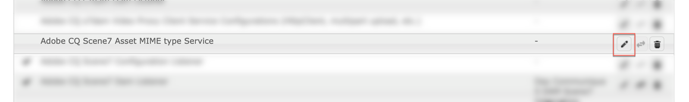
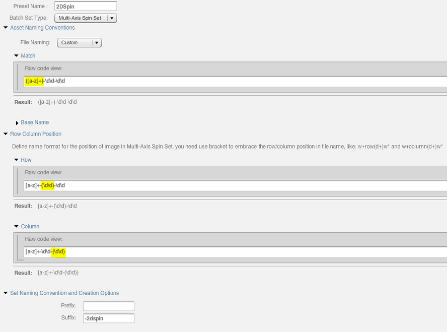
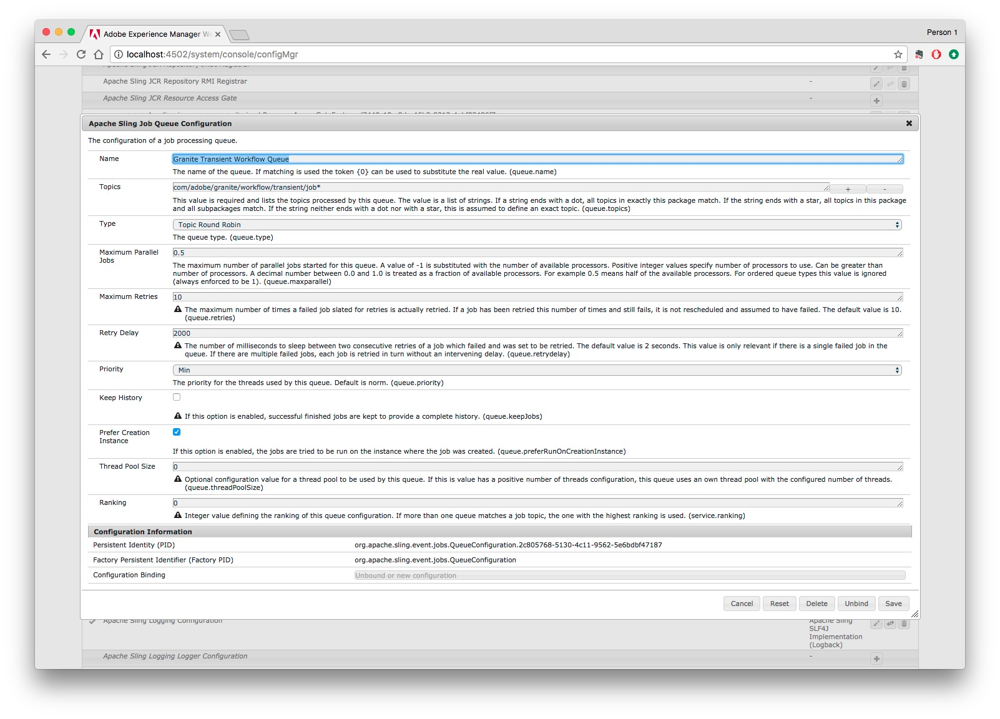

# Konfigurieren von Dynamic Media – Scene7-Modus{#configuring-dynamic-media-scene-mode}

Wenn Sie Adobe Experience Manager für verschiedene Umgebung verwenden, z. B. eine für die Entwicklung, eine für die Staging-Version und eine für die Live-Produktion, müssen Sie die dynamischen Media Cloud-Dienste für jede dieser Umgebung konfigurieren.

## Architekturgrafik von Dynamic Media – Scene7-Modus {#architecture-diagram-of-dynamic-media-scene-mode}

Die folgende Architekturgrafik beschreibt die Funktionsweise von Dynamic Media – Scene7-Modus.

Mit der neuen Architektur ist AEM für Master-Assets und Synchronisierungen mit Dynamic Media für die Verarbeitung und Veröffentlichung von Assets zuständig:

1. Wenn das Master-Asset in AEM hochgeladen wurde, wird es in Dynamic Media repliziert. Ab diesem Punkt übernimmt Dynamic Media die gesamte Asset-Verarbeitung und Ausgabenerstellung, z. B. Videokodierung und dynamische Varianten eines Bilds. <!-- (In Dynamic Media - Scene7 mode, be aware that you can only upload assets whose file sizes are 2 GB or less.) Jira ticket CQ-4286561 fixed this issue. DM-S7 NOW SUPPORTS THE UPLOAD OF ASSETS LARGER THAN 2 GB. -->
1. Nachdem die Ausgaben erstellt wurden, kann AEM sicher auf die Dynamic Media-Remoteausgaben zugreifen und eine Vorschau darauf anzeigen (es werden keine Binärdateien an die AEM-Instanz zurückgesendet).
1. Nachdem der Inhalt genehmigt wurde und bereit zur Veröffentlichung ist, wird der Dynamic Media-Service ausgelöst und pusht Inhalt an Bereitstellungsserver und Cache-Inhalt in das CDN.


## Aktivieren von Dynamic Media im Scene7-Modus {#enabling-dynamic-media-in-scene-mode}

[Dynamic Media](https://www.adobe.com/solutions/web-experience-management/dynamic-media.html) ist standardmäßig deaktiviert. Funktionen für dynamische Medien müssen für die Nutzung aktiviert werden.

>[!NOTE]
>
>Dynamische Medien - Der Scene7-Modus ist nur für die AEM-Autoreninstanz verfügbar. Daher müssen Sie `runmode=dynamicmedia_scene7` die AEM Author-Instanz konfigurieren, *nicht* die AEM Publish-Instanz.

Zum Aktivieren von dynamischen Medien müssen Sie AEM über die Befehlszeile im Ausführungsmodus `dynamicmedia_scene7` starten, indem Sie folgenden Befehl in ein Terminalfenster eingeben (verwendeter Beispielport: 4502):

```shell
java -Xms4096m -Xmx4096m -Doak.queryLimitInMemory=500000 -Doak.queryLimitReads=500000 -jar cq-quickstart-6.5.0.jar -gui -r author,dynamicmedia_scene7 -p 4502
```

## (Optional) Migration von Dynamic Media-Vorgaben und -Konfigurationen von 6.3 zu 6.5 ohne Ausfallzeit {#optional-migrating-dynamic-media-presets-and-configurations-from-to-zero-downtime}

If you are upgrading AEM Dynamic Media from 6.3 to 6.4 or 6.5 (which now includes the ability for zero downtime deployments), you are required to run the following curl command to migrate all your presets and configurations from `/etc` to `/conf` in CRXDE Lite.

>[!NOTE]
>
>Wenn Sie Ihre AEM-Instanz im Kompatibilitätsmodus ausführen, d. h. die Kompatibilität installiert ist, müssen Sie diese Befehle nicht ausführen.

Bei allen Upgrades – mit oder ohne Kompatibilitätspaket – können Sie die standardmäßig in Dynamic Media vorhandenen Viewer-Vorgaben kopieren, indem Sie unter Linux den folgenden curl-Befehl ausführen:

`curl -u admin:admin -X POST https://<server_address>:<server_port>/libs/settings/dam/dm/presets/viewer.pushviewerpresets.json`

To migrate any custom viewer presets and configurations that you have created from `/etc` to `/conf`, run the following Linux curl command:

`curl -u admin:admin -X POST https://<server_address>:<server_port>/libs/settings/dam/dm/presets.migratedmcontent.json`

## Installing feature pack 18912 for bulk asset migration {#installing-feature-pack-for-bulk-asset-migration}

The installation of feature pack 18912 is *optional*.

Mit dem Feature Pack 18912 können Sie Assets per FTP stapelweise erfassen oder Assets aus dem Modus &quot;Dynamische Medien - Hybrid&quot;oder &quot;Dynamische Medien - Classic&quot;in den Modus &quot;Dynamische Medien - Scene7&quot;in AEM migrieren. Es ist über die [Adobe Professional Services](https://www.adobe.com/experience-cloud/consulting-services.html)verfügbar.

Weitere Informationen finden Sie unter [Installieren von Feature Pack 18912 für die Massenmigration](/help/assets/bulk-ingest-migrate.md) von Assets.

## Erstellen einer Konfiguration für dynamische Medien {#configuring-dynamic-media-cloud-services}

**Vor der Konfiguration von Dynamic Media**: Nachdem Sie Ihre Bereitstellungs-E-Mail mit Anmeldeinformationen für Dynamic Media erhalten haben, müssen Sie sich bei Dynamic Media Classic [anmelden](https://www.adobe.com/marketing-cloud/experience-manager/scene7-login.html) und Ihr Kennwort ändern. Das Kennwort aus der Bereitstellungs-E-Mail wird systemseitig erstellt und ist nur als temporäres Kennwort vorgesehen. Sie müssen das Kennwort aktualisieren, damit der Dynamic Media-Cloud-Service mit den richtigen Anmeldedaten eingerichtet wird.


**So erstellen Sie eine Konfiguration für dynamische Medien**

1. In AEM, tap the AEM logo to access the global navigation console and tap or click the Tools icon, then tap **[!UICONTROL Cloud Services > Dynamic Media Configuration]**.
1. Tippen Sie auf der Seite „Browser zur Konfiguration dynamischer Medien“ im linken Bereich auf **[!UICONTROL global]** (tippen Sie nicht auf bzw. wählen Sie nicht das Ordnersymbol links neben **[!UICONTROL global]** aus) und tippen Sie dann auf **[!UICONTROL Erstellen]**.
1. Geben Sie auf der Seite für die Dynamic Media-Konfiguration einen Titel, die E-Mail-Adresse des Dynamic Media-Kontos und ein Kennwort ein und wählen Sie Ihre Region. Diese Informationen erhalten Sie in der Bereitstellungs-E-Mail von Adobe. Wenden Sie sich an den Support, wenn Sie sie nicht erhalten haben.

   Klicken Sie auf **[!UICONTROL Mit Dynamic Media verbinden]**.

   >[!NOTE]
   >
   >Nachdem Sie Ihre Bereitstellungs-E-Mail mit Anmeldeinformationen für Dynamic Media erhalten haben, [melden Sie sich](https://www.adobe.com/marketing-cloud/experience-manager/scene7-login.html) bei Dynamic Media an, um Ihr Kennwort zu ändern. Das Kennwort aus der Bereitstellungs-E-Mail wird systemseitig erstellt und ist nur als temporäres Kennwort vorgesehen. Das Aktualisieren des Kennworts ist wichtig, damit der Dynamic Media-Cloud-Service mit den richtigen Anmeldedaten eingerichtet wird.

1. Wenn die Verbindung erfolgreich hergestellt wurde, können Sie auch folgende Einstellungen vornehmen:

   * **[!UICONTROL Unternehmen]** – der Name des Dynamic Media-Kontos. Sie können mehrere Dynamic Media-Konten für verschiedene Untermarken, Abteilungen oder verschiedene Staging-/Produktionsumgebungen erstellen.

   * **[!UICONTROL Firmen-Root-Ordnerpfad]**

   * **[!UICONTROL Assets]** veröffentlichen - Sie können aus den folgenden drei Optionen wählen:
      * **[!UICONTROL Sofort]** bedeutet, dass beim Hochladen von Assets das System die Assets einbezieht und die URL/Einbettung sofort bereitstellt. Zum Veröffentlichen von Assets ist kein Benutzereingriff erforderlich.
      * **[!UICONTROL Bei Aktivierung]** bedeutet, dass Sie das Asset zuerst explizit veröffentlichen müssen, bevor eine URL/ein Link zur Einbettung bereitgestellt wird.
   * **[!UICONTROL Sicherer Vorschauserver]** – bietet Ihnen die Möglichkeit, den URL-Pfad zu Ihrem Vorschauserver für sichere Ausgaben anzugeben. Das heißt dass AEM sicher auf die Dynamic Media-Remoteausgaben zugreifen und eine Vorschau darauf anzeigen kann, nachdem die Ausgaben erstellt wurden (es werden keine Binärdateien an die AEM-Instanz zurückgesendet).
Sofern Sie keine gesonderte Vereinbarung zum Verwenden Ihrer eigenen Unternehmensserver oder eines speziellen Servers getroffen haben, empfiehlt Adobe Systems, diese Einstellung nicht zu verändern. 

   * **[!UICONTROL Synchronisieren Sie alle Inhalte]** - standardmäßig <!-- NEW OPTION, CQDOC-15371, Added March 4, 2020-->ausgewählt. Deaktivieren Sie diese Option, wenn Sie Assets selektiv aus der Synchronisierung mit dynamischen Medien einschließen oder ausschließen möchten. Wenn Sie diese Option deaktivieren, können Sie aus den beiden folgenden Synchronisierungsmodi für dynamische Medien wählen:

   * **[!UICONTROL Synchronisierungsmodus für dynamische Medien]**
      * **[!UICONTROL Standardmäßig]** aktiviert - Die Konfiguration wird auf alle Ordner angewendet, es sei denn, Sie markieren einen Ordner speziell zum Ausschluss. <!-- you can then deselect the folders that you do not want the configuration applied to.-->
      * **[!UICONTROL Standardmäßig]** deaktiviert - Die Konfiguration wird erst auf einen Ordner angewendet, wenn Sie einen ausgewählten Ordner explizit zur Synchronisierung mit dynamischen Medien markiert haben.
Um einen ausgewählten Ordner zur Synchronisierung mit dynamischen Medien zu markieren, wählen Sie einen Asset-Ordner aus und klicken Sie dann in der Symbolleiste auf **[!UICONTROL Eigenschaften]**. Wählen Sie auf der Registerkarte &quot; **[!UICONTROL Details]** &quot;in der Dropdown-Liste &quot;Synchronisierungsmodus für **[!UICONTROL dynamische Medien]** &quot;eine der folgenden drei Optionen. When you are done tap **[!UICONTROL Save]**. *Denken Sie daran: Diese drei Optionen stehen nicht zur Verfügung, wenn Sie zuvor &quot;Alle Inhalte **synchronisieren&quot;ausgewählt haben**.*
         * **[!UICONTROL Vererbt]** - Kein expliziter Synchronisierungswert im Ordner. Stattdessen übernimmt der Ordner den Synchronisierungswert von einem seiner Vorgängerordner oder den Standardmodus in der Cloud-Konfiguration. Der detaillierte Status für geerbte Daten wird als QuickInfo angezeigt.
         * **[!UICONTROL Aktivieren für Unterordner]** - Schließen Sie alle Elemente in dieser Unterstruktur zur Synchronisierung mit dynamischen Medien ein. Die ordnerspezifischen Einstellungen setzen den Standardmodus in der Cloud-Konfiguration außer Kraft.
         * **[!UICONTROL Deaktiviert für Unterordner]** - Schließen Sie alle Elemente in dieser Unterstruktur von der Synchronisierung mit dynamischen Medien aus.
   >[!NOTE]
   >
   >Die Versionierung wird in DMS7 nicht unterstützt. Eine verzögerte Aktivierung gilt nur, wenn auf der Seite „Konfiguration dynamischer Medien bearbeiten“ die Option **[!UICONTROL Assets veröffentlichen]** auf **[!UICONTROL Bei Aktivierung]** eingestellt ist, und erst dann, wenn das Asset zum ersten Mal aktiviert wird.
   >
   >
   >Wenn ein Asset aktiviert wurde, werden alle Aktualisierungen automatisch live in der S7-Bereitstellung übernommen.

1. Tippen Sie auf **[!UICONTROL Speichern]**.
1. Für eine sichere Vorschau auf Dynamic Media-Inhalt vor dessen Veröffentlichung müssen Sie die AEM Author-Instanz der Whitelist hinzufügen, um eine Verbindung mit Dynamic Media herzustellen:

   * Log on to your Dynamic Media Classic account: [https://www.adobe.com/marketing-cloud/experience-manager/scene7-login.html](https://www.adobe.com/marketing-cloud/experience-manager/scene7-login.html). Ihre Anmeldedaten haben Sie zum Zeitpunkt der Bereitstellung von Adobe erhalten. Wenn Ihnen die Informationen nicht vorliegen, wenden Sie sich an den technischen Support.
   * On the navigation bar near the top right of the page, click **[!UICONTROL Setup > Application Setup > Publish Setup > Image Server]**.

   * On the Image Server Publish page, in the Publish Context drop-down list, select **[!UICONTROL Test Image Serving]**.
   * For the Client Address Filter, tap **[!UICONTROL Add]**.
   * Aktivieren Sie das Kontrollkästchen, um die Adresse zu aktivieren, und geben Sie dann die IP-Adresse der AEM Author-Instanz (nicht die Dispatcher-IP) ein.
   * Klicken Sie auf **[!UICONTROL Speichern]**.

Sie haben nun die Grundkonfiguration abgeschlossen und können Dynamic Media im Scene7-Modus verwenden.

Wenn Sie Ihre Konfiguration weiter anpassen möchten, können Sie auch eine der Aufgaben unter [(Optional) Konfigurieren der erweiterten Einstellungen in Dynamic Media – Scene7-Modus](#optionalconfigurationofadvancedsettingindynamicmediascene7mode) abschließen.

## (Optional) Konfigurieren der erweiterten Einstellungen in Dynamic Media – Scene7-Modus {#optional-configuring-advanced-settings-in-dynamic-media-scene-mode}

Wenn Sie die Konfiguration weiter anpassen und Dynamic Media – Scene7-Modus einrichten oder die Leistung optimieren möchten, können Sie eine oder mehrere der folgenden *optionalen* Aufgaben durchführen:

* [(Optional) Einrichtung und Konfiguration der Einstellungen von Dynamic Media – Scene7-Modus](#optionalsetupandconfigurationofdynamicmediascene7modesettings)

* [(Optional) Steigern der Leistung von Dynamic Media – Scene7-Modus](#optional-tuning-the-performance-of-dynamic-media-scene-mode) 
* [(Optional) Filtern von Assets für die Replizierung](#optional-filtering-assets-for-replication)

### (Optional) Einrichtung und Konfiguration der Einstellungen von Dynamic Media – Scene7-Modus</p> {#optional-setup-and-configuration-of-dynamic-media-scene-mode-settings-p}

Wenn Sie sich im Ausführungsmodus `dynamicmedia_scene7` befinden, verwenden Sie die Dynamic Media Classic-Benutzeroberfläche (Scene7), um Änderungen an Ihren Dynamic Media-Einstellungen vorzunehmen.

Some of the tasks above require that you log into Dynamic Media Classic (Scene7) here: [https://www.adobe.com/marketing-cloud/experience-manager/scene7-login.html](https://www.adobe.com/marketing-cloud/experience-manager/scene7-login.html)

Die Einrichtungs- und Konfigurationsaufgaben umfassen Folgendes:

* [Veröffentlichungseinstellungen für Image-Server](#publishing-setup-for-image-server)
* [Konfigurieren der allgemeinen Anwendungseinstellungen](#configuring-application-general-settings) 
* [Konfigurieren des Farbmanagements](#configuring-color-management)
* [Konfigurieren der Asset-Verarbeitung](#configuring-asset-processing)
* [Hinzufügen benutzerdefinierter MIME-Typen für nicht unterstützte Formate](#adding-custom-mime-types-for-unsupported-formats)
* [Erstellen von Stapelsatzvorgaben zum automatischen Erzeugen von Bild- und Rotationssets](#creating-batch-set-presets-to-auto-generate-image-sets-and-spin-sets)

#### Veröffentlichungseinstellungen für Image-Server {#publishing-setup-for-image-server}

Mit den Veröffentlichungseinstellungen wird festgelegt, wie Assets standardmäßig von Dynamic Media bereitgestellt werden. Wenn keine Einstellung festgelegt wird, stellt Dynamic Media ein Asset gemäß den Standardeinstellungen unter „Veröffentlichungseinstellungen“ bereit. Beispiel: Bei der Anforderung, ein Bild bereitzustellen, das kein Auflösungsattribut enthält, wird ein Bild mit der Einstellung „Standardobjektauflösung“ bereitgestellt.

So konfigurieren Sie Veröffentlichungseinstellungen: Klicken Sie in Dynamic Media Classic auf **[!UICONTROL Einrichtung > Anwendungseinstellungen > Veröffentlichungseinstellungen > Image-Server]**.

Auf dem Bildschirm „Image-Server“ werden Standardeinstellungen für das Bereitstellen von Bildern festgelegt. Auf dem Bildschirm der Benutzeroberfläche finden Sie die Beschreibungen der einzelnen Einstellungen.

* **[!UICONTROL Anforderungsattribute]** : Diese Einstellungen setzen Beschränkungen für Bilder fest, die vom Server bereitgestellt werden können.
* **[!UICONTROL Standardattribute für Anfragen]**: Diese Einstellungen beziehen sich auf die standardmäßige Darstellung von Bildern.
* **[!UICONTROL Allgemeine Attribute für Miniaturansichten]**: Diese Einstellungen beziehen sich auf die standardmäßige Darstellung von Miniaturbildern.
* **[!UICONTROL Standardeinstellungen für Katalogfelder]**- Diese Einstellungen beziehen sich auf die Auflösung und den Standard-Miniaturansichtstyp von Bildern.
* **[!UICONTROL Farbmanagementattribute]** - Diese Einstellungen bestimmen, welche ICC-Profil verwendet werden.
* **[!UICONTROL Kompatibilitätsattribute]** - Mit dieser Einstellung können führende und nachgestellte Absätze in Textebenen wie in Version 3.6 behandelt werden, um die Abwärtskompatibilität zu gewährleisten.
* **[!UICONTROL Unterstützung]** von Lokale Anpassungen - Mit diesen Einstellungen können Sie mehrere Gebietsschemaattribute verwalten. Außerdem kann damit eine Zeichenfolge der Gebietsschemakarte angegeben werden, damit Sie festlegen können, welche Sprachen für die verschiedenen QuickInfos in Viewern unterstützt werden sollen. For more information about setting up **Localization Support]**, see [Considerations when setting up localization of assets](https://help.adobe.com/en_US/scene7/using/WS997f1dc4cb0179f034e07dc31412799d19a-8000.html).

#### Konfigurieren der allgemeinen Anwendungseinstellungen {#configuring-application-general-settings}

To open the Application General Settings page, in Dynamic Media Classic Global Navigation bar, click **[!UICONTROL Setup > Application Setup > General Settings]**.

**Server - **Bei der Kontobereitstellung stellt Dynamic Media automatisch die zugewiesenen Server für Ihre Firma bereit. Diese Server werden verwendet, um URL-Zeichenfolgen für Ihre Website und Anwendungen zu erstellen. Diese URL-Aufrufe gelten spezifisch für Ihr Konto. Ändern Sie keine Servernamen, es sei denn, Sie werden ausdrücklich von der AEM-Unterstützung dazu aufgefordert.

**[!UICONTROL Bilder]** überschreiben: Bei dynamischen Medien ist es nicht möglich, dass zwei Dateien denselben Namen haben. Die URL-ID (Dateiname ohne Erweiterung) eines Elements muss jeweils eindeutig sein. Diese Optionen geben an, wie Ersatzelemente hochgeladen werden: ob sie das Original ersetzen oder Duplikat werden. Duplizierte Assets werden durch Anhängen von „-1“ umbenannt („chair.tif“ wird beispielsweise zu „chair-1.tif“). Diese Optionen gelten für Assets, die in einen anderen Ordner als das Original hochgeladen werden, oder Assets mit einer anderen Dateinamenerweiterung als das Original (z. B. JPG, TIF oder PNG).

* **[!UICONTROL Im aktuellen Ordner mit demselben Namen/derselben Erweiterung]** des Basisbilds überschreiben - Diese Option ist die strengste Ersatzregel. Das Ersatzbild muss in den Ordner des Originalbilds hochgeladen werden und dieselbe Dateierweiterung haben wie das Originalbild. Wenn diese Voraussetzungen nicht erfüllt sind, wird ein Duplikat erstellt.

>[!NOTE]
>
>To maintain consistency with AEM, always choose this setting: **Overwrite in current folder, same base image name/extension**

* **[!UICONTROL In jedem Ordner überschreiben, Name/Erweiterung]** des Basisassets - Erfordert, dass das Ersatzbild dieselbe Dateinamenerweiterung wie das Originalbild hat (beispielsweise muss &quot;Sessel.jpg&quot;die Datei &quot;Sessel.jpg&quot;ersetzen, nicht &quot;Sessel.tif&quot;). Sie können das Ersatzbild jedoch in einen anderen Ordner hochladen als den, in dem sich das Original befindet. Das hochgeladene Bild bleibt dann im neuen Ordner; die Datei befindet sich also nicht mehr am ursprünglichen Speicherort.
* **[!UICONTROL In jedem Ordner mit demselben Asset-Namen unabhängig von der Erweiterung]** überschreiben - Diese Option ist die beste Ersatzregel. Sie können ein Ersatzbild in einen anderen Ordner hochladen als den, in dem sich das Originalbild befindet, und eine Datei mit einer anderen Dateierweiterung verwenden, um die Originaldatei zu ersetzen. Wenn sich die Originaldatei in einem anderen Ordner befindet, bleibt das Ersatzbild in dem neuen Ordner, in den es hochgeladen wurde.

**[!UICONTROL Profile]** zur Standardfarbe - Weitere Informationen finden Sie unter [Konfigurieren des Farbmanagements](#configuring-color-management) .

>[!NOTE]
>
>Standardmäßig zeigt das System 15 Ausgabedarstellungen an, wenn Sie **[!UICONTROL Ausgabedarstellungen]** auswählen, und 15 Viewer-Voreinstellungen, wenn Sie in der Detailansicht des Assets **[!UICONTROL Viewer]** auswählen. Sie können diese Grenze erhöhen. See [Increasing the number of image presets that display](/help/assets/managing-image-presets.md#increasingthenumberofimagepresetsthatdisplay) or [Increasing the number of viewer presets that display](/help/assets/managing-viewer-presets.md#increasing-the-number-of-viewer-presets-that-display).


#### Konfigurieren des Farbmanagements {#configuring-color-management}

Beim Farbmanagement für dynamische Medien können Sie die richtigen Assets farbig markieren. Bei der Farbkorrektur behalten eingebettete Assets ihren Farbraum (RGB, CMYK, Grau) und ihr eingebettetes Profil bei. Wenn Sie eine dynamische Ausgabe anfordern, wird die Bildfarbe gemäß dem Zielfarbraum korrigiert, indem eine CMYK-, RGB- oder Grau-Ausgabe verwendet wird. Siehe [Konfigurieren von Bildvorgaben](/help/assets/managing-image-presets.md).

So konfigurieren Sie die Standardfarbeigenschaften, damit die Farbkorrektur beim Anfordern Bildern aktiviert ist:

1. [Melden Sie sich](https://www.adobe.com/marketing-cloud/experience-manager/scene7-login.html) mit den Anmeldeinformationen, die Sie bei der Bereitstellung erhalten haben, bei Dynamic Media Classic an. Navigate to **[!UICONTROL Setup > Application Setup]**.
1. Erweitern Sie den Bereich **[!UICONTROL Veröffentlichungssetup]** und wählen Sie **[!UICONTROL Bildserver]**. Richten Sie beim Festlegen der Standardeinstellungen für Veröffentlichungsinstanzen für **[!UICONTROL Veröffentlichungskontext]** die Einstellung **[!UICONTROL Bild-Serving]** ein.
1. Navigieren Sie zu der Eigenschaft, die Sie ändern müssen, z. B. einer Eigenschaft im Bereich **[!UICONTROL Farbverwaltungsattribute.]**

   Sie können die folgenden Farbkorrektureigenschaften festlegen:

   * **[!UICONTROL CMYK-Standardfarbraum]** - Name des Standard-CMYK-Profils
   * **[!UICONTROL Standardfarbraum]** für Graustufen - Name des standardmäßigen grauen Profils
   * **[!UICONTROL RGB-Standardfarbraum]** - Name des standardmäßigen RGB-Profils
   * **[!UICONTROL Renderpriorität]** für Farbkonvertierung - Gibt die Renderpriorität an. Acceptable values are: **[!UICONTROL perceptual]**, **[!UICONTROL relative colometric]**, **[!UICONTROL saturation]**, **[!UICONTROL absolute colometric]**. Adobe recommends **[!UICONTROL relative]]**as the default.

1. Tippen Sie auf **[!UICONTROL Speichern]**.

Sie können beispielsweise den **[!UICONTROL RGB-Standardfarbraum]** auf *sRGB* und den **[!UICONTROL CMYK-Standardfarbraum]** auf *WebCoated* setzen.

Dies hat folgende Auswirkungen:

* Die Farbkorrektur für RGB- und CMYK-Bilder wird aktiviert.
* RGB images that do not have a color profile will be assumed to be in the *sRGB* color space.
* CMYK images that do not have a color profile will be assumed to be in *WebCoated* color space.
* Dynamische Darstellungen, die RGB-Ausgabe zurückgeben, geben sie im Farbraum *sRGB *zurück.
* Dynamic renditions that return CMYK output, will return it in the *WebCoated* color space.

#### Konfigurieren der Asset-Verarbeitung {#configuring-asset-processing}

Sie können festlegen, welche Asset-Typen von Dynamic Media verarbeitet werden, und erweiterte Asset-Verarbeitungsparameter anpassen. Sie können beispielsweise Parameter zur Verarbeitung von Assets angeben, um Folgendes zu tun:

* Konvertieren eines Adobe PDF-Dokuments in ein E-Katalog-Asset
* Konvertieren eines Adobe Photoshop-Dokuments (.PSD) in ein Bannervorlagen-Asset für Personalisierung
* Rastern einer Adobe Illustrator- (.AI) oder Adobe Photoshop Encapsulated Postscript-Datei (.EPS)
* Hinweis: Video- und Bilddarstellungsprofile können jeweils zum Definieren der Verarbeitung von Videos und Bildern verwendet werden.

Siehe [Hochladen von Assets](/help/assets/managing-assets-touch-ui.md#uploading-assets).

**So konfigurieren Sie die Asset-Verarbeitung**

1. In AEM, click the AEM logo to access the global navigation console, then click **[!UICONTROL Tools > General > CRXDE Lite]**.
1. Navigieren Sie in der linken Schiene zu:

   `/conf/global/settings/cloudconfigs/dmscene7/jcr:content/mimeTypes`

   

1. Wählen Sie unter dem Ordner „mimeTypes“ einen MIME-Typ aus:
1. Im rechten unteren Bereich der Seite „CRXDE Lite“:

   * double-click the **[!UICONTROL enabled]** field. Alle Asset-MIME-Typen sind standardmäßig aktiviert (auf **[!UICONTROL true]** festgelegt). Dies bedeutet, dass die Assets zur Verarbeitung mit Dynamic Media synchronisiert werden. Wenn Sie diesen Asset-MIME-Typ von der Verarbeitung ausschließen möchten, ändern Sie diese Einstellung zu **[!UICONTROL false]**.

   * Doppelklicken Sie auf **[!UICONTROL jobParam]**, um das zugehörige Textfeld zu öffnen. Unter [Unterstützte MIME-Typen](/help/assets/assets-formats.md#supported-mime-types) finden Sie eine Liste mit zulässigen Werten für Verarbeitungsparameter, die Sie für einen bestimmten MIME-Typ verwenden können.

1. Führen Sie einen der folgenden Schritte aus:

   * Wiederholen Sie die Schritte 3–4, um weitere MIME-Typen zu bearbeiten.
   * Klicken Sie auf der Menüleiste der Seite „CRXDE Lite“ auf **[!UICONTROL Alle speichern]**.

1. In the upper-left corner of the page, tap **[!UICONTROL CRXDE Lite]** to return to AEM.

#### Hinzufügen benutzerdefinierter MIME-Typen für nicht unterstützte Formate {#adding-custom-mime-types-for-unsupported-formats}

Sie können benutzerdefinierte MIME-Typen für nicht unterstützte Formate in AEM Assets hinzufügen. Um sicherzustellen, dass keine neuen Knoten, die Sie in CRXDE Lite hinzufügen, von AEM gelöscht werden, müssen Sie sicherstellen, dass der MIME-Typ vor `image_` verschoben wird und der aktivierte Wert auf **[!UICONTROL false]** eingestellt ist.

**So fügen Sie benutzerdefinierte MIME-Typen für nicht unterstützte Formate hinzu**

1. From AEM, tap **[!UICONTROL Tools > Operations > Web Console]**.

   

1. Die Seite &quot;Konfiguration der **[!UICONTROL Adobe Experience Manager-Webkonsole]** &quot;wird auf einer neuen Registerkarte des Browsers geöffnet.

   

1. Blättern Sie auf der Seite nach unten zum Namen *Adobe CQ Scene7 Asset MIME-Typ Service*, wie im folgenden Screenshot gezeigt. Tippen Sie rechts neben dem Namen auf die Option **[!UICONTROL Konfigurationswerte bearbeiten]** (Stiftsymbol).

   

1. Klicken Sie auf der Seite &quot; **Adobe CQ Scene7 Asset MIME-Typ Service** &quot;auf ein beliebiges Pluszeichen &lt;+>. Die Position in der Tabelle, an der Sie auf das Pluszeichen klicken, um den neuen Mime-Typ hinzuzufügen, ist trivial.

   

1. Geben Sie `DWG=image/vnd.dwg` das leere Textfeld ein, das Sie soeben hinzugefügt haben.

   Beachten Sie, dass das Beispiel nur zu Veranschaulichungszwecken dient. `DWG=image/vnd.dwg` Der hier hinzugefügte MIME-Typ kann ein beliebiges anderes nicht unterstütztes Format sein.

   

1. In the lower-right corner of the page, tap **[!UICONTROL Save]**.

   An dieser Stelle können Sie die Registerkarte &quot;Browser&quot;schließen, auf der die Seite &quot;Adobe Experience Manager Web-Konsolenkonfiguration&quot;geöffnet ist.

1. Kehren Sie zur Browser-Registerkarte zurück, auf der Ihre geöffnete AEM-Konsole liegt.
1. From AEM, tap **[!UICONTROL Tools > General > CRXDE Lite]**.

   

1. Navigieren Sie in der linken Schiene zu:

   `conf/global/settings/cloudconfigs/dmscene7/jcr:content/mimeTypes`

1. Ziehen Sie den Mime-Typ `image_vnd.dwg` und legen Sie ihn direkt über `image_` der Struktur ab, wie im folgenden Screenshot gezeigt.

   

1. Wenn der Mime-Typ `image_vnd.dwg` noch ausgewählt ist, klicken Sie auf der Registerkarte **[!UICONTROL Eigenschaften]** in der **[!UICONTROL aktivierten]** Zeile unter der Spaltenüberschrift **[!UICONTROL Wert]** doppelt auf den Wert, um die Dropdownliste **[!UICONTROL Wert]** zu öffnen.
1. Geben Sie `false` in das Feld ein (oder wählen Sie in der Dropdown-Liste **[!UICONTROL false]** ).

   

1. Klicken Sie in der oberen linken Ecke der Seite „CRXDE Lite“ auf **[!UICONTROL Alle speichern]**.

#### Erstellen von Stapelsatzvorgaben zum automatischen Erzeugen von Bild- und Rotationssets {#creating-batch-set-presets-to-auto-generate-image-sets-and-spin-sets}

Verwenden Sie Stapelsatzvorgaben, um die Erstellung von Bildsätzen oder Rotationssets während des Hochladens von Assets in Dynamic Media zu automatisieren.

Definieren Sie zuerst die Benennungskonvention für die Gruppierung von Assets in einem Satz. Anschließend können Sie eine Stapelsatzvorgabe erstellen. Dabei handelt es sich um einen eindeutig benannten, in sich abgeschlossenen Satz von Anweisungen, der festlegt, wie der Satz unter Verwendung von Bildern erstellt wird, die den im Vorgabenrezept definierten Benennungsregeln entsprechen.

Wenn Sie Dateien hochladen, erstellt Dynamic Media automatisch einen Satz mit allen Dateien, die den definierten Benennungsregeln in den aktiven Vorgaben entsprechen.

**Konfigurieren der Standardbenennung**

Erstellen Sie eine Standardbenennungskonvention zur Verwendung in einem beliebigen Stapelsatzvorgaben-Rezept. Die in der Definition der Stapelsatzvorgabe ausgewählte Standardbenennungsregel ist möglicherweise alles, was Ihr Unternehmen zur Stapelgenerierung von Sätzen benötigt. Eine Stapelsatzvorgabe wird erstellt, damit die von Ihnen definierte Standardbenennungskonvention verwendet wird. Sie können so viele Stapelsatzvorgaben mit alternativen, benutzerdefinierten Benennungskonventionen erstellen, wie für einen bestimmten Satz von Inhalten notwendig sind, sofern eine Ausnahme für die unternehmensspezifische Standardbenennung vorhanden ist.

Die Einrichtung einer Standardbenennungskonvention ist keine Voraussetzung für die Nutzung der Stapelsatzvorgabenfunktion. Es hat sich jedoch bewährt, mithilfe der Standardbenennungskonvention so viele Elemente Ihrer Benennungskonvention zu definieren, wie Sie in einem Satz gruppieren möchten, um die Stapelsatzerstellung zu optimieren.

Hinweis: Als Alternative können Sie **[!UICONTROL Code anzeigen]** ohne verfügbare Formularfelder verwenden. In dieser Ansicht erstellen Sie die Definitionen Ihrer Benennungskonvention vollständig unter Verwendung von regulären Ausdrücken.

Zwei Elemente sind zur Definition verfügbar: Übereinstimmung und Basisname. Mit diesen Feldern können Sie alle Elemente einer Benennungskonvention definieren und den Teil der Konvention identifizieren, der zum Benennen des Satzes verwendet wird, der diese Elemente enthält. Für die individuelle Benennungskonvention eines Unternehmens können eine oder mehrere Zeilen der Definition für jedes dieser Elemente verwendet werden. Sie können für Ihre eindeutige Definition so viele Zeilen wie erforderlich verwenden und sie zu eindeutigen Elementen gruppieren, beispielsweise Elementen für Hauptbild, Farbe, alternative Ansicht und Muster.

**So konfigurieren Sie die Standardbenennung**

1. Log on to your Dynamic Media Classic (Scene7) account: [https://www.adobe.com/marketing-cloud/experience-manager/scene7-login.html](https://www.adobe.com/marketing-cloud/experience-manager/scene7-login.html)

   Ihre Anmeldedaten haben Sie zum Zeitpunkt der Bereitstellung von Adobe erhalten. Wenn Ihnen die Informationen nicht vorliegen, wenden Sie sich an den technischen Support.

1. On the navigation bar near the top of the page, tap **[!UICONTROL Setup > Application Setup > Batch Set Presets > Default Naming]**.
1. Wählen Sie **[!UICONTROL Formular anzeigen]** oder **[!UICONTROL Code anzeigen]**, um anzugeben, wie Sie die Informationen zu den einzelnen Elementen anzeigen und eingeben möchten.

   You can select the **[!UICONTROL View Code]** check box to view the regular expression value building alongside your form selections. Sie können diese Werte nach Bedarf eingeben oder ändern. Dies hilft Ihnen bei der Definition der Elemente der Benennungsdefinition, falls Sie aus irgendeinem Grund durch die Formularansicht eingeschränkt werden. Falls Ihre Werte in der Formularansicht nicht analysiert werden können, werden die Formularfelder inaktiv.

   >[!NOTE]
   >
   >Bei deaktivierten Formularfeldern erfolgt keine Überprüfung, ob Ihre regelmäßigen Ausdrücke korrekt sind. Ergebnisse des regelmäßigen Ausdrucks, den Sie für jedes Element erstellen, werden nach der Zeile „Ergebnis“ angezeigt. Der vollständige regelmäßige Ausdruck wird am unteren Seitenrand angezeigt.

1. Erweitern Sie die Elemente bei Bedarf und geben Sie die zu verwendenden Benennungsregeln ein.
1. Führen Sie ggf. einen der folgenden Schritte aus:

   * Tap **[!UICONTROL Add]** to add another naming convention for an element.
   * Tap **[!UICONTROL Remove]** to delete a naming convention for an element.

1. Führen Sie einen der folgenden Schritte aus:

   * Tap **[!UICONTROL Save As]** and type a name for the preset.
   * Tap **[!UICONTROL Save]** if you are editing an existing preset.

**Erstellen einer Stapelsatzvorgabe**

Dynamic Media verwendet Stapelsatzvorgaben, um Assets für die Anzeige in Viewern in Bildsätzen (alternative Bilder, Farboptionen, 360°-Drehung) zu organisieren. Die Stapelsatzvorgaben werden automatisch parallel zu den Asset-Uploadprozessen in Dynamic Media ausgeführt.

Sie können Ihre Stapelsatzvorgaben erstellen, bearbeiten und verwalten. Es gibt zwei Formen von Stapelsatzvorgabendefinitionen, eine für eine von Ihnen eingerichtete Standardbenennungskonvention und eine für benutzerdefinierte Standardbenennungskonventionen, die Sie spontan erstellen.

Sie können zum Definieren einer Stapelsatzvorgabe entweder die Formularfeldmethode oder die Codemethode verwenden, die Ihnen die Verwendung regelmäßiger Ausdrücke ermöglicht. Ebenso wie bei der Standardbenennung können Sie gleichzeitig „Code anzeigen“ wählen und Definitionen in der Formularansicht vornehmen und mithilfe von regelmäßigen Ausdrücken Ihre Definitionen erstellen Als Alternative können Sie eine der Ansichten deaktivieren, um die andere ausschließlich zu verwenden.

**So erstellen Sie eine Stapelsatzvorgabe**

1. Log on to your Dynamic Media Classic (Scene7) account: [https://www.adobe.com/marketing-cloud/experience-manager/scene7-login.html](https://www.adobe.com/marketing-cloud/experience-manager/scene7-login.html)

   Ihre Anmeldedaten haben Sie zum Zeitpunkt der Bereitstellung von Adobe erhalten. Wenn Ihnen die Informationen nicht vorliegen, wenden Sie sich an den technischen Support.

1. On the navigation bar near the top of the page, tap **[!UICONTROL Setup > Application Setup > Batch Set Presets > Batch Set Preset]**.

   Hinweis: **[!UICONTROL Formular anzeigen]**, wie oben rechts auf der Detailseite festgelegt, ist die Standardansicht.

1. In the Preset List panel, tap **[!UICONTROL Add]** to activate the definition fields in the Details panel on the right hand side of the screen.
1. Geben Sie im Bereich „Details“ im Feld „Vorgabenname“ einen Namen für die Vorgabe ein.
1. Wählen Sie im Dropdownmenü „Stapelsatztyp“ einen Vorgabentyp aus.
1. Führen Sie einen der folgenden Schritte aus:

   * If you are using a default naming convention that you previously set up under **[!UICONTROL Application Setup > Batch Set Presets > Default Naming]**, expand **[!UICONTROL Asset Naming Conventions]**, and then in the File Naming drop-down list, tap **[!UICONTROL Default]**.

   * Zum Definieren einer neuen Benennungskonvention während der Einrichtung der Vorgabe erweitern Sie **[!UICONTROL Asset-Benennungsregeln]** und klicken anschließend in der Dropdownliste „Dateibenennung“ auf **[!UICONTROL Benutzerdefiniert]**.

1. Für die Reihenfolge der Sequenz definieren Sie die Reihenfolge, in der Bilder angezeigt werden, nachdem der Satz in Dynamic Media gruppiert wurde.

   Die Assets werden standardmäßig in alphanumerischer Reihenfolge angeordnet. Sie können jedoch auch eine durch Kommas getrennte Liste mit regulären Ausdrücken verwenden, um die Reihenfolge anzupassen.

1. Geben Sie für „Satzbenennungs- und -erstellungsregel“ das Suffix bzw. Präfix für den Basisnamen an, den Sie in der Asset-Benennungsregel definiert haben. Legen Sie außerdem fest, wo der Satz in der Dynamic Media-Ordnerstruktur erstellt werden soll.

   Falls Sie eine große Anzahl von Sätzen definieren, sollten Sie diese von den Ordnern, die die Assets selbst enthalten, getrennt halten. Dazu können Sie beispielsweise einen Ordner namens „Bildsätze“ erstellen und die Anwendung anweisen, generierte Sätze hier abzulegen.

1. In the Details panel, tap **[!UICONTROL Save]**.
1. Tap **[!UICONTROL Active]** next to the new preset name.

   Durch das Aktivieren dieser Vorgabe wird sichergestellt, dass beim Hochladen von Assets in Dynamic Media die Stapelsatzvorgabe angewendet wird, um den Satz zu erstellen.

**Erstellen einer Stapelsatzvorgabe für die automatische Erstellung eines 2D-Rotationssets**

Sie können den Stapelsatztyp **[!UICONTROL Multiachsen-Rotationsset]** verwenden, um ein „Rezept“ zu erstellen, das die Erstellung von 2D-Rotationssets automatisiert. Für die Gruppierung von Bildern werden die regulären Ausdrücke „Zeile“ und „Spalte“ verwendet, sodass die Bild-Assets im multidimensionalen Array korrekt an der entsprechenden Position ausgerichtet werden. Es gibt keine Mindest- oder Maximalzahl an Reihen und Spalten, die in einem Multiachsen-Rotationsset vorhanden sein müssen.

Beispiel: Sie möchten ein Multiachsen-Rotationsset mit dem Namen `spin-2dspin` erstellen. Sie haben einen Satz von Rotationsset-Bildern, die drei Zeilen mit 12 Bildern pro Zeile enthalten. Die Bilder haben die folgenden Namen:

```
spin-01-01
 spin-01-02
 …
 spin-01-12
 spin-02-01
 …
 spin-03-12
```

Mit diesen Informationen können Sie Ihr Stapelsatztyp-Rezept wie folgt erstellen:



Die Gruppierung für den Teil des gemeinsamen Asset-Namens des Rotationssets wird dem Feld **Übereinstimmung** hinzugefügt (wie hervorgehoben). Der variable Teil des Asset-Namens, der die Zeile und Spalte enthält, wird den Feldern **Zeile** bzw. **Spalte** hinzugefügt.

Wenn das Rotationsset hochgeladen und veröffentlicht wird, aktivieren Sie den Namen des 2D-Rotationssets-Rezepts, das unter **Batchset-Voreinstellungen** im Dialogfeld **Upload-Auftragsoptionen** aufgeführt ist.

**So erstellen Sie eine Stapelsatzvorgabe für die automatische Erstellung eines 2D-Rotationssets**

1. Log on to your Dynamic Media Classic (Scene7) account: [https://www.adobe.com/marketing-cloud/experience-manager/scene7-login.html](https://www.adobe.com/marketing-cloud/experience-manager/scene7-login.html)

   Ihre Anmeldedaten haben Sie zum Zeitpunkt der Bereitstellung von Adobe erhalten. Wenn Ihnen die Informationen nicht vorliegen, wenden Sie sich an den technischen Support.

1. On the navigation bar near the top of the page, click **[!UICONTROL Setup > Application Setup > Batch Set Presets > Batch Set Preset**.

   Hinweis: **[!UICONTROL Formular anzeigen]**, wie oben rechts auf der Detailseite festgelegt, ist die Standardansicht.

1. Klicken Sie im Bereich „Vorgabenliste“ auf **[!UICONTROL Hinzufügen]**, um die Definitionsfelder im Detailbereich auf der rechten Seite des Bildschirms zu aktivieren.
1. Geben Sie im Bereich „Details“ im Feld „Vorgabenname“ einen Namen für die Vorgabe ein.
1. Wählen Sie im Dropdownmenü „Batch-Settyp“ die Option **[!UICONTROL Asset-Set]**.
1. Wählen Sie in der Dropdownliste „Untertyp“ die Option **[!UICONTROL Multiachsen-Rotationsset]** aus.
1. Erweitern Sie **[!UICONTROL Asset-Benennungskonventionen]** und klicken Sie in der Dropdownliste „Dateibenennung“ auf **[!UICONTROL Benutzerdefiniert]**.
1. Verwenden Sie die Attribute **[!UICONTROL Übereinstimmung]** und optional **[!UICONTROL Basisname]**, um einen regulären Ausdruck für die Benennung von Bild-Assets zu definieren, aus denen die Gruppierung besteht.

   Ein regulärer Ausdruck für eine genaue Übereinstimmung könnte z. B. wie folgt aussehen:

   `(w+)-w+-w+`

1. Erweitern Sie **[!UICONTROL Zeilen-/Spaltenposition]** und definieren Sie anschließend den Namen des Formats für die Position des Bild-Assets innerhalb des 2D-Rotationsset-Arrays.

   Setzen Sie die Zeilen- oder Spaltenposition im Dateinamen in Klammern.

   Ein regulärer Ausdruck für die Zeile könnte z. B. wie folgt aussehen:

   `\w+-R([0-9]+)-\w+`

    oder  ermöglichen.

   `\w+-(\d+)-\w+`

   Ein regulärer Ausdruck für die Spalte könnte wie folgt aussehen:

   `\w+-\w+-C([0-9]+)`

    oder  ermöglichen.

   `\w+-\w+-C(\d+)`

   Beachten Sie, dass dies nur Beispiele sind. Sie können reguläre Ausdrücke Ihren Bedürfnissen entsprechend erstellen.

   >[!NOTE]
   >
   >Wenn anhand der Kombination aus regulärem Ausdruck für Zeile und Spalte diese Position des Assets innerhalb des multidimensionalen Rotationsset-Arrays nicht ermittelt werden kann, wird das Asset dem Satz nicht hinzugefügt und ein Fehler wird protokolliert.

1. Geben Sie für „Satzbenennungs- und -erstellungsregel“ das Suffix bzw. Präfix für den Basisnamen an, den Sie in der Asset-Benennungsregel definiert haben.

   Legen Sie außerdem fest, wo das Rotationsset in der Dynamic Media Classic-Ordnerstruktur erstellt werden soll.

   Falls Sie eine große Anzahl von Sätzen definieren, sollten Sie diese von den Ordnern, die die Assets selbst enthalten, getrennt halten. Dazu erstellen Sie beispielsweise einen Ordner namens „Rotationssets“ und weisen die Anwendung an, generierte Sätze hier abzulegen.

1. Klicken Sie im Bereich „Details“ auf **[!UICONTROL Speichern]**.
1. Klicken Sie neben dem neuen Vorgabenamen auf **[!UICONTROL Aktiv]**.

   Durch das Aktivieren dieser Vorgabe wird sichergestellt, dass beim Hochladen von Assets in Dynamic Media die Stapelsatzvorgabe angewendet wird, um den Satz zu erstellen.

### (Optional) Steigern der Leistung von Dynamic Media – Scene7-Modus {#optional-tuning-the-performance-of-dynamic-media-scene-mode}

To keep Dynamic Media (with `dynamicmedia_scene7` run mode) running smoothly, Adobe recommends the following synchronization performance/scalability fine-tuning tips:

* Aktualisieren der vordefinierten Warteschlangen-Workerthreads des Granite-Workflows (Video-Assets)
* Aktualisieren Sie den vordefinierten Workflow für Granite-Übergangslösungen (Bilder und Nicht-Video-Assets) für die Warteschlangenarbeitsfäden.
* Aktualisieren Sie die maximalen Upload-Verbindungen auf den Server von Dynamic Media Classic.

#### Aktualisieren der Verlaufs-Workflow-Warteschlange von Granite {#updating-the-granite-transient-workflow-queue}

The Granite Transit Workflow queue is used for the **[!UICONTROL DAM Update Asset]** workflow. In Dynamic Media wird sie für die Bildaufnahme und -verarbeitung verwendet.

**So aktualisieren Sie die Verlaufs-Workflow-Warteschlange von Granite**

1. Navigate to [https://&lt;server>/system/console/configMgr](https://localhost:4502/system/console/configMgr) and search for **Queue: Granite Transient Workflow Queue**.

   >[!NOTE]
   >
   >Statt einer direkten URL ist eine Textsuche erforderlich, da die OSGi-PID dynamisch generiert wird.

1. Ändern Sie im Feld **[!UICONTROL Maximale Anzahl an parallelen Aufträgen]** die Zahl in den gewünschten Wert.

   Die maximale Anzahl der parallelen Aufträge hängt standardmäßig von der Anzahl der verfügbaren CPU-Kerne ab. Auf einem Server mit 4 Kernen werden z. B. 2 Workerthreads zugewiesen. (Ein Wert zwischen 0,0 und 1,0 ist verhältnisbasiert, alle Zahlen über 1 weisen die Anzahl der Workerthreads zu.)

   Adobe empfiehlt, dass 32 **[!UICONTROL maximale parallel ausgeführte Vorgänge]** konfiguriert sind, um den Upload von großen Dateien zu Dynamic Media Classic (Scene7) angemessen zu unterstützen.

   

1. Tippen Sie auf **[!UICONTROL Speichern]**.

#### Aktualisieren der Granite-Workflow-Warteschlange {#updating-the-granite-workflow-queue}

Die Granite Workflow-Warteschlange wird für nicht-transiente Workflows verwendet. In Dynamic Media, it used to to process video with the **[!UICONTROL Dynamic Media Encode Video]** workflow.

**So aktualisieren Sie die Granite-Workflow-Warteschlange**

1. Navigate to `https://<server>/system/console/configMgr` and search for **Queue: Granite Workflow Queue**.

   >[!NOTE]
   >
   >Statt einer direkten URL ist eine Textsuche erforderlich, da die OSGi-PID dynamisch generiert wird.

1. Ändern Sie im Feld **[!UICONTROL Maximale Anzahl an parallelen Aufträgen]** die Zahl in den gewünschten Wert.

   Die maximale Anzahl der parallelen Aufträge hängt standardmäßig von der Anzahl der verfügbaren CPU-Kerne ab. Auf einem Server mit 4 Kernen werden z. B. 2 Workerthreads zugewiesen. (Ein Wert zwischen 0,0 und 1,0 ist verhältnisbasiert, alle Zahlen über 1 weisen die Anzahl der Workerthreads zu.)

   In den meisten Fällen ist die Standardeinstellung 0,5 ausreichend.

   

1. Tippen Sie auf **[!UICONTROL Speichern]**.

#### Aktualisieren der Scene7-Uploadverbindung {#updating-the-scene-upload-connection}

Die Einstellung &quot;Scene7-Upload-Verbindung&quot;synchronisiert AEM-Assets mit den Servern von Dynamic Media Classic.

**So aktualisieren Sie die Scene7-Uploadverbindung**

1. Navigieren Sie zu `https://<server>/system/console/configMgr/com.day.cq.dam.scene7.impl.Scene7UploadServiceImpl`
1. Ändern Sie im Feld **[!UICONTROL Anzahl der Verbindungen]** und/oder im Feld **[!UICONTROL Zeitüberschreitung bei aktiven Aufträgen]** den Wert in die gewünschte Anzahl.

   Mit der Einstellung **[!UICONTROL Anzahl der Verbindungen]** wird die maximale Anzahl von HTTP-Verbindungen gesteuert, die für den Upload von AEM zu Dynamic Media zulässig sind; in der Regel ist der vordefinierte Wert von 10 Verbindungen ausreichend.

   The **[!UICONTROL Active job timeout]** setting determines the wait time for uploaded Dynamic Media assets to be published in delivery server. Dieser Wert beträgt standardmäßig 2100 Sekunden oder 35 Minuten.

   In den meisten Fällen ist die Einstellung 2100 ausreichend.

   

1. Tippen Sie auf **[!UICONTROL Speichern]**.

### (Optional) Filtern von Assets für die Replizierung {#optional-filtering-assets-for-replication}

In non-Dynamic Media deployments, you replicate *all* assets (both images and video) from your AEM author environment to the AEM publish node. Dieser Arbeitsablauf ist erforderlich, da die AEM-Veröffentlichungsserver auch die Assets bereitstellen.

Da Assets jedoch über den Cloud-Dienst bereitgestellt werden, müssen diese Assets in Bereitstellungen für dynamische Medien nicht an AEM-Veröffentlichungsknoten repliziert werden. Ein solcher Arbeitsablauf für &quot;Hybrid-Veröffentlichung&quot;vermeidet zusätzliche Kosten für die Datenspeicherung und längere Verarbeitungszeiten für die Replizierung von Assets. Andere Inhalte, z. B. Webseiten in Sites, werden weiterhin über die AEM-Veröffentlichungsknoten bereitgestellt.

Mit den Filtern können Sie Assets von der Replikation auf dem AEM-Veröffentlichungsknoten *ausschließen*.

#### Verwenden von Asset-Standardfiltern für die Replikation {#using-default-asset-filters-for-replication}

Wenn Sie dynamische Medien für Bildbearbeitung und/oder Video verwenden, können Sie die standardmäßigen Filter verwenden, die wir Ihnen zur Verfügung stellen. Folgende Filter sind standardmäßig aktiviert:

<table>
 <tbody>
  <tr>
   <td> </td>
   <td><strong>Filter</strong></td>
   <td><strong>Mimetype</strong></td>
   <td><strong>Wiedergaben</strong></td>
  </tr>
  <tr>
   <td>Dynamic Media Image Versand</td>
   <td><p>filter-images</p> <p>filter-sets</p> <p> </p> </td>
   <td><p>Beginn mit <strong>image/</strong></p> <p>Enthält <strong>Anwendung/</strong> und endet mit dem <strong>Satz</strong>.</p> </td>
   <td>Die vordefinierten "Filterbilder"(gilt für Einzelbilder, einschließlich interaktiver Bilder) und "Filtersätze"(gilt für Rotationssets, Bildsätze, gemischte Mediensets und Karussell-Sets) werden wie folgt ausgeführt:
    <ul>
     <li>Das Originalbild und statische Bildausgabeformate werden von der Replikation ausgeschlossen.</li>
    </ul> </td>
  </tr>
  <tr>
   <td>Video-Versand für dynamische Medien</td>
   <td>filter-video</td>
   <td>Beginn mit <strong>Video/</strong></td>
   <td>Das vordefinierte "filter-video" wird:
    <ul>
     <li>Schließen Sie die Originaldarstellungen für Videos und statische Miniaturansichten von der Replikation aus.<br /> <br /> </li>
    </ul> </td>
  </tr>
 </tbody>
</table>

>[!NOTE]
>
>Filter gelten für MIME-Typen und können nicht pfadspezifisch sein.

#### Anpassen von Asset-Filtern für die Replikation {#customizing-asset-filters-for-replication}

1. In AEM, tap the AEM logo to access the global navigation console and tap the **[!UICONTROL Tools > General > CRXDE Lite]**.
1. In the left folder tree, navigate to `/etc/replication/agents.author/publish/jcr:content/damRenditionFilters` to review the filters.

   

1. Zum Definieren des MIME-Typs für den Filter können Sie den MIME-Typ wie folgt ermitteln:

   Erweitern Sie in der linken Leiste `content > dam > <locate_your_asset> > jcr:content > metadata`und suchen Sie in der Tabelle nach `dc:format`.

   The following graphic is an example of an asset&#39;s path to `dc:format`.

   

   Notice that the `dc:format` for the asset `Fiji Red.jpg` is `image/jpeg`.

   To have this filter apply to all images, regardless of their format, set the value to `image/*` where `*` is a regular expression that is applied to all images of any format.

   To have the filter apply only to images of the type JPEG, enter a value of `image/jpeg`.

1. Definieren Sie, welche Darstellungen Sie von der Replizierung ausschließen möchten.

   Sie können die folgenden Zeichen verwenden, um einen Filtervorgang für die Replikation durchzuführen:

<table>
 <tbody>
  <tr>
   <td><strong>Zu verwendendes Zeichen</strong></td>
   <td><strong>So werden Assets für die Replizierung Filter</strong></td>
  </tr>
  <tr>
   <td>*</td>
   <td>Platzhalterzeichen<br /> </td>
  </tr>
  <tr>
   <td>+</td>
   <td>Umfasst Elemente für die Replikation.</td>
  </tr>
  <tr>
   <td>-</td>
   <td>Schließt Assets von der Replikation aus.</td>
  </tr>
 </tbody>
</table>

Navigieren Sie zu `content/dam/<locate your asset>/jcr:content/renditions`.

Die folgende Grafik ist ein Beispiel für die Wiedergabeformate eines Assets.


If you only wanted to replicate the original, then you would enter `+original`.

