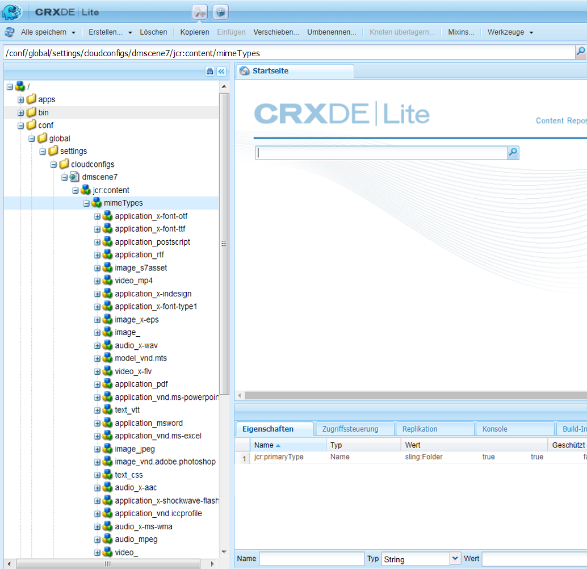

# Konfigurieren von Dynamic Media – Scene7-Modus{#configuring-dynamic-media-scene-mode}

Wenn Sie Adobe Experience Manager für unterschiedliche Umgebungen eingerichtet haben (z. B. je eine Instanz für die Entwicklung, das Staging und die Live-Produktion), müssen Sie Dynamic Media Cloud Services für jede Umgebung konfigurieren.

## Architekturgrafik von Dynamic Media – Scene7-Modus {#architecture-diagram-of-dynamic-media-scene-mode}

Die folgende Architekturgrafik beschreibt die Funktionsweise von Dynamic Media – Scene7-Modus.

Mit der neuen Architektur ist AEM für Assets aus Primärquellen und Synchronisierungen mit Dynamic Media für die Verarbeitung und Veröffentlichung von Assets zuständig:

1. Wenn das Asset aus einer Primärquelle in AEM hochgeladen wurde, wird es in Dynamic Media repliziert. Ab diesem Punkt übernimmt Dynamic Media die gesamte Asset-Verarbeitung und Ausgabenerstellung, z. B. Videokodierung und dynamische Varianten eines Bilds. <!-- (In Dynamic Media - Scene7 mode, be aware that you can only upload assets whose file sizes are 2 GB or less.) Jira ticket CQ-4286561 fixed this issue. DM-S7 NOW SUPPORTS THE UPLOAD OF ASSETS LARGER THAN 2 GB. -->
1. Nachdem die Ausgaben erstellt wurden, kann AEM sicher auf die Dynamic Media-Remote-Ausgabedarstellungen zugreifen und eine Vorschau dafür anzeigen (es werden keine Binärdateien an die AEM-Instanz zurückgesendet).
1. Nachdem der Inhalt bereit zur Genehmigung und Veröffentlichung ist, wird der Dynamic Media-Service ausgelöst und pusht Inhalt an Bereitstellungs-Server und Cache-Inhalt in das CDN.


## Aktivieren von Dynamic Media im Scene7-Modus {#enabling-dynamic-media-in-scene-mode}

[Dynamic Media](https://www.adobe.com/de/solutions/web-experience-management/dynamic-media.html) ist standardmäßig deaktiviert. Funktionen für dynamische Medien müssen für die Nutzung aktiviert werden.

>[!NOTE]
>
>Dynamic Media - Der Scene7-Modus ist nur für die AEM-Autoreninstanz verfügbar. Daher müssen Sie `runmode=dynamicmedia_scene7` für die AEM-Autoreninstanz *und nicht* für die AEM Publish-Instanz konfigurieren.

Zum Aktivieren von dynamischen Medien müssen Sie AEM über die Befehlszeile im Ausführungsmodus `dynamicmedia_scene7` starten, indem Sie folgenden Befehl in ein Terminalfenster eingeben (verwendeter Beispielport: 4502):

```shell
java -Xms4096m -Xmx4096m -Doak.queryLimitInMemory=500000 -Doak.queryLimitReads=500000 -jar cq-quickstart-6.5.0.jar -gui -r author,dynamicmedia_scene7 -p 4502
```

## (Optional) Migration von Dynamic Media-Vorgaben und -Konfigurationen von 6.3 zu 6.5 ohne Ausfallzeit {#optional-migrating-dynamic-media-presets-and-configurations-from-to-zero-downtime}

Wenn Sie ein Upgrade AEM Dynamic Media von 6.3 auf 6.4 oder 6.5 durchführen (was jetzt die Möglichkeit umfasst, keine Ausfallzeiten bereitzustellen), müssen Sie den folgenden Befehl &quot;curl&quot;ausführen, um alle Ihre Vorgaben und Konfigurationen in der CRXDE Lite von `/etc` auf `/conf` zu migrieren.

>[!NOTE]
>
>Wenn Sie Ihre AEM Instanz im Kompatibilitätsmodus ausführen, d. h. die Kompatibilität ist verpackt, müssen Sie diese Befehle nicht ausführen.

Bei allen Upgrades – mit oder ohne Kompatibilitätspaket – können Sie die standardmäßig in Dynamic Media vorhandenen Viewer-Vorgaben kopieren, indem Sie unter Linux den folgenden curl-Befehl ausführen:

`curl -u admin:admin -X POST https://<server_address>:<server_port>/libs/settings/dam/dm/presets/viewer.pushviewerpresets.json`

Um benutzerdefinierte Viewer-Vorgaben und Konfigurationen zu migrieren, die Sie von `/etc` zu `/conf` erstellt haben, führen Sie den folgenden Linux-Befehl &quot;curl&quot;aus:

`curl -u admin:admin -X POST https://<server_address>:<server_port>/libs/settings/dam/dm/presets.migratedmcontent.json`

## Feature Pack 18912 für Massenmigration von Assets installieren {#installing-feature-pack-for-bulk-asset-migration}

Die Installation von Feature Pack 18912 ist *optional*.

Mit Feature Pack 18912 können Sie Assets per FTP stapelweise erfassen oder Assets aus dem Dynamic Media - Hybrid-Modus oder Dynamic Media Classic im Dynamic Media - Scene7-Modus auf AEM migrieren. Sie ist unter [Adobe Professional Services](https://www.adobe.com/de/experience-cloud/consulting-services.html) verfügbar.

Weitere Informationen finden Sie unter [Feature Pack 18912 installieren für Massenmigration von Assets](/help/assets/bulk-ingest-migrate.md).

## Erstellen einer Dynamic Media-Konfiguration in Cloud Services {#configuring-dynamic-media-cloud-services}

**Vor der Konfiguration von Dynamic Media** : Nachdem Sie Ihre Bereitstellungs-E-Mail mit Dynamic Media-Anmeldeinformationen erhalten haben, müssen Sie die  [Dynamic Media Classic-Desktopanwendung](https://experienceleague.adobe.com/docs/dynamic-media-classic/using/getting-started/signing-out.html#getting-started) öffnen und sich dann bei Ihrem Konto anmelden, um Ihr Kennwort zu ändern. Das Kennwort aus der Bereitstellungs-E-Mail wird systemseitig erstellt und ist nur als temporäres Kennwort vorgesehen. Sie müssen das Kennwort aktualisieren, damit Dynamic Media Cloud Service mit den richtigen Anmeldedaten eingerichtet wird.


**So erstellen Sie eine Dynamic Media-Konfiguration in Cloud Services**

1. Tippen Sie AEM auf das AEM Logo, um auf die globale Navigationskonsole zuzugreifen, und dann auf das Symbol Tools und dann auf **[!UICONTROL Cloud Services > Dynamic Media Configuration.]**
1. Tippen Sie auf der Seite „Browser zur Konfiguration von Dynamic Media“ im linken Bereich auf **[!UICONTROL global]** (tippen Sie nicht auf bzw. wählen Sie nicht das Ordnersymbol links neben **[!UICONTROL global]** aus) und tippen Sie dann auf **[!UICONTROL Erstellen.]**
1. Geben Sie auf der Seite **[!UICONTROL Dynamic Media-Konfiguration erstellen]** einen Titel, die E-Mail-Adresse des Dynamic Media-Kontos und ein Kennwort ein und wählen Sie Ihre Region aus. Diese Informationen erhalten Sie in der Bereitstellungs-E-Mail von Adobe. Wenden Sie sich an den Support, wenn Sie sie nicht erhalten haben.

   Klicken Sie auf **[!UICONTROL Mit Dynamic Media verbinden.]**

   >[!NOTE]
   >
   >Nachdem Sie Ihre Bereitstellungs-E-Mail mit Dynamic Media-Anmeldeinformationen erhalten haben, öffnen Sie die Desktopanwendung [Dynamic Media Classic](https://experienceleague.adobe.com/docs/dynamic-media-classic/using/getting-started/signing-out.html#getting-started) und melden Sie sich dann bei Ihrem Konto an, um Ihr Kennwort zu ändern. Das Kennwort aus der Bereitstellungs-E-Mail wird systemseitig erstellt und ist nur als temporäres Kennwort vorgesehen. Das Aktualisieren des Kennworts ist wichtig, damit Dynamic Media Cloud Service mit den richtigen Anmeldedaten eingerichtet wird.

1. Nachdem die Verbindung erfolgreich hergestellt wurde, richten Sie Folgendes ein. Überschriften mit einem Sternchen (*) sind erforderlich:

   * **[!UICONTROL Unternehmen]** – der Name des Dynamic Media-Kontos. Sie können mehrere Dynamic Media-Konten für verschiedene Untermarken, Abteilungen oder verschiedene Staging-/Produktionsumgebungen erstellen.

   * **[!UICONTROL Firmen-Root-Ordnerpfad]**

   * **[!UICONTROL Assets veröffentlichen]** – Sie können zwischen den folgenden drei Optionen wählen:
      * **[!UICONTROL Sofort]** bedeutet, dass das System hochgeladene Assets aufnimmt und umgehend die URL/den Link zur Einbettung bereitstellt. Zum Veröffentlichen von Assets ist kein Benutzereingriff erforderlich.
      * **[!UICONTROL Bei Aktivierung]** bedeutet, dass Sie das Asset zuerst explizit veröffentlichen müssen, bevor eine URL/ein Link zur Einbettung bereitgestellt wird.
      * **[!UICONTROL Selektive]** VeröffentlichungMit diesen Optionen können Sie steuern, welche Ordner in Dynamic Media veröffentlicht werden, damit Sie Funktionen wie Smart-Zuschneiden oder dynamische Darstellungen verwenden können oder welche Ordner ausschließlich in AEM zur Vorschau veröffentlicht werden. Diese Assets werden in Dynamic Media  ** nicht zum Versand öffentlich veröffentlicht.<br>Sie können diese Option hier in der  **[!UICONTROL Dynamic Media Cloud-]** Konfiguration oder, falls gewünscht, auf Ordnerebene in den  **[!UICONTROL Eigenschaften]** eines Ordners festlegen.<br>Siehe [Arbeiten mit selektiver Veröffentlichung in Dynamic Media.](/help/assets/selective-publishing.md)<br>Beachten Sie, dass sich diese Änderungen, wenn Sie diese Konfiguration später ändern oder später auf Ordnerebene ändern, nur auf neue Assets auswirken, die Sie von diesem Zeitpunkt an hochladen. Der Veröffentlichungsstatus vorhandener Assets im Ordner bleibt unverändert, bis Sie ihn im Dialogfeld **[!UICONTROL Quick Publish]** oder **[!UICONTROL Veröffentlichung verwalten]** manuell ändern.
   * **[!UICONTROL Sicherer Vorschau-Server]** – bietet Ihnen die Möglichkeit, den URL-Pfad zu Ihrem Vorschau-Server für sichere Ausgaben anzugeben. Das heißt, dass AEM sicher auf die Dynamic Media-Remote-Ausgaben zugreifen und eine Vorschau dafür anzeigen kann, nachdem die Ausgaben erstellt wurden (es werden keine Binärdateien an die AEM-Instanz zurückgesendet).
Sofern Sie keine gesonderte Vereinbarung zum Verwenden Ihrer eigenen Unternehmens-Server oder eines speziellen Servers getroffen haben, empfiehlt Adobe Systems, diese Einstellung nicht zu verändern. 

   * **[!UICONTROL Alle Inhalte]**  synchronisieren -  <!-- NEW OPTION, CQDOC-15371, Added March 4, 2020-->Standardmäßig ausgewählt. Deaktivieren Sie diese Option, wenn Sie Assets aus der Synchronisierung mit Dynamic Media gezielt ein- oder ausschließen möchten. Wenn Sie diese Option deaktivieren, können Sie aus den beiden folgenden Synchronisierungsmodi für Dynamic Media wählen:

   * **[!UICONTROL Synchronisierungsmodus für Dynamic Media]**
      * **[!UICONTROL Standardmäßig aktiviert]** – Die Konfiguration wird auf alle Ordner angewendet, es sei denn, Sie markieren einen Ordner speziell zum Ausschließen. <!-- you can then deselect the folders that you do not want the configuration applied to.-->
      * **[!UICONTROL Standardmäßig deaktiviert]** – Die Konfiguration wird auf einen Ordner erst dann angewendet, wenn Sie einen ausgewählten Ordner explizit zur Synchronisierung mit Dynamic Media markieren.
Um einen ausgewählten Ordner für die Synchronisierung mit Dynamic Media zu markieren, wählen Sie einen Asset-Ordner aus und klicken Sie dann in der Symbolleiste auf **[!UICONTROL Eigenschaften.]** Wählen Sie auf der Registerkarte **[!UICONTROL Details]** in der Dropdown-Liste **[!UICONTROL Synchronisierungsmodus für Dynamic Media]** eine der folgenden drei Optionen aus. Wenn Sie fertig sind, tippen Sie auf **[!UICONTROL Speichern.]** *Denken Sie daran: Diese drei Optionen stehen nicht zur Verfügung, wenn Sie zuvor **Alle Inhalte synchronisieren**ausgewählt haben.* Weitere Informationen finden Sie unter [Arbeiten mit selektiver Veröffentlichung auf Ordnerebene in Dynamic Media.](/help/assets/selective-publishing.md)
         * **[!UICONTROL Vererbt]** – Kein expliziter Synchronisierungswert für den Ordner. Stattdessen übernimmt der Ordner den Synchronisierungswert von einem seiner Vorgängerordner oder den Standardmodus in der Cloud-Konfiguration. Der detaillierte Status für geerbte Daten wird als QuickInfo angezeigt.
         * **[!UICONTROL Aktivieren für Unterordner]** – Schließen Sie alle Elemente in dieser Unterstruktur zur Synchronisierung mit Dynamic Media ein. Die ordnerspezifischen Einstellungen setzen den Standardmodus in der Cloud-Konfiguration außer Kraft.
         * **[!UICONTROL Deaktiviert für Unterordner]** – Schließen Sie alle Elemente in dieser Unterstruktur von der Synchronisierung mit Dynamic Media aus.

   >[!NOTE]
   >
   >Die Versionierung wird in DMS7 nicht unterstützt. Eine verzögerte Aktivierung gilt nur, wenn auf der Seite „Konfiguration von Dynamic Media bearbeiten“ die Option **[!UICONTROL Assets veröffentlichen]** auf **[!UICONTROL Bei Aktivierung]** eingestellt ist, und erst dann, wenn das Asset zum ersten Mal aktiviert wird.
   >
   >
   >Wenn ein Asset aktiviert wurde, werden alle Aktualisierungen automatisch live in der S7-Bereitstellung übernommen.

1. Tippen Sie auf **[!UICONTROL Speichern]**.
1. Für eine sichere Vorschau von Dynamic Media-Inhalt vor dessen Veröffentlichung müssen Sie die AEM-Autoreninstanz der Zulassungsliste hinzufügen, um eine Verbindung mit Dynamic Media herzustellen:

   * Öffnen Sie die Desktopanwendung [Dynamic Media Classic](https://experienceleague.adobe.com/docs/dynamic-media-classic/using/getting-started/signing-out.html#getting-started) und melden Sie sich dann bei Ihrem Konto an. Ihre Anmeldeinformationen und Anmeldedaten wurden zum Zeitpunkt der Bereitstellung von der Adobe bereitgestellt. Wenn Ihnen die Informationen nicht vorliegen, wenden Sie sich an den technischen Support.

   * Klicken Sie in der Navigationsleiste oben rechts auf der Seite auf **[!UICONTROL Einstellungen > Anwendungseinstellungen > Veröffentlichungseinrichtung > Image-Server.]**

   * Wählen Sie auf der Seite „Veröffentlichung zum Image-Server“ in der Dropdown-Liste „Veröffentlichungskontext“ die Option **[!UICONTROL Image-Serving testen.]**
   * Tippen Sie für den Client-Adressfilter auf **[!UICONTROL Hinzufügen.]**
   * Aktivieren Sie das Kontrollkästchen, um die Adresse zu aktivieren, und geben Sie dann die IP-Adresse der AEM-Autoreninstanz (nicht die Dispatcher-IP) ein.
   * Klicken Sie auf **[!UICONTROL Speichern.]**

Sie haben nun die Grundkonfiguration abgeschlossen und können Dynamic Media im Scene7-Modus verwenden.

Wenn Sie Ihre Konfiguration weiter anpassen möchten, können Sie auch eine der Aufgaben unter [(Optional) Konfigurieren der erweiterten Einstellungen in Dynamic Media – Scene7-Modus](#optional-configuring-advanced-settings-in-dynamic-media-scene-mode) abschließen.

## (Optional) Konfigurieren der erweiterten Einstellungen in Dynamic Media – Scene7-Modus {#optional-configuring-advanced-settings-in-dynamic-media-scene-mode}

Wenn Sie die Konfiguration weiter anpassen und Dynamic Media – Scene7-Modus einrichten oder die Leistung optimieren möchten, können Sie eine oder mehrere der folgenden *optionalen* Aufgaben durchführen:

* [(Optional) Einrichtung und Konfiguration der Einstellungen von Dynamic Media – Scene7-Modus](#optional-setup-and-configuration-of-dynamic-media-scene7-mode-settings)

* [(Optional) Steigern der Leistung von Dynamic Media – Scene7-Modus](#optional-tuning-the-performance-of-dynamic-media-scene-mode) 

* [(Optional) Filtern von Assets für die Replizierung](#optional-filtering-assets-for-replication)

### (Optional) Einrichtung und Konfiguration der Einstellungen von Dynamic Media – Scene7-Modus {#optional-setup-and-configuration-of-dynamic-media-scene7-mode-settings}

Wenn Sie sich im Ausführungsmodus `dynamicmedia_scene7` befinden, verwenden Sie die Dynamic Media Classic-Benutzeroberfläche (Scene7), um Änderungen an Ihren Dynamic Media-Einstellungen vorzunehmen.

Bei einigen der oben genannten Aufgaben müssen Sie die Desktopanwendung [Dynamic Media Classic](https://experienceleague.adobe.com/docs/dynamic-media-classic/using/getting-started/signing-out.html#getting-started) öffnen und sich dann bei Ihrem Konto anmelden.

Die Einrichtungs- und Konfigurationsaufgaben umfassen Folgendes:

* [Veröffentlichungseinstellungen für Image-Server](#publishing-setup-for-image-server)
* [Konfigurieren der allgemeinen Programmeinstellungen](#configuring-application-general-settings)
* [Konfigurieren des Farb-Managements](#configuring-color-management)
* [Bearbeiten von MIME-Typen für unterstützte Formate](#editing-mime-types-for-supported-formats)
* [Hinzufügen von MIME-Typen für nicht unterstützte Formate](#adding-mime-types-for-unsupported-formats)
* [Erstellen von Stapelsatzvorgaben zum automatischen Erzeugen von Bild- und Rotationssets](#creating-batch-set-presets-to-auto-generate-image-sets-and-spin-sets)

#### Veröffentlichungseinstellungen für Image-Server   {#publishing-setup-for-image-server}

Mit den Veröffentlichungseinstellungen wird festgelegt, wie Assets standardmäßig von Dynamic Media bereitgestellt werden. Wenn keine Einstellung festgelegt wird, stellt Dynamic Media ein Asset gemäß den Standardeinstellungen unter „Veröffentlichungseinstellungen“ bereit. Beispiel: Bei der Anfrage, ein Bild bereitzustellen, das kein Auflösungsattribut enthält, wird ein Bild mit der Einstellung „Standardobjektauflösung“ bereitgestellt.

So konfigurieren Sie Veröffentlichungseinstellungen: Klicken Sie in Dynamic Media Classic auf **[!UICONTROL Einrichtung > Anwendungseinstellungen > Veröffentlichungseinstellungen > Image-Server.]**

Auf dem Bildschirm „Image-Server“ werden Standardeinstellungen für das Bereitstellen von Bildern festgelegt. Auf dem Bildschirm der Benutzeroberfläche finden Sie die Beschreibungen der einzelnen Einstellungen.

* **[!UICONTROL Anfrage-Attribute]**: Mit diesen Einstellungen werden Einschränkungen für die Bilder festgelegt, die über den Server bereitgestellt werden können.
* **[!UICONTROL Standardattribute für Anfragen]**: Diese Einstellungen beziehen sich auf die standardmäßige Darstellung von Bildern.
* **[!UICONTROL Allgemeine Attribute für Miniaturansichten]**: Diese Einstellungen beziehen sich auf die standardmäßige Darstellung von Miniaturbildern.
* **[!UICONTROL Standardeinstellungen für Katalogfelder]**: Diese Einstellungen beziehen sich auf die Auflösung und den Standardtyp für Miniaturansichten von Bildern.
* **[!UICONTROL Farbverwaltungsattribute]**: Mit diesen Einstellungen wird festgelegt, welche ICC-Farbprofile verwendet werden.
* **[!UICONTROL Kompatibilitätsattribute]**: Diese Einstellung ermöglicht die Behandlung von Anfangs- und Endabsätzen in Textebenen wie in Version 3.6, um die Abwärtskompatibilität zu gewährleisten.
* **[!UICONTROL Lokalisierungsunterstützung]**: Mit diesen Einstellungen können mehrere Gebietsschemaattribute verwaltet werden. Außerdem kann damit eine Zeichenfolge der Gebietsschemakarte angegeben werden, damit Sie festlegen können, welche Sprachen für die verschiedenen QuickInfos in Viewern unterstützt werden sollen. Weitere Informationen zur Einrichtung der **[Lokalisierungsunterstützung]** finden Sie unter [Überlegungen beim Einrichten der Lokalisierung von Assets](https://help.adobe.com/de_DE/scene7/using/WS997f1dc4cb0179f034e07dc31412799d19a-8000.html).

#### Konfigurieren der allgemeinen Programmeinstellungen {#configuring-application-general-settings}

Zum Öffnen der Seite „Allgemeine Programmeinstellungen“ über die globale Navigationsleiste in Dynamic Media Classic klicken Sie auf **[!UICONTROL Einrichtung > Anwendungseinstellungen > Allgemeine Einstelllungen]**.

**Server - **Bei der Kontobereitstellung stellt Dynamic Media automatisch die zugewiesenen Server für Ihre Firma bereit. Diese Server werden verwendet, um URL-Zeichenfolgen für Ihre Website und Anwendungen zu erstellen. Diese URL-Aufrufe gelten spezifisch für Ihr Konto. Ändern Sie keine Server-Namen, sofern Sie nicht vom AEM-Support ausdrücklich dazu angewiesen werden.

**[!UICONTROL Bilder überschreiben]**: Dynamic Media lässt zwei Dateien mit denselben Namen nicht zu. Die URL-ID (Dateiname ohne Erweiterung) eines Elements muss jeweils eindeutig sein. Diese Optionen legen fest, wie Ersatz-Assets hochgeladen werden, d. h. ob sie das Original ersetzen oder doppelt vorhanden sind. Duplizierte Assets werden durch Anhängen von „-1“ umbenannt („chair.tif“ wird beispielsweise zu „chair-1.tif“). Diese Optionen gelten für Assets, die in einen anderen Ordner als das Original hochgeladen werden, oder Assets mit einer anderen Dateinamenerweiterung als das Original (z. B. JPG, TIF oder PNG).

* **[!UICONTROL Im aktuellen Ordner Bilder mit demselben Namen und derselben Erweiterung überschreiben]**: Diese Option stellt die strengste Ersetzungsregel dar. Das Ersatzbild muss in den Ordner des Originalbilds hochgeladen werden und dieselbe Dateierweiterung haben wie das Originalbild. Wenn diese Voraussetzungen nicht erfüllt sind, wird ein Duplikat erstellt.

>[!NOTE]
>
>Wählen Sie immer die folgende Einstellung, um die Konsistenz mit AEM sicherzustellen: **Im aktuellen Ordner Bilder mit demselben Namen und derselben Erweiterung überschreiben**.

* **[!UICONTROL In belieb. Ordner Assets mit ident. Namen und ident. Erweit. überschreiben]**: Das Ersatzbild muss dieselbe Dateierweiterung haben wie das Originalbild (beispielsweise würde „chair.jpg“ die Datei „chair.jpg“ ersetzen, nicht jedoch die Datei „chair.tif“). Sie können das Ersatzbild jedoch in einen anderen Ordner hochladen als den, in dem sich das Original befindet. Das hochgeladene Bild bleibt dann im neuen Ordner; die Datei befindet sich also nicht mehr am ursprünglichen Speicherort.
* **[!UICONTROL In belieb. Ordner Assets mit ident. Namen unabh. von Erweit. überschreiben]**: Diese Option stellt die am wenigsten einschränkende Ersetzungsregel dar. Sie können ein Ersatzbild in einen anderen Ordner hochladen als den, in dem sich das Originalbild befindet, und eine Datei mit einer anderen Dateierweiterung verwenden, um die Originaldatei zu ersetzen. Wenn sich die Originaldatei in einem anderen Ordner befindet, bleibt das Ersatzbild in dem neuen Ordner, in den es hochgeladen wurde.

**[!UICONTROL Standardfarbprofile]**: Zusätzliche Informationen finden Sie unter [Konfigurieren des Farb-Managements](#configuring-color-management).

>[!NOTE]
>
>Standardmäßig zeigt das System 15 Ausgabedarstellungen an, wenn Sie **[!UICONTROL Ausgabedarstellungen]** auswählen, und 15 Viewer-Voreinstellungen, wenn Sie in der Detailansicht des Assets **[!UICONTROL Viewer]** auswählen. Sie können diese Grenze erhöhen. Siehe [Erhöhung der Anzahl der Bildvorgaben, die angezeigt werden,](/help/assets/managing-image-presets.md#increasing-or-decreasing-the-number-of-image-presets-that-display) oder [Erhöhung der Anzahl der Viewer-Vorgaben, die](/help/assets/managing-viewer-presets.md#increasing-the-number-of-viewer-presets-that-display) anzeigen.


#### Konfigurieren des Farb-Managements {#configuring-color-management}

Beim Farb-Management für Dynamic Media können Sie die Farben von Assets korrigieren. Bei der Farbkorrektur behalten übernommene Assets ihren Farbraum (RGB, CMYK, Grau) und das eingebettete Farbprofil bei. Wenn Sie eine dynamische Ausgabedarstellung anfordern, wird die Bildfarbe gemäß dem Zielfarbraum korrigiert, indem eine CMYK-, RGB- oder Grau-Ausgabe verwendet wird. Siehe [Konfigurieren von Bildvorgaben](/help/assets/managing-image-presets.md).

So konfigurieren Sie die Standardfarbeigenschaften, damit die Farbkorrektur beim Anfordern von Bildern aktiviert ist:

1. Öffnen Sie die Desktopanwendung [Dynamic Media Classic](https://experienceleague.adobe.com/docs/dynamic-media-classic/using/getting-started/signing-out.html#getting-started) und melden Sie sich dann mit den Anmeldeinformationen an, die während der Bereitstellung bereitgestellt werden.
1. Navigieren Sie zu **[!UICONTROL Einrichtung > Anwendungseinstellungen.]**
1. Erweitern Sie den Bereich **[!UICONTROL Veröffentlichungseinstellungen]** und wählen Sie **[!UICONTROL Image-Server.]** Legen Sie **[!UICONTROL Veröffentlichungskontext]** beim Festlegen von Standardwerten für Veröffentlichungsinstanzen auf **[!UICONTROL Image Serving]** fest.
1. Navigieren Sie zu der Eigenschaft, die Sie ändern müssen, z. B. einer Eigenschaft im Bereich **[!UICONTROL Farbverwaltungsattribute]**.

   Sie können die folgenden Farbkorrektureigenschaften festlegen:

   * **[!UICONTROL CMYK-Standardfarbraum]**: Name des standardmäßigen CMYK-Farbprofils
   * **[!UICONTROL Graustufen-Standardfarbraum]**: Name des standardmäßigen Grau-Farbprofils
   * **[!UICONTROL RGB-Standardfarbraum]**: Name des standardmäßigen RGB-Farbprofils
   * **[!UICONTROL Rendering Intent für Farbumwandlung]**: Gibt die Render-Priorität an. Zulässige Werte sind: **[!UICONTROL wahrnehmungsorientiert]**, **[!UICONTROL relativ farbmetrisch]**, **[!UICONTROL Sättigung]**, **[!UICONTROL absolut farbmetrisch.]** Adobe empfiehlt **[!UICONTROL relativ]** als Standard.

1. Tippen Sie auf **[!UICONTROL Speichern]**.

So können Sie beispielsweise den **[!UICONTROL RGB-Standardfarbraum]** auf *sRGB* und den **[!UICONTROL CMYK-Standardfarbraum]** auf *WebCoated* festlegen.

Dies hat folgende Auswirkungen:

* Die Farbkorrektur für RGB- und CMYK-Bilder wird aktiviert.
* Für RGB-Bilder ohne Farbprofil wird angenommen, dass sie sich im Farbraum *sRGB* befinden.
* Für CMYK-Bilder ohne Farbprofil wird angenommen, dass sie sich im Farbraum *WebCoated* befinden.
* Für dynamische Wiedergaben, bei denen eine RGB-Ausgabe zurückgegeben wird, erfolgt dies im Farbraum *sRGB*.
* Für dynamische Wiedergaben, bei denen eine CMYK-Ausgabe zurückgegeben wird, erfolgt dies im Farbraum *WebCoated*.

#### Bearbeiten von MIME-Typen für unterstützte Formate {#editing-mime-types-for-supported-formats}

Sie können festlegen, welche Asset-Typen von Dynamic Media verarbeitet werden, und erweiterte Asset-Verarbeitungsparameter anpassen. Beispielsweise können Sie Asset-Verarbeitungsparameter für folgende Aktionen festlegen:

* Konvertieren eines Adobe PDF-Dokuments in ein E-Katalog-Asset
* Konvertieren eines Adobe Photoshop-Dokuments (.PSD) in ein Bannervorlagen-Asset für Personalisierung
* Rastern einer Adobe Illustrator- (.AI) oder Adobe Photoshop Encapsulated Postscript-Datei (.EPS)
* [Videoprofile](/help/assets/video-profiles.md) und [Bilddarstellungsprofile](/help/assets/image-profiles.md) können jeweils zum Definieren der Verarbeitung von Videos und Bildern verwendet werden.

Informationen hierzu finden Sie unter [Hochladen von Assets](/help/assets/manage-assets.md#uploading-assets).

**So bearbeiten Sie MIME-Typen für unterstützte Formate**

1. Klicken Sie AEM auf das AEM Logo, um auf die globale Navigationskonsole zuzugreifen, und klicken Sie dann auf **[!UICONTROL Tools > Allgemein > CRXDE Lite.]**
1. Navigieren Sie in der linken Leiste zu:

   `/conf/global/settings/cloudconfigs/dmscene7/jcr:content/mimeTypes`

   

1. Wählen Sie unter dem Ordner „mimeTypes“ einen MIME-Typ aus:
1. Im rechten unteren Bereich der Seite „CRXDE Lite“:

   * Doppelklicken Sie auf das Feld **[!UICONTROL Aktiviert]**. Alle Asset-MIME-Typen sind standardmäßig aktiviert (auf **[!UICONTROL true]** festgelegt). Dies bedeutet, dass die Assets zur Verarbeitung mit Dynamic Media synchronisiert werden. Wenn Sie diesen Asset-MIME-Typ von der Verarbeitung ausschließen möchten, ändern Sie diese Einstellung in **[!UICONTROL false.]**

   * Doppelklicken Sie auf **[!UICONTROL jobParam]**, um das zugehörige Textfeld zu öffnen. Unter [Unterstützte MIME-Typen](/help/assets/assets-formats.md#supported-mime-types) finden Sie eine Liste mit zulässigen Werten für Verarbeitungsparameter, die Sie für einen bestimmten MIME-Typ verwenden können.

1. Führen Sie einen der folgenden Schritte aus:

   * Wiederholen Sie die Schritte 3–4, um weitere MIME-Typen zu bearbeiten.
   * Klicken Sie auf der Menüleiste der Seite „CRXDE Lite“ auf **[!UICONTROL Alle speichern]**.

1. Tippen Sie links oben auf der Seite auf **[!UICONTROL CRXDE Lite]**, um zu AEM zurückzukehren.

#### Hinzufügen von MIME-Typen für nicht unterstützte Formate {#adding-mime-types-for-unsupported-formats}

Sie können in AEM Assets benutzerdefinierte MIME-Typen für nicht unterstützte Formate hinzufügen. Um sicherzustellen, dass kein neu hinzugefügter Knoten von AEM gelöscht wird, müssen Sie den MIME-Typ vor `image_` verschieben und der aktivierte Wert auf **[!UICONTROL false eingestellt ist.]**

**So fügen Sie MIME-Typen für nicht unterstützte Formate hinzu**

1. Tippen Sie in AEM auf **[!UICONTROL Tools > Vorgänge > Web-Konsole]**.

   

1. Auf der Seite **[!UICONTROL Adobe Experience Manager-Web-Konsolen-Konfiguration]** wird eine neue Browser-Registerkarte geöffnet.

   

1. Scrollen Sie auf der Seite nach unten zum Namen *Adobe CQ Scene7 Asset MIME type Service*, wie im folgenden Screenshot gezeigt. Tippen Sie rechts neben dem Namen auf die Option **[!UICONTROL Konfigurationswerte bearbeiten]** (Stiftsymbol).

   

1. Klicken Sie auf der Seite **Adobe CQ Scene7 Asset MIME type Service** auf ein beliebiges Pluszeichen &lt;+>. Die Position in der Tabelle, an der Sie auf das Pluszeichen klicken, um den neuen MIME-Typ hinzuzufügen, ist unerheblich.

   

1. Geben Sie `DWG=image/vnd.dwg` in das leere Textfeld ein, das Sie soeben hinzugefügt haben.

   Beachten Sie, dass das Beispiel `DWG=image/vnd.dwg` nur zu Veranschaulichungszwecken dient. Der hier hinzugefügte MIME-Typ kann ein beliebiges anderes nicht unterstütztes Format sein.

   

1. Tippen Sie unten rechts auf der Seite auf **[!UICONTROL Speichern.]**

   An dieser Stelle können Sie die Registerkarte des Browsers schließen, auf der die Seite „Adobe Experience Manager-Web-Konsolen-Konfiguration“ geöffnet ist.

1. Kehren Sie zur Browser-Registerkarte zurück, in der sich Ihre geöffnete AEM-Konsole befindet.
1. Tippen Sie in AEM auf **[!UICONTROL Tools > Allgemein > CRXDE Lite.]**

   

1. Navigieren Sie in der linken Leiste zu:

   `conf/global/settings/cloudconfigs/dmscene7/jcr:content/mimeTypes`

1. Ziehen Sie den MIME-Typ `image_vnd.dwg` und legen Sie ihn direkt über `image_` in der Baumstruktur ab, wie im folgenden Screenshot gezeigt.

   

1. Während der MIME-Typ `image_vnd.dwg` noch ausgewählt ist, doppelklicken Sie auf der Registerkarte **[!UICONTROL Eigenschaften]** in der Zeile **[!UICONTROL Aktiviert]** unter der Spaltenüberschrift **[!UICONTROL Wert]** auf den Wert, um die Dropdown-Liste **[!UICONTROL Wert]** zu öffnen.
1. Geben Sie `false` in das Feld ein (oder wählen Sie **[!UICONTROL false]** aus der Dropdown-Liste).

   

1. Klicken Sie in der oberen linken Ecke der Seite „CRXDE Lite“ auf **[!UICONTROL Alle speichern.]**

#### Erstellen von Stapelsatzvorgaben zum automatischen Erzeugen von Bild- und Rotationssets {#creating-batch-set-presets-to-auto-generate-image-sets-and-spin-sets}

Verwenden Sie Stapelsatzvorgaben, um die Erstellung von Bildsätzen oder Rotationssets während des Hochladens von Assets in Dynamic Media zu automatisieren.

Definieren Sie zuerst die Benennungskonvention für die Gruppierung von Assets in einem Satz. Anschließend können Sie eine Stapelsatzvorgabe erstellen. Dabei handelt es sich um einen eindeutig benannten, in sich abgeschlossenen Satz von Anweisungen, der festlegt, wie der Satz unter Verwendung von Bildern erstellt wird, die den im Vorgabenrezept definierten Benennungsregeln entsprechen.

Wenn Sie Dateien hochladen, erstellt Dynamic Media automatisch einen Satz mit allen Dateien, die den definierten Benennungsregeln in den aktiven Vorgaben entsprechen.

**Konfigurieren der Standardbenennung**

Erstellen Sie eine Standardbenennungskonvention zur Verwendung in einem beliebigen Stapelsatzvorgaben-Rezept. Die in der Definition der Stapelsatzvorgabe ausgewählte Standardbenennungsregel ist möglicherweise alles, was Ihr Unternehmen zur Stapelgenerierung von Sätzen benötigt. Eine Stapelsatzvorgabe wird erstellt, damit die von Ihnen definierte Standardbenennungskonvention verwendet wird. Sie können so viele Stapelsatzvorgaben mit alternativen, benutzerdefinierten Benennungskonventionen erstellen, wie für einen bestimmten Satz von Inhalten notwendig sind, sofern eine Ausnahme für die unternehmensspezifische Standardbenennung vorhanden ist.

Die Einrichtung einer Standardbenennungskonvention ist keine Voraussetzung für die Nutzung der Stapelsatzvorgabenfunktion. Es hat sich jedoch bewährt, mithilfe der Standardbenennungskonvention so viele Elemente Ihrer Benennungskonvention zu definieren, wie Sie in einem Satz gruppieren möchten, um die Stapelsatzerstellung zu optimieren.

Hinweis: Als Alternative können Sie **[!UICONTROL Code anzeigen]** ohne verfügbare Formularfelder verwenden. In dieser Ansicht erstellen Sie die Definitionen Ihrer Benennungskonvention vollständig unter Verwendung von regulären Ausdrücken.

Zwei Elemente sind zur Definition verfügbar: Übereinstimmung und Basisname. Mit diesen Feldern können Sie alle Elemente einer Benennungskonvention definieren und den Teil der Konvention identifizieren, der zum Benennen des Satzes verwendet wird, der diese Elemente enthält. Für die individuelle Benennungskonvention eines Unternehmens können eine oder mehrere Zeilen der Definition für jedes dieser Elemente verwendet werden. Sie können für Ihre eindeutige Definition so viele Zeilen wie erforderlich verwenden und sie zu eindeutigen Elementen gruppieren, beispielsweise Elementen für Hauptbild, Farbe, alternative Ansicht und Muster.

**So konfigurieren Sie die Standardbenennung**

1. Öffnen Sie die Desktopanwendung [Dynamic Media Classic](https://experienceleague.adobe.com/docs/dynamic-media-classic/using/getting-started/signing-out.html#getting-started) und melden Sie sich dann bei Ihrem Konto an.

   Ihre Anmeldeinformationen und Anmeldedaten wurden zum Zeitpunkt der Bereitstellung von der Adobe bereitgestellt. Wenn Ihnen die Informationen nicht vorliegen, wenden Sie sich an den technischen Support.

1. Tippen Sie in der Navigationsleiste im oberen Seitenbereich auf **[!UICONTROL Einrichtung > Anwendungseinstellungen > Stapelsatzvorgaben > Standardbenennung.]**
1. Wählen Sie **[!UICONTROL Formular anzeigen]** oder **[!UICONTROL Code anzeigen]**, um die gewünschte Ansicht festzulegen, und geben Sie Informationen zu den einzelnen Elementen ein.

   Sie können das Kontrollkästchen **[!UICONTROL Code anzeigen]** aktivieren, um die Erstellung des regelmäßigen Ausdruckswerts neben Ihren Formularauswahlen anzuzeigen. Sie können diese Werte nach Bedarf eingeben oder ändern. Dies hilft Ihnen bei der Definition der Elemente der Benennungsdefinition, falls Sie aus irgendeinem Grund durch die Formularansicht eingeschränkt werden. Falls Ihre Werte in der Formularansicht nicht analysiert werden können, werden die Formularfelder inaktiv.

   >[!NOTE]
   >
   >Bei deaktivierten Formularfeldern erfolgt keine Überprüfung, ob Ihre regelmäßigen Ausdrücke korrekt sind. Ergebnisse des regelmäßigen Ausdrucks, den Sie für jedes Element erstellen, werden nach der Zeile „Ergebnis“ angezeigt. Der vollständige regelmäßige Ausdruck wird am unteren Seitenrand angezeigt.

1. Erweitern Sie die Elemente bei Bedarf und geben Sie die zu verwendenden Benennungsregeln ein.
1. Führen Sie ggf. einen der folgenden Schritte aus:

   * Tippen Sie auf **[!UICONTROL Hinzufügen]**, um eine weitere Benennungsregel für ein Element hinzuzufügen.
   * Tippen Sie auf **[!UICONTROL Entfernen]**, um eine Benennungsregel für ein Element zu löschen.

1. Führen Sie einen der folgenden Schritte aus:

   * Tippen Sie auf **[!UICONTROL Speichern unter]** und geben Sie einen Namen für die Vorgabe ein.
   * Wenn Sie eine vorhandene Vorgabe bearbeiten, tippen Sie auf **[!UICONTROL Speichern]**.

**Erstellen einer Stapelsatzvorgabe**

Dynamic Media verwendet Stapelsatzvorgaben, um Assets für die Anzeige in Viewern in Bildsätzen (alternative Bilder, Farboptionen, 360°-Drehung) zu organisieren. Die Stapelsatzvorgaben werden automatisch parallel zu den Asset-Uploadprozessen in Dynamic Media ausgeführt.

Sie können Ihre Stapelsatzvorgaben erstellen, bearbeiten und verwalten. Es gibt zwei Formen von Definitionen für Stapelsatzvorgaben, eine für eine von Ihnen eingerichtete Standardbenennungskonvention und eine für benutzerdefinierte Standardbenennungskonventionen, die Sie spontan erstellen.

Sie können zum Definieren einer Stapelsatzvorgabe entweder die Formularfeldmethode oder die Codemethode verwenden, die Ihnen die Verwendung regelmäßiger Ausdrücke ermöglicht. Ebenso wie bei der Standardbenennung können Sie gleichzeitig „Code anzeigen“ wählen und Definitionen in der Formularansicht vornehmen und mithilfe von regelmäßigen Ausdrücken Ihre Definitionen erstellen Als Alternative können Sie eine der Ansichten deaktivieren, um die andere ausschließlich zu verwenden.

**So erstellen Sie eine Stapelsatzvorgabe**

1. Öffnen Sie die Desktopanwendung [Dynamic Media Classic](https://experienceleague.adobe.com/docs/dynamic-media-classic/using/getting-started/signing-out.html#getting-started) und melden Sie sich dann bei Ihrem Konto an.

   Ihre Anmeldeinformationen und Anmeldedaten wurden zum Zeitpunkt der Bereitstellung von der Adobe bereitgestellt. Wenn Ihnen die Informationen nicht vorliegen, wenden Sie sich an den technischen Support.

1. Tippen Sie in der Navigationsleiste im oberen Seitenbereich auf **[!UICONTROL Einrichtung > Anwendungseinstellungen > Stapelsatzvorgaben > Stapelsatzvorgabe.]**

   Hinweis: **[!UICONTROL Formular anzeigen]**, wie oben rechts auf der Detailseite festgelegt, ist die Standardansicht.

1. Tippen Sie im Bereich „Vorgabenliste“ auf **[!UICONTROL Hinzufügen]**, um die Definitionsfelder im Detailbereich auf der rechten Seite des Bildschirms zu aktivieren.
1. Geben Sie im Bereich „Details“ im Feld „Vorgabenname“ einen Namen für die Vorgabe ein.
1. Wählen Sie im Dropdownmenü „Stapelsatztyp“ einen Vorgabentyp aus.
1. Führen Sie einen der folgenden Schritte aus:

   * Wenn Sie eine standardmäßige Benennungskonvention verwenden, die Sie zuvor unter **[!UICONTROL Anwendungseinstellungen > Stapelsatzvorgaben > Standardbenennung]** eingerichtet haben, erweitern Sie **[!UICONTROL Asset-Benennungsregeln]** und klicken Sie anschließend in der Dropdown-Liste auf **[!UICONTROL Standard.]**

   * Zum Definieren einer neuen Benennungskonvention während der Einrichtung der Vorgabe erweitern Sie **[!UICONTROL Asset-Benennungsregeln]** und klicken Sie anschließend in der Dropdown-Liste „Dateibenennung“ auf **[!UICONTROL Benutzerdefiniert.]**

1. Für die Reihenfolge der Sequenz definieren Sie die Reihenfolge, in der Bilder angezeigt werden, nachdem der Satz in Dynamic Media gruppiert wurde.

   Die Assets werden standardmäßig in alphanumerischer Reihenfolge angeordnet. Sie können jedoch auch eine durch Kommas getrennte Liste mit regulären Ausdrücken verwenden, um die Reihenfolge anzupassen.

1. Geben Sie für „Satzbenennungs- und -erstellungsregel“ das Suffix bzw. Präfix für den Basisnamen an, den Sie in der Asset-Benennungsregel definiert haben. Legen Sie außerdem fest, wo der Satz in der Dynamic Media-Ordnerstruktur erstellt werden soll.

   Falls Sie eine große Anzahl von Sätzen definieren, sollten Sie diese von den Ordnern, die die Assets selbst enthalten, getrennt halten. Dazu können Sie beispielsweise einen Ordner namens „Bildsätze“ erstellen und die Anwendung anweisen, generierte Sätze hier abzulegen.

1. Tippen Sie im Bereich „Details“ auf **[!UICONTROL Speichern.]**
1. Tippen Sie neben dem neuen Vorgabenamen auf **[!UICONTROL Aktiv]**.

   Durch das Aktivieren dieser Vorgabe wird sichergestellt, dass beim Hochladen von Assets in Dynamic Media die Stapelsatzvorgabe zur Erstellung des Satzes angewendet wird.

**Erstellen einer Stapelsatzvorgabe für die automatische Erstellung eines 2D-Rotationssets**

Sie können den Stapelsatztyp **[!UICONTROL Multiachsen-Rotationsset]** verwenden, um ein „Rezept“ zu erstellen, das die Erstellung von 2D-Rotations-Sets automatisiert. Für die Gruppierung von Bildern werden die regulären Ausdrücke „Zeile“ und „Spalte“ verwendet, sodass die Bild-Assets im multidimensionalen Array korrekt an der entsprechenden Position ausgerichtet werden. Es gibt keine Mindest- oder Maximalzahl an Reihen und Spalten, die in einem Multiachsen-Rotationsset vorhanden sein müssen.

Beispiel: Sie möchten ein Multiachsen-Rotationsset mit dem Namen `spin-2dspin` erstellen. Sie haben einen Satz von Rotationsset-Bildern, die drei Zeilen mit 12 Bildern pro Zeile enthalten. Die Bilder haben die folgenden Namen:

```
spin-01-01
 spin-01-02
 …
 spin-01-12
 spin-02-01
 …
 spin-03-12
```

Mit diesen Informationen können Sie Ihr Stapelsatztyp-Rezept wie folgt erstellen:


Die Gruppierung für den Teil des gemeinsamen Asset-Namens des Rotationssets wird dem Feld **Übereinstimmung** hinzugefügt (wie hervorgehoben). Der variable Teil des Asset-Namens, der die Zeile und Spalte enthält, wird den Feldern **Zeile** bzw. **Spalte** hinzugefügt.

Wenn das Rotations-Set hochgeladen und veröffentlicht wird, aktivieren Sie den Namen des 2D-Rotations-Sets-Rezepts, das unter **Batchset-Voreinstellungen** im Dialogfeld **Upload-Auftragsoptionen** aufgeführt ist.

**So erstellen Sie eine Stapelsatzvorgabe für die automatische Erstellung eines 2D-Rotations-Sets**

1. Öffnen Sie die Desktopanwendung [Dynamic Media Classic](https://experienceleague.adobe.com/docs/dynamic-media-classic/using/getting-started/signing-out.html#getting-started) und melden Sie sich dann bei Ihrem Konto an.

   Ihre Anmeldeinformationen und Anmeldedaten wurden zum Zeitpunkt der Bereitstellung von der Adobe bereitgestellt. Wenn Ihnen die Informationen nicht vorliegen, wenden Sie sich an den technischen Support.

1. Klicken Sie auf der Navigationsleiste im oberen Seitenbereich auf **[!UICONTROL Einrichtung] > [!UICONTROL Anwendungseinstellungen] > [!UICONTROL Stapelsatzvorgaben ]> [!UICONTROL Stapelsatzvorgabe]**.

   Hinweis: **[!UICONTROL Formular anzeigen]**, wie oben rechts auf der Detailseite festgelegt, ist die Standardansicht.

1. Klicken Sie im Bereich „Vorgabenliste“ auf **[!UICONTROL Hinzufügen]**, um die Definitionsfelder im Detailbereich auf der rechten Seite des Bildschirms zu aktivieren.
1. Geben Sie im Bereich „Details“ im Feld „Vorgabenname“ einen Namen für die Vorgabe ein.
1. Wählen Sie im Dropdown-Menü „Batch-Settyp“ die Option **[!UICONTROL Assetset.]**
1. Wählen Sie in der Dropdown-Liste &quot;Untertyp&quot;die Option **[!UICONTROL Multiachsen-Rotationsset.]**
1. Erweitern Sie **[!UICONTROL Asset-Benennungskonventionen]** und klicken Sie in der Dropdown-Liste „Dateibenennung“ auf **[!UICONTROL Benutzerdefiniert.]**
1. Verwenden Sie die Attribute **[!UICONTROL Übereinstimmung]** und optional **[!UICONTROL Basisname]**, um einen regulären Ausdruck für die Benennung von Bild-Assets zu definieren, aus denen die Gruppierung besteht.

   Ein regulärer Ausdruck für eine genaue Übereinstimmung könnte z. B. wie folgt aussehen:

   `(w+)-w+-w+`

1. Erweitern Sie **[!UICONTROL Zeilen-/Spaltenposition]** und definieren Sie anschließend den Namen des Formats für die Position des Bild-Assets innerhalb des 2D-Rotationsset-Arrays.

   Setzen Sie die Zeilen- oder Spaltenposition im Dateinamen in Klammern.

   Ein regulärer Ausdruck für die Zeile könnte z. B. wie folgt aussehen:

   `\w+-R([0-9]+)-\w+`

   oder

   `\w+-(\d+)-\w+`

   Ein regulärer Ausdruck für die Spalte könnte wie folgt aussehen:

   `\w+-\w+-C([0-9]+)`

   oder

   `\w+-\w+-C(\d+)`

   Beachten Sie, dass dies nur Beispiele sind. Sie können reguläre Ausdrücke Ihren Bedürfnissen entsprechend erstellen.

   >[!NOTE]
   >
   >Wenn anhand der Kombination aus regulärem Ausdruck für Zeile und Spalte diese Position des Assets innerhalb des multidimensionalen Rotationsset-Arrays nicht ermittelt werden kann, wird das Asset dem Satz nicht hinzugefügt und ein Fehler wird protokolliert.

1. Geben Sie für „Satzbenennungs- und -erstellungsregel“ das Suffix bzw. Präfix für den Basisnamen an, den Sie in der Asset-Benennungsregel definiert haben.

   Legen Sie außerdem fest, wo das Rotationsset in der Dynamic Media Classic-Ordnerstruktur erstellt werden soll.

   Falls Sie eine große Anzahl von Sätzen definieren, sollten Sie diese von den Ordnern, die die Assets selbst enthalten, getrennt halten. Dazu erstellen Sie beispielsweise einen Ordner namens „Rotationssets“ und weisen die Anwendung an, generierte Sätze hier abzulegen.

1. Klicken Sie im Bereich „Details“ auf **[!UICONTROL Speichern.]**
1. Klicken Sie neben dem neuen Vorgabenamen auf **[!UICONTROL Aktiv]**.

   Durch das Aktivieren dieser Vorgabe wird sichergestellt, dass beim Hochladen von Assets in Dynamic Media die Stapelsatzvorgabe angewendet wird, um den Satz zu erstellen.

### (Optional) Steigern der Leistung von Dynamic Media – Scene7-Modus  {#optional-tuning-the-performance-of-dynamic-media-scene-mode}

Damit der Dynamic Media - Scene7-Modus reibungslos ausgeführt werden kann, empfiehlt Adobe die folgenden Tipps zur Synchronisierungsleistung/Skalierbarkeit:

* Aktualisieren der vordefinierten Auftragsparameter zur Verarbeitung verschiedener Dateiformate.
* Aktualisieren der vordefinierten Warteschlangen-Workerthreads des Granite-Workflows (Video-Assets).
* Aktualisieren der vordefinierten Warteschlangen-Workerthreads des Granite-Verlaufs-Workflows (Bilder und Nicht-Video-Assets).
* Aktualisieren der maximalen Upload-Verbindungen mit dem Dynamic Media Classic-Server.

#### Aktualisieren der vordefinierten Auftragsparameter zur Verarbeitung verschiedener Dateiformate.

Beim Hochladen von Dateien können Sie die Auftragsparameter für eine schnellere Verarbeitung anpassen. Wenn Sie beispielsweise PSD-Dateien hochladen, diese jedoch nicht als Vorlagen verarbeiten möchten, können Sie die Ebenenextraktion auf „false“ (falsch/aus) setzen. In diesem Fall würden die angepassten Auftragsparameter als `process=None&createTemplate=false` angezeigt.

Adobe empfiehlt die Verwendung der folgenden „angepassten“ Auftragsparameter für PDF-, PostScript- und PSD-Dateien:

<!-- OLD PDF JOB PARAMETERS `pdfprocess=Rasterize&resolution=150&colorspace=Auto&pdfbrochure=false&keywords=false&links=false` -->

<!-- OLD POSTSCRIPT JOB PARAMETERS `psprocess=Rasterize&psresolution=150&pscolorspace=Auto&psalpha=false&psextractsearchwords=false&aiprocess=Rasterize&airesolution=150&aicolorspace=Auto&aialpha=false` -->

| Dateityp | Empfohlene Auftragsparameter |
| ---| ---|
| PDF | `pdfprocess=Thumbnail&resolution=150&colorspace=Auto&pdfbrochure=false&keywords=false&links=false` |
| Postscript | `psprocess=Rasterize&psresolution=150&pscolorspace=Auto&psalpha=false&psextractsearchwords=false&aiprocess=Thumbnail&airesolution=150&aicolorspace=Auto&aialpha=false` |
| PSD | `process=None&layerNaming=Layername&anchor=Center&createTemplate=false&extractText=false&extendLayers=false` |

Um einen dieser Parameter zu aktualisieren, führen Sie die Schritte unter [Unterstützung von MIME-typbasierten Assets/Dynamic Media Classic-Upload-Auftragsparametern](#enabling-mime-type-based-assets-scene-upload-job-parameter-support) aus.

#### Aktualisieren der Warteschlange für den transienten Granite-Workflow {#updating-the-granite-transient-workflow-queue}

Die Transit-Workflow-Warteschlange von Granite wird für den Workflow **[!UICONTROL DAM-Update-Asset]** verwendet. In Dynamic Media wird sie für die Bildaufnahme und -verarbeitung genutzt.

**So aktualisieren Sie die Warteschlange für den transienten Granite-Workflow**

1. Navigieren Sie zu [https://&lt;Server>/system/console/configMgr](https://localhost:4502/system/console/configMgr) und suchen Sie nach **Warteschlange: Warteschlange für die Granite-Übergangs-Workflows**.

   >[!NOTE]
   >
   >Anstelle einer direkten URL ist eine Textsuche erforderlich, da die OSGi-PID dynamisch generiert wird.

1. Ändern Sie im Feld **[!UICONTROL Maximale Anzahl an parallelen Aufträgen]** die Zahl in den gewünschten Wert.

   Sie können **[!UICONTROL Maximale Anzahl an parallelen Aufträgen]** erhöhen, um das Hochladen von Dateien zu Dynamic Media angemessen zu unterstützen. Der genaue Wert hängt von der Hardwarekapazität ab. In bestimmten Szenarien – z. B. bei einer ersten Migration oder einem einmaligen Massen-Upload – können Sie einen großen Wert verwenden. Beachten Sie jedoch, dass die Verwendung eines großen Werts (z. B. die doppelte Anzahl an Kernen) negative Auswirkungen auf andere gleichzeitige Aktivitäten haben kann. Daher sollten Sie den Wert basierend auf Ihrem jeweiligen Anwendungsfalls testen und anpassen.

<!--    By default, the maximum number of parallel jobs depends on the number of available CPU cores. For example, on a 4-core server, it assigns 2 worker threads. (A value between 0.0 and 1.0 is ratio based, or any numbers greater than 1 will assign the number of worker threads.)

   Adobe recommends that 32 **[!UICONTROL Maximum Parallel Jobs]** be configured to adequately support heavy upload of files to Dynamic Media Classic (Scene7). -->


1. Tippen Sie auf **[!UICONTROL Speichern]**.

#### Aktualisieren der Granite-Workflow-Warteschlange {#updating-the-granite-workflow-queue}

Die Granite-Workflow-Warteschlange wird für Workflows ohne Verlauf verwendet. In Dynamic Media dient sie zum Verarbeiten von Videos mit dem Workflow **[!UICONTROL Dynamic Media-Videokodierung]**.

**So aktualisieren Sie die Granite-Workflow-Warteschlange**

1. Navigieren Sie zu `https://<server>/system/console/configMgr` und suchen Sie nach **Warteschlange: Granite-Workflow-Warteschlange**.

   >[!NOTE]
   >
   >Anstelle einer direkten URL ist eine Textsuche erforderlich, da die OSGi-PID dynamisch generiert wird.

1. Ändern Sie im Feld **[!UICONTROL Maximale Anzahl an parallelen Aufträgen]** die Zahl in den gewünschten Wert.

   Sie können Maximale Anzahl an parallelen Aufträgen erhöhen, um das Hochladen von Dateien zu Dynamic Media angemessen zu unterstützen. Der genaue Wert hängt von der Hardwarekapazität ab. In bestimmten Szenarien – z. B. bei einer ersten Migration oder einem einmaligen Massen-Upload – können Sie einen großen Wert verwenden. Beachten Sie jedoch, dass die Verwendung eines großen Werts (z. B. die doppelte Anzahl an Kernen) negative Auswirkungen auf andere gleichzeitige Aktivitäten haben kann. Daher sollten Sie den Wert basierend auf Ihrem jeweiligen Anwendungsfalls testen und anpassen.

   

1. Tippen Sie auf **[!UICONTROL Speichern]**.

#### Aktualisieren der Dynamic Media Classic-Upload-Verbindung {#updating-the-scene-upload-connection}

Die Einstellung der Upload-Verbindung (Scene7) synchronisiert AEM Assets mit Dynamic Media Classic-Servern.

**So aktualisieren Sie die Dynamic Media Classic-Upload-Verbindung**

1. Navigieren Sie zu `https://<server>/system/console/configMgr/com.day.cq.dam.scene7.impl.Scene7UploadServiceImpl`
1. Ändern Sie im Feld **[!UICONTROL Anzahl der Verbindungen]** und/oder im Feld **[!UICONTROL Zeitüberschreitung bei aktiven Aufträgen]** den Wert in die gewünschte Anzahl.

   Mit der Einstellung **[!UICONTROL Anzahl der Verbindungen]** wird die maximale Anzahl von HTTP-Verbindungen gesteuert, die für den Upload von AEM zu Dynamic Media zulässig ist; in der Regel ist der vordefinierte Wert von 10 Verbindungen ausreichend.

   Die Einstellung **[!UICONTROL Zeitüberschreitung bei aktiven Aufträgen]** legt die Wartezeit für hochgeladene Dynamic Media-Assets bis zur Veröffentlichung auf dem Übermittlungs-Server fest. Dieser Wert beträgt standardmäßig 2.100 Sekunden oder 35 Minuten.

   In den meisten Fällen ist die Einstellung „2100“ausreichend.

   

1. Tippen Sie auf **[!UICONTROL Speichern]**.

### (Optional) Filtern von Assets für die Replizierung {#optional-filtering-assets-for-replication}

In Nicht-Dynamic Media-Bereitstellungen replizieren Sie *alle*-Elemente (sowohl Bilder als auch Videos) aus Ihrer AEM Autorendatei in den AEM Veröffentlichungsknoten. Dieser Arbeitsablauf ist erforderlich, da die AEM Server die Assets auch bereitstellen.

Da Assets jedoch über den Cloud-Dienst bereitgestellt werden, müssen diese Assets in Dynamic Media-Bereitstellungen nicht repliziert AEM Veröffentlichungsknoten. Ein solcher Arbeitsablauf für &quot;Hybrid-Veröffentlichung&quot;vermeidet zusätzliche Kosten für die Datenspeicherung und längere Verarbeitungszeiten für die Replizierung von Assets. Andere Inhalte, z. B. Webseiten in Sites, werden weiterhin über die AEM-Veröffentlichungsknoten bereitgestellt.

Mit den Filtern können Sie Assets von der Replikation auf dem AEM-Veröffentlichungsknoten *ausschließen*.

#### Verwenden von Asset-Standardfiltern für die Replikation {#using-default-asset-filters-for-replication}

Wenn Sie Dynamic Media für Bildbearbeitung und/oder Video verwenden, können Sie die standardmäßigen Filter verwenden, die wir Ihnen zur Verfügung stellen. Folgende Filter sind standardmäßig aktiviert:

<table>
 <tbody>
  <tr>
   <td> </td>
   <td><strong>Filter</strong></td>
   <td><strong>Mimetype</strong></td>
   <td><strong>Ausgabeformate</strong></td>
  </tr>
  <tr>
   <td>Dynamic Media Image Versand</td>
   <td><p>filter-images</p> <p>filter-sets</p> <p> </p> </td>
   <td><p>Beginn mit <strong>image/</strong></p> <p>Enthält <strong>application/</strong> und endet mit <strong>set</strong>.</p> </td>
   <td>Die vordefinierten "Filterbilder"(gilt für Einzelbilder, einschließlich interaktiver Bilder) und "Filtersätze"(gilt für Rotationssets, Bildsätze, gemischte Mediensets und Karussell-Sets) werden wie folgt ausgeführt:
    <ul>
     <li>Das Originalbild und statische Bildausgabeformate werden von der Replikation ausgeschlossen.</li>
    </ul> </td>
  </tr>
  <tr>
   <td>Dynamic Media Video Versand</td>
   <td>filter-video</td>
   <td>Beginn mit <strong>video/</strong></td>
   <td>Das vordefinierte "filter-video" wird:
    <ul>
     <li>Von der Replikation ausschließen Sie die ursprünglichen Video- und statischen Miniaturdarstellungen. <br /> <br /> </li>
    </ul> </td>
  </tr>
 </tbody>
</table>

>[!NOTE]
>
>Filter gelten für MIME-Typen und können nicht pfadspezifisch sein.

#### Anpassen von Asset-Filtern für die Replikation  {#customizing-asset-filters-for-replication}

1. Tippen Sie AEM auf das AEM Logo, um auf die globale Navigationskonsole zuzugreifen, und tippen Sie auf **[!UICONTROL Tools > Allgemein > CRXDE Lite.]**
1. Navigieren Sie im linken Ordnerbaum zu `/etc/replication/agents.author/publish/jcr:content/damRenditionFilters`, um die Filter zu überprüfen.

   

1. Zum Definieren des MIME-Typs für den Filter können Sie den MIME-Typ wie folgt ermitteln:

   Erweitern Sie in der linken Leiste `content > dam > <locate_your_asset> > jcr:content > metadata` und suchen Sie in der Tabelle `dc:format`.

   Die folgende Grafik veranschaulicht den Pfad eines Assets zu `dc:format`.

   

   Beachten Sie, dass `dc:format` für das Asset `Fiji Red.jpg` `image/jpeg`  lautet.

   Damit dieser Filter für alle Bilder unabhängig von ihrem Format gilt, setzen Sie den Wert auf `image/*`, wobei `*` ein regulärer Ausdruck ist, der auf alle Bilder eines beliebigen Formats angewendet wird.

   Damit der Filter nur auf Bilder vom Typ JPEG angewendet werden kann, geben Sie den Wert `image/jpeg` ein.

1. Definieren Sie, welche Darstellungen Sie von der Replizierung ausschließen möchten.

   Sie können die folgenden Zeichen verwenden, um einen Filtervorgang für die Replikation durchzuführen:

<table>
 <tbody>
  <tr>
   <td><strong>Zu verwendendes Zeichen</strong></td>
   <td><strong>So werden Assets für die Replizierung Filter</strong></td>
  </tr>
  <tr>
   <td>*</td>
   <td>Platzhalterzeichen<br /> </td>
  </tr>
  <tr>
   <td>+</td>
   <td>Umfasst Elemente für die Replikation.</td>
  </tr>
  <tr>
   <td>-</td>
   <td>Schließt Assets von der Replikation aus.</td>
  </tr>
 </tbody>
</table>

Navigieren Sie zu `content/dam/<locate your asset>/jcr:content/renditions`.

Die folgende Grafik ist ein Beispiel für die Wiedergabeformate eines Assets.


Wenn Sie nur das Original replizieren möchten, geben Sie `+original` ein.

