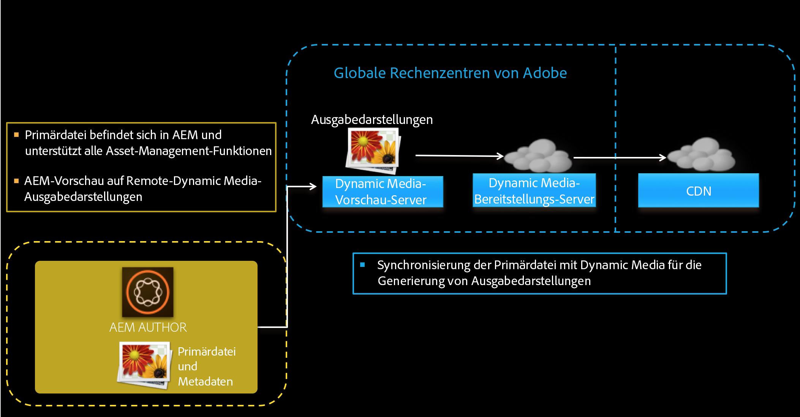
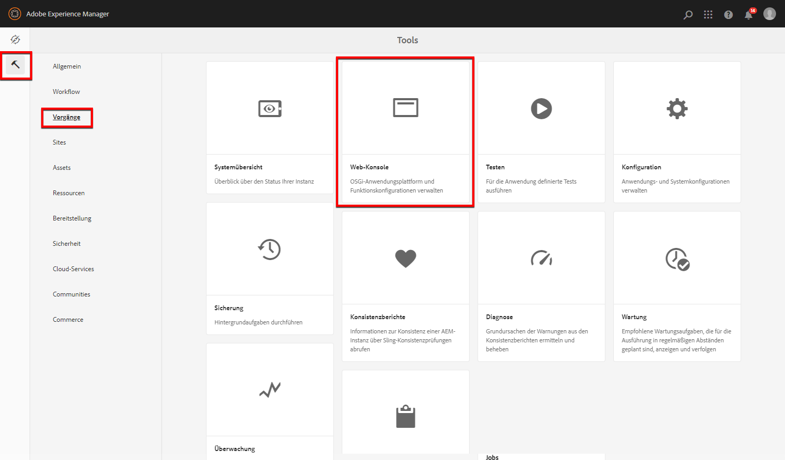

# Konfigurieren des Dynamic Media-Scene7-Modus{#configuring-dynamic-media-scene-mode}

Wenn Sie Adobe Experience Manager für verschiedene Umgebungen wie Entwicklung, Staging und Produktion verwenden, konfigurieren Sie Dynamic Media Cloud Services für jede dieser Umgebungen.

## Architekturgrafik des Dynamic Media-Scene7-Modus {#architecture-diagram-of-dynamic-media-scene-mode}

Im folgenden Architekturdiagramm wird beschrieben, wie der Dynamic Media - Scene7 -Modus funktioniert.

Mit der neuen Architektur ist Experience Manager für Assets aus Primärquellen und Synchronisierungen mit Dynamic Media für die Verarbeitung und Veröffentlichung von Assets zuständig:

1. Wenn das Primärquellen-Asset in Experience Manager hochgeladen wird, wird es nach Dynamic Media repliziert. Ab diesem Punkt übernimmt Dynamic Media die gesamte Asset-Verarbeitung und die Erstellung von Ausgabedarstellungen, z. B. Videokodierung und dynamische Varianten eines Bilds.
(Im Dynamic Media-Scene7-Modus beträgt die standardmäßige Upload-Dateigröße 2 GB oder weniger. Informationen zum Hochladen von Dateigrößen von 2 GB bis 15 GB finden Sie unter [(Optional) Konfigurieren des Dynamic Media-Scene7-Modus für das Hochladen von Assets mit mehr als 2 GB](#optional-config-dms7-assets-larger-than-2gb).)
1. Nachdem die Ausgabedarstellungen generiert wurden, kann Experience Manager sicher auf die Remote-Dynamic Media-Ausgabedarstellungen zugreifen und eine Vorschau davon anzeigen (es werden keine Binärdateien an die Experience Manager-Instanz zurückgesendet).
1. Nachdem der Inhalt bereit zur Genehmigung und Veröffentlichung ist, wird der Dynamic Media-Service ausgelöst und pusht Inhalte an Bereitstellungs-Server und Cache-Inhalte in das CDN (Content Delivery Network).



>[!IMPORTANT]
>
>Für die folgende Liste von Funktionen müssen Sie das im Lieferumfang von Adobe Experience Manager – Dynamic Media enthaltene vorkonfigurierte CDN verwenden. Andere benutzerdefinierte CDN werden von diesen Funktionen nicht unterstützt.
>
>* [Intelligente Bildbearbeitung](/help/assets/imaging-faq.md)
>* [Cache-Invalidierung](/help/assets/invalidate-cdn-cache-dynamic-media.md)
>* [Hotlink-Schutz](/help/assets/hotlink-protection.md)
>* [Bereitstellung von Inhalten per HTTP/2](/help/assets/http2.md)
>* URL-Umleitung auf CDN-Ebene
>* Akamai ChinaCDN (für optimalen Versand in China)

## Aktivieren von Dynamic Media im Scene7-Modus {#enabling-dynamic-media-in-scene-mode}

[Dynamic Media ist standardmäßig deaktiviert. ](https://business.adobe.com/de/products/experience-manager/assets/dynamic-media.html) Funktionen für Dynamic Media müssen für die Nutzung aktiviert werden.

>[!WARNING]
>
>Der Dynamic Media-Scene7-Modus ist *nur für die Experience Manager-Autoreninstanz*. Daher müssen Sie `runmode=dynamicmedia_scene7` auf der Experience Manager-Autoreninstanz und *nicht* auf der Experience Manager-Veröffentlichungsinstanz konfigurieren.

Um Dynamic Media zu aktivieren, starten Sie Experience Manager im `dynamicmedia_scene7`-Ausführungsmodus über die Befehlszeile, indem Sie Folgendes in ein Terminal-Fenster eingeben (als Beispiel wird der Port 4502 verwendet):

```shell {.line-numbers}
java -Xms4096m -Xmx4096m -Doak.queryLimitInMemory=500000 -Doak.queryLimitReads=500000 -jar cq-quickstart-6.5.0.jar -gui -r author,dynamicmedia_scene7 -p 4502
```

## (Optional) Migration von Dynamic Media-Vorgaben und -Konfigurationen von 6.3 zu 6.5 ohne Ausfallzeit {#optional-migrating-dynamic-media-presets-and-configurations-from-to-zero-downtime}

Das Upgrade von Experience Manager Dynamic Media von 6.3 auf 6.4 oder 6.5 bietet jetzt die Möglichkeit von Bereitstellungen ohne Ausfallzeiten. Um alle Ihre Vorgaben und Konfigurationen in CRXDE Lite von `/etc` nach `/conf` zu migrieren, müssen Sie den folgenden curl-Befehl ausführen.

>[!NOTE]
>
>Wenn Sie Ihre Experience Manager-Instanz im Kompatibilitätsmodus ausführen, d. h. das Kompatibilitätspaket installiert haben, müssen Sie diese Befehle nicht ausführen.

Bei allen Upgrades – mit oder ohne Kompatibilitätspaket – können Sie die standardmäßig in Dynamic Media vorhandenen Viewer-Vorgaben kopieren, indem Sie unter Linux® den folgenden curl-Befehl ausführen:

`curl -u admin:admin -X POST https://<server_address>:<server_port>/libs/settings/dam/dm/presets/viewer.pushviewerpresets.json`

Führen Sie zum Migrieren der von Ihren erstellten benutzerdefinierten Vorgaben und Konfigurationen von `/etc` nach `/conf` unter Linux den folgenden curl-Befehl aus:

`curl -u admin:admin -X POST https://<server_address>:<server_port>/libs/settings/dam/dm/presets.migratedmcontent.json`

## Installieren des Feature Pack 18912 für die Massenmigration von Assets {#installing-feature-pack-for-bulk-asset-migration}

Die Installation von Feature Pack 18912 ist *optional*.

Mit dem Feature Pack 18912 können Sie Assets entweder per FTP in großen Mengen importieren oder Assets aus dem Dynamic Media-Hybridmodus oder Dynamic Media Classic in den Dynamic Media-Scene7-Modus auf Experience Manager migrieren. Es ist verfügbar unter [Adobe Professional Services](https://business.adobe.com/de/customers/consulting-services/main.html).

Weitere Informationen finden Sie unter [Installieren des Feature Pack 18912 für die Massenmigration von Assets](/help/assets/bulk-ingest-migrate.md).

## Erstellen einer Dynamic Media-Konfiguration in Cloud Services {#configuring-dynamic-media-cloud-services}

<!-- **Before you configure Dynamic Media** - After you receive your provisioning email with Dynamic Media credentials, you must open the [Dynamic Media Classic desktop application](https://experienceleague.adobe.com/docs/dynamic-media-classic/using/getting-started/signing-out.html#getting-started), then sign in to your account to change your password. The password provided in the provisioning email is system-generated and intended to be a temporary password only. It is important that you update the password so that Dynamic Media Cloud Service is set up with the correct credentials.

   

**To create a Dynamic Media Configuration in Cloud Services:** -->

1. Klicken Sie im Experience Manager-Autorenmodus auf das Experience Manager-Logo, um auf die globale Navigationskonsole zuzugreifen, und wählen Sie das Symbol „Tools“ aus. Gehen Sie dann zu **[!UICONTROL Cloud Services]** > **[!UICONTROL Dynamic Media-Konfiguration]**.
1. Klicken Sie auf der Seite „Browser zur Konfiguration von Dynamic Media“ im linken Fensterbereich auf **[!UICONTROL global]** (klicken Sie nicht auf das Ordnersymbol links neben **[!UICONTROL global]**) und klicken Sie dann auf **[!UICONTROL Erstellen]**.
1. Geben Sie auf der Seite **[!UICONTROL Konfiguration für Dynamic Media erstellen]** einen Titel, die E-Mail-Adresse des Dynamic Media-Kontos und ein Kennwort ein und wählen Sie Ihre Region aus. Diese Informationen erhalten Sie in der Bereitstellungs-E-Mail von Adobe. Wenden Sie sich an den Kunden-Support von Adobe, falls Sie diese E-Mail nicht erhalten haben.

   Wählen Sie **[!UICONTROL Mit Dynamic Media verbinden]** aus.

1. Geben Sie im Dialogfeld **[!UICONTROL Kennwort ändern]** im Feld **[!UICONTROL Neues Kennwort]** ein neues Kennwort ein, das aus 8-25 Zeichen besteht. Das Kennwort muss je mindestens eines der folgenden Elemente enthalten:

   * Großbuchstabe
   * Kleinbuchstabe
   * Zahl
   * Sonderzeichen: `# $ & . - _ : { }`

   Das Feld **[!UICONTROL Aktuelles Kennwort]** wird absichtlich vorab ausgefüllt und ausgeblendet.

   Bei Bedarf können Sie die Schreibweise eines von Ihnen eingegebenen oder erneut eingegebenen Kennworts überprüfen, indem Sie das Augensymbol auswählen, um das Kennwort anzuzeigen. Wählen Sie das Symbol erneut aus, um das Kennwort auszublenden.

1. Geben Sie im Feld **[!UICONTROL Kennwort wiederholen]** das neue Kennwort erneut ein und wählen Sie dann **[!UICONTROL Fertig]** aus.

   Das neue Kennwort wird gespeichert, wenn Sie oben rechts auf der Seite **[!UICONTROL Dynamic Media-Konfiguration erstellen]** die Option **[!UICONTROL Speichern]** auswählen.

   Wenn Sie im Dialogfeld **[!UICONTROL Kennwort ändern]** die Option **[!UICONTROL Abbrechen]** ausgewählt haben, müssen Sie dennoch ein neues Kennwort eingeben, wenn Sie die neu erstellte Dynamic Media-Konfiguration speichern.

   Weitere Informationen finden Sie unter [Ändern des Kennworts für Dynamic Media](#change-dm-password).

1. Nachdem die Verbindung erfolgreich hergestellt wurde, richten Sie Folgendes ein. Überschriften mit einem Sternchen (*) sind Pflichtfelder:

   * **[!UICONTROL Unternehmen]**: der Name des Dynamic Media-Kontos.
     >[!IMPORTANT]
     >
     In einer Instanz von Experience Manager wird nur eine Dynamic Media-Konfiguration in Cloud Services unterstützt. Fügen Sie nicht mehr als eine Konfiguration hinzu. Mehrere Dynamic Media-Konfigurationen auf einer Experience Manager-Instanz werden _nicht_ unterstützt oder von Adobe empfohlen.

     <!-- CQDOC-19579 and CQDOC-19612 -->

     Siehe auch [Konfigurieren eines Firmen-Alias-Kontos in Dynamic Media](/help/assets/dm-alias-account.md).

   * **[!UICONTROL Pfad zum Stammordner des Unternehmens]**

   * **[!UICONTROL Assets veröffentlichen]** – Sie können zwischen den folgenden drei Optionen wählen:
      * **[!UICONTROL Sofort]** bedeutet, dass das System hochgeladene Assets aufnimmt und umgehend die URL/den Link zur Einbettung bereitstellt. Zum Veröffentlichen von Assets ist kein Benutzereingriff erforderlich.
      * **[!UICONTROL Bei Aktivierung]** bedeutet, dass Sie das Asset zuerst explizit veröffentlichen müssen, bevor eine URL/ein Link zur Einbettung bereitgestellt wird.<br><!-- CQDOC-17478, Added March 9, 2021-->Ab Experience Manager 6.5.8 spiegelt die Experience Manager-Veröffentlichungsinstanz nur im Veröffentlichungsmodus **[!UICONTROL Bei Aktivierung]** genaue Werte für Dynamic Media-Metadaten wie `dam:scene7Domain` und `dam:scene7FileStatus` wider. Um diese Funktion zu aktivieren, installieren Sie Service Pack 8 und starten Sie dann Experience Manager neu. Wechseln Sie zum Sling Config Manager. Suchen Sie die Konfiguration für `Scene7ActivationJobConsumer Component` oder erstellen Sie eine neue. Aktivieren Sie das Kontrollkästchen **[!UICONTROL Replizieren von Metadaten nach der Dynamic Media-Veröffentlichung]** und klicken Sie dann auf **[!UICONTROL Speichern]**.

        

      * **[!UICONTROL Selektive Veröffentlichung]** Mit dieser Option können Sie steuern, welche Ordner in Dynamic Media veröffentlicht werden. Damit können Sie Funktionen wie smartes Zuschneiden oder dynamische Ausgabedarstellungen verwenden oder bestimmen, welche Ordner ausschließlich in Experience Manager zur Vorschau veröffentlicht werden. Die gleichen Assets werden *nicht* in Dynamic Media veröffentlicht, um sie in der öffentlichen Domain bereitzustellen.<br>Sie können diese Option hier in der **[!UICONTROL Konfiguration von Dynamic Media Cloud]** festlegen oder, wenn Sie es vorziehen, diese Option auf Ordnerebene in den **[!UICONTROL Eigenschaften]** eines Ordners festlegen.<br>Siehe [Arbeiten mit selektiver Veröffentlichung in Dynamic Media](/help/assets/selective-publishing.md).<br>Wenn Sie diese Konfiguration später ändern oder auf Ordnerebene ändern, wirken sich diese Änderungen nur auf neue Assets aus, die Sie ab diesem Zeitpunkt hochladen. Der Veröffentlichungsstatus vorhandener Assets im Ordner bleibt unverändert, bis Sie ihn im Dialogfeld **[!UICONTROL Quick Publish]** oder **[!UICONTROL Veröffentlichung verwalten]** manuell ändern.

   * **[!UICONTROL Sicherer Vorschau-Server]** – bietet Ihnen die Möglichkeit, den URL-Pfad zu Ihrem Vorschau-Server für sichere Ausgaben anzugeben. Nachdem die Ausgabedarstellungen generiert wurden, kann Experience Manager sicher auf die Remote-Dynamic Media-Ausgabedarstellungen zugreifen und eine Vorschau davon anzeigen (es werden keine Binärdateien an die Experience Manager-Instanz zurückgesendet).
Sofern Sie keine gesonderte Vereinbarung zum Verwenden Ihrer eigenen Unternehmens-Server oder eines speziellen Servers getroffen haben, empfiehlt Adobe, diese Einstellung nicht zu verändern.

   * **[!UICONTROL Alle Inhalte synchronisieren]** – <!-- NEW OPTION, CQDOC-15371, Added March 4, 2020-->ist standardmäßig ausgewählt. Deaktivieren Sie diese Option, wenn Sie Assets aus der Synchronisierung mit Dynamic Media gezielt ein- oder ausschließen möchten. Wenn Sie diese Option deaktivieren, können Sie aus den beiden folgenden Synchronisierungsmodi für Dynamic Media wählen:

   * **[!UICONTROL Synchronisierungsmodus für Dynamic Media]**
      * **[!UICONTROL Standardmäßig aktiviert]** – Die Konfiguration wird auf alle Ordner angewendet, es sei denn, Sie markieren einen Ordner speziell zum Ausschließen. <!-- you can then deselect the folders that you do not want the configuration applied to.-->
      * **[!UICONTROL Standardmäßig deaktiviert]** – Die Konfiguration wird auf einen Ordner erst dann angewendet, wenn Sie einen ausgewählten Ordner explizit zur Synchronisierung mit Dynamic Media markieren.
Um einen ausgewählten Ordner zur Synchronisierung mit Dynamic Media zu markieren, wählen Sie einen Asset-Ordner aus und wählen Sie dann in der Symbolleiste **[!UICONTROL Eigenschaften]** aus. Wählen Sie auf der Registerkarte **[!UICONTROL Details]** in der Dropdown-Liste **[!UICONTROL Synchronisierungsmodus für Dynamic Media]** eine der folgenden drei Optionen aus. Wenn Sie fertig sind, wählen Sie **[!UICONTROL Speichern]** aus. *Denken Sie daran: Diese drei Optionen stehen nicht zur Verfügung, wenn Sie zuvor **[!UICONTROL Alle Inhalte synchronisieren]**ausgewählt haben.* Weitere Informationen finden Sie unter [Arbeiten mit selektiver Veröffentlichung auf Ordnerebene in Dynamic Media](/help/assets/selective-publishing.md).
         * **[!UICONTROL Vererbt]** – Kein expliziter Synchronisierungswert für den Ordner. Stattdessen übernimmt der Ordner den Synchronisierungswert von einem seiner Vorgängerordner oder den Standardmodus in der Cloud-Konfiguration. Der detaillierte Status für geerbte Daten wird als QuickInfo angezeigt.
         * **[!UICONTROL Aktivieren für Unterordner]**: Schließt alle Elemente in dieser Unterstruktur zur Synchronisierung mit Dynamic Media ein. Die ordnerspezifischen Einstellungen setzen den Standardmodus in der Cloud-Konfiguration außer Kraft.
         * **[!UICONTROL Deaktiviert für Unterordner]**: Schließt alle Elemente in dieser Unterstruktur von der Synchronisierung mit Dynamic Media aus.

   >[!NOTE]
   >
   Die Versionierung wird im Dynamic Media-Scene7-Modus nicht unterstützt. Eine verzögerte Aktivierung gilt nur, wenn auf der Seite „Konfiguration von Dynamic Media bearbeiten“ die Option **[!UICONTROL Assets veröffentlichen]** auf **[!UICONTROL Bei Aktivierung]** eingestellt ist, und erst dann, wenn das Asset zum ersten Mal aktiviert wird.
   >
   Wenn ein Asset aktiviert wurde, werden alle Aktualisierungen automatisch live in der S7-Bereitstellung übernommen.

1. Klicken Sie auf **[!UICONTROL Speichern]**.
1. Um Dynamic Media-Inhalte sicher in der Vorschau anzuzeigen, bevor sie veröffentlicht werden, verwendet die Experience Manager-Autoreninstanz eine Token-basierte Validierung und daher zeigt die Experience Manager-Autoreninstanz in der Vorschau standardmäßig Dynamic Media-Inhalte an. Sie können jedoch auch weitere IP-Adressen auf die Zulassungsliste setzen, um Benutzenden Zugriff auf eine sichere Vorschau von Inhalten zu ermöglichen. Informationen zum Einrichten dieser Aktion in Experience Manager finden Sie unter [Konfigurieren von Dynamic Media-Veröffentlichungseinstellungen für Image-Server – Registerkarte „Sicherheit“](/help/assets/dm-publish-settings.md#security-tab).

Wenn Sie Ihre Konfiguration weiter anpassen möchten, wie etwa Berechtigungen auf die Zugriffskontrollliste (ACL) aktivieren, können Sie auch eine der Aufgaben unter [(Optional) Konfigurieren der erweiterten Einstellungen in Dynamic Media – Scene7-Modus](#optional-configuring-advanced-settings-in-dynamic-media-scene-mode) abschließen.

<!-- 1. To securely preview Dynamic Media content before it gets published, Experience Manager uses token-based validation and hence Experience Manager Author previews Dynamic Media content by default. However, you can *allowlist* more IPs to provide users access to securely preview content. To set up this action in Experience Manager, see [Configure Dynamic Media Publish Setup for Image Server - Security tab](/help/assets/dm-publish-settings.md#security-tab).     * In Experience Manager Author mode, select the Experience Manager logo to access the global navigation console.
    * In the left rail, select the **[!UICONTROL Tools]** icon, then go to **[!UICONTROL Assets]** > **[!UICONTROL Dynamic Media Publish Setup]**.
    * On the Dynamic Media Image Server page, in the **[!UICONTROL Publish Context]** drop-down list, select **[!UICONTROL Test Image Serving]**.
    * Select the **[!UICONTROL Security]** tab.
    * For the **[!UICONTROL Client address]**, select **[!UICONTROL Add]**.
    * Enter the IP address of the Experience Manager Author instance (not Dispatcher IP).
    * In the upper-right corner of the page, select **[!UICONTROL Save]**. -->

Sie haben nun die Grundkonfiguration abgeschlossen und können Dynamic Media im Scene7-Modus verwenden.

### Ändern des Kennworts für Dynamic Media {#change-dm-password}

Das Ablaufdatum des Kennworts wird in Dynamic Media auf 100 Jahre ab dem aktuellen Systemdatum gesetzt.

Das Kennwort muss je mindestens eines der folgenden Elemente enthalten:

* Großbuchstabe
* Kleinbuchstabe
* Zahl
* Sonderzeichen: `# $ & . - _ : { }`

Bei Bedarf können Sie die Schreibweise eines von Ihnen eingegebenen oder erneut eingegebenen Kennworts überprüfen, indem Sie das Augensymbol auswählen, um das Kennwort anzuzeigen. Wählen Sie das Symbol erneut aus, um das Kennwort auszublenden.

Das geänderte Kennwort wird gespeichert, wenn Sie **[!UICONTROL Speichern]** oben rechts auf der Seite **[!UICONTROL Dynamic Media-Konfiguration bearbeiten]** auswählen.

**Ändern des Kennworts für Dynamic Media:**

1. Klicken Sie im Autorenmodus in Experience Manager auf das Experience Manager-Logo, um auf die Konsole für die globale Navigation zuzugreifen.
1. Wählen Sie auf der linken Seite der Konsole das Werkzeug-Symbol und anschließend **[!UICONTROL Cloud Services] > [!UICONTROL Dynamic Media-Konfiguration]** aus.
1. Wählen Sie im Browser für die Dynamic Media-Konfiguration im Bedienfeld links **[!UICONTROL global]**. Wählen Sie nicht das Ordnersymbol links neben **[!UICONTROL global]** aus. Wählen Sie dann **[!UICONTROL Bearbeiten]** aus.
1. Wählen Sie auf der Seite **[!UICONTROL Dynamic Media-Konfiguration bearbeiten]** direkt unter dem Feld **[!UICONTROL Kennwort]** die Option **[!UICONTROL Kennwort ändern]** aus.
1. Gehen Sie im Dialogfeld **[!UICONTROL Kennwort ändern]** wie folgt vor:

   * Geben Sie im Feld **[!UICONTROL Neues Kennwort]** ein neues Kennwort ein.

     Das Feld **[!UICONTROL Aktuelles Kennwort]** wird absichtlich vorab ausgefüllt und ausgeblendet.

   * Geben Sie im Feld **[!UICONTROL Kennwort wiederholen]** das neue Kennwort erneut ein und wählen Sie dann **[!UICONTROL Fertig]** aus.

1. Wählen Sie oben rechts auf der Seite **[!UICONTROL Dynamic Media-Konfiguration bearbeiten]** die Option **[!UICONTROL Speichern]** und dann **[!UICONTROL OK]** aus.

## (Optional) Konfigurieren der erweiterten Einstellungen im Dynamic Media-Scene7-Modus {#optional-configuring-advanced-settings-in-dynamic-media-scene-mode}

Wenn Sie die Konfiguration weiter anpassen und Dynamic Media – Scene7-Modus einrichten oder die Leistung optimieren möchten, können Sie eine oder mehrere der folgenden *optionalen* Aufgaben durchführen:

* [(Optional) Aktivieren von ACL-Berechtigungen in Dynamic Media – Scene7-Modus](#optional-enable-acl)

* [(Optional) Konfigurieren des Dynamic Media-Scene7-Modus für das Hochladen von Assets mit mehr als 2 GB](#optional-config-dms7-assets-larger-than-2gb)

* [(Optional) Einrichtung und Konfiguration der Einstellungen des Dynamic Media-Scene7-Modus](#optional-setup-and-configuration-of-dynamic-media-scene7-mode-settings)

* [(Optional) Steigern der Leistung des Dynamic Media-Scene7-Modus](#optional-tuning-the-performance-of-dynamic-media-scene-mode)

* [(Optional) Filtern von Assets für die Replikation](#optional-filtering-assets-for-replication)

### (Optional) Aktivieren von Zugriffskontrolllisten-Berechtigungen in Dynamic Media – Scene7-Modus {#optional-enable-acl}

Wenn Sie den Scene7-Modus von Dynamic Media auf AEM ausführen, leitet er derzeit `/is/image`-Anforderungen an die sichere Vorschau der Bereitstellung von Bildern ohne Überprüfung der ACL-Berechtigungen (Zugriffskontrollliste) an das PlatformServerServlet weiter. Sie können jedoch ACL-Berechtigungen *aktivieren*. Dadurch werden die autorisierten `/is/image`-Anfragen weitergeleitet. Wenn ein Benutzer nicht berechtigt ist, auf das Asset zuzugreifen, wird der Fehler „403 – Forbidden“ angezeigt.

**So aktivieren Sie ACL-Berechtigungen in Dynamic Media – Scene7-Modus:**

1. Gehen Sie von Experience Manager aus zu **[!UICONTROL Tools]** > **[!UICONTROL Vorgänge]** > **[!UICONTROL Web-Konsole]**.

   

1. Auf der Seite **[!UICONTROL Adobe Experience Manager-Web-Konsolen-Konfiguration]** wird eine neue Browser-Registerkarte geöffnet.

   

1. Scrollen Sie auf der Seite zum Namen *Adobe CQ Scene7 PlatformServer*.

1. Klicken Sie rechts neben dem Namen auf das Beistiftsymbol (**[!UICONTROL Konfigurationswerte bearbeiten]**).

1. Aktivieren Sie auf der Seite **com.adobe.cq.dam.s7imaging.impl.ps.PlatformServerServlet.name** das Kontrollkästchen für die beiden folgenden Einstellungen:

   * `com.adobe.cq.dam.s7imaging.impl.ps.PlatformServerServlet.cache.enable.name` - Wenn diese Einstellung aktiviert ist, werden die Berechtigungsergebnisse für 120 Sekunden (zwei Minuten) (Standard) zum Speichern zwischengespeichert.
   * `com.adobe.cq.dam.s7imaging.impl.ps.PlatformServerServlet.validate.userAccess.name`: Wenn diese Einstellung aktiviert ist, wird der Zugriff eines Benutzers validiert, während Assets über den Bild-Server von Dynamic Media in der Vorschau angezeigt werden.

   

1. Klicken Sie unten rechts auf der Seite auf **[!UICONTROL Speichern]**.

### (Optional) Konfigurieren des Dynamic Media-Scene7-Modus für das Hochladen von Assets mit mehr als 2 GB {#optional-config-dms7-assets-larger-than-2gb}

Im Dynamic Media-Scene7-Modus beträgt die standardmäßige Maximalgröße für das Hochladen von Asset-Dateien 2 GB. Sie können jedoch optional das Hochladen von Assets konfigurieren, die größer als 2 GB und bis zu 15 GB groß sind.

Wenn Sie diese Funktion verwenden möchten, beachten Sie die folgenden Voraussetzungen und Punkte:

* Im Dynamic Media-Scene7-Modus müssen Sie Experience Manager 6.5 mit Service Pack 6.5.4.0 oder höher ausführen.
* Diese Funktion zum Hochladen großer Dateien wird nur für [*Managed Services*](https://business.adobe.com/de/products/experience-manager/managed-services.html)-Kunden unterstützt.
* Stellen Sie sicher, dass Ihre Experience Manager-Instanz mit Amazon S3 oder Microsoft® Azure Blob Storage konfiguriert ist.

  >[!NOTE]
  >
  Konfigurieren Sie den Azure Blob-Speicher mit einem Zugriffsschlüssel und einem geheimen Schlüssel, da diese Funktion zum Hochladen großer Dateien in der Blob-Speicherkonfiguration von AzureSas nicht unterstützt wird.

* Der [Download von Oak&#39;s Direct Binary Access](https://jackrabbit.apache.org/oak/docs/features/direct-binary-access.html) ist aktiviert (ein *Upload von Oak&#39;s Direct Binary Access* ist nicht erforderlich).

  Um den Download von Direct Binary Access zu aktivieren, legen Sie die Eigenschaft `presignedHttpDownloadURIExpirySeconds > 0` in der Datenspeicher-Konfiguration fest. Der Wert sollte lang genug sein, um größere Binärdateien herunterzuladen und es möglicherweise erneut zu versuchen.

* Assets mit mehr als 15 GB werden nicht hochgeladen. (Die Größenbeschränkung wird in Schritt 8 unten festgelegt.)
* Wenn der Assets-Workflow **[!UICONTROL Dynamic Media Reprocess]** für einen Ordner ausgelöst wird, werden alle großen Assets, die bereits mit dem Dynamic Media-Unternehmen synchronisiert sind, erneut verarbeitet. Wenn jedoch noch keine großen Assets in dem Ordner synchronisiert wurden, wird das Asset nicht hochgeladen. Um große Assets in Dynamic Media zu synchronisieren, können Sie daher den Assets-Workflow **[!UICONTROL Dynamic Media Reprocess]** für einzelne Assets ausführen.

**So konfigurieren Sie den Dynamic Media-Scene7-Modus für das Hochladen von Assets mit mehr als 2 GB:**

1. Klicken Sie in Experience Manager auf das Experience Manager-Logo, um auf die globale Navigationskonsole zuzugreifen, und dann auf **[!UICONTROL Tools]** > **[!UICONTROL Allgemein]** > **[!UICONTROL CRXDE Lite]**.

1. Führen Sie im Fenster „CRXDE Lite“ einen der folgenden Schritte aus:

   * Navigieren Sie in der linken Leiste zu dem folgenden Pfad:

     `/libs/dam/gui/content/assets/jcr:content/actions/secondary/create/items/fileupload`

   * Kopieren Sie den obigen Pfad und fügen Sie ihn in das Feld Pfad von CRXDE Lite unter der Symbolleiste ein. Drücken Sie dann die Taste `Enter`.

1. Klicken Sie in der linken Leiste mit der rechten Maustaste auf `fileupload` und wählen Sie dann im Popup-Menü **[!UICONTROL Überlagerungsknoten]**.

   

1. Aktivieren Sie im Dialogfeld „Überlagerungsknoten“ das Kontrollkästchen **[!UICONTROL Knotentypen abgleichen]**, um die Option zu aktivieren (einzuschalten), und klicken Sie auf **[!UICONTROL OK]**.

   

1. Führen Sie im Fenster „CRXDE Lite“ eine der folgenden Aktionen aus:

   * Navigieren Sie in der linken Leiste zum folgenden Überlagerungsknotenpfad:

     `/apps/dam/gui/content/assets/jcr:content/actions/secondary/create/items/fileupload`

   * Kopieren Sie den obigen Pfad und fügen Sie ihn in das Feld Pfad von CRXDE Lite unter der Symbolleiste ein. Drücken Sie dann die Taste `Enter`.

1. Suchen Sie auf der Registerkarte **[!UICONTROL Eigenschaften]** unter der Spalte **[!UICONTROL Name]** den Eintrag `sizeLimit`.
1. Doppelklicken Sie rechts neben dem Namen `sizeLimit` unter der Spalte **[!UICONTROL Wert]** auf das Wertefeld.
1. Geben Sie den entsprechenden Wert in Byte ein, um die maximale Upload-Größe festlegen zu können. Um beispielsweise die maximale Asset-Größe für den Upload auf 10 GB zu erhöhen, geben Sie im Wertefeld `10737418240` ein.
Sie können einen Wert von bis zu 15 GB (`2013265920` Byte) eingeben. In diesem Fall werden hochgeladene Assets, die größer als 15 GB sind, nicht hochgeladen.

   

1. Wählen Sie in der oberen linken Ecke des Fensters „CRXDE Lite“ die Option **[!UICONTROL Alle speichern]** aus.

   *Legen Sie jetzt die maximale Wartezeit für den Adobe Granite Workflow External Process Job Handler fest, indem Sie Folgendes durchführen:*

1. Klicken Sie in Experience Manager auf das Experience Manager-Logo, um auf die Konsole für die globale Navigation zuzugreifen.
1. Führen Sie eine der folgenden Aktionen aus:

   * Navigieren Sie zum folgenden URL-Pfad:

     `localhost:4502/system/console/configMgr/com.adobe.granite.workflow.core.job.ExternalProcessJobHandler`

   * Kopieren Sie den obigen Pfad und fügen Sie ihn in das URL-Feld Ihres Browsers ein. Ersetzen Sie unbedingt `localhost:4502` durch Ihre eigene Experience Manager-Instanz.

1. Im **[!UICONTROL Adobe Granite Workflow External Process Job Handler]** im Dialogfeld **[!UICONTROL Max. Timeout]** -Feld, setzen Sie den Wert auf `18000` Sekunden (fünf Stunden). Der Standardwert beträgt 10800 Sekunden (drei Stunden).

   

1. Klicken Sie unten rechts im Dialogfeld auf **[!UICONTROL Speichern]**.

   *Legen Sie jetzt die maximale Wartezeit für den Prozessschritt „Scene7 Direct Binary Upload“ fest, indem Sie Folgendes durchführen:*

1. Klicken Sie in Experience Manager auf das Experience Manager-Logo, um auf die Konsole für die globale Navigation zuzugreifen.
1. Gehen Sie zu **[!UICONTROL Tools]** > **[!UICONTROL Workflow]** > **[!UICONTROL Modelle]**.
1. Wählen Sie auf der Seite „Workflow-Modelle“ die Option **[!UICONTROL Dynamic Media-Videokodierung]** aus.
1. Wählen Sie in der Symbolleiste die Option **[!UICONTROL Bearbeiten]** aus.
1. Doppelklicken Sie auf der Workflow-Seite auf den Prozessschritt **[!UICONTROL Scene7 Direct Binary Upload]**.
1. Im **[!UICONTROL Schritt-Eigenschaften]** Dialogfeld unter dem **[!UICONTROL Häufig]** Registerkarte unter **[!UICONTROL Erweiterte Einstellungen]** -Überschrift im **[!UICONTROL Zeitüberschreitung]** ein, geben Sie einen Wert von `18000` Sekunden (fünf Stunden). Der Standardwert ist `3600` Sekunden (eine Stunde).
1. Klicken Sie auf **[!UICONTROL OK]**.
1. Klicken Sie auf **[!UICONTROL Synchronisieren]**.
1. Wiederholen Sie die Schritte 14 bis 21 für das Workflow-Modell **[!UICONTROL DAM Update Asset]** und das Workflow-Modell **[!UICONTROL Dynamic Media Reprocess]**.

### (Optional) Einrichtung und Konfiguration der Einstellungen des Dynamic Media-Scene7-Modus {#optional-setup-and-configuration-of-dynamic-media-scene7-mode-settings}

<!-- When you are in run mode `dynamicmedia_scene7`, use the Dynamic Media Classic user interface to change your Dynamic Media settings. -->

* [Konfigurieren der Dynamic Media-Veröffentlichungseinstellungen für Imageserver](/help/assets/dm-publish-settings.md)
* [Konfigurieren allgemeiner Einstellungen für Dynamic Media](/help/assets/dm-general-settings.md)
* [Konfigurieren des Farb-Managements](#configuring-color-management)
* [Bearbeiten von MIME-Typen für unterstützte Formate](#editing-mime-types-for-supported-formats)
* [Hinzufügen von MIME-Typen für nicht unterstützte Formate](#adding-mime-types-for-unsupported-formats)
* [Erstellen von Stapelsatzvorgaben zur automatischen Generierung von Bildsets und Rotationssets](#creating-batch-set-presets-to-auto-generate-image-sets-and-spin-sets) (erfolgt in der Benutzeroberfläche von Dynamic Media Classic)

#### Konfigurieren der Dynamic Media-Veröffentlichungseinstellungen für Imageserver {#publishing-setup-for-image-server}

Auf der Seite „Veröffentlichungseinstellungen von Dynamic Media“ werden Standardeinstellungen festgelegt, die festlegen, wie Assets von Adobe Dynamic Media-Servern für Websites oder Programme bereitgestellt werden.

Siehe [Konfigurieren der Dynamic Media-Veröffentlichungseinstellungen für Imageserver](/help/assets/dm-publish-settings.md).

#### Konfigurieren allgemeiner Einstellungen für Dynamic Media {#configuring-application-general-settings}

Konfigurieren der URL **[!UICONTROL Veröffentlichungsservername]** und der URL **[!UICONTROL Name des ursprünglichen Servers]** für Dynamic Media. Sie können auch Einstellungen unter **[!UICONTROL In Programm hochladen]** und **[!UICONTROL Standardmäßige Upload-Optionen]** basierend auf Ihrem jeweiligen Anwendungsfall angeben.

Siehe [Konfigurieren allgemeiner Dynamic Media-Einstellungen](/help/assets/dm-general-settings.md).

#### Konfigurieren des Farb-Managements {#configuring-color-management}

Beim Farb-Management für Dynamic Media können Sie die Farben von Assets korrigieren. Bei der Farbkorrektur behalten übernommene Assets ihren Farbraum (RGB, CMYK, Grau) und das eingebettete Farbprofil bei. Wenn Sie eine dynamische Ausgabedarstellung anfordern, wird die Bildfarbe gemäß dem Zielfarbraum korrigiert, indem eine CMYK-, RGB- oder Grau-Ausgabe verwendet wird.

Siehe [Konfigurieren von Bildvorgaben](/help/assets/managing-image-presets.md).

>[!NOTE]
>
Standardmäßig zeigt das System 15 Ausgabedarstellungen an, wenn Sie **[!UICONTROL Ausgabedarstellungen]** auswählen, und 15 Viewer-Vorgaben, wenn Sie in der Detailansicht des Assets **[!UICONTROL Viewer]** auswählen. Sie können diese Grenze erhöhen. Siehe [Erhöhen der Anzahl angezeigter Bildvorgaben](/help/assets/managing-image-presets.md#increasing-or-decreasing-the-number-of-image-presets-that-display) oder [Erhöhen der Anzahl angezeigter Viewer-Vorgaben](/help/assets/managing-viewer-presets.md#increasing-the-number-of-viewer-presets-that-display).

#### Bearbeiten von MIME-Typen für unterstützte Formate {#editing-mime-types-for-supported-formats}

Sie können festlegen, welche Asset-Typen von Dynamic Media verarbeitet werden, und erweiterte Asset-Verarbeitungsparameter anpassen. Beispielsweise können Sie Asset-Verarbeitungsparameter für folgende Aktionen festlegen:

* Konvertieren eines Adobe PDF-Dokuments in ein E-Katalog-Asset
* Konvertieren eines Adobe Photoshop-Dokuments (.PSD) in ein Bannervorlagen-Asset für Personalisierung
* Rastern einer Adobe Illustrator- (.AI) oder Adobe Photoshop Encapsulated PostScript®-Datei (.EPS)
* [Videoprofile](/help/assets/video-profiles.md) und [Bildprofile](/help/assets/image-profiles.md) können jeweils zum Definieren der Verarbeitung von Videos und Bildern verwendet werden.

Informationen hierzu finden Sie unter [Hochladen von Assets](/help/assets/manage-assets.md#uploading-assets).

**Gehen Sie folgendermaßen vor, um MIME-Typen für unterstützte Formate zu bearbeiten:**

1. Klicken Sie in Experience Manager auf das Experience Manager-Logo, um auf die globale Navigationskonsole zuzugreifen, und dann auf **[!UICONTROL Tools]** > **[!UICONTROL Allgemein]** > **[!UICONTROL CRXDE Lite]**.
1. Navigieren Sie in der linken Leiste zu:

   `/conf/global/settings/cloudconfigs/dmscene7/jcr:content/mimeTypes`

   

1. Wählen Sie unter dem Ordner „mimeTypes“ einen MIME-Typ aus:
1. Im rechten unteren Bereich der Seite „CRXDE Lite“:

   * Doppelklicken Sie auf das Feld **[!UICONTROL Aktiviert]**. Alle Asset-MIME-Typen sind standardmäßig aktiviert (auf **[!UICONTROL true]** festgelegt). Dies bedeutet, dass die Assets zur Verarbeitung mit Dynamic Media synchronisiert werden. Wenn Sie diesen Asset-MIME-Typ von der Verarbeitung ausschließen möchten, ändern Sie diese Einstellung in **[!UICONTROL false]**.

   * Doppeltippen Sie auf **[!UICONTROL jobParam]**, um das zugehörige Textfeld zu öffnen. Unter [Unterstützte MIME-Typen](/help/assets/assets-formats.md#supported-mime-types) finden Sie eine Liste mit zulässigen Werten für Verarbeitungsparameter, die Sie für einen bestimmten MIME-Typ verwenden können.

1. Führen Sie einen der folgenden Schritte aus:

   * Wiederholen Sie die Schritte 3–4, um weitere MIME-Typen zu bearbeiten.
   * Wählen Sie in der Menüleiste der Seite „CRXDE Lite“ die Option **[!UICONTROL Alle speichern]** aus.

1. Klicken Sie oben links auf der Seite auf die Option **[!UICONTROL CRXDE Lite]**, um zu Experience Manager zurückzukehren.

#### Hinzufügen von MIME-Typen für nicht unterstützte Formate {#adding-mime-types-for-unsupported-formats}

Sie können in Experience Manager Assets benutzerdefinierte MIME-Typen für nicht unterstützte Formate hinzufügen. Um sicherzustellen, dass ein neuer Knoten, den Sie in CRXDE Lite hinzufügen, nicht von Experience Manager gelöscht wird, verschieben Sie den MIME-Typ vor `image_`. Stellen Sie außerdem sicher, dass der aktivierte Wert auf **[!UICONTROL false]** eingestellt ist.

**So fügen Sie MIME-Typen für nicht unterstützte Formate hinzu:**

1. Gehen Sie von Experience Manager aus zu **[!UICONTROL Tools]** > **[!UICONTROL Vorgänge]** > **[!UICONTROL Web-Konsole]**.

   

1. Auf der Seite **[!UICONTROL Adobe Experience Manager-Web-Konsolen-Konfiguration]** wird eine neue Browser-Registerkarte geöffnet.

   

1. Scrollen Sie auf der Seite nach unten zum Namen *Adobe CQ Scene7 Asset MIME type Service*, wie im folgenden Screenshot gezeigt. Klicken Sie rechts neben dem Namen auf **[!UICONTROL Konfigurationswerte bearbeiten]** (Stiftsymbol).

   

1. Wählen Sie auf der Seite **Adobe CQ Scene7 Asset MIME type Service** ein beliebiges Pluszeichen &lt;+> aus. Die Position in der Tabelle, an der Sie auf das Pluszeichen klicken, um den neuen MIME-Typ hinzuzufügen, ist unerheblich.

   

1. Geben Sie `DWG=image/vnd.dwg` in das leere Textfeld ein, das Sie soeben hinzugefügt haben.

   Das Beispiel `DWG=image/vnd.dwg` dient nur zu Veranschaulichungszwecken. Der hier hinzugefügte MIME-Typ kann ein beliebiges anderes nicht unterstütztes Format sein.

   

1. Wählen Sie unten rechts auf der Seite **[!UICONTROL Speichern]** aus.

   An dieser Stelle können Sie die Registerkarte des Browsers schließen, auf der die Seite „Adobe Experience Manager-Web-Konsolen-Konfiguration“ geöffnet ist.

1. Kehren Sie zur Browser-Registerkarte zurück, in der sich Ihre geöffnete Experience Manager-Konsole befindet.
1. Navigieren Sie von Experience Manager aus zu **[!UICONTROL Tools]** > **[!UICONTROL Allgemein]** > **[!UICONTROL CRXDE Lite]**.

   

1. Navigieren Sie in der linken Leiste zu:

   `conf/global/settings/cloudconfigs/dmscene7/jcr:content/mimeTypes`

1. Ziehen Sie den MIME-Typ `image_vnd.dwg` und legen Sie ihn direkt über `image_` in der Baumstruktur ab, wie im folgenden Screenshot gezeigt.

   

1. Während der MIME-Typ `image_vnd.dwg` noch ausgewählt ist, doppelklicken Sie auf der Registerkarte **[!UICONTROL Eigenschaften]** in der Zeile **[!UICONTROL Aktiviert]** unter der Spaltenüberschrift **[!UICONTROL Wert]** auf den Wert, um die Dropdown-Liste **[!UICONTROL Wert]** zu öffnen.
1. Geben Sie `false` in das Feld ein (oder wählen Sie **[!UICONTROL false]** aus der Dropdown-Liste).

   

1. Wählen Sie in der oberen linken Ecke der Seite „CRXDE Lite“ die Option **[!UICONTROL Alle speichern]** aus.

#### Erstellen von Stapelsatzvorgaben zum automatischen Erzeugen von Bild- und Rotationssets {#creating-batch-set-presets-to-auto-generate-image-sets-and-spin-sets}

Verwenden Sie Stapelsatzvorgaben, um die Erstellung von Bildsätzen oder Rotationssets während des Hochladens von Assets in Dynamic Media zu automatisieren.

Definieren Sie zuerst die Namenskonvention für die Gruppierung von Assets in einem Satz. Erstellen Sie dann eine Stapelsatzvorgabe, die einen eindeutig benannten, in sich geschlossenen Satz von Anweisungen darstellt. Es muss definiert werden, wie der Satz mit Bildern erstellt wird, die den definierten Namenskonventionen im Vorgabenrezept entsprechen.

Wenn Sie Dateien hochladen, erstellt Dynamic Media automatisch einen Satz mit allen Dateien, die den definierten Benennungsregeln in den aktiven Vorgaben entsprechen.

##### Konfiguration der Standardbenennung

Erstellen Sie eine Standardbenennungskonvention zur Verwendung in einem beliebigen Stapelsatzvorgaben-Rezept. Die in der Definition der Stapelsatzvorgabe ausgewählte Standardnamenskonvention ist wahrscheinlich alles, was Ihr Unternehmen zum Generieren von Sätzen im Batch benötigt. Eine Stapelsatzvorgabe wird erstellt, damit die von Ihnen definierte Standardbenennungskonvention verwendet wird. Sie können so viele Stapelsatzvorgaben mit alternativen, benutzerdefinierten Benennungskonventionen erstellen, die für einen bestimmten Inhaltssatz erforderlich sind, wenn eine Ausnahme von der unternehmensdefinierten Standardbenennung vorliegt.

Obwohl die Einrichtung einer Namenskonvention nicht erforderlich ist, um die Funktionalität der Stapelsatzvorgaben zu verwenden, wird als Best Practice empfohlen, die Standardnamenskonvention zu verwenden. Auf diese Weise können Sie beliebig viele Elemente Ihrer Namenskonvention festlegen, die in einem Satz gruppiert werden sollen, um die Erstellung von Stapelsätzen zu optimieren.

Als Alternative können Sie **[!UICONTROL Code anzeigen]** ohne verfügbare Formularfelder verwenden. In dieser Ansicht erstellen Sie die Definitionen Ihrer Namenskonvention vollständig unter Verwendung von regulären Ausdrücken.

Zwei Elemente sind zur Definition verfügbar: Übereinstimmung und Basisname. Mit diesen Feldern können Sie alle Elemente einer Benennungskonvention definieren und den Teil der Konvention identifizieren, der zum Benennen des Satzes verwendet wird, der diese Elemente enthält. Die individuelle Namenskonvention eines Unternehmens verwendet oft eine oder mehrere Definitionszeilen für jedes dieser Elemente. Sie können für Ihre eindeutige Definition so viele Zeilen wie erforderlich verwenden und sie zu eindeutigen Elementen gruppieren, beispielsweise Elementen für Hauptbild, Farbe, alternative Ansicht und Muster.

**So konfigurieren Sie die Standardbenennung:**

1. Öffnen Sie das [Dynamic Media Classic-Desktop-Programm](https://experienceleague.adobe.com/docs/dynamic-media-classic/using/getting-started/signing-out.html?lang=de#getting-started) und melden Sie sich bei Ihrem Konto an.

   Ihre Benutzer- und Anmeldedaten haben Sie zum Zeitpunkt der Bereitstellung von Adobe erhalten. Wenn Sie nicht über diese Informationen verfügen, wenden Sie sich an den Support von Adobe.

1. Klicken Sie in der Navigationsleiste im oberen Seitenbereich auf **[!UICONTROL Setup]** > **[!UICONTROL Anwendungseinrichtung]** > **[!UICONTROL Stapelsatzvorgaben]** > **[!UICONTROL Standardbenennung]**.
1. Wählen Sie **[!UICONTROL Formular anzeigen]** oder **[!UICONTROL Code anzeigen]**, um die gewünschte Ansicht festzulegen, und geben Sie Informationen zu den einzelnen Elementen ein.

   Sie können das Kontrollkästchen **[!UICONTROL Code anzeigen]** aktivieren, um die Erstellung des regelmäßigen Ausdruckswerts neben Ihren Formularauswahlen anzuzeigen. Sie können diese Werte nach Bedarf eingeben oder ändern. Dies hilft Ihnen bei der Definition der Elemente der Benennungsdefinition, falls Sie aus irgendeinem Grund durch die Formularansicht eingeschränkt werden. Wenn Ihre Werte in der Formularansicht nicht analysiert werden können, werden die Formularfelder inaktiv.

   >[!NOTE]
   >
   Bei deaktivierten Formularfeldern erfolgt keine Überprüfung, ob Ihre regelmäßigen Ausdrücke korrekt sind. Ergebnisse des regelmäßigen Ausdrucks, den Sie für jedes Element erstellen, werden nach der Zeile „Ergebnis“ angezeigt. Der vollständige reguläre Ausdruck wird unten auf der Seite angezeigt.

1. Erweitern Sie jedes Element nach Bedarf und geben Sie die gewünschten Benennungskonventionen ein.
1. Führen Sie bei Bedarf einen der folgenden Schritte aus:

   * Klicken Sie auf **[!UICONTROL Hinzufügen]**, um eine weitere Namenskonvention für ein Element hinzuzufügen.
   * Klicken Sie auf **[!UICONTROL Entfernen]**, um eine Namenskonvention für ein Element zu löschen.

1. Führen Sie einen der folgenden Schritte aus:

   * Klicken Sie auf **[!UICONTROL Speichern unter]** und geben Sie einen Namen für die Vorgabe ein.
   * Wenn Sie eine vorhandene Vorgabe bearbeiten, klicken Sie auf **[!UICONTROL Speichern]**.

##### Erstellen einer Stapelsatzvorgabe

Dynamic Media verwendet Stapelsatzvorgaben, um Assets für die Anzeige in Viewern in Bildsätzen (alternative Bilder, Farboptionen, 360°-Drehung) zu organisieren. Die Stapelsatzvorgaben werden automatisch zusammen mit den Asset-Upload-Prozessen in Dynamic Media ausgeführt.

Sie können Ihre Stapelsatzvorgaben erstellen, bearbeiten und verwalten. Es gibt zwei Formen von Definitionen für Stapelsatzvorgaben, eine für eine von Ihnen eingerichtete Standardnamenskonvention und eine für benutzerdefinierte Standardnamenskonventionen, die Sie spontan erstellen.

Sie können zum Definieren einer Stapelsatzvorgabe entweder die Formularfeldmethode oder die Codemethode verwenden, die Ihnen die Verwendung regelmäßiger Ausdrücke ermöglicht. Ebenso wie bei der Standardbenennung können Sie gleichzeitig „Code anzeigen“ wählen und Definitionen in der Formularansicht vornehmen und mithilfe von regelmäßigen Ausdrücken Ihre Definitionen erstellen Alternativ können Sie die Auswahl einer Ansicht aufheben, um die eine oder die andere ausschließlich zu verwenden.

**So erstellen Sie eine Stapelsatzvorgabe:**

1. Öffnen Sie das [Dynamic Media Classic-Desktop-Programm](https://experienceleague.adobe.com/docs/dynamic-media-classic/using/getting-started/signing-out.html?lang=de#getting-started) und melden Sie sich bei Ihrem Konto an.

   Ihre Benutzer- und Anmeldedaten haben Sie zum Zeitpunkt der Bereitstellung von Adobe erhalten. Wenn Sie nicht über diese Informationen verfügen, wenden Sie sich an den Support von Adobe.

1. Gehen Sie über die Navigationsleiste im oberen Seitenbereich zu **[!UICONTROL Setup]** > **[!UICONTROL Anwendungseinrichtung]** > **[!UICONTROL Stapelsatzvorgaben]** > **[!UICONTROL Stapelsatzvorgabe]**.

   **[!UICONTROL Formular anzeigen]**, wie oben rechts auf der Detailseite festgelegt, ist die Standardansicht.

1. Klicken Sie im Bedienfeld „Vorgabenliste“ auf **[!UICONTROL Hinzufügen]**, um die Definitionsfelder im Detailbereich auf der rechten Seite des Bildschirms zu aktivieren.
1. Geben Sie im Bereich „Details“ im Feld „Vorgabenname“ einen Namen für die Vorgabe ein.
1. Wählen Sie im Dropdown-Menü &quot;Stapelsatztyp&quot;einen Vorgabetyp aus.
1. Führen Sie einen der folgenden Schritte aus:

   * Wenn Sie eine Standardnamenskonvention verwenden, die Sie zuvor unter **[!UICONTROL Anwendungseinstellungen]** > **[!UICONTROL Stapelsatzvorgaben]** > **[!UICONTROL Standardbenennung]** eingerichtet haben, erweitern Sie **[!UICONTROL Asset-Namenskonventionen]** und klicken anschließend in der Dropdown-Liste „Dateibenennung“ auf **[!UICONTROL Standard]**.

   * Zum Definieren einer neuen Namenskonvention während der Einrichtung der Vorgabe erweitern Sie **[!UICONTROL Asset-Namenskonventionen]** und klicken Sie anschließend in der Dropdown-Liste „Dateibenennung“ auf **[!UICONTROL Benutzerdefiniert]**.

1. Für die Reihenfolge der Sequenz definieren Sie die Reihenfolge, in der Bilder angezeigt werden, nachdem der Satz in Dynamic Media gruppiert wurde.

   Die Assets werden standardmäßig in alphanumerischer Reihenfolge angeordnet. Sie können jedoch eine kommagetrennte Liste mit regulären Ausdrücken verwenden, um die Reihenfolge zu definieren.

1. Geben Sie für „Satzbenennungs- und -erstellungsregel“ das Suffix bzw. Präfix für den Basisnamen an, den Sie in der Asset-Benennungsregel definiert haben. Legen Sie außerdem fest, wo der Satz in der Dynamic Media-Ordnerstruktur erstellt werden soll.

   Wenn Sie eine große Anzahl von Sätzen definieren, trennen Sie die Sätze von den Ordnern, die die Assets selbst enthalten. Erstellen Sie zum Beispiel einen Ordner „Bildsets“ und legen Sie die generierten Sätze hier ab.

1. Klicken Sie im Bedienfeld „Details“ auf **[!UICONTROL Speichern]**.
1. Klicken Sie neben dem neuen Vorgabenamen auf **[!UICONTROL Aktiv]**.

   Durch das Aktivieren dieser Vorgabe wird sichergestellt, dass beim Hochladen von Assets in Dynamic Media die Stapelsatzvorgabe zur Erstellung des Satzes angewendet wird.

##### Erstellen einer Stapelsatzvorgabe für die automatische Erstellung eines 2D-Rotationssets

Sie können den Stapelsatztyp **[!UICONTROL Multiachsen-Rotationsset]** verwenden, um ein „Rezept“ zu erstellen, das die Erstellung von 2D-Rotations-Sets automatisiert. Für die Gruppierung von Bildern werden die regulären Ausdrücke „Zeile“ und „Spalte“ verwendet, sodass die Bild-Assets im multidimensionalen Array korrekt an der entsprechenden Position ausgerichtet werden. Es gibt keine Mindest- oder Maximalzahl an Reihen und Spalten, die in einem Multiachsen-Rotationsset vorhanden sein müssen.

Beispiel: Sie möchten ein Multiachsen-Rotationsset mit dem Namen `spin-2dspin` erstellen. Sie haben einen Satz von Rotationsset-Bildern, die drei Zeilen mit 12 Bildern pro Zeile enthalten. Die Bilder haben folgende Namen:

```xml {.line-numbers}
spin-01-01
 spin-01-02
 …
 spin-01-12
 spin-02-01
 …
 spin-03-12
```

Mit diesen Informationen können Sie Ihr Stapelsatztyp-Rezept wie folgt erstellen:


Die Gruppierung für den Teil des freigegebenen Asset-Namens des Rotationssets wird dem Feld **[!UICONTROL Übereinstimmung]** hinzugefügt (wie hervorgehoben). Der variable Teil des Asset-Namens, der die Zeile und Spalte enthält, wird den Feldern **[!UICONTROL Zeile]** bzw. **[!UICONTROL Spalte]** hinzugefügt.

Wenn das Rotationsset hochgeladen und veröffentlicht wird, aktivieren Sie den Namen des 2D-Rotations-Sets-Rezepts, das unter **[!UICONTROL Batchset-Voreinstellungen]** im Dialogfeld **[!UICONTROL Upload-Auftragsoptionen]** aufgeführt ist.

**So erstellen Sie eine Stapelsatzvorgabe für die automatische Erstellung eines 2D-Rotations-Sets:**

1. Öffnen Sie das [Dynamic Media Classic-Desktop-Programm](https://experienceleague.adobe.com/docs/dynamic-media-classic/using/getting-started/signing-out.html?lang=de#getting-started) und melden Sie sich bei Ihrem Konto an.

   Ihre Benutzer- und Anmeldedaten haben Sie zum Zeitpunkt der Bereitstellung von Adobe erhalten. Wenn Sie nicht über diese Informationen verfügen, wenden Sie sich an den Support von Adobe.

1. Gehen Sie über die Navigationsleiste im oberen Seitenbereich zu **[!UICONTROL Setup]** > **[!UICONTROL Anwendungseinrichtung]** > **[!UICONTROL Stapelsatzvorgaben]** > **[!UICONTROL Stapelsatzvorgabe]**.

   **[!UICONTROL Formular anzeigen]**, wie oben rechts auf der Detailseite festgelegt, ist die Standardansicht.

1. Klicken Sie im Bedienfeld „Vorgabenliste“ auf **[!UICONTROL Hinzufügen]**, um die Definitionsfelder im Detailbereich auf der rechten Seite des Bildschirms zu aktivieren.
1. Geben Sie im Bereich „Details“ im Feld „Vorgabenname“ einen Namen für die Vorgabe ein.
1. Wählen Sie im Dropdown-Menü „Batch-Settyp“ die Option **[!UICONTROL Assetset]**.
1. Wählen Sie in der Dropdown-Liste „Untertyp“ die Option **[!UICONTROL Multiachsen-Rotationsset]** aus.
1. Erweitern Sie **[!UICONTROL Asset-Namenskonventionen]** und klicken Sie in der Dropdown-Liste „Dateibenennung“ auf **[!UICONTROL Benutzerdefiniert]**.
1. Verwenden Sie die Attribute **[!UICONTROL Übereinstimmung]** und optional **[!UICONTROL Basisname]**, um einen regulären Ausdruck für die Benennung von Bild-Assets zu definieren, aus denen die Gruppierung besteht.

   Ein regulärer Ausdruck für eine genaue Übereinstimmung könnte z. B. wie folgt aussehen:

   `(w+)-w+-w+`

1. Erweitern Sie **[!UICONTROL Zeilen-/Spaltenposition]** und definieren Sie anschließend den Namen des Formats für die Position des Bild-Assets innerhalb des 2D-Rotationsset-Arrays.

   Verwenden Sie die Klammer, um die Zeilen- oder Spaltenposition im Dateinamen einzufügen.

   Ein regulärer Ausdruck für die Zeile könnte z. B. wie folgt aussehen:

   `\w+-R([0-9]+)-\w+`

   oder

   `\w+-(\d+)-\w+`

   Ein regulärer Ausdruck für die Spalte könnte wie folgt aussehen:

   `\w+-\w+-C([0-9]+)`

   oder

   `\w+-\w+-C(\d+)`

   Die oben genannten Beispiele dienen nur zu Zwecken der Veranschaulichung. Sie können reguläre Ausdrücke Ihren Bedürfnissen entsprechend erstellen.

   >[!NOTE]
   >
   Wenn anhand der Kombination aus regulärem Ausdruck für Zeile und Spalte diese Position des Assets innerhalb des multidimensionalen Rotationsset-Arrays nicht ermittelt werden kann, wird das Asset dem Satz nicht hinzugefügt. Außerdem wird ein Fehler protokolliert.

1. Geben Sie für „Satzbenennungs- und -erstellungsregel“ das Suffix bzw. Präfix für den Basisnamen an, den Sie in der Asset-Benennungsregel definiert haben.

   Legen Sie außerdem fest, wo das Rotationsset in der Dynamic Media Classic-Ordnerstruktur erstellt werden soll.

   Wenn Sie eine große Anzahl von Sätzen definieren, trennen Sie die Sätze von den Ordnern, die die Assets selbst enthalten. Erstellen Sie z. B. einen Ordner „Rotationssets“, um die generierten Sätze dort abzulegen.

1. Klicken Sie im Bedienfeld „Details“ auf **[!UICONTROL Speichern]**.
1. Klicken Sie neben dem neuen Vorgabenamen auf **[!UICONTROL Aktiv]**.

   Durch das Aktivieren dieser Vorgabe wird sichergestellt, dass beim Hochladen von Assets in Dynamic Media die Stapelsatzvorgabe zur Erstellung des Satzes angewendet wird.

### (Optional) Steigern der Leistung des Dynamic Media-Scene7-Modus {#optional-tuning-the-performance-of-dynamic-media-scene-mode}

Für die reibungslose Ausführung von Dynamic Media mit dem Scene7-Modus empfiehlt Adobe die folgenden Maßnahmen zur Optimierung der Synchronisierungsleistung/-skalierbarkeit:

* Aktualisieren der vordefinierten Auftragsparameter zur Verarbeitung verschiedener Dateiformate.
* Aktualisieren der vordefinierten Warteschlangen-Workerthreads des Granite-Workflows (Video-Assets).
* Aktualisieren der vordefinierten Warteschlangen-Workerthreads des Granite-Verlaufs-Workflows (Bilder und Nicht-Video-Assets).
* Aktualisieren der maximalen Upload-Verbindungen mit dem Dynamic Media Classic-Server.

#### Aktualisieren der vordefinierten Auftragsparameter zur Verarbeitung verschiedener Dateiformate

Beim Hochladen von Dateien können Sie die Auftragsparameter für eine schnellere Verarbeitung anpassen. Wenn Sie beispielsweise PSD-Dateien hochladen, diese jedoch nicht als Vorlagen verarbeiten möchten, können Sie die Ebenenextraktion auf „false“ (falsch/aus) setzen. In diesem Fall wird der angepasste Vorgangsparameter wie folgt angezeigt: `process=None&createTemplate=false`.

Wenn Sie die Vorlagenerstellung aktivieren möchten, verwenden Sie die folgenden Parameter: `process=MaintainLayers&layerNaming=AppendName&createTemplate=true`.

<!-- THIS PARAGRAPH WAS REPLACED WITH THE TWO PARAGRAPHS DIRECTLY ABOVE BASED ON CQDOC-17657 You can tune job parameters for faster processing when you upload files. For example, if you are uploading PSD files, but do not want to process them as templates, you can set layer extraction to false (off). In such case, the tuned job parameter would appear as `process=None&createTemplate=false`. -->

Adobe empfiehlt die Verwendung der folgenden „angepassten“ Auftragsparameter für PDF-, PostScript®- und PSD-Dateien:

<!-- OLD PDF JOB PARAMETERS `pdfprocess=Rasterize&resolution=150&colorspace=Auto&pdfbrochure=false&keywords=false&links=false` -->

<!-- OLD POSTSCRIPT JOB PARAMETERS `psprocess=Rasterize&psresolution=150&pscolorspace=Auto&psalpha=false&psextractsearchwords=false&aiprocess=Rasterize&airesolution=150&aicolorspace=Auto&aialpha=false` -->

| Dateityp | Empfohlene Auftragsparameter |
| ---| ---|
| PDF | `pdfprocess=Thumbnail&resolution=150&colorspace=Auto&pdfbrochure=false&keywords=false&links=false` |
| PostScript® | `psprocess=Rasterize&psresolution=150&pscolorspace=Auto&psalpha=false&psextractsearchwords=false&aiprocess=Thumbnail&airesolution=150&aicolorspace=Auto&aialpha=false` |
| PSD | `process=None&layerNaming=AppendName&anchor=Center&createTemplate=false&extractText=false&extendLayers=false` |

<!-- CQDOC-17657 for PSD entry in table above -->

Um einen dieser Parameter zu aktualisieren, führen Sie die Schritte unter [Unterstützung von MIME-typbasierten Assets/Dynamic Media Classic-Upload-Auftragsparametern](/help/sites-administering/scene7.md#enabling-mime-type-based-assets-scene-upload-job-parameter-support) aus.

#### Aktualisieren der Übergangs-Workflow-Warteschlange von Granite {#updating-the-granite-transient-workflow-queue}

Die Übergangs-Workflow-Warteschlange von Granite wird für den Workflow **[!UICONTROL DAM-Update-Asset]** verwendet. In Dynamic Media wird sie für die Bildaufnahme und -verarbeitung genutzt.

**So aktualisieren Sie die Übergangs-Workflow-Warteschlange von Granite:**

1. Gehen Sie zu [https://localhost:4502/system/console/configMgr](https://localhost:4502/system/console/configMgr) und suchen Sie nach **Warteschlange: Übergangs-Workflow-Warteschlange von Granite**.

   >[!NOTE]
   >
   Anstelle einer direkten URL ist eine Textsuche erforderlich, da die OSGi-PID dynamisch generiert wird.

1. Ändern Sie im Feld **[!UICONTROL Maximale Anzahl an parallelen Aufträgen]** die Zahl in den gewünschten Wert.

   Sie können **[!UICONTROL Maximale Anzahl an parallelen Aufträgen]** erhöhen, um das Hochladen von Dateien zu Dynamic Media angemessen zu unterstützen. Der genaue Wert hängt von der Hardware-Kapazität ab. In bestimmten Szenarien – z. B. bei einer ersten Migration oder einem einmaligen Massen-Upload – können Sie einen großen Wert verwenden. Beachten Sie jedoch, dass die Verwendung eines großen Werts (z. B. die doppelte Anzahl an Kernen) negative Auswirkungen auf andere gleichzeitige Aktivitäten haben kann. Daher sollten Sie den Wert basierend auf Ihrem jeweiligen Anwendungsfall testen und anpassen.

<!--    By default, the maximum number of parallel jobs depends on the number of available CPU cores. For example, on a 4-core server, it assigns 2 worker threads. (A value between 0.0 and 1.0 is ratio based, or any numbers greater than 1 will assign the number of worker threads.)

   Adobe recommends that 32 **[!UICONTROL Maximum Parallel Jobs]** be configured to adequately support heavy upload of files to Dynamic Media Classic (Scene7). -->


1. Klicken Sie auf **[!UICONTROL Speichern]**.

#### Aktualisieren der Granite-Workflow-Warteschlange {#updating-the-granite-workflow-queue}

Die Granite-Workflow-Warteschlange wird für Workflows ohne Übergang verwendet. In Dynamic Media dient sie zum Verarbeiten von Videos mit dem Workflow **[!UICONTROL Dynamic Media-Videokodierung]**.

**So aktualisieren Sie die Granite-Workflow-Warteschlange:**

1. Navigieren Sie zu `https://<server>/system/console/configMgr` und suchen Sie nach **Warteschlange: Granite-Workflow-Warteschlange**.

   >[!NOTE]
   >
   Anstelle einer direkten URL ist eine Textsuche erforderlich, da die OSGi-PID dynamisch generiert wird.

1. Ändern Sie im Feld **[!UICONTROL Maximale Anzahl an parallelen Aufträgen]** die Zahl in den gewünschten Wert.

   Sie können die maximale Anzahl an parallelen Aufträgen erhöhen, um das Hochladen von Dateien zu Dynamic Media angemessen zu unterstützen. Der genaue Wert hängt von der Hardware-Kapazität ab. In bestimmten Szenarien – z. B. bei einer ersten Migration oder einem einmaligen Massen-Upload – können Sie einen großen Wert verwenden. Beachten Sie jedoch, dass die Verwendung eines großen Werts (z. B. die doppelte Anzahl an Kernen) negative Auswirkungen auf andere gleichzeitige Aktivitäten haben kann. Daher sollten Sie den Wert basierend auf Ihrem jeweiligen Anwendungsfall testen und anpassen.

   

1. Klicken Sie auf **[!UICONTROL Speichern]**.

#### Aktualisieren der Dynamic Media Classic-Upload-Verbindung {#updating-the-scene-upload-connection}

Die Einstellung der Upload-Verbindung (Scene7) synchronisiert Experience Manager Assets mit Dynamic Media Classic-Servern.

**So aktualisieren Sie die Upload-Verbindung von Dynamic Media Classic:**

1. Navigieren Sie zu `https://<server>/system/console/configMgr/com.day.cq.dam.scene7.impl.Scene7UploadServiceImpl`
1. Ändern Sie im Feld **[!UICONTROL Anzahl der Verbindungen]** und/oder im Feld **[!UICONTROL Zeitüberschreitung bei aktiven Aufträgen]** den Wert in die gewünschte Anzahl.

   Mit der Einstellung **[!UICONTROL Anzahl der Verbindungen]** wird die maximale Anzahl von HTTP-Verbindungen gesteuert, die für den Upload von Experience Manager zu Dynamic Media zulässig ist; in der Regel ist der vordefinierte Wert von zehn Verbindungen ausreichend.

   Die Einstellung **[!UICONTROL Zeitüberschreitung bei aktiven Aufträgen]** legt die Wartezeit für hochgeladene Dynamic Media-Assets bis zur Veröffentlichung auf dem Übermittlungs-Server fest. Dieser Wert beträgt standardmäßig 2100 Sekunden (35 Minuten).

   In den meisten Fällen ist die Einstellung „2100“ausreichend.

   

1. Klicken Sie auf **[!UICONTROL Speichern]**.

### (Optional) Filtern von Assets für die Replikation {#optional-filtering-assets-for-replication}

Bei anderen als Dynamic Media-Bereitstellungen replizieren Sie *alle* Assets (sowohl Bilder als auch Videos) aus Ihrer Experience Manager-Autorenumgebung zum Experience Manager-Veröffentlichungsknoten. Dieser Workflow ist erforderlich, weil von den Experience Manager-Veröffentlichungs-Servern auch die Assets bereitgestellt werden.

Da Assets in Dynamic Media-Bereitstellungen über die Cloud bereitgestellt werden, ist es nicht erforderlich, dieselben Assets auf Experience Manager-Veröffentlichungsknoten zu replizieren. Bei einem Workflow für die „hybride Veröffentlichung“ dieser Art werden zusätzliche Speicherkosten und längere Verarbeitungsdauern für das Replizieren der Assets vermieden. Andere Inhalte, z. B. Sites-Seiten, werden weiterhin über die Experience Manager-Veröffentlichungsknoten bereitgestellt.

Mit den Filtern können Sie Assets von der Replikation auf dem Experience Manager-Veröffentlichungsknoten *ausschließen*.

#### Verwenden von Asset-Standardfiltern für die Replikation {#using-default-asset-filters-for-replication}

Wenn Sie Dynamic Media für die Bild- oder Videobearbeitung oder beides verwenden, können Sie die Standardfilter verwenden, so wie sie von Adobe bereitgestellt werden. Folgende Filter sind standardmäßig aktiviert:

|   | Filter | MIME-Typ | Ausgabedarstellungen |
| --- | --- | --- | --- |
| Dynamic Media-Bildbereitstellung | filter-image<br>filter-sets | Beginnt mit **image/**<br>, enthält **applications/** und endet mit **set**. | Für die vorkonfigurierten Elemente „filter-images“ (für einzelne Bild-Assets, z. B. interaktive Bilder) und „filter-sets“ (für Rotationssets, Bildsets, gemischte Mediensets und Karussellsets) gilt Folgendes:<br>• Das Originalbild und statische Bildausgabedarstellungen werden von der Replikation ausgeschlossen. |
| Dynamic Media-Videobereitstellung | filter-video | Beginnt mit **video/** | Für das vorkonfigurierten Element „filter-video“ gilt Folgendes:<br>• Das Originalvideo und statische Miniatur-Ausgabedarstellungen werden von der Replikation ausgeschlossen. |

>[!NOTE]
>
Filter gelten für MIME-Typen und können nicht pfadspezifisch sein.

#### Anpassen von Asset-Filtern für die Replikation {#customizing-asset-filters-for-replication}

1. Klicken Sie in Experience Manager auf das Experience Manager-Logo, um auf die globale Navigationskonsole zuzugreifen, und dann auf **[!UICONTROL Tools]** > **[!UICONTROL Allgemein]** > **[!UICONTROL CRXDE Lite]**.
1. Navigieren Sie in der Ordnerstruktur auf der linken Seite zu `/etc/replication/agents.author/publish/jcr:content/damRenditionFilters`, um die Filter anzuzeigen.

   

1. Zum Definieren des MIME-Typs für den Filter können Sie den MIME-Typ wie folgt ermitteln:

   Erweitern Sie in der linken Leiste `content > dam > <locate_your_asset> > jcr:content > metadata` und suchen Sie dann in der Tabelle nach `dc:format`.

   Die folgende Grafik ist ein Beispiel für den Pfad eines Assets zu `dc:format`.

   

   Beachten Sie Folgendes: Das `dc:format` für das Asset `Fiji Red.jpg` lautet `image/jpeg`.

   Damit dieser Filter für alle Bilder gilt, müssen Sie den Wert unabhängig vom Format auf `image/*` festlegen. Hierbei ist `*`* ein regulärer Ausdruck, der auf alle Bilder beliebigen Formats angewendet wird.

   Wenn der Filter nur für Bilder vom Typ JPEG gelten soll, geben Sie den Wert `image/jpeg` ein.

1. Definieren Sie, welche Ausgabedarstellungen Sie in die Replikation einbeziehen bzw. davon ausschließen möchten.

   Sie können die folgenden Zeichen verwenden, um einen Filtervorgang für die Replikation durchzuführen:

   | Zu verwendendes Zeichen | Filtern von Assets für die Replikation |
   | --- | --- |
   | * | Platzhalterzeichen |
   | + | Schließt Assets in die Replikation ein |
   | - | Schließt Assets aus der Replikation aus |

   Navigieren Sie zu `content/dam/<locate your asset>/jcr:content/renditions`.

   Die folgende Grafik ist ein Beispiel für die Ausgabedarstellungen eines Assets.

   

   Wenn Sie nur das Original replizieren möchten, geben Sie `+original` ein.
