# Konfigurieren von Dynamic Media – Hybridmodus {#configuring-dynamic-media-hybrid-mode}

Dynamic Media-Hybrid muss aktiviert und für die Verwendung konfiguriert sein. Je nach Anwendungsfall verfügt Dynamic Media über mehrere [unterstützte Konfigurationen](#supported-dynamic-media-configurations).

>[!NOTE]
>
>Wenn Sie Dynamic Media im Scene7-Modus konfigurieren und ausführen möchten, finden Sie weitere Informationen unter [Konfigurieren von Dynamic Media – Scene7-Modus](/help/assets/config-dms7.md).
>
>Wenn Sie Dynamic Media im Hybridmodus konfigurieren und ausführen möchten, folgen Sie den Anweisungen auf dieser Seite.

Informieren Sie sich über die Verwendung von [Videos](/help/assets/video.md) in Dynamic Media.

>[!NOTE]
>
>Wenn Sie Adobe Experience Manager für verschiedene Umgebung verwenden, z. B. für Entwicklung, Staging und Live-Produktion, konfigurieren Sie Dynamic Media-Cloud Services für jede Umgebung.

>[!NOTE]
>
>Wenn Sie Probleme mit Ihrer Dynamic Media-Konfiguration haben, sehen Sie sich die für Dynamic Media spezifischen Protokolldateien an. Diese Dateien werden automatisch installiert, wenn Sie Dynamic Media aktivieren:
>
>* `s7access.log`
>* `ImageServing.log`

>
>
Sie werden unter [Überwachung und Pflege Ihrer Experience Manager-Instanz](/help/sites-deploying/monitoring-and-maintaining.md) dokumentiert.

Die hybride Veröffentlichung und Bereitstellung ist eine Kernfunktion der Erweiterung Dynamic Media für Adobe Experience Manager. Mit der Hybrid-Veröffentlichung können Sie Dynamic Media-Assets wie Bilder, Sets und Videos aus der Cloud und nicht aus den Veröffentlichungsknoten des Experience Managers bereitstellen.

Andere Inhalte wie Dynamic Media-Viewer, Site-Seiten und statische Inhalte werden weiterhin von den Veröffentlichungsknoten des Experience Managers bereitgestellt.

Wenn Sie Dynamic Media-Kunde sind, müssen Sie Hybrid-Versand als Versand-Mechanismus für alle Dynamic Media-Inhalte verwenden.

## Hybride Veröffentlichungsarchitektur für Videos {#hybrid-publishing-architecture-for-videos}

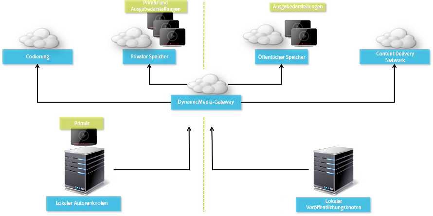

## Hybride Veröffentlichungsarchitektur für Bilder {#hybrid-publishing-architecture-for-images}

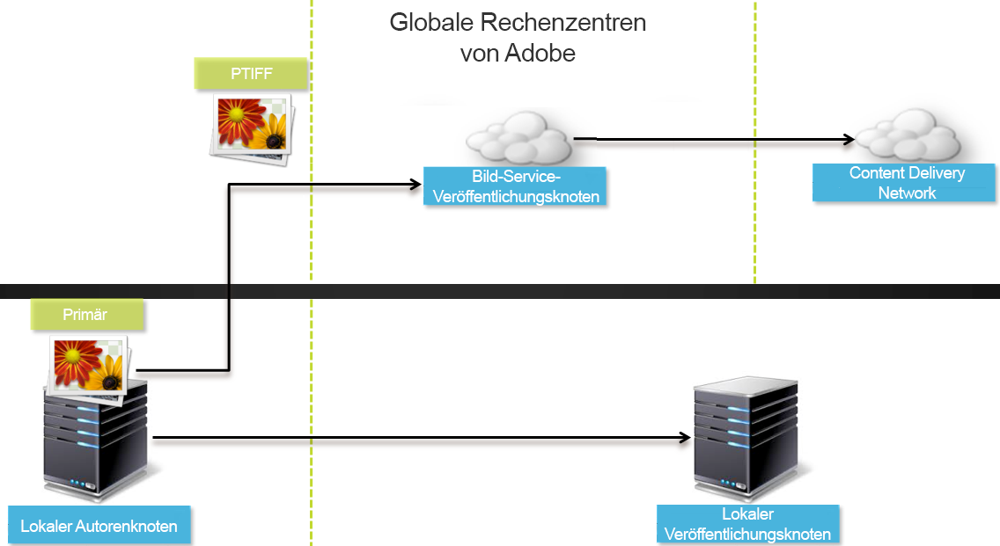

## Unterstützte Dynamic Media-Konfigurationen {#supported-dynamic-media-configurations}

In den folgenden Konfigurationsaufgaben werden die hier angegebenen Begriffe verwendet:

| **Begriff** | **Dynamic Media aktiviert** | **Beschreibung** |
|---|---|---|
| Autorenknoten des Experience Managers | Weißes Häkchen in einem grünen Kreis | Der Autorenknoten, den Sie unter &quot;On-Premise&quot;oder über Managed Services bereitstellen. |
| Veröffentlichungsknoten des Experience Managers | Weiß &quot;X&quot; in einem roten Quadrat. | Der Veröffentlichungsknoten, den Sie unter &quot;On-Premise&quot;oder über Managed Services bereitstellen. |
| Veröffentlichungsknoten des Bilddienstes | Weißes Häkchen in einem grünen Kreis. | Der Veröffentlichungs-Knoten, den Sie auf Data Center ausführen, die von der Adobe verwaltet werden. Bezieht sich auf die Bilddienst-URL. |

Sie können festlegen, dass Dynamic Media nur für Bildbearbeitung, nur für Videos oder für Bildbearbeitung und Video implementiert wird. Die Schritte zum Konfigurieren von Dynamic Media für Ihr spezifisches Szenario finden Sie in der folgenden Tabelle.

<table>
 <tbody>
  <tr>
   <td><strong>Szenario</strong></td>
   <td ><strong>Funktionsweise</strong></td>
   <td><strong>Konfigurationsschritte</strong></td>
  </tr>
  <tr>
   <td>NUR Bilder in Produktion bereitstellen</td>
   <td>Bilder werden über Server in den weltweiten Datenzentren von Adobe bereitgestellt und dann per CDN zwischengespeichert, um eine skalierbare Leistung und globale Reichweite zu erzielen.</td>
   <td>
    <ol>
     <li>Aktivieren Sie auf dem Experience Manager <strong>author</strong> die Option <a href="#enabling-dynamic-media">Dynamic Media</a>.</li>
     <li>Konfigurieren Sie die Bildbearbeitung unter <a href="#configuring-dynamic-media-cloud-services">Dynamic Media Cloud Services</a>.</li>
     <li><a href="#configuring-image-replication">Konfigurieren Sie die Bildreplikation</a>.</li>
     <li><a href="#replicating-catalog-settings">Replizieren Sie Katalogeinstellungen</a>.</li>
     <li><a href="#replicating-viewer-presets">Replizieren Sie Viewer-Vorgaben</a>.</li>
     <li><a href="#using-default-asset-filters-for-replication">Verwenden Sie Asset-Standardfilter für die Replikation</a>.</li>
     <li><a href="#configuring-dynamic-media-image-server-settings">Konfigurieren Sie Dynamic Media-Bildserver-Einstellungen</a>.</li>
     <li><a href="#delivering-assets">Stellen Sie Assets bereit</a>.</li>
    </ol> </td>
  </tr>
  <tr>
   <td>NUR Bilder in der Phase vor der Produktion bereitstellen (Entwicklung, QE, Bühne etc.)</td>
   <td>Die Bilder werden über den Veröffentlichungsknoten des Experience Managers bereitgestellt. Da der Traffic minimal ist, müssen keine Bilder an das Rechenzentrum der Adobe gesendet werden. Und es ermöglicht eine sichere Vorschau von Inhalten vor dem Start der Produktion.</td>
   <td>
    <ol>
     <li>Aktivieren Sie auf dem Experience Manager <strong>author</strong> die Option <a href="#enabling-dynamic-media">Dynamic Media</a>.</li>
     <li>Aktivieren Sie auf dem Experience Manager <strong>publish</strong>-Knoten <a href="#enabling-dynamic-media">Dynamic Media</a>.</li>
     <li><a href="#replicating-viewer-presets">Replizieren Sie Viewer-Vorgaben</a>.</li>
     <li>Richten Sie <a href="#setting-up-asset-filters-for-imaging-in-non-production-deployments">Asset-Filter für nicht für die Produktion bestimmte Bilder</a> ein.</li>
     <li><a href="#configuring-dynamic-media-image-server-settings">Konfigurieren Sie Dynamic Media-Bildserver-Einstellungen.</a></li>
     <li><a href="#delivering-assets">Stellen Sie Assets bereit.</a></li>
    </ol> </td>
  </tr>
  <tr>
   <td>NUR Videos in allen Umgebungen bereitstellen (Produktion, Entwicklung, QE, Bühne usw.)</td>
   <td>Videos werden vom CDN für skalierbare Leistung und eine globale Reichweite bereitgestellt und zwischengespeichert. Das Video-Standbild (Miniaturansicht des Videos, das vor dem Start der Wiedergabe angezeigt wird) wird von der Experience Manager-Veröffentlichungsinstanz bereitgestellt.</td>
   <td>
    <ol>
     <li>Aktivieren Sie auf dem Experience Manager <strong>author</strong> die Option <a href="#enabling-dynamic-media">Dynamic Media</a>.</li>
     <li>Aktivieren Sie auf dem Experience Manager <strong>publish</strong> den Knoten <a href="#enabling-dynamic-media">Dynamic Media</a> (die Veröffentlichungsinstanz gibt das Videopostbild aus und stellt Metadaten für die Videowiedergabe bereit).</li>
     <li>Konfigurieren Sie Videos unter <a href="#configuring-dynamic-media-cloud-services">Dynamic Media Cloud Services</a>.</li>
     <li><a href="#replicating-viewer-presets">Replizieren Sie Viewer-Vorgaben</a>.</li>
     <li>Richten Sie <a href="#setting-up-asset-filters-for-video-only-deployments">Asset-Filter für Videos</a> ein.</li>
     <li><a href="#delivering-assets">Stellen Sie Assets bereit.</a></li>
    </ol> </td>
  </tr>
  <tr>
   <td>Bilder UND Videos in Produktion bereitstellen</td>
   <td><p>Videos werden vom CDN für skalierbare Leistung und eine globale Reichweite bereitgestellt und zwischengespeichert. Bilder und Video-Posterbilder werden über Server in den weltweiten Datenzentren von Adobe bereitgestellt und dann per CDN zwischengespeichert, um eine skalierbare Leistung und globale Reichweite zu erzielen.</p> <p>In den vorherigen Abschnitten können Sie Bilder oder Videos in der Vorproduktion einrichten. </p> </td>
   <td>
    <ol>
     <li>Aktivieren Sie auf dem Experience Manager <strong>author</strong> die Option <a href="#enabling-dynamic-media">Dynamic Media</a>.</li>
     <li>Konfigurieren Sie Videos unter <a href="#configuring-dynamic-media-cloud-services">Dynamic Media Cloud Services</a>.</li>
     <li>Konfigurieren Sie die Bildbearbeitung unter <a href="#configuring-dynamic-media-cloud-services">Dynamic Media Cloud Services</a>.</li>
     <li><a href="#configuring-image-replication">Konfigurieren Sie die Bildreplikation</a>.</li>
     <li><a href="#replicating-catalog-settings">Replizieren Sie Katalogeinstellungen</a>.</li>
     <li><a href="#replicating-viewer-presets">Replizieren Sie Viewer-Vorgaben</a>.</li>
     <li><a href="#using-default-asset-filters-for-replication">Verwenden Sie Asset-Standardfilter für die Replikation.</a></li>
     <li><a href="#configuring-dynamic-media-image-server-settings">Konfigurieren Sie Dynamic Media-Bildserver-Einstellungen.</a></li>
     <li><a href="#delivering-assets">Stellen Sie Assets bereit.</a></li>
    </ol> </td>
  </tr>
 </tbody>
</table>

## Aktivieren von Dynamic Media {#enabling-dynamic-media}

[Dynamic Media ist standardmäßig deaktiviert. ](https://www.adobe.com/de/solutions/web-experience-management/dynamic-media.html) Um die Dynamic Media-Funktionen nutzen zu können, müssen Sie Dynamic Media mit dem Ausführungsmodus `dynamicmedia` aktivieren, wie Sie es z. B. im Ausführungsmodus `publish` tun würden. Prüfen Sie vor dem Aktivieren die [technischen Anforderungen](/help/sites-deploying/technical-requirements.md#requirements-for-aem-dynamic-media-add-on).

>[!NOTE]
>
>Durch die Aktivierung von Dynamic Media über den Ausführungsmodus wird die Funktionalität in Experience Manager 6.1 und Experience Manager 6.0 ersetzt, wo Sie Dynamic Media aktiviert haben, indem Sie das `dynamicMediaEnabled`-Flag auf **[!UICONTROL true setzen.]** Dieses Flag hat keine Funktionen in Experience Manager 6.2 und höher. Außerdem müssen Sie den Schnellstart nicht neu starten, um Dynamic Media zu aktivieren.

Durch Aktivierung von Dynamic Media sind die Dynamic Media-Funktionen in der Benutzeroberfläche verfügbar. Jedes hochgeladene Bild-Asset erhält eine Darstellung *cqdam.pyramid.tiff*, die für den schnellen Versand dynamischer Bilddarstellungen verwendet wird. Diese PTIFF haben erhebliche Vorteile wie die folgenden:

* Die Möglichkeit, nur ein einziges primäres Quellbild zu verwalten und ohne zusätzliche Datenspeicherung unbegrenzte Darstellungen zu erstellen.
* Die Möglichkeit, interaktive Visualisierungen wie Zoomen, Schwenken und Drehen zu verwenden.

Wenn Sie Dynamic Media Classic in Experience Manager verwenden möchten, aktivieren Sie Dynamic Media nur, wenn Sie ein [spezifisches Szenario](/help/sites-administering/scene7.md#aem-scene-integration-versus-dynamic-media) verwenden. Dynamic Media ist deaktiviert, es sei denn, Sie aktivieren Dynamic Media über den Ausführungsmodus.

Um Dynamic Media zu aktivieren, müssen Sie den Dynamic Media-Ausführungsmodus entweder über die Befehlszeile oder über den Namen der Schnellstartdatei aktivieren.

**So aktivieren Sie Dynamic Media**

1. In der Befehlszeile haben Sie nach dem Starten des Schnellstartvorgangs die folgenden Möglichkeiten:

   * hinzufügen `-r dynamicmedia` beim Starten der JAR-Datei an das Ende der Befehlszeile.

   ```shell
   java -Xmx4096m -Doak.queryLimitInMemory=500000 -Doak.queryLimitReads=500000 -jar cq-quickstart-6.5.0.jar -r dynamicmedia
   ```

   Wenn Sie auf s7 Versand veröffentlichen, müssen Sie außerdem die folgenden trustStore-Argumente einschließen:

   ```
   -Djavax.net.ssl.trustStore=<absoluteFilePath>/customerTrustStoreFileName>
   
    -Djavax.net.ssl.trustStorePassword=<passwordForTrustStoreFile>
   ```

1. Fordern Sie `https://localhost:4502/is/image` an und stellen Sie sicher, dass Image Server jetzt ausgeführt wird.

   >[!NOTE]
   >
   >Informationen zum Beheben von Problemen mit Dynamic Media finden Sie in den folgenden Protokollen im Ordner `crx-quickstart/logs/`:
   >
   >* ImageServer-&lt;PortId>-&lt;JJJJ>&lt;TT>.log - Das ImageServer-Protokoll enthält Statistiken und Analyseinformationen, die zur Analyse des Verhaltens des internen ImageServer-Prozesses verwendet werden.

   Beispiel für einen Namen einer Image-Server-Protokolldatei: `ImageServer-57346-2020-07-25.log`
   * s7access-&lt;yyyy>&lt;mm>&lt;dd>.log - Das s7access-Protokoll zeichnet jede Anforderung auf, die über `/is/image` und `/is/content` an Dynamic Media gesendet wurde.

   Diese Protokolle werden nur verwendet, wenn Dynamic Media aktiviert ist. Sie sind nicht im Paket **Download Full** enthalten, das von der `system/console/status-Bundlelist`-Seite generiert wird. Wenn Sie den Kundensupport anrufen, wenn ein Dynamic Media-Problem vorliegt, hängen Sie beide Protokolle an das Problem an.

### Wenn Sie Experience Manager an einem anderen Port oder Kontextpfad installiert haben ... {#if-you-installed-aem-to-a-different-port-or-context-path}

Wenn Sie [Experience Manager auf einem Anwendungsserver](/help/sites-deploying/application-server-install.md) bereitstellen und Dynamic Media aktiviert haben, müssen Sie die Domäne **self** im Externalisierer konfigurieren. Andernfalls funktioniert die Erstellung von Miniaturbildern für Assets nicht ordnungsgemäß für Dynamic Media-Assets.

Falls Sie den Schnellstart für einen anderen Port oder Kontextpfad ausführen, müssen Sie die Domäne **self** ebenfalls ändern.

Wenn Dynamic Media aktiviert ist, werden die statischen Miniaturansicht-Wiedergabeformate für Bild-Assets mit Dynamic Media generiert. Damit die Erstellung von Miniaturbildern für Dynamic Media ordnungsgemäß funktioniert, muss Experience Manager eine URL-Anforderung an sich selbst ausführen und sowohl die Anschlussnummer als auch den Kontextpfad kennen.

Im Experience Manager:

* Die Domäne **self** im [Externalizer](/help/sites-developing/externalizer.md) wird verwendet, um sowohl die Portnummer als auch den Kontextpfad abzurufen.
* Wenn keine **self**-Domäne konfiguriert ist, werden die Anschlussnummer und der Kontextpfad vom Jetty-HTTP-Dienst abgerufen.

In einer QuickStart-WAR-Bereitstellung können die Anschlussnummer und der Kontextpfad nicht abgeleitet werden. Daher müssen Sie eine **self**-Domäne konfigurieren. Weitere Informationen zur Konfiguration der Domäne **self** finden Sie in der [Externalizer-Dokumentation](/help/sites-developing/externalizer.md).

>[!NOTE]
Bei einer eigenständigen Bereitstellung [Experience Manager-Schnellstart-Bereitstellung](/help/sites-deploying/deploy.md) muss eine **self**-Domäne im Allgemeinen nicht konfiguriert werden, da die Anschlussnummer und der Kontextpfad automatisch konfiguriert werden können. Wenn jedoch alle Netzwerkschnittstellen deaktiviert sind, müssen Sie die Domäne **self** konfigurieren.

## Deaktivieren von Dynamic Media  {#disabling-dynamic-media}

Dynamic Media ist nicht standardmäßig aktiviert. Wenn Sie Dynamic Media zuvor aktiviert haben, können Sie es später deaktivieren.

Um Dynamic Media nach der Aktivierung zu deaktivieren, entfernen Sie das Flag `-r dynamicmedia` für den Ausführungsmodus.

**Gehen Sie wie folgt vor, um Dynamic Media nach der Aktivierung zu deaktivieren**

1. In der Befehlszeile haben Sie nach dem Starten des Schnellstartvorgangs die beiden folgenden Möglichkeiten:

   * Fügen Sie `-r dynamicmedia` beim Starten der JAR-Datei nicht zur Befehlszeile hinzu.

   ```shell
   java -Xmx4096m -Doak.queryLimitInMemory=500000 -Doak.queryLimitReads=500000 -jar cq-quickstart-6.5.0.jar
   ```

1. Anfrage `https://localhost:4502/is/image`. Sie erhalten eine Nachricht, dass Dynamic Media deaktiviert wurde.

   >[!NOTE]
   Nachdem der Dynamic Media-Ausführungsmodus deaktiviert wurde, wird der Workflow-Schritt, der die Darstellung `cqdam.pyramid.tiff` generiert, automatisch übersprungen. Außerdem werden die Unterstützung für dynamische Darstellungen und andere Dynamic Media-Funktionen deaktiviert.
   Beachten Sie außerdem, dass alle Assets, die im Rahmen dieses Ausführungsmodus hochgeladen wurden, ungültig sind, wenn der Dynamic Media-Ausführungsmodus nach der Konfiguration des Experience Manager-Servers deaktiviert ist.

## (Optional) Migration von Dynamic Media-Vorgaben und -Konfigurationen von 6.3 zu 6.5 ohne Ausfallzeit {#optional-migrating-dynamic-media-presets-and-configurations-from-to-zero-downtime}

Wenn Sie Experience Manager Dynamic Media von 6.3 auf 6.5 aktualisieren (was jetzt die Möglichkeit zur Bereitstellung ohne Ausfallzeiten umfasst), müssen Sie den folgenden Befehl &quot;curl&quot;ausführen. Der Befehl migriert alle Ihre Vorgaben und Konfigurationen von `/etc` zu `/conf` in der CRXDE Lite.

>[!NOTE]
Wenn Sie Ihre Experience Manager-Instanz im Kompatibilitätsmodus ausführen, d. h. das Kompatibilitätspaket installiert ist, müssen Sie diese Befehle nicht ausführen.

Für alle Upgrades mit oder ohne Kompatibilitätspaket können Sie die standardmäßigen, sofort einsetzbaren Viewer-Vorgaben kopieren, die ursprünglich mit Dynamic Media geliefert wurden, indem Sie den folgenden Linux®-Befehl &quot;curl&quot;ausführen:

`curl -u admin:admin -X POST https://<server_address>:<server_port>/libs/settings/dam/dm/presets/viewer.pushviewerpresets.json`

Um benutzerdefinierte Viewer-Vorgaben und Konfigurationen zu migrieren, die Sie von `/etc` zu `/conf` erstellt haben, führen Sie den folgenden Linux®-Befehl &quot;curl&quot;aus:

`curl -u admin:admin -X POST https://<server_address>:<server_port>/libs/settings/dam/dm/presets.migratedmcontent.json`

## Konfigurieren der Bildreplikation {#configuring-image-replication}

Dynamic Media image Versand veröffentlicht Bild-Assets, einschließlich Videominiaturen, vom Experience Manager-Authoring bis zum On-Demand-Replizierungsdienst (Replikationsdienst-URL) der Adobe. Assets werden dann über den On-Demand-Image-Versand-Dienst (die Image-Dienst-URL) bereitgestellt.

Gehen Sie folgendermaßen vor:

1. [Richten Sie die Authentifizierung](#setting-up-authentication) ein.
1. [Konfigurieren Sie den Replizierungsagenten](#configuring-the-replication-agent).

Der Replizierungsagenten veröffentlicht Dynamic Media-Assets wie Bilder, Videometadaten und setzt auf den Image-Dienst, der auf der Adobe gehostet wird. Der Replikationsagent ist nicht standardmäßig aktiviert.

Nachdem Sie den Replizierungsagenten konfiguriert haben, müssen Sie [überprüfen und testen, ob er erfolgreich eingerichtet wurde](#validating-the-replication-agent-for-dynamic-media). In diesem Abschnitt wird die Vorgehensweise beschrieben.

>[!NOTE]
Die standardmäßige Speicherbegrenzung für die PTIFF-Erstellung beträgt für alle Workflows 3 GB. Beispielsweise können Sie ein Bild verarbeiten, für das 3 GB Speicher erforderlich sind, während andere Workflows angehalten werden, oder Sie können zehn Bilder parallel verarbeiten, die jeweils 300 MB Speicher erfordern.
Die Speicherbegrenzung ist konfigurierbar und passt zur Verfügbarkeit der Systemressourcen und zum Typ des zu verarbeitenden Bildinhalts. Wenn Sie viele große Assets haben und genügend Speicher im System haben, können Sie diese Beschränkung erhöhen, um sicherzustellen, dass die Bilder parallel verarbeitet werden.
Ein Bild, für das mehr als die maximale Speicherkapazität erforderlich ist, wird abgelehnt.
Navigieren Sie zum Ändern der Speicherbegrenzung für die PTIFF-Erstellung zu **[!UICONTROL Tools > Vorgänge > Web-Konsole > Adobe CQ Scene7 PTiffManager]** und ändern Sie den Wert **[!UICONTROL maxMemory]**.

### Einrichten der Authentifizierung {#setting-up-authentication}

Richten Sie die Replizierungsauthentifizierung beim Authoring ein, damit Sie Bilder mit dem Dynamic Media Image Versand-Dienst replizieren können. Sie erhalten zunächst einen KeyStore und speichern ihn dann unter dem **[!UICONTROL dynamic-media-Replication]**-Benutzer und konfigurieren ihn. Der Administrator der Firma hat während der Bereitstellung eine Begrüßungs-E-Mail mit der KeyStore-Datei und den erforderlichen Anmeldeinformationen erhalten. Wenn Sie diese Informationen nicht erhalten haben, wenden Sie sich an den Kundendienst der Adobe.

**Gehen Sie wie folgt vor, um die Authentifizierung einzurichten**

1. Wenden Sie sich an den Kundendienst der Adobe, wenn Sie noch nicht über die Datei und das Kennwort verfügen. Diese Informationen sind ein notwendiger Teil der Bereitstellung. Die Schlüssel werden Ihrem Konto zugeordnet.
1. Tippen Sie in Experience Manager auf das Logo des Experience Managers, um auf die globale Navigationskonsole zuzugreifen, und dann auf **[!UICONTROL Tools > Security > Users.]**
1. Navigieren Sie auf der Seite &quot;User Management&quot;zum Benutzer **[!UICONTROL dynamic-media-Replication]** und tippen Sie dann auf , um zu öffnen.

   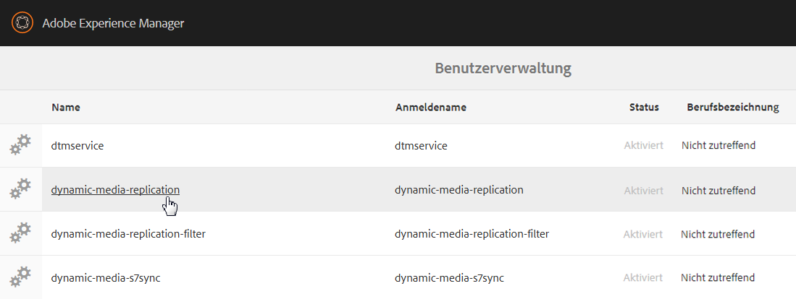

1. Tippen Sie auf der Seite „Benutzereinstellungen für dynamic-media-replication bearbeiten“ auf die Registerkarte **[!UICONTROL Keystore]** und dann auf **[!UICONTROL KeyStore erstellen.]**

   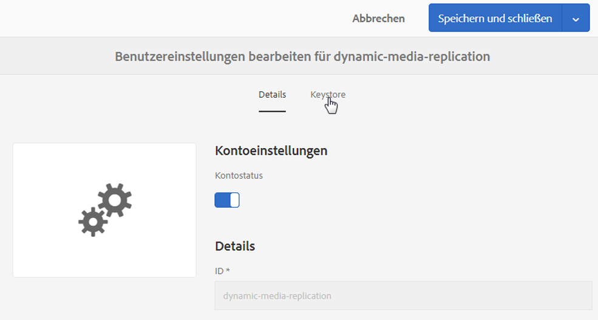

1. Geben Sie im Dialogfeld **[!UICONTROL Zugangskennwort für KeyStore festlegen]** ein Kennwort ein und bestätigen Sie es.

   >[!NOTE]
   Denken Sie daran, dass Sie das Kennwort erneut eingeben müssen, wenn Sie den Replizierungsagenten später konfigurieren.

   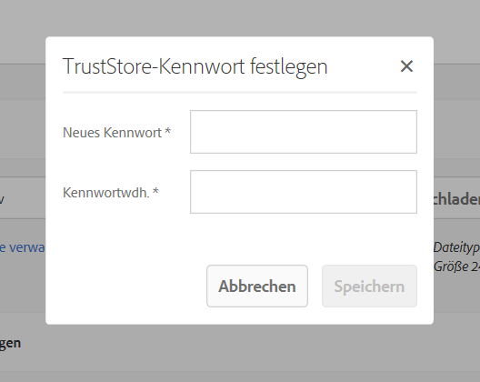

1. Erweitern Sie auf der Seite **[!UICONTROL Benutzereinstellungen für dynamic-media-replication bearbeiten]** den Bereich **Privaten Schlüssel aus KeyStore-Datei hinzufügen** und fügen Sie Folgendes ein (siehe folgende Abbildungen):

   * Geben Sie im Feld **[!UICONTROL Neuer Alias]** den Namen eines Alias ein, den Sie später in der Replizierungskonfiguration verwenden möchten. Sie können beispielsweise `replication` als Alias verwenden.
   * Tippen Sie auf **[!UICONTROL KeyStore-Datei.]** Navigieren Sie zur KeyStore-Datei, die Sie von Adobe, wählen Sie sie aus und tippen Sie auf **[!UICONTROL Öffnen.]**
   * Geben Sie im Feld **[!UICONTROL KeyStore-Dateikennwort]** das KeyStore-Dateikennwort ein. Dieses Kennwort ist **nicht** das KeyStore-Kennwort, das Sie in Schritt 5 erstellt haben. Es handelt sich jedoch um die KeyStore-Adobe, die in der Begrüßungs-E-Mail angegeben ist, die Sie während der Bereitstellung erhalten haben. Wenden Sie sich an die Kundenunterstützung von Adobe, um Ihre KeyStore-Datei und das dazugehörige Kennwort zu erhalten (falls noch nicht vorhanden).
   * Geben Sie im Feld **[!UICONTROL Kennwort für privaten Schlüssel]** das Kennwort für den privaten Schlüssel ein (kann das Kennwort für den privaten Schlüssel sein, das im vorherigen Schritt angegeben wurde). Das Kennwort für den privaten Schlüssel ist in der Begrüßungs-E-Mail von Adobe enthalten, die während der Bereitstellung an Sie gesendet wird. Nehmen Sie Kontakt mit der Kundenunterstützung von Adobe auf, falls Sie kein Kennwort für den privaten Schlüssel erhalten haben.
   * Geben Sie im Feld **[!UICONTROL Alias für privaten Schlüssel]** den Alias für den privaten Schlüssel ein. Beispiel: `*companyname*-alias`. Der Alias für den privaten Schlüssel ist in der Begrüßungs-E-Mail von Adobe enthalten, die während der Bereitstellung an Sie gesendet wird. Nehmen Sie Kontakt mit der Kundenunterstützung von Adobe auf, falls Sie keinen Alias für den privaten Schlüssel erhalten haben.

   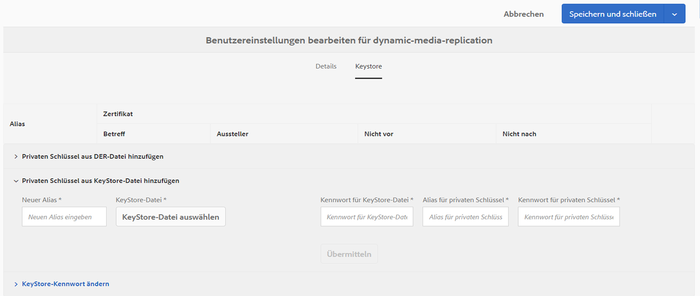

1. Tippen Sie auf **[!UICONTROL Speichern und schließen]**, um Ihre Änderungen für diesen Benutzer zu speichern.

   Als Nächstes müssen Sie [den Replizierungsagenten konfigurieren.](#configuring-the-replication-agent)

### Konfigurieren des Replikationsagenten {#configuring-the-replication-agent}

1. Tippen Sie in Experience Manager auf das Logo des Experience Managers, um auf die globale Navigationskonsole zuzugreifen, und dann auf **[!UICONTROL Tools > Bereitstellung > Replikation > Agenten im Autor.]**
1. Tippen Sie auf der Seite „Agenten für Autor“ auf **[!UICONTROL Hybride Bildreplikation für dynamische Medien (s7delivery).]**
1. Tippen Sie auf **[!UICONTROL Bearbeiten.]**
1. Tippen Sie auf die Registerkarte **[!UICONTROL Einstellungen]** und geben Sie dann Folgendes ein:

   * **[!UICONTROL Aktiviert]**: Aktivieren Sie dieses Kontrollkästchen, um den Replikationsagenten zu aktivieren.
   * **[!UICONTROL Region]** : Auf die entsprechende Region eingestellt: Nordamerika, Europa oder Asien
   * **[!UICONTROL Mandant-ID]** : Dieser Wert ist der Name Ihrer Firma/des Mandanten, die/der im Replizierungsdienst veröffentlicht wird. Dieser Wert ist die Tenant-ID, die Adobe in der Begrüßungs-E-Mail bereitstellt, die Ihnen während der Bereitstellung gesendet wird. Wenn Sie diese Informationen nicht erhalten haben, wenden Sie sich an den Kundendienst der Adobe.
   * **[!UICONTROL Key Store-Alias]** : Dieser Wert ist identisch mit dem** New Alias**-Wert, der beim Generieren des Schlüssels unter  [Einrichten der Authentifizierung](#setting-up-authentication) festgelegt wurde. zum Beispiel  `replication`. (Siehe Schritt 7 unter [Einrichten der Authentifizierung](#setting-up-authentication).)
   * **[!UICONTROL Key Store Password]**  - Das KeyStore-Kennwort, das erstellt wurde, wenn Sie auf KeyStore  **[!UICONTROL erstellen tippten.]** Dieses Kennwort wird nicht von Adobe bereitgestellt. Siehe Schritt 5 von [Einrichten der Authentifizierung](#setting-up-authentication).

   In der folgenden Abbildung ist der Replikationsagent mit Beispieldaten dargestellt:

   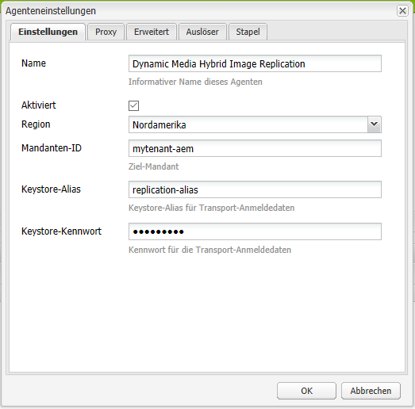

1. Tippen Sie auf **[!UICONTROL OK]**.

### Validieren des Replikationsagenten für Dynamic Media {#validating-the-replication-agent-for-dynamic-media}

Gehen Sie wie folgt vor, um den Replizierungsagenten für Dynamic Media zu validieren:

Tippen Sie auf **[!UICONTROL Verbindung testen.]** Die Beispielausgabe lautet wie folgt:

```shell
11.03.2016 10:57:55 - Transferring content for ReplicationAction{type=TEST, path[0]='/content/dam', time=1457722675402, userId='admin', revision='null'}
11.03.2016 10:57:55 - * Auth User: replication-receiver
11.03.2016 10:57:55 - * HTTP Version: 1.1
11.03.2016 10:57:55 - * Using OAuth 2.0 Authorization Grants
11.03.2016 10:57:55 - * OAuth 2.0 User: dynamic-media-replication
11.03.2016 10:57:55 - * OAuth 2.0 Token: '*****' initialized
11.03.2016 10:57:55 - Publishing: POST[https://replicate-na.assetsadobe.com:8580/is-publish/publish-receiver?Cmd=Test&RootId=xfpuu-6613]
11.03.2016 10:57:55 - Publish response: OK[]
11.03.2016 10:57:55 - Transfer succeeded in 141 ms for ReplicationAction{type=TEST, path[0]='/content/dam', time=1457722675402, userId='admin', revision='null'}
-------------------------------------------------------------------------------------------------------------------------------
Replication test succeeded
```

>[!NOTE]
Sie können die Überprüfung auch durchführen, indem Sie einen der folgenden Schritte ausführen:
* Überprüfen Sie die Replizierungsprotokolle, um sicherzustellen, dass das Asset repliziert wird.
* Veröffentlichen Sie ein Bild. Tippen Sie auf das Bild und wählen Sie im Dropdown-Menü **[!UICONTROL Viewer]** und dann eine Viewer-Vorgabe aus. Klicken Sie auf **[!UICONTROL URL]**. Um sicherzustellen, dass das Bild angezeigt wird, kopieren Sie den URL-Pfad und fügen Sie ihn in den Browser ein.


### Durchführen der Fehlerbehebung für die Authentifizierung {#troubleshooting-authentication}

Beim Einrichten der Authentifizierung gibt es einige Probleme, mit denen Sie mit ihren Lösungen arbeiten können. Bevor Sie auf diese Probleme prüfen, stellen Sie sicher, dass Sie Replizierung eingerichtet haben.

#### Problem: HTTP-Statuscode 401 mit der Meldung „Authorization Required“ (Autorisierung erforderlich){#problem-http-status-code-with-message-authorization-required}

Dieses Problem kann auftreten, wenn der KeyStore für den Benutzer `dynamic-media-replication` nicht eingerichtet wurde.

```shell
Replication test to s7delivery:https://s7bern.macromedia.com:8580/is-publish/
17.06.2016 18:54:43 - Transferring content for ReplicationAction{type=TEST, path[0]='/content/dam', time=1466214883309, userId='admin', revision='null'}
17.06.2016 18:54:43 - * Auth User: replication-receiver
17.06.2016 18:54:43 - * HTTP Version: 1.1
17.06.2016 18:54:43 - * Using OAuth 2.0 Authorization Grants
17.06.2016 18:54:43 - * OAuth 2.0 User: dynamic-media-replication
17.06.2016 18:54:43 - No OAuth token available. OAuth not initialized
17.06.2016 18:54:43 - * Using Client Auth SSL alias - replication-alias *
17.06.2016 18:54:43 - Publishing: POST[https://<localhost>:8580/is-publish//publish-receiver?Cmd=Test&RootId=brough]
17.06.2016 18:54:43 - Transfer failed for ReplicationAction{type=TEST, path[0]='/content/dam', time=1466214883309, userId='admin', revision='null'}. java.io.IOException: Failed to execute request
'https://<localhost>:8580/is-publish//publish-receiver?Cmd=Test&RootId=brough':
 Server returned status code 401 with message: Authorization required.
17.06.2016 18:54:43 - Error while replicating: com.day.cq.replication.ReplicationException: Transfer failed for ReplicationAction{type=TEST, path[0]='/content/dam', time=1466214883309,
 userId='admin', revision='null'}. java.io.IOException: Failed to execute request
'https://<localhost>:8580/is-publish//publish-receiver?Cmd=Test&RootId=brough':
 Server returned status code 401 with message: Authorization required.
```

**Lösung**: Vergewissern Sie sich, dass das  `KeyStore` unter  **dynamic-media-replicationuser gespeichert und mit dem richtigen Kennwort** versehen wurde.

#### Problem: Schlüssel kann nicht entschlüsselt werden – Daten können nicht entschlüsselt werden {#problem-could-not-decrypt-key-could-not-decrypt-data}

```xml
Replication test to s7delivery:https://<localhost>:8580/is-publish/
17.06.2016 19:00:16 - Transferring content for ReplicationAction{type=TEST, path[0]='/content/dam', time=1466215216662, userId='admin', revision='null'}
17.06.2016 19:00:16 - * Auth User: replication-receiver
17.06.2016 19:00:16 - * HTTP Version: 1.1
17.06.2016 19:00:16 - * Using OAuth 2.0 Authorization Grants
17.06.2016 19:00:16 - * OAuth 2.0 User: dynamic-media-replication
17.06.2016 19:00:16 - No OAuth token available. OAuth not initialized
17.06.2016 19:00:16 - * Using Client Auth SSL alias - replication-alias *
17.06.2016 19:00:16 - Transfer failed for ReplicationAction{type=TEST, path[0]='/content/dam', time=1466215216662, userId='admin', revision='null'}. java.lang.SecurityException: java.security.UnrecoverableKeyException: Could not decrypt key: Could not decrypt data.
```

**Lösung**: Überprüfen Sie das Kennwort. Das im Replikationsagenten gespeicherte Kennwort entspricht nicht dem Kennwort, das zum Erstellen des KeyStore verwendet wurde.

#### Problem: InvalidAlgorithmParameterException {#problem-invalidalgorithmparameterexception}

Dieses Problem wird durch einen Konfigurationsfehler in Ihrer Experience Manager-Autoreninstanz verursacht. Der Java™-Prozess auf dem Autor erhält nicht die korrekte `javax.net.ssl.trustStore`. Dieser Fehler ist im Replikationsprotokoll enthalten:

```shell
14.04.2016 09:37:43 - Transfer failed for ReplicationAction{type=TEST, path[0]='/content/dam', time=1460651862089, userId='admin', revision='null'}. java.io.IOException: Failed to execute request 'https://<localhost>:8580/is-publish/publish-receiver?Cmd=Test&RootId=rbrough-osx2': java.lang.RuntimeException: Unexpected error: java.security.InvalidAlgorithmParameterException: the trustAnchors parameter must be non-empty
14.04.2016 09:37:43 - Error while replicating: com.day.cq.replication.ReplicationException: Transfer failed for ReplicationAction{type=TEST, path[0]='/content/dam', time=1460651862089, userId='admin', revision='null'}. java.io.IOException: Failed to execute request 'https://<localhost>:8580/is-publish/publish-receiver?Cmd=Test&RootId=rbrough-osx2': java.lang.RuntimeException: Unexpected error: java.security.InvalidAlgorithmParameterException: the trustAnchors parameter must be non-empty
```

Oder im Fehlerprotokoll:

```shell
07.25.2019 12:00:59.893 *ERROR* [sling-threadpool-db2763bb-bc50-4bb5-bb64-10a09f432712-(apache-sling-job-thread-pool)-90-com_day_cq_replication_job_s7delivery(com/day/cq/replication/job/s7delivery)] com.day.cq.replication.Agent.s7delivery.queue Error during processing of replication.

java.io.IOException: Failed to execute request 'https://replicate-na.assetsadobe.com:8580/is-publish/publish-receiver?Cmd=Test&RootId=rbrough-osx': java.lang.RuntimeException: Unexpected error: java.security.InvalidAlgorithmParameterException: the trustAnchors parameter must be non-empty
        at com.scene7.is.catalog.service.publish.atomic.PublishingServiceHttp.executePost(PublishingServiceHttp.scala:195)
```

**Lösung**: Vergewissern Sie sich, dass die Systemeigenschaft für den Java™-Prozess im Experience Manager-Autor auf einen gültigen TrustStore  `-Djavax.net.ssl.trustStore=` eingestellt ist.

#### Problem: KeyStore ist entweder nicht eingerichtet oder nicht initialisiert {#problem-keystore-is-either-not-set-up-or-it-is-not-initialized}

Dieses Problem wird wahrscheinlich durch einen Hotfix oder ein Feature Pack verursacht, das den Knoten &quot;dynamic-media-user&quot;oder &quot;keystore&quot;überschreibt.

Beispiel für Replikationsprotokoll:

```shell
Replication test to s7delivery:https://replicate-na.assetsadobe.com/is-publish
02.08.2016 14:37:44 - Transferring content for ReplicationAction{type=TEST, path[0]='/content/dam', time=1470173864834, userId='admin', revision='null'}
02.08.2016 14:37:44 - * Auth User: replication-receiver
02.08.2016 14:37:44 - * HTTP Version: 1.1
02.08.2016 14:37:44 - * Using OAuth 2.0 Authorization Grants
02.08.2016 14:37:44 - * OAuth 2.0 User: dynamic-media-replication
02.08.2016 14:37:44 - Transfer failed for ReplicationAction{type=TEST, path[0]='/content/dam', time=1470173864834, userId='admin', revision='null'}. com.adobe.granite.keystore.KeyStoreNotInitialisedException: Uninitialised key store for user dynamic-media-replication
```

**Lösung**:

1. Navigieren Sie zur Seite &quot;Benutzerverwaltung&quot;:
   `localhost:4502/libs/granite/security/content/useradmin.html`
1. Navigieren Sie auf der Seite &quot;Benutzerverwaltung&quot;zum Benutzer `dynamic-media-replication` und tippen Sie dann auf , um ihn zu öffnen.
1. Klicken Sie auf die Registerkarte **[!UICONTROL KeyStore]**. Wenn die Schaltfläche **[!UICONTROL KeyStore erstellen]** angezeigt wird, müssen Sie die Schritte unter [Einrichten der Authentifizierung](#setting-up-authentication) wiederholen.
1. Wenn Sie das KeyStore-Setup erneut durchführen mussten, müssen Sie [Replizierungsagenten](/help/assets/config-dynamic.md#configuring-the-replication-agent) ebenfalls erneut konfigurieren.

   Konfigurieren Sie den s7delivery-Replikationsagenten neu.
   `localhost:4502/etc/replication/agents.author/s7delivery.html`

1. Tippen Sie auf **[!UICONTROL Verbindung testen]**, um zu überprüfen, ob die Konfiguration gültig ist.

#### Problem: Für den Veröffentlichungsagenten wird SSL anstelle von OAuth verwendet {#problem-publish-agent-is-using-ssl-instead-of-oauth}

Dieses Problem wird wahrscheinlich durch einen Hotfix oder ein Feature Pack verursacht, das die Einstellungen nicht ordnungsgemäß installiert oder überschrieben hat.

Beispiel für Replikationsprotokoll:

```shell
01.08.2016 18:42:59 - Transferring content for ReplicationAction{type=TEST, path[0]='/content/dam', time=1470073379634, userId='admin', revision='null'}
01.08.2016 18:42:59 - * Auth User: replication-receiver
01.08.2016 18:42:59 - * HTTP Version: 1.1
01.08.2016 18:42:59 - * Using Client Auth SSL alias - replication-receiver *
01.08.2016 18:42:59 - Publishing: POST[https://replicate-eu.assetsadobe2.com:443/is-publish/publish-receiver?Cmd=Test&RootId=altayerstaging]
01.08.2016 18:42:59 - Transfer failed for ReplicationAction{type=TEST, path[0]='/content/dam', time=1470073379634, userId='admin', revision='null'}. java.io.IOException: Failed to execute request 'https://replicate-eu.assetsadobe2.com:443/is-publish/publish-receiver?Cmd=Test&RootId=rbroughstaging': Server returned status code 401 with message: Authorization required.
01.08.2016 18:42:59 - Error while replicating: com.day.cq.replication.ReplicationException: Transfer failed for ReplicationAction{type=TEST, path[0]='/content/dam', time=1470073379634, userId='admin', revision='null'}. java.io.IOException: Failed to execute request 'https://replicate-eu.assetsadobe2.com:443/is-publish/publish-receiver?Cmd=Test&RootId=rbroughstaging': Server returned status code 401 with message: Authorization required.
```

**Lösung:**

1. Klicken Sie in Experience Manager auf **[!UICONTROL Tools > Allgemein > CRXDE Lite.]**

   `localhost:4502/crx/de/index.jsp`

1. Navigieren Sie zum s7delivery-Replikationsagenten-Knoten.
   `localhost:4502/crx/de/index.jsp#/etc/replication/agents.author/s7delivery/jcr:content`

1. Fügen Sie diese Einstellung dem Replikationsagenten hinzu (boolescher Wert mit der Einstellung **[!UICONTROL True]**):

   `enableOauth=true`

1. Tippen Sie in der oberen linken Ecke der Seite auf **[!UICONTROL Alle speichern.]**

### Testen Ihrer Konfiguration {#testing-your-configuration}

Adobe empfiehlt, für die Konfiguration einen umfassenden Test durchzuführen.

Vergewissern Sie sich, dass Sie vor Beginn dieses Tests bereits die folgenden Schritte durchgeführt haben:

* Hinzufügen von Bildvorgaben.
* Abschließen der **[!UICONTROL Dynamic Media-Konfiguration (vor 6.3)]** unter „Cloud-Services“. Die Bilddienst-URL ist für diesen Test nicht erforderlich.

**Gehen Sie wie folgt vor, um die Konfiguration zu testen**

1. Laden Sie ein Bild-Asset hoch. (Tippen Sie in Assets auf **[!UICONTROL Erstellen > Dateien]** und wählen Sie die Datei aus.)
1. Warten Sie, bis der Workflow abgeschlossen ist.
1. Veröffentlichen Sie das Bild-Asset. (Wählen Sie das Asset aus und tippen Sie auf **[!UICONTROL Quick Publish.]**)
1. Navigieren Sie zu den Darstellungen für dieses Bild, indem Sie das Bild öffnen und auf **[!UICONTROL Darstellungen tippen.]**

   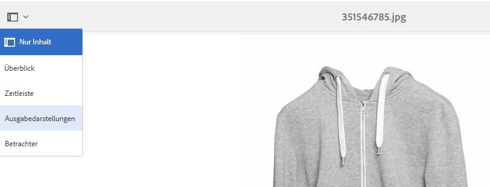

1. Wählen Sie eine beliebige dynamische Wiedergabe aus.
1. Um die URL für dieses Asset abzurufen, klicken Sie auf **[!UICONTROL URL]**.
1. Navigieren Sie zur ausgewählten URL und überprüfen Sie, ob sich das Bild wie erwartet verhält.

Eine andere Möglichkeit zum Testen der Bereitstellung Ihrer Assets besteht darin, „req=exists“ an die URL anzufügen.

## Konfigurieren von Dynamic Media Cloud Services  {#configuring-dynamic-media-cloud-services}

Der Dynamic Media-Cloud Service unterstützt u. a. das hybride Veröffentlichen und Versand von Bildern und Videos, Videoanalysen und Videokodierung.

Im Rahmen der Konfiguration müssen Sie eine Registrierungs-ID, eine Video-Service-URL, eine Image-Service-URL, eine Replizierungsdienst-URL und eine Authentifizierung einrichten. Diese Informationen wurden Ihnen im Rahmen des Kontobereitstellungsprozesses per E-Mail zugesendet. Wenn Sie diese Informationen nicht erhalten haben, wenden Sie sich an Ihren Adobe Experience Manager-Administrator oder die Adobe Kundendienst, um die Informationen zu erhalten.

>[!NOTE]
Bevor Sie Dynamic Media-Cloud Services einrichten, stellen Sie sicher, dass Ihre Veröffentlichungsinstanz eingerichtet ist. Vor der Konfiguration von Dynamic Media-Cloud Services müssen Sie außerdem über eine Replizierung verfügen.

So konfigurieren Sie Dynamic Media-Cloud Services:

1. Tippen Sie in Experience Manager auf das Logo des Experience Managers, um auf die globale Navigationskonsole zuzugreifen, und tippen Sie auf **[!UICONTROL Tools > Cloud Services > Dynamic Media-Konfiguration (Pre-6.3).]**
1. Wählen Sie auf der Seite &quot;Dynamic Media Configuration Browser&quot;im linken Bereich **[!UICONTROL global]** und tippen Sie dann auf **[!UICONTROL Erstellen.]**
1. Geben Sie im Dialogfeld **[!UICONTROL Dynamic Media-Konfiguration erstellen]** im Feld „Titel“ einen Titel ein.
1. Wenn Sie Dynamic Media für Video konfigurieren,

   * Geben Sie im Feld **[!UICONTROL Registrierungs-ID]** Ihre Registrierungs-ID ein.
   * Geben Sie im Feld **[!UICONTROL Videodienst-URL]** die Videodienst-URL für das Dynamic Media Gateway ein.

1. Geben Sie beim Konfigurieren von Dynamic Media für die Bilddarstellung im Dialogfeld **[!UICONTROL Bilddienst-URL]** die Bilddienst-URL für das Dynamic Media Gateway ein.
1. Tippen Sie auf **[!UICONTROL Speichern]**, um zum Browser für die Dynamic Media-Konfiguration zurückzukehren.
1. Um auf die globale Navigationskonsole zuzugreifen, tippen Sie auf das Logo des Experience Managers.

## Konfigurieren von Videoberichten {#configuring-video-reporting}

Mit Dynamic Media Hybrid können Sie Video-Berichte über mehrere Installationen von Experience Manager hinweg konfigurieren.

**Verwendung:** Beim Konfigurieren der Dynamic Media-Konfiguration (vor 6.3) werden Funktionen gestartet, darunter auch Videoberichte. Die Konfiguration erstellt eine Report Suite in einem regionalen Analytics-Unternehmen Wenn Sie mehrere Autorknoten konfigurieren, erstellen Sie für jeden davon eine separate Report Suite. Das führt zu inkonsistenten Berichtsdaten in den einzelnen Installationen. Wenn jeder Autorknoten auf denselben Hybrid-Veröffentlichungsserver verweist, ändert die letzte Autorinstallation die Ziel-Report Suite für alle Videoberichte. Dieses Problem führt zur Überlastung des Analysesystems mit zu vielen Report Suites.

**Erste Schritte:** Konfigurieren Sie Videoberichte, indem Sie die folgenden drei Schritte ausführen.

1. Erstellen Sie nach dem Konfigurieren der Dynamic Media-Konfiguration (vor 6.3) ein Vorgabenpaket für die Videoanalyse auf dem ersten Autorknoten. Diese Aufgabe ist wichtig, da sie einer neuen Konfiguration die weitere Verwendung derselben Report Suite ermöglicht.
1. Installieren Sie das Vorgabenpaket für die Videoanalyse auf ***neuen*** Autorknoten, ***bevor*** Sie die Dynamic Media-Konfiguration (vor 6.3) konfigurieren.
1. Überprüfen und debuggen Sie die Paketinstallation.

### Erstellen eines Vorgabenpakets für die Videoanalyse nach der Konfiguration des ersten Autorknotens {#creating-a-video-analytics-preset-package-after-configuring-the-first-author-node}

Wenn Sie diese Aufgabe abgeschlossen haben, verfügen Sie über eine Paketdatei, die die Video Analytics-Vorgaben enthält. Diese Vorgaben enthalten eine Report Suite, den Tracking-Server, den Tracking-Namespace und die Marketing Cloud-Organisations-ID (falls verfügbar).

1. Konfigurieren Sie – falls noch nicht geschehen – die Dynamic Media-Konfiguration (vor 6.3).
1. (Optional) Zeigen Sie die Report Suite-ID an und kopieren Sie diese (Sie benötigen Zugriff auf das JCR). Eine Report Suite-ID ist nicht erforderlich vereinfacht jedoch die Überprüfung.
1. Erstellen Sie ein Paket mit Package Manager.
1. Bearbeiten Sie das Paket, sodass es einen Filter enthält.

   Im Experience Manager: `/conf/global/settings/dam/dm/presets/analytics/jcr:content/userdata`

1. Erstellen Sie das Paket.
1. Laden Sie das Vorgabenpaket für die Videoanalyse herunter oder geben Sie es zum Teilen mit künftigen Autorknoten frei.

### Installieren des Vorgabepakets für Video Analytics, bevor Sie weitere Autorenknoten {#installing-the-video-analytics-preset-package-before-you-configure-additional-author-nodes} konfigurieren

Schließen Sie diese Aufgabe ab, ***bevor*** Sie die Dynamic Media-Konfiguration (vor 6.3) konfigurieren. Andernfalls wird eine weitere nicht verwendete Report Suite erstellt. Außerdem wird die Datenerfassung nicht optimiert, auch wenn Video-Berichte weiterhin korrekt funktioniert.

Stellen Sie sicher, dass der Zugriff auf das Vorgabenpaket für die Videoanalyse auf dem ersten Autorknoten möglich ist.

1. Laden Sie das zuvor erstellte Video Analytics-Vorgabepaket in Package Manager hoch.
1. Installieren Sie das Vorgabenpaket für die Videoanalyse.
1. Konfigurieren Sie die Dynamic Media-Konfiguration (vor 6.3).

### Überprüfen und Debuggen der Paketinstallation  {#verifying-and-debugging-the-package-installation}

1. Führen Sie einen der folgenden Schritte aus, um die Paketinstallation zu überprüfen und bei Bedarf zu debuggen:

   * **Überprüfen der Vorgabe für die Videoanalyse über das JCR** Zum Überprüfen der Vorgabe für die Videoanalyse über das JCR benötigen Sie Zugriff auf CRXDE Lite.

      Experience Manager - Navigieren Sie in CRXDE Lite zu `/conf/global/settings/
dam/dm/presets/analytics/jcr:content/userdata`

      Wie in `https://localhost:4502/crx/de/index.jsp#/conf/global/settings/dam/dm/presets/analytics/jcr%3Acontent/userdata`

      Wenn Sie keinen Zugriff auf die CRXDE Lite auf dem Autorknoten haben, können Sie die Vorgabe über den Veröffentlichungsserver überprüfen.

   * **Überprüfen der Video Analytics-Vorgabe über den Image-Server**

      Sie können die Video Analytics-Vorgabe direkt überprüfen, indem Sie eine Image-Server-Anforderung &quot;req=userdata&quot;erstellen.
Um beispielsweise die Analytics-Vorgabe auf dem Autorknoten anzuzeigen, können Sie die folgende Anforderung ausführen:

      `https://localhost:4502/is/image/conf/global/settings/dam/dm/presets/analytics?req=userdata`

      Um die Vorgabe auf Publish-Servern zu überprüfen, können Sie eine ähnliche direkte Anforderung an den Publish-Server senden. Die Antworten sind auf dem Autor- und Veröffentlichungsknoten identisch. Die Antwort sieht ähnlich wie folgt aus:

      ```
      marketingCloudOrgId=0FC4E86B573F99CC7F000101
       reportSuite=aemaem6397618-2018-05-23
       trackingNamespace=aemvideodal
       trackingServer=aemvideodal.d2.sc.omtrdc.net
      ```

   * **Überprüfen Sie die Video-Analytics-Vorgabe über das Video Berichte-Tool in Experience**
ManagerTippen Sie auf  **[!UICONTROL Werkzeuge > Assets > Video Berichte]**

      `https://localhost:4502/mnt/overlay/dam/gui/content/s7dam/videoreports/videoreport.html`

      Wenn die folgende Fehlermeldung angezeigt wird, ist die Report Suite verfügbar, aber nicht gefüllt. Dieser Fehler ist korrekt und erwünscht, wenn es sich um eine Neuinstallation handelt, bevor das System Daten erfasst hat.
   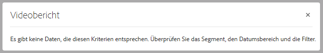

   Zum Generieren von Berichtsdaten müssen Sie ein Video hochladen und veröffentlichen. Verwenden Sie **[!UICONTROL URL kopieren]** und führen Sie das Video mindestens einmal aus.

   Es kann bis zu 12 Stunden dauern, bis die Videodaten aus der Nutzung des Berichte gefüllt wurden.

   Wenn ein Fehler vorliegt und die Report Suite nicht ordnungsgemäß festlegt wurde, wird der folgende Warnhinweis angezeigt.

   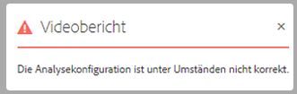

   Dieser Fehler wird auch angezeigt, wenn Videoberichte ausgeführt wird, bevor Sie die Dynamic Media-Konfiguration (vor 6.3) konfigurieren.

### Beheben von Problemen bei der Konfiguration von Videoberichten  {#troubleshooting-the-video-reporting-configuration}

* Während der Installation treten manchmal Timeouts beim Analytics API Server auf. Bei der Installation wird 20-mal versucht, die Verbindung wiederherzustellen. Wenn diese Situation eintritt, zeichnet die Protokolldatei mehrere Fehler auf. Suchen Sie nach `SiteCatalystReportService`.
* Wird das Vorgabenpaket für die Analyse nicht vorab installiert, wird möglicherweise eine neue Report Suite erstellt.
* Beim Aktualisieren von Experience Manager 6.3 auf Experience Manager 6.4 oder Experience Manager 6.4.1 und anschließender Konfiguration der Dynamic Media-Konfiguration (Pre 6.3) wird weiterhin eine Report Suite erstellt. Dieses Problem ist bekannt und wird für Experience Manager 6.4.2 behoben.

### Über die Vorgabe für die Videoanalyse {#about-the-video-analytics-preset}

Die Vorgabe für die Videoanalyse – auch als Analysevorgabe bezeichnet – ist neben den Viewer-Vorgaben in Dynamic Media gespeichert. Sie entspricht im Grunde der Viewer-Vorgabe, enthält jedoch Informationen zum Konfigurieren von AppMeasurement- und Video Heartbeat-Berichten.

Die Eigenschaften der Vorgabe lauten wie folgt:

* `reportSuite`
* `trackingServer`
* `trackingNamespace`
* `marketingCloudOrgId` (in älteren Experience Managern nicht vorhanden)

Experience Manager 6.4 und neuere Versionen speichern diese Vorgabe unter `/conf/global/settings/dam/dm/presets/analytics/jcr:content/userdata`

## Replizieren von Katalogeinstellungen {#replicating-catalog-settings}

Veröffentlichen Sie Ihre eigenen Standardkatalogeinstellungen im Rahmen des Einrichtungsprozesses über JCR. Gehen Sie wie folgt vor, um die Katalogeinstellungen zu replizieren:

1. Führen Sie in einem Terminalfenster folgenden Befehl aus:

   `curl -u admin:admin localhost:4502/libs/settings/dam/dm/presets/viewer.pushviewerpresets`

1. Navigieren Sie in Experience Manager zu folgendem Speicherort in der CRXDE Lite (Administratorberechtigungen erforderlich):

   `https://<*server*>:<*port*>/crx/de/index.jsp#/conf/global/settings/dam/dm/imageserver/`

1. Tippen Sie auf die Registerkarte **[!UICONTROL Replikation]**.
1. Tippen Sie auf **[!UICONTROL Replizieren.]**

## Replizieren von Viewer-Vorgaben {#replicating-viewer-presets}

Um ein Element mit einer Viewer-Vorgabe bereitzustellen, müssen Sie die Viewer-Vorgabe replizieren/veröffentlichen. ** (Alle Viewer-Vorgaben müssen aktiviert werden *und* repliziert werden, um die URL oder den Einbettungscode für ein Asset abzurufen.
Weitere Informationen finden Sie unter [Veröffentlichen von Viewer-Vorgaben](/help/assets/managing-viewer-presets.md#publishing-viewer-presets).

>[!NOTE]
Standardmäßig zeigt das System verschiedene Darstellungen an, wenn Sie **[!UICONTROL Darstellungen]** und verschiedene Viewer-Vorgaben auswählen, wenn Sie **[!UICONTROL Viewer]** in der Detail-Ansicht des Assets auswählen. Sie können die angezeigte Anzahl erhöhen oder verringern. Siehe [Erhöhung der Anzahl der Bildvorgaben, die angezeigt werden,](/help/assets/managing-image-presets.md#increasing-or-decreasing-the-number-of-image-presets-that-display) oder [Erhöhung der Anzahl der Viewer-Vorgaben, die](/help/assets/managing-viewer-presets.md#increasing-the-number-of-viewer-presets-that-display) anzeigen.

## Filtern von Assets für die Replikation {#filtering-assets-for-replication}

In Nicht-Dynamic Media-Bereitstellungen replizieren Sie *alle*-Elemente (sowohl Bilder als auch Videos) aus der Umgebung Ihres Experience Manager-Autorenmodus in den Veröffentlichungsknoten des Experience Managers. Dieser Arbeitsablauf ist erforderlich, da die Experience Manager-Veröffentlichungsserver auch die Assets bereitstellen.

In Dynamic Media-Bereitstellungen müssen diese Assets jedoch nicht repliziert werden, um Experience Manager-Veröffentlichungsknoten zu erhalten, da sie über die Cloud bereitgestellt werden. Ein solcher Arbeitsablauf für &quot;Hybrid-Veröffentlichung&quot;vermeidet zusätzliche Kosten für die Datenspeicherung und längere Verarbeitungszeiten für die Replizierung von Assets. Andere Inhalte wie Dynamic Media-Viewer, Site-Seiten und statische Inhalte werden weiterhin von den Veröffentlichungsknoten des Experience Managers bereitgestellt.

Neben der Replizierung der Assets werden auch die folgenden Nicht-Assets repliziert:

* Dynamic Media Versand-Konfiguration: `/conf/global/settings/dam/dm/imageserver/jcr:content`
* Bildvorgaben: `/conf/global/settings/dam/dm/presets/macros`
* Viewer-Vorgaben: `/conf/global/settings/dam/dm/presets/viewer`

Die Filter bieten Ihnen die Möglichkeit, *Assets von der Replizierung auf den Veröffentlichungsknoten des Experience Managers auszuschließen.*

### Verwenden von Asset-Standardfiltern für die Replikation {#using-default-asset-filters-for-replication}

Wenn Sie Dynamic Media für (1) Bildbearbeitung in der Produktion **oder** (2) verwenden, können Sie die standardmäßigen Filter verwenden, die die Adobe wie gewünscht bereitstellt. Folgende Filter sind standardmäßig aktiviert:

<table>
 <tbody>
  <tr>
   <td> </td>
   <td><strong>Filter</strong></td>
   <td><strong>Mimetype</strong></td>
   <td><strong>Ausgabeformate</strong></td>
  </tr>
  <tr>
   <td>Dynamic Media Image Versand</td>
   <td><p>filter-images</p> <p>filter-sets</p> <p> </p> </td>
   <td><p>Beginn mit <strong>image/</strong></p> <p>Enthält <strong>application/</strong> und endet mit <strong>set</strong>.</p> </td>
   <td>Die vordefinierten "Filterbilder"(gilt für Einzelbilder, einschließlich interaktiver Bilder) und "Filtersätze"(gilt für Rotationssets, Bildsätze, gemischte Mediensets und Karussell-Sets) werden wie folgt ausgeführt:
    <ul>
     <li>Schließen Sie PTIFF-Bilder und -Metadaten für die Replizierung ein (jede Darstellung, die mit <strong>cqdam</strong> beginnt).</li>
     <li>Das Originalbild und statische Bildausgabeformate werden von der Replikation ausgeschlossen.</li>
    </ul> </td>
  </tr>
  <tr>
   <td>Dynamic Media Video Versand</td>
   <td>filter-video</td>
   <td>Beginn mit <strong>video/</strong></td>
   <td>Das vordefinierte "filter-video" wird:
    <ul>
     <li>Schließen Sie Proxy-Videodarstellungen, Videominiatur/Standbild, Metadaten (sowohl bei übergeordneten Video- als auch Videodarstellungen) für die Replikation ein (Jede Darstellung beginnt mit <strong>cqdam</strong>).</li>
     <li>Schließen Sie die Originaldarstellungen für Videos und statische Miniaturansichten von der Replikation aus.<br /> <br /> <strong>Hinweis:</strong> Die Proxy-Videodarstellungen enthalten keine Binärdateien, sondern nur Knoteneigenschaften. Dies hat daher keine Auswirkung auf die Repositorygröße des Herausgebers.</li>
    </ul> </td>
  </tr>
  <tr>
   <td>Integration von Dynamic Media Classic (Scene7)</td>
   <td><p>filter-images</p> <p>filter-sets</p> <p>filter-video</p> </td>
   <td><p>Beginn mit <strong>image/</strong></p> <p>Enthält <strong>application/</strong> und endet mit <strong>set</strong>.</p> <p>Beginn mit <strong>video/</strong></p> </td>
   <td><p>Sie konfigurieren den Transport-URI so, dass er anstelle der Adobe Dynamic Media Cloud Replication Service-URL auf den Experience Manager-Veröffentlichungsserver verweist. Durch das Einrichten dieses Filters kann Dynamic Media Classic Assets anstelle der Veröffentlichungsinstanz des Experience Managers bereitstellen.</p> <p>Die vordefinierten "Filter-Bilder", "Filter-Sets"und "Filter-Video"werden wie folgt ausgeführt:</p>
    <ul>
     <li>Schließen Sie PTIFF-Bilder, Proxy-Videodarstellungen und Metadaten für die Replikation ein. Da sie jedoch nicht in der JCR-Datei für diejenigen vorhanden sind, die Experience Manager ausführen - Dynamic Media Classic Integration - tut es effektiv nichts.</li>
     <li>Das Originalbild, statische Bildwiedergaben, das Originalvideo und statische Miniaturwiedergaben werden aus der Replikation ausgeschlossen. Stattdessen stellt Dynamic Media Classic Bild- und Video-Assets bereit.</li>
    </ul> </td>
  </tr>
 </tbody>
</table>

>[!NOTE]
Filter gelten für MIME-Typen und können nicht pfadspezifisch sein.

### Einrichten von Asset-Filtern ausschließlich für Videobereitstellungen {#setting-up-asset-filters-for-video-only-deployments}

Wenn Sie Dynamic Media ausschließlich für Videos nutzen, können Sie mit diesen Schritten Asset-Filter für die Replikation einrichten:

1. Tippen Sie in Experience Manager auf das Logo des Experience Managers, um auf die globale Navigationskonsole zuzugreifen, und tippen Sie dann auf **[!UICONTROL Tools > Bereitstellung > Replikation > Agenten beim Autor.]**
1. Tippen Sie auf der Seite „Agenten für Autor“ auf **[!UICONTROL Standardagent (Publish).]**
1. Tippen Sie auf **[!UICONTROL Bearbeiten.]**
1. Aktivieren Sie im Dialogfeld **[!UICONTROL Agenteneinstellungen]** auf der Registerkarte **[!UICONTROL Einstellungen]** die Option **[!UICONTROL Aktiviert]**, um den Agenten zu aktivieren.
1. Tippen Sie auf **[!UICONTROL OK]**.
1. Tippen Sie in Experience Manager auf **[!UICONTROL Tools > Allgemein > CRXDE Lite.]**
1. Navigieren Sie im linken Ordnerbaum zu `/etc/replication/agents.author/dynamic_media_replication/jcr:content/damRenditionFilters`
1. Suchen Sie nach **[!UICONTROL filter-video]**, klicken Sie mit der rechten Maustaste darauf und wählen Sie **[!UICONTROL Kopieren.]**
1. Navigieren Sie im linken Ordnerbaum zu `/etc/replication/agents.author/publish`
1. Suchen Sie nach **[!UICONTROL jcr:content]**, klicken Sie mit der rechten Maustaste darauf und wählen Sie **[!UICONTROL Einfügen.]**

Diese Schritte richten die Instanz im Experience Manager-Veröffentlichungsmodus ein, um das Videoplayer- und die für die Wiedergabe erforderlichen Videometadaten bereitzustellen, während das Video selbst vom Dynamic Media-Cloud Service bereitgestellt wird. Der Filter schließt auch die Originaldarstellungen von Videos und statischen Miniaturbildern aus, die in der Veröffentlichungsinstanz nicht benötigt werden.

### Einrichten von Asset-Filtern für die Bilddarstellung in Bereitstellungen außerhalb der Produktion {#setting-up-asset-filters-for-imaging-in-non-production-deployments}

Wenn Sie Dynamic Media für die Bilddarstellung in Bereitstellungen außerhalb der Produktion nutzen, können Sie mit diesen Schritten Asset-Filter für die Replikation einrichten:

1. In Experience Manager tippen Sie auf das Logo des Experience Managers, um auf die globale Navigationskonsole zuzugreifen, und dann auf **[!UICONTROL Tools > Bereitstellung > Replikation > Agenten beim Autor.]**
1. Tippen Sie auf der Seite „Agenten für Autor“ auf **[!UICONTROL Standardagent (Publish).]**
1. Tippen Sie auf **[!UICONTROL Bearbeiten.]**
1. Aktivieren Sie im Dialogfeld **[!UICONTROL Agenteneinstellungen]** auf der Registerkarte **[!UICONTROL Einstellungen]** die Option **[!UICONTROL Aktiviert]**, um den Agenten zu aktivieren.
1. Tippen Sie auf **[!UICONTROL OK]**.
1. Tippen Sie in Experience Manager auf **[!UICONTROL Tools > Allgemein > CRXDE Lite.]**
1. Navigieren Sie im linken Ordnerbaum zu `/etc/replication/agents.author/dynamic_media_replication/jcr:content/damRenditionFilters`

   

1. Suchen Sie nach **[!UICONTROL filter-images]**, klicken Sie mit der rechten Maustaste darauf und wählen Sie **[!UICONTROL Kopieren.]**
1. Navigieren Sie im linken Ordnerbaum zu `/etc/replication/agents.author/publish`
1. Suchen Sie nach **[!UICONTROL jcr:content]**, klicken Sie mit der rechten Maustaste darauf und wählen Sie **[!UICONTROL Erstellen > Knoten erstellen.]** Geben Sie den Namen  `damRenditionFilters` des Typs ein  `nt:unstructured`.
1. Suchen Sie nach `damRenditionFilters`, klicken Sie mit der rechten Maustaste darauf und wählen Sie **[!UICONTROL Einfügen.]**

Mit diesen Schritten wird die Instanz im Veröffentlichungsmodus des Experience Managers eingerichtet, um die Bilder für Ihre Nicht-Umgebung bereitzustellen. Der Filter schließt auch das Originalbild und statische Darstellungen, die in der Veröffentlichungsinstanz nicht benötigt werden, von der Replizierung aus.

>[!NOTE]
Wenn es für einen Autor viele verschiedene Filter gibt, muss jedem Agenten ein anderer Benutzer zugewiesen werden. Der Granite-Code erzwingt, dass pro Benutzer nur ein Filter angewendet wird. Deswegen sollten Sie für jeden eingerichteten Filter einen anderen Benutzer festlegen.
Verwenden Sie mehr als einen Filter auf einem Server? Beispiel: Ein Filter für die zu veröffentlichende Replizierung und ein zweiter Filter für s7Versand. Ist dies der Fall, müssen Sie sicherstellen, dass diesen beiden Filtern im Knoten **jcr:content** eine andere **userId** zugewiesen ist. Sehen Sie sich das folgende Bild an:


### Anpassen von Asset-Filtern für die Replikation {#customizing-asset-filters-for-replication}

Gehen Sie wie folgt vor, um Asset-Filter für die Replikation optional anzupassen:

1. Tippen Sie in Experience Manager auf das Logo des Experience Managers, um auf die globale Navigationskonsole zuzugreifen, und dann auf **[!UICONTROL Tools > Allgemein > CRXDE Lite.]**
1. Navigieren Sie im linken Ordnerbaum zu `/etc/replication/agents.author/dynamic_media_replication/jcr:content/damRenditionFilters`, um die Filter zu überprüfen.

   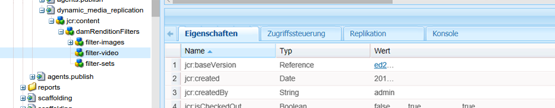

1. Zum Definieren des MIME-Typs für den Filter können Sie den MIME-Typ wie folgt ermitteln:

   Erweitern Sie in der linken Leiste `content > dam > <locate_your_asset> >  jcr:content > metadata` und suchen Sie in der Tabelle **[!UICONTROL dc:format.]**

   Die folgende Grafik ist ein Beispiel für den Pfad eines Assets zu „dc:format“.

   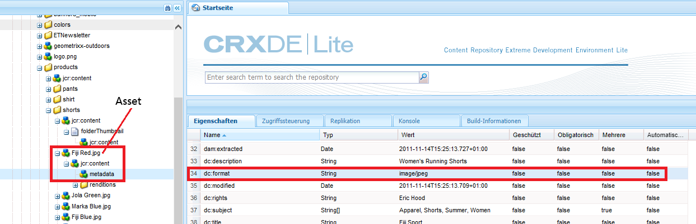

   Beachten Sie, dass `dc:format` für das Asset `Fiji Red.jpg` `image/jpeg`  lautet.

   Damit dieser Filter für alle Bilder unabhängig von ihrem Format gilt, setzen Sie den Wert auf `image/*`, wobei `*` ein regulärer Ausdruck ist, der auf alle Bilder eines beliebigen Formats angewendet wird.

   Damit der Filter nur auf Bilder vom Typ JPEG angewendet werden kann, geben Sie den Wert `image/jpeg` ein.

1. Definieren Sie, welche Darstellungen Sie von der Replizierung ausschließen möchten.

   Sie können die folgenden Zeichen verwenden, um einen Filtervorgang für die Replikation durchzuführen:

<table>
 <tbody>
  <tr>
   <td><strong>Zu verwendendes Zeichen</strong></td>
   <td><strong>So werden Assets für die Replizierung Filter</strong></td>
  </tr>
  <tr>
   <td>*</td>
   <td>Platzhalterzeichen<br /> </td>
  </tr>
  <tr>
   <td>+</td>
   <td>Umfasst Elemente für die Replikation.</td>
  </tr>
  <tr>
   <td>-</td>
   <td>Schließt Assets von der Replikation aus.</td>
  </tr>
 </tbody>
</table>

Navigieren Sie zu `content/dam/<locate your asset>/jcr:content/renditions`.

Die folgende Grafik ist ein Beispiel für die Wiedergabeformate eines Assets.


Wenn Sie mit dem obigen Beispiel nur das PTIFF (Pyramid TIFF) replizieren möchten, geben Sie `+cqdam,*` ein, das alle Darstellungen enthält, die dieser Beginn mit `cqdam` enthält. Im Beispiel lautet diese Darstellung `cqdam.pyramid.tiff`.

Wenn Sie nur das Original replizieren möchten, geben Sie `+original` ein.

## Konfigurieren von Dynamic Media-Bildserver-Einstellungen {#configuring-dynamic-media-image-server-settings}

Das Konfigurieren des Dynamic Media-Bildservers umfasst die Bearbeitung des Adobe CQ Scene7 ImageServer-Bundles und des Adobe CQ Scene7 PlatformServer-Bundles.

>[!NOTE]
Dynamic Media arbeitet sofort nach der Aktivierung von [. ](#enabling-dynamic-media) Sie können jedoch optional eine Feinabstimmung Ihrer Installation vornehmen, indem Sie Dynamic Media Image Server so konfigurieren, dass bestimmte Spezifikationen oder Anforderungen erfüllt werden.

**Voraussetzung**:  *Stellen Sie* vor der Konfiguration des Dynamic Media Image-Servers sicher, dass Ihre VM von Windows® eine Installation der Microsoft® Visual C++-Bibliotheken enthält. Diese Bibliotheken werden benötigt, um den Dynamic Media-Bildserver auszuführen. Sie können das Microsoft® Visual C++ 2010 Redistributable Package (x64) hier ](https://www.microsoft.com/de-de/download/details.aspx?id=14632) herunterladen.[

So konfigurieren Sie die Einstellungen für den Dynamic Media-Bildserver:

1. Tippen Sie in der oberen linken Ecke des Experience Managers auf **[!UICONTROL Adobe Experience Manager]**, um die globale Navigationskonsole aufzurufen, und tippen Sie dann auf **[!UICONTROL Tools > Vorgänge > Web-Konsole.]**
1. Tippen Sie auf der Seite &quot;Adobe Experience Manager Web Console Configuration&quot;auf **[!UICONTROL OSGi > Configuration]**, um alle Pakete, die derzeit in Experience Manager ausgeführt werden, Liste.

   Die Dynamic Media-Versand-Server sind in der Liste unter den folgenden Namen zu finden:

   * `Adobe CQ Scene7 ImageServer`
   * `Adobe CQ Scene7 PlatformServer`

1. Tippen Sie in der Liste mit den Bundles rechts von Adobe CQ Scene7 ImageServer auf das Symbol „Bearbeiten“.
1. Legen Sie im Dialogfeld für Adobe CQ Scene7 ImageServer die folgenden Konfigurationswerte fest:

   >[!NOTE]
   Normalerweise müssen die Standardwerte nicht geändert werden. Wenn Sie jedoch die Standardwerte ändern, müssen Sie das Bundle neu starten, damit die Änderungen wirksam werden.

<table>
 <tbody>
  <tr>
   <td><strong>Property</strong></td>
   <td><strong>Standardwert</strong></td>
   <td><strong>Beschreibung</strong></td>
  </tr>
  <tr>
   <td>TcpPort.name</td>
   <td><code><em>empty</em></code></td>
   <td>Anschlussnummer für die Kommunikation mit dem ImageServer-Prozess. Der freie Port wird standardmäßig automatisch erkannt.</td>
  </tr>
  <tr>
   <td>AllowRemoteAccess.name</td>
   <td><code><em>empty</em></code></td>
   <td><p>Der Remotezugriff auf den ImageServer-Prozess wird zugelassen bzw. nicht zugelassen. Bei "false"überwacht der Image-Server nur den localhost.</p> <p>Die standardmäßigen Externalisierereinstellungen, die auf den localhost verweisen, müssen die tatsächliche Domäne oder IP-Adresse der jeweiligen VM-Instanz angeben. Der Grund dafür ist, dass der localhost auf das übergeordnete System der VM verweist.</p> <p>Domänen oder IP-Adressen für die VM müssen über einen Eintrag in der Hostdatei verfügen, damit sie selbst aufgelöst werden können.</p> </td>
  </tr>
  <tr>
   <td>MaxRenderRgnPixels</td>
   <td>16 MPixel</td>
   <td>Maximale Größe in Megapixeln, die gerendert wird.</td>
  </tr>
  <tr>
   <td>MaxMessageSize</td>
   <td>16 MB</td>
   <td>Maximale Nachrichtengröße in MB, die bereitgestellt wird.</td>
  </tr>
  <tr>
   <td>RandomAccessUrlTimeout</td>
   <td>20</td>
   <td>Zeitüberschreitungswert, der angibt, wie lange der Image-Server in Sekunden wartet, bis die JCR auf eine Anforderung eines Bereichs reagiert.</td>
  </tr>
  <tr>
   <td>WorkerThreads</td>
   <td>10</td>
   <td>Anzahl von Workerthreads.</td>
  </tr>
 </tbody>
</table>

1. Tippen Sie auf **[!UICONTROL Speichern]**.
1. Tippen Sie in der Liste der Pakete rechts von Adobe CQ Scene7 PlatformServer auf das Symbol **[!UICONTROL Bearbeiten]**.
1. Legen Sie im Dialogfeld für Adobe CQ Scene7 PlatformServer die folgenden Standardwerte fest:

   >[!NOTE]
   Der Dynamic Media-Bildserver verwendet einen eigenen Datenträgercache für das Zwischenspeichern von Antworten. Der Experience Manager-HTTP-Cache und der Dispatcher können nicht verwendet werden, um Antworten vom Dynamic Media-Image-Server im Cache zu speichern.

   | **Eigenschaft** | **Standardwert** | **Beschreibung** |
   |---|---|---|
   | Cache enabled | Aktiviert | Ob der Antwortcache aktiviert ist |
   | Cache roots | cache | Mindestens ein Pfad zu Ordnern des Caches für Antworten. Relative Pfade werden für den internen s7imaging-Bundle-Ordner aufgelöst. |
   | Cache Max Size | 200000000 | Gibt die maximale Größe des Caches für Antworten in Byte an. |
   | Cache Max Entries | 100000 | Maximale Anzahl der im Cache zulässigen Einträge. |

### Standardeinstellungen des Manifests {#default-manifest-settings}

Mit dem Standardmanifest können Sie die Standardwerte konfigurieren, die zum Generieren der Antworten für die Dynamic Media-Bereitstellung verwendet werden. Sie können die Qualität (JPEG-Qualität, Auflösung, Resampling-Modus), das Zwischenspeichern (Ablauf) und das Rendern zu großer Bilder (Standard-Pix, Standard-Thumbpix, maxpix) optimieren.

Der Speicherort der Standardmanifest-Konfiguration wird aus dem Standardwert für **[!UICONTROL Catalog root]** des **[!UICONTROL Adobe CQ Scene7 PlatformServer]**-Bundles übernommen. Standardmäßig befindet sich dieser Wert im folgenden Pfad unter **[!UICONTROL Tools > Allgemein > CRXDE Lite]**:

`/conf/global/settings/dam/dm/imageserver/`

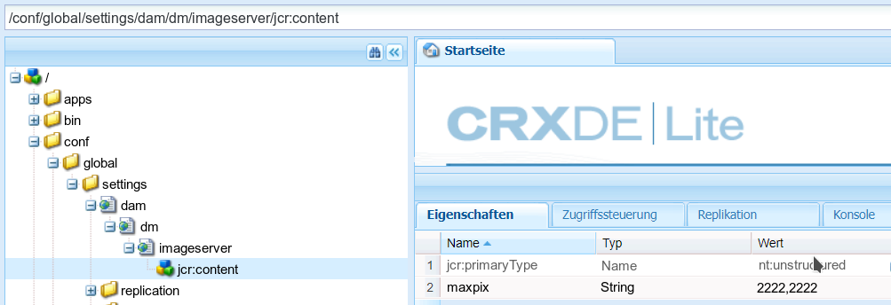

Sie können die Werte der Eigenschaften wie in der folgenden Tabelle beschrieben ändern, indem Sie neue Werte eingeben.

Wenn Sie mit dem Ändern des Standardmanifests fertig sind, tippen Sie in der oberen linken Ecke der Seite auf **[!UICONTROL Alle speichern]**.

Tippen Sie unbedingt auf die Registerkarte **[!UICONTROL Zugriffskontrolle]** (rechts neben der Registerkarte Eigenschaften), und legen Sie dann für alle und die Benutzer mit der dynamischen Medienreplikation die Zugriffskontrolle auf `jcr:read` fest.

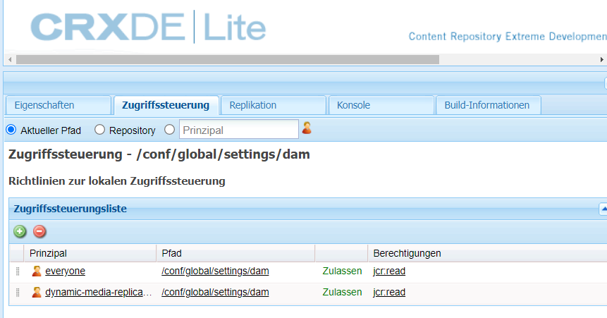

Tabelle mit Manifesteinstellungen und deren Standardwerte:

<table>
 <tbody>
  <tr>
   <td><strong>Eigenschaft</strong></td>
   <td><strong>Standardwert</strong></td>
   <td><strong>Beschreibung</strong></td>
  </tr>
  <tr>
   <td>bkgcolor</td>
   <td>FFFFFF</td>
   <td><p>Standard-Hintergrundfarbe. RGB-Wert, mit dem alle Bereiche des Antwortbildes gefüllt werden, die keine Bilddaten enthalten.</p> <p>Siehe auch <a href="https://experienceleague.adobe.com/docs/dynamic-media-developer-resources/image-serving-api/image-serving-api/attributes/r-bkgcolor.html#image-serving-api">BkgColor</a> in der Image-Serving-API.</p> </td>
  </tr>
  <tr>
   <td>defaultpix</td>
   <td>300,300</td>
   <td><p>Standard-Ansichtsgröße. Der Server beschränkt die Größe der Antwortbilder auf diese Breite und Höhe, wenn bei der Anfrage die Größe nicht explizit durch die Werte wid=, hei= oder scl= festgelegt wird.</p> <p>Wird als zwei ganze Zahlen angegeben (0 oder höher), die durch ein Komma getrennt sind. Breite und Höhe in Pixel. Sie können einen oder beide Werte auf 0 setzen, damit sie nicht eingeschränkt werden. Gilt nicht für verschachtelte oder eingebettete Anforderungen.</p> <p>Siehe auch <a href="https://experienceleague.adobe.com/docs/dynamic-media-developer-resources/image-serving-api/image-serving-api/attributes/r-defaultpix.html#image-serving-api">DefaultPix</a> in der Image-Serving-API.</p> <p>Normalerweise verwenden Sie aber eine Viewer-Vorgabe oder Bildvorgabe, um das Asset bereitzustellen. „defaultpix“ gilt nur für ein Asset, für das keine Viewer-Vorgabe oder Bildvorgabe verwendet wird.</p> </td>
  </tr>
  <tr>
   <td>defaultthumbpix</td>
   <td>100,100</td>
   <td><p>Standardgröße für Miniaturansichten. Wird anstelle von „attribute::DefaultPix“ für Miniaturanforderungen (req=tmb) verwendet.</p> <p>Der Server beschränkt die Anzahl der Antwortbilder auf diese Breite und Höhe. Diese Aktion ist "true", wenn eine Miniaturansicht-Anforderung (req=tmb) die Größe nicht explizit angibt und die Ansicht nicht explizit unter Verwendung von "wid=", "hei="oder "scl="angegeben wird.</p> <p>Wird als zwei ganze Zahlen angegeben (0 oder höher), die durch ein Komma getrennt sind. Breite und Höhe in Pixel. Sie können einen oder beide Werte auf 0 setzen, damit sie nicht eingeschränkt werden. </p> <p>Gilt nicht für verschachtelte oder eingebettete Anforderungen.</p> <p>Siehe auch <a href="https://experienceleague.adobe.com/docs/dynamic-media-developer-resources/image-serving-api/image-serving-api/attributes/r-defaultthumbpix.html#image-serving-api">DefaultThumbPix</a> in der Image-Serving-API. </p> </td>
  </tr>
  <tr>
   <td>Ablauf</td>
   <td>36000000</td>
   <td><p>Standardeinstellung für Time-To-Live des Client-Caches. Bietet ein standardmäßiges Ablaufintervall für den Fall, dass ein bestimmter Katalogdatensatz keinen gültigen Wert für „catalog::Expiration“ (also den Ablauf des Katalogs) aufweist.</p> <p>Reelle Zahl, 0 oder höher. Anzahl von Millisekunden bis zum Ablauf seit der Generierung der Daten. Geben Sie „0“ an, wenn das Antwortbild immer sofort ablaufen soll. Hiermit wird das Client-Caching praktisch deaktiviert. Dieser Wert ist standardmäßig auf 10 Stunden festgelegt. Dies bedeutet, dass es bei der Veröffentlichung eines neuen Bildes zehn Stunden dauert, bis das alte Bild aus dem Cache des Benutzers entfernt wird. Wenden Sie sich an die Kundenunterstützung, wenn der Cache früher geleert werden soll.</p> <p>Siehe auch <a href="https://experienceleague.adobe.com/docs/dynamic-media-developer-resources/image-serving-api/image-serving-api/attributes/r-expiration.html">Expiration</a> in der Image-Serving-API.</p> </td>
  </tr>
  <tr>
   <td>jpegquality</td>
   <td>80</td>
   <td><p>Standardattribute für JPEG-Verschlüsselung. Legt die Standardattribute von JPEG-Antwortbildern fest.</p> <p>Ganze Zahl und Flag, getrennt durch ein Komma. Der erste Wert liegt im Bereich 1 bis 100 und definiert die Qualität. Der zweite Wert kann 0 für normales Verhalten oder 1 für die Deaktivierung der RGB-Farbwertanpassung für JPEG-Kodierer sein.</p> <p>Siehe auch <a href="https://experienceleague.adobe.com/docs/dynamic-media-developer-resources/image-serving-api/image-serving-api/attributes/r-jpegquality.html#image-serving-api">JpegQuality</a> in der Image-Serving-API.</p> </td>
  </tr>
  <tr>
   <td>maxpix</td>
   <td>2000,2000</td>
   <td><p>Maximale Größe des Antwortbildes. Maximale Breite und Höhe des Antwortbildes, das an den Client zurückgegeben wird.</p> <p>Der Server gibt einen Fehler zurück, wenn eine Anforderung ein Antwortbild verursacht, dessen Breite oder Höhe größer als das Attribut::MaxPix ist.</p> <p>Siehe auch <a href="https://experienceleague.adobe.com/docs/dynamic-media-developer-resources/image-serving-api/image-serving-api/attributes/r-maxpix.html?lang=en#image-serving-api">MaxPix</a> in der Image-Serving-API.</p> </td>
  </tr>
  <tr>
   <td>resmode</td>
   <td>SCHARF2</td>
   <td><p>Standard-Resamplingmodus. Gibt die standardmäßigen Resampling- und Interpolationsattribute an, die für die Skalierung von Bilddaten verwendet werden sollen.</p> <p>Wird verwendet, wenn „resMode=“ in einer Anforderung nicht angegeben wird.</p> <p>Zulässige Werte sind BILIN, BICUB oder SHARP2.</p> <p>Enum. Festlegung für Interpolationsmodus: 2 für BILIN, 3 für BICUB oder 4 für SCHARF2. Verwenden Sie für optimale Ergebnisse "sharp2".</p> <p>Siehe auch <a href="https://experienceleague.adobe.com/docs/dynamic-media-developer-resources/image-serving-api/image-serving-api/attributes/r-is-cat-resmode.html#image-serving-api">ResMode</a> in der Image-Serving-API.</p> </td>
  </tr>
  <tr>
   <td>resolution</td>
   <td>72</td>
   <td><p>Standardobjektauflösung. Bietet eine standardmäßige Objektauflösung, falls ein bestimmter Katalogdatensatz keinen gültigen Wert für „catalog::Resolution“ aufweist.</p> <p>Reelle Zahl, größer als 0. Normalerweise ausgedrückt als Pixel pro Zoll, kann aber auch in anderen Maßeinheiten, z. B. in Pixeln pro Meter, verwendet werden.</p> <p>Siehe auch <a href="https://experienceleague.adobe.com/docs/dynamic-media-developer-resources/image-serving-api/image-serving-api/attributes/r-resolution.html#image-serving-api">Resolution</a> in der Image-Serving-API.</p> </td>
  </tr>
  <tr>
   <td>thumbnailtime</td>
   <td>1 %,11 %,21 %,31 %,41 %,51 %,61 %,71 %,81 %,91 %</td>
   <td>Diese Werte stellen einen Schnappschuss der Videowiedergabe dar und werden an <a href="https://www.encoding.com/">encoding.com</a> übergeben. Weitere Informationen finden Sie unter <a href="/help/assets/video.md#about-video-thumbnails-in-dynamic-media-hybrid-mode">Informationen zu Videominiaturen</a>.</td>
  </tr>
 </tbody>
</table>

## Konfigurieren des Farbmanagements für dynamische Medien  {#configuring-dynamic-media-color-management}

Mit dem Dynamic Media-Farbmanagement können Sie für die Vorschau korrekte Assets farblich markieren.

Bei der Farbkorrektur behalten übernommene Assets ihren Farbraum (RGB, CMYK, Grau) und das eingebettete Farbprofil im generierten Pyramid TIFF-Wiedergabeformat bei. Wenn Sie eine dynamische Wiedergabe anfordern, wird die Bildfarbe gemäß dem Zielfarbraum korrigiert. Sie konfigurieren das Profil für die Ausgabefarbe in den Dynamic Media-Veröffentlichungseinstellungen in der JCR-Datei.

Adobe Farbmanagement verwendet ICC-Profil (International Color Consortium), ein vom ICC definiertes Format.

Sie können das Dynamic Media-Farbmanagement konfigurieren und Bildvorgaben mit CMYK-, RGB- oder Grauausgabe konfigurieren. Siehe [Konfigurieren von Bildvorgaben](/help/assets/managing-image-presets.md).

Erweiterte Anwendungsfälle können einen Modifikator `icc=` manuell konfigurieren, um explizit ein Profil für die Ausgabefarbung auszuwählen:

* `icc` -  [https://experienceleague.adobe.com/docs/dynamic-media-developer-resources/image-serving-api/image-serving-api/http-protocol-reference/command-reference/r-icc.html](https://experienceleague.adobe.com/docs/dynamic-media-developer-resources/image-serving-api/image-serving-api/http-protocol-reference/command-reference/r-icc.html)

* `iccEmbed` -  [https://experienceleague.adobe.com/docs/dynamic-media-developer-resources/image-serving-api/image-serving-api/http-protocol-reference/command-reference/r-iccembed.html](https://experienceleague.adobe.com/docs/dynamic-media-developer-resources/image-serving-api/image-serving-api/http-protocol-reference/command-reference/r-iccembed.html)

>[!NOTE]
Der Standardsatz mit Adobe-Farbelementen ist nur verfügbar, wenn [Feature Pack 12445 von Software Distribution](https://experience.adobe.com/#/downloads/content/software-distribution/en/aem.html?package=/content/software-distribution/en/details.html/content/dam/aem/public/adobe/packages/cq630/featurepack/cq-6.3.0-featurepack-12445) installiert ist. Alle Feature Packs und Service Packs sind unter [Software Distribution](https://experience.adobe.com/#/downloads/content/software-distribution/en/aem.html) verfügbar. Feature Pack 12445 enthält die Adobe-Farbprofile.


### Installieren von Feature Pack 12445  {#installing-feature-pack}

Um die Dynamic Media-Farbmanagementfunktionen zu verwenden, installieren Sie Feature Pack 12445.

**Gehen Sie wie folgt vor, um Feature Pack 12445 zu installieren**

1. Navigieren Sie zu [Software-Distribution](https://experience.adobe.com/#/downloads/content/software-distribution/en/aem.html) und laden Sie `cq-6.3.0-featurepack-12445` herunter.

   Weitere Informationen zur Verwendung von Paketen in [!DNL Adobe Experience Manager] finden Sie unter [Wie mit Paketen funktioniert](/help/sites-administering/package-manager.md).

1. Installieren Sie das Feature Pack.

### Konfigurieren der Standardfarbprofile {#configuring-the-default-color-profiles}

Nachdem Sie das Feature Pack installiert haben, konfigurieren Sie die entsprechenden Profil für die Standardfarbe, um die Farbkorrektur zu aktivieren, wenn Sie RGB- oder CMYK-Bilddaten anfordern.

**Gehen Sie wie folgt vor, um die Standardfarbprofile zu konfigurieren**

1. Navigieren Sie unter **[!UICONTROL Tools > Allgemein > CRXDE Lite]** zu `/conf/global/settings/dam/dm/imageserver/jcr:content`, das die standardmäßigen Adobe Color-Profil enthält.

   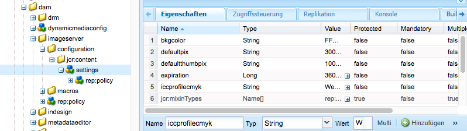

1. hinzufügen Sie eine Eigenschaft für die Farbkorrektur, indem Sie einen Bildlauf zum unteren Rand der Registerkarte **[!UICONTROL Eigenschaften]** durchführen. Geben Sie manuell den Namen, den Typ und den Wert der Eigenschaft ein, wie in den folgenden Tabellen beschrieben. Nachdem Sie die Werte eingegeben haben, tippen Sie auf **[!UICONTROL Hinzufügen]** und dann auf **[!UICONTROL Alle speichern]**, um Ihre Werte zu speichern.

   Die Farbkorrektureigenschaften werden in der Tabelle **Farbkorrektureigenschaften** beschrieben. Werte, die Sie Farbkorrektureigenschaften zuweisen können, sind in der Tabelle **Farbprofil** angegeben.

   Fügen Sie beispielsweise unter **[!UICONTROL Name]** `iccprofilecmyk` **[!UICONTROL hinzu, wählen Sie Typ]** `String` und fügen Sie `WebCoated` als **[!UICONTROL Wert hinzu.]** Tippen Sie dann auf  **** Hinzufügen und dann auf  **[!UICONTROL Save]** All, um Ihre Werte zu speichern.

   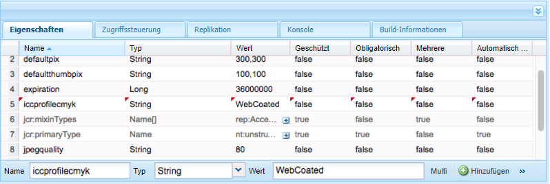

   **Tabelle „Farbkorrektureigenschaften“**

<table>
 <tbody>
  <tr>
   <td><strong>Eigenschaft</strong></td>
   <td><strong>Typ</strong></td>
   <td><strong>Default</strong></td>
   <td><strong>Beschreibung</strong></td>
  </tr>
  <tr>
   <td><a href="https://experienceleague.adobe.com/docs/dynamic-media-developer-resources/image-serving-api/image-serving-api/attributes/r-iccprofilergb.html">iccprofilergb</a></td>
   <td>Zeichenfolge</td>
   <td>&lt;leer&gt;</td>
   <td>Name des standardmäßigen RGB-Profils.</td>
  </tr>
  <tr>
   <td><a href="https://experienceleague.adobe.com/docs/dynamic-media-developer-resources/image-serving-api/image-serving-api/attributes/r-iccprofilecmyk.html">iccprofilecmyk</a></td>
   <td>Zeichenfolge</td>
   <td>&lt;leer&gt;</td>
   <td>Name des standardmäßigen CMYK-Farbprofils.</td>
  </tr>
  <tr>
   <td><a href="https://experienceleague.adobe.com/docs/dynamic-media-developer-resources/image-serving-api/image-serving-api/attributes/r-iccprofilegray.html">iccprofilegray</a></td>
   <td>Zeichenfolge</td>
   <td>&lt;leer&gt;</td>
   <td>Name des standardmäßigen grauen Farbprofils.</td>
  </tr>
  <tr>
   <td><a href="https://experienceleague.adobe.com/docs/dynamic-media-developer-resources/image-serving-api/image-serving-api/attributes/r-iccprofilesrcrgb.html">iccprofilesrcrgb</a></td>
   <td>Zeichenfolge</td>
   <td>&lt;leer&gt;</td>
   <td>Name des standardmäßigen RGB-Profils, das für RGB- ohne eingebettetes Profil verwendet wird</td>
  </tr>
  <tr>
   <td><a href="https://experienceleague.adobe.com/docs/dynamic-media-developer-resources/image-serving-api/image-serving-api/attributes/r-iccprofilesrccmyk.html">iccprofilesrccmyk</a></td>
   <td>Zeichenfolge</td>
   <td>&lt;leer&gt;</td>
   <td>Name des standardmäßigen CMYK-Farbbilds, das für CMYK-Profile ohne eingebettetes Profil verwendet wird.</td>
  </tr>
  <tr>
   <td><a href="https://experienceleague.adobe.com/docs/dynamic-media-developer-resources/image-serving-api/image-serving-api/attributes/r-iccprofilesrcgray.html">iccprofilesrcgray</a></td>
   <td>Zeichenfolge</td>
   <td>&lt;leer&gt;</td>
   <td>Name des standardmäßigen grauen Profils, das für CMYK-Bilder ohne eingebettetes Profil verwendet wird.</td>
  </tr>
  <tr>
   <td><a href="https://experienceleague.adobe.com/docs/dynamic-media-developer-resources/image-serving-api/image-serving-api/attributes/r-iccblackpointcompensation.html">iccblackpointter-Kompensation</a></td>
   <td>Boolesch</td>
   <td>True</td>
   <td>Gibt an, ob während der Farbkorrektur eine Schwarzpunktkompensation vorgenommen wird. Adobe empfiehlt, dass diese Einstellung aktiviert ist.</td>
  </tr>
  <tr>
   <td><a href="https://experienceleague.adobe.com/docs/dynamic-media-developer-resources/image-serving-api/image-serving-api/attributes/r-iccdither.html">iccdither</a></td>
   <td>Boolesch</td>
   <td>False</td>
   <td>Gibt an, ob während der Farbkorrektur Dithering durchgeführt wird.</td>
  </tr>
  <tr>
   <td><a href="https://experienceleague.adobe.com/docs/dynamic-media-developer-resources/image-serving-api/image-serving-api/attributes/r-iccrenderintent.html">iccrenderintent</a></td>
   <td>Zeichenfolge</td>
   <td>relative</td>
   <td><p>Gibt die Rendering-Absicht an. Folgende Werte sind zulässig: <strong>perspektivisch, relativ, Sättigung, absolut. </strong><i></i>Adobe empfiehlt <strong>relativ</strong><i></i> als Standard.</p> </td>
  </tr>
 </tbody>
</table>

>[!NOTE]
Bei Eigenschaftsnamen muss die Groß-/Kleinschreibung beachtet werden.

**Tabelle „Farbprofile“**

Die folgenden Farbprofile werden installiert:

<table>
 <tbody>
  <tr>
   <th><p>Name</p> </th>
   <th><p>Farbraum</p> </th>
   <th><p>Beschreibung</p> </th>
  </tr>
  <tr>
   <td>AdobeRGB</td>
   <td>RGB</td>
   <td>Adobe RGB (1998)</td>
  </tr>
  <tr>
   <td>AppleRGB</td>
   <td>RGB</td>
   <td>Apple RGB</td>
  </tr>
  <tr>
   <td>CIERGB</td>
   <td>RGB</td>
   <td>CIE RGB</td>
  </tr>
  <tr>
   <td>CoatedFogra27</td>
   <td>CMYK</td>
   <td>Coated FOGRA27 (ISO 12647-2:2004)</td>
  </tr>
  <tr>
   <td>CoatedFogra39</td>
   <td>CMYK</td>
   <td>Coated FOGRA39 (ISO 12647-2:2004)</td>
  </tr>
  <tr>
   <td>CoatedGraCol</td>
   <td>CMYK</td>
   <td>Coated GRACoL 2006 (ISO 12647-2:2004)</td>
  </tr>
  <tr>
   <td>ColorMatchRGB</td>
   <td>RGB</td>
   <td>ColorMatch RGB</td>
  </tr>
  <tr>
   <td>EuropeISOCoated</td>
   <td>CMYK</td>
   <td>Europe ISO Coated FOGRA27</td>
  </tr>
  <tr>
   <td>EuroscaleCoated</td>
   <td>CMYK</td>
   <td>Euroscale Coated v2</td>
  </tr>
  <tr>
   <td>EuroscaleUngestrichen</td>
   <td>CMYK</td>
   <td>Euroscale Ungestrichen v2</td>
  </tr>
  <tr>
   <td>JapanColorCoated</td>
   <td>CMYK</td>
   <td>Japan Color 2001 Coated</td>
  </tr>
  <tr>
   <td>JapanColorNewspaper</td>
   <td>CMYK</td>
   <td>Japan Color 2002 Newspaper</td>
  </tr>
  <tr>
   <td>JapanColorUngestern</td>
   <td>CMYK</td>
   <td>Japan Color 2001 Ungestrichen</td>
  </tr>
  <tr>
   <td>JapanColorWebCoated</td>
   <td>CMYK</td>
   <td>Japan Color 2003 Web Coated</td>
  </tr>
  <tr>
   <td>JapanWebCoated</td>
   <td>CMYK</td>
   <td>Japan Web Coated (Ad)</td>
  </tr>
  <tr>
   <td>NewsprintSNAP2007</td>
   <td>CMYK</td>
   <td>US Newsprint (SNAP 2007)</td>
  </tr>
  <tr>
   <td>NTSC</td>
   <td>RGB</td>
   <td>NTSC (1953)</td>
  </tr>
  <tr>
   <td>PAL</td>
   <td>RGB</td>
   <td>PAL/SECAM</td>
  </tr>
  <tr>
   <td>ProPhoto</td>
   <td>RGB</td>
   <td>ProPhoto RGB</td>
  </tr>
  <tr>
   <td>PS4Default</td>
   <td>CMYK</td>
   <td>Photoshop 4 Standard-CMYK</td>
  </tr>
  <tr>
   <td>PS5Standard</td>
   <td>CMYK</td>
   <td>Photoshop 5 Standard-CMYK</td>
  </tr>
  <tr>
   <td>SheetfeedCoated</td>
   <td>CMYK</td>
   <td>U.S. Sheetfeed Coated v2</td>
  </tr>
  <tr>
   <td>BlattmatteUngestrichen</td>
   <td>CMYK</td>
   <td>U.S. Sheetfeed Unstructured v2</td>
  </tr>
  <tr>
   <td>SMPTE</td>
   <td>RGB</td>
   <td>SMPTE-C</td>
  </tr>
  <tr>
   <td>sRGB</td>
   <td>RGB</td>
   <td>sRGB IEC61966-2.1</td>
  </tr>
  <tr>
   <td>UngestrichenFogra29</td>
   <td>CMYK</td>
   <td>Ungestrichenes FOGRA29 (ISO 12647-2:2004)</td>
  </tr>
  <tr>
   <td>WebCoated</td>
   <td>CMYK</td>
   <td>U.S. Web Coated (SWOP) v2</td>
  </tr>
  <tr>
   <td>WebCoatedFogra28</td>
   <td>CMYK</td>
   <td>Web Coated FOGRA28 (ISO 12647-2:2004)</td>
  </tr>
  <tr>
   <td>WebCoatedGrade3</td>
   <td>CMYK</td>
   <td>Web Coated SWOP 2006 Grade 3 Paper</td>
  </tr>
  <tr>
   <td>WebCoatedGrade5</td>
   <td>CMYK</td>
   <td>Webbeschichtetes SWOP 2006 Grade 5 Papier</td>
  </tr>
  <tr>
   <td>WebUngestern</td>
   <td>CMYK</td>
   <td>U.S. Web Ungestern v2</td>
  </tr>
  <tr>
   <td>WideGamutRGB</td>
   <td>RGB</td>
   <td>RGB-Farbraum</td>
  </tr>
 </tbody>
</table>

1. Tippen Sie auf **[!UICONTROL Alle speichern.]**

Sie könnten beispielsweise **[!UICONTROL icprofilergb]** auf `sRGB` und **[!UICONTROL icprofilecmyk]** auf **[!UICONTROL WebCoated setzen.]**

Dies hat folgende Auswirkungen:

* Die Farbkorrektur für RGB- und CMYK-Bilder wird aktiviert.
* RGB-Profile, die kein Farbbild aufweisen, werden als im Farbraum *sRGB* angezeigt.
* CMYK-Profile ohne Farbraum werden als Farbraum *WebCoated* angenommen.
* Dynamische Darstellungen, die RGB-Ausgabe zurückgeben, geben sie im Farbraum *sRGB *zurück.
* Dynamische Darstellungen, die CMYK-Ausgabe zurückgeben, geben sie im Farbraum *WebCoated* zurück.

## Bereitstellen von Assets {#delivering-assets}

Nachdem Sie alle oben genannten Aufgaben abgeschlossen haben, werden aktivierte Dynamic Media-Assets vom Image- oder Videodienst bereitgestellt. In Experience Managern wird diese Funktion in den Feldern **[!UICONTROL URL kopieren]**, **[!UICONTROL Viewer-URL kopieren]**, **[!UICONTROL Viewer-Code einbetten]** und im WCM angezeigt.

Siehe [Bereitstellen von Assets mit Dynamic Media](/help/assets/delivering-dynamic-media-assets.md).

<table>
 <tbody>
  <tr>
   <td><strong>Aktion</strong></td>
   <td><strong>Ergebnis</strong></td>
  </tr>
  <tr>
   <td>Kopieren einer Bild-URL</td>
   <td><p>Das Dialogfeld "URL kopieren"zeigt eine URL an, die der folgenden URL ähnelt (URL dient nur zu Demonstrationszwecken):</p> <p><code>https://IMAGESERVICEPUBLISHNODE/is/image/content/dam/path/to/Image.jpg?$preset$</code></p> <p>Hier verweist <code>IMAGESERVICEPUBLISHNODE</code> auf die Bilddienst-URL.</p> <p>Weitere Informationen finden Sie unter <a href="/help/assets/delivering-dynamic-media-assets.md">Bereitstellen von Assets mit Dynamic Media</a>.</p> </td>
  </tr>
  <tr>
   <td>Kopieren einer Viewer-URL</td>
   <td><p>Im Dialogfeld "URL kopieren"wird eine URL ähnlich der folgenden angezeigt (URL dient nur zu Demonstrationszwecken):</p> <p><code>https://PUBLISHNODE/etc/dam/viewers/s7viewers/html5/BasicZoomViewer.html?asset=/content/dam/path/to/Image.jpg&amp;config=/conf/global/settings/dam/dm/presets/viewer/Zoom_dark&amp;serverUrl=https://IMAGESERVICEPUBLISHNODE/is/image/&amp;contentRoot=%2F</code></p> <p>Dabei bezieht sich <code>PUBLISHNODE</code> auf den Veröffentlichungsknoten des regulären Experience Managers und <code>IMAGESERVICEPUBLISHNODE</code> auf die Image-Dienst-URL.</p> <p>Weitere Informationen finden Sie unter <a href="/help/assets/delivering-dynamic-media-assets.md">Bereitstellen von Assets mit Dynamic Media</a>.</p> </td>
  </tr>
  <tr>
   <td>Kopieren von Einbettungscode eines Viewers</td>
   <td><p>Im Dialogfeld "Einbettungscode kopieren"wird ein Codefragment wie folgt angezeigt (Codebeispiel dient nur zur Veranschaulichung):</p> <p><code class="code">&lt;style type="text/css"&gt;
       #s7basiczoom_div.s7basiczoomviewer{
       width:100%;
       height:auto;
       }
       &lt;/style&gt;
       &lt;script
       type="text/javascript" src="https://PUBLISHNODE/etc/dam/viewers/s7viewers/html5/js/BasicZoomViewer.js"&gt;&lt;/script&gt;
       &lt;div id="s7basiczoom_div"&gt;&lt;/div&gt;
       &lt;script type="text/javascript"&gt;
       var s7basiczoomviewer = new s7viewers.BasicZoomViewer({
       "containerId" : "s7basiczoom_div",
       "params" : {
       "serverurl" : "https://IMAGESERVICEPUBLISHNODE/is/image/",
       "contenturl" : "https://PUBLISHNODE/",
       "config" : "/conf/global/settings/dam/dm/presets/viewer/Zoom_dark",
       "asset" : "/content/dam/path/to/Image.jpg" }
       }).init();
       &lt;/script&gt;</code></p> <p>Dabei bezieht sich <code>PUBLISHNODE</code> auf den Veröffentlichungsknoten des regulären Experience Managers und <code>IMAGESERVICEPUBLISHNODE</code> auf die Image-Dienst-URL.</p> <p>Weitere Informationen finden Sie unter <a href="/help/assets/delivering-dynamic-media-assets.md">Bereitstellen von Assets mit Dynamic Media</a>.</p> </td>
  </tr>
 </tbody>
</table>

### Komponenten von dynamischen Medien und interaktiven Medien für WCM {#wcm-dynamic-media-and-interactive-media-components}

Auf WCM-Seiten mit Verweisen auf Komponenten von dynamischen Medien und interaktiven Medien wird auf den Service für die Bereitstellung verwiesen.
