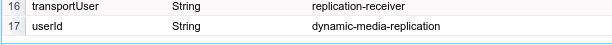

# Konfigurieren von Dynamic Media - Hybridmodus {#configuring-dynamic-media-hybrid-mode}

Dynamic Media-Hybrid muss aktiviert und für die Verwendung konfiguriert sein. Je nach Anwendungsfall verfügt Dynamic Media über mehrere [unterstützte Konfigurationen](#supported-dynamic-media-configurations).

>[!NOTE]
>
>Wenn Sie Dynamic Media im Scene7-Ausführungsmodus konfigurieren und ausführen möchten, finden Sie weitere Informationen unter [Dynamic Media - Scene7-Modus konfigurieren](/help/assets/config-dms7.md).
>
>Wenn Sie Dynamic Media im Hybridmodus konfigurieren und ausführen möchten, folgen Sie den Anweisungen auf dieser Seite.

Informieren Sie sich über die Verwendung von [Videos](/help/assets/video.md) in Dynamic Media.

>[!NOTE]
>
>Wenn Sie Adobe Experience Manager für verschiedene Umgebungen einrichten, z. B. für Entwicklung, Staging und Live-Produktion, konfigurieren Sie Dynamic Media-Cloud Services für jede Umgebung.

>[!NOTE]
>
>Wenn Sie Probleme mit Ihrer Dynamic Media-Konfiguration haben, sehen Sie sich die für Dynamic Media spezifischen Protokolldateien an. Diese Dateien werden automatisch installiert, wenn Sie Dynamic Media aktivieren:
>
>* `s7access.log`
>* `ImageServing.log`

>
>
Sie werden unter [Überwachen und Verwalten Ihrer Experience Manager-Instanz](/help/sites-deploying/monitoring-and-maintaining.md) dokumentiert.

Die hybride Veröffentlichung und Bereitstellung ist eine Kernfunktion der Erweiterung Dynamic Media für Adobe Experience Manager. Mit der Hybrid-Veröffentlichung können Sie Dynamic Media-Assets wie Bilder, Sets und Videos aus der Cloud und nicht aus den Experience Manager-Veröffentlichungsknoten bereitstellen.

Andere Inhalte wie Dynamic Media-Viewer, Site-Seiten und statische Inhalte werden weiterhin von den Veröffentlichungsknoten des Experience Managers bereitgestellt.

Wenn Sie Dynamic Media-Kunde sind, müssen Sie Hybridlieferungen als Bereitstellungsmechanismus für alle Dynamic Media-Inhalte verwenden.

## Hybride Veröffentlichungsarchitektur für Videos {#hybrid-publishing-architecture-for-videos}


## Hybride Veröffentlichungsarchitektur für Bilder {#hybrid-publishing-architecture-for-images}


## Unterstützte Dynamic Media-Konfigurationen {#supported-dynamic-media-configurations}

In den folgenden Konfigurationsaufgaben werden die hier angegebenen Begriffe verwendet:

| **Begriff** | **Dynamic Media aktiviert** | **Beschreibung** |
|---|---|---|
| Experience Manager-Autorenknoten | Weißes Häkchen in einem grünen Kreis | Der Autorknoten, den Sie On-Premise oder über Managed Services bereitstellen. |
| Veröffentlichungsknoten des Experience Managers | Weißes X in einem roten Quadrat. | Der Veröffentlichungsknoten, den Sie On-Premise oder über Managed Services bereitstellen. |
| Veröffentlichungsknoten des Bilddienstes | Weißes Häkchen in einem grünen Kreis. | Der Veröffentlichungsknoten, den Sie in Rechenzentren ausführen, die von Adobe verwaltet werden. Bezieht sich auf die Bilddienst-URL. |

Sie können Dynamic Media nur für die Bildbearbeitung, nur für Videos oder für Bildbearbeitung und Videos implementieren. Informationen zur Konfiguration von Dynamic Media für Ihr spezifisches Szenario finden Sie in der folgenden Tabelle.

<table>
 <tbody>
  <tr>
   <td><strong>Szenario</strong></td>
   <td ><strong>Funktionsweise</strong></td>
   <td><strong>Konfigurationsschritte</strong></td>
  </tr>
  <tr>
   <td>NUR Bilder in Produktion bereitstellen</td>
   <td>Bilder werden über Server in den weltweiten Datenzentren von Adobe bereitgestellt und dann per CDN zwischengespeichert, um eine skalierbare Leistung und globale Reichweite zu erzielen.</td>
   <td>
    <ol>
     <li>Aktivieren Sie im Experience Manager <strong>author</strong> den Knoten <a href="#enabling-dynamic-media">Dynamic Media</a>.</li>
     <li>Konfigurieren Sie die Bildbearbeitung unter <a href="#configuring-dynamic-media-cloud-services">Dynamic Media Cloud Services</a>.</li>
     <li><a href="#configuring-image-replication">Konfigurieren Sie die Bildreplikation</a>.</li>
     <li><a href="#replicating-catalog-settings">Replizieren Sie Katalogeinstellungen</a>.</li>
     <li><a href="#replicating-viewer-presets">Replizieren Sie Viewer-Vorgaben</a>.</li>
     <li><a href="#using-default-asset-filters-for-replication">Verwenden Sie Asset-Standardfilter für die Replikation</a>.</li>
     <li><a href="#configuring-dynamic-media-image-server-settings">Konfigurieren Sie Dynamic Media-Bildserver-Einstellungen</a>.</li>
     <li><a href="#delivering-assets">Stellen Sie Assets bereit</a>.</li>
    </ol> </td>
  </tr>
  <tr>
   <td>NUR Bilder in der Phase vor der Produktion bereitstellen (Entwicklung, QE, Bühne etc.)</td>
   <td>Bilder werden über den Veröffentlichungsknoten des Experience Managers bereitgestellt. In diesem Fall ist es aufgrund des minimalen Traffics nicht erforderlich, Bilder an das Rechenzentrum von Adobe zu senden. Und es ermöglicht eine sichere Vorschau von Inhalten vor dem Start der Produktion.</td>
   <td>
    <ol>
     <li>Aktivieren Sie im Experience Manager <strong>author</strong> den Knoten <a href="#enabling-dynamic-media">Dynamic Media</a>.</li>
     <li>Aktivieren Sie auf dem Experience Manager <strong>publish</strong> den Knoten <a href="#enabling-dynamic-media">Dynamic Media</a>.</li>
     <li><a href="#replicating-viewer-presets">Replizieren Sie Viewer-Vorgaben</a>.</li>
     <li>Richten Sie <a href="#setting-up-asset-filters-for-imaging-in-non-production-deployments">Asset-Filter für nicht für die Produktion bestimmte Bilder</a> ein.</li>
     <li><a href="#configuring-dynamic-media-image-server-settings">Konfigurieren Sie Dynamic Media-Bildserver-Einstellungen.</a></li>
     <li><a href="#delivering-assets">Stellen Sie Assets bereit.</a></li>
    </ol> </td>
  </tr>
  <tr>
   <td>NUR Videos in allen Umgebungen bereitstellen (Produktion, Entwicklung, QE, Bühne usw.)</td>
   <td>Videos werden vom CDN für skalierbare Leistung und eine globale Reichweite bereitgestellt und zwischengespeichert. Das Videobild (Miniaturansicht des Videos, das vor dem Start der Wiedergabe angezeigt wird) wird von der Experience Manager-Veröffentlichungsinstanz bereitgestellt.</td>
   <td>
    <ol>
     <li>Aktivieren Sie im Experience Manager <strong>author</strong> den Knoten <a href="#enabling-dynamic-media">Dynamic Media</a>.</li>
     <li>Aktivieren Sie auf dem Experience Manager <strong>publish</strong> den Knoten <a href="#enabling-dynamic-media">Dynamic Media</a> (die Veröffentlichungsinstanz stellt das Videobild bereit und bietet Metadaten für die Videowiedergabe).</li>
     <li>Konfigurieren Sie Videos unter <a href="#configuring-dynamic-media-cloud-services">Dynamic Media Cloud Services</a>.</li>
     <li><a href="#replicating-viewer-presets">Replizieren Sie Viewer-Vorgaben</a>.</li>
     <li>Richten Sie <a href="#setting-up-asset-filters-for-video-only-deployments">Asset-Filter für Videos</a> ein.</li>
     <li><a href="#delivering-assets">Stellen Sie Assets bereit.</a></li>
    </ol> </td>
  </tr>
  <tr>
   <td>Bilder UND Videos in Produktion bereitstellen</td>
   <td><p>Videos werden vom CDN für skalierbare Leistung und eine globale Reichweite bereitgestellt und zwischengespeichert. Bilder und Video-Posterbilder werden über Server in den weltweiten Datenzentren von Adobe bereitgestellt und dann per CDN zwischengespeichert, um eine skalierbare Leistung und globale Reichweite zu erzielen.</p> <p>Informationen zum Einrichten von Bildern oder Videos in der Vorproduktionsphase finden Sie in den vorherigen Abschnitten. </p> </td>
   <td>
    <ol>
     <li>Aktivieren Sie im Experience Manager <strong>author</strong> den Knoten <a href="#enabling-dynamic-media">Dynamic Media</a>.</li>
     <li>Konfigurieren Sie Videos unter <a href="#configuring-dynamic-media-cloud-services">Dynamic Media Cloud Services</a>.</li>
     <li>Konfigurieren Sie die Bildbearbeitung unter <a href="#configuring-dynamic-media-cloud-services">Dynamic Media Cloud Services</a>.</li>
     <li><a href="#configuring-image-replication">Konfigurieren Sie die Bildreplikation</a>.</li>
     <li><a href="#replicating-catalog-settings">Replizieren Sie Katalogeinstellungen</a>.</li>
     <li><a href="#replicating-viewer-presets">Replizieren Sie Viewer-Vorgaben</a>.</li>
     <li><a href="#using-default-asset-filters-for-replication">Verwenden Sie Asset-Standardfilter für die Replikation.</a></li>
     <li><a href="#configuring-dynamic-media-image-server-settings">Konfigurieren Sie Dynamic Media-Bildserver-Einstellungen.</a></li>
     <li><a href="#delivering-assets">Stellen Sie Assets bereit.</a></li>
    </ol> </td>
  </tr>
 </tbody>
</table>

## Dynamic Media aktivieren {#enabling-dynamic-media}

[Dynamic Media ist standardmäßig deaktiviert. ](https://business.adobe.com/de/products/experience-manager/assets/dynamic-media.html) Um die Funktionen von Dynamic Media nutzen zu können, müssen Sie Dynamic Media mit dem Ausführungsmodus `dynamicmedia` aktivieren, wie Sie es beispielsweise mit dem Ausführungsmodus `publish` tun würden. Prüfen Sie vor dem Aktivieren die [technischen Anforderungen](/help/sites-deploying/technical-requirements.md#requirements-for-aem-dynamic-media-add-on).

>[!NOTE]
>
>Die Aktivierung von Dynamic Media über den Ausführungsmodus ersetzt die Funktionalität in Experience Manager 6.1 und Experience Manager 6.0, in dem Sie Dynamic Media aktiviert haben, indem Sie die `dynamicMediaEnabled` -Markierung auf **[!UICONTROL true]** setzen. Dieses Flag bietet keine Funktionen in Experience Manager 6.2 und höher. Außerdem müssen Sie den Schnellstart nicht neu starten, um Dynamic Media zu aktivieren.

Durch Aktivierung von Dynamic Media sind die Dynamic Media-Funktionen in der Benutzeroberfläche verfügbar. Jedes hochgeladene Bild-Asset erhält ein *cqdam.pyramid.tiff* -Ausgabeformat, das für die schnelle Bereitstellung dynamischer Bilddarstellungen verwendet wird. Diese PTIFF-Dateien haben erhebliche Vorteile wie die folgenden:

* Die Möglichkeit, nur ein einzelnes Primärbild zu verwalten und unendliche Ausgabeformate ohne zusätzlichen Speicher sofort zu generieren.
* Die Möglichkeit zur Verwendung interaktiver Visualisierungen wie Zoom, Schwenken und Drehen.

Wenn Sie Dynamic Media Classic in Experience Manager verwenden möchten, aktivieren Sie Dynamic Media nur, wenn Sie ein [spezifisches Szenario](/help/sites-administering/scene7.md#aem-scene-integration-versus-dynamic-media) verwenden. Dynamic Media ist deaktiviert, es sei denn, Sie aktivieren Dynamic Media über den Ausführungsmodus.

Um Dynamic Media zu aktivieren, müssen Sie den Dynamic Media-Ausführungsmodus entweder über die Befehlszeile oder über den Namen der Schnellstartdatei aktivieren.

**So aktivieren Sie Dynamic Media:**

1. In der Befehlszeile haben Sie nach dem Starten des Schnellstartvorgangs die folgenden Möglichkeiten:

   * Fügen Sie beim Starten der JAR-Datei `-r dynamicmedia` am Ende der Befehlszeile hinzu.

   ```shell
   java -Xmx4096m -Doak.queryLimitInMemory=500000 -Doak.queryLimitReads=500000 -jar cq-quickstart-6.5.0.jar -r dynamicmedia
   ```

   Wenn Sie in s7delivery veröffentlichen, müssen Sie auch die folgenden trustStore-Argumente einbeziehen:

   ```
   -Djavax.net.ssl.trustStore=<absoluteFilePath>/customerTrustStoreFileName>
   
    -Djavax.net.ssl.trustStorePassword=<passwordForTrustStoreFile>
   ```

1. Fordern Sie `https://localhost:4502/is/image` an und stellen Sie sicher, dass Image Server jetzt ausgeführt wird.

   >[!NOTE]
   >
   >Informationen zur Fehlerbehebung bei Problemen mit Dynamic Media finden Sie in den folgenden Protokollen im Verzeichnis `crx-quickstart/logs/` :
   >
   >* ImageServer-&lt;PortId>-&lt;JJJJ>&lt;MM>&lt;TT>.log - Das ImageServer-Protokoll stellt Statistiken und analytische Informationen bereit, die zur Analyse des Verhaltens des internen ImageServer-Prozesses verwendet werden.

   Beispiel eines Image Server-Protokolldateinamens: `ImageServer-57346-2020-07-25.log`
   * s7access-&lt;jjjj>&lt;mm>&lt;tt>.log - Das s7access-Protokoll zeichnet alle Anfragen auf, die über `/is/image` und `/is/content` an Dynamic Media gesendet werden.

   Diese Protokolle werden nur verwendet, wenn Dynamic Media aktiviert ist. Sie sind nicht im Paket **Download Full** enthalten, das von der Seite `system/console/status-Bundlelist` generiert wird. Wenn Sie den Kundensupport aufrufen, wenn bei Ihnen ein Dynamic Media-Problem vorliegt, hängen Sie beide Protokolle an das Problem an.

### Wenn Sie Experience Manager in einen anderen Port oder Kontextpfad installiert haben ... {#if-you-installed-aem-to-a-different-port-or-context-path}

Wenn Sie den Experience Manager [auf einem Anwendungsserver](/help/sites-deploying/application-server-install.md) bereitstellen und Dynamic Media aktiviert haben, müssen Sie die Domäne **self-domain** im Externalizer konfigurieren. Andernfalls funktioniert die Erstellung von Miniaturansichten für Assets nicht ordnungsgemäß für Dynamic Media-Assets.

Wenn Sie Quickstart außerdem an einem anderen Port oder Kontextpfad ausführen, müssen Sie auch die Domäne **self-domain** ändern.

Wenn Dynamic Media aktiviert ist, werden die statischen Miniaturansicht-Wiedergabeformate für Bild-Assets mit Dynamic Media generiert. Damit die Erstellung von Miniaturansichten für Dynamic Media ordnungsgemäß funktioniert, muss der Experience Manager eine URL-Anfrage an sich selbst richten und sowohl die Portnummer als auch den Kontextpfad kennen.

Im Experience Manager:

* Die **self-domain** im [Externalizer](/help/sites-developing/externalizer.md) wird verwendet, um sowohl die Portnummer als auch den Kontextpfad abzurufen.
* Wenn keine **self-domain** konfiguriert ist, werden die Portnummer und der Kontextpfad vom Jetty-HTTP-Dienst abgerufen.

In einer Experience Manager QuickStart-WAR-Bereitstellung können die Portnummer und der Kontextpfad nicht abgeleitet werden. Daher müssen Sie eine **self-domain** konfigurieren. Siehe [Externalizer-Dokumentation](/help/sites-developing/externalizer.md) zur Konfiguration der **Selbsthandlung**.

>[!NOTE]
In einer [Experience Manager-Schnellstart-eigenständigen Bereitstellung](/help/sites-deploying/deploy.md) muss eine **Self-Domain** im Allgemeinen nicht konfiguriert werden, da die Portnummer und der Kontextpfad automatisch konfiguriert werden können. Wenn jedoch alle Netzwerkschnittstellen deaktiviert sind, müssen Sie die Domäne **self-domain** konfigurieren.

## Dynamic Media deaktivieren  {#disabling-dynamic-media}

Dynamic Media ist standardmäßig nicht aktiviert. Wenn Sie Dynamic Media jedoch bereits aktiviert haben, können Sie es später deaktivieren.

Um Dynamic Media zu deaktivieren, nachdem Sie es aktiviert haben, entfernen Sie das Ausführungsmodus-Flag `-r dynamicmedia`.

**So deaktivieren Sie Dynamic Media:**

1. In der Befehlszeile haben Sie nach dem Starten des Schnellstartvorgangs die beiden folgenden Möglichkeiten:

   * Fügen Sie beim Starten der JAR-Datei nicht `-r dynamicmedia` zur Befehlszeile hinzu.

   ```shell
   java -Xmx4096m -Doak.queryLimitInMemory=500000 -Doak.queryLimitReads=500000 -jar cq-quickstart-6.5.0.jar
   ```

1. Anfrage `https://localhost:4502/is/image`. Sie erhalten eine Nachricht, dass Dynamic Media deaktiviert wurde.

   >[!NOTE]
   Nachdem der Dynamic Media-Ausführungsmodus deaktiviert wurde, wird der Workflow-Schritt, der das Ausgabeformat `cqdam.pyramid.tiff` generiert, automatisch übersprungen. Außerdem werden die Unterstützung für dynamische Ausgabedarstellungen und andere Dynamic Media-Funktionen deaktiviert.
   Beachten Sie außerdem, dass beim Deaktivieren des Dynamic Media-Ausführungsmodus nach der Konfiguration des Experience Manager-Servers alle Assets, die unter diesem Ausführungsmodus hochgeladen wurden, jetzt ungültig sind.

## (Optional) Migrieren von Dynamic Media-Vorgaben und -Konfigurationen von 6.3 auf 6.5 ohne Ausfallzeit {#optional-migrating-dynamic-media-presets-and-configurations-from-to-zero-downtime}

Wenn Sie ein Upgrade von Experience Manager - Dynamic Media von 6.3 auf 6.5 durchführen (was jetzt die Möglichkeit bietet, keine Ausfallzeiten zu erzielen), müssen Sie den folgenden curl-Befehl ausführen. Der -Befehl migriert alle Ihre Vorgaben und Konfigurationen in CRXDE Lite von `/etc` zu `/conf`.

>[!NOTE]
Wenn Sie Ihre Experience Manager-Instanz im Kompatibilitätsmodus ausführen - d. h. das Kompatibilitätspaket installiert ist - müssen Sie diese Befehle nicht ausführen.

Bei allen Upgrades, mit oder ohne Kompatibilitätspaket, können Sie die standardmäßigen Viewer-Vorgaben kopieren, die ursprünglich mit Dynamic Media geliefert wurden, indem Sie den folgenden Linux® curl-Befehl ausführen:

`curl -u admin:admin -X POST https://<server_address>:<server_port>/libs/settings/dam/dm/presets/viewer.pushviewerpresets.json`

Um benutzerdefinierte Viewer-Vorgaben und Konfigurationen zu migrieren, die Sie von `/etc` auf `/conf` erstellt haben, führen Sie den folgenden Linux® curl-Befehl aus:

`curl -u admin:admin -X POST https://<server_address>:<server_port>/libs/settings/dam/dm/presets.migratedmcontent.json`

## Konfigurieren Sie die Bildreplikation {#configuring-image-replication}

Die Dynamic Media-Bildbereitstellung funktioniert durch die Veröffentlichung von Bild-Assets, einschließlich Videominiaturen, aus der Experience Manager-Autoreninstanz und die Replikation dieser Assets auf den On-Demand-Replikationsdienst der Adobe (die Replikationsdienst-URL). Assets werden dann über den On-Demand-Bildbereitstellungsdienst (die Image Service-URL) bereitgestellt.

Gehen Sie folgendermaßen vor:

1. [Einrichten der Authentifizierung](#setting-up-authentication).
1. [Konfigurieren Sie den Replikationsagenten](#configuring-the-replication-agent).

Der Replikationsagent veröffentlicht Dynamic Media-Assets wie Bilder, Videometadaten und Sets auf den von der Adobe gehosteten Bilddienst. Der Replikationsagent ist nicht standardmäßig aktiviert.

Nachdem Sie den Replikationsagenten konfiguriert haben, müssen Sie [überprüfen und testen, ob er erfolgreich eingerichtet wurde](#validating-the-replication-agent-for-dynamic-media). In diesem Abschnitt wird die Vorgehensweise beschrieben.

>[!NOTE]
Die standardmäßige Speicherbegrenzung für die PTIFF-Erstellung beträgt für alle Workflows 3 GB. Beispielsweise können Sie ein Bild verarbeiten, für das 3 GB Speicher erforderlich sind, während andere Workflows angehalten werden, oder Sie können zehn Bilder parallel verarbeiten, die jeweils 300 MB Speicher erfordern.
Die Speicherbegrenzung ist konfigurierbar und entspricht der Verfügbarkeit der Systemressourcen und dem Typ des verarbeiteten Bildinhalts. Wenn Sie viele große Assets haben und genügend Speicher im System haben, können Sie diese Grenze erhöhen, um sicherzustellen, dass die Bilder parallel verarbeitet werden.
Ein Bild, das mehr als die maximale Speicherbegrenzung erfordert, wird abgelehnt.
Navigieren Sie zum Ändern der Speicherbegrenzung für die PTIFF-Erstellung zu **[!UICONTROL Tools]** > **[!UICONTROL Vorgänge]** > **[!UICONTROL Web-Konsole]** > **[!UICONTROL Adobe CQ Scene7 PTiffManager]** und ändern Sie den Wert **[!UICONTROL maxMemory]**.

### Authentifizierung einrichten {#setting-up-authentication}

Richten Sie die Replikationsauthentifizierung auf der Autoreninstanz ein, damit Sie Bilder für den Dynamic Media-Bildbereitstellungsdienst replizieren können. Sie erhalten zunächst einen KeyStore, speichern ihn dann unter dem Benutzer **[!UICONTROL dynamic-media-replication]** und konfigurieren ihn. Ihr Unternehmensadministrator hat während des Bereitstellungsprozesses eine Begrüßungs-E-Mail mit der KeyStore-Datei und den erforderlichen Anmeldeinformationen erhalten. Wenn Sie diese Informationen nicht erhalten haben, wenden Sie sich an die Kundenunterstützung von Adobe.

**Gehen Sie wie folgt vor, um die Authentifizierung einzurichten:**

1. Wenden Sie sich an die Kundenunterstützung von Adobe, wenn Sie noch nicht über die Datei und das Kennwort verfügen. Diese Informationen sind ein notwendiger Teil der Bereitstellung. Die Schlüssel werden Ihrem Konto zugeordnet.

1. Wählen Sie in Experience Manager das Experience Manager-Logo aus, um auf die globale Navigationskonsole zuzugreifen, und navigieren Sie dann zu **[!UICONTROL Tools]** > **[!UICONTROL Sicherheit]** > **[!UICONTROL Benutzer]**.

1. Navigieren Sie auf der Seite Benutzerverwaltung zum Benutzer **[!UICONTROL dynamic-media-replication]** und wählen Sie zum Öffnen aus.

   

1. Wählen Sie auf der Seite Benutzereinstellungen für dynamic-media-replication bearbeiten die Registerkarte **[!UICONTROL Keystore]** und dann **[!UICONTROL KeyStore erstellen]**.

   

1. Geben Sie im Dialogfeld **[!UICONTROL Zugangskennwort für KeyStore festlegen]** ein Kennwort ein und bestätigen Sie es.

   >[!NOTE]
   Denken Sie an das Kennwort, da Sie es erneut eingeben müssen, wenn Sie den Replikationsagenten später konfigurieren.

   

1. Erweitern Sie auf der Seite **[!UICONTROL Benutzereinstellungen für dynamic-media-replication bearbeiten]** den Bereich **Privaten Schlüssel aus KeyStore-Datei hinzufügen** und fügen Sie Folgendes ein (siehe folgende Abbildungen):

   * Geben Sie im Feld **[!UICONTROL Neuer Alias]** den Namen eines Alias ein, den Sie später in der Replikationskonfiguration verwenden möchten. Sie können beispielsweise `replication` als Alias verwenden.
   * Wählen Sie **[!UICONTROL KeyStore-Datei]** aus. Navigieren Sie zur KeyStore-Datei, die Sie nach Adobe erhalten haben, wählen Sie sie aus und klicken Sie auf **[!UICONTROL Öffnen]**.
   * Geben Sie im Feld **[!UICONTROL KeyStore File Password]** das Kennwort für die KeyStore-Datei ein. Dieses Kennwort ist **nicht** das KeyStore-Kennwort, das Sie in Schritt 5 erstellt haben. Es ist jedoch die KeyStore-Adobe für Dateikennwörter, die in der Begrüßungs-E-Mail enthalten ist, die Sie während der Bereitstellung erhalten haben. Wenden Sie sich an die Kundenunterstützung von Adobe, um Ihre KeyStore-Datei und das dazugehörige Kennwort zu erhalten (falls noch nicht vorhanden).
   * Geben Sie im Feld **[!UICONTROL Passwort für privaten Schlüssel]** das Kennwort für den privaten Schlüssel ein (es kann sich um dasselbe Kennwort für den privaten Schlüssel handeln, das im vorherigen Schritt bereitgestellt wurde). Das Kennwort für den privaten Schlüssel ist in der Begrüßungs-E-Mail von Adobe enthalten, die während der Bereitstellung an Sie gesendet wird. Nehmen Sie Kontakt mit der Kundenunterstützung von Adobe auf, falls Sie kein Kennwort für den privaten Schlüssel erhalten haben.
   * Geben Sie im Feld **[!UICONTROL Alias für privaten Schlüssel]** den Alias für den privaten Schlüssel ein. Beispiel: `*companyname*-alias`. Der Alias für den privaten Schlüssel ist in der Begrüßungs-E-Mail von Adobe enthalten, die während der Bereitstellung an Sie gesendet wird. Nehmen Sie Kontakt mit der Kundenunterstützung von Adobe auf, falls Sie keinen Alias für den privaten Schlüssel erhalten haben.

   

1. Wählen Sie **[!UICONTROL Speichern und schließen]** aus, um Ihre Änderungen für diesen Benutzer zu speichern.

   Als Nächstes müssen Sie [den Replikationsagenten](#configuring-the-replication-agent) konfigurieren.

### Konfigurieren des Replikationsagenten {#configuring-the-replication-agent}

1. Wählen Sie in Experience Manager das Experience Manager-Logo aus, um auf die globale Navigationskonsole zuzugreifen, und navigieren Sie dann zu **[!UICONTROL Tools]** > **[!UICONTROL Bereitstellung]** > **[!UICONTROL Replikation]** > **[!UICONTROL Agenten für Autor]**.
1. Wählen Sie auf der Seite &quot;Agenten für Autor&quot;die Option **[!UICONTROL Dynamic Media Hybrid-Bildreplikation (s7delivery)]**.
1. Wählen Sie **[!UICONTROL Bearbeiten]** aus.
1. Wählen Sie die Registerkarte **[!UICONTROL Einstellungen]** und geben Sie dann Folgendes ein:

   * **[!UICONTROL Aktiviert]**: Aktivieren Sie dieses Kontrollkästchen, um den Replikationsagenten zu aktivieren.
   * **[!UICONTROL Region]**  - Auf die entsprechende Region eingestellt: Nordamerika, Europa oder Asien
   * **[!UICONTROL Mandantenkennung]**  - Dieser Wert ist der Name Ihres Unternehmens/Mandanten, das/der im Replikationsdienst veröffentlicht wird. Dieser Wert ist die Mandantenkennung, die die Adobe in der Begrüßungs-E-Mail bereitstellt, die Ihnen während der Bereitstellung gesendet wird. Wenn Sie diese Informationen nicht erhalten haben, wenden Sie sich an die Kundenunterstützung von Adobe.
   * **[!UICONTROL Key Store Alias]**  - Dieser Wert entspricht dem  **neuen** Aliaswert, der beim Generieren des Schlüssels in  [Einrichten der Authentifizierung](#setting-up-authentication) festgelegt wurde. z. B.  `replication`. (Siehe Schritt 7 unter [Einrichten der Authentifizierung](#setting-up-authentication).)
   * **[!UICONTROL Key Store Password]**  - Das KeyStore-Kennwort, das erstellt wurde, als Sie auf KeyStore  **[!UICONTROL erstellen tippen]**. Dieses Kennwort wird nicht von Adobe bereitgestellt. Siehe Schritt 5 von [Einrichten der Authentifizierung](#setting-up-authentication).

   In der folgenden Abbildung ist der Replikationsagent mit Beispieldaten dargestellt:

   

1. Wählen Sie **[!UICONTROL OK]** aus.

### Überprüfen des Replikationsagenten für Dynamic Media {#validating-the-replication-agent-for-dynamic-media}

Gehen Sie wie folgt vor, um den Replikationsagenten für Dynamic Media zu validieren:

Wählen Sie **[!UICONTROL Verbindung testen]** aus. Die Beispielausgabe lautet wie folgt:

```shell
11.03.2016 10:57:55 - Transferring content for ReplicationAction{type=TEST, path[0]='/content/dam', time=1457722675402, userId='admin', revision='null'}
11.03.2016 10:57:55 - * Auth User: replication-receiver
11.03.2016 10:57:55 - * HTTP Version: 1.1
11.03.2016 10:57:55 - * Using OAuth 2.0 Authorization Grants
11.03.2016 10:57:55 - * OAuth 2.0 User: dynamic-media-replication
11.03.2016 10:57:55 - * OAuth 2.0 Token: '*****' initialized
11.03.2016 10:57:55 - Publishing: POST[https://replicate-na.assetsadobe.com:8580/is-publish/publish-receiver?Cmd=Test&RootId=xfpuu-6613]
11.03.2016 10:57:55 - Publish response: OK[]
11.03.2016 10:57:55 - Transfer succeeded in 141 ms for ReplicationAction{type=TEST, path[0]='/content/dam', time=1457722675402, userId='admin', revision='null'}
-------------------------------------------------------------------------------------------------------------------------------
Replication test succeeded
```

>[!NOTE]
Sie können die Überprüfung auch durchführen, indem Sie einen der folgenden Schritte ausführen:
* Überprüfen Sie die Replikationsprotokolle, um sicherzustellen, dass das Asset repliziert wird.
* Veröffentlichen Sie ein Bild. Wählen Sie das Bild aus, wählen Sie **[!UICONTROL Viewer]** aus dem Dropdown-Menü und wählen Sie dann eine Viewer-Vorgabe aus. Wählen Sie **[!UICONTROL URL]** aus. Um sicherzustellen, dass das Bild angezeigt wird, kopieren Sie den URL-Pfad und fügen Sie ihn in den Browser ein.


### Fehlerbehebung bei der Authentifizierung {#troubleshooting-authentication}

Beim Einrichten der Authentifizierung gibt es einige Probleme, auf die Sie mit ihren Lösungen stoßen können. Stellen Sie vor der Überprüfung auf diese Probleme sicher, dass Sie die Replikation eingerichtet haben.

#### Problem: HTTP-Statuscode 401 mit der Meldung „Authorization Required“ (Autorisierung erforderlich) {#problem-http-status-code-with-message-authorization-required}

Dieses Problem kann auftreten, wenn der KeyStore für den Benutzer `dynamic-media-replication` nicht eingerichtet wurde.

```shell
Replication test to s7delivery:https://s7bern.macromedia.com:8580/is-publish/
17.06.2016 18:54:43 - Transferring content for ReplicationAction{type=TEST, path[0]='/content/dam', time=1466214883309, userId='admin', revision='null'}
17.06.2016 18:54:43 - * Auth User: replication-receiver
17.06.2016 18:54:43 - * HTTP Version: 1.1
17.06.2016 18:54:43 - * Using OAuth 2.0 Authorization Grants
17.06.2016 18:54:43 - * OAuth 2.0 User: dynamic-media-replication
17.06.2016 18:54:43 - No OAuth token available. OAuth not initialized
17.06.2016 18:54:43 - * Using Client Auth SSL alias - replication-alias *
17.06.2016 18:54:43 - Publishing: POST[https://<localhost>:8580/is-publish//publish-receiver?Cmd=Test&RootId=brough]
17.06.2016 18:54:43 - Transfer failed for ReplicationAction{type=TEST, path[0]='/content/dam', time=1466214883309, userId='admin', revision='null'}. java.io.IOException: Failed to execute request
'https://<localhost>:8580/is-publish//publish-receiver?Cmd=Test&RootId=brough':
 Server returned status code 401 with message: Authorization required.
17.06.2016 18:54:43 - Error while replicating: com.day.cq.replication.ReplicationException: Transfer failed for ReplicationAction{type=TEST, path[0]='/content/dam', time=1466214883309,
 userId='admin', revision='null'}. java.io.IOException: Failed to execute request
'https://<localhost>:8580/is-publish//publish-receiver?Cmd=Test&RootId=brough':
 Server returned status code 401 with message: Authorization required.
```

**Lösung:**
Überprüfen Sie, ob  `KeyStore` der Ordner unter  **dynamic-media-replicationuser gespeichert** wird und das richtige Kennwort angegeben ist.

#### Problem: Schlüssel kann nicht entschlüsselt werden – Daten können nicht entschlüsselt werden {#problem-could-not-decrypt-key-could-not-decrypt-data}

```xml
Replication test to s7delivery:https://<localhost>:8580/is-publish/
17.06.2016 19:00:16 - Transferring content for ReplicationAction{type=TEST, path[0]='/content/dam', time=1466215216662, userId='admin', revision='null'}
17.06.2016 19:00:16 - * Auth User: replication-receiver
17.06.2016 19:00:16 - * HTTP Version: 1.1
17.06.2016 19:00:16 - * Using OAuth 2.0 Authorization Grants
17.06.2016 19:00:16 - * OAuth 2.0 User: dynamic-media-replication
17.06.2016 19:00:16 - No OAuth token available. OAuth not initialized
17.06.2016 19:00:16 - * Using Client Auth SSL alias - replication-alias *
17.06.2016 19:00:16 - Transfer failed for ReplicationAction{type=TEST, path[0]='/content/dam', time=1466215216662, userId='admin', revision='null'}. java.lang.SecurityException: java.security.UnrecoverableKeyException: Could not decrypt key: Could not decrypt data.
```

**Lösung:**
Überprüfen Sie das Kennwort. Das im Replikationsagenten gespeicherte Kennwort entspricht nicht dem Kennwort, das zum Erstellen des KeyStore verwendet wurde.

#### Problem: InvalidAlgorithmParameterException {#problem-invalidalgorithmparameterexception}

Dieses Problem wird durch einen Konfigurationsfehler in Ihrer Experience Manager-Autoreninstanz verursacht. Der Java™-Prozess auf der Autoreninstanz erhält nicht die richtige `javax.net.ssl.trustStore`. Dieser Fehler ist im Replikationsprotokoll enthalten:

```shell
14.04.2016 09:37:43 - Transfer failed for ReplicationAction{type=TEST, path[0]='/content/dam', time=1460651862089, userId='admin', revision='null'}. java.io.IOException: Failed to execute request 'https://<localhost>:8580/is-publish/publish-receiver?Cmd=Test&RootId=rbrough-osx2': java.lang.RuntimeException: Unexpected error: java.security.InvalidAlgorithmParameterException: the trustAnchors parameter must be non-empty
14.04.2016 09:37:43 - Error while replicating: com.day.cq.replication.ReplicationException: Transfer failed for ReplicationAction{type=TEST, path[0]='/content/dam', time=1460651862089, userId='admin', revision='null'}. java.io.IOException: Failed to execute request 'https://<localhost>:8580/is-publish/publish-receiver?Cmd=Test&RootId=rbrough-osx2': java.lang.RuntimeException: Unexpected error: java.security.InvalidAlgorithmParameterException: the trustAnchors parameter must be non-empty
```

Oder im Fehlerprotokoll:

```shell
07.25.2019 12:00:59.893 *ERROR* [sling-threadpool-db2763bb-bc50-4bb5-bb64-10a09f432712-(apache-sling-job-thread-pool)-90-com_day_cq_replication_job_s7delivery(com/day/cq/replication/job/s7delivery)] com.day.cq.replication.Agent.s7delivery.queue Error during processing of replication.

java.io.IOException: Failed to execute request 'https://replicate-na.assetsadobe.com:8580/is-publish/publish-receiver?Cmd=Test&RootId=rbrough-osx': java.lang.RuntimeException: Unexpected error: java.security.InvalidAlgorithmParameterException: the trustAnchors parameter must be non-empty
        at com.scene7.is.catalog.service.publish.atomic.PublishingServiceHttp.executePost(PublishingServiceHttp.scala:195)
```

**Lösung:**
Stellen Sie sicher, dass die Systemeigenschaft für den Java™-Prozess auf der Experience Manager-Autoreninstanz auf einen gültigen Truststore  `-Djavax.net.ssl.trustStore=` festgelegt ist.

#### Problem: KeyStore ist entweder nicht eingerichtet oder nicht initialisiert {#problem-keystore-is-either-not-set-up-or-it-is-not-initialized}

Dieses Problem wird wahrscheinlich durch einen Hotfix oder ein Feature Pack verursacht, das den Knoten dynamic-media-user oder keystore überschreibt.

Beispiel für Replikationsprotokoll:

```shell
Replication test to s7delivery:https://replicate-na.assetsadobe.com/is-publish
02.08.2016 14:37:44 - Transferring content for ReplicationAction{type=TEST, path[0]='/content/dam', time=1470173864834, userId='admin', revision='null'}
02.08.2016 14:37:44 - * Auth User: replication-receiver
02.08.2016 14:37:44 - * HTTP Version: 1.1
02.08.2016 14:37:44 - * Using OAuth 2.0 Authorization Grants
02.08.2016 14:37:44 - * OAuth 2.0 User: dynamic-media-replication
02.08.2016 14:37:44 - Transfer failed for ReplicationAction{type=TEST, path[0]='/content/dam', time=1470173864834, userId='admin', revision='null'}. com.adobe.granite.keystore.KeyStoreNotInitialisedException: Uninitialised key store for user dynamic-media-replication
```

**Lösung:**

1. Navigieren Sie zur Seite Benutzerverwaltung :
   `localhost:4502/libs/granite/security/content/useradmin.html`
1. Navigieren Sie auf der Seite Benutzerverwaltung zum Benutzer `dynamic-media-replication` und wählen Sie aus, um ihn zu öffnen.
1. Wählen Sie die Registerkarte **[!UICONTROL KeyStore]** aus. Wenn die Schaltfläche **[!UICONTROL KeyStore erstellen]** angezeigt wird, müssen Sie die Schritte unter [Einrichten der Authentifizierung](#setting-up-authentication) wiederholen.
1. Wenn Sie das KeyStore-Setup wiederholen mussten, müssen Sie auch [den Replikationsagenten](/help/assets/config-dynamic.md#configuring-the-replication-agent) erneut konfigurieren.

   Konfigurieren Sie den s7delivery-Replikationsagenten neu.
   `localhost:4502/etc/replication/agents.author/s7delivery.html`

1. Wählen Sie **[!UICONTROL Verbindung testen]** aus, damit Sie überprüfen können, ob die Konfiguration gültig ist.

#### Problem: Für den Veröffentlichungsagenten wird SSL anstelle von OAuth verwendet {#problem-publish-agent-is-using-ssl-instead-of-oauth}

Dieses Problem wird wahrscheinlich durch einen Hotfix oder ein Feature Pack verursacht, das nicht ordnungsgemäß installiert oder die Einstellungen überschrieben hat.

Beispiel für Replikationsprotokoll:

```shell
01.08.2016 18:42:59 - Transferring content for ReplicationAction{type=TEST, path[0]='/content/dam', time=1470073379634, userId='admin', revision='null'}
01.08.2016 18:42:59 - * Auth User: replication-receiver
01.08.2016 18:42:59 - * HTTP Version: 1.1
01.08.2016 18:42:59 - * Using Client Auth SSL alias - replication-receiver *
01.08.2016 18:42:59 - Publishing: POST[https://replicate-eu.assetsadobe2.com:443/is-publish/publish-receiver?Cmd=Test&RootId=altayerstaging]
01.08.2016 18:42:59 - Transfer failed for ReplicationAction{type=TEST, path[0]='/content/dam', time=1470073379634, userId='admin', revision='null'}. java.io.IOException: Failed to execute request 'https://replicate-eu.assetsadobe2.com:443/is-publish/publish-receiver?Cmd=Test&RootId=rbroughstaging': Server returned status code 401 with message: Authorization required.
01.08.2016 18:42:59 - Error while replicating: com.day.cq.replication.ReplicationException: Transfer failed for ReplicationAction{type=TEST, path[0]='/content/dam', time=1470073379634, userId='admin', revision='null'}. java.io.IOException: Failed to execute request 'https://replicate-eu.assetsadobe2.com:443/is-publish/publish-receiver?Cmd=Test&RootId=rbroughstaging': Server returned status code 401 with message: Authorization required.
```

**Lösung:**

1. Navigieren Sie in Experience Manager zu **[!UICONTROL Tools]** > **[!UICONTROL Allgemein]** > **[!UICONTROL CRXDE Lite]**.

   `localhost:4502/crx/de/index.jsp`

1. Navigieren Sie zum s7delivery-Replikationsagenten-Knoten.
   `localhost:4502/crx/de/index.jsp#/etc/replication/agents.author/s7delivery/jcr:content`

1. Fügen Sie diese Einstellung dem Replikationsagenten hinzu (boolescher Wert mit der Einstellung **[!UICONTROL True]**):

   `enableOauth=true`

1. Wählen Sie links oben auf der Seite **[!UICONTROL Alle speichern]** aus.

### Testen der Konfiguration {#testing-your-configuration}

Adobe empfiehlt, für die Konfiguration einen umfassenden Test durchzuführen.

Stellen Sie sicher, dass Sie vor Beginn dieses Tests bereits Folgendes durchgeführt haben:

* Hinzufügen von Bildvorgaben.
* Abschließen der **[!UICONTROL Dynamic Media-Konfiguration (vor 6.3)]** unter „Cloud-Services“. Die Bilddienst-URL ist für diesen Test nicht erforderlich.

**Gehen Sie wie folgt vor, um die Konfiguration zu testen:**

1. Laden Sie ein Bild-Asset hoch. (Navigieren Sie in Assets zu **[!UICONTROL Erstellen]** > **[!UICONTROL Dateien]** und wählen Sie die Datei aus.)
1. Warten Sie, bis der Workflow abgeschlossen ist.
1. Veröffentlichen Sie das Bild-Asset. (Wählen Sie das Asset aus und wählen Sie **[!UICONTROL Quick Publish]** aus.)
1. Navigieren Sie zu den Ausgabeformaten für dieses Bild, indem Sie das Bild öffnen und auf **[!UICONTROL Ausgabeformate]** tippen.

   

1. Wählen Sie eine beliebige dynamische Wiedergabe aus.
1. Um die URL für dieses Asset zu erhalten, wählen Sie **[!UICONTROL URL]** aus.
1. Navigieren Sie zur ausgewählten URL und überprüfen Sie, ob sich das Bild wie erwartet verhält.

Eine andere Möglichkeit zum Testen der Bereitstellung Ihrer Assets besteht darin, „req=exists“ an die URL anzufügen.

## Konfigurieren von Dynamic Media Cloud Services {#configuring-dynamic-media-cloud-services}

Der Dynamic Media-Cloud Service unterstützt u. a. die hybride Veröffentlichung und Bereitstellung von Bildern und Videos, Videoanalysen und Videokodierung.

Im Rahmen der Konfiguration müssen Sie eine Registrierungs-ID, eine Videodienst-URL, eine Bilddienst-URL, eine Replikationsdienst-URL eingeben und die Authentifizierung einrichten. Diese Informationen wurden Ihnen im Rahmen der Kontobereitstellung per E-Mail zugeschickt. Wenn Sie diese Informationen nicht erhalten haben, wenden Sie sich an Ihren Adobe Experience Manager-Administrator oder die Adobe-Kundenunterstützung, um die Informationen zu erhalten.

>[!NOTE]
Bevor Sie Dynamic Media-Cloud Services einrichten, stellen Sie sicher, dass Ihre Veröffentlichungsinstanz eingerichtet ist. Außerdem müssen Sie die Replikation eingerichtet haben, bevor Sie Dynamic Media-Cloud Services konfigurieren.

**So konfigurieren Sie Dynamic Media Cloud Services:**

1. Wählen Sie in Experience Manager das Experience Manager-Logo aus, um auf die globale Navigationskonsole zuzugreifen, und navigieren Sie dann zu **[!UICONTROL Tools]** > **[!UICONTROL Cloud Services]** > **[!UICONTROL Dynamic Media-Konfiguration (vor 6.3)]**.
1. Wählen Sie auf der Seite Dynamic Media Configuration Browser im linken Bereich **[!UICONTROL global]** und dann **[!UICONTROL Create]** aus.
1. Geben Sie im Dialogfeld **[!UICONTROL Dynamic Media-Konfiguration erstellen]** im Feld „Titel“ einen Titel ein.
1. Wenn Sie Dynamic Media für Video konfigurieren,

   * Geben Sie im Feld **[!UICONTROL Registrierungs-ID]** Ihre Registrierungs-ID ein.
   * Geben Sie im Feld **[!UICONTROL Videodienst-URL]** die Videodienst-URL für das Dynamic Media Gateway ein.

1. Geben Sie beim Konfigurieren von Dynamic Media für die Bilddarstellung im Dialogfeld **[!UICONTROL Bilddienst-URL]** die Bilddienst-URL für das Dynamic Media Gateway ein.
1. Wählen Sie **[!UICONTROL Save]** aus, um zur Seite &quot;Dynamic Media Configuration Browser&quot;zurückzukehren.
1. Um auf die globale Navigationskonsole zuzugreifen, wählen Sie das Experience Manager-Logo aus.

## Videoberichte konfigurieren {#configuring-video-reporting}

Mit Dynamic Media Hybrid können Sie Videoberichte für mehrere Installationen von Experience Manager konfigurieren.

**Verwendung:** Beim Konfigurieren der Dynamic Media-Konfiguration (vor 6.3) werden Funktionen gestartet, darunter auch Videoberichte. Die Konfiguration erstellt eine Report Suite in einem regionalen Analytics-Unternehmen Wenn Sie mehrere Autorknoten konfigurieren, erstellen Sie für jeden davon eine separate Report Suite. Das führt zu inkonsistenten Berichtsdaten in den einzelnen Installationen. Wenn jeder Autorknoten auf denselben Hybrid-Veröffentlichungsserver verweist, ändert die letzte Autorinstallation die Ziel-Report Suite für alle Videoberichte. Dieses Problem führt zur Überlastung des Analysesystems mit zu vielen Report Suites.

**Erste Schritte:** Konfigurieren Sie Videoberichte, indem Sie die folgenden drei Schritte ausführen.

1. Erstellen Sie nach dem Konfigurieren der Dynamic Media-Konfiguration (vor 6.3) ein Vorgabenpaket für die Videoanalyse auf dem ersten Autorknoten. Diese Aufgabe ist wichtig, da sie einer neuen Konfiguration die weitere Verwendung derselben Report Suite ermöglicht.
1. Installieren Sie das Vorgabenpaket für die Videoanalyse auf ***neuen*** Autorknoten, ***bevor*** Sie die Dynamic Media-Konfiguration (vor 6.3) konfigurieren.
1. Überprüfen und debuggen Sie die Paketinstallation.

### Erstellen Sie ein Vorgabenpaket für die Videoanalyse nach der Konfiguration des ersten Autorknotens {#creating-a-video-analytics-preset-package-after-configuring-the-first-author-node}

Wenn Sie diese Aufgabe abgeschlossen haben, verfügen Sie über eine Paketdatei, die die Video Analytics-Vorgaben enthält. Diese Vorgaben enthalten eine Report Suite, den Tracking-Server, den Tracking-Namespace und die Organisations-ID des Experience Cloud, sofern verfügbar.

1. Konfigurieren Sie – falls noch nicht geschehen – die Dynamic Media-Konfiguration (vor 6.3).
1. (Optional) Zeigen Sie die Report Suite-ID an und kopieren Sie diese (Sie benötigen Zugriff auf das JCR). Eine Report Suite-ID ist nicht erforderlich vereinfacht jedoch die Überprüfung.
1. Erstellen Sie ein Paket mit Package Manager.
1. Bearbeiten Sie das Paket, sodass es einen Filter enthält.

   Im Experience Manager: `/conf/global/settings/dam/dm/presets/analytics/jcr:content/userdata`

1. Erstellen Sie das Paket.
1. Laden Sie das Vorgabenpaket für die Videoanalyse herunter oder geben Sie es zum Teilen mit künftigen Autorknoten frei.

### Installieren Sie das Vorgabenpaket für die Videoanalyse, bevor Sie weitere Autorknoten konfigurieren {#installing-the-video-analytics-preset-package-before-you-configure-additional-author-nodes}

Schließen Sie diese Aufgabe ab, ***bevor*** Sie die Dynamic Media-Konfiguration (vor 6.3) konfigurieren. Andernfalls wird eine weitere nicht verwendete Report Suite erstellt. Auch wenn Videoberichte weiterhin korrekt funktionieren, wird die Datenerfassung nicht optimiert.

Stellen Sie sicher, dass der Zugriff auf das Vorgabenpaket für die Videoanalyse auf dem ersten Autorknoten möglich ist.

1. Laden Sie das zuvor erstellte Vorgabenpaket für die Videoanalyse in Package Manager hoch.
1. Installieren Sie das Vorgabenpaket für die Videoanalyse.
1. Konfigurieren Sie die Dynamic Media-Konfiguration (vor 6.3).

### Überprüfen und debuggen Sie die Paketinstallation {#verifying-and-debugging-the-package-installation}

1. Führen Sie einen der folgenden Schritte aus, um die Paketinstallation zu überprüfen und bei Bedarf zu debuggen:

   * **Überprüfen der Vorgabe für die Videoanalyse über das JCR** Zum Überprüfen der Vorgabe für die Videoanalyse über das JCR benötigen Sie Zugriff auf CRXDE Lite.

      Experience Manager - Navigieren Sie in der CRXDE Lite zu `/conf/global/settings/dam/dm/presets/analytics/jcr:content/userdata`

      Wie in `https://localhost:4502/crx/de/index.jsp#/conf/global/settings/dam/dm/presets/analytics/jcr%3Acontent/userdata`

      Wenn Sie keinen Zugriff auf die CRXDE Lite im Autorknoten haben, können Sie die Vorgabe über den Veröffentlichungsserver überprüfen.

   * **Überprüfen der Vorgabe für die Videoanalyse über den Image-Server**

      Sie können die Vorgabe für die Videoanalyse direkt überprüfen, indem Sie eine Image-Server-Anfrage &quot;req=userdata&quot;erstellen.
Um beispielsweise die Analytics-Vorgabe im Autorknoten anzuzeigen, können Sie die folgende Anfrage stellen:

      `https://localhost:4502/is/image/conf/global/settings/dam/dm/presets/analytics?req=userdata`

      Um die Vorgabe auf Veröffentlichungs-Servern zu überprüfen, können Sie eine ähnliche direkte Anfrage an den Veröffentlichungsserver richten. Die Antworten sind auf dem Autor- und Veröffentlichungsknoten identisch. Die Antwort sieht in etwa wie folgt aus:

      ```
      marketingCloudOrgId=0FC4E86B573F99CC7F000101
       reportSuite=aemaem6397618-2018-05-23
       trackingNamespace=aemvideodal
       trackingServer=aemvideodal.d2.sc.omtrdc.net
      ```

   * **Überprüfen Sie die Vorgabe für die Videoanalyse über das Tool für Videoberichte in Experience**
Manager. Navigieren Sie zu  **[!UICONTROL Tools]**  >  **[!UICONTROL Assets]**  >  **[!UICONTROL Videoberichte.]**

      `https://localhost:4502/mnt/overlay/dam/gui/content/s7dam/videoreports/videoreport.html`

      Wenn die folgende Fehlermeldung angezeigt wird, ist die Report Suite zwar verfügbar, aber nicht ausgefüllt. Dieser Fehler ist korrekt und erwünscht, wenn es sich um eine Neuinstallation handelt, bevor das System Daten erfasst hat.
   

   Zum Generieren von Berichtsdaten müssen Sie ein Video hochladen und veröffentlichen. Verwenden Sie **[!UICONTROL URL kopieren]** und führen Sie das Video mindestens einmal aus.

   Es kann bis zu 12 Stunden dauern, bis die Berichtsdaten aus der Verwendung des Video-Viewers ausgefüllt sind.

   Wenn ein Fehler vorliegt und die Report Suite nicht ordnungsgemäß festlegt wurde, wird der folgende Warnhinweis angezeigt.

   

   Dieser Fehler wird auch angezeigt, wenn Videoberichte ausgeführt wird, bevor Sie die Dynamic Media-Konfiguration (vor 6.3) konfigurieren.

### Fehlerbehebung bei der Konfiguration der Videoberichterstellung {#troubleshooting-the-video-reporting-configuration}

* Während der Installation treten manchmal Timeouts beim Analytics API Server auf. Bei der Installation wird 20-mal versucht, die Verbindung wiederherzustellen. Wenn diese Situation eintritt, zeichnet die Protokolldatei mehrere Fehler auf. Suchen Sie nach `SiteCatalystReportService`.
* Wird das Vorgabenpaket für die Analyse nicht vorab installiert, wird möglicherweise eine neue Report Suite erstellt.
* Beim Aktualisieren von Experience Manager 6.3 auf Experience Manager 6.4 oder Experience Manager 6.4.1 und anschließenden Konfigurieren der Dynamic Media-Konfiguration (vor 6.3) wird weiterhin eine Report Suite erstellt. Dieses Problem ist bekannt und dürfte für Experience Manager 6.4.2 behoben sein.

### Über die Vorgabe für die Videoanalyse {#about-the-video-analytics-preset}

Die Vorgabe für die Videoanalyse – auch als Analysevorgabe bezeichnet – ist neben den Viewer-Vorgaben in Dynamic Media gespeichert. Sie entspricht im Grunde der Viewer-Vorgabe, enthält jedoch Informationen zum Konfigurieren von AppMeasurement- und Video Heartbeat-Berichten.

Die Eigenschaften der Vorgabe lauten wie folgt:

* `reportSuite`
* `trackingServer`
* `trackingNamespace`
* `marketingCloudOrgId` (in älteren Experience Manager-Versionen nicht vorhanden)

Experience Manager 6.4 und neuere Versionen speichern diese Vorgabe unter `/conf/global/settings/dam/dm/presets/analytics/jcr:content/userdata`

## Replizieren Sie Katalogeinstellungen {#replicating-catalog-settings}

Veröffentlichen Sie Ihre eigenen Standardkatalogeinstellungen als Teil des Einrichtungsprozesses über JCR. Gehen Sie wie folgt vor, um die Katalogeinstellungen zu replizieren:

1. Führen Sie in einem Terminalfenster folgenden Befehl aus:

   `curl -u admin:admin localhost:4502/libs/settings/dam/dm/presets/viewer.pushviewerpresets`

1. Navigieren Sie in Experience Manager in CRXDE Lite zum folgenden Speicherort (Administratorrechte erforderlich):

   `https://<*server*>:<*port*>/crx/de/index.jsp#/conf/global/settings/dam/dm/imageserver/`

1. Wählen Sie die Registerkarte **[!UICONTROL Replikation]** aus.
1. Wählen Sie **[!UICONTROL Replicate]** aus.

## Replizieren Sie Viewer-Vorgaben {#replicating-viewer-presets}

Um *ein Asset mit einer Viewer-Vorgabe bereitzustellen, müssen Sie die Viewer-Vorgabe replizieren/veröffentlichen*. (Alle Viewer-Vorgaben müssen aktiviert *und* repliziert werden, um die URL oder den Einbettungscode für ein Asset zu erhalten.
Weitere Informationen finden Sie unter [Veröffentlichen von Viewer-Vorgaben](/help/assets/managing-viewer-presets.md#publishing-viewer-presets) .

>[!NOTE]
Standardmäßig zeigt das System verschiedene Ausgabeformate an, wenn Sie **[!UICONTROL Ausgabeformate]** und verschiedene Viewer-Vorgaben auswählen, wenn Sie in der Detailansicht des Assets **[!UICONTROL Viewer]** auswählen. Sie können die angezeigte Anzahl erhöhen oder verringern. Siehe [Erhöhen Sie die Anzahl der angezeigten Bildvorgaben](/help/assets/managing-image-presets.md#increasing-or-decreasing-the-number-of-image-presets-that-display) oder [Erhöhen Sie die Anzahl der angezeigten Viewer-Vorgaben](/help/assets/managing-viewer-presets.md#increasing-the-number-of-viewer-presets-that-display).

## Filtern von Assets für die Replikation {#filtering-assets-for-replication}

In Nicht-Dynamic Media-Bereitstellungen replizieren Sie *alle*-Assets (sowohl Bilder als auch Videos) aus Ihrer Experience Manager-Autorenumgebung in den Experience Manager-Veröffentlichungsknoten. Dieser Workflow ist erforderlich, da die Experience Manager-Veröffentlichungsserver auch die Assets bereitstellen.

Da Assets jedoch in Dynamic Media-Bereitstellungen über die Cloud bereitgestellt werden, müssen diese Assets nicht auf Experience Manager-Veröffentlichungsknoten repliziert werden. Ein solcher &quot;hybrider Publishing&quot;-Workflow vermeidet zusätzliche Speicherkosten und längere Verarbeitungszeiten für die Replikation von Assets. Andere Inhalte wie Dynamic Media-Viewer, Site-Seiten und statische Inhalte werden weiterhin von den Veröffentlichungsknoten des Experience Managers bereitgestellt.

Neben der Replikation der Assets werden auch die folgenden Nicht-Assets repliziert:

* Dynamic Media-Bereitstellungskonfiguration: `/conf/global/settings/dam/dm/imageserver/jcr:content`
* Bildvorgaben: `/conf/global/settings/dam/dm/presets/macros`
* Viewer-Vorgaben: `/conf/global/settings/dam/dm/presets/viewer`

Die Filter bieten Ihnen die Möglichkeit, *Assets vom Veröffentlichen des Experience Managers auszuschließen.*

### Verwenden Sie Asset-Standardfilter für die Replikation {#using-default-asset-filters-for-replication}

Wenn Sie Dynamic Media für (1) Bildbearbeitung in der Produktion *oder* (2) verwenden, können Sie die Standardfilter verwenden, die von Adobe bereitgestellt werden. Folgende Filter sind standardmäßig aktiviert:

<table>
 <tbody>
  <tr>
   <td> </td>
   <td><strong>Filter</strong></td>
   <td><strong>Mime-Typ</strong></td>
   <td><strong>Ausgabedarstellungen</strong></td>
  </tr>
  <tr>
   <td>Dynamic Media-Bildbereitstellung</td>
   <td><p>filter-images</p> <p>filter-sets</p> <p> </p> </td>
   <td><p>Beginnt mit <strong>image/</strong></p> <p>Enthält <strong>application/</strong> und endet mit <strong>set</strong>.</p> </td>
   <td>Die standardmäßigen "filter-images"(für einzelne Bild-Assets, einschließlich interaktiver Bilder) und "filter-sets"(für Rotationssets, Bildsets, gemischte Mediensets und Karussellsets) werden:
    <ul>
     <li>Fügen Sie PTIFF-Bilder und Metadaten für die Replikation ein (alle Ausgabedarstellungen, die mit <strong>cqdam</strong> beginnen).</li>
     <li>Das Originalbild und statische Bildausgabeformate werden von der Replikation ausgeschlossen.</li>
    </ul> </td>
  </tr>
  <tr>
   <td>Dynamic Media-Videobereitstellung</td>
   <td>filter-video</td>
   <td>Beginnt mit <strong>video/</strong></td>
   <td>Das vordefinierte "filter-video"wird:
    <ul>
     <li>Schließen Sie Proxy-Videoausgabeformate, Videominiatur/Posterbild, Metadaten (sowohl bei übergeordneten Video- als auch Videoausgabeformaten) für die Replikation ein (Beliebige Wiedergabe, die mit <strong>cqdam</strong> beginnt).</li>
     <li>Das Originalvideo und statische Miniaturwiedergaben werden von der Replikation ausgeschlossen.<br /> <br /> <strong>Hinweis:</strong> Die Proxy-Videoausgabedarstellungen enthalten keine Binärdateien, sondern sind nur Knoteneigenschaften. Dies hat daher keine Auswirkung auf die Repositorygröße des Herausgebers.</li>
    </ul> </td>
  </tr>
  <tr>
   <td>Integration von Dynamic Media Classic (Scene7)</td>
   <td><p>filter-images</p> <p>filter-sets</p> <p>filter-video</p> </td>
   <td><p>Beginnt mit <strong>image/</strong></p> <p>Enthält <strong>application/</strong> und endet mit <strong>set</strong>.</p> <p>Beginnt mit <strong>video/</strong></p> </td>
   <td><p>Sie konfigurieren den Transport-URI so, dass er auf Ihren Experience Manager-Veröffentlichungsserver verweist, anstatt auf die Adobe Dynamic Media Cloud-Replikationsdienst-URL. Durch die Einrichtung dieses Filters kann Dynamic Media Classic Assets anstelle der Experience Manager-Veröffentlichungsinstanz bereitstellen.</p> <p>Die vordefinierten "filter-images", "filter-sets"und "filter-video"werden:</p>
    <ul>
     <li>Fügen Sie PTIFF-Bilder, Proxy-Videoausgabeformate und Metadaten für die Replikation hinzu. Da sie jedoch nicht im JCR für diejenigen vorhanden sind, die Experience Manager - Dynamic Media Classic-Integration ausführen, hat es effektiv nichts.</li>
     <li>Das Originalbild, statische Bildwiedergaben, das Originalvideo und statische Miniaturwiedergaben werden aus der Replikation ausgeschlossen. Stattdessen stellt Dynamic Media Classic Bild- und Video-Assets bereit.</li>
    </ul> </td>
  </tr>
 </tbody>
</table>

>[!NOTE]
Filter gelten für MIME-Typen und können nicht pfadspezifisch sein.

### Einrichten von Asset-Filtern für reine Videobereitstellungen {#setting-up-asset-filters-for-video-only-deployments}

Wenn Sie Dynamic Media ausschließlich für Videos nutzen, können Sie mit diesen Schritten Asset-Filter für die Replikation einrichten:

1. Wählen Sie in Experience Manager das Experience Manager-Logo aus, um auf die globale Navigationskonsole zuzugreifen, und navigieren Sie dann zu **[!UICONTROL Tools]** > **[!UICONTROL Bereitstellung]** > **[!UICONTROL Replikation]** > **[!UICONTROL Agenten für Autor]**.
1. Wählen Sie auf der Seite Agenten für Autor die Option **[!UICONTROL Standardagent (publish)]** aus.
1. Wählen Sie **[!UICONTROL Bearbeiten]** aus.
1. Aktivieren Sie im Dialogfeld **[!UICONTROL Agenteneinstellungen]** auf der Registerkarte **[!UICONTROL Einstellungen]** die Option **[!UICONTROL Aktiviert]**, um den Agenten zu aktivieren.
1. Wählen Sie **[!UICONTROL OK]** aus.
1. Navigieren Sie in Experience Manager zu **[!UICONTROL Tools]** > **[!UICONTROL Allgemein]** > **[!UICONTROL CRXDE Lite]**.
1. Navigieren Sie in der Ordnerstruktur auf der linken Seite zu `/etc/replication/agents.author/dynamic_media_replication/jcr:content/damRenditionFilters` .
1. Suchen Sie **[!UICONTROL filter-video]**, klicken Sie mit der rechten Maustaste darauf und wählen Sie **[!UICONTROL Kopieren]** aus.
1. Navigieren Sie in der Ordnerstruktur auf der linken Seite zu `/etc/replication/agents.author/publish` .
1. Suchen Sie `jcr:content`, klicken Sie mit der rechten Maustaste darauf und wählen Sie **[!UICONTROL Einfügen]** aus.

Mit diesen Schritten wird die Experience Manager-Veröffentlichungsinstanz eingerichtet, um das Videobild und die für die Wiedergabe erforderlichen Videometadaten bereitzustellen, während das  selbst vom Dynamic Media-Cloud Service bereitgestellt wird. Der Filter schließt auch die Original-Video- und statischen Miniaturansichten aus der Replikation aus, die in der Veröffentlichungsinstanz nicht benötigt werden.

### Einrichten von Asset-Filtern für die Bildbearbeitung in Nicht-Produktions-Bereitstellungen {#setting-up-asset-filters-for-imaging-in-non-production-deployments}

Wenn Sie Dynamic Media für die Bilddarstellung in Bereitstellungen außerhalb der Produktion nutzen, können Sie mit diesen Schritten Asset-Filter für die Replikation einrichten:

1. Wählen Sie in Experience Manager das Experience Manager-Logo aus, um auf die globale Navigationskonsole zuzugreifen, und navigieren Sie dann zu **[!UICONTROL Tools]** > **[!UICONTROL Bereitstellung]** > **[!UICONTROL Replikation]** > **[!UICONTROL Agenten für Autor]**.
1. Wählen Sie auf der Seite Agenten für Autor die Option **[!UICONTROL Standardagent (publish)]** aus.
1. Wählen Sie **[!UICONTROL Bearbeiten]** aus.
1. Aktivieren Sie im Dialogfeld **[!UICONTROL Agenteneinstellungen]** auf der Registerkarte **[!UICONTROL Einstellungen]** die Option **[!UICONTROL Aktiviert]**, um den Agenten zu aktivieren.
1. Wählen Sie **[!UICONTROL OK]** aus.
1. Navigieren Sie in Experience Manager zu **[!UICONTROL Tools]** > **[!UICONTROL Allgemein]** > **[!UICONTROL CRXDE Lite]**.
1. Navigieren Sie in der Ordnerstruktur auf der linken Seite zu `/etc/replication/agents.author/dynamic_media_replication/jcr:content/damRenditionFilters` .

   

1. Suchen Sie **[!UICONTROL filter-images]**, klicken Sie mit der rechten Maustaste darauf und wählen Sie **[!UICONTROL Kopieren]** aus.
1. Navigieren Sie in der Ordnerstruktur auf der linken Seite zu `/etc/replication/agents.author/publish` .
1. Suchen Sie `jcr:content`, klicken Sie mit der rechten Maustaste darauf und gehen Sie dann zu **[!UICONTROL Erstellen]** > **[!UICONTROL Knoten erstellen]**. Geben Sie den Namen `damRenditionFilters` des Typs `nt:unstructured` ein.
1. Suchen Sie `damRenditionFilters`, klicken Sie mit der rechten Maustaste darauf und wählen Sie **[!UICONTROL Einfügen]** aus.

Mit diesen Schritten wird die Experience Manager-Veröffentlichungsinstanz eingerichtet, um die Bilder für Ihre Nicht-Produktionsumgebung bereitzustellen. Der Filter schließt auch das Originalbild und statische Ausgabeformate aus der Replikation aus, die in der Veröffentlichungsinstanz nicht benötigt werden.

>[!NOTE]
Wenn es für einen Autor viele verschiedene Filter gibt, muss jedem Agenten ein anderer Benutzer zugewiesen werden. Der Granite-Code erzwingt, dass pro Benutzer nur ein Filter angewendet wird. Verwenden Sie immer einen anderen Benutzer für jede Filtereinrichtung.
Verwenden Sie mehr als einen Filter auf einem Server? Beispielsweise einen Filter für die zu veröffentlichende Replikation und einen zweiten Filter für die s7delivery. Ist dies der Fall, müssen Sie sicherstellen, dass diesen beiden Filtern im Knoten `jcr:content`userId **eine andere** userId zugewiesen ist. Sehen Sie sich das folgende Bild an:



### Anpassen von Asset-Filtern für die Replikation (optional) {#customizing-asset-filters-for-replication}

1. Wählen Sie in Experience Manager das Experience Manager-Logo aus, um auf die globale Navigationskonsole zuzugreifen, und navigieren Sie dann zu **[!UICONTROL Tools]** > **[!UICONTROL Allgemein]** > **[!UICONTROL CRXDE Lite]**.
1. Navigieren Sie in der linken Ordnerstruktur zu `/etc/replication/agents.author/dynamic_media_replication/jcr:content/damRenditionFilters` , um die Filter zu überprüfen.

   

1. Zum Definieren des MIME-Typs für den Filter können Sie den MIME-Typ wie folgt ermitteln:

   Erweitern Sie in der linken Leiste `content > dam > <locate_your_asset> >  jcr:content > metadata` und suchen Sie dann in der Tabelle `dc:format`.

   Die folgende Grafik ist ein Beispiel für den Pfad eines Assets zu `dc:format`.

   

   Beachten Sie, dass `dc:format` für das Asset `Fiji Red.jpg` `image/jpeg` ist.

   Damit dieser Filter für alle Bilder gilt, setzen Sie den Wert unabhängig vom Format auf `image/*`, wobei `*` ein regulärer Ausdruck ist, der auf alle Bilder eines beliebigen Formats angewendet wird.

   Damit der Filter nur auf Bilder vom Typ JPEG angewendet wird, geben Sie den Wert `image/jpeg` ein.

1. Definieren Sie, welche Ausgabedarstellungen Sie in die Replikation einbeziehen oder davon ausschließen möchten.

   Sie können die folgenden Zeichen verwenden, um einen Filtervorgang für die Replikation durchzuführen:

   | Zu verwendendes Zeichen | Filtern von Assets für die Replikation |
   | --- | --- |
   | `*` | Platzhalterzeichen |
   | `+` | Umfasst Assets für die Replikation |
   | `-` | Schließt Assets aus der Replikation aus |

   Navigieren Sie zu `content/dam/<locate your asset>/jcr:content/renditions`.

   Die folgende Grafik ist ein Beispiel für die Wiedergabeformate eines Assets.

   

   Wenn Sie anhand des obigen Beispiels nur das PTIFF (Pyramid TIFF) replizieren möchten, geben Sie `+cqdam,*` ein, das alle Ausgabedarstellungen enthält, die mit `cqdam` beginnen. Im Beispiel ist diese Ausgabedarstellung `cqdam.pyramid.tiff`.

   Wenn Sie nur das Original replizieren möchten, geben Sie `+original` ein.

## Konfigurieren von Dynamic Media-Bildserver-Einstellungen {#configuring-dynamic-media-image-server-settings}

Das Konfigurieren des Dynamic Media-Bildservers umfasst die Bearbeitung des Adobe CQ Scene7 ImageServer-Bundles und des Adobe CQ Scene7 PlatformServer-Bundles.

>[!NOTE]
Dynamic Media arbeitet standardmäßig [nach der Aktivierung](#enabling-dynamic-media). Sie können Ihre Installation jedoch optional anpassen, indem Sie Dynamic Media Image Server so konfigurieren, dass bestimmte Spezifikationen oder Anforderungen erfüllt werden.

**Voraussetzung**  -  ** Bevor Sie Dynamic Media Image Server konfigurieren, stellen Sie sicher, dass Ihre Windows®-VM eine Installation der Microsoft® Visual C++-Bibliotheken enthält. Diese Bibliotheken werden benötigt, um den Dynamic Media-Bildserver auszuführen. Sie können [das Microsoft® Visual C++ 2010 Redistributable Package (x64) hier](https://www.microsoft.com/de-de/download/details.aspx?id=26999) herunterladen.

So konfigurieren Sie die Einstellungen für den Dynamic Media-Bildserver:

1. Wählen Sie in der linken oberen Ecke des Experience Managers **[!UICONTROL Adobe Experience Manager]** aus, um auf die globale Navigationskonsole zuzugreifen, und navigieren Sie dann zu **[!UICONTROL Tools]** > **[!UICONTROL Vorgänge]** > **[!UICONTROL Web-Konsole]**.
1. Navigieren Sie auf der Seite &quot;Adobe Experience Manager Web Console Configuration&quot;zu **[!UICONTROL OSGi]** > **[!UICONTROL Configuration]** , um alle Bundles aufzulisten, die derzeit in Experience Manager ausgeführt werden.

   Die Dynamic Media-Bereitstellungsserver befinden sich unter den folgenden Namen in der Liste:

   * `Adobe CQ Scene7 ImageServer`
   * `Adobe CQ Scene7 PlatformServer`

1. Wählen Sie in der Liste der Bundles rechts neben Adobe CQ Scene7 ImageServer das Symbol **[!UICONTROL Bearbeiten]** aus.
1. Legen Sie im Dialogfeld für Adobe CQ Scene7 ImageServer die folgenden Konfigurationswerte fest:

   >[!NOTE]
   Normalerweise müssen die Standardwerte nicht geändert werden. Wenn Sie jedoch die Standardwerte ändern, müssen Sie das Bundle neu starten, damit die Änderungen wirksam werden.

   | Eigenschaft | Standardwert | Beschreibung |
   | --- | --- | --- |
   | `TcpPort.name` | *`empty`* | Anschlussnummer für die Kommunikation mit dem ImageServer-Prozess. Der freie Port wird standardmäßig automatisch erkannt. |
   | `AllowRemoteAccess.name` | *`empty`* | Der Remotezugriff auf den ImageServer-Prozess wird zugelassen bzw. nicht zugelassen. Wenn &quot;false&quot;, überwacht der Bildserver nur localhost.<br> Die standardmäßigen Externalizer-Einstellungen, die auf den localhost verweisen, müssen die tatsächliche Domäne oder IP-Adresse der jeweiligen VM-Instanz angeben. Der Grund dafür ist, dass der localhost auf das übergeordnete System der VM verweist.<br>Domänen oder IP-Adressen für die VM müssen über einen Host-Dateieintrag verfügen, damit sie sich selbst auflösen können. |
   | `MaxRenderRgnPixels` | 16 MP | Maximale Größe in Megapixeln, die gerendert werden. |
   | `MaxMessageSize` | 16 MB | Maximale Nachrichtengröße in MB, die bereitgestellt wird. |
   | `RandomAccessUrlTimeout` | 20 | Zeitüberschreitungswert für die Dauer in Sekunden, die der Image-Server auf die Antwort des JCR auf eine Bereichskachelanforderung wartet. |
   | `WorkerThreads` | 10 | Anzahl von Workerthreads. |

1. Wählen Sie **[!UICONTROL Speichern]** aus.
1. Wählen Sie in der Liste der Bundles rechts neben Adobe CQ Scene7 Platform Server das Symbol **[!UICONTROL Bearbeiten]** aus.
1. Legen Sie im Dialogfeld für Adobe CQ Scene7 PlatformServer die folgenden Standardwerte fest:

   >[!NOTE]
   Der Dynamic Media-Bildserver verwendet einen eigenen Datenträgercache für das Zwischenspeichern von Antworten. Der Experience Manager-HTTP-Cache und der Dispatcher können nicht verwendet werden, um Antworten vom Dynamic Media-Image-Server zwischenzuspeichern.

   | Eigenschaft | Standardwert | Beschreibung |
   |---|---|---|
   | Cache enabled | Aktiviert | Gibt an, ob der Antwort-Cache aktiviert ist |
   | Cache roots | cache | Mindestens ein Pfad zu Ordnern des Caches für Antworten. Relative Pfade werden für den internen s7imaging-Bundle-Ordner aufgelöst. |
   | Cache Max Size | 200000000 | Gibt die maximale Größe des Caches für Antworten in Byte an. |
   | Cache Max Entries | 100000 | Maximale Anzahl der im Cache zulässigen Einträge. |

### Standardeinstellungen des Manifests {#default-manifest-settings}

Mit dem Standardmanifest können Sie die Standardwerte konfigurieren, die zum Generieren der Antworten für die Dynamic Media-Bereitstellung verwendet werden. Sie können die Qualität (JPEG-Qualität, Auflösung, Resampling-Modus), das Caching (Ablauf) anpassen und das Rendern von zu großen Bildern verhindern (defaultpix, defaultthumbpix, maxpix).

Der Speicherort der Standardmanifest-Konfiguration wird aus dem Standardwert für **[!UICONTROL Catalog root]** des **[!UICONTROL Adobe CQ Scene7 PlatformServer]**-Bundles übernommen. Standardmäßig befindet sich dieser Wert im folgenden Pfad unter **[!UICONTROL Tools]** > **[!UICONTROL Allgemein]** > **[!UICONTROL CRXDE Lite]**

`/conf/global/settings/dam/dm/imageserver/`


Sie können die Werte der Eigenschaften wie in der folgenden Tabelle beschrieben ändern, indem Sie neue Werte eingeben.

Wenn Sie mit dem Ändern des Standardmanifests fertig sind, wählen Sie links oben auf der Seite **[!UICONTROL Alle speichern]** aus.

Stellen Sie sicher, dass Sie die Registerkarte **[!UICONTROL Zugriffssteuerung]** (rechts neben der Registerkarte &quot;Eigenschaften&quot;) auswählen und dann die Zugriffssteuerungsberechtigungen für alle und Benutzer von dynamic-media-replication auf `jcr:read` setzen.


Tabelle mit Manifesteinstellungen und deren Standardwerte:

| Eigenschaft | Standardwert | Beschreibung |
| --- | --- | --- |
| `bkgcolor` | `FFFFFF` | Standard-Hintergrundfarbe. RGB-Wert, mit dem alle Bereiche des Antwortbildes gefüllt werden, die keine Bilddaten enthalten. Siehe auch [BkgColor](https://experienceleague.adobe.com/docs/dynamic-media-developer-resources/image-serving-api/image-serving-api/attributes/r-bkgcolor.html#image-serving-api) in der Image-Serving-API. |
| `defaultpix` | `300,300` | Standard-Ansichtsgröße. Der Server beschränkt die Größe der Antwortbilder auf diese Breite und Höhe, wenn bei der Anfrage die Größe nicht explizit durch die Werte wid=, hei= oder scl= festgelegt wird.<br>Wird als zwei ganze Zahlen angegeben (0 oder höher), die durch ein Komma getrennt sind. Breite und Höhe in Pixel. Einer der beiden Werte kann auf 0 gesetzt werden, damit sie nicht eingeschränkt werden. Gilt nicht für verschachtelte oder eingebettete Anforderungen.<br>Siehe auch [DefaultPix](https://experienceleague.adobe.com/docs/dynamic-media-developer-resources/image-serving-api/image-serving-api/attributes/r-defaultpix.html#image-serving-api) in der Image-Serving-API.<br>Normalerweise verwenden Sie aber eine Viewer-Vorgabe oder Bildvorgabe, um das Asset bereitzustellen. „defaultpix“ gilt nur für ein Asset, für das keine Viewer-Vorgabe oder Bildvorgabe verwendet wird. |
| `defaultthumbpix` | `100,100` | Standardgröße für Miniaturansichten. Wird anstelle von attribute::DefaultPix für Miniaturanfragen (`req=tmb`) verwendet.<br>Der Server beschränkt die Größe der Antwortbilder auf diese Breite und Höhe. Diese Aktion ist &quot;true&quot;, wenn in einer Miniaturanfrage (`req=tmb`) die Größe nicht explizit angegeben wird und die Anzeigegröße nicht explizit mit `wid=`, `hei=` oder `scl=` angegeben wird.<br>Wird als zwei ganze Zahlen angegeben (0 oder höher), die durch ein Komma getrennt sind. Breite und Höhe in Pixel. Einer der beiden Werte kann auf 0 gesetzt werden, damit sie nicht eingeschränkt werden.<br>Gilt nicht für verschachtelte oder eingebettete Anforderungen.<br>Siehe auch [DefaultThumbPix](https://experienceleague.adobe.com/docs/dynamic-media-developer-resources/image-serving-api/image-serving-api/attributes/r-defaultthumbpix.html#image-serving-api) in der Image-Serving-API. |
| `expiration` | `36000000` | Standardeinstellung für Time-To-Live des Client-Caches. Bietet ein standardmäßiges Ablaufintervall für den Fall, dass ein bestimmter Katalogdatensatz keinen gültigen Wert für „catalog::Expiration“ (also den Ablauf des Katalogs) aufweist.<br>Reelle Zahl, 0 oder höher. Anzahl von Millisekunden bis zum Ablauf seit der Generierung der Daten. Geben Sie „0“ an, wenn das Antwortbild immer sofort ablaufen soll. Hiermit wird das Client-Caching praktisch deaktiviert. Dieser Wert ist standardmäßig auf 10 Stunden festgelegt. Dies bedeutet, dass es bei der Veröffentlichung eines neuen Bildes zehn Stunden dauert, bis das alte Bild aus dem Cache des Benutzers entfernt wird. Wenden Sie sich an die Kundenunterstützung, wenn der Cache früher geleert werden soll.<br>Siehe auch [Expiration](https://experienceleague.adobe.com/docs/dynamic-media-developer-resources/image-serving-api/image-serving-api/attributes/r-expiration.html) in der Image-Serving-API. |
| `jpegquality` | `80` | Standardattribute für JPEG-Verschlüsselung. Legt die Standardattribute von JPEG-Antwortbildern fest.<br>Ganze Zahl und Flag, getrennt durch ein Komma. Der erste Wert liegt im Bereich 1 bis 100 und definiert die Qualität. Der zweite Wert kann 0 für normales Verhalten oder 1 zum Deaktivieren des RGB-Chromatizitäts-Downsampling sein, das von JPEG-Kodierern verwendet wird.<br>Siehe auch [JpegQuality](https://experienceleague.adobe.com/docs/dynamic-media-developer-resources/image-serving-api/image-serving-api/attributes/r-jpegquality.html#image-serving-api) in der Image-Serving-API. |
| `maxpix` | `2000,2000` | Maximale Größe des Antwortbildes. Maximale Breite und Höhe des Antwortbildes, das an den Client zurückgegeben wird.<br>Der Server gibt einen Fehler zurück, wenn eine Anfrage ein Antwortbild verursacht, dessen Breite oder Höhe größer als das Attribut::MaxPix ist.<br>Siehe auch [MaxPix](https://experienceleague.adobe.com/docs/dynamic-media-developer-resources/image-serving-api/image-serving-api/attributes/r-maxpix.html?lang=en#image-serving-api) in der Image-Serving-API. |
| `resmode` | `SHARP2` | Standard-Resamplingmodus. Gibt die standardmäßigen Resampling- und Interpolationsattribute an, die für die Skalierung von Bilddaten verwendet werden sollen.<br>Wird verwendet, wenn nicht in einer Anfrage angegeben  `resMode=` ist.<br>Zulässige Werte sind  `BILIN`,  `BICUB` oder  `SHARP2`.<br>Enum. Legen Sie für `bilin` den Wert 2, für `bicub` den Wert 3 oder für `sharp2` den Wert 4 für den Interpolationsmodus fest. Verwenden Sie `sharp2` für die besten Ergebnisse.<br>Siehe auch [ResMode](https://experienceleague.adobe.com/docs/dynamic-media-developer-resources/image-serving-api/image-serving-api/attributes/r-is-cat-resmode.html#image-serving-api) in der Image-Serving-API. |
| `resolution` | `72` | Standardobjektauflösung. Bietet eine standardmäßige Objektauflösung, falls ein bestimmter Katalogdatensatz keinen gültigen Wert für „catalog::Resolution“ aufweist.<br>Reelle Zahl, größer als 0. In der Regel als Pixel pro Zoll ausgedrückt, kann aber auch in anderen Einheiten, z. B. Pixel pro Meter, verwendet werden.<br>Siehe auch [Resolution](https://experienceleague.adobe.com/docs/dynamic-media-developer-resources/image-serving-api/image-serving-api/attributes/r-resolution.html#image-serving-api) in der Image-Serving-API. |
| `thumbnailtime` | `1%,11%,21%,31%,41%,51%,61%,71%,81%,91%` | Diese Werte stellen einen Schnappschuss der Videowiedergabezeit dar und werden an [encoding.com](https://www.encoding.com/) übergeben. Weitere Informationen finden Sie unter [Über Videominiaturen](/help/assets/video.md#about-video-thumbnails-in-dynamic-media-hybrid-mode) . |

## Konfigurieren des Farbmanagements für dynamische Medien {#configuring-dynamic-media-color-management}

Mit dem Dynamic Media-Farbmanagement können Sie für die Vorschau korrekte Assets farblich markieren.

Bei der Farbkorrektur behalten übernommene Assets ihren Farbraum (RGB, CMYK, Grau) und das eingebettete Farbprofil im generierten Pyramid TIFF-Wiedergabeformat bei. Wenn Sie eine dynamische Wiedergabe anfordern, wird die Bildfarbe gemäß dem Zielfarbraum korrigiert. Sie konfigurieren das Ausgabefarbprofil in den Dynamic Media-Veröffentlichungseinstellungen im JCR.

Das Farbmanagement der Adobe verwendet ICC-Profile (International Color Consortium), ein vom ICC definiertes Format.

Sie können das Dynamic Media-Farbmanagement konfigurieren und Bildvorgaben mithilfe der CMYK-, RGB- oder Graustufen-Ausgabe konfigurieren. Siehe [Konfigurieren von Bildvorgaben](/help/assets/managing-image-presets.md).

Erweiterte Anwendungsfälle können einen manuellen Modifikator `icc=` verwenden, um explizit ein Ausgabefarbprofil auszuwählen:

* `icc` -  [https://experienceleague.adobe.com/docs/dynamic-media-developer-resources/image-serving-api/image-serving-api/http-protocol-reference/command-reference/r-icc.html](https://experienceleague.adobe.com/docs/dynamic-media-developer-resources/image-serving-api/image-serving-api/http-protocol-reference/command-reference/r-icc.html)

* `iccEmbed` -  [https://experienceleague.adobe.com/docs/dynamic-media-developer-resources/image-serving-api/image-serving-api/http-protocol-reference/command-reference/r-iccembed.html](https://experienceleague.adobe.com/docs/dynamic-media-developer-resources/image-serving-api/image-serving-api/http-protocol-reference/command-reference/r-iccembed.html)

>[!NOTE]
Der Standardsatz der Farbprofile der Adobe ist nur verfügbar, wenn Sie [Feature Pack 12445 von Softwareverteilung](https://experience.adobe.com/#/downloads/content/software-distribution/en/aem.html?package=/content/software-distribution/en/details.html/content/dam/aem/public/adobe/packages/cq630/featurepack/cq-6.3.0-featurepack-12445) installiert haben. Alle Feature Packs und Service Packs sind unter [Software Distribution](https://experience.adobe.com/#/downloads/content/software-distribution/en/aem.html) verfügbar. Feature Pack 12445 bietet Farbprofile der Adobe.


### Installieren von Feature Pack 12445 {#installing-feature-pack}

Um die Dynamic Media-Farbverwaltungsfunktionen zu verwenden, installieren Sie Feature Pack 12445.

**Gehen Sie wie folgt vor, um Feature Pack 12445 zu installieren:**

1. Navigieren Sie zu [Softwareverteilung](https://experience.adobe.com/#/downloads/content/software-distribution/en/aem.html) und laden Sie `cq-6.3.0-featurepack-12445` herunter.

   Weitere Informationen zur Verwendung von Paketen in [!DNL Adobe Experience Manager] finden Sie unter [Arbeiten mit Paketen](/help/sites-administering/package-manager.md) .

1. Installieren Sie das Feature Pack.

### Konfigurieren der Standardfarbprofile {#configuring-the-default-color-profiles}

Nachdem Sie das Feature Pack installiert haben, konfigurieren Sie die entsprechenden Standardfarbprofile, um die Farbkorrektur zu aktivieren, wenn RGB- oder CMYK-Bilddaten angefordert werden.

**Gehen Sie wie folgt vor, um die Standardfarbprofile zu konfigurieren:**

1. Navigieren Sie unter **[!UICONTROL Tools]** > **[!UICONTROL Allgemein]** > **[!UICONTROL CRXDE Lite]** zu `/conf/global/settings/dam/dm/imageserver/jcr:content` , das die standardmäßigen Adobe Color-Profile enthält.

   

1. Fügen Sie eine Farbkorrektureigenschaft hinzu, indem Sie unten auf der Registerkarte **[!UICONTROL Eigenschaften]** scrollen. Geben Sie den Eigenschaftsnamen, den Typ und den Wert manuell ein, wie in den folgenden Tabellen beschrieben. Nachdem Sie die Werte eingegeben haben, wählen Sie **[!UICONTROL Hinzufügen]** und dann **[!UICONTROL Alle speichern]** aus, um Ihre Werte zu speichern.

   Die Farbkorrektureigenschaften werden in der Tabelle **Farbkorrektureigenschaften** beschrieben. Werte, die Sie Farbkorrektureigenschaften zuweisen können, sind in der Tabelle **Farbprofil** angegeben.

   Fügen Sie beispielsweise **[!UICONTROL Name]** `iccprofilecmyk` hinzu, wählen Sie **[!UICONTROL Typ]** `String` und fügen Sie `WebCoated` als **[!UICONTROL Wert]** hinzu. Wählen Sie dann **[!UICONTROL Hinzufügen]** und dann **[!UICONTROL Alle speichern]** aus, um Ihre Werte zu speichern.

   

   **Tabelle „Farbkorrektureigenschaften“**

<table>
 <tbody>
  <tr>
   <td><strong>Eigenschaft</strong></td>
   <td><strong>Typ</strong></td>
   <td><strong>Default</strong></td>
   <td><strong>Beschreibung</strong></td>
  </tr>
  <tr>
   <td><a href="https://experienceleague.adobe.com/docs/dynamic-media-developer-resources/image-serving-api/image-serving-api/attributes/r-iccprofilergb.html">iccprofilergb</a></td>
   <td>Zeichenfolge</td>
   <td>&lt;leer&gt;</td>
   <td>Name des standardmäßigen RGB-Profils.</td>
  </tr>
  <tr>
   <td><a href="https://experienceleague.adobe.com/docs/dynamic-media-developer-resources/image-serving-api/image-serving-api/attributes/r-iccprofilecmyk.html">iccprofilecmyk</a></td>
   <td>Zeichenfolge</td>
   <td>&lt;leer&gt;</td>
   <td>Name des standardmäßigen CMYK-Farbprofils.</td>
  </tr>
  <tr>
   <td><a href="https://experienceleague.adobe.com/docs/dynamic-media-developer-resources/image-serving-api/image-serving-api/attributes/r-iccprofilegray.html">iccprofilegray</a></td>
   <td>Zeichenfolge</td>
   <td>&lt;leer&gt;</td>
   <td>Name des standardmäßigen grauen Farbprofils.</td>
  </tr>
  <tr>
   <td><a href="https://experienceleague.adobe.com/docs/dynamic-media-developer-resources/image-serving-api/image-serving-api/attributes/r-iccprofilesrcrgb.html">iccprofilesrcrgb</a></td>
   <td>Zeichenfolge</td>
   <td>&lt;leer&gt;</td>
   <td>Name des standardmäßigen RGB-Farbprofils, das für RGB-Bilder ohne eingebettetes Farbprofil verwendet wird</td>
  </tr>
  <tr>
   <td><a href="https://experienceleague.adobe.com/docs/dynamic-media-developer-resources/image-serving-api/image-serving-api/attributes/r-iccprofilesrccmyk.html">iccprofilesrccmyk</a></td>
   <td>Zeichenfolge</td>
   <td>&lt;leer&gt;</td>
   <td>Name des standardmäßigen CMYK-Farbprofils, das für CMYK-Bilder ohne eingebettetes Farbprofil verwendet wird.</td>
  </tr>
  <tr>
   <td><a href="https://experienceleague.adobe.com/docs/dynamic-media-developer-resources/image-serving-api/image-serving-api/attributes/r-iccprofilesrcgray.html">iccprofilesrcgray</a></td>
   <td>Zeichenfolge</td>
   <td>&lt;leer&gt;</td>
   <td>Name des standardmäßigen grauen Farbprofils, das für CMYK-Bilder ohne eingebettetes Farbprofil verwendet wird.</td>
  </tr>
  <tr>
   <td><a href="https://experienceleague.adobe.com/docs/dynamic-media-developer-resources/image-serving-api/image-serving-api/attributes/r-iccblackpointcompensation.html">iccblackpointpayment</a></td>
   <td>Boolesch</td>
   <td>True</td>
   <td>Gibt an, ob während der Farbkorrektur eine Schwarzpunktersatzkompensation erfolgt. Adobe empfiehlt, dass diese Einstellung aktiviert ist.</td>
  </tr>
  <tr>
   <td><a href="https://experienceleague.adobe.com/docs/dynamic-media-developer-resources/image-serving-api/image-serving-api/attributes/r-iccdither.html">iccdither</a></td>
   <td>Boolesch</td>
   <td>False</td>
   <td>Gibt an, ob das Dithering während der Farbkorrektur durchgeführt wird.</td>
  </tr>
  <tr>
   <td><a href="https://experienceleague.adobe.com/docs/dynamic-media-developer-resources/image-serving-api/image-serving-api/attributes/r-iccrenderintent.html">iccrenderintent</a></td>
   <td>Zeichenfolge</td>
   <td>relative</td>
   <td><p>Gibt die Rendering-Absicht an. Zulässige Werte sind: <strong>wahrnehmungsorientiert, relativ, Sättigung, absolut. </strong><i></i>Adobe empfiehlt <strong>relativ</strong><i></i> als Standard.</p> </td>
  </tr>
 </tbody>
</table>

>[!NOTE]
Bei Eigenschaftsnamen wird zwischen Groß- und Kleinschreibung unterschieden.

**Tabelle „Farbprofile“**

Die folgenden Farbprofile werden installiert:

<table>
 <tbody>
  <tr>
   <th><p>Name</p> </th>
   <th><p>Farbraum</p> </th>
   <th><p>Beschreibung</p> </th>
  </tr>
  <tr>
   <td>Adobe RGB</td>
   <td>RGB</td>
   <td>Adobe RGB (1998)</td>
  </tr>
  <tr>
   <td>AppleRGB</td>
   <td>RGB</td>
   <td>Apple RGB</td>
  </tr>
  <tr>
   <td>CIERGB</td>
   <td>RGB</td>
   <td>CIE RGB</td>
  </tr>
  <tr>
   <td>CoatedFogra27</td>
   <td>CMYK</td>
   <td>Überzogene FOGRA27 (ISO 12647-2:2004)</td>
  </tr>
  <tr>
   <td>CoatedFogra39</td>
   <td>CMYK</td>
   <td>Überzogene FOGRA39 (ISO 12647-2:2004)</td>
  </tr>
  <tr>
   <td>CoatedGraCol</td>
   <td>CMYK</td>
   <td>Coated GRACoL 2006 (ISO 12647-2:2004)</td>
  </tr>
  <tr>
   <td>ColorMatchRGB</td>
   <td>RGB</td>
   <td>ColorMatch RGB</td>
  </tr>
  <tr>
   <td>EuropeISOCoated</td>
   <td>CMYK</td>
   <td>Europe ISO Coated FOGRA27</td>
  </tr>
  <tr>
   <td>EuroscaleCoated</td>
   <td>CMYK</td>
   <td>Euro-Skala überzogen v2</td>
  </tr>
  <tr>
   <td>EuroscaleUngestrichen</td>
   <td>CMYK</td>
   <td>Euro-Skala, ungestrichen v2</td>
  </tr>
  <tr>
   <td>JapanColorCoated</td>
   <td>CMYK</td>
   <td>Japan Color 2001 Coated</td>
  </tr>
  <tr>
   <td>JapanColorNewspaper</td>
   <td>CMYK</td>
   <td>Japan Color 2002 Newspaper</td>
  </tr>
  <tr>
   <td>JapanColorUnxed</td>
   <td>CMYK</td>
   <td>Japan Color 2001 Ungestrichen</td>
  </tr>
  <tr>
   <td>JapanColorWebCoated</td>
   <td>CMYK</td>
   <td>Japan Color 2003 Web Coated</td>
  </tr>
  <tr>
   <td>JapanWebCoated</td>
   <td>CMYK</td>
   <td>Japan Web Coated (Ad)</td>
  </tr>
  <tr>
   <td>NewsprintSNAP2007</td>
   <td>CMYK</td>
   <td>US Newsprint (SNAP 2007)</td>
  </tr>
  <tr>
   <td>NTSC</td>
   <td>RGB</td>
   <td>NTSC (1953)</td>
  </tr>
  <tr>
   <td>PAL</td>
   <td>RGB</td>
   <td>PAL/SECAM</td>
  </tr>
  <tr>
   <td>ProFoto</td>
   <td>RGB</td>
   <td>ProFoto RGB</td>
  </tr>
  <tr>
   <td>PS4Default</td>
   <td>CMYK</td>
   <td>Photoshop 4-Standard-CMYK</td>
  </tr>
  <tr>
   <td>PS5Default</td>
   <td>CMYK</td>
   <td>Photoshop 5-Standard-CMYK</td>
  </tr>
  <tr>
   <td>SheetfedCoated</td>
   <td>CMYK</td>
   <td>U.S. Sheetfed Coated v2</td>
  </tr>
  <tr>
   <td>BlattmatteUngestrichen</td>
   <td>CMYK</td>
   <td>U.S. Sheetfed Unbeschichtete Version 2</td>
  </tr>
  <tr>
   <td>SMPTE</td>
   <td>RGB</td>
   <td>SMPTE-C</td>
  </tr>
  <tr>
   <td>sRGB</td>
   <td>RGB</td>
   <td>sRGB IEC61966-2.1</td>
  </tr>
  <tr>
   <td>UngestrichenFogra29</td>
   <td>CMYK</td>
   <td>Unbeschichtetes FOGRA29 (ISO 12647-2:2004)</td>
  </tr>
  <tr>
   <td>WebCoated</td>
   <td>CMYK</td>
   <td>U.S. Web Coated (SWOP) v2</td>
  </tr>
  <tr>
   <td>WebCoatedFogra28</td>
   <td>CMYK</td>
   <td>Web Coated FOGRA28 (ISO 12647-2:2004)</td>
  </tr>
  <tr>
   <td>WebCoatedGrade3</td>
   <td>CMYK</td>
   <td>Webbeschichteter SWOP 2006 Grad 3 Papier</td>
  </tr>
  <tr>
   <td>WebCoatedGrade5</td>
   <td>CMYK</td>
   <td>Webbeschichtetes SWOP 2006 Grade 5 Papier</td>
  </tr>
  <tr>
   <td>WebUngestrichen</td>
   <td>CMYK</td>
   <td>U.S. Web Unxed v2</td>
  </tr>
  <tr>
   <td>WideGamutRGB</td>
   <td>RGB</td>
   <td>Wide Gamut RGB</td>
  </tr>
 </tbody>
</table>

1. Wählen Sie **[!UICONTROL Alle speichern]** aus.

Sie können beispielsweise **[!UICONTROL iccprofilergb]** auf `sRGB` und **[!UICONTROL iccprofilecmyk]** auf **[!UICONTROL WebCoated]** setzen.

Dies hat folgende Auswirkungen:

* Die Farbkorrektur für RGB- und CMYK-Bilder wird aktiviert.
* Für RGB-Bilder ohne Farbprofil wird angenommen, dass sie sich im Farbraum *sRGB* befinden.
* Für CMYK-Bilder ohne Farbprofil wird angenommen, dass sie sich im Farbraum *WebCoated* befinden.
* Dynamische Ausgabeformate, die die RGB-Ausgabe zurückgeben, geben sie im Farbraum *sRGB *zurück.
* Für dynamische Ausgabedarstellungen, bei denen eine CMYK-Ausgabe zurückgegeben wird, erfolgt dies im Farbraum *WebCoated*.

## Bereitstellen von Assets {#delivering-assets}

Nachdem Sie alle oben genannten Aufgaben ausgeführt haben, werden aktivierte Dynamic Media-Assets vom Bild- oder Videodienst bereitgestellt. In Experience Manager wird diese Funktion in einer **[!UICONTROL Bild-URL kopieren]**, **[!UICONTROL Viewer-URL kopieren]**, **[!UICONTROL Viewer-Code einbetten]** und im WCM angezeigt.

Siehe [Bereitstellen von Assets mit Dynamic Media](/help/assets/delivering-dynamic-media-assets.md).

<table>
 <tbody>
  <tr>
   <td><strong>Aktion</strong></td>
   <td><strong>Ergebnis</strong></td>
  </tr>
  <tr>
   <td>Kopieren einer Bild-URL</td>
   <td><p>Im Dialogfeld URL kopieren wird eine URL wie die folgende angezeigt (URL dient nur zur Veranschaulichung):</p> <p><code>https://IMAGESERVICEPUBLISHNODE/is/image/content/dam/path/to/Image.jpg?$preset$</code></p> <p>Hier verweist <code>IMAGESERVICEPUBLISHNODE</code> auf die Bilddienst-URL.</p> <p>Weitere Informationen finden Sie unter <a href="/help/assets/delivering-dynamic-media-assets.md">Bereitstellen von Assets mit Dynamic Media</a>.</p> </td>
  </tr>
  <tr>
   <td>Kopieren einer Viewer-URL</td>
   <td><p>Im Dialogfeld URL kopieren wird eine URL angezeigt, die der folgenden ähnelt (URL dient nur zur Veranschaulichung):</p> <p><code>https://PUBLISHNODE/etc/dam/viewers/s7viewers/html5/BasicZoomViewer.html?asset=/content/dam/path/to/Image.jpg&amp;config=/conf/global/settings/dam/dm/presets/viewer/Zoom_dark&amp;serverUrl=https://IMAGESERVICEPUBLISHNODE/is/image/&amp;contentRoot=%2F</code></p> <p>Dabei bezieht sich <code>PUBLISHNODE</code> auf den Veröffentlichungsknoten des regulären Experience Managers und <code>IMAGESERVICEPUBLISHNODE</code> auf die Bilddienst-URL.</p> <p>Weitere Informationen finden Sie unter <a href="/help/assets/delivering-dynamic-media-assets.md">Bereitstellen von Assets mit Dynamic Media</a>.</p> </td>
  </tr>
  <tr>
   <td>Kopieren von Einbettungscode eines Viewers</td>
   <td><p>Im Dialogfeld Einbettungscode kopieren wird ein Code-Snippet ähnlich dem folgenden angezeigt (Codebeispiel dient nur zur Veranschaulichung):</p> <p><code class="code">&lt;style type="text/css"&gt;
       #s7basiczoom_div.s7basiczoomviewer{
       width:100%;
       height:auto;
       }
       &lt;/style&gt;
       &lt;script
       type="text/javascript" src="https://PUBLISHNODE/etc/dam/viewers/s7viewers/html5/js/BasicZoomViewer.js"&gt;&lt;/script&gt;
       &lt;div id="s7basiczoom_div"&gt;&lt;/div&gt;
       &lt;script type="text/javascript"&gt;
       var s7basiczoomviewer = new s7viewers.BasicZoomViewer({
       "containerId" : "s7basiczoom_div",
       "params" : {
       "serverurl" : "https://IMAGESERVICEPUBLISHNODE/is/image/",
       "contenturl" : "https://PUBLISHNODE/",
       "config" : "/conf/global/settings/dam/dm/presets/viewer/Zoom_dark",
       "asset" : "/content/dam/path/to/Image.jpg" }
       }).init();
       &lt;/script&gt;</code></p> <p>Dabei bezieht sich <code>PUBLISHNODE</code> auf den Veröffentlichungsknoten des regulären Experience Managers und <code>IMAGESERVICEPUBLISHNODE</code> auf die Bilddienst-URL.</p> <p>Weitere Informationen finden Sie unter <a href="/help/assets/delivering-dynamic-media-assets.md">Bereitstellen von Assets mit Dynamic Media</a>.</p> </td>
  </tr>
 </tbody>
</table>

### Komponenten von dynamischen Medien und interaktiven Medien für WCM {#wcm-dynamic-media-and-interactive-media-components}

Auf WCM-Seiten mit Verweisen auf Komponenten von dynamischen Medien und interaktiven Medien wird auf den Service für die Bereitstellung verwiesen.
