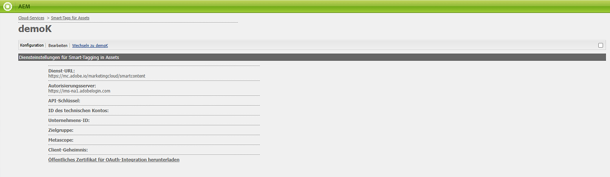

# Fehlerbehebung für Smart-Tags für OAuth-Anmeldeinformationen {#oauth-config}

Eine offene Autorisierungskonfiguration ist erforderlich, um die Zustimmung zum [!DNL Adobe Experience Manager] Anwendung, um auf sichere Weise mit Smart Content Services zu interagieren.

>[!NOTE]
>
> Sie können ab Juni 2024 keine neuen JWT-Anmeldeinformationen mehr erstellen. Von nun an werden nur noch OAuth Server-zu-Server-Anmeldedaten erstellt.
> Die JWT-Integration funktioniert bis Januar 2025 nur für bestehende AMS- und On-Premise-Benutzer.

## OAuth-Konfiguration für die neuen AMS-Benutzer {#oauth-config-existing-ams-users}

Siehe Abschnitt [Konfiguration von Smart Content Services](#integrate-adobe-io) für die Konfiguration von OAuth-Diensten für einen neuen Benutzer. Folgen Sie nach der Fertigstellung diesen [Schritte](#prereqs-config-oauth-onprem).

>[!NOTE]
>
>Bei Bedarf können Sie ein Support-Ticket senden, das auf den Link [Support-Prozess](https://experienceleague.adobe.com/?lang=de&amp;support-tab=home#support).

## OAuth-Konfiguration für die vorhandenen AMS-Benutzer {#oauth-config-new-ams-users}

Bevor Sie einen der Schritte in dieser Methode durchführen, müssen Sie Folgendes implementieren:

### Voraussetzungen {#prereqs-config-oauth-onprem}

Eine OAuth-Konfiguration erfordert die folgenden Voraussetzungen:

* Neue OAuth-Integration im [Entwicklerkonsole](https://developer.adobe.com/console/user/servicesandapis). Verwenden Sie die `ClientID`, `ClientSecret`, `OrgID`und andere Eigenschaften in den folgenden Schritten:
* Die folgenden Dateien finden Sie unter diesem Pfad `/apps/system/config in crx/de`:
   * `com.**adobe**.granite.auth.oauth.accesstoken.provider.<randomnumbers>.config`
   * `com.adobe.granite.auth.ims.impl.IMSAccessTokenRequestCustomizerImpl.<randomnumber>.config`

### OAuth-Konfiguration für die vorhandenen AMS- und On-Premise-Benutzer {#steps-config-oauth-onprem}

Die folgenden Schritte können vom Systemadministrator ausgeführt werden. Der AMS-Kunde kann sich an den Adobe-Support-Mitarbeiter wenden oder ein Support-Ticket nach [Support-Prozess](https://experienceleague.adobe.com/?lang=de&amp;support-tab=home#support).

1. Fügen Sie die folgenden Eigenschaften hinzu oder aktualisieren Sie sie in `com.adobe.granite.auth.oauth.accesstoken.provider.<randomnumbers>.config`:

   * `auth.token.provider.authorization.grants="client_credentials"`
   * `auth.token.provider.orgId="<OrgID>"`
   * `auth.token.provider.default.claims=("\"iss\"\ :\ \"<OrgID>\"")`
   * `auth.token.provider.scope="read_pc.dma_smart_content,\ openid,\ AdobeID,\ additional_info.projectedProductContext"`
     `auth.token.validator.type="adobe-ims-similaritysearch"`
   * Aktualisieren Sie die `auth.token.provider.client.id` mit der Client-ID der neuen OAuth-Konfiguration.
   * Aktualisieren `auth.access.token.request` nach `"https://ims-na1.adobelogin.com/ims/token/v3"`
1. Benennen Sie die Datei in `com.adobe.granite.auth.oauth.accesstoken.provider-<randomnumber>.config`.
1. Führen Sie die folgenden Schritte aus unter `com.adobe.granite.auth.ims.impl.IMSAccessTokenRequestCustomizerImpl.<randomnumber>.config`:
   * Aktualisieren Sie die Eigenschaft auth.ims.client.secret mit dem Client-Geheimnis aus der neuen OAuth-Integration.
   * Benennen Sie die Datei in `com.adobe.granite.auth.ims.impl.IMSAccessTokenRequestCustomizerImpl-<randomnumber>.config`
1. Speichern Sie alle Änderungen in der Entwicklungskonsole des Inhalts-Repositorys, z. B. CRXDE.
<!--
1. Navigate to `/system/console/configMgr` and replace the OSGi configuration from `.<randomnumber>` to `-<randomnumber>`.
1. Delete the old OSGi configuration for `"Access Token provider name: adobe-ims-similaritysearch"` in `/system/console/configMgr`.
-->
1. In `System/console/configMgr`, löschen Sie die alten Konfigurationen für `com.adobe.granite.auth.ims.impl.IMSAccessTokenRequestCustomizerImpl` und Name des Zugriffstoken-Anbieters `adobe-ims-similaritysearch`.
1. Starten Sie die Konsole neu.

## Überprüfen der Konfiguration {#validate-the-configuration}

Nachdem Sie die Konfiguration abgeschlossen haben, können Sie die Konfiguration mit einem JMX MBean überprüfen. Führen Sie zum Überprüfen die folgenden Schritte aus.

1. Greifen Sie unter `https://[aem_server]:[port]` auf Ihren [!DNL Experience Manager]-Server zu.

1. Gehen Sie zu **[!UICONTROL Tools]** > **[!UICONTROL Vorgänge]** > **[!UICONTROL Web-Konsole]**, um die OSGi-Konsole zu öffnen. Klicken Sie auf **[!UICONTROL Main] > [!UICONTROL JMX]**.

1. Klicken Sie auf `com.day.cq.dam.similaritysearch.internal.impl`. Die Seite **[!UICONTROL SimilaritySearch Miscellaneous Tasks]** wird geöffnet

1. Klicken Sie auf `validateConfigs()`. Klicken Sie im Dialogfeld **[!UICONTROL Konfigurationen prüfen]** auf **[!UICONTROL Aufrufen]**.

Das Überprüfungsergebnis wird im selben Dialogfeld angezeigt.

## Integrieren mit der Adobe Developer Console {#integrate-adobe-io}

Wenn Sie als neuer Benutzer in die Adobe Developer Console integrieren, wird die [!DNL Experience Manager] -Server authentifiziert Ihre Dienstanmeldeinformationen mit dem Gateway der Adobe Developer Console, bevor Ihre Anforderung an den Smart Content Service weitergeleitet wird. Zur Integration benötigen Sie ein Adobe ID-Konto mit Administratorrechten für das Unternehmen und eine Smart Content Service-Lizenz, die für Ihr Unternehmen erworben und aktiviert wurde.

Gehen Sie wie folgt vor, um den Smart Content Service zu konfigurieren:

1. So generieren Sie einen öffentlichen Schlüssel: [Erstellen eines Smart Content Service](#obtain-public-certificate) Konfiguration in [!DNL Experience Manager]. [Öffentliches Zertifikat herunterladen](#obtain-public-certificate) für die OAuth-Integration.

1. *[Gilt nicht, wenn Sie ein bestehender Benutzer sind]* [Integration in der Adobe Developer Console erstellen](#create-adobe-i-o-integration).

1. [Konfigurieren Sie die Bereitstellung](#configure-smart-content-service) mithilfe des API-Schlüssels und der anderen Anmeldedaten aus der Adobe Developer Console.

1. [Testen Sie die Konfiguration](#validate-the-configuration).

## Herunterladen eines öffentlichen Zertifikats durch Erstellen einer Smart Content Service-Konfiguration {#download-public-certificate}

Mit einem öffentlichen Zertifikat können Sie Ihr Profil in der Adobe Developer Console authentifizieren.

1. Greifen Sie in der [!DNL Experience Manager]-Benutzeroberfläche auf **[!UICONTROL Tools]** > **[!UICONTROL Cloud Services]** > **[!UICONTROL Ältere Cloud Services]** zu.

1. Klicken Sie auf der Seite „Cloud Services“ unter **[!UICONTROL Assets Smart Tags]** auf **[!UICONTROL Jetzt konfigurieren]**.

1. Geben Sie im Dialogfeld **[!UICONTROL Konfiguration erstellen]** einen Titel und einen Namen für die Smart-Tags-Konfiguration ein. Klicken Sie auf **[!UICONTROL Erstellen]**.

1. Verwenden Sie im Dialogfeld **[!UICONTROL AEM Smart Content Service]** die folgenden Werte:

   **[!UICONTROL Service-URL]**: `https://smartcontent.adobe.io/<region where your Experience Manager author instance is hosted>`

   Beispiel: `https://smartcontent.adobe.io/apac`. Sie können `na`, `emea` oder `apac` als die Regionen angeben, in denen Ihre Experience Manager-Autoreninstanz gehostet wird.

   >[!NOTE]
   >
   >Wenn der Experience Manager Managed Service vor dem 1. September 2022 bereitgestellt wurde, verwenden Sie die folgende Service-URL:
   >`https://mc.adobe.io/marketingcloud/smartcontent`

   **[!UICONTROL Autorisierungsserver]**: `https://ims-na1.adobelogin.com`

   Lassen Sie die anderen Felder vorerst leer (Werte werden später bereitgestellt). Klicken Sie auf **[!UICONTROL OK]**.

   

   *Abbildung: Dialogfeld von Content Service zum Bereitstellen der Content Service-URL*

   >[!NOTE]
   >
   >Die als [!UICONTROL Dienst-URL] ist nicht über den Browser zugänglich und erzeugt einen 404-Fehler. Die Konfiguration funktioniert problemlos mit demselben Wert für den [!UICONTROL Service-URL]-Parameter. Informationen zum Gesamtstatus und Wartungszeitplan für den Service finden Sie unter [https://status.adobe.com](https://status.adobe.com).

1. Klicks **[!UICONTROL Öffentliches Zertifikat für OAuth-Integration herunterladen]** und laden Sie die öffentliche Zertifikatdatei herunter `AEM-SmartTags.crt`. Außerdem müssen Sie dieses Zertifikat nicht mehr in die Adobe-Entwicklerkonsole hochladen.

   

   *Abbildung: Einstellungen für den Smart-Tagging-Service.*

## Erstellen einer Integration in der Adobe Developer Console {#create-adobe-i-o-integration}

Um die Smart Content Service-APIs zu verwenden, erstellen Sie eine Integration in der Adobe Developer Console, um den [!UICONTROL API-Schlüssel] (der im Feld [!UICONTROL CLIENT-ID] der Adobe Developer Console-Integration generiert wird), die [!UICONTROL ID DES TECHNISCHEN KONTOS], die [!UICONTROL ORGANISATIONS-ID] und das [!UICONTROL CLIENT-GEHEIMNIS] für die [!UICONTROL Smart Tagging Service-Einstellungen für Assets] der Cloud-Konfiguration in [!DNL Experience Manager].

1. Zugriff [https://developer.adobe.com/console/](https://developer.adobe.com/console/) in einem Browser. Wählen Sie das entsprechende Konto aus und vergewissern Sie sich, dass die zugehörige Organisationsrolle „Systemadministrator“ ist.

1. Erstellen Sie ein Projekt mit einem beliebigen Namen. Klicken Sie auf **[!UICONTROL API hinzufügen]**.

1. Wählen Sie auf der Seite **[!UICONTROL API hinzufügen]** die Option **[!UICONTROL Experience Cloud]** und dann **[!UICONTROL Smart Content]** aus. Klicken Sie auf **[!UICONTROL Weiter]**.

1. Wählen Sie die **[!UICONTROL OAuth Server-zu-Server]** Authentifizierungsmethode.

1. Hinzufügen/Ändern der **[!UICONTROL Berechtigungsname]** nach Bedarf. Klicken Sie auf **[!UICONTROL Weiter]**.

1. Produktprofil auswählen **[!UICONTROL Smart Content Services]**. Klicks **[!UICONTROL Konfigurierte API speichern]**. Die OAuth-API wird unter den verbundenen Anmeldedaten für die weitere Verwendung hinzugefügt. Sie können die [!UICONTROL API-Schlüssel (Client-ID)] oder [!UICONTROL Zugriffstoken generieren] aus.
<!--
1. On the **[!UICONTROL Select product profiles]** page, select **[!UICONTROL Smart Content Services]**. Click **[!UICONTROL Save configured API]**.

   A page displays more information about the configuration. Keep this page open to copy and add these values in [!UICONTROL Assets Smart Tagging Service Settings] of cloud configuration in [!DNL Experience Manager] to configure smart tags.

   

   *Figure: Details of integration in Adobe Developer Console*
-->

*Abbildung: Konfiguration von OAuth Server-zu-Server in der Adobe Developer-Konsole*

## Konfigurieren des Smart Content Service {#configure-smart-content-service}

Verwenden Sie zum Konfigurieren der Integration die Werte der Felder [!UICONTROL ID DES TECHNISCHEN KONTOS], [!UICONTROL ORGANISATIONS-ID], [!UICONTROL CLIENT-GEHEIMNIS] und [!UICONTROL CLIENT-ID] aus der Adobe Developer Console-Integration. Das Erstellen einer Smart-Tags-Cloud-Konfiguration ermöglicht die Authentifizierung von API-Anfragen aus der [!DNL Experience Manager]-Bereitstellung.

1. Gehen Sie in [!DNL Experience Manager] zu **[!UICONTROL Tools]** > **[!UICONTROL Cloud Service]** > **[!UICONTROL Ältere Cloud-Services]**, um die [!UICONTROL Cloud Services]-Konsole zu öffnen.

1. Öffnen Sie unter **[!UICONTROL Smart-Tags für Assets]** die oben erstellte Konfiguration. Klicken Sie auf der Seite „Diensteinstellungen“ auf **[!UICONTROL Bearbeiten]**.

1. Verwenden Sie im Dialogfeld **[!UICONTROL AEM Smart Content Service]** die vorausgefüllten Werte für die Felder **[!UICONTROL Service-URL]** und **[!UICONTROL Autorisierungsserver]**.

1. Für die Felder [!UICONTROL API-Schlüssel], [!UICONTROL ID des Technischen Kontos], [!UICONTROL Organisations-ID] und [!UICONTROL Client-Geheimnis], kopieren und verwenden Sie die folgenden Werte, die in [Integration der Adobe Developer Console](#create-adobe-i-o-integration) generiert wurden.

   | [!UICONTROL Diensteinstellungen für Smart-Tagging in Assets] | [!DNL Adobe Developer Console] Integrationsfelder |
   |--- |--- |
   | [!UICONTROL API-Schlüssel] | [!UICONTROL CLIENT-ID] |
   | [!UICONTROL ID des technischen Kontos] | [!UICONTROL  ID DES TECHNISCHEN KONTOS] |
   | [!UICONTROL Organisations-ID] | [!UICONTROL ORGANISATIONS-ID] |
   | [!UICONTROL Client-Geheimnis] | [!UICONTROL CLIENT-GEHEIMNIS] |

>[!MORELIKETHIS]
>
>* [Übersicht und Schulung für Smart-Tags](enhanced-smart-tags.md)
>* [Konfigurieren von Smart-Tagging](config-smart-tagging.md)
>* [Video-Tutorial zu Smart-Tags](https://experienceleague.adobe.com/docs/experience-manager-learn/assets/metadata/image-smart-tags.html?lang=de)
