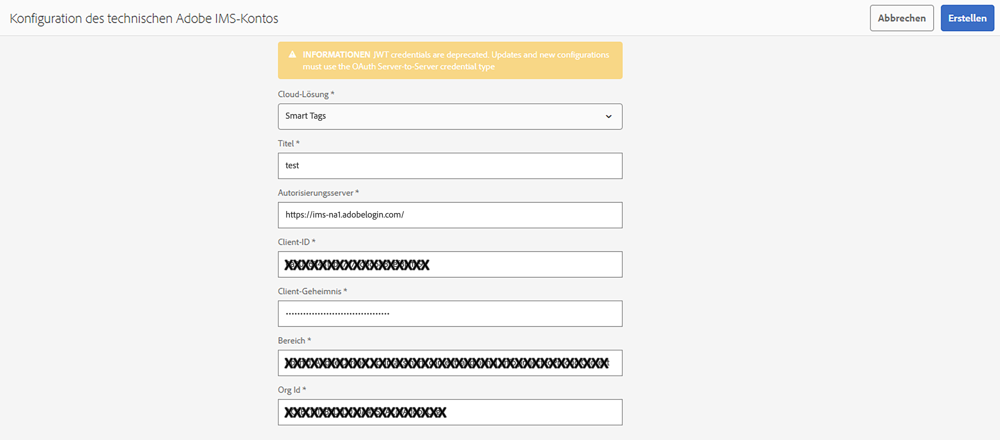

# Vorbereiten von [!DNL Assets] für Smart-Tagging {#configure-asset-tagging-using-the-smart-content-service}

Bevor Sie mit dem Tagging Ihrer Assets per Smart Content Services beginnen können, integrieren Sie [!DNL Experience Manager Assets] in die Adobe Developer Console, um den Smart-Service von [!DNL Adobe Sensei] zu nutzen. Nach der Konfiguration trainieren Sie den Service mit einigen Bildern und einem Tag.

<!--
>[!NOTE]
>
>* Smart Content Services is no longer available to new [!DNL Experience Manager Assets] On-Premise customers. Existing On-Premise customers, who already have this capability enabled, can continue using Smart Content Services.
>* Smart Content Services is available for existing [!DNL Experience Manager Assets] Managed Services customers, who already have this capability enabled.
>* New Experience Manager Assets Managed Services customers can follow the instructions mentioned in this article to set up Smart Content Services.
>* For Service Pack 20 and older, you need to perform the workaround steps for SCS to support Oauth integration. See [Troubleshooting smart tags for OAuth credentials](config-oauth.md).
>* To support the Oauth integration on Service Pack 21, you need to install the [Hotfix for SP 21](https://experience.adobe.com/#/downloads/content/software-distribution/en/aem.html?package=%2Fcontent%2Fsoftware-distribution%2Fen%2Fdetails.html%2Fcontent%2Fdam%2Faem%2Fpublic%2Fadobe%2Fpackages%2Fcq650%2Fproduct%2Fassets%2Fcq-6.5.0-hotfix-40772-1.2.zip). 
>* For Existing SCS configuration, the process is the same as setting up a new OAuth integration. Any legacy configuration will be automatically cleaned up.
-->

Bevor Sie den Smart Content Service verwenden, führen Sie Folgendes aus:

* [Integrieren Sie ihn mit der Adobe Developer Console](#integrate-adobe-io).
* [Trainieren Sie den Smart Content Service](#training-the-smart-content-service).

* Installieren Sie die neueste Version des [[!DNL Experience Manager] Service Pack](https://experienceleague.adobe.com/docs/experience-manager-release-information/aem-release-updates/aem-releases-updates.html?lang=de).

## SCS-Upgrade zur Unterstützung von OAuth für Adobe Managed Services {#scs-upgrade-oauth-managed-services}

**Neue Benutzende**

Installieren Sie Service Pack 22. Um die OAuth-Integration auf Service Pack 22 zu unterstützen, müssen Sie den [Hotfix für Service Pack 22](https://experience.adobe.com/#/downloads/content/software-distribution/de/aem.html?package=%2Fcontent%2Fsoftware-distribution%2Fen%2Fdetails.html%2Fcontent%2Fdam%2Faem%2Fpublic%2Fadobe%2Fpackages%2Fcq650%2Fproduct%2Fassets%2Fcq-6.5.0-hotfix-42384-1.2.zip) installieren.

Befolgen Sie die in diesem Artikel beschriebenen Anweisungen zum Einrichten von Smart Content Services.

**Vorhandene Benutzende**

Wenn Sie ein Upgrade auf Service Pack 21 durchgeführt haben, installieren Sie den [Hotfix für Service Pack 21](https://experience.adobe.com/#/downloads/content/software-distribution/de/aem.html?package=%2Fcontent%2Fsoftware-distribution%2Fen%2Fdetails.html%2Fcontent%2Fdam%2Faem%2Fpublic%2Fadobe%2Fpackages%2Fcq650%2Fproduct%2Fassets%2Fcq-6.5.0-hotfix-40772-1.2.zip), um die OAuth-Integration zu unterstützen. Jede vorhandene Konfiguration wird automatisch gelöscht. Befolgen Sie die in diesem Artikel beschriebenen Anweisungen zum Einrichten von Smart Content Services. Wenn Sie ein Upgrade auf Service Pack 22 durchführen, müssen Sie diesen [Hotfix für Service Pack 22 installieren](https://experience.adobe.com/#/downloads/content/software-distribution/de/aem.html?package=%2Fcontent%2Fsoftware-distribution%2Fen%2Fdetails.html%2Fcontent%2Fdam%2Faem%2Fpublic%2Fadobe%2Fpackages%2Fcq650%2Fproduct%2Fassets%2Fcq-6.5.0-hotfix-42384-1.2.zip).

Für Service Pack 20 und älter müssen Sie die Problemumgehungsschritte für SCS ausführen, damit die OAuth-Integration unterstützt wird. Siehe [Fehlerbehebung für Smart-Tags hinsichtlich OAuth-Anmeldedaten](config-oauth.md).

## SCS-Upgrade zur Unterstützung von OAuth für On-Premise-Benutzende {#scs-upgrade-oauth-on-premise}

**Neue Benutzende**

Smart Content Services ist für neue On-Premise-Benutzende von [!DNL Experience Manager Assets] nicht mehr verfügbar. 

**Vorhandene Benutzende**

Vorhandene On-Premise-Benutzende, die diese Funktion bereits aktiviert haben, können Smart Content Services weiterhin nutzen.

Wenn Sie ein Upgrade auf Service Pack 21 durchgeführt haben, installieren Sie den [Hotfix für Service Pack 21](https://experience.adobe.com/#/downloads/content/software-distribution/de/aem.html?package=%2Fcontent%2Fsoftware-distribution%2Fen%2Fdetails.html%2Fcontent%2Fdam%2Faem%2Fpublic%2Fadobe%2Fpackages%2Fcq650%2Fproduct%2Fassets%2Fcq-6.5.0-hotfix-40772-1.2.zip), um die OAuth-Integration zu unterstützen. Jede vorhandene Konfiguration wird automatisch gelöscht. Befolgen Sie die in diesem Artikel beschriebenen Anweisungen zum Einrichten von Smart Content Services. Wenn Sie ein Upgrade auf Service Pack 22 durchführen, müssen Sie diesen [Hotfix für Service Pack 22 installieren](https://experience.adobe.com/#/downloads/content/software-distribution/de/aem.html?package=%2Fcontent%2Fsoftware-distribution%2Fen%2Fdetails.html%2Fcontent%2Fdam%2Faem%2Fpublic%2Fadobe%2Fpackages%2Fcq650%2Fproduct%2Fassets%2Fcq-6.5.0-hotfix-42384-1.2.zip).

Für Service Pack 20 und älter müssen Sie die Problemumgehungsschritte für SCS ausführen, damit die OAuth-Integration unterstützt wird. Siehe [Fehlerbehebung für Smart-Tags hinsichtlich OAuth-Anmeldedaten](config-oauth.md).

## Integrieren mit der Adobe Developer Console {#integrate-adobe-io}

Bei der Integration mit der Adobe Developer Console authentifiziert der [!DNL Experience Manager]-Server Ihre Service-Anmeldedaten beim Adobe Developer Console-Gateway, bevor er Ihre Anfrage an den Smart Content Service weiterleitet. Zur Integration benötigen Sie ein Adobe ID-Konto mit Administratorrechten für die für Ihr Unternehmen erworbene und aktivierte Smart Content Service-Lizenz.

Gehen Sie wie folgt vor, um den Smart Content Service zu konfigurieren:

1. Erstellen Sie eine Integration in [Adobe Developer Console](#create-adobe-io-integration).

1. Erstellen Sie eine [Konfiguration des technischen IMS-Kontos](#create-ims-account-config) mithilfe des API-Schlüssels und der anderen Anmeldedaten aus der Adobe Developer Console.

1. [Konfigurieren Sie den Smart Content Service](#configure-smart-content-service).

1. [Testen Sie die Konfiguration](#validate-the-configuration).

<!--
To configure the Smart Content Service, follow these top-level steps:

1. To generate a public key, [Create a Smart Content Service] (#obtain-public-certificate) configuration in [!DNL Experience Manager]. 

1. Optionally, [enable auto-tagging on asset upload](#enable-smart-tagging-in-the-update-asset-workflow-optional).

   <!--1. [Obtain public certificate](#obtain-public-certificate) for OAuth integration.
   1. [Create an integration in Adobe Developer Console](#create-adobe-i-o-integration) and upload the generated public key.

   1. [Configure your deployment](#configure-smart-content-service) using the API key and other credentials from Adobe Developer Console.

   1. [Test the configuration](#validate-the-configuration).-->

### Erstellen einer Integration in der Adobe Developer Console {#create-adobe-io-integration}

Um die Smart Content Service-APIs zu verwenden, erstellen Sie eine Integration in der Adobe Developer Console, um den [!UICONTROL API-Schlüssel] (der im Feld [!UICONTROL CLIENT-ID] der Adobe Developer Console-Integration generiert wird), die [!UICONTROL ORGANISATIONS-ID] und das [!UICONTROL CLIENT-GEHEIMNIS] für die [!UICONTROL Smart Tagging Service-Einstellungen für Assets] der Cloud-Konfiguration in [!DNL Experience Manager] zu erhalten.

1. Rufen Sie [https://developer.adobe.com](https://developer.adobe.com/) in einem Browser auf. Wählen Sie das entsprechende Konto aus und vergewissern Sie sich, dass die zugehörige Organisationsrolle **Systemadministrator** ist.

1. Erstellen Sie ein Projekt mit einem beliebigen Namen. Klicken Sie auf **[!UICONTROL API hinzufügen]**.

1. Wählen Sie auf der Seite **[!UICONTROL API hinzufügen]** die Option **[!UICONTROL Experience Cloud]** und dann **[!UICONTROL Smart Content]** aus. Klicken Sie auf **[!UICONTROL Weiter]**.

1. Wählen Sie **[!UICONTROL OAuth Server-to-Server]** aus. Klicken Sie auf **[!UICONTROL Weiter]**.
Weitere Informationen zu dieser Konfiguration finden Sie in der Dokumentation zur Developer Console, abhängig von Ihren Anforderungen:

   * Übersicht:
      * [Server-zu-Server-Authentifizierung](https://developer.adobe.com/developer-console/docs/guides/authentication/ServerToServerAuthentication/)

   * Erstellen von neuen OAuth-Anmeldedaten:
      * [OAuth-Implementierungshandbuch für Server-zu-Server-Anmeldedaten](https://developer.adobe.com/developer-console/docs/guides/authentication/ServerToServerAuthentication/implementation/)

   * Migration von vorhandenen JWT-Anmeldedaten zu OAuth-Anmeldedaten:
      * [Migration von JWT-Anmeldedaten (Service Account) zu OAuth-Server-zu-Server-Anmeldedaten](https://developer.adobe.com/developer-console/docs/guides/authentication/ServerToServerAuthentication/migration/)

1. Wählen Sie auf der Seite **[!UICONTROL Produktprofile auswählen]** die Option **[!UICONTROL Smart Content Services]** aus. Klicken Sie auf **[!UICONTROL Konfigurierte API speichern]**.

   Auf einer Seite werden weitere Informationen zur Konfiguration angezeigt. Lassen Sie diese Seite geöffnet, um diese Werte zu kopieren und in den [!UICONTROL Einstellungen des Smart Tagging Service für Assets] in der Cloud-Konfiguration in [!DNL Experience Manager] zuzufügen, um Smart Tags zu konfigurieren.

   

### Erstellen der Konfiguration des technischen IMS-Kontos {#create-ims-account-config}

Sie müssen die Konfiguration des technischen IMS-Kontos mithilfe der folgenden Schritte erstellen:

1. Rufen Sie in der [!DNL Experience Manager]-Benutzeroberfläche **[!UICONTROL Tools]** > **[!UICONTROL Sicherheit]** > **[!UICONTROL Adobe IMS-Konfigurationen]** auf.

1. Klicken Sie auf **[!UICONTROL Erstellen]**.

1. Verwenden Sie im Dialogfeld „Konfiguration des technischen IMS-Kontos“ die folgenden Werte:

   

   | Feld | Beschreibung |
   | -------- | ---------------------------- |
   | Cloud-Lösung | Wählen Sie aus dem Dropdown-Menü **[!UICONTROL Smart-Tags]** aus. |
   | Titel | Fügen Sie den Titel des konfigurierenden IMS-Kontos hinzu. |
   | Autorisierungs-Server | Fügen Sie `https://ims-na1.adobelogin.com` hinzu. |
   | Client-ID | Wird über die [Adobe Developer Console](https://developer.adobe.com/console/) bereitgestellt. |
   | Client-Geheimnis | Wird über die [Adobe Developer Console](https://developer.adobe.com/console/) bereitgestellt. |
   | Anwendungsbereich | Wird über die [Adobe Developer Console](https://developer.adobe.com/console/) bereitgestellt. |
   | Organisations-ID | Wird über die [Adobe Developer Console](https://developer.adobe.com/console/) bereitgestellt. |

1. Wählen Sie die von Ihnen erstellte Konfiguration aus und klicken Sie auf **[!UICONTROL Konsistenz prüfen]**.

1. Bestätigen Sie das Dialogfeld „Konsistenz prüfen“ und klicken Sie auf „Schließen“, sobald die Konfiguration im konsistenten Status ist.

### Erstellen einer neuen Konfiguration {#configure-smart-content-service}

<!--
>[!CAUTION]
>
>Previously, configurations that were made with JWT Credentials are now subject to deprecation in the Adobe Developer Console. You cannot create new JWT credentials after June 3, 2024. Such configurations can no longer be created or updated, but can be migrated to OAuth configurations.
> See [Setting up IMS integrations for AEM](https://experienceleague.adobe.com/de/docs/experience-manager-cloud-service/content/security/setting-up-ims-integrations-for-aem-as-a-cloud-service)
>See [Steps to configure OAuth for on-premise users](#config-oauth-onprem)
> See [Troubleshooting smart tags for OAuth credentials](#config-smart-tagging.md)
-->

Verwenden Sie zum Konfigurieren der Integration die Werte der Felder [!UICONTROL ID DES TECHNISCHEN KONTOS], [!UICONTROL ORGANISATIONS-ID], [!UICONTROL CLIENT-GEHEIMNIS] und [!UICONTROL CLIENT-ID] aus der Adobe Developer Console-Integration. Das Erstellen einer Smart-Tags-Cloud-Konfiguration ermöglicht die Authentifizierung von API-Anfragen aus der [!DNL Experience Manager]-Bereitstellung.

1. Navigieren Sie in [!DNL Experience Manager] zu **[!UICONTROL Tools]** > **[!UICONTROL Cloud Service]** > **[!UICONTROL Smart-Tag]**, um die [!UICONTROL Smart-Tag-Konfigurationen] zu öffnen.

1. Klicken Sie auf **[!UICONTROL Erstellen]**, um eine neue Konfiguration zu erstellen. Klicken Sie andernfalls auf **[!UICONTROL Eigenschaften]**, um die vorhandene Konfiguration zu aktualisieren.

1. Füllen Sie die folgenden Felder aus:

   

   | Feld | Beschreibung |
   | -------- | ---------------------------- |
   | Titel | Fügen Sie den Titel des konfigurierenden IMS-Kontos hinzu. |
   | Verknüpfte Adobe IMS-Konfiguration | Wählen Sie die Konfiguration aus dem Dropdown-Menü aus. |
   | Service-URL | `https://smartcontent.adobe.io/<region where your Experience Manager author instance is hosted>`. Beispiel: `https://smartcontent.adobe.io/apac`. Sie können `na`, `emea` oder `apac` als die Regionen angeben, in denen Ihre Experience Manager-Autoreninstanz gehostet wird. |

   >[!NOTE]
   >
   >Wenn der Experience Manager Managed Service vor dem 1. September 2022 bereitgestellt wurde, verwenden Sie die folgende Service-URL:
   >`https://mc.adobe.io/marketingcloud/smartcontent`

1. Klicken Sie auf **[!UICONTROL Speichern und schließen]**.

### Überprüfen der Konfiguration {#validate-the-configuration}

Nachdem Sie die Konfiguration abgeschlossen haben, können Sie die Konfiguration mit einem JMX MBean überprüfen. Führen Sie zum Überprüfen die folgenden Schritte aus.

1. Greifen Sie unter `https://[aem_server]:[port]` auf Ihren [!DNL Experience Manager]-Server zu.

1. Gehen Sie zu **[!UICONTROL Tools]** > **[!UICONTROL Vorgänge]** > **[!UICONTROL Web-Konsole]**, um die OSGi-Konsole zu öffnen. Klicken Sie auf **[!UICONTROL Main] > [!UICONTROL JMX]**.

<!--
1. Click `com.day.cq.dam.similaritysearch.internal.impl`. It opens **[!UICONTROL SimilaritySearch Miscellaneous Tasks]**.-->

1. Klicken Sie auf `com.day.cq.dam.similaritysearch.internal.impl (SCS)`.

   

1. Klicken Sie auf `validateConfigs()`. Klicken Sie im Dialogfeld **[!UICONTROL Konfigurationen prüfen]** auf **[!UICONTROL Aufrufen]**.

Das Überprüfungsergebnis wird im selben Dialogfeld angezeigt.

<!--
### Obtain public certificate by creating Smart Content Service configuration {#obtain-public-certificate}

A public certificate lets you authenticate your profile on Adobe Developer Console.

1. In the [!DNL Experience Manager] user interface, access **[!UICONTROL Tools]** > **[!UICONTROL Cloud Services]** > **[!UICONTROL Legacy Cloud Services]**.

1. In the Cloud Services page, click **[!UICONTROL Configure Now]** under **[!UICONTROL Assets Smart Tags]**.

1. In the **[!UICONTROL Create Configuration]** dialog, specify a title and name for the Smart Tags configuration. Click **[!UICONTROL Create]**.

1. In the **[!UICONTROL AEM Smart Content Service]** dialog, use the following values:

   **[!UICONTROL Service URL]**: `https://smartcontent.adobe.io/<region where your Experience Manager author instance is hosted>`

   For example, `https://smartcontent.adobe.io/apac`. You can specify `na`, `emea`, or, `apac` as the regions where your Experience Manager author instance is hosted. 

   >[!NOTE]
   >
   >If the Experience Manager Managed Service is provisioned before September 01, 2022, use the following Service URL:
   >`https://mc.adobe.io/marketingcloud/smartcontent`

   **[!UICONTROL Authorization Server]**: `https://ims-na1.adobelogin.com`

   Leave the other fields blank for now (to be provided later). Click **[!UICONTROL OK]**.

   

   *Figure: Smart Content Service dialog to provide content service URL*

   >[!NOTE]
   >
   >The URL provided as [!UICONTROL Service URL] is not accessible via browser and generates a 404 error. The configuration works OK with the same value of the [!UICONTROL Service URL] parameter. For the overall service status and maintenance schedule, see [https://status.adobe.com](https://status.adobe.com).

1. Click **[!UICONTROL Download Public Certificate for OAuth Integration]**, and download the public certificate file `AEM-SmartTags.crt`.

   

   *Figure: Settings for smart tagging service.*

#### Reconfigure when a certificate expires {#certrenew}

After a certificate expires, it is no longer trusted. You cannot renew an expired certificate. To add a certificate, follow these steps.

1. Log in your [!DNL Experience Manager] deployment as an administrator. Click **[!UICONTROL Tools]** > **[!UICONTROL Security]** > **[!UICONTROL Users]**.

1. Locate and click **[!UICONTROL dam-update-service]** user. Click **[!UICONTROL Keystore]** tab.

1. Delete the existing **[!UICONTROL similaritysearch]** keystore with the expired certificate. Click **[!UICONTROL Save & Close]**.

   

   *Figure: Delete the existing `similaritysearch` entry in Keystore to add a security certificate.*

1. Navigate to **[!UICONTROL Tools]** > **[!UICONTROL Cloud Services]** > **[!UICONTROL Legacy Cloud Services]**. Click **[!UICONTROL Asset Smart Tags]** > **[!UICONTROL Show Configuration]** > **[!UICONTROL Available Configurations]**. Click the required configuration.  

1. To download a public certificate, click **[!UICONTROL Download Public Certificate for OAuth Integration]**.

1. Access [https://console.adobe.io](https://console.adobe.io) and navigate to the existing Smart Content Services on the **[!UICONTROL Integrations]** page. Upload the new certificate. For more information, see the instructions in [Create Adobe Developer Console integration](#create-adobe-i-o-integration).

### Create Adobe Developer Console integration {#create-adobe-i-o-integration}

To use Smart Content Service APIs, create an integration in Adobe Developer Console to obtain [!UICONTROL API Key] (generated in [!UICONTROL CLIENT ID] field of Adobe Developer Console integration), [!UICONTROL TECHNICAL ACCOUNT ID], [!UICONTROL ORGANIZATION ID], and [!UICONTROL CLIENT SECRET] for [!UICONTROL Assets Smart Tagging Service Settings] of cloud configuration in [!DNL Experience Manager].

1. Access [https://console.adobe.io](https://console.adobe.io/) in a browser. Select the appropriate account and verify that the associated organization role is system administrator.

1. Create a project with any desired name. Click **[!UICONTROL Add API]**.

1. On the **[!UICONTROL Add an API]** page, select **[!UICONTROL Experience Cloud]** and select **[!UICONTROL Smart Content]**. Click **[!UICONTROL Next]**.

1. Select **[!UICONTROL Upload your public key]**. Provide the certificate file downloaded from [!DNL Experience Manager]. A message [!UICONTROL Public key(s) uploaded successfully] is displayed. Click **[!UICONTROL Next]**.

   [!UICONTROL Create a new Service Account (JWT) credential] page displays the public key for the service account.

1. Click **[!UICONTROL Next]**.

1. On the **[!UICONTROL Select product profiles]** page, select **[!UICONTROL Smart Content Services]**. Click **[!UICONTROL Save configured API]**.

   A page displays more information about the configuration. Keep this page open to copy and add these values in [!UICONTROL Assets Smart Tagging Service Settings] of cloud configuration in [!DNL Experience Manager] to configure smart tags.

   

   *Figure: Details of integration in Adobe Developer Console*

### Configure Smart Content Service {#configure-smart-content-service}

>[!CAUTION]
>
>Previously, configurations that were made with JWT Credentials are now subject to deprecation in the Adobe Developer Console. You cannot create new JWT credentials after June 3, 2024. Such configurations can no longer be created or updated, but can be migrated to OAuth configurations.
> See [Setting up IMS integrations for AEM](https://experienceleague.adobe.com/de/docs/experience-manager-cloud-service/content/security/setting-up-ims-integrations-for-aem-as-a-cloud-service)
>See [Steps to configure OAuth for on-premise users](#config-oauth-onprem)
> See [Troubleshooting smart tags for OAuth credentials](#config-smart-tagging.md)

To configure the integration, use the values of [!UICONTROL TECHNICAL ACCOUNT ID], [!UICONTROL ORGANIZATION ID], [!UICONTROL CLIENT SECRET], and [!UICONTROL CLIENT ID] fields from the Adobe Developer Console integration. Creating a Smart Tags cloud configuration allows authentication of API requests from the [!DNL Experience Manager] deployment.

1. In [!DNL Experience Manager], navigate to **[!UICONTROL Tools]** > **[!UICONTROL Cloud Service]** > **[!UICONTROL Legacy Cloud Services]** to open the [!UICONTROL Cloud Services] console.

1. Under the **[!UICONTROL Assets Smart Tags]**, open the configuration created above. On the service settings page, click **[!UICONTROL Edit]**.

1. In the **[!UICONTROL AEM Smart Content Service]** dialog, use the pre-populated values for the **[!UICONTROL Service URL]** and **[!UICONTROL Authorization Server]** fields.

1. For the fields [!UICONTROL Api Key], [!UICONTROL Technical Account ID], [!UICONTROL Organization ID], and [!UICONTROL Client Secret], copy and use the following values generated in [Adobe Developer Console integration](#create-adobe-i-o-integration).

   | [!UICONTROL Assets Smart Tagging Service Settings] | [!DNL Adobe Developer Console] integration fields |
   |--- |--- |
   | [!UICONTROL Api Key] | [!UICONTROL CLIENT ID] |
   | [!UICONTROL Technical Account ID] | [!UICONTROL TECHNICAL ACCOUNT ID] |
   | [!UICONTROL Organization ID] | [!UICONTROL ORGANIZATION ID] |
   | [!UICONTROL Client Secret] | [!UICONTROL CLIENT SECRET] |

### Configure OAuth for on-premise users {#config-oauth-onprem}

#### Prerequisites {#prereqs-config-oauth-onprem}

An authorization scope is an OAuth string that contains the following prerequisites:

* Create a new OAuth integration in the [Developer Console](https://developer.adobe.com/console/user/servicesandapis) using `ClientID`, `ClientSecretID`, and `OrgID`.
* Add the following files at this path `/apps/system/config in crx/de`:
   * `com.adobe.granite.auth.oauth.accesstoken.provider.<randomnumbers>.config`
   * `com.adobe.granite.auth.ims.impl.IMSAccessTokenRequestCustomizerImpl.<randomnumber>.config`

#### Configure OAuth for on-premise users {#steps-config-oauth-onprem}

1. Add or update the below properties in `com.adobe.granite.auth.oauth.accesstoken.provider.<randomnumbers>.config`:

   * `auth.token.provider.authorization.grants="client_credentials"`
   * `auth.token.provider.orgId="<OrgID>"`
   * `auth.token.provider.default.claims=("\"iss\"\ :\ \"<OrgID>\"")`
   * `auth.token.provider.scope="read_pc.dma_smart_content,\ openid,\ AdobeID,\ additional_info.projectedProductContext"`
     `auth.token.validator.type="adobe-ims-similaritysearch"`
   * Update the `auth.token.provider.client.id` with the Client ID of the new OAuth configuration.
   * Update `auth.access.token.request` to `"https://ims-na1.adobelogin.com/ims/token/v3"`
2. Rename the file to `com.adobe.granite.auth.oauth.accesstoken.provider-<randomnumber>.config`.
3. Perform the steps below in `com.adobe.granite.auth.ims.impl.IMSAccessTokenRequestCustomizerImpl.<randomnumber>.config`:
   * Update the property auth.ims.client.secret with the Client Secret from the new OAuth integration.
   * Rename the file to `com.adobe.granite.auth.ims.impl.IMSAccessTokenRequestCustomizerImpl-<randomnumber>.config`
4. Save all the changes in content repository development console, for example, CRXDE.
5. Navigate to `/system/console/configMgr` and replace the OSGi configuration from `.<randomnumber>` to `-<randomnumber>`.
6. Delete the old configuration for `"Access Token provider name: adobe-ims-similaritysearch"` in `/system/console/configMgr`.
7. Restart the console.

### Validate the configuration {#validate-the-configuration}

After you have completed the configuration, you can use a JMX MBean to validate the configuration. To validate, follow these steps.

1. Access your [!DNL Experience Manager] server at `https://[aem_server]:[port]`.

1. Go to **[!UICONTROL Tools]** > **[!UICONTROL Operations]** > **[!UICONTROL Web Console]** to open the OSGi console. Click **[!UICONTROL Main] > [!UICONTROL JMX]**.

1. Click `com.day.cq.dam.similaritysearch.internal.impl`. It opens **[!UICONTROL SimilaritySearch Miscellaneous Tasks]**.

1. Click `validateConfigs()`. In the **[!UICONTROL Validate Configurations]** dialog, click **[!UICONTROL Invoke]**.

The validation results are displayed in the same dialog.
-->

### Aktivieren der Smart-Tagging-Funktion im Workflow [!UICONTROL DAM Update Asset] (optional) {#enable-smart-tagging-in-the-update-asset-workflow-optional}

1. Gehen Sie in [!DNL Experience Manager] zu **[!UICONTROL Tools]** > **[!UICONTROL Workflow]** > **[!UICONTROL Modelle]**.

1. Wählen Sie auf der Seite **[!UICONTROL Workflow-Modelle]** das Workflow-Modell **[!UICONTROL DAM Update Asset]** aus.

1. Klicken Sie in der Symbolleiste auf **[!UICONTROL Bearbeiten]**.

1. Erweitern Sie das Seitenbedienfeld, um die Schritte anzuzeigen. Ziehen Sie den Schritt **[!UICONTROL Asset intelligent taggen]**, der im Abschnitt „DAM-Workflow“ verfügbar ist, und platzieren Sie ihn nach dem Schritt **[!UICONTROL Prozessminiaturansichten]**.

   

1. Öffnen Sie die Eigenschaften des Schritts, um die Details zu ändern. Stellen Sie unter **[!UICONTROL Erweiterte Einstellungen]** sicher, dass die Option **[!UICONTROL Handler-Erweiterung]** ausgewählt ist.

   

1. Wählen Sie auf der Registerkarte **[!UICONTROL Argumente]** die Option **[!UICONTROL Fehler ignorieren]**, wenn der Workflow auch dann abgeschlossen werden soll, falls der automatische Tag-Schritt fehlschlägt.

   Um Assets unabhängig davon mit Tags zu versehen, ob die Smart-Tagging-Funktion für Ordner aktiviert ist, wählen Sie **[!UICONTROL Smart-Tag-Markierung ignorieren]** aus.

   

1. Klicken Sie auf das Symbol , um den Prozessschritt zu schließen.

1. Klicken Sie auf **[!UICONTROL Synchronisieren]**, um den Workflow zu speichern.

## Trainieren des Smart Content Service {#training-the-smart-content-service}

Damit der Smart Content Service die Taxonomie Ihres Unternehmens erkennen kann, sollten Sie den Dienst auf einen Asset-Satz ausführen, der bereits für Ihr Unternehmen relevante Tags enthält. Damit Sie Ihre Markenbilder effektiv mit Tags versehen können, müssen die zum Trainieren des Smart Content Service verwendeten Bilder bestimmten Richtlinien entsprechen. Nach dem Training kann der Dienst dieselbe Taxonomie auf einen ähnlichen Satz von Assets anwenden.

Sie können den Dienst mehrmals trainieren, um die Fähigkeit zu verbessern, relevante Tags anzuwenden. Führen Sie nach jedem Trainings-Zyklus einen Tagging-Workflow aus und überprüfen Sie, ob Ihre Assets mit den richtigen Tags versehen sind.

Sie können den Smart Content Service regelmäßig oder bei Bedarf trainieren.

>[!NOTE]
>
>Der Trainings-Workflow wird nur für Ordner ausgeführt.

### Richtlinien für das Training {#guidelines-for-training}

Für optimale Ergebnisse sollten Bilder im Trainingssatz folgende Richtlinien einhalten:

**Menge und Größe:** Mindestens 30 Bilder pro Tag. Mindestens 500 Pixel auf der längeren Seite.

**Kohärenz**: Bilder, die für ein bestimmtes Tag verwendet werden, sind optisch ähnlich.

So ist es beispielsweise nicht empfehlenswert, all diese Bilder mit dem Tag `my-party` zu versehen (zu Trainings-Zwecken), da sie einander visuell nicht ähnlich sind.

**Abdeckung:** Bei den Trainings-Bildern muss eine ausreichende Vielfalt vorhanden sein. Der Grundgedanke ist, einige Beispiele bereitzustellen, die jedoch verhältnismäßig vielfältig sind, sodass Experience Manager lernt, sich auf die richtigen Dinge zu konzentrieren. Wenn Sie dasselbe Tag auf visuell unähnliche Bilder anwenden, schließen Sie mindestens fünf Beispiele für jeden Typ ein.

Beispiel: Schließen Sie für das Tag *model-down-pose* mehr Trainings-Bilder ein, die dem hervorgehobenen Bild unten ähnlich sind, sodass der Service ähnliche Bilder beim Hinzufügen von Tags genauer identifizieren kann.

**Ablenkung/Verdeckung**: Der Service kann besser mit Bildern trainieren, die weniger Ablenkungen enthalten (hervorgehobenen Hintergründe oder Elemente ohne Bezug wie Objekte/Personen neben dem Hauptsubjekt).

Beispiel: Für das Tag *casual-shoe* ist das zweite Bild kein guter Kandidat für das Training.

**Vollständigkeit:** Wenn ein Bild für mehr als ein Tag qualifiziert ist, fügen Sie alle entsprechenden Tags hinzu, bevor Sie das Bild für eine Schulung hinzufügen. Beispiel: Fügen Sie im Falle von Tags wie `raincoat` und `model-side-view` beide Tags zum entsprechenden Asset hinzu, bevor Sie dieses für Trainingszwecke verwenden.

>[!NOTE]
>
>Die Fähigkeit des Smart Content Service, aus Ihren Tags zu lernen und diese Tags auf andere Bilder anzuwenden, hängt von der Qualität der für das Training verwendeten Bilder ab. Um die bestmöglichen Ergebnisse zu erzielen, empfiehlt Adobe die Verwendung visuell ähnlicher Bilder, um den Service für die einzelnen Tags zu trainieren.

### Regelmäßiges Training {#periodic-training}

Sie können festlegen, dass der Smart Content Service regelmäßig mit den Assets und zugewiesenen Tags in einem Ordner trainiert wird. Öffnen Sie die Seite [!UICONTROL Eigenschaften] Ihres Asset-Ordners, wählen Sie **[!UICONTROL Smart-Tags aktivieren]** in der Registerkarte **[!UICONTROL Details]** aus und speichern Sie die Änderungen.

Wenn Sie diese Option für einen Ordner auswählt haben, führt [!DNL Experience Manager] automatisch einen Trainings-Workflow aus, um den Smart Content Service mit den Assets im Ordner und deren Tags zu trainieren. Standardmäßig wird der Trainings-Workflow jede Woche samstags um 00:30 Uhr ausgeführt.

### Training bei Bedarf {#on-demand-training}

Sie können den Smart Content Service bei Bedarf über die Workflow-Konsole trainieren.

1. Gehen Sie in der [!DNL Experience Manager]-Benutzeroberfläche zu **[!UICONTROL Tools]** > **[!UICONTROL Workflow]** > **[!UICONTROL Modelle]**.
1. Wählen Sie auf der Seite **[!UICONTROL Workflow-Modelle]** den Workflow **[!UICONTROL Smart-Tags-Training]** aus und klicken Sie dann in der Symbolleiste auf **[!UICONTROL Workflow starten]**.
1. Suchen Sie im Dialogfeld **[!UICONTROL Workflow ausführen]** nach dem Payload-Ordner, der die mit Tags versehenen Assets für das Trainieren des Services enthält.
1. Geben Sie einen Titel für den Workflow an und fügen Sie einen Kommentar hinzu. Klicken Sie dann auf **[!UICONTROL Ausführen]**. Die Assets und Tags werden für das Training übermittelt.

   

>[!NOTE]
>
>Wenn die Assets in einem Ordner für das Training verarbeitet wurden, werden für zukünftige Trainingszyklen nur die modifizierten Assets verarbeitet.

### Anzeigen von Trainings-Berichten {#viewing-training-reports}

Um sicherzustellen, dass der Smart Content Service auf Ihre Tags im Asset-Trainingssatz trainiert ist, überprüfen Sie den Bericht zum Trainings-Workflow über die Berichte-Konsole.

1. Gehen Sie in der [!DNL Experience Manager]-Benutzeroberfläche zu **[!UICONTROL Tools]** > **[!UICONTROL Assets]** > **[!UICONTROL Berichte]**.
1. Klicken Sie auf der Seite **[!UICONTROL Asset-Berichte]** auf **[!UICONTROL Erstellen]**.
1. Wählen Sie den Bericht **[!UICONTROL Smart-Tags-Training]** aus und klicken Sie dann in der Symbolleiste auf **[!UICONTROL Weiter]**.
1. Geben Sie einen Titel und eine Beschreibung für den Bericht an. Lassen Sie unter **[!UICONTROL Berichtplanen]** die Option **[!UICONTROL Jetzt]** aktiviert. Wenn Sie den Bericht für einen späteren Zeitpunkt planen möchten, wählen Sie **[!UICONTROL Später]** und geben Sie ein Datum und eine Uhrzeit an. Klicken Sie dann in der Symbolleiste auf **[!UICONTROL Erstellen]**.
1. Wählen Sie auf der Seite **[!UICONTROL Asset-Berichte]** den erstellten Bericht aus. Um den Bericht anzuzeigen, klicken Sie in der Symbolleiste auf **[!UICONTROL Ansicht]**.
1. Prüfen Sie die Details des Berichts.

   Der Bericht zeigt den Trainings-Status der von Ihnen trainierten Tags an. Grün gibt in der Spalte **[!UICONTROL Trainingsstatus]** an, dass der Smart Content Service für das Tag trainiert wird. Gelb bedeutet, dass der Service für ein bestimmtes Tag nicht vollständig trainiert ist. Fügen Sie in diesem Fall weitere Bilder mit dem jeweiligen Tag hinzu und führen Sie den Trainings-Workflow aus, um den Service vollständig für das Tag zu trainieren.

   Wenn Ihre Tags nicht in diesem Bericht angezeigt werden, führen Sie den Trainings-Workflow für diese Tags erneut aus.

1. Um den Bericht herunterzuladen, wählen Sie ihn aus der Liste aus und klicken Sie in der Symbolleiste auf **[!UICONTROL Herunterladen]**. Der Bericht kann als Microsoft Excel-Tabellenkalkulation heruntergeladen werden.

## Beschränkungen {#limitations}

* Optimiertes Smart-Tagging basiert auf Lernmodellen von Bildern und den zugehörigen Tags. Diese Modelle können Tags nicht immer perfekt identifizieren. Bei der aktuellen Version des Smart Content Service bestehen folgende Einschränkungen:

   * Subtile Unterschiede in Bildern können nicht erkannt werden. Beispiel: T-Shirts mit schmalem oder normalem Schnitt.
   * Tags können nicht anhand von winzigen Mustern oder Teilen eines Bildes identifiziert werden. Beispiel: Logos auf T-Shirts.
   * Tagging wird in den Gebietsschemata unterstützt, in denen [!DNL Experience Manager] unterstützt wird.

* Verwenden Sie [!DNL Assets]-OmniSearch (Volltextsuche), um nach Assets mit Smart-Tags (normal oder erweitert) zu suchen. Es gibt kein separates Suchprädikat für Smart-Tags.

>[!MORELIKETHIS]
>
>* [Überblick über Smart Tags und deren Training](enhanced-smart-tags.md)
>* [Fehlerbehebung für Smart-Tags hinsichtlich OAuth-Anmeldedaten](config-oauth.md)
>* [Video-Tutorial zu Smart-Tags](https://experienceleague.adobe.com/docs/experience-manager-learn/assets/metadata/image-smart-tags.html?lang=de)
