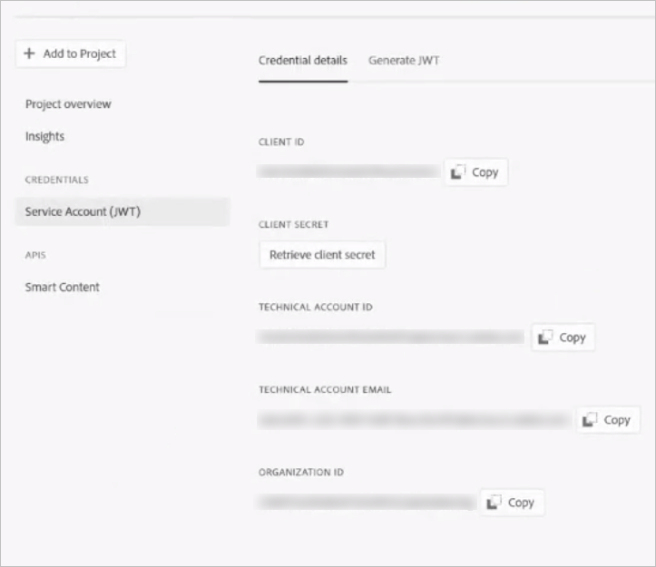

# Configure asset tagging using the Smart Content Service {#configure-asset-tagging-using-the-smart-content-service}

Sie können Adobe Experience Manager (AEM) mithilfe von Adobe I/O mit dem Smart ContentService integrieren. Verwenden Sie diese Konfiguration, um über AEM auf den Smart Content Service zuzugreifen.

Der Artikel beschreibt die folgenden Hauptaufgaben, die zum Konfigurieren des Smart Content Service erforderlich sind. Am Back-End authentifiziert der AEM-Server Ihre Service-Anmeldeinformationen beim Adobe IO-Gateway, bevor Ihre Anfrage an den Smart Content Service weitergeleitet wird.

* Erstellen Sie in AEM eine Konfiguration für den Smart Content Service, um einen öffentlichen Schlüssel zu erstellen. Erhalten Sie ein öffentliches Zertifikat für die OAuth-Integration.
* Erstellen Sie eine Integration in Adobe I/O und laden Sie den generierten öffentlichen Schlüssel hoch.
* Konfigurieren Sie die AEM-Instanz mithilfe des API-Schlüssels und anderen Anmeldeinformationen aus Adobe I/O.
* Aktivieren Sie optional das automatische Tagging beim Hochladen eines Assets.

## Voraussetzungen {#prerequisites}

Stellen Sie vor der Verwendung des Smart Content Service Folgendes sicher, um eine Integration in Adobe I/O zu erstellen:

* Es ist ein Adobe ID-Konto mit Administratorrechten für die Organisation vorhanden.
* Der Smart Content Service ist für Ihre Organisation aktiviert.

## Erhalten eines öffentlichen Zertifikats {#obtain-public-certificate}

Ein öffentliches Zertifikat ermöglicht Ihnen die Authentifizierung Ihres Profils in Adobe I/O.

1. Tippen Sie in der AEM-Benutzeroberfläche auf das AEM-Logo und öffnen Sie **[!UICONTROL Tools > Cloud-Services]** > **[!UICONTROL Legacy-Cloud-Services]**.

1. Tippen/klicken Sie auf der Seite der Cloud-Services unter **[!UICONTROL Smart-Tags für Assets Smart Tags]** auf **[!UICONTROL Jetzt konfigurieren]**.
1. Geben Sie im Dialogfeld **[!UICONTROL Konfiguration erstellen]** einen Titel und einen Namen für die Smart-Tags-Konfiguration ein. Tippen/klicken Sie auf **[!UICONTROL Erstellen]**.
1. Verwenden Sie im Dialogfeld **[!UICONTROL AEM Smart Content Service]** die folgenden Werte:

   **[!UICONTROL Dienst-URL]**: `https://mc.adobe.io/marketingcloud/smartcontent`

   **[!UICONTROL Autorisierungsserver]**: `https://ims-na1.adobelogin.com`

   Lassen Sie die anderen Felder vorerst leer (Werte werden später bereitgestellt). Tippen/klicken Sie auf **[!UICONTROL OK]**.

   

1. Tippen/klicken Sie auf **[!UICONTROL Öffentliches Zertifikat für OAuth-Integration herunterladen]** und laden Sie die öffentliche Zertifikatdatei `AEM-SmartTags.crt` herunter.

   

### Reconfigure when a certificate expires {#certrenew}

Wenn das Zertifikat abläuft, wird es nicht mehr als vertrauenswürdig eingestuft. Um ein neues Zertifikat hinzuzufügen, führen Sie diese Schritte aus. Sie können ein abgelaufenes Zertifikat nicht verlängern.

1. Melden Sie sich bei Ihrer AEM-Bereitstellung als Administrator an. Klicken Sie auf **[!UICONTROL Tools]** > **[!UICONTROL Sicherheit]** > **[!UICONTROL Benutzer]**.

1. Suchen und finden Sie **[!UICONTROL dam-update-service]**-Benutzer und klicken Sie darauf. Klicken Sie auf die Registerkarte **[!UICONTROL Keystore]**.
1. Löschen Sie den vorhandenen **[!UICONTROL similaritysearch]**-Keystore mit dem abgelaufenen Zertifikat. Klicken Sie auf **[!UICONTROL Speichern und schließen]**.

   

   Löschen Sie den vorhandenen Eintrag „similaritysearch“ (Ähnlichkeitssuche) in Keystore, um ein neues Sicherheitszertifikat hinzuzufügen.

1. Navigieren Sie zu **[!UICONTROL Tools]** > **[!UICONTROL Cloud Services]** > **[!UICONTROL Legacy Cloud Services]**. Klicken Sie auf **[!UICONTROL Asset-Smart-Tags]** > **[!UICONTROL Konfiguration anzeigen]** > **[!UICONTROL Verfügbare Konfigurationen]**. Klicken Sie auf die erforderliche Konfiguration.

1. Um ein öffentliches Zertifikat herunterzuladen, klicken Sie auf **[!UICONTROL Öffentliches Zertifikat für OAuth-Integration herunterladen]**.
1. Rufen Sie [https://console.adobe.io](https://console.adobe.io) auf und navigieren Sie zu den vorhandenen Smart Content Services auf der Seite **[!UICONTROL Integrationen]**. Laden Sie das neue Zertifikat hoch. Weitere Informationen finden Sie in den Anweisungen unter [Adobe I/O-Integration erstellen](#create-adobe-i-o-integration).

## Adobe I/O-Integration erstellen {#create-adobe-i-o-integration}

Um Smart Content Service-APIs zu verwenden, erstellen Sie eine Integration in Adobe I/O zur Generierung von API-Schlüssel, ID des technischen Kontos, Organisations-ID und Client-Geheimnis.

1. Greifen Sie auf [https://console.adobe.io](https://console.adobe.io/) zu.
1. Wählen Sie auf der Seite &quot; **[!UICONTROL Integrationen]** &quot;das entsprechende Konto aus und vergewissern Sie sich, dass es sich bei der zugeordneten Organisationsrolle um einen Systemadministrator handelt.
1. Tap **[!UICONTROL New integration]**.
1. Wählen Sie auf der Seite **[!UICONTROL Neue Integration erstellen]** die Option **[!UICONTROL Auf eine API zugreifen]** aus. Tippen Sie auf **[!UICONTROL Weiter]**.
1. Wählen Sie unter **[!UICONTROL Experience Cloud]** die Option **[!UICONTROL Smart Content]**. Tippen Sie auf **[!UICONTROL Weiter]**.

   

1. Wählen Sie auf der nächsten Seite **[!UICONTROL Neue Integration]** aus. Tippen/klicken Sie auf **[!UICONTROL Weiter]**.
1. Geben Sie auf der Seite **[!UICONTROL Integrationsdetails]** einen Namen für das Integrations-Gateway ein und fügen Sie eine Beschreibung hinzu.
1. Laden Sie in den **[!UICONTROL Zertifikaten zu öffentlichen Schlüsseln]** die Datei `AEM-SmartTags.crt` hoch, die Sie weiter oben heruntergeladen haben.
1. Tippen/klicken Sie auf **[!UICONTROL Integration erstellen]**.
1. Tippen/klicken Sie auf **[!UICONTROL Mit Integrationsdetails fortfahren]**, um die Integrationsinformationen anzuzeigen.

   

## Konfigurieren des Smart Content Service {#configure-smart-content-service}

Verwenden Sie zum Konfigurieren der Integration die Werte der Felder „ID des technischen Kontos“, „Organisations-ID“, „Client-Geheimnis“, „Autorisierungsserver“ und „API-Schlüssel“ aus der Adobe I/O-Integration. Das Erstellen einer Smart-Tags-Cloud-Konfiguration ermöglicht die Authentifizierung von API-Anfragen von der AEM-Instanz.

1. Tippen/klicken Sie in der AEM-Benutzeroberfläche auf das AEM-Logo. Navigieren Sie zu **[!UICONTROL Tools > Cloud-Service > Legacy-Cloud-Services]**, um die Cloud-Services-Konsole zu öffnen.
1. Öffnen Sie unter den **[!UICONTROL Smart-Tags für Assets]** die oben erstellte Konfiguration. Klicken Sie auf der Seite mit den Serviceeinstellungen auf **[!UICONTROL Bearbeiten]**.
1. Verwenden Sie im Dialogfeld **[!UICONTROL AEM Smart Content Service]** die vorab ausgefüllten Werte für die Felder **[!UICONTROL Service-URL]** und **[!UICONTROL Autorisierungsserver]**.
1. Verwenden Sie für die Felder **[!UICONTROL API-Schlüssel]**, **[!UICONTROL ID des technischen Kontos]**, **[!UICONTROL Organisations-ID]** und **[!UICONTROL Client-Geheimnis]** die oben generierten Werte.

## Überprüfen der Konfiguration {#validate-the-configuration}

Nachdem Sie die Konfiguration abgeschlossen haben, können Sie die Konfiguration mit einem JMX MBean überprüfen. Führen Sie zum Überprüfen die folgenden Schritte aus.

1. Access your AEM server at `https://[server]:[port]`.

1. Öffnen Sie unter **[!UICONTROL Tools > Vorgänge > Web-Konsole]** die OSGi-Konsole. Klicken Sie auf **[!UICONTROL Haupt > JMX]**.
1. Klicken Sie auf **[!UICONTROL com.day.cq.dam.similaritysearch.internal.impl]**. Die Seite **[!UICONTROL SimilaritySearch Miscellaneous Tasks]** wird geöffnet
1. Klicken Sie auf **[!UICONTROL validateConfigs()]**. In the **[!UICONTROL Validate Configurations]** dialog, click **[!UICONTROL Invoke]**.

   Das Überprüfungsergebnis wird im selben Dialogfeld angezeigt.

## Aktivieren der Smart-Tagging-Funktion im Workflow „Update-Asset“ (optional) {#enable-smart-tagging-in-the-update-asset-workflow-optional}

1. Tippen Sie in der AEM-Benutzeroberfläche auf das AEM-Logo und öffnen Sie **[!UICONTROL Tools > Workflow > Modelle]**.
1. Wählen Sie auf der Seite **[!UICONTROL Workflow-Modelle]** das Workflow-Modell **[!UICONTROL DAM-Update-Asset]** aus.
1. Klicken Sie in der Symbolleiste auf **[!UICONTROL Bearbeiten]**. .
1. Vergrößern Sie das seitliche Bedienfeld, um die Schritte anzuzeigen. Platzieren Sie den im Abschnitt „DAM Workflow“ verfügbaren Schritt **[!UICONTROL Smart Tag Asset]** nach dem Schritt **[!UICONTROL Miniaturansichten verarbeiten]**.

   

1. Öffnen Sie den Schritt im Bearbeitungsmodus. Under **[!UICONTROL Advanced Settings]**, ensure that the **[!UICONTROL Handler Advance]** option is selected.

   

1. Wählen Sie auf der Registerkarte **[!UICONTROL Argumente]** die Option **[!UICONTROL Fehler ignorieren]** aus, wenn Sie möchten, dass der Workflow abgeschlossen wird, selbst wenn das automatische Tagging fehlschlägt.

   

   Um Assets unabhängig davon mit Tags zu versehen, ob die Smart-Tagging-Funktion für Ordner aktiviert ist, wählen Sie **[!UICONTROL Smart-Tag-Flag ignorieren]** aus.

   

1. Tap **[!UICONTROL OK]** to close the process step, and then save the workflow.

>[!MORELIKETHIS]
>
>* [Verwaltung intelligenter Tags](managing-smart-tags.md)
>* [Übersicht und Schulung von Smart-Tags](enhanced-smart-tags.md)
>* [Richtlinien und Regeln zur Schulung des intelligenten Inhaltsdienstes](smart-tags-training-guidelines.md)
>* [Videoschulung zum Konfigurieren von Smart-Tags](https://docs.adobe.com/content/help/en/experience-manager-learn/assets/metadata/smart-tags-technical-video-setup.html)

