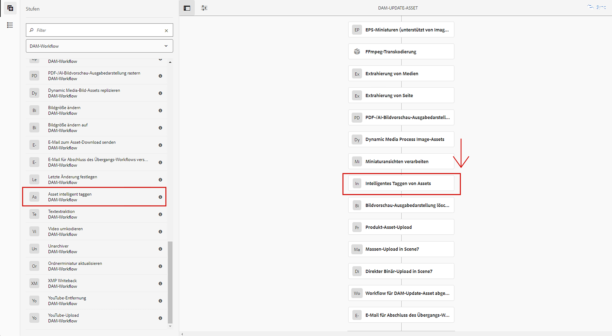

# [!DNL Assets] für intelligentes Tagging {#configure-asset-tagging-using-the-smart-content-service} vorbereiten

Bevor Sie mit dem Tagging Ihrer Assets mit Smart Content Services beginnen können, integrieren Sie [!DNL Experience Manager Assets] in die Adobe Developer Console, um den Smart Service von [!DNL Adobe Sensei] zu nutzen. Nach der Konfiguration trainieren Sie den Dienst mit ein paar Bildern und einem Tag.

Bevor Sie den Smart Content Service verwenden, stellen Sie Folgendes sicher:

* [Integration mit der Adobe Developer Console](#integrate-adobe-io).
* [Schulung des Smart Content Service](#training-the-smart-content-service).

   <!-- TBD: This link will update soon after the new articles goes live on docs.adobe.com. Change it when new URL is available.
  -->

* Installieren Sie das neueste [Experience Manager Service Pack](https://experienceleague.adobe.com/docs/experience-manager-release-information/aem-release-updates/aem-releases-updates.html).

## Integration mit der Adobe Developer Console {#integrate-adobe-io}

Wenn Sie die Integration mit der Adobe Developer Console durchführen, authentifiziert der Server [!DNL Experience Manager] Ihre Dienstanmeldeinformationen mit dem Adobe Developer Console Gateway, bevor Sie Ihre Anforderung an den Smart Content Service weiterleiten. Zur Integration benötigen Sie ein Adobe ID-Konto, das über Administratorrechte für das Unternehmen verfügt, sowie eine Smart Content Service-Lizenz, die für Ihr Unternehmen erworben und aktiviert wurde.

Gehen Sie wie folgt vor, um den Dienst für intelligente Inhalte zu konfigurieren:

1. Um einen öffentlichen Schlüssel zu generieren, [Erstellen Sie eine Konfiguration für einen intelligenten Content-Dienst](#obtain-public-certificate) in [!DNL Experience Manager]. [Erlangen Sie ein öffentliches Zertifikat](#obtain-public-certificate) für die OAuth-Integration.

1. [Erstellen Sie eine Integration in der Adobe Developer Console](#create-adobe-i-o-integration) und laden Sie den generierten öffentlichen Schlüssel hoch.

1. [Konfigurieren Sie Ihre ](#configure-smart-content-service) Bereitstellung mithilfe des API-Schlüssels und anderer Anmeldedaten aus der Adobe Developer Console.

1. [Testen Sie die Konfiguration](#validate-the-configuration).

1. Optional können Sie [das automatische Tagging beim Hochladen von Assets aktivieren](#enable-smart-tagging-in-the-update-asset-workflow-optional).

### Öffentliches Zertifikat abrufen, indem Sie die Konfiguration für den Smart Content Service {#obtain-public-certificate} erstellen

Ein öffentliches Zertifikat ermöglicht Ihnen die Authentifizierung Ihres Profils in der Adobe Developer Console.

1. Rufen Sie in der [!DNL Experience Manager]-Benutzeroberfläche **[!UICONTROL Tools]** > **[!UICONTROL Cloud Services]** > **[!UICONTROL Ältere Cloud Services]** auf.

1. Klicken Sie auf der Seite &quot;Cloud Services&quot;unter **[!UICONTROL Assets Smart Tags]** auf **[!UICONTROL Jetzt konfigurieren]**.

1. Geben Sie im Dialogfeld **[!UICONTROL Konfiguration erstellen]** einen Titel und einen Namen für die Smart-Tags-Konfiguration ein. Klicken Sie auf **[!UICONTROL Erstellen]**.

1. Verwenden Sie im Dialogfeld **[!UICONTROL AEM Smart Content Service]** die folgenden Werte:

   **[!UICONTROL Dienst-URL]**: `https://mc.adobe.io/marketingcloud/smartcontent`

   **[!UICONTROL Autorisierungsserver]**: `https://ims-na1.adobelogin.com`

   Lassen Sie die anderen Felder vorerst leer (Werte werden später bereitgestellt). Klicken Sie auf **[!UICONTROL OK]**.

   

   *Abbildung: Dialogfeld &quot;Smart Content Service&quot;zum Bereitstellen der URL des Inhaltsdienstes*

   >[!NOTE]
   >
   >Die als [!UICONTROL Dienst-URL] bereitgestellte URL kann nicht über den Browser aufgerufen werden und erzeugt einen 404-Fehler. Die Konfiguration funktioniert mit demselben Wert des Parameters [!UICONTROL Dienst-URL]. Der Gesamtplan für den Dienststatus und die Wartung finden Sie unter [https://status.adobe.com](https://status.adobe.com).

1. Klicken Sie auf **[!UICONTROL Öffentliches Zertifikat für OAuth-Integration herunterladen]** und laden Sie die Datei für das öffentliche Zertifikat `AEM-SmartTags.crt` herunter.

   

   *Abbildung: Einstellungen für den intelligenten Tag-Dienst.*

#### Konfigurieren, wenn ein Zertifikat abläuft {#certrenew}

Nach Ablauf eines Zertifikats wird es nicht mehr als vertrauenswürdig eingestuft. Sie können ein abgelaufenes Zertifikat nicht verlängern. Gehen Sie wie folgt vor, um ein Zertifikat hinzuzufügen.

1. Melden Sie sich bei Ihrer [!DNL Experience Manager]-Implementierung als Administrator an. Klicken Sie auf **[!UICONTROL Tools]** > **[!UICONTROL Sicherheit]** > **[!UICONTROL Benutzer]**.

1. Suchen und finden Sie **[!UICONTROL dam-update-service]**-Benutzer und klicken Sie darauf. Klicken Sie auf die Registerkarte **[!UICONTROL Keystore]**.

1. Löschen Sie den vorhandenen **[!UICONTROL similaritysearch]**-Keystore mit dem abgelaufenen Zertifikat. Klicken Sie auf **[!UICONTROL Speichern und schließen]**.

   

   *Abbildung: Löschen Sie den vorhandenen  `similaritysearch` Eintrag in Keystore, um ein Sicherheitszertifikat hinzuzufügen.*

1. Navigieren Sie zu **[!UICONTROL Werkzeuge]** > **[!UICONTROL Cloud Services]** > **[!UICONTROL Legacy-Cloud Services]**. Klicken Sie auf **[!UICONTROL Asset-Smart-Tags]** > **[!UICONTROL Konfiguration anzeigen]** > **[!UICONTROL Verfügbare Konfigurationen]**. Klicken Sie auf die gewünschte Konfiguration.

1. Um ein öffentliches Zertifikat herunterzuladen, klicken Sie auf **[!UICONTROL Öffentliches Zertifikat für OAuth-Integration herunterladen]**.

1. Rufen Sie [https://console.adobe.io](https://console.adobe.io) auf und navigieren Sie zu den vorhandenen Smart Content Services auf der Seite **[!UICONTROL Integrationen]**. Laden Sie das neue Zertifikat hoch. Weitere Informationen finden Sie in den Anweisungen unter [Adobe Developer Console-Integration erstellen](#create-adobe-i-o-integration).

### Adobe Developer Console-Integration {#create-adobe-i-o-integration} erstellen

Um Smart Content Service-APIs zu verwenden, erstellen Sie eine Integration in der Adobe Developer Console, um [!UICONTROL API-Schlüssel] (generiert im Feld [!UICONTROL CLIENT-ID] der Adobe Developer Console-Integration), [!UICONTROL TECHNISCHE ACCOUNT-ID], [!UICONTROL ORGANISATION-ID] und [!UICONTROL  zu erhalten. CLIENT SECRET] für [!UICONTROL Assets Smart Tagging Service Settings] der Cloud-Konfiguration in [!DNL Experience Manager].

1. Rufen Sie [https://console.adobe.io](https://console.adobe.io/) in einem Browser auf. Wählen Sie das entsprechende Konto aus und vergewissern Sie sich, dass die zugehörige Organisationsrolle „Systemadministrator“ ist.

1. Erstellen Sie ein Projekt mit einem beliebigen Namen. Klicken Sie auf **[!UICONTROL API hinzufügen]**.

1. Wählen Sie auf der Seite **[!UICONTROL API hinzufügen]** die Option **[!UICONTROL Experience Cloud]** und dann **[!UICONTROL Smart Content]** aus. Klicken Sie auf **[!UICONTROL Weiter]**.

1. Wählen Sie **[!UICONTROL Öffentlichen Schlüssel hochladen]** aus. Stellen Sie die von [!DNL Experience Manager] heruntergeladenen Zertifikatdatei bereit. Die Meldung [!UICONTROL Öffentliche(r) Schlüssel erfolgreich hochgeladen] wird angezeigt. Klicken Sie auf **[!UICONTROL Weiter]**.

   [!UICONTROL Auf der ] Seite &quot;Neues Dienstkonto erstellen&quot;wird der öffentliche Schlüssel für das Dienstkonto angezeigt.

1. Klicken Sie auf **[!UICONTROL Weiter]**.

1. Wählen Sie auf der Seite **[!UICONTROL Produktprofile auswählen]** die Option **[!UICONTROL Smart Content Services]** aus. Klicken Sie auf **[!UICONTROL Konfigurierte API speichern]**.

   Auf einer Seite werden weitere Informationen zur Konfiguration angezeigt. Lassen Sie diese Seite geöffnet, um diese Werte in [!UICONTROL Assets Smart Tagging Service Settings] der Cloud-Konfiguration in [!DNL Experience Manager] zu kopieren und hinzuzufügen, um Smarttags zu konfigurieren.

   

   *Abbildung: Integrationsdetails in der Adobe Developer Console*

### Konfigurieren des Smart Content Service {#configure-smart-content-service}

Verwenden Sie zum Konfigurieren der Integration die Werte der Felder [!UICONTROL TECHNISCHE KONTO-ID], [!UICONTROL ORGANISATIONS-ID], [!UICONTROL CLIENT SECRET] und [!UICONTROL CLIENT-ID] aus der Adobe Developer Console. Das Erstellen einer Smart-Tags-Cloud-Konfiguration ermöglicht die Authentifizierung von API-Anforderungen aus der [!DNL Experience Manager]-Bereitstellung.

1. Navigieren Sie in [!DNL Experience Manager] zu **[!UICONTROL Tools]** > **[!UICONTROL Cloud Service]** > **[!UICONTROL Ältere Cloud Services]**, um die Konsole [!UICONTROL Cloud Services] zu öffnen.

1. Öffnen Sie unter den **[!UICONTROL Smart-Tags für Assets]** die oben erstellte Konfiguration. Klicken Sie auf der Seite mit den Serviceeinstellungen auf **[!UICONTROL Bearbeiten]**.

1. Verwenden Sie im Dialogfeld **[!UICONTROL AEM Smart Content Service]** die vorausgefüllten Werte für die Felder **[!UICONTROL Service-URL]** und **[!UICONTROL Autorisierungsserver]**.

1. Kopieren Sie für die Felder [!UICONTROL API-Schlüssel], [!UICONTROL Technische Konto-ID], [!UICONTROL Organisations-ID] und [!UICONTROL Clientgeheimnis] die folgenden Werte, die in [Adobe Developer Console integration](#create-adobe-i-o-integration) generiert wurden, und verwenden Sie sie.

   | [!UICONTROL Diensteinstellungen für Smart-Tagging in Assets] | [!DNL Adobe Developer Console] Integrationsfelder |
   |--- |--- |
   | [!UICONTROL API-Schlüssel] | [!UICONTROL CLIENT-ID] |
   | [!UICONTROL ID des technischen Kontos] | [!UICONTROL TECHNISCHE KONTO-ID] |
   | [!UICONTROL Unternehmens-ID] | [!UICONTROL Organisations-ID] |
   | [!UICONTROL Client-Geheimnis] | [!UICONTROL CLIENT SECRET] |

### Überprüfen der Konfiguration {#validate-the-configuration}

Nachdem Sie die Konfiguration abgeschlossen haben, können Sie eine JMX MBean verwenden, um die Konfiguration zu validieren. Führen Sie zum Überprüfen die folgenden Schritte aus.

1. Greifen Sie auf Ihren [!DNL Experience Manager]-Server unter `https://[aem_server]:[port]` zu.

1. Gehen Sie zu **[!UICONTROL Tools]** > **[!UICONTROL Vorgänge]** > **[!UICONTROL Webkonsole]**, um die OSGi-Konsole zu öffnen. Klicken Sie auf **[!UICONTROL Main] > [!UICONTROL JMX]**.

1. Klicken Sie auf `com.day.cq.dam.similaritysearch.internal.impl`. Es wird **[!UICONTROL Ähnliche Suche Verschiedene Aufgaben]** geöffnet.

1. Klicken Sie auf `validateConfigs()`. Klicken Sie im Dialogfeld **[!UICONTROL Konfigurationen überprüfen]** auf **[!UICONTROL Aufrufen]**.

Die Überprüfungsergebnisse werden im gleichen Dialogfeld angezeigt.

### Aktivieren Sie intelligentes Tagging im Arbeitsablauf [!UICONTROL DAM-Update-Asset] (Optional) {#enable-smart-tagging-in-the-update-asset-workflow-optional}

1. Gehen Sie in [!DNL Experience Manager] zu **[!UICONTROL Tools]** > **[!UICONTROL Workflow]** > **[!UICONTROL Modelle]**.

1. Wählen Sie auf der Seite **[!UICONTROL Workflow-Modelle]** das Workflow-Modell **[!UICONTROL DAM Update Asset]** aus.

1. Klicken Sie in der Symbolleiste auf **[!UICONTROL Bearbeiten]**.

1. Erweitern Sie das Seitenbedienfeld, um die Schritte anzuzeigen. Ziehen Sie den Schritt **[!UICONTROL Asset intelligent taggen]**, der im Abschnitt „DAM-Workflow“ verfügbar ist, und platzieren Sie ihn nach dem Schritt **[!UICONTROL Prozessminiaturansichten]**.

   

   *Abbildung: Schritt zum Hinzufügen von Smart-Tag-Assets nach dem Schritt „Miniaturansichten verarbeiten“ im Workflow „DAM-Update-Asset“.*

1. Öffnen Sie den Schritt im Bearbeitungsmodus. Stellen Sie unter **[!UICONTROL Erweiterte Einstellungen]** sicher, dass die Option **[!UICONTROL Handler-Erweiterung]** ausgewählt ist.

   

   *Abbildung: DAM-Arbeitsablauf zum Aktualisieren von Assets konfigurieren und Schritt zum Hinzufügen von Smarttags*

1. Wählen Sie auf der Registerkarte **[!UICONTROL Argumente]** die Option **[!UICONTROL Fehler ignorieren]**, wenn der Workflow auch dann abgeschlossen werden soll, falls der automatische Tag-Schritt fehlschlägt.

   

   *Abbildung: DAM-Arbeitsablauf zum Aktualisieren von Assets konfigurieren, um einen Schritt zum intelligenten Tag hinzuzufügen und Handler-Modus auszuwählen*

   Um Assets unabhängig davon mit Tags zu versehen, ob die Smart-Tagging-Funktion für Ordner aktiviert ist, wählen Sie **[!UICONTROL Smart-Tag-Markierung ignorieren]** aus.

   

   *Abbildung: Konfigurieren Sie den DAM Update Asset-Workflow, um einen Smart-Tag-Schritt hinzuzufügen und wählen Sie &quot;Smart-Tag-Flag ignorieren&quot;.*

1. Klicken Sie auf **[!UICONTROL OK]**, um den Prozessschritt zu schließen, und speichern Sie dann den Workflow.

## Intelligenten Content-Dienst {#training-the-smart-content-service}

Damit der Smart Content Service die Taxonomie Ihres Unternehmens erkennen kann, sollten Sie den Dienst auf einen Asset-Satz ausführen, der bereits für Ihr Unternehmen relevante Tags enthält. Um Ihre Markenbilder effektiv mit Tags zu versehen, erfordert der Smart Content Service, dass die Schulungsbilder bestimmten Richtlinien entsprechen. Nach dem Training kann der Dienst dieselbe Taxonomie auf einen ähnlichen Satz von Assets anwenden.

Sie können den Dienst mehrfach trainieren, um die Fähigkeit, relevante Tags anzuwenden, zu verbessern. Führen Sie nach jedem Trainingszyklus einen Tagging-Workflow aus und überprüfen Sie, ob Ihre Assets mit den richtigen Tags versehen wurden.

Sie können den Smart Content Service regelmäßig oder je nach Anforderung trainieren.

>[!NOTE]
>
>Der Trainings-Workflow wird nur für Ordner ausgeführt.

### Richtlinien für das Training {#guidelines-for-training}

Die besten Ergebnisse erzielen Sie, wenn die Bilder in Ihrem Schulungssatz den folgenden Richtlinien entsprechen:

**Menge und Größe:** Mindestens 30 Bilder pro Tag. Mindestens 500 Pixel auf der längeren Seite.

**Kohärenz**: Bilder, die für ein bestimmtes Tag verwendet werden, sind visuell ähnlich.

So ist es beispielsweise nicht empfehlenswert, all diese Bilder mit dem Tag `my-party` zu versehen (zu Trainings-Zwecken), da sie einander visuell nicht ähnlich sind.

**Reichweite**: Verwenden Sie ausreichend Abwechslung in den Bildern in der Schulung. Es geht darum, einige, aber recht unterschiedliche Beispiele zu liefern, damit der Experience Manager lernt, sich auf die richtigen Dinge zu konzentrieren. Wenn Sie dasselbe Tag auf visuell unähnliche Bilder anwenden, schließen Sie mindestens fünf Beispiele für jeden Typ ein.

Beispiel: Schließen Sie für das Tag *model-down-pose* mehr Trainings-Bilder ein, die dem hervorgehobenen Bild unten ähnlich sind, sodass der Service ähnliche Bilder beim Hinzufügen von Tags genauer identifizieren kann.

**Ablenkung/Verdeckung**: Der Service kann besser mit Bildern trainieren, die weniger Ablenkungen enthalten (hervorgehobenen Hintergründe oder Elemente ohne Bezug wie Objekte/Personen neben dem Hauptsubjekt).

Beispiel: Für das Tag *casual-shoe* ist das zweite Bild kein guter Kandidat für das Training.

**Vollständigkeit:** Wenn ein Bild für mehr als ein Tag qualifiziert ist, fügen Sie alle entsprechenden Tags hinzu, bevor Sie das Bild für eine Schulung hinzufügen. Beispiel: Fügen Sie im Falle von Tags wie `raincoat` und `model-side-view` beide Tags zum entsprechenden Asset hinzu, bevor Sie dieses für Trainingszwecke verwenden.

>[!NOTE]
>
>Die Fähigkeit des Smart Content Service, aus Ihren Tags zu lernen und diese Tags auf andere Bilder anzuwenden, hängt von der Qualität der für das Training verwendeten Bilder ab. Um die bestmöglichen Ergebnisse zu erzielen, empfiehlt Adobe die Verwendung visuell ähnlicher Bilder, um den Service für die einzelnen Tags zu trainieren.

### Regelmäßiges Trainieren {#periodic-training}

Sie können festlegen, dass der Smart Content Service regelmäßig mit den Assets und zugewiesenen Tags in einem Ordner trainiert wird. Öffnen Sie die Seite [!UICONTROL Eigenschaften] Ihres Asset-Ordners, wählen Sie **[!UICONTROL Smart-Tags aktivieren]** unter der Registerkarte **[!UICONTROL Details]** und speichern Sie die Änderungen.

Wenn diese Option für einen Ordner ausgewählt ist, führt [!DNL Experience Manager] automatisch einen Schulungsablauf aus, um den Smart Content Service für die Ordner-Assets und deren Tags auszubilden. Standardmäßig wird der Trainings-Workflow jede Woche samstags um 00:30 Uhr ausgeführt.

### Training bei Bedarf {#on-demand-training}

Sie können den Smart Content Service über die Workflow-Konsole trainieren, wann immer es erforderlich ist.

1. Wechseln Sie in der [!DNL Experience Manager]-Schnittstelle zu **[!UICONTROL Tools]** > **[!UICONTROL Workflow]** > **[!UICONTROL Modelle]**.
1. Wählen Sie auf der Seite **[!UICONTROL Workflow-Modelle]** den Workflow **[!UICONTROL Smart Tags Training]** und klicken Sie dann in der Symbolleiste auf **[!UICONTROL Beginn-Workflow]**.
1. Suchen Sie im Dialogfeld **[!UICONTROL Workflow ausführen]** nach dem Payload-Ordner, der die mit Tags versehenen Assets für das Trainieren des Diensts enthält.
1. Geben Sie einen Titel für den Workflow an und fügen Sie einen Kommentar hinzu. Klicken Sie dann auf **[!UICONTROL Ausführen]**. Die Assets und Tags werden für das Training übermittelt.

   

>[!NOTE]
>
>Nachdem die Assets in einem Ordner für die Schulung verarbeitet wurden, werden in den nachfolgenden Schulungszyklen nur die geänderten Assets verarbeitet.

### Ansichten-Schulungsberichte {#viewing-training-reports}

Um sicherzustellen, dass der Smart Content Service auf Ihre Tags im Asset-Trainingssatz trainiert ist, überprüfen Sie den Bericht zum Trainings-Workflow über die Berichte-Konsole.

1. Wechseln Sie in der [!DNL Experience Manager]-Schnittstelle zu **[!UICONTROL Tools]** > **[!UICONTROL Assets]** > **[!UICONTROL Berichte]**.
1. Klicken Sie auf der Seite **[!UICONTROL Asset-Berichte]** auf **[!UICONTROL Erstellen]**.
1. Wählen Sie den Bericht **[!UICONTROL Smart-Tags-Training]** aus und klicken Sie dann in der Symbolleiste auf **[!UICONTROL Weiter]**.
1. Geben Sie einen Titel und eine Beschreibung für den Bericht an. Lassen Sie unter **[!UICONTROL Berichtplanen]** die Option **[!UICONTROL Jetzt]** aktiviert. Wenn Sie den Bericht für einen späteren Zeitpunkt planen möchten, wählen Sie **[!UICONTROL Später]** und geben Sie ein Datum und eine Uhrzeit an. Klicken Sie dann in der Symbolleiste auf **[!UICONTROL Erstellen]**.
1. Wählen Sie auf der Seite **[!UICONTROL Asset-Berichte]** den erstellten Bericht aus. Um den Bericht anzuzeigen, klicken Sie in der Symbolleiste auf **[!UICONTROL Ansicht]**.
1. Prüfen Sie die Details des Berichts.

   Der Bericht zeigt den Trainings-Status der von Ihnen trainierten Tags an. Grün gibt in der Spalte **[!UICONTROL Trainingsstatus]** an, dass der Smart Content Service für das Tag trainiert wird. Gelb bedeutet, dass der Service für ein bestimmtes Tag nicht vollständig trainiert ist. Fügen Sie in diesem Fall weitere Bilder mit dem jeweiligen Tag hinzu und führen Sie den Trainings-Workflow aus, um den Service vollständig für das Tag zu trainieren.

   Wenn Ihre Tags nicht im Bericht angezeigt werden, führen Sie den Trainings-Workflow für diese Tags erneut aus.

1. Um den Bericht herunterzuladen, wählen Sie ihn aus der Liste aus und klicken Sie in der Symbolleiste auf **[!UICONTROL Herunterladen]**. Der Bericht wird als Microsoft Excel-Tabelle heruntergeladen.

## Beschränkungen {#limitations}

* Verbesserte Smart-Tags basieren auf Lernmodellen von Bildern und deren Tags. Diese Modelle können Tags nicht immer perfekt identifizieren. Bei der aktuellen Version des Smart Content Service gibt es folgende Einschränkungen:

   * Subtile Unterschiede in Bildern können nicht erkannt werden. Beispiel: T-Shirts mit schmalem oder normalem Schnitt.
   * Tags können nicht anhand von winzigen Mustern/Teilen eines Bildes identifiziert werden. Beispiel: Logos auf T-Shirts.
   * Tagging wird in den Gebietsschemas unterstützt, in denen [!DNL Experience Manager] unterstützt wird. Eine Liste der Sprachen finden Sie in den [Versionshinweisen für Smart Content Services](https://experienceleague.adobe.com/docs/experience-manager-64/release-notes/smart-content-service-release-notes.html?lang=de).

* Um nach Assets mit Smart-Tags zu suchen (regulär oder erweitert), verwenden Sie die [!DNL Assets] Omniture-Suche (Volltextsuche). Es gibt kein separates Suchprädikat für Smart-Tags.

>[!MORELIKETHIS]
>
>* [Übersicht und Schulung von Smart-Tags](enhanced-smart-tags.md)
>* [Videoschulung zu Smart-Tags](https://experienceleague.adobe.com/docs/experience-manager-learn/assets/metadata/image-smart-tags.html)

