# Konfigurieren von AEM Assets mit Brand Portal {#configure-integration-65}

Mit dem Markenportal für Adobe Experience Manager Assets können Sie genehmigte Markenelemente aus Adobe Experience Manager Assets im Markenportal veröffentlichen und an die Benutzer des Markenportals verteilen.

AEM Assets  wird über die Adobe Developer Console mit Brand Portal konfiguriert. Dadurch wird ein Adobe Identity Management Services (IMS)-Token zur Autorisierung Ihres Brand Portal-Mandanten abgerufen.

>[!NOTE]
>
>Die Konfiguration von AEM Assets mit dem Markenportal über die Adobe Developer Console wird auf AEM 6.5.4.0 und höher unterstützt.
>
>Zuvor wurde das Markenportal über das alte OAuth Gateway konfiguriert, das den JSON Web Token (JWT) Austausch nutzt, um ein IMS-Zugriffstoken zur Autorisierung zu erhalten.
>
>Die Konfiguration über veraltetes OAuth Gateway wird ab dem 6. April 2020 nicht mehr unterstützt und in Adobe Developer Console geändert.

>[!TIP]
>
>***Nur für Bestandskunden***
>
>Es wird empfohlen, weiterhin die vorhandene alte OAuth Gateway-Konfiguration zu verwenden. Falls Probleme mit der alten OAuth Gateway-Konfiguration auftreten, löschen Sie die vorhandene Konfiguration und erstellen Sie eine neue Konfiguration über die Adobe Developer Console.

In dieser Hilfe werden die folgenden zwei Anwendungsfälle beschrieben:

* [Neue Konfiguration](#configure-new-integration-65): Wenn Sie ein neuer Brand Portal-Benutzer sind und Ihre AEM Assets-Autoreninstanz mit Brand Portal konfigurieren möchten, können Sie die Konfiguration über die Adobe Developer Console erstellen.
* [Upgrade-Konfiguration](#upgrade-integration-65): Wenn Sie ein bestehender Brand Portal-Benutzer sind, der auf dem alten OAuth Gateway konfiguriert ist, löschen Sie die vorhandene Konfiguration und erstellen Sie eine neue Konfiguration über die Adobe Developer Console.

Benutzer dieser Hilfe sollten mit den folgenden Technologien vertraut sein:

* Installieren, Konfigurieren und Verwalten von Adobe Experience Manager- und AEM-Paketen.

* Verwenden von Linux- und Microsoft Windows-Betriebssystemen.

## Voraussetzungen {#prerequisites}

Sie benötigen Folgendes, um AEM Assets mit Brand Portal zu konfigurieren:

* Eine AEM Assets-Autoreninstanz mit dem neuesten Service Pack
* Eine Brand Portal-Mandanten-URL
* Ein Anwender mit Systemadministrator-Berechtigungen für die IMS-Organisation des Brand Portal-Mandanten

[Herunterladen und Installieren von AEM 6.5](#aemquickstart)

[Herunterladen und Installieren des neuesten AEM Service Packs](#servicepack)

### Laden Sie AEM 6.5 {#aemquickstart} herunter und installieren Sie es

Es wird empfohlen, AEM 6.5 zu verwenden, um eine AEM Autoreninstanz einzurichten. Wenn Sie AEM nicht eingerichtet haben, laden Sie es von den folgenden Speicherorten herunter:

* Wenn Sie bereits AEM sind, laden Sie AEM 6.5 von der [Adobe Licensing Website](http://licensing.adobe.com) herunter.

* Wenn Sie Partner der Adobe sind, verwenden Sie [Adobe Partner Training Programm](https://adobe.allegiancetech.com/cgi-bin/qwebcorporate.dll?idx=82357Q), um AEM 6.5 anzufordern.

Anweisungen zum Einrichten einer AEM- Autoreninstanz finden Sie nach dem Herunterladen von AEM unter [Bereitstellen und Verwalten](https://docs.adobe.com/content/help/en/experience-manager-65/deploying/deploying/deploy.html#default-local-install).

### Herunterladen und Installieren des neuesten AEM Service Packs{#servicepack}

Ausführliche Anweisungen finden Sie unter

* [Versionshinweise zum AEM 6.5 Service Pack](https://docs.adobe.com/content/help/de-DE/experience-manager-65/release-notes/service-pack/sp-release-notes.html)

**Wenden Sie sich an** Support, wenn Sie das neueste AEM oder Service Pack nicht finden können.

## Erstellen der Konfiguration {#configure-new-integration-65}

Zum Konfigurieren von AEM Assets mit dem Markenportal sind Konfigurationen sowohl in der AEM Assets-Autoreninstanz als auch in der Adobe Developer Console erforderlich.

1. Erstellen Sie in AEM Assets ein IMS-Konto und erstellen Sie ein öffentliches Zertifikat (öffentlicher Schlüssel).
1. Erstellen Sie in der Adobe Developer Console ein Projekt für Ihren Brand Portal-Mandanten (Unternehmen).
1. Konfigurieren Sie unter dem Projekt eine API mithilfe des öffentlichen Schlüssels, um eine JWT-Verbindung (Dienstkonto) zu erstellen.
1. Rufen Sie die Anmeldedaten für das Dienstkonto und die JWT-Payload-Informationen ab.
1. Konfigurieren Sie in AEM Assets das IMS-Konto mit den Anmeldedaten für das Service-Konto und die JWT-Payload.
1. Konfigurieren Sie in AEM Assets den Brand Portal-Cloud Service mit dem IMS-Konto und dem Brand Portal-Endpunkt (Organisations-URL).
1. Testen Sie die Konfiguration, indem Sie ein Asset aus AEM Assets in Brand Portal veröffentlichen.

>[!NOTE]
>
>Eine AEM Assets-Autoreninstanz darf nur mit einem Markenportal-Mandanten konfiguriert werden.

Führen Sie die folgenden Schritte in der aufgeführten Reihenfolge aus, wenn Sie AEM Assets mit Markenportal zum ersten Mal konfigurieren:
1. [Abrufen eines öffentlichen Zertifikats](#public-certificate)
1. [Erstellen einer JWT-Verbindung (Service-Konto)](#createnewintegration)
1. [Konfigurieren des IMS-Kontos](#create-ims-account-configuration)
1. [Konfigurieren von Cloud Service](#configure-the-cloud-service)
1. [Testen der Konfiguration](#test-integration)

### Erstellen der IMS-Konfiguration {#create-ims-configuration}

Die IMS-Konfiguration authentifiziert Ihre AEM Assets-Autoreninstanz mit dem Markenportal-Mandanten.

Die IMS-Konfiguration umfasst zwei Schritte:

* [Abrufen eines öffentlichen Zertifikats](#public-certificate)
* [Konfigurieren des IMS-Kontos](#create-ims-account-configuration)

### Abrufen eines öffentlichen Zertifikats {#public-certificate}

Der öffentliche Schlüssel (Zertifikat) authentifiziert Ihr Profil in der Adobe Developer Console.

1. Melden Sie sich bei der AEM Assets-Autorenistanz an. Die Standardeinstellung ist `http://localhost:4502/aem/start.html`.

1. Navigieren Sie im Bedienfeld **Tools**  zu **[!UICONTROL Sicherheit]** > **[!UICONTROL Adobe IMS-Konfigurationen]**.

1. Klicken Sie auf der Seite mit den Adobe IMS-Konfigurationen auf **[!UICONTROL Erstellen]**. Sie werden zur Seite für die **[!UICONTROL Konfiguration des technischen Adobe IMS-Kontos]** weitergeleitet. Standardmäßig wird die Registerkarte **Zertifikat** geöffnet.

1. Wählen Sie **[!UICONTROL Adobe Brand Portal]** in der Dropdown-Liste **[!UICONTROL Cloud-Lösung]** aus.

1. Aktivieren Sie das Kontrollkästchen **[!UICONTROL Neues Zertifikat erstellen]** und geben Sie einen **Alias** für den öffentlichen Schlüssel an. Der Alias dient als Name des öffentlichen Schlüssels.

1. Klicken Sie auf **[!UICONTROL Zertifikat erstellen]**. Klicken Sie auf **[!UICONTROL OK]**, um den öffentlichen Schlüssel zu generieren.

   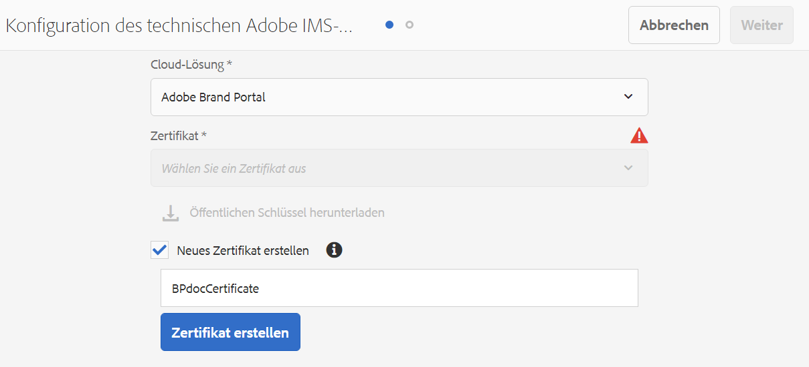

1. Klicken Sie auf das Symbol **[!UICONTROL Öffentlichen Schlüssel herunterladen]** und speichern Sie die Public-Key-Datei (.crt) auf Ihrem Computer.

   Der öffentliche Schlüssel wird später zum Konfigurieren der API für Ihren Brand Portal-Mandanten und zum Generieren von Anmeldedaten für Service-Konten in der Adobe Developer Console verwendet.

   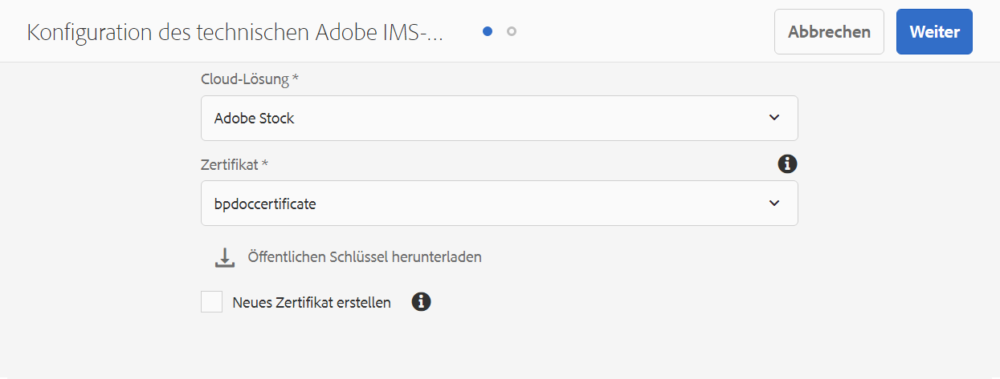

1. Klicken Sie auf **[!UICONTROL Weiter]**.

   Auf der Registerkarte **Konto** wird das Adobe IMS-Konto erstellt. Dafür werden die Anmeldedaten für Service-Konten benötigt, die in der Adobe Developer Console generiert werden. Lassen Sie diese Seite vorerst offen.

   Öffnen Sie eine neue Registerkarte und [erstellen Sie in der Adobe Developer Console eine JWT-Verbindung (Service-Konto)](#createnewintegration), um die Anmeldedaten und die JWT-Payload für die Konfiguration des IMS-Kontos abzurufen.

### Erstellen einer JWT-Verbindung (Service-Konto) {#createnewintegration}

In der Adobe Developer Console werden Projekte und APIs auf Brand Portal-Mandantenebene (Organisationsebene) konfiguriert. Beim Konfigurieren einer API wird eine Service-Konto-Verbindung (JWT-Verbindung) hergestellt. Es gibt zwei Methoden zum Konfigurieren der API: Generieren eines Schlüsselpaars (privater und öffentlicher Schlüssel) oder Hochladen eines öffentlichen Schlüssels. Um AEM Assets mit Brand Portal zu konfigurieren, müssen Sie einen öffentlichen Schlüssel (Zertifikat) in AEM Assets generieren und Anmeldedaten in der Adobe Developer Console erstellen, indem Sie den öffentlichen Schlüssel hochladen. Diese Anmeldedaten werden zum Konfigurieren des IMS-Kontos in AEM Assets benötigt. Sobald das IMS-Konto konfiguriert ist, können Sie den Brand Portal-Cloud Service in AEM Assets konfigurieren.

Führen Sie die folgenden Schritte aus, um die Anmeldedaten für das Service-Konto und die JWT-Payload zu generieren:

1. Melden Sie sich bei der Adobe Developer Console mit Systemadministratorrechten für die IMS-Organisation (den Brand Portal-Mandanten) an. Die Standardeinstellung ist  [https://www.adobe.com/go/devs_console_ui_de](https://www.adobe.com/go/devs_console_ui_de).

   >[!NOTE]
   >
   >Vergewissern Sie sich, dass Sie die richtige IMS-Organisation (Brand Portal-Mandant) aus der Dropdown-Liste (Organisation) oben rechts ausgewählt haben.

1. Klicken Sie auf **[!UICONTROL Neues Projekt erstellen]**. Für Ihre Organisation wird ein leeres Projekt mit einem systemgenerierten Namen erstellt.

   Klicken Sie auf **[!UICONTROL Projekt bearbeiten]**, um den **[!UICONTROL Projekttitel]** und die **[!UICONTROL Projektbeschreibung]** zu aktualisieren, und klicken Sie auf **[!UICONTROL Speichern]**.

1. Klicken Sie auf der Registerkarte mit der **[!UICONTROL Projektübersicht]** auf **[!UICONTROL API hinzufügen]**.

1. Wählen Sie im Fenster **[!UICONTROL API hinzufügen]** die Option **[!UICONTROL AEM Brand Portal]** aus und klicken Sie auf **[!UICONTROL Weiter]**.

   Stellen Sie sicher, dass Sie Zugriff auf den AEM Brand Portal-Service haben.

1. Klicken Sie im Fenster **[!UICONTROL API konfigurieren]** auf **[!UICONTROL Öffentlichen Schlüssel hochladen]**. Klicken Sie dann auf **[!UICONTROL Datei auswählen]** und laden Sie den öffentlichen Schlüssel (.crt-Datei) hoch, den Sie im Abschnitt zum [Abrufen des öffentlichen Zertifikats](#public-certificate) heruntergeladen haben.

   Klicken Sie auf **[!UICONTROL Weiter]**.

   

1. Überprüfen Sie den öffentlichen Schlüssel und klicken Sie auf **[!UICONTROL Weiter]**.

1. Wählen Sie **[!UICONTROL Assets Brand Portal]** als Standardproduktprofil aus und klicken Sie auf **[!UICONTROL Konfigurierte API speichern]**.

   <!-- 
   In Brand Portal, a default profile is created for each organization. The Product Profiles are created in admin console for assigning users to groups (based on the roles and permissions). For configuration with Brand Portal, the OAuth token is created at organization level. Therefore, you must configure the default Product Profile for your organization. 
   -->

   

1. Sobald die API konfiguriert ist, werden Sie zur Seite mit der API-Übersicht weitergeleitet. Klicken Sie in der linken Navigation unter **[!UICONTROL Anmeldedaten]** auf die Option **[!UICONTROL Service-Konto (JWT)]**.

   >[!NOTE]
   >
   >Sie können die Anmeldedaten einsehen und weitere Aktionen durchführen, beispielsweise JWT-Token generieren, Anmeldedaten kopieren und Client-Geheimnisse abrufen.

1. Kopieren Sie auf der Registerkarte **[!UICONTROL Client-Anmeldedaten]** die **[!UICONTROL Client-ID]**.

   Klicken Sie auf **[!UICONTROL Client-Geheimnis abrufen]** und kopieren Sie das **[!UICONTROL Client-Geheimnis]**.

   

1. Navigieren Sie zur Registerkarte **[!UICONTROL JWT generieren]** und kopieren Sie die Informationen zur **[!UICONTROL JWT-Payload]**.

Sie können jetzt die Client-ID (API-Schlüssel), das Client-Geheimnis und die JWT-Payload verwenden, um das [IMS-Konto in AEM Assets zu konfigurieren](#create-ims-account-configuration).

<!--
### Create Adobe I/O integration {#createnewintegration}

Adobe I/O integration generates API Key, Client Secret, and Payload (JWT) which is required in setting up the IMS Account configurations.

1. Login to Adobe I/O Console with system administrator privileges on the IMS organization of the Brand Portal tenant.

   Default URL: [https://console.adobe.io/](https://console.adobe.io/) 

1. Click **[!UICONTROL Create Integration]**.

1. Select **[!UICONTROL Access an API]**, and click **[!UICONTROL Continue]**.

   

1. Create a new integration page opens. 
   
   Select your organization from the drop-down list.

   In **[!UICONTROL Experience Cloud]**, Select **[!UICONTROL AEM Brand Portal]** and click **[!UICONTROL Continue]**. 

   If the Brand Portal option is disabled for you, ensure that you have selected correct organization from the drop-down box above the **[!UICONTROL Adobe Services]** option. If you do not know your organization, contact your administrator.

   

1. Specify a name and description for the integration. Click **[!UICONTROL Select a File from your computer]** and upload the `AEM-Adobe-IMS.crt` file downloaded in the [obtain public certificates](#public-certificate) section.

1. Select the profile of your organization. 

   Or, select the default profile **[!UICONTROL Assets Brand Portal]** and click **[!UICONTROL Create Integration]**. The integration is created.

1. Click **[!UICONTROL Continue to integration details]** to view the integration information. 

   Copy the **[!UICONTROL API Key]** 
   
   Click **[!UICONTROL Retrieve Client Secret]** and copy the Client Secret key.

   

1. Navigate to **[!UICONTROL JWT]** tab, and copy the **[!UICONTROL JWT payload]**.

   The API Key, Client Secret key, and JWT payload information will be used to create IMS account configuration.
-->

### Konfigurieren des IMS-Kontos {#create-ims-account-configuration}

Stellen Sie sicher, dass Sie die folgenden Schritte ausgeführt haben:

* [Abrufen eines öffentlichen Zertifikats](#public-certificate)
* [Erstellen einer JWT-Verbindung (Service-Konto)](#createnewintegration)

Gehen Sie wie folgt vor, um das IMS-Konto zu konfigurieren.

1. Öffnen Sie die IMS-Konfiguration und navigieren Sie zur Registerkarte **[!UICONTROL Konto]**. Sie haben die Seite offen gelassen, während Sie das [öffentliche Zertifikat abgerufen](#public-certificate) haben.

1. Geben Sie einen **[!UICONTROL Titel]** für das IMS-Konto an.

   Geben Sie im Feld **[!UICONTROL Autorisierungs-Server]** die URL ein: [https://ims-na1.adobelogin.com/](https://ims-na1.adobelogin.com/)..

   Fügen Sie die Client-ID im Feld **[!UICONTROL API-Schlüssel]** sowie das **[!UICONTROL Client-Geheimnis]** und die **[!UICONTROL Payload]** (JWT-Payload) ein, die Sie beim [Erstellen der JWT-Verbindung (Service-Konto)](#createnewintegration) kopiert haben.

   Klicken Sie auf **[!UICONTROL Erstellen]**.

   Das IMS-Konto ist konfiguriert.

   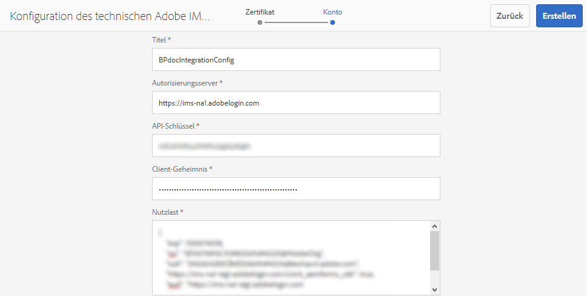

1. Wählen Sie die IMS-Kontokonfiguration aus und klicken Sie auf **[!UICONTROL Systemdiagnose]**.

   Klicken Sie im Dialogfeld auf **[!UICONTROL Prüfen]**. Bei erfolgreicher Konfiguration wird eine Meldung angezeigt, dass das *Token erfolgreich abgerufen* wurde.

   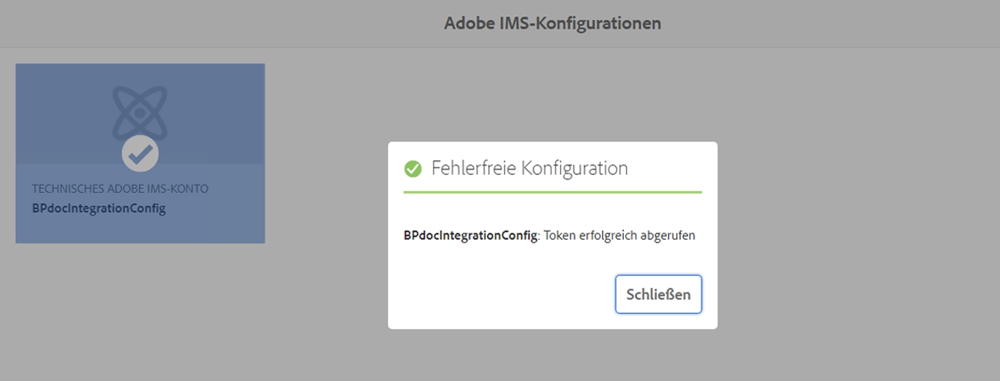

>[!CAUTION]
>
>Sie dürfen nur eine IMS-Konfiguration haben.
>
>Vergewissern Sie sich, dass die IMS-Konfiguration die Konsistenzprüfung besteht. Wenn die Konfiguration die Konsistenzprüfung nicht besteht, ist sie ungültig. Sie müssen sie löschen und eine neue gültige Konfiguration erstellen.

### Konfigurieren von Cloud Service {#configure-the-cloud-service}

Führen Sie die folgenden Schritte aus, um den Brand Portal-Cloud Service zu konfigurieren:

1. Melden Sie sich bei der AEM Assets-Autorenistanz an.

1. Navigieren Sie im **Tool** -Bedienfeld zu **[!UICONTROL Cloud Services]** > **[!UICONTROL AEM Brand Portal]**.

1. Klicken Sie auf der Seite mit den Brand Portal-Konfigurationen auf **[!UICONTROL Erstellen]**.

1. Geben Sie einen **[!UICONTROL Titel]** für die Konfiguration ein.

   Wählen Sie die IMS-Konfiguration aus, die Sie beim [Konfigurieren des IMS-Kontos](#create-ims-account-configuration) erstellt haben.

   Geben Sie im Feld **[!UICONTROL Dienst-URL]** Ihre Brand Portal-Mandanten-URL (Organisations-URL) ein.

   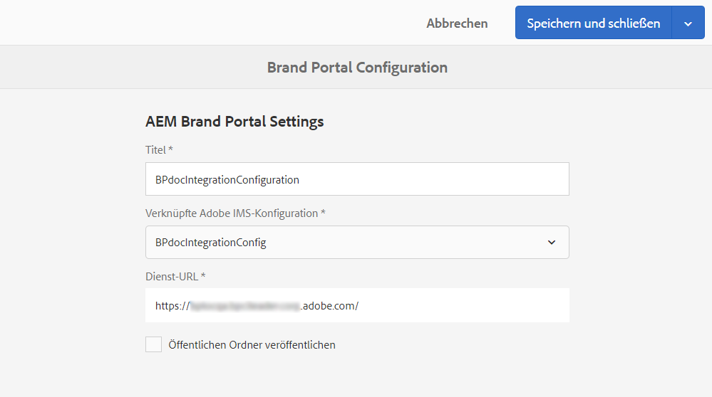

1. Klicken Sie auf **[!UICONTROL Speichern und schließen]**. Die Cloud-Konfiguration wird erstellt.

   Ihre AEM Assets-Autoreninstanz ist jetzt mit dem Markenportal-Mandanten konfiguriert.

### Testen der Konfiguration {#test-integration}

Führen Sie zur Validierung der Konfiguration folgende Schritte aus:

1. Melden Sie sich bei Ihrer AEM Assets-Cloud-Instanz an.

1. Navigieren Sie im Bereich **Tools**  zu **[!UICONTROL Bereitstellung]** > **[!UICONTROL Replikation]**.

   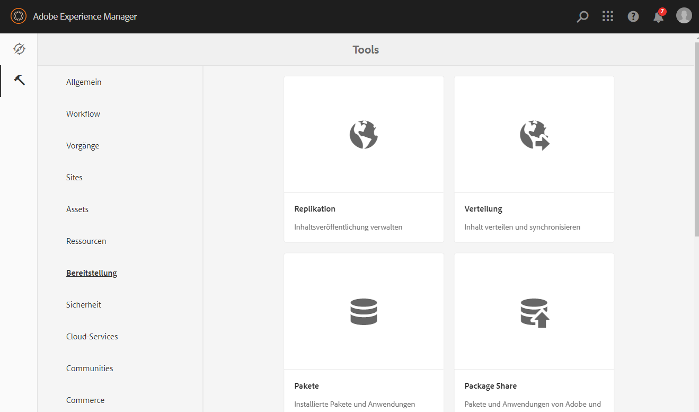

1. Klicken Sie auf der Seite „Replikation“ auf **[!UICONTROL Agenten für Autor]**.

   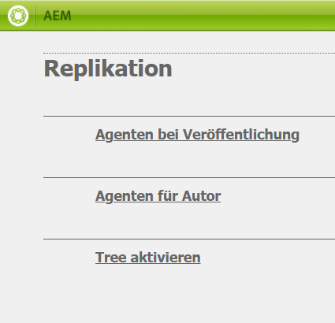

   Sie können die vier Replizierungsagenten sehen, die für Ihren Markenportal-Mandanten erstellt wurden.

   Suchen Sie die Replizierungsagenten Ihres Markenportal-Mandanten und klicken Sie auf die Replizierungsagenten-URL.

   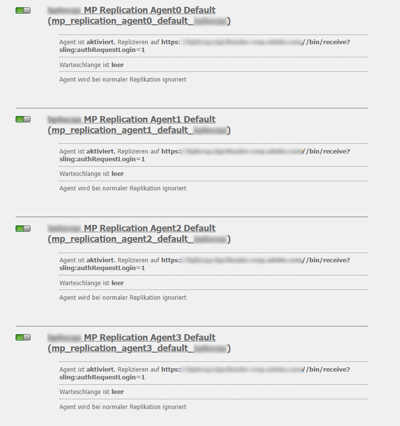

   >[!NOTE]
   >
   >Die Replizierungsagenten arbeiten parallel und teilen die Auftragsverteilung gleichmäßig, wodurch die Veröffentlichungsgeschwindigkeit um das Vierfache der Originalgeschwindigkeit steigt. Wenn der Cloud-Service konfiguriert wurde, sind keine zusätzlichen Konfigurationsschritte erforderlich, um die Replikationsagenten zu aktivieren. Sie werden standardmäßig aktiviert, um die parallele Veröffentlichung mehrerer Assets zu ermöglichen.

1. Um die Verbindung zwischen AEM Assets  und Brand Portal zu überprüfen, klicken Sie auf das Symbol **[!UICONTROL Verbindung testen]**.

   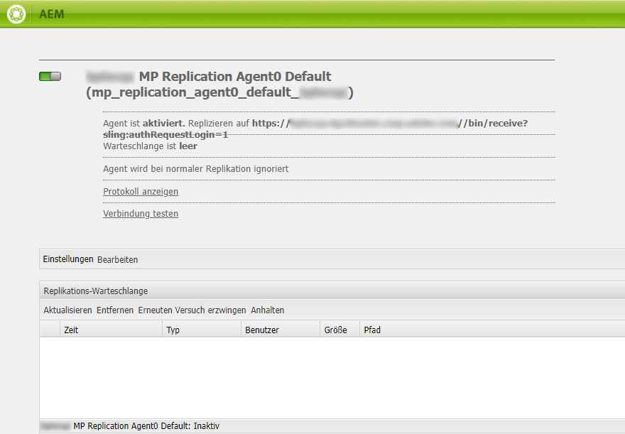

   Ihnen wird eine Meldung angezeigt, dass Ihr *Testpaket erfolgreich bereitgestellt wurde*.

   

1. Überprüfen Sie die Testergebnisse für alle vier Replizierungsagenten.

   >[!NOTE]
   >
   >Deaktivieren Sie keine Replizierungsagenten, da dies dazu führen kann, dass die Replizierung der Assets (die in der Warteschlange ausgeführt werden) fehlschlägt.
   >
   >Stellen Sie sicher, dass alle vier Replizierungsagenten so konfiguriert sind, dass kein Timeout-Fehler auftritt. Siehe [Fehlerbehebung bei Problemen beim parallelen Veröffentlichen im Markenportal](https://docs.adobe.com/content/help/en/experience-manager-brand-portal/using/publish/troubleshoot-parallel-publishing.html#connection-timeout).

Sie haben nun die folgenden Möglichkeiten:

* [Veröffentlichen von Assets aus AEM Assets in Brand Portal](../assets/brand-portal-publish-assets.md)
* [Veröffentlichen von Assets vom Markenportal nach AEM Assets](https://docs.adobe.com/content/help/de-DE/experience-manager-brand-portal/using/asset-sourcing-in-brand-portal/brand-portal-asset-sourcing.html)  - Asset-Beschaffung im Markenportal
* [Veröffentlichen von Ordnern aus AEM Assets in Brand Portal](../assets/brand-portal-publish-folder.md)
* [Veröffentlichen von Sammlungen aus AEM Assets in Brand Portal](../assets/brand-portal-publish-collection.md)
* [Veröffentlichen von Vorgaben, Schemata und Facetten in Brand Portal](https://docs.adobe.com/content/help/en/experience-manager-brand-portal/using/publish/publish-schema-search-facets-presets.html)
* [Veröffentlichen von Tags in Brand Portal](https://docs.adobe.com/content/help/en/experience-manager-brand-portal/using/publish/brand-portal-publish-tags.html)

Weitere Informationen finden Sie in der [Dokumentation zu Brand Portal](https://docs.adobe.com/content/help/de-DE/experience-manager-brand-portal/using/home.html).

## Upgrade der Konfiguration {#upgrade-integration-65}

Führen Sie die folgenden Schritte in der aufgeführten Reihenfolge aus, um Ihre vorhandenen Konfigurationen auf Adobe Developer Console zu aktualisieren:
1. [Ausführen von Aufträgen überprüfen](#verify-jobs)
1. [Vorhandene Konfigurationen löschen](#delete-existing-configuration)
1. [Konfiguration erstellen](#configure-new-integration-65)

### Überprüfen laufender Aufträge {#verify-jobs}

Stellen Sie sicher, dass auf Ihrer AEM Assets-Autoreninstanz kein Veröffentlichungsauftrag ausgeführt wird, bevor Sie Änderungen vornehmen. Dazu können Sie den Status aktiver Aufträge auf allen vier Replizierungsagenten überprüfen und sicherstellen, dass die Warteschlangen untätig sind.

1. Melden Sie sich bei der AEM Assets-Autorenistanz an.

1. Navigieren Sie im Bereich **Tools**  zu **[!UICONTROL Bereitstellung]** > **[!UICONTROL Replikation der Bereitstellung]**.

1. Klicken Sie auf der Seite „Replikation“ auf **[!UICONTROL Agenten für Autor]**.

   

1. Suchen Sie die Replizierungsagenten Ihres Markenportal-Mandanten.

   Stellen Sie sicher, dass die **Warteschlange für alle Replizierungsagenten Idle** lautet. Es ist kein Veröffentlichungsauftrag aktiv.

   

### Vorhandene Konfigurationen {#delete-existing-configuration} löschen

Sie müssen beim Löschen der vorhandenen Konfigurationen die folgende Checkliste ausführen:
* Alle vier Replizierungsagenten löschen
* Markenportal-Cloud-Dienst löschen
* MAC-Benutzer löschen

1. Melden Sie sich bei Ihrer AEM Assets-Autoreninstanz an und öffnen Sie CRX Lite als Administrator. Die Standardeinstellung ist `http://localhost:4502/crx/de/index.jsp`.

1. Navigieren Sie zu `/etc/replications/agents.author` und löschen Sie alle vier Replizierungsagenten Ihres Markenportal-Mandanten.

   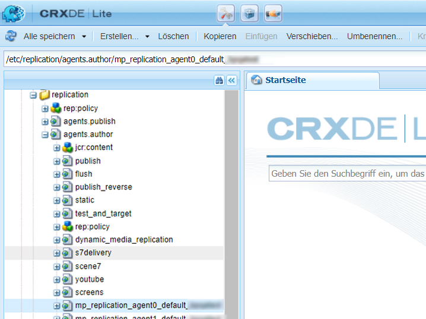

1. Navigieren Sie zu `/etc/cloudservices/mediaportal` und löschen Sie die Konfiguration des Markenportal-Cloud-Dienstes.

   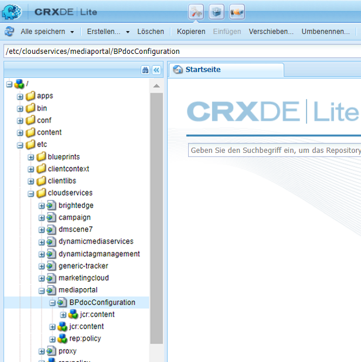

1. Navigieren Sie zu `/home/users/mac` und löschen Sie den **MAC-Benutzer** Ihres Markenportal-Mieters.

   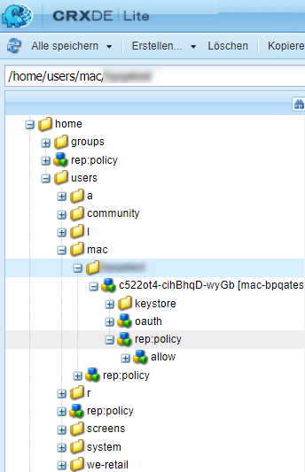

Sie können die Konfigurationsdatei [jetzt über die Adobe Developer Console in Ihrer AEM 6.5 Autoreninstanz erstellen.](#configure-new-integration-65)

<!--
   Comment Type: draft

   <li> </li>
   -->

<!--
   Comment Type: draft

   <li>Step text</li>
   -->

