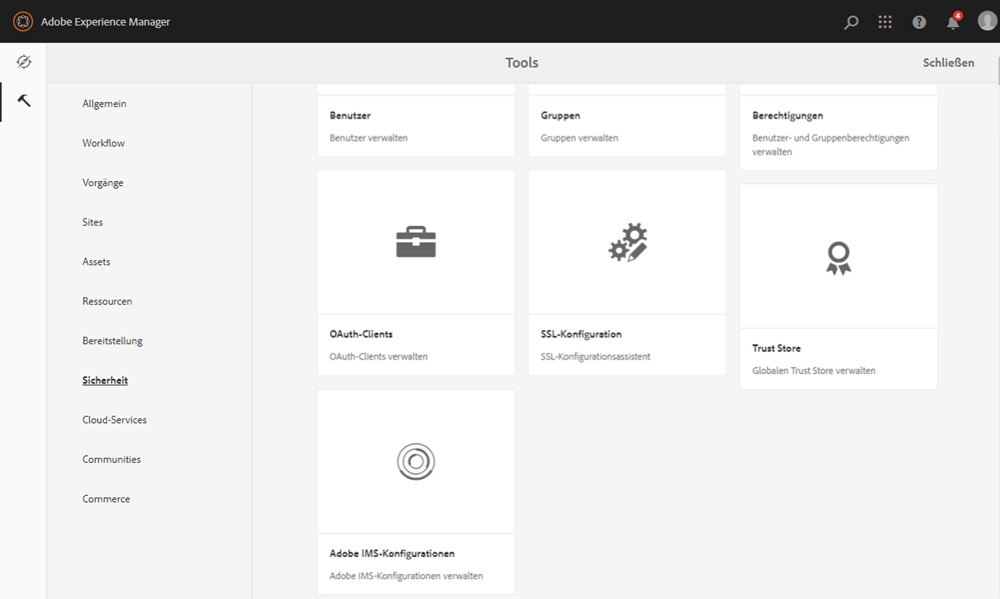

# Konfigurieren der von AEM Assets mit Brand Portal {#configure-integration-65}

Adobe Experience Manager (AEM)-Assets werden über die Adobe-ID/O mit dem Markenportal konfiguriert. Dadurch wird ein IMS-Token zur Autorisierung Ihres Markenportal-Mandanten beschafft.

>[!NOTE]
>
>Die Konfiguration von AEM Assets mit dem Markenportal über Adobe I/O wird auf AEM 6.5.4.0 und höher unterstützt.
>
>Zuvor wurde Brand Portal über das Legacy-OAuth-Gateway in der klassischen Benutzeroberfläche konfiguriert. Das Gateway ruft mithilfe des JWT-Token-Austauschs ein IMS-Zugriffstoken zur Autorisierung ab.
>
>Die Konfiguration über Legacy-OAuth wird ab dem 6. April 2020 nicht mehr unterstützt. Die Konfiguration erfolgt nun über Adobe I/O.
>
>Wenn Sie ein bestehender Brand Portal-Benutzer mit einer Konfiguration auf dem alten OAuth Gateway sind, sollten Sie die vorhandenen Konfigurationen löschen und eine neue Konfiguration auf der Adobe-E/A-Datei erstellen.
>
>Die vorhandene Konfiguration funktioniert jedoch weiterhin, wenn Sie die Konfigurationen nicht ändern.

In dieser Hilfe werden die folgenden zwei Anwendungsfälle beschrieben:
* [Neue Konfiguration](#configure-new-integration-65): Wenn Sie ein neuer Brand Portal-Benutzer sind und Ihre AEM Assets-Autoreninstanz mit dem Markenportal konfigurieren möchten, können Sie eine neue Konfiguration auf der Adobe-E/A erstellen.
* [Upgrade-Konfiguration](#upgrade-integration-65): Wenn Sie ein bestehender Brand Portal-Benutzer mit Ihrer AEM Assets-Autoreninstanz sind, die mit Brand Portal auf dem alten OAuth Gateway konfiguriert wurde, sollten Sie die vorhandenen Konfigurationen löschen und eine neue Konfiguration auf der Adobe-E/A-Benutzeroberfläche erstellen.

Benutzer dieser Hilfe sollten mit den folgenden Technologien vertraut sein:

* Installieren, Konfigurieren und Verwalten von Adobe Experience Manager- und AEM-Paketen

* Linux- und Microsoft Windows-Betriebssysteme

## Voraussetzungen {#prerequisites}

Sie benötigen Folgendes, um AEM Assets mit Markenportal zu konfigurieren:

* Eine Autoreninstanz für AEM Assets mit dem neuesten Service Pack.
* Markenportal-Mandanten-URL.
* Ein Benutzer mit Systemadministrator-Berechtigungen für die IMS-Organisation des Markenportal-Mandanten.

[Herunterladen und Installieren von AEM 6.5](#aemquickstart)

[Laden Sie das neueste AEM Service Pack herunter und installieren Sie es](#servicepack)

### Herunterladen und Installieren von AEM 6.5 {#aemquickstart}

Es wird empfohlen, AEM 6.5 zum Einrichten einer AEM-Autoreninstanz zu verwenden. Wenn Sie AEM nicht ausgeführt haben, laden Sie es von den folgenden Speicherorten herunter:

* Wenn Sie bereits AEM-Kunde sind, laden Sie AEM 6.5 von der [Adobe Licensing-Website](http://licensing.adobe.com)herunter.

* Wenn Sie Adobe-Partner sind, verwenden Sie das [Adobe Partner Training Program](https://adobe.allegiancetech.com/cgi-bin/qwebcorporate.dll?idx=82357Q) , um AEM 6.5 anzufordern.

Nach dem Herunterladen von AEM finden Sie Anweisungen zum Einrichten einer AEM-Autoreninstanz unter [Bereitstellen und Warten](https://helpx.adobe.com/experience-manager/6-5/sites/deploying/using/deploy.html#defaultlocalinstall).

### Download and install AEM latest Service Pack {#servicepack}

Ausführliche Anweisungen finden Sie unter

* [Versionshinweise zum AEM 6.5 Service Pack](https://helpx.adobe.com/experience-manager/6-5/release-notes/sp-release-notes.html)

**Wenden Sie sich an den Support** , wenn Sie das neueste AEM-Paket oder Service Pack nicht finden können.

## Create configuration {#configure-new-integration-65}

Führen Sie die folgenden Schritte in der aufgeführten Reihenfolge durch, wenn Sie AEM Assets mit Markenportal zum ersten Mal konfigurieren:
1. [Erhalten eines öffentlichen Zertifikats](#public-certificate)
1. [Adobe I/O-Integration erstellen](#createnewintegration)
1. [Konfiguration des IMS-Kontos erstellen](#create-ims-account-configuration)
1. [Cloud-Dienst konfigurieren](#configure-the-cloud-service)
1. [Testkonfiguration](#test-integration)

### IMS-Konfiguration erstellen {#create-ims-configuration}

Die IMS-Konfiguration authentifiziert Ihren Markenportal-Mandanten mit der Autoreninstanz von AEM Assets.

Die IMS-Konfiguration umfasst zwei Schritte:

* [Erhalten eines öffentlichen Zertifikats](#public-certificate)
* [Konfiguration des IMS-Kontos erstellen](#create-ims-account-configuration)

### Erhalten eines öffentlichen Zertifikats {#public-certificate}

Mit dem öffentlichen Zertifikat können Sie Ihr Profil auf Adobe I/O authentifizieren.

1. Anmelden bei der Autoreninstanz AEM AssetsStandard-URL: http:// localhost:4502/aem/start.html
1. Navigieren Sie im **Tool**  -Bedienfeld zu **[!UICONTROL Sicherheit]** > **[!UICONTROL Adobe IMS-Konfigurationen]**.

   

1. Die Seite &quot;Adobe IMS-Konfigurationen&quot;wird geöffnet.

   Klicken Sie auf **[!UICONTROL Erstellen]**.

   Auf diese Weise gelangen Sie zur Seite &quot;Konfiguration **[!UICONTROL des technischen]** Adobe IMS-Kontos&quot;.

1. Standardmäßig wird die Registerkarte &quot; **Zertifikat** &quot;geöffnet.

   Wählen Sie in der **Cloud-Lösung** die Option **[!UICONTROL Adobe Brand Portal]**.

1. Markieren Sie das Kontrollkästchen Neues Zertifikat **** erstellen und geben Sie einen **Alias** für das Zertifikat an. Der Alias dient als Name des Dialogfelds.

1. Klicken Sie auf **[!UICONTROL Zertifikat erstellen]**. Ein Dialogfeld wird angezeigt. Klicken Sie auf **[!UICONTROL OK]** , um das öffentliche Zertifikat zu generieren.

   

1. Klicken Sie auf Öffentlichen Schlüssel **[!UICONTROL herunterladen]** und speichern Sie die *AEM-Adobe-IMS.crt* -Zertifikatdatei auf Ihrem Computer. Die Zertifikatdatei wird zum [Erstellen der Adobe-E/A-Integration](#createnewintegration)verwendet.

   

1. Klicken Sie auf **[!UICONTROL Weiter]**.

   Auf der Registerkarte &quot; **Konto** &quot;erstellen Sie das Adobe IMS-Konto, dafür benötigen Sie jedoch die Integrationsdetails. Lassen Sie diese Seite jetzt offen.

   Öffnen Sie eine neue Registerkarte und [erstellen Sie die Adobe I/O-Integration](#createnewintegration) , um die Integrationsdetails für IMS-Kontokonfigurationen abzurufen.

### Adobe I/O-Integration erstellen {#createnewintegration}

Die Adobe-I/O-Integration generiert API-Schlüssel, geheimen Clientschlüssel und Payload (JWT), was für die Einrichtung der IMS-Kontokonfigurationen erforderlich ist.

1. Melden Sie sich bei der Adobe I/O Console mit Systemadministrator-Berechtigungen bei der IMS-Organisation des Markenportal-Mieters an.

   Standard-URL: [https://console.adobe.io/](https://console.adobe.io/)

1. Click **[!UICONTROL Create Integration]**.

1. Wählen Sie **[!UICONTROL Zugriff auf eine API]** und klicken Sie auf **[!UICONTROL Weiter]**.

   

1. Eine neue Integrationsseite wird geöffnet.

   Wählen Sie Ihre Organisation aus der Dropdownliste aus.

   Wählen Sie in **[!UICONTROL Experience Cloud]** das **[!UICONTROL AEM-Markenportal]** und klicken Sie auf **[!UICONTROL Weiter]**.

   Wenn die Option &quot;Markenportal&quot;für Sie deaktiviert ist, vergewissern Sie sich, dass Sie im Dropdownfeld über der Option &quot; **[!UICONTROL Adobe-Dienste]** &quot;die richtige Organisation ausgewählt haben. Wenn Sie Ihr Unternehmen nicht kennen, wenden Sie sich an Ihren Administrator.

   

1. Geben Sie einen Namen und eine Beschreibung für die Integration ein. Klicken Sie auf Datei von Ihrem Computer **** auswählen und laden Sie die `AEM-Adobe-IMS.crt` Datei hoch, die Sie im Abschnitt [Öffentliche Zertifikate](#public-certificate) abrufen heruntergeladen haben.

1. Wählen Sie das Profil Ihrer Organisation aus.

   Oder wählen Sie das Standardprofil **[!UICONTROL Assets Brand Portal]** und klicken Sie auf Integration **[!UICONTROL erstellen]**. Die Integration wird erstellt.

1. Klicken Sie auf **[!UICONTROL Weiter zu den Integrationsdetails]** , um die Integrationsinformationen anzuzeigen.

   Kopieren des **[!UICONTROL API-Schlüssels]**

   Klicken Sie auf **[!UICONTROL Clientgeheimnis abrufen]** und kopieren Sie den geheimen Schlüssel des Kunden.

   

1. Navigieren Sie zur Registerkarte **[!UICONTROL JWT]** und kopieren Sie die **[!UICONTROL JWT-Nutzlast]**.

   Die API-Schlüssel-, geheimer Clientschlüssel- und JWT-Nutzlastinformationen werden verwendet, um eine IMS-Kontokonfiguration zu erstellen.

### Konfiguration des IMS-Kontos erstellen {#create-ims-account-configuration}

Stellen Sie sicher, dass Sie die folgenden Schritte ausgeführt haben:

* [Erhalten eines öffentlichen Zertifikats](#public-certificate)
* [Adobe I/O-Integration erstellen](#createnewintegration)

**Schritte zum Erstellen der Konfiguration des IMS-Kontos:**

1. Öffnen Sie die Seite &quot;IMS-Konfiguration&quot;, Registerkarte &quot; **[!UICONTROL Konten]** &quot;. Sie haben die Seite am Ende des Abschnitts geöffnet, [öffentliches Zertifikat](#public-certificate)abrufen.

1. Geben Sie einen **[!UICONTROL Titel]** für das IMS-Konto an.

   Geben Sie in **[!UICONTROL Authorization Server]** die URL ein: [https://ims-na1.adobelogin.com/](https://ims-na1.adobelogin.com/)

   Fügen Sie den API-Schlüssel, den geheimen Clientschlüssel und die JWT-Nutzlast ein, die Sie am Ende der [Create Adobe I/O-Integration](#createnewintegration)kopiert haben.

   Klicken Sie auf **[!UICONTROL Erstellen]**.

   Die Integration wird erstellt.

   

   >[!CAUTION]
   >
   >Erstellen Sie nur eine IMS-Konfiguration. Erstellen Sie nicht mehrere IMS-Konfigurationen.

1. Wählen Sie die IMS-Konfiguration aus und klicken Sie auf **[!UICONTROL Gesundheit]**&#x200B;überprüfen. Das folgende Dialogfeld wird angezeigt.

   Klicken Sie auf **[!UICONTROL Überprüfen]**. Bei erfolgreicher Verbindung wird die Meldung *Token erfolgreich* abgerufen angezeigt.

   

      

### Configure cloud service {#configure-the-cloud-service}

Führen Sie die folgenden Schritte aus, um die Konfiguration des Brand Portal-Cloud-Dienstes zu erstellen:

1. Bei Ihrer AEM Assets-Autoreninstanz anmelden

   Standard-URL: http:// localhost:4502/aem/start.html
1. Navigieren Sie im Bereich **Tools**  zu **[!UICONTROL Cloud Services > AEM Brand Portal]**.

   Die Seite &quot;Konfiguration des Markenportals&quot;wird geöffnet.

1. Klicken Sie auf **[!UICONTROL Erstellen]**.

1. Specify a **[!UICONTROL Title]** for the configuration.

   Wählen Sie die im Schritt erstellte IMS-Konfiguration aus und [erstellen Sie die IMS-Kontokonfiguration](#create-ims-account-configuration).

   Geben Sie in der **[!UICONTROL Dienst-URL]** die URL Ihres Markenportals-Mandanten ein.

   

1. Click **[!UICONTROL Save and Close]**. Die Cloud-Konfiguration wird erstellt. Ihre Autoreninstanz für AEM Assets ist jetzt mit dem Markenportal-Mandanten integriert.

### Test configuration {#test-integration}

1. Bei Ihrer AEM Assets-Autoreninstanz anmelden

   Standard-URL: http:// localhost:4502/aem/start.html

1. Navigieren Sie im Bereich **Tools**  zu **[!UICONTROL Bereitstellung > Replikation]**.

   

1. Die Replikationsseite wird geöffnet.

   Klicken Sie auf **[!UICONTROL Agenten beim Autor]**.

   

1. Für jeden Mandanten werden vier Replizierungsagenten erstellt.

   Suchen Sie die Replizierungsagenten Ihres Markenportal-Mandanten.

   Klicken Sie auf die Replizierungsagenten-URL.

   

   >[!NOTE]
   >
   >Die Replizierungsagenten arbeiten parallel und teilen die Auftragsverteilung gleichmäßig, wodurch die Veröffentlichungsgeschwindigkeit um das Vierfache der Originalgeschwindigkeit steigt. Wenn der Cloud-Service konfiguriert wurde, sind keine zusätzlichen Konfigurationsschritte erforderlich, um die Replikationsagenten zu aktivieren. Sie werden standardmäßig aktiviert, um die parallele Veröffentlichung mehrerer Assets zu ermöglichen.

   >[!NOTE]
   >
   >Vermeiden Sie es, einen der Replikationsagenten zu deaktivieren, da dies dazu führen kann, dass die Replikation einiger Assets fehlschlägt.

1. Um die Verbindung zwischen dem AEM Assets-Autor und dem Markenportal zu überprüfen, klicken Sie auf **[!UICONTROL Verbindung]** testen.

   

1. Sehen Sie sich den unteren Bereich der Testergebnisse an, um zu prüfen, ob die Replikation erfolgreich war.

   

   >[!NOTE]
   >
   >Die Replizierungsagenten arbeiten parallel und teilen die Auftragsverteilung gleichmäßig, wodurch die Veröffentlichungsgeschwindigkeit um das Vierfache der Originalgeschwindigkeit steigt. Wenn der Cloud-Service konfiguriert wurde, sind keine zusätzlichen Konfigurationsschritte erforderlich, um die Replikationsagenten zu aktivieren. Sie werden standardmäßig aktiviert, um die parallele Veröffentlichung mehrerer Assets zu ermöglichen.

1. Überprüfen Sie die Testergebnisse für alle vier Replizierungsagenten einzeln.

   >[!NOTE]
   >
   >Vermeiden Sie es, einen der Replikationsagenten zu deaktivieren, da dies dazu führen kann, dass die Replikation einiger Assets fehlschlägt.

Markenportal wurde erfolgreich mit Ihrer AEM Assets-Autoreninstanz konfiguriert. Sie können jetzt:

* [Veröffentlichen von Assets aus AEM Assets im Markenportal](../assets/brand-portal-publish-assets.md)
* [Veröffentlichen von Ordnern aus AEM Assets in Brand Portal](../assets/brand-portal-publish-folder.md)
* [Veröffentlichen von Sammlungen aus AEM Assets in Brand Portal](../assets/brand-portal-publish-collection.md)
* [Konfigurieren Sie die Asset-Beschaffung](https://docs.adobe.com/content/help/en/experience-manager-brand-portal/using/asset-sourcing-in-brand-portal/brand-portal-asset-sourcing.html) , damit die Benutzer des Markenportals Elemente in AEM Assets hinzufügen und veröffentlichen können.

## Konfiguration aktualisieren {#upgrade-integration-65}

Führen Sie die folgenden Schritte in der aufgeführten Reihenfolge aus, um vorhandene Konfigurationen zu aktualisieren:
1. [Ausführen von Aufträgen überprüfen](#verify-jobs)
1. [Vorhandene Konfigurationen löschen](#delete-existing-configuration)
1. [Konfiguration erstellen](#configure-new-integration-65)

### Ausführen von Aufträgen überprüfen {#verify-jobs}

Vergewissern Sie sich, dass in Ihrer AEM Assets-Autoreninstanz kein Veröffentlichungsauftrag ausgeführt wird, bevor Sie Änderungen vornehmen. Dazu können Sie alle vier Replizierungsagenten überprüfen und sicherstellen, dass die Warteschlange ideal/leer ist.

1. Bei Ihrer AEM Assets-Autoreninstanz anmelden

   Standard-URL: http:// localhost:4502/aem/start.html

1. Navigieren Sie im Bereich **Tools**  zu **[!UICONTROL Bereitstellung > Replikation]**.

1. Die Replikationsseite wird geöffnet.

   Klicken Sie auf **[!UICONTROL Agenten beim Autor]**.

   

1. Suchen Sie die Replizierungsagenten Ihres Markenportal-Mandanten.

   Stellen Sie sicher, dass die **Warteschlange für alle Replizierungsagenten &quot;Idle** &quot;lautet. Es ist kein Veröffentlichungsauftrag aktiv.

   

### Vorhandene Konfigurationen löschen {#delete-existing-configuration}

Sie müssen beim Löschen der vorhandenen Konfigurationen die folgende Checkliste ausführen.
* Alle vier Replizierungsagenten löschen
* Cloud-Dienst löschen
* MAC-Benutzer löschen

1. Melden Sie sich bei Ihrer Autoreninstanz für AEM Assets an und öffnen Sie CRX Lite als Administrator.

   Standard-URL: http:// localhost:4502/crx/de/index.jsp

1. Navigieren Sie zu allen vier Replizierungsagenten Ihres Markenportal-Mandanten `/etc/replications/agents.author` und löschen Sie sie.

   

1. Navigieren Sie zur `/etc/cloudservices/mediaportal` Cloud-Dienstkonfiguration **und löschen Sie sie**.

   

1. Navigieren Sie zum `/home/users/mac` MAC-Benutzer **Ihres Markenportals-Mandanten** und löschen Sie ihn.

   

Sie können jetzt eine Konfiguration [für Ihre AEM 6.5-Autoreninstanz auf der Adobe-I/O](#configure-new-integration-65) erstellen.

<!--
   Comment Type: draft

   <li> </li>
   -->

<!--
   Comment Type: draft

   <li>Step text</li>
   -->

Nach erfolgreicher Replikation können Sie Assets, Ordner und Sammlungen in Brand Portal veröffentlichen. Weitere Details finden Sie unter:

* [Veröffentlichen von Assets in Brand Portal](/help/assets/brand-portal-publish-assets.md)
* [Veröffentlichen von Ordnern in Brand Portal](/help/assets/brand-portal-publish-folder.md)
* [Veröffentlichen von Sammlungen in Brand Portal](/help/assets/brand-portal-publish-collection.md)
