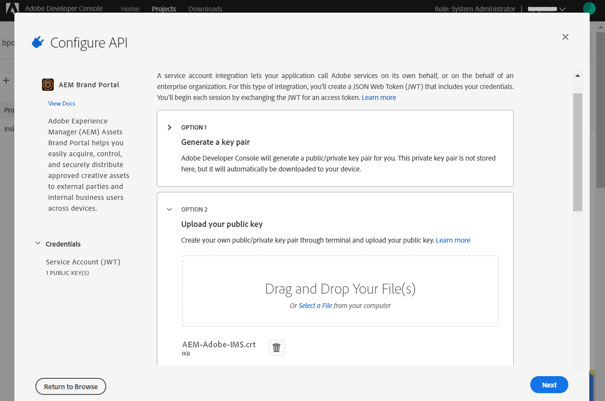
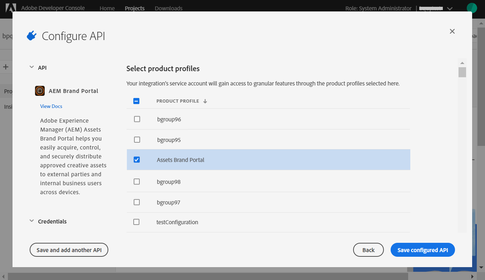

# Konfigurieren von AEM Assets mit Brand Portal {#configure-integration-65}

Adobe Experience Manager (AEM) Assets wird über die Adobe Developer Console mit Brand Portal konfiguriert. Dadurch wird ein IMS-Token zur Autorisierung Ihres Brand Portal-Mandanten abgerufen.

>[!NOTE]
>
>Die Konfiguration von AEM Assets mit dem Markenportal über die Adobe Developer Console wird auf AEM 6.5.4.0 und höher unterstützt.
>
>Zuvor wurde Brand Portal über das alte OAuth-Gateway in der klassischen Benutzeroberfläche konfiguriert. Das Gateway ruft mithilfe des JWT-Token-Austauschs ein IMS-Zugriffstoken zur Autorisierung ab.
>
>Die Konfiguration über das alte OAuth-Protokoll wird ab dem 6. April 2020 nicht mehr unterstützt, sondern erfolgt nun über Adobe Developer Console.

>[!TIP]
>
>***Nur für Bestandskunden***
>
>Es wird empfohlen, weiterhin die vorhandene alte OAuth-Gateway-Konfiguration zu verwenden. Falls Probleme mit der alten OAuth Gateway-Konfiguration auftreten, löschen Sie die vorhandene Konfiguration und erstellen Sie eine neue Konfiguration über Adobe Developer Console.

In dieser Hilfe werden die folgenden zwei Anwendungsfälle beschrieben:
* [Neue Konfiguration](#configure-new-integration-65): Wenn Sie ein neuer Brand Portal-Benutzer sind und Ihre AEM Assets-Autoreninstanz mit Brand Portal konfigurieren möchten, können Sie eine neue Konfiguration in der Adobe Developer Console erstellen.
* [Upgrade-Konfiguration](#upgrade-integration-65): Wenn Sie ein bestehender Brand Portal-Benutzer sind und die Autoreninstanz Ihres AEM Assets mit Brand Portal auf dem alten OAuth Gateway konfiguriert wurde, sollten Sie die vorhandenen Konfigurationen löschen und eine neue Konfiguration in der Adobe Developer Console erstellen.

Benutzer dieser Hilfe sollten mit den folgenden Technologien vertraut sein:

* Installieren, Konfigurieren und Verwalten von Adobe Experience Manager- und AEM-Paketen.

* Verwenden von Linux- und Microsoft Windows-Betriebssystemen.

## Voraussetzungen {#prerequisites}

Sie benötigen Folgendes, um AEM Assets mit Brand Portal zu konfigurieren:

* Eine betriebsbereite AEM Assets-Autoreninstanz mit dem neuesten Service Pack.
* Brand Portal-Mandanten-URL
* Ein Benutzer mit Systemadministrator-Berechtigungen für die IMS-Organisation des Brand Portal-Mandanten

[Herunterladen und Installieren von AEM 6.5](#aemquickstart)

[Herunterladen und Installieren des neuesten AEM Service Packs](#servicepack)

### Herunterladen und Installieren von AEM 6.5 {#aemquickstart}

Es wird empfohlen, AEM 6.5 zum Einrichten einer AEM-Autoreninstanz zu verwenden. Wenn Sie AEM nicht eingerichtet haben, laden Sie es von den folgenden Speicherorten herunter:

* If you are an existing AEM customer, download AEM 6.5 from [Adobe Licensing website](http://licensing.adobe.com).

* If you are an Adobe partner, use [Adobe Partner Training Program](https://adobe.allegiancetech.com/cgi-bin/qwebcorporate.dll?idx=82357Q) to request AEM 6.5.

Anweisungen zum Einrichten einer AEM- Autoreninstanz finden Sie nach dem Herunterladen von AEM unter [Bereitstellen und Verwalten](https://helpx.adobe.com/de/experience-manager/6-5/sites/deploying/using/deploy.html#defaultlocalinstall).

### Herunterladen und Installieren des neuesten AEM Service Packs{#servicepack}

Ausführliche Anweisungen finden Sie unter

* [Versionshinweise zum AEM 6.5 Service Pack](https://helpx.adobe.com/de/experience-manager/6-5/release-notes/sp-release-notes.html)

**Wenden Sie sich an den Kundendienst** , wenn Sie das neueste AEM-Paket oder Service Pack nicht finden können.

## Erstellen der Konfiguration {#configure-new-integration-65}

Zum Konfigurieren von AEM Assets mit dem Markenportal sind Konfigurationen sowohl in der Autoreninstanz als auch in der Adobe Developer Console erforderlich.

1. Erstellen Sie in der Autoreninstanz von AEM Assets ein IMS-Konto und generieren Sie ein öffentliches Zertifikat (öffentlicher Schlüssel).

1. Erstellen Sie in der Adobe Developer Console ein Projekt für Ihren Brand Portal-Mandanten (Unternehmen).

1. Konfigurieren Sie unter dem Projekt eine API mithilfe des öffentlichen Schlüssels, um eine JWT-Verbindung (Dienstkonto) zu erstellen.

1. Rufen Sie die Anmeldedaten für das Dienstkonto und die JWT-Payload-Informationen ab.

1. Konfigurieren Sie in der Autoreninstanz von AEM Assets das IMS-Konto mit den Dienstkontoanmeldeinformationen und der JWT-Payload.

1. Konfigurieren Sie in der Autoreninstanz von AEM Assets den Markenportal-Cloud-Dienst mit dem IMS-Konto und dem Markenportal-Endpunkt (Organisations-URL).

1. Testen Sie die Konfiguration, indem Sie ein Asset aus der Autoreninstanz des AEM Assets in Brand Portal veröffentlichen.

>[!NOTE]
>
>Ein Markenportal-Mieter darf nur mit einer Autoreninstanz eines AEM Assets konfiguriert werden.
>
>Konfigurieren Sie keinen Markenportal-Mandanten mit mehreren Autoreninstanzen von AEM Assets.

Führen Sie die folgenden Schritte in der aufgeführten Reihenfolge durch, wenn Sie AEM Assets zum ersten Mal mit dem Markenportal konfigurieren:
1. [Abrufen eines öffentlichen Zertifikats](#public-certificate)
1. [Erstellen einer JWT-Verbindung (Dienstkonto)](#createnewintegration)
1. [Konfigurieren des IMS-Kontos](#create-ims-account-configuration)
1. [Konfigurieren von Cloud Service](#configure-the-cloud-service)
1. [Testen der Konfiguration](#test-integration)

### Erstellen der IMS-Konfiguration {#create-ims-configuration}

Die IMS-Konfiguration authentifiziert Ihren Brand Portal-Mandanten mit der Autoreninstanz von AEM Assets.

Die IMS-Konfiguration umfasst zwei Schritte:

* [Abrufen eines öffentlichen Zertifikats](#public-certificate)
* [Konfigurieren des IMS-Kontos](#create-ims-account-configuration)

### Abrufen eines öffentlichen Zertifikats {#public-certificate}

Ein öffentliches Zertifikat ermöglicht Ihnen die Authentifizierung Ihres Profils in der Adobe Developer Console.

1. Melden Sie sich bei der AEM Assets-Autorenistanz an. Die Standardeinstellung ist
   `http:// localhost:4502/aem/start.html`
1. Navigieren Sie im Bedienfeld **Tools**  zu **[!UICONTROL Sicherheit]** > **[!UICONTROL Adobe IMS-Konfigurationen]**.

   

1. Klicken Sie auf der Seite mit den Adobe IMS-Konfigurationen auf **[!UICONTROL Erstellen]**.

1. Sie gelangen auf die Seite für die **[!UICONTROL Konfiguration des technischen Adobe IMS-Kontos]**. Standardmäßig wird die Registerkarte **Zertifikat** geöffnet.

   Wählen Sie die Cloud-Lösung **[!UICONTROL Adobe Brand Portal]** aus.

1. Mark the checkbox **[!UICONTROL Create new certificate]** and specify an **alias** for the certificate. Der Alias dient als Name des Dialogfelds.

1. Klicken Sie auf **[!UICONTROL Zertifikat erstellen]**. Klicken Sie dann im Dialogfeld auf **[!UICONTROL OK]**, um das öffentliche Zertifikat zu generieren.

   

1. Klicken Sie auf **[!UICONTROL Öffentlichen Schlüssel herunterladen]** und speichern Sie die Zertifikatdatei (.crt) auf Ihrem Computer.

   Die Zertifikatdatei wird in weiteren Schritten zum Konfigurieren der API für Ihren Brand Portal-Mandanten und zum Generieren von Anmeldedaten für Dienstkonten in der Adobe Developer Console verwendet.

   

1. Klicken Sie auf **[!UICONTROL Weiter]**.

   Erstellen Sie auf der Registerkarte **Konto** das Adobe IMS-Konto. Dafür benötigen Sie jedoch die Anmeldedaten für Dienstkonten, die in der Adobe Developer Console generiert werden. Lassen Sie diese Seite vorerst offen.

   Öffnen Sie eine neue Registerkarte und [erstellen Sie in der Adobe Developer Console eine JWT-Verbindung (Dienstkonto)](#createnewintegration), um die Anmeldedaten und die JWT-Payload für die Konfiguration des IMS-Kontos abzurufen.

### Erstellen einer JWT-Verbindung (Dienstkonto) {#createnewintegration}

In der Adobe Developer Console werden Projekte und APIs auf Unternehmensebene (Brand Portal-Mandant) konfiguriert. Beim Konfigurieren einer API wird eine JWT-Verbindung (Dienstkonto) in der Adobe Developer Console erstellt. Es gibt zwei Methoden zum Konfigurieren der API: Generieren eines Schlüsselpaars (privater und öffentlicher Schlüssel) oder Hochladen eines öffentlichen Schlüssels. Um die Autoreninstanz von AEM Assets mit dem Markenportal zu konfigurieren, müssen Sie ein öffentliches Zertifikat (öffentlichen Schlüssel) in der Autoreninstanz von AEM Assets generieren und Anmeldeinformationen in Adobe Developer Console erstellen, indem Sie den öffentlichen Schlüssel hochladen. Dieser öffentliche Schlüssel wird zum Konfigurieren der API für das ausgewählte Brand Portal-Unternehmen verwendet und generiert die Anmeldedaten und die JWT-Payload für das Dienstkonto. Diese Anmeldeinformationen werden außerdem verwendet, um das IMS-Konto in der Autoreninstanz von AEM Assets zu konfigurieren. Nachdem das IMS-Konto konfiguriert wurde, können Sie den Markenportal-Cloud-Dienst in der Autoreninstanz von AEM Assets konfigurieren.

Führen Sie die folgenden Schritte aus, um die Anmeldedaten für das Dienstkonto und die JWT-Payload zu generieren:

1. Melden Sie sich bei der Adobe Developer Console mit Systemadministratorrechten für die IMS-Organisation (den Brand Portal-Mandanten) an. Die Standardeinstellung ist

   [https://www.adobe.com/go/devs_console_ui](https://www.adobe.com/go/devs_console_ui)

   >[!NOTE]
   >
   >Vergewissern Sie sich, dass Sie die richtige IMS-Organisation (Brand Portal-Mandant) aus der Dropdown-Liste (Organisationsliste) oben rechts ausgewählt haben.

1. Klicken Sie auf **[!UICONTROL Neues Projekt erstellen]**. Für Ihre Organisation wird ein leeres Projekt erstellt.

   Klicken Sie auf **[!UICONTROL Projekt bearbeiten]**, um den **[!UICONTROL Projekttitel]** und die **[!UICONTROL Projektbeschreibung]** zu aktualisieren, und klicken Sie auf **[!UICONTROL Speichern]**.

   

1. Klicken Sie auf der Registerkarte mit der Projektübersicht auf **[!UICONTROL API hinzufügen]**.

   

1. Wählen Sie im Fenster „API hinzufügen“ die Option **[!UICONTROL AEM Brand Portal]** aus und klicken Sie auf **[!UICONTROL Weiter]**.

   Stellen Sie sicher, dass Sie Zugriff auf den AEM Brand Portal-Dienst haben.

1. Klicken Sie im Fenster „API konfigurieren“ auf **[!UICONTROL Öffentlichen Schlüssel hochladen]**. Klicken Sie dann auf **[!UICONTROL Datei auswählen]** und laden Sie das öffentliche Zertifikat (.crt-Datei) hoch, das Sie im Abschnitt zum [Abrufen des öffentlichen Zertifikats](#public-certificate) heruntergeladen haben.

   Klicken Sie auf **[!UICONTROL Weiter]**.

   

1. Überprüfen Sie das öffentliche Zertifikat und klicken Sie auf **[!UICONTROL Weiter]**.

1. Wählen Sie das Standardproduktprofil **[!UICONTROL Assets Brand Portal]** aus und klicken Sie auf **[!UICONTROL Konfiguration speichern]**.

   

1. Sobald die API konfiguriert ist, werden Sie zur API-Übersicht weitergeleitet. Klicken Sie in der linken Navigation unter **[!UICONTROL Anmeldedaten]** auf **[!UICONTROL Dienstkonto (JWT)]**.

   >[!NOTE]
   >
   >Sie können die Anmeldedaten einsehen und bei Bedarf weitere Aktionen durchführen (JWT-Token generieren, Anmeldedaten kopieren, Client-Geheimnisse abrufen usw.).

1. Kopieren Sie auf der Registerkarte **[!UICONTROL Client-Anmeldedaten]** die **[!UICONTROL Client-ID]**.

   Klicken Sie auf **[!UICONTROL Client-Geheimnis abrufen]** und kopieren Sie das **[!UICONTROL Client-Geheimnis]**.

   

1. Navigieren Sie zur Registerkarte **[!UICONTROL JWT generieren]** und kopieren Sie die **[!UICONTROL JWT-Payload]**.

Sie können jetzt die Client-ID (API-Schlüssel), das Client-Geheimnis und die JWT-Payload verwenden, um das [IMS-Konto in der AEM Assets Cloud-Instanz zu konfigurieren](#create-ims-account-configuration).

<!--
### Create Adobe I/O integration {#createnewintegration}

Adobe I/O integration generates API Key, Client Secret, and Payload (JWT) which is required in setting up the IMS Account configurations.

1. Login to Adobe I/O Console with system administrator privileges on the IMS organization of the Brand Portal tenant.

   Default URL: [https://console.adobe.io/](https://console.adobe.io/) 

1. Click **[!UICONTROL Create Integration]**.

1. Select **[!UICONTROL Access an API]**, and click **[!UICONTROL Continue]**.

   

1. Create a new integration page opens. 
   
   Select your organization from the drop-down list.

   In **[!UICONTROL Experience Cloud]**, Select **[!UICONTROL AEM Brand Portal]** and click **[!UICONTROL Continue]**. 

   If the Brand Portal option is disabled for you, ensure that you have selected correct organization from the drop-down box above the **[!UICONTROL Adobe Services]** option. If you do not know your organization, contact your administrator.

   

1. Specify a name and description for the integration. Click **[!UICONTROL Select a File from your computer]** and upload the `AEM-Adobe-IMS.crt` file downloaded in the [obtain public certificates](#public-certificate) section.

1. Select the profile of your organization. 

   Or, select the default profile **[!UICONTROL Assets Brand Portal]** and click **[!UICONTROL Create Integration]**. The integration is created.

1. Click **[!UICONTROL Continue to integration details]** to view the integration information. 

   Copy the **[!UICONTROL API Key]** 
   
   Click **[!UICONTROL Retrieve Client Secret]** and copy the Client Secret key.

   

1. Navigate to **[!UICONTROL JWT]** tab, and copy the **[!UICONTROL JWT payload]**.

   The API Key, Client Secret key, and JWT payload information will be used to create IMS account configuration.
-->

### Erstellen der Konfiguration des IMS-Kontos {#create-ims-account-configuration}

Stellen Sie sicher, dass Sie die folgenden Schritte ausgeführt haben:

* [Abrufen eines öffentlichen Zertifikats](#public-certificate)
* [Erstellen einer JWT-Verbindung (Dienstkonto)](#createnewintegration)

Führen Sie die folgenden Schritte aus, um das IMS-Konto zu konfigurieren, das Sie unter [Abrufen des öffentlichen Zertifikats](#public-certificate) erstellt haben.

1. Öffnen Sie die IMS-Konfiguration und navigieren Sie zur Registerkarte **[!UICONTROL Konten]**. You kept the page open while [obtaining public certificate](#public-certificate).

1. Geben Sie einen **[!UICONTROL Titel]** für das IMS-Konto an.

   Geben Sie in **[!UICONTROL Autorisierungsserver]** die URL ein: [https://ims-na1.adobelogin.com/](https://ims-na1.adobelogin.com/)

   Fügen Sie die Client-ID in den API-Schlüssel, das Client-Geheimnis und die JWT-Payload ein, die Sie beim [Erstellen der JWT-Verbindung (Dienstkonto)](#createnewintegration) kopiert haben.

   Klicken Sie auf **[!UICONTROL Erstellen]**.

   Das IMS-Konto ist konfiguriert.

   

1. Wählen Sie die IMS-Konfiguration aus und klicken Sie auf **[!UICONTROL Systemdiagnose]**.

   Klicken Sie im Dialogfeld auf **[!UICONTROL Prüfen]**. Bei erfolgreicher Konfiguration wird eine Meldung angezeigt, dass das *Token erfolgreich abgerufen* wurde.

   

>[!CAUTION]
>
>Sie dürfen nur eine IMS-Konfiguration haben. Erstellen Sie nicht mehrere IMS-Konfigurationen.
>
>Vergewissern Sie sich, dass die IMS-Konfiguration die Konsistenzprüfung besteht. Wenn die Konfiguration die Konsistenzprüfung nicht besteht, ist sie ungültig. Sie müssen sie löschen und eine neue gültige Konfiguration erstellen.

### Konfigurieren von Cloud Service {#configure-the-cloud-service}

Führen Sie die folgenden Schritte aus, um den Brand Portal-Cloud-Dienst zu erstellen:

1. Melden Sie sich bei der AEM Assets-Autorenistanz an.

1. Navigieren Sie im **Tool** -Bedienfeld zu **[!UICONTROL Cloud Services]** > **[!UICONTROL AEM Brand Portal]**.

1. Klicken Sie auf der Seite mit den Brand Portal-Konfigurationen auf **[!UICONTROL Erstellen]**.

1. Geben Sie einen **[!UICONTROL Titel]** für die Konfiguration ein.

   Wählen Sie die IMS-Konfiguration aus, die Sie beim [Konfigurieren des IMS-Kontos](#create-ims-account-configuration) erstellt haben.

   In the **[!UICONTROL Service URL]**, enter your Brand Portal tenant (organization) URL.

   

1. Klicken Sie auf **[!UICONTROL Speichern und schließen]**. Die Cloud-Konfiguration wird erstellt. Ihre Autoreninstanz für AEM Assets ist jetzt mit dem Markenportal-Mandanten konfiguriert.

### Testen der Konfiguration {#test-integration}

Führen Sie zur Validierung der Konfiguration folgende Schritte aus:

1. Melden Sie sich bei Ihrer AEM Assets-Cloud-Instanz an.

1. From the **Tools**  panel, navigate to **[!UICONTROL Deployment]** > **[!UICONTROL Replication]**.

   

1. Klicken Sie auf der Seite „Replikation“ auf **[!UICONTROL Agenten für Autor]**.

   

1. Für jeden Mandanten werden vier Replizierungsagenten erstellt.

   Suchen Sie die Replizierungsagenten Ihres Markenportal-Mandanten.

   Klicken Sie auf die Replizierungsagenten-URL.

   

   >[!NOTE]
   >
   >Die Replizierungsagenten arbeiten parallel und teilen die Auftragsverteilung gleichmäßig, wodurch die Veröffentlichungsgeschwindigkeit um das Vierfache der Originalgeschwindigkeit steigt. Wenn der Cloud-Service konfiguriert wurde, sind keine zusätzlichen Konfigurationsschritte erforderlich, um die Replikationsagenten zu aktivieren. Sie werden standardmäßig aktiviert, um die parallele Veröffentlichung mehrerer Assets zu ermöglichen.

1. Um die Verbindung zwischen AEM Assets und Brand Portal zu überprüfen, klicken Sie auf **[!UICONTROL Verbindung testen]**.

   

   Unten auf der Seite wird eine Meldung angezeigt, dass Ihr Testpaket erfolgreich bereitgestellt wurde.

   

1. Überprüfen Sie die Testergebnisse für alle vier Replizierungsagenten einzeln.

   >[!NOTE]
   >
   >Deaktivieren Sie keine Replizierungsagenten. Dies kann dazu führen, dass die Replizierung einiger Assets fehlschlägt.

Ihre Autoreninstanz für AEM Assets wurde erfolgreich mit dem Markenportal konfiguriert. Sie können jetzt:

* [Veröffentlichen von Assets aus AEM Assets in Brand Portal](../assets/brand-portal-publish-assets.md)
* [Veröffentlichen von Ordnern aus AEM Assets in Brand Portal](../assets/brand-portal-publish-folder.md)
* [Veröffentlichen von Sammlungen aus AEM Assets in Brand Portal](../assets/brand-portal-publish-collection.md)
* [Konfigurieren Sie die Asset-Beschaffung](https://docs.adobe.com/content/help/en/experience-manager-brand-portal/using/asset-sourcing-in-brand-portal/brand-portal-asset-sourcing.html) , damit die Benutzer des Markenportals Assets zu AEM Assets beitragen und diese veröffentlichen können.

## Upgrade der Konfiguration {#upgrade-integration-65}

Führen Sie die folgenden Schritte in der aufgeführten Reihenfolge aus, um vorhandene Konfigurationen zu aktualisieren:
1. [Ausführen von Aufträgen überprüfen](#verify-jobs)
1. [Vorhandene Konfigurationen löschen](#delete-existing-configuration)
1. [Konfiguration erstellen](#configure-new-integration-65)

### Ausführen von Aufträgen überprüfen {#verify-jobs}

Vergewissern Sie sich, dass auf der Autoreninstanz Ihres AEM Assets kein Veröffentlichungsauftrag ausgeführt wird, bevor Sie Änderungen vornehmen. Dazu können Sie alle vier Replizierungsagenten überprüfen und sicherstellen, dass die Warteschlangen leer sind.

1. Melden Sie sich bei der AEM Assets-Autorenistanz an.

1. From the **Tools**  panel, navigate to **[!UICONTROL Deployment]** > **[!UICONTROL Deployment Replication]**.

1. Klicken Sie auf der Seite „Replikation“ auf **[!UICONTROL Agenten für Autor]**.

   

1. Suchen Sie die Replizierungsagenten Ihres Markenportal-Mandanten.

   Stellen Sie sicher, dass die **Warteschlange für alle Replizierungsagenten &quot;Idle** &quot;lautet. Es ist kein Veröffentlichungsauftrag aktiv.

   

### Vorhandene Konfigurationen löschen {#delete-existing-configuration}

Sie müssen beim Löschen der vorhandenen Konfigurationen die folgende Liste ausführen.
* Alle vier Replizierungsagenten löschen
* Cloud-Dienst löschen
* MAC-Benutzer löschen

1. Melden Sie sich bei Ihrer Autoreninstanz für AEM Assets an und öffnen Sie CRX Lite als Administrator. Die Standardeinstellung ist

   `http:// localhost:4502/crx/de/index.jsp`

1. Navigieren Sie zu allen vier Replizierungsagenten Ihres Markenportal-Mandanten `/etc/replications/agents.author` und löschen Sie sie.

   

1. Navigieren Sie zur Konfiguration `/etc/cloudservices/mediaportal` des **Cloud Service und löschen Sie sie**.

   

1. Navigieren Sie zum `/home/users/mac` MAC-Benutzer **Ihres Markenportals-Mandanten** und löschen Sie ihn.

   

Sie können die Konfiguration [jetzt über die Adobe Developer Console in Ihrer AEM 6.5-Autoreninstanz](#configure-new-integration-65) erstellen.

<!--
   Comment Type: draft

   <li> </li>
   -->

<!--
   Comment Type: draft

   <li>Step text</li>
   -->

