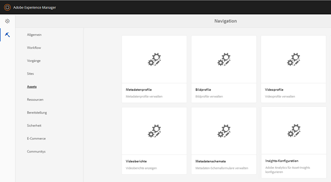
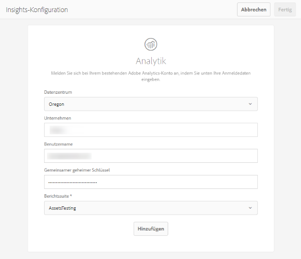

# Konfigurieren von Asset Insights {#configure-asset-insights}

[!DNL Adobe Experience Manager Assets] ruft Nutzungsdaten zu digitalen Assets, die von Websites Dritter verwendet werden, von [!DNL Adobe Analytics] ab. Um Asset Insights zu aktivieren und diese Daten abzurufen und Statistiken zu erzeugen, konfigurieren Sie zuerst die Funktion zur Integration mit Adobe Analytics.

>[!NOTE]
>
>Insights werden nur für Bilder unterstützt und bereitgestellt.

1. Klicken Sie in [!DNL Experience Manager] auf **[!UICONTROL Tools]** > **[!UICONTROL Assets]**.

   

1. Klicken Sie auf die Karte **[!UICONTROL Insights-Konfiguration]**.
1. Wählen Sie im Assistenten ein Rechenzentrum aus und geben Sie Ihre Anmeldedaten an, z. B. den Namen Ihres Unternehmens, den Benutzernamen und gemeinsamen geheimen Schlüssel.

   

   *Abbildung: Konfigurieren  [!DNL Adobe Analytics] für Assets Insights in  [!DNL Experience Manager].*

1. Klicken Sie auf **[!UICONTROL Authenticate]**.
1. Nachdem [!DNL Experience Manager] Ihre Anmeldedaten authentifiziert hat, wählen Sie in der Liste **[!UICONTROL Report Suite]** eine [!DNL Adobe Analytics] Report Suite, aus der Sie die Daten abrufen möchten. Klicken Sie auf **[!UICONTROL Hinzufügen]**.
1. Klicken Sie nach der Einrichtung Ihrer Report Suite auf **[!UICONTROL Fertig]**.[!DNL Experience Manager]

## Seitentracker {#page-tracker}

Nachdem Sie Ihr [!DNL Adobe Analytics]-Konto konfiguriert haben, wird der Seiten-Tracker-Code für Sie generiert. Damit Assets Insights die in Websites von Drittanbietern verwendeten Elemente verfolgen kann, fügen Sie den Seiten-Trackercode im Website-Code ein. [!DNL Experience Manager] Verwenden Sie das Dienstprogramm [!UICONTROL Seitenverfolgung] in [!DNL Experience Manager Assets], um den Seiten-Trackercode zu generieren. Weitere Informationen zum Einbeziehen des Seiten-Tracker-Codes in Webseiten von Drittanbietern finden Sie unter [Verwenden Sie den Seiten-Tracker und den Einbettungscode in Webseiten](/help/assets/use-page-tracker.md).

1. Klicken Sie in [!DNL Experience Manager] auf **[!UICONTROL Tools]** > **[!UICONTROL Assets]**.

   

1. Klicken Sie in der **[!UICONTROL Navigationsseite]** auf die Karte **[!UICONTROL Insights-Seitenverfolgung]**.
1. Klicken Sie auf **[!UICONTROL Herunterladen]**, um den Seitenverfolgungs-Code herunterzuladen.
