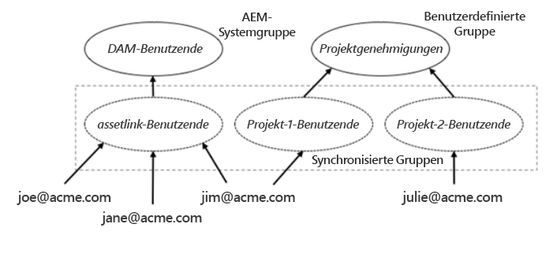

# Experience Manager Assets für Adobe Asset Link konfigurieren {#adobe-asset-link}

[Adobe Asset Link (AAL)](https://www.adobe.com/de/creativecloud/business/enterprise/adobe-asset-link.html) optimiert die Zusammenarbeit zwischen Kreativen und Marketingexperten bei der Inhaltserstellung. Es verbindet Adobe Experience Manager Assets mit den Creative Cloud-Desktop-Applikationen Adobe InDesign, Adobe Photoshop und Adobe Illustrator. Über das Adobe Asset-Link-Bedienfeld können Kreative auf in AEM Assets gespeicherte Inhalte zugreifen und diese bearbeiten, ohne die Kreativprogramme zu verlassen, mit denen sie am besten vertraut sind.

Implementieren Sie die folgenden Aufgaben, um Experience Manager Assets für die Verwendung mit Asset Link zu konfigurieren. Verwenden Sie das Experience Manager-Administratorkonto, um die Konfiguration durchzuführen:

1. Installieren Sie die Pakete nach Bedarf. Details finden Sie unter [Voraussetzungen](#prerequisites).

1. Konfigurieren Sie den Experience Manager entweder [manuell](#manual-configuration) oder mithilfe einer [package](#configure-using-package).

1. Um lizenzierte Creative Cloud-Benutzer Experience Manager zuzuordnen, verwalten Sie [Benutzerzugriffssteuerung](#user-access).

1. Erstellen [benutzerdefinierter Abfrageindex](#create-custom-index), konfigurieren [FPO-Ausgabedarstellungen](/help/assets/configure-fpo-renditions.md) für InDesign konfigurieren Sie [Adobe Stock-Integration](/help/assets/aem-assets-adobe-stock.md)und konfigurieren [visuelle oder Ähnlichkeitssuche](https://experienceleague.adobe.com/docs/experience-manager-65/assets/using/search-assets.html#configvisualsearch).

## Voraussetzungen und Unterstützung für verschiedene Funktionen {#prerequisites}

Stellen Sie sicher, dass Sie das entsprechende Service Pack und Paket nach Bedarf installieren. Beachten Sie die folgenden Anforderungen für jede Experience Manager-Version und für spezifische Funktionen.

| Asset-Funktion | Experience Manager-Version und Support-Anforderungen |
|--- |--- |
| Asset-Link funktioniert standardmäßig | Experience Manager 6.5 und 6.5.2 oder höher.   Experience Manager 6.4.4 und 6.4.6 oder höher.   Adobe empfiehlt, die neueste Version zu installieren [Experience Manager Service Pack (SP)](https://experienceleague.adobe.com/docs/experience-manager-release-information/aem-release-updates/aem-releases-updates.html) vor der Anwendung von AAL. |
| Asset Link funktioniert nach der Installation eines Pakets | Installieren Sie für Experience Manager 6.4.0 - 6.4.3 [adobe-asset-link-support](https://experience.adobe.com/#/downloads/content/software-distribution/en/aem.html?package=/content/software-distribution/en/details.html/content/dam/aem/public/adobe/packages/cq640/featurepack/adobe-asset-link-support) Paket. |
| Adobe Stock-Integration | Experience Manager 6.4.2 oder höher |
| Visuelle oder Ähnlichkeitssuche | Experience Manager 6.5.0 oder höher |

## Konfigurieren von Experience Manager mithilfe des Konfigurationspakets {#configure-using-package}

Adobe empfiehlt die Installation von [adobe-asset-link-config](https://experience.adobe.com/#/downloads/content/software-distribution/en/aem.html?package=/content/software-distribution/en/details.html/content/dam/aem/public/adobe/packages/cq640/product/assets/adobe-asset-link-config) Konfigurationspaket zur Automatisierung der meisten Konfigurationsaufgaben, gefolgt von einigen manuellen Aufgaben. Alternativ können Sie [Manuell konfigurieren](#manual-configuration).

>[!CAUTION]
>
>Wenn Ihre Experience Manager-Instanz für die Benutzeranmeldung mit Adobe IMS-Konten konfiguriert ist, verwenden Sie nicht das Konfigurationspaket. Stattdessen [manuell konfigurieren](#manual-configuration) Ihre Experience Manager-Instanz.

1. Um Package Manager in der Experience Manager-Web-Benutzeroberfläche zu öffnen, greifen Sie auf **[!UICONTROL Instrumente]** > **[!UICONTROL Implementierung]** > **[!UICONTROL Package Share]**. Installieren `adobe-asset-link-config` Paket.

1. Öffnen Sie **[!UICONTROL Tools]** > **[!UICONTROL Vorgänge]** > **[!UICONTROL Web-Konsole]**. Suchen **[!UICONTROL Adobe Granite OAuth IMS Provider]** und klicken Sie auf , um sie zu bearbeiten.

   Legen Sie die folgenden Eigenschaften fest und speichern Sie die Änderungen.

   * [!UICONTROL Gruppenzuordnungen]: Leer lassen, falls gewünscht. Weitere Informationen finden Sie unter [Gruppenzuordnung](#group-mapping).
   * [!UICONTROL Einrichtung]: Geben Sie die Organisations-ID ein, die Sie in der Adobe Admin Console verwenden. Weitere Informationen zu Organisations-IDs finden Sie unter [Benutzergruppe erstellen](https://helpx.adobe.com/enterprise/using/create-aal-user-group.html).

1. Suchen **[!UICONTROL Adobe Granite Bearer Authentication Handler]** und klicken Sie auf , um sie zu bearbeiten.

   Hinzufügen **[!UICONTROL InDesignAem2]** Client-IDs für die **[!UICONTROL Zulässige OAuth-Client-IDs]** Konfigurationseigenschaft.

## Experience Manager manuell konfigurieren {#manual-configuration}

Konfigurieren Sie Experience Manager manuell, wenn Sie kein Konfigurationspaket verwenden möchten oder wenn Ihre Experience Manager-Bereitstellung so konfiguriert ist, dass die Benutzeranmeldung mit Adobe IMS-Konten unterstützt wird.

So konfigurieren Sie Experience Manager manuell:

1. Um auf den Konfigurationsmanager zuzugreifen, greifen Sie auf **[!UICONTROL Instrumente]** > **[!UICONTROL Aktivitäten]** > **[!UICONTROL Web-Konsole]**. Auswählen **[!UICONTROL OSGi]** > **[!UICONTROL Konfiguration]** aus dem Menü oben.

1. Suchen Sie die **[!UICONTROL Adobe Granite OAuth IMS Provider]** und klicken Sie auf , um sie zu bearbeiten.

   Legen Sie die folgende Konfiguration fest und klicken Sie auf **[!UICONTROL Speichern]**.

   * [!UICONTROL Autorisierungsendpunkt]: ` https://ims-na1.adobelogin.com/ims/authorize/v1`
   * [!UICONTROL Token-Endpunkt]: ` https://ims-na1.adobelogin.com/ims/token/v1`
   * [!UICONTROL Profil-Endpunkt]: ` https://ims-na1.adobelogin.com/ims/profile/v1`
   * [!UICONTROL Validierungs-URL]: ` https://ims-na1.adobelogin.com/ims/validate_token/v1`
   * [!UICONTROL Einrichtung]: Auf die Organisations-ID im [Adobe Admin Console](https://adminconsole.adobe.com/).
   * [!UICONTROL Gruppenzuordnungen]: Lassen Sie das Feld leer, es sei denn, Sie haben einen Sonderfall. Weitere Informationen finden Sie unter [Gruppenzuordnung](#group-mapping).

1. Suchen **[!UICONTROL Adobe Granite Bearer Authentication Handler]** und klicken Sie auf , um sie zu bearbeiten.

   Fügen Sie die folgenden Client-IDs zum **[!UICONTROL Zulässige OAuth-Client-IDs]** Konfigurationseigenschaft: `InDesignAem2, cc-europa-desktop_0_1, cc-europa-desktop_1_0, cc-europa-desktop_2_0, cc-europa-desktop_3_0, cc-europa-desktop_4_0, cc-europa-desktop_5_0, cc-europa-desktop_6_0, cc-europa-desktop_7_0, cc-europa-desktop_8_0, cc-europa-desktop_9_0, and cc-europa-desktop_10_0`.

   So fügen Sie sie hinzu `Client ID`klicken `+`. Klicken **[!UICONTROL Speichern]** nach dem Hinzufügen aller IDs.

1. In **[!UICONTROL Adobe Granite OAuth Application and Provider]** Konfiguration, überprüfen Sie die vorhandene **[!UICONTROL Adobe Granite OAuth Authentication Handler]** Instanzen. Wenn Sie eine Instanz mit der `Config ID` Wert von `ims`verwenden Sie es für die Anweisungen in diesem Verfahren. Klicken Sie andernfalls auf `+` , um eine Konfigurationsinstanz zu erstellen. Legen Sie die folgenden Eigenschaftswerte fest und klicken Sie auf **[!UICONTROL Speichern]**.

   * [!UICONTROL Client-ID]: Nicht ändern
   * [!UICONTROL Client Secret]: Nicht ändern
   * [!UICONTROL Konfigurations-ID]: ` ims`
   * [!UICONTROL Anwendungsbereich]: `AdobeID, OpenID, read_organizations` (Andere Werte können sich auch in der Konfiguration befinden)
   * [!UICONTROL Anbieter-ID]: ` ims`
   * [!UICONTROL Benutzer erstellen]: ` Checked`
   * [!UICONTROL User ID-Eigenschaft]: `Email` für die neu erstellte Konfiguration. Andernfalls sollten Sie sich nicht ändern.

1. Suchen Sie die **[!UICONTROL Apache Jackrabbit Oak Standard Sync Handler]** Konfiguration mit dem **[!UICONTROL Sync Handler Name]** `ims` und klicken Sie auf , um sie zu bearbeiten.

   Legen Sie die folgenden Konfigurationseigenschaften fest und klicken Sie auf **[!UICONTROL Speichern]**.

   * [!UICONTROL Ablaufzeit und Ablauf der Benutzermitgliedschaft]: Zeit in Minuten, die auf &quot;m&quot;ohne Leerzeichen folgt. Beispiel: `15m` für 15 Minuten. Weitere Informationen finden Sie unter [Gruppenzuordnung](#group-mapping).
   * [!UICONTROL Automatische Benutzermitgliedschaft]: Nicht ändern
   * [!UICONTROL Dynamische Benutzermitgliedschaft]: ` Deslect`

1. Suchen Sie die **[!UICONTROL Adobe Granite OAuth Authentication Handler]** und klicken Sie auf , um sie zu bearbeiten. Klicken Sie auf **[!UICONTROL Speichern]**.

1. Navigieren Sie in CRXDE zu `/apps/system/config`. Suchen `com.adobe.granite.auth.oauth.impl.BearerAuthenticationHandler.config` und öffnen Sie die Konfiguration. Fügen Sie am Ende `service.ranking=I"-10"`. Speichern Sie die Änderungen.

   >[!NOTE]
   >
   >Jede mit einem Trägertoken authentifizierte Anfrage hat den Mehraufwand für drei Aufrufe an Adobe IMS, die Benutzersynchronisierung und die Erstellung eines Anmelde-Tokens in Experience Manager. Um diesen Mehraufwand zu vermeiden, erfasst Adobe Asset Link das Anmelde-Token, das in der Antwort des Experience Managers zurückgegeben wird, und sendet es mit nachfolgenden Anfragen. Damit dieser Prozess funktioniert, muss die relative Priorität des Trägerauthentifizierungs-Handlers angepasst werden.

1. (Optional) Wenn die Experience Manager-Benutzer in ihren E-Mail-IDs Domänennamen mit Groß- oder Kleinschreibung haben, wählen Sie **[!UICONTROL Ändern Sie &quot;Benutzer sperren&quot;in &quot;Kleinbuchstaben&quot;]** in **[!UICONTROL Adobe Granite-AKP-Plattformkonfigurationen]** in der Experience Manager-Web-Konsole.

## Zusätzliche Konfiguration nach der Migration zu Geschäftsprofilen {#configure-migration-activity}

Adobe Asset Link-Benutzer können eine Verbindung zu Experience Manager herstellen, um die IMS-Anmeldung über das Haupt-Creative Cloud für Enterprise (CCE)-Organisation zu ermöglichen. Experience Manager verwendet die Client-IDs, um die zulässige IMS-Organisation zu identifizieren. Nach der Migration zu Geschäftsprofilen ist es erforderlich, die Client-ID und den geheimen Schlüssel für die IMS-Organisation im Experience Manager für den Trägerauthentifizierungs-Handler zu konfigurieren. Weitere Informationen zu Geschäftsprofilen finden Sie unter [Einführung in Adobe-Profile](https://helpx.adobe.com/de/enterprise/kb/introducing-adobe-profiles.html).

Eine zusätzliche Konfiguration ist nur erforderlich, wenn Sie verschiedene Adobe IMS-Organisationen für Experience Manager und Creative Cloud for Enterprise (CCE) verwenden und zwischen diesen beiden Unternehmen eine Vertrauensbeziehung zwischen diesen beiden Unternehmen hergestellt wird.

>[!NOTE]
>
>* Die Fehlerbehebung für Geschäftsprofile finden Sie in Experience Manager 6.5.11.0.
>* Die vorhandene Konfiguration funktioniert weiterhin, wenn Sie dieselbe Adobe IMS-Organisation mit Experience Manager und CCE verwenden.

**Voraussetzungen**

1. Eine betriebsbereite Experience Manager-Instanz mit für AAL konfigurierter Bearer-Authentifizierung.
1. Installieren Sie das folgende Paket (Service Pack 11) auf Ihrer Experience Manager 6.5-Instanz.

   [Experience Manager 6.5.11.0 herunterladen](https://experience.adobe.com/#/downloads/content/software-distribution/en/aem.html?package=/content/software-distribution/en/details.html/content/dam/aem/public/adobe/packages/cq650/servicepack/aem-service-pkg-6.5.11.zip)

1. Kontakt [!UICONTROL Support] , um die Client-ID und den geheimen Schlüssel für die Trägerauthentifizierung Ihrer IMS-Organisation abzurufen.

Im Folgenden finden Sie die zusätzlichen Konfigurationen, die nach der Migration zu Geschäftsprofilen erforderlich sind:

1. In **[!UICONTROL Adobe Granite OAuth IMS Configuration Provider]** (`com.adobe.granite.auth.ims.impl.ImsConfigProviderImpl`), setzen Sie:

   * OAuth-Konfigurations-ID (`oauth.configmanager.ims.configid`): `ims` (Überprüfen Sie einmal, ob es möglicherweise bereits konfiguriert ist)

   * IMS-Eigentümerentität (`ims.owningEntity`): Ihre IMS-Organisations-ID

   

1. Öffnen **[!UICONTROL Trägerauthentifizierungs-Handler]** Konfiguration und fügen Sie die Client-ID hinzu, die von abgerufen wurde. [!UICONTROL Support] zur Liste der **[!UICONTROL Zulässige OAuth-Client-IDs]**.

   

1. Öffnen **[!UICONTROL Adobe Granite OAuth Application and Provider]** und fügen Sie die **[!UICONTROL Client-ID]** und **[!UICONTROL Client Secret]** (Geheimer Schlüssel) vom Support erhalten.

   Stellen Sie sicher, dass **[!UICONTROL Konfigurations-ID]** field (`oauth.config.id`) enthält den gleichen Wert wie unter **[!UICONTROL OAuth-Konfigurations-ID]** field (`oauth.configmanager.ims.configid`).

   

1. Öffnen **[!UICONTROL Adobe Granite IMS Cluster Exchange Token Preprocessor]** Konfiguration und legen Sie sie auf `enable`.

## Verwalten der Benutzerzugriffssteuerung {#user-access}

In diesem Abschnitt wird beschrieben, wie Sie Benutzer und deren Zugriff auf das Experience Manager-Repository verwalten.

### Gruppenzuordnung {#group-mapping}

Die Gruppenzuordnung bestimmt, wie Gruppen im Experience Manager mit Gruppen in Adobe IMS übereinstimmen. Es spielt eine wichtige Rolle bei der Erteilung von Zugriffsberechtigungen für Adobe Asset Link-Benutzer auf Experience Manager Assets.

Bei Verwendung mit Adobe Asset Link delegiert der Experience Manager Benutzerverwaltungsfunktionen an Adobe IMS. Es werden automatisch Benutzer und Gruppen erstellt, die den Benutzern und Gruppen in Adobe IMS entsprechen. Außerdem werden Benutzer, Gruppen und Gruppenmitgliedschaften in Experience Manager synchronisiert, um sie mit denen in Adobe IMS abzugleichen.

Angenommen, Adobe Asset Link-Benutzer sind Mitglieder der Adobe IMS-Gruppe assetlink-users. In diesem Fall wird eine synchronisierte Gruppe mit dem Namen assetlink-users in Experience Manager erstellt, wenn ein Benutzer dieser Adobe IMS-Gruppe zum ersten Mal eine Verbindung zu Adobe Asset Link herstellt. Jeder neue Benutzer in der Adobe IMS-Gruppe wird in Experience Manager dieser entsprechenden Gruppe hinzugefügt, wenn er zum ersten Mal über Adobe Asset Link eine Verbindung zu Experience Manager herstellt.

Gruppen in Experience Managern, die Gruppen in Adobe IMS entsprechen und mit ihnen synchronisiert werden, können direkt oder durch die Zuweisung von Gruppen zu einer anderen Gruppe Zugriff erhalten. Im Folgenden finden Sie ein Beispiel dafür, wie Berechtigungen verwaltet werden können.

Die folgenden Regeln gelten für Gruppenzuordnungen in Experience Manager:

* Stellen Sie sicher, dass **[!UICONTROL Gruppenzuordnungen]** -Eigenschaft in **[!UICONTROL Adobe Granite OAuth IMS Provider]** -Konfiguration leer ist.
* Die Adobe Asset Link-Benutzergruppenmitgliedschaft wird ausgewertet, wenn sich der Benutzer authentifiziert und der Zeitraum in **[!UICONTROL User Expiration Time]** -Eigenschaft in **[!UICONTROL Apache Jackrabbit Oak Standard Sync Handler]** -Konfiguration vergangen ist. Derzeit können Benutzer in Experience Manager Gruppen hinzugefügt und aus ihnen entfernt werden, um sie mit den in Adobe IMS vorhandenen Elementen zu synchronisieren.
* Vermeiden Sie Konflikte mit Gruppennamen. Stellen Sie sicher, dass sich die Namen für in Adobe IMS erstellte Experience Manager-Benutzergruppen (zur Benutzerverwaltung) von denen aller Systemgruppennamen unterscheiden.

   Stellen Sie beispielsweise sicher, dass sie sich von der `dam-users` und den vom Experience Manager-Administrator erstellten Gruppen.

   Eine Adobe IMS-Gruppe, deren Name mit dem Namen einer Experience Manager-Systemgruppe oder einer manuell erstellten Gruppe in Konflikt steht, wird nicht zur Steuerung von Benutzerberechtigungen verwendet.
* Wenn ein Adobe IMS-Benutzer eine Verbindung zu einer Experience Manager-Instanz herstellt, bei der der Benutzername mit einem zuvor erstellten Experience Manager in Konflikt steht, erhält der Adobe IMS-Benutzer einen anderen Namen mit Zahlen, die hinzugefügt werden, um ihn eindeutig zu machen.

**Erstmalige Zugriffskontrolle einrichten**

Benutzer, die über Adobe Asset Link eine Verbindung herstellen, können Assets erst anzeigen und mit ihnen interagieren, nachdem ihnen die erforderliche Berechtigung erteilt wurde. Die [Gruppenzuordnung](#group-mapping) Im obigen Abschnitt wird erläutert, wie in Experience Manager erstellte Benutzergruppen mit Benutzergruppen in Ihrem Unternehmen in Adobe IMS übereinstimmen und mit ihnen synchronisiert werden. Es wird empfohlen, dass die Experience Manager-Administratoren diese Gruppen verwenden, um die Zugriffskontrolle für Adobe Asset Link-Benutzer zu verwalten.

Für jede Experience Manager-Gruppe, die mit einer Adobe IMS-Gruppe synchronisiert wird (die zur Verwaltung der Benutzerzugriffssteuerung verwendet wird):

1. Stellen Sie sicher, dass die Gruppe über ein Mitglied verfügt, das für eine Erstverbindung über Adobe Asset Link verwendet werden kann.
1. Verwenden Sie diesen Benutzer, um sich bei Adobe Asset Link anzumelden und eine Verbindung zu Experience Manager herzustellen. Es wird erwartet, dass diese Verbindung fehlschlägt.
1. Suchen Sie im Experience Manager die Gruppe, die der Gruppe in Adobe IMS entspricht, und gewähren Sie ihr die gewünschte Zugriffskontrolle. Beispielsweise wird die neue Gruppe zu einem Mitglied der Gruppe dam-users.
1. Schließen Sie Adobe Asset Link und starten Sie das Creative Cloud-Programm neu.
1. Um sicherzustellen, dass der Benutzer den erwarteten Zugriff hat, öffnen Sie Adobe Asset Link erneut.

Sobald diese Schritte ausgeführt wurden, können sich andere Benutzer derselben Gruppe beim ersten Versuch mit Adobe Asset Link mit dem Experience Manager verbinden. Sie haben automatisch dieselben Berechtigungen wie die anderen Benutzer in der Gruppe.

## Experience Manager-Benutzer für Adobe Asset Link verwalten {#manage-users}

Adobe Asset Link-Benutzer können eine Verbindung zu Experience Manager herstellen, wenn sie bei ihrer Creative Cloud App angemeldet sind. Diese Authentifizierung verwendet die Adobe IMS-Technologie und erstellt Benutzerinformationen in Experience Manager, falls diese nicht vorhanden sind. Unternehmenskunden in Experience Manager können ihre  häufig mit einem externen Identitätsanbieter verwalten, der mit Experience Manager integriert ist. Zu den Identitätsanbietern gehören Adobe IMS und andere Produkte, die die Protokolle SAML und LDAP verwenden. Alternativ können Benutzer in Experience Manager lokal erstellt und verwaltet werden.

Benutzer, die über Adobe Asset Link eine Verbindung zu Experience Manager herstellen, haben keinen Konflikt mit bestehenden Benutzerinformationen, die im Experience Manager von der vorherigen Direktanmeldung gespeichert sind, wenn:

* Alle Benutzernamen, die für die direkte Anmeldung bei Experience Manager verwendet werden, unterscheiden sich von den Benutzernamen, die in Adobe IMS für die Anmeldung von Creative Clouden verwendet werden.
* Adobe IMS wird als Identitäts-Provider für die direkte Anmeldung von Experience Managern verwendet.
* Benutzer stellen über Adobe Asset Link eine Verbindung zu Experience Manager her, bevor sie sich direkt beim Experience Manager mit demselben Konto anmelden.

Andererseits müssen die Benutzerinformationen, die durch die direkte Anmeldung eines Experience Managers erstellt wurden, aktualisiert werden, um mit Adobe Asset Link zu funktionieren. Dies geschieht in folgenden Fällen:

* Derselbe Benutzername, z. B. die E-Mail-Adresse des Benutzers, wird für beide verwendet: für das Konto in Creative Cloud, das Adobe IMS verwendet, und für das Konto in einem externen Identitätsanbieter, der nicht Adobe IMS ist.
* Derselbe Benutzername wird für beide verwendet - für das -Konto in Creative Cloud und für ein Experience Manager-Konto.
* Die Creative Cloud-Konten in Adobe IMS sind Federated IDs, die von demselben externen Identitätsanbieter bereitgestellt werden, der für die direkte Anmeldung mit Experience Manager integriert ist.

Die Benutzer, die mit diesen Szenarien erstellt wurden, verfügen nicht über eine Eigenschaft, die für Benutzer erforderlich ist, die mit Adobe IMS synchronisiert werden.

So aktualisieren Sie diese Benutzer in Experience Manager, um mit Adobe Asset Link zu arbeiten:

1. Suchen Sie in der Experience Manager-Webkonsole nach **[!UICONTROL Apache Jackrabbit Oak External PrincipalConfiguration]** und klicken Sie auf , um sie zu bearbeiten. Deaktivieren Sie die **[!UICONTROL Externer Identitätsschutz]** und klicken Sie auf **[!UICONTROL Speichern]**.
1. Um auf die Benutzeroberfläche für die Benutzerverwaltung in Experience Manager zuzugreifen, navigieren Sie zu **[!UICONTROL Instrumente]** > **[!UICONTROL Sicherheit]** > **[!UICONTROL Benutzer]**. Wählen Sie den Benutzer aus, den Sie aktualisieren möchten, und notieren Sie sich dann das Ende des URL-Pfads Ihres Browsers für diesen Benutzer, beginnend mit `/home/users`. Alternativ können Sie in CRXDE nach dem Benutzernamen suchen. Beispielbenutzerpfad: `/home/users/x/xTac082TDh-guJzzG7WM`.
1. Navigieren Sie in CRXDE zum Benutzerpfad, wählen Sie den Benutzerknoten aus und zeigen Sie die Eigenschaften des Knotens an, indem Sie die **[!UICONTROL Eigenschaften]** im unteren mittleren Bereich. Dieser Knoten hat eine `jcr:primaryType` Eigenschaftswert von `rep:User`.
1. Am unteren Rand des **[!UICONTROL Eigenschaften]** Tabulatorbereich, geben Sie einen `Name` Wert von `rep:externalId`, `Type` Wert von `String`und `Value` Wert von `rep:authorizableId`;`ims`, wobei `rep:authorizableId` ist der Wert der `rep:authorizableId` -Eigenschaft des Knotens. (Ein Semikolon ohne Leerzeichen wird verwendet, um die `rep:authorizableId` Wert aus `ims`.
1. Klicken Sie auf **[!UICONTROL Hinzufügen]** auf der rechten Seite Ihres neuen Eintrags und klicken Sie auf **[!UICONTROL Alle speichern]**.
1. Wiederholen Sie die Schritte 2 bis 5 für alle anderen Benutzer, die Sie aktualisieren möchten, um mit Adobe Asset Link zu arbeiten.
1. Suchen Sie in der Experience Manager-Webkonsole nach **[!UICONTROL Apache Jackrabbit Oak External PrincipalConfiguration]** und klicken Sie auf , um sie zu bearbeiten. Deaktivieren Sie die **[!UICONTROL Externer Identitätsschutz]** und klicken Sie auf **[!UICONTROL Speichern]**.

>[!NOTE]
>
>Wenn die Dienste nicht innerhalb weniger Minuten wiederhergestellt werden, starten Sie Experience Manager neu, um eine erfolgreiche Authentifizierung zu ermöglichen.

Nach dieser Änderung kann ein aktualisierter Experience Manager eine Verbindung mit Adobe Asset Link herstellen und weiterhin die Anmeldemethode für die direkte Anmeldung bei Experience Manager verwenden, die vor der Aktualisierung verwendet wurde. Bei erfolgreicher Authentifizierung mit Adobe IMS werden die Benutzerprofilinformationen des Experience Managers mit dem Benutzerprofil in Adobe IMS synchronisiert.

Es gibt eine Methode, mit der eine Massenmigration von mehreren Experience Manager-Benutzern durchgeführt werden kann, um ihnen die Arbeit mit Adobe Asset Link zu ermöglichen. Wenden Sie sich an die Adobe Care , um weitere Informationen und Unterstützung bei der Aktivierung dieser Option zu erhalten.

Als Alternative zu den Schritten kann unter bestimmten Umständen einem Benutzer von Adobe Asset Link ein schneller Zugriff auf den Experience Manager gewährt werden. In solchen Fällen werden die bereits vorhandenen Benutzerinformationen gefunden und mit Experience Manager User Management oder Experience Manager CRXDE gelöscht, bevor sie mit Adobe Asset Link verbunden werden. Neue Benutzerinformationen werden in Experience Manager nach der Verbindung erstellt. Verwenden Sie diesen Ansatz nur, wenn Sie sicher sind, dass keine wichtigen Daten als untergeordnetes Element des Benutzerknotens hinzugefügt werden. Diese zusätzlichen Daten sind alle Knoten, die dem Benutzerknoten untergeordnet sind, außer `tokens`, `preferences`, `profile`, `profiles`, `profiles/public`und `rep:policy/*` Knoten.

## Automatischer Start-Workflow zur bedingten Verarbeitung von Assets {#auto-start-workflow}

In Experience Manager 6.4 und Experience Manager 6.5 können Administratoren Workflows so konfigurieren, dass Assets basierend auf vordefinierten Bedingungen automatisch ausgeführt und verarbeitet werden.

Die Konfiguration eignet sich insbesondere für Anwender aus verschiedenen Geschäftsbereichen und Marketing-Experten, um beispielsweise einen benutzerdefinierten Workflow für einige spezifische Ordner zu erstellen. Angenommen, alle Assets aus dem Foto-Shooting einer Agentur können mit einem Wasserzeichen versehen werden oder alle von einem Freiberufler hochgeladenen Assets können verarbeitet werden, um bestimmte Ausgabeformate zu erstellen.

Weitere Informationen und Informationen zur Konfiguration von Experience Managern finden Sie unter [Workflow für die automatische Ausführung von Assets](https://experienceleague.adobe.com/docs/experience-manager-65/assets/using/assets-workflow.html#auto-execute-workflow-on-some-assets).

## Erstellen Sie einen benutzerdefinierten Index in Experience Manager 6.4.x-Versionen. {#create-custom-index}

Experience Manager enthält Indizes, die für Abfragen verwendet werden. Erstellen Sie den folgenden benutzerdefinierten Index für die angegebene Version. Experience Manager 6.5.0 enthält diesen Index standardmäßig. Adobe Asset Link erfordert diesen Index, um zu bestimmen, welche Assets ein Benutzer ausgecheckt hat.

1. Suchen Sie in CRXDE nach `/oak:index` Knoten. Erstellen Sie einen Knoten mit dem Namen `cqDrivelock` und legen `Type` nach `oak:QueryIndexDefinition`.

1. Fügen Sie die folgenden Eigenschaften zum neuen Knoten hinzu und speichern Sie die Änderungen:

   * `Name: type; Type: string; Value: property`

   * `Name: propertyNames; Type: Name[] (click the "Multi" button); Value: cq:drivelock`

## Visuelle Suche oder Ähnlichkeitssuche konfigurieren {#configure-visual-similarity-search}

Mit der Funktion für die visuelle Suche können Sie im AEM Assets-Repository mithilfe des Bereichs Adobe Asset Link nach visuell ähnlichen Assets suchen. Die Funktion ist in 6.5.0 oder höheren Versionen verfügbar und es werden nur die indizierten Assets durchsucht. Weitere Informationen finden Sie unter [Konfigurieren der visuellen Suche](https://experienceleague.adobe.com/docs/experience-manager-65/assets/using/search-assets.html#configvisualsearch).

## Erzeugen von FPO (For Placement Only)-Ausgabedarstellungen (also nur für die Platzierung) für Adobe InDesign {#fpo-renditions}

Experience Manager bietet Ausgabeversionen, die nur für die Platzierung (FPO) verwendet werden. Diese FPO-Ausgabedarstellungen haben eine kleine Dateigröße, weisen aber dasselbe Seitenverhältnis auf. Wenn für ein Asset keine FPO-Ausgabedarstellung verfügbar ist, verwendet Adobe InDesign stattdessen das Original-Asset. Dieser Fallback-Mechanismus stellt sicher, dass der kreative Workflow ohne Unterbrechung fortgesetzt wird. Weitere Informationen finden Sie unter [FPO-Ausgabedarstellungen generieren](/help/assets/configure-fpo-renditions.md).

## Integration mit Adobe Stock {#adobe-stock-integration}

Unternehmen integrieren ihre Adobe Stock-Konten in Experience Manager Assets. Damit können Marketingexperten lizenzierte hochqualitative, gebührenfreie Fotos, Vektoren, Illustrationen, Videos, Vorlagen und 3D-Assets für ihre Kreativ- und Marketingprojekte verfügbar machen. Kreativprofis können diese Assets über das Bedienfeld &quot;Asset-Link&quot;verwenden.

Informationen zur Integration mit Adobe Stock finden Sie unter [Adobe Stock-Assets in Experience Manager Assets](/help/assets/aem-assets-adobe-stock.md). Für die Integration mit Adobe Stock ist Experience Manager 6.4.2 oder höher erforderlich.

## Fehlerbehebung bei Problemen mit Experience Managern {#troubleshoot}

Wenn beim Konfigurieren oder Verwenden von Adobe Asset Link Probleme auftreten, versuchen Sie Folgendes:

* Stellen Sie sicher, dass Ihre Bereitstellung die Voraussetzungen erfüllt. Stellen Sie insbesondere sicher, dass die entsprechenden Feature Packs oder Pakete installiert sind.
* Wenden Sie sich an den Partner oder Systemintegrator Ihres Unternehmens.
* Wenn Ihre Creative Cloud-Benutzer in den ausgecheckten Assets nicht verifizieren können, überprüfen Sie, ob die Domänennamen in den E-Mail-IDs vermerkt sind. Informationen zum Beheben finden Sie unter [manuelle Konfiguration](#manual-configuration).
* Weitere Informationen finden Sie unter [Fehlerbehebung bei Asset Link](https://helpx.adobe.com/enterprise/kb/asset-link-troubleshooting.html).

>[!MORELIKETHIS]
>
>* [Über Adobe Asset Link](https://helpx.adobe.com/enterprise/using/adobe-asset-link.html)
>* [Verwenden von Asset Link im Creative Cloud-Desktop-Programm und Verwalten von Assets](https://helpx.adobe.com/enterprise/using/manage-assets-using-adobe-asset-link.html)
>* [Konfigurieren von Adobe Experience Manager Assets as a Cloud Service](https://helpx.adobe.com/enterprise/using/configure-aem-assets-for-asset-link.html).

