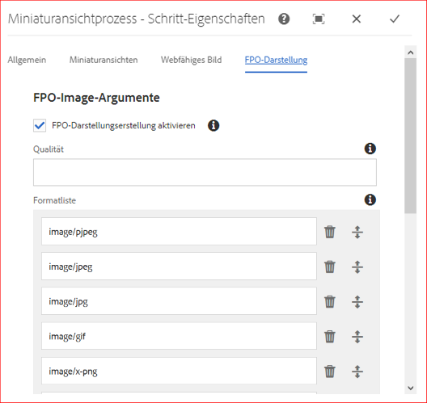
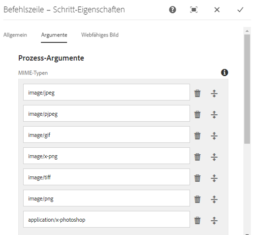
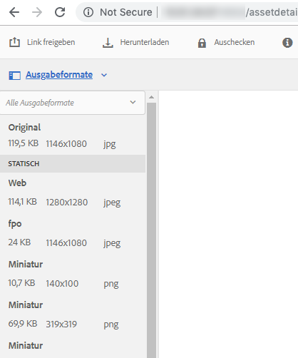

# Nur für Platzierung generieren für Adobe InDesign {#fpo-renditions}

Beim Platzieren großer Assets aus Experience Manager in Adobe InDesign-Dokumenten muss ein Kreativprofi eine beträchtliche Zeit warten, nachdem er [ein Asset](https://helpx.adobe.com/de/indesign/using/placing-graphics.html) platziert hat. In der Zwischenzeit kann der Benutzer InDesign nicht verwenden. Dies unterbricht den kreativen Fluss und wirkt sich negativ auf das Kundenerlebnis aus. Adobe ermöglicht die zeitweilige Platzierung kleinformatiger Ausgabedarstellungen in InDesign-Dokumenten. Wenn die endgültige Ausgabe erforderlich ist, z. B. für Druck- und Veröffentlichungs-Workflows, ersetzen die Original-Assets mit voller Auflösung die temporäre Ausgabedarstellung im Hintergrund. Diese asynchrone Aktualisierung im Hintergrund beschleunigt den Designprozess, um die Produktivität zu steigern, und behindert nicht den kreativen Prozess.

Adobe Experience Manager (AEM) bietet Ausgabedarstellungen, die nur für die Platzierung (FPO) verwendet werden. Diese FPO-Ausgabedarstellungen haben eine kleine Dateigröße, weisen aber dasselbe Seitenverhältnis auf. Wenn für ein Asset keine FPO-Ausgabedarstellung verfügbar ist, verwendet Adobe InDesign stattdessen das ursprüngliche Asset. Dieser Ausweichmechanismus stellt sicher, dass der kreative Workflow ohne Unterbrechung fortgesetzt wird.

## Vorgehensweise zum Generieren von FPO-Ausgabeformaten {#approach-to-generate-fpo-renditions}

Experience Manager ermöglicht eine Vielzahl von Methoden zur Verarbeitung von Bildern, die zum Generieren der FPO-Ausgabedarstellungen verwendet werden können. Die beiden gängigsten Methoden sind die Verwendung von integrierten Experience Manager-Workflows und die Verwendung von ImageMagick. Mit diesen beiden Methoden konfigurieren Sie die Ausgabegenerierung neu hochgeladener Assets und der in Experience Manager vorhandenen Assets.

Sie können ImageMagick verwenden, um Bilder zu verarbeiten, einschließlich zum Generieren von FPO-Ausgabedarstellungen. Solche Ausgabedarstellungen werden heruntergesampelt, d. h. die Pixelabmessungen der Ausgabedarstellung werden proportional reduziert, wenn das Originalbild PPI größer als 72 hat. Siehe [Installieren und Konfigurieren von ImageMagick für die Verwendung mit Experience Manager Assets](best-practices-for-imagemagick.md).

|  | Verwenden des integrierten Workflows des Experience Managers | Workflow &quot;ImageMagick&quot;verwenden | Bemerkungen |
|— |— |—|— |
| Für neue Vermögenswerte | FPO-Ausgabedarstellung aktivieren ([help](#generate-renditions-of-new-assets-using-aem-workflow)) | Hinzufügen der ImageMagick-Befehlszeile im Experience Manager-Workflow ([help](#generate-renditions-of-new-assets-using-imagemagick)) | Experience Manager führt den Workflow DAM-Update-Assets für jeden Upload aus. |
| Für bestehende Vermögenswerte | Aktivieren Sie die FPO-Ausgabedarstellung in einem neuen, dedizierten Experience Manager-Workflow ([help](#generate-renditions-of-existing-assets-using-aem-workflow)) | Hinzufügen der ImageMagick-Befehlszeile in einem neuen, dedizierten Experience Manager-Workflow ([help](#generate-renditions-of-existing-assets-using-imagemagick)) | FPO-Ausgabedarstellungen der vorhandenen Assets können bei Bedarf oder stapelweise erstellt werden. |

>[!CAUTION]
>
>Erstellen Sie die Workflows, um Ausgabedarstellungen zu generieren, indem Sie eine Kopie der Standard-Workflows ändern. Dadurch wird verhindert, dass Ihre Änderungen überschrieben werden, wenn der Experience Manager aktualisiert wird, beispielsweise durch die Installation eines neuen Service Packs.

## Generieren von Ausgabeformaten neuer Assets mit dem Experience Manager-Workflow {#generate-renditions-of-new-assets-using-aem-workflow}

Im Folgenden werden die Schritte zum Konfigurieren des Workflow-Modells DAM Update Asset beschrieben, um die Ausgabegenerierung zu aktivieren:

1. Klicken Sie auf **[!UICONTROL Tools]** > **[!UICONTROL Workflow]** > **[!UICONTROL Modelle]**. Wählen Sie das Modell **[!UICONTROL DAM Update Asset]** und klicken Sie auf **[!UICONTROL Bearbeiten]**.

1. Wählen Sie den Schritt **[!UICONTROL Miniaturansichten verarbeiten]** und klicken Sie auf **[!UICONTROL Konfigurieren]**.

1. Klicken Sie auf die Registerkarte **[!UICONTROL FPO Rendition]** . Wählen Sie **[!UICONTROL Erstellen von FPO-Ausgabedarstellungen aktivieren]**.

   

1. Passen Sie die Werte **[!UICONTROL Qualität]** an und fügen Sie **[!UICONTROL Liste formatieren]** nach Bedarf hinzu oder ändern Sie sie. Standardmäßig ist die Liste der MIME-Typen, die die FPO-Ausgabedarstellung generieren sollen, pjpeg, jpeg, jpg, gif, png, x-png und tiff. Klicken Sie auf **[!UICONTROL Fertig]**.

   >[!NOTE]
   >
   >Die Generierung von Ausgabeformaten wird für die Dateitypen JPEG, GIF, PNG, TIFF, PSD und BMP unterstützt.

1. Um die Änderungen zu aktivieren, klicken Sie auf **[!UICONTROL Sync]**.

>[!NOTE]
>
>Bei Bildern, die auf einer Seite größer als 1280 Pixel sind, werden die Pixelabmessungen in der FPO-Ausgabedarstellung nicht beibehalten.

## Generieren von Ausgabeformaten neuer Assets mit ImageMagick {#generate-renditions-of-new-assets-using-imagemagick}

In Experience Manager wird der Workflow DAM-Update-Asset ausgeführt, wenn ein neues Asset hochgeladen wird. Um ImageMagick zur Verarbeitung von Ausgabedarstellungen neu hochgeladener Assets zu verwenden, fügen Sie dem Workflow-Modell einen neuen Befehl hinzu.

1. Klicken Sie auf **[!UICONTROL Tools]** > **[!UICONTROL Workflow]** > **[!UICONTROL Modelle]**. Wählen Sie das Modell **[!UICONTROL DAM Update Asset]** und klicken Sie auf **[!UICONTROL Bearbeiten]**.

1. Klicken Sie in der oberen linken Ecke auf **[!UICONTROL Seitliches Bedienfeld ein/aus]** . Suchen Sie nach Befehlszeilenschritt.

1. Ziehen Sie den Schritt **[!UICONTROL Befehlszeile]** und fügen Sie ihn vor dem Schritt **[!UICONTROL Prozessminiaturansichten]** hinzu.

1. Wählen Sie den Schritt **[!UICONTROL Befehlszeile]** und klicken Sie auf **[!UICONTROL Konfigurieren]**.

1. Fügen Sie die gewünschten Informationen als benutzerspezifische **[!UICONTROL Titel]** und **[!UICONTROL Beschreibung]** hinzu. Beispielsweise FPO-Ausgabedarstellung (unterstützt von ImageMagick).

1. Fügen Sie auf der Registerkarte **[!UICONTROL Argumente]** relevante **[!UICONTROL MIME-Typen]** hinzu, um eine Liste der Dateiformate bereitzustellen, für die der Befehl gilt.

   

1. Fügen Sie auf der Registerkarte **[!UICONTROL Argumente]** im Abschnitt **[!UICONTROL Befehle]** einen relevanten ImageMagick-Befehl hinzu, um FPO-Ausgabedarstellungen zu generieren.

   Nachfolgend finden Sie ein Beispielbefehl, der FPO-Ausgabedarstellungen im JPEG-Format generiert, auf 72 PPI heruntergesampelt und bei einer Qualitätseinstellung von 10 % verarbeitet und mehrschichtige Adobe Photoshop-Dateien verarbeitet, indem die Ausgabe reduziert wird:

   `convert -quality 10% -units PixelsPerInch ${filename} -resample 72 -flatten cq5dam.fpo.jpeg`

1. Um die Änderungen zu aktivieren, klicken Sie auf **[!UICONTROL Sync]**.

Detaillierte Informationen zu den ImageMagick-Befehlszeilenfunktionen finden Sie unter [https://imagemagick.org](https://imagemagick.org).

## Generieren von Ausgabeformaten vorhandener Assets mithilfe des Experience Manager-Workflows {#generate-renditions-of-existing-assets-using-aem-workflow}

Um mithilfe des Experience Manager-Workflows die FPO-Ausgabe der vorhandenen Assets zu generieren, erstellen Sie ein dediziertes Workflow-Modell, das die integrierte FPO-Ausgabedarstellungsoption verwendet.

1. Klicken Sie auf **[!UICONTROL Tools]** > **[!UICONTROL Workflow]** > **[!UICONTROL Modelle]**. Um ein Modell zu erstellen, klicken Sie auf **[!UICONTROL Erstellen]** > **[!UICONTROL Modell erstellen]**. Fügen Sie einen aussagekräftigen **[!UICONTROL Titel]** und einen **[!UICONTROL Namen]** hinzu.

1. Wählen Sie das Modell aus und klicken Sie auf **[!UICONTROL Bearbeiten]**. Klicken Sie auf **[!UICONTROL Seiteninformationen]** > **[!UICONTROL Eigenschaften öffnen]**. Wählen Sie **[!UICONTROL Verlaufs-Workflow]** aus. Dies verbessert die Skalierbarkeit und Leistung. Klicken Sie auf ******[!UICONTROL Speichern und schließen]**.

1. Klicken Sie in der oberen linken Ecke auf **[!UICONTROL Seitliches Bedienfeld ein/aus]** . Suchen Sie nach Schritt &quot;Miniaturansichten verarbeiten&quot;. Ziehen Sie den Schritt **[!UICONTROL Miniaturansichten verarbeiten]** .

1. Wählen Sie **[!UICONTROL Miniaturansichten verarbeiten]** und klicken Sie auf **[!UICONTROL Konfigurieren]**. Folgen Sie der Konfiguration [, um mithilfe des Experience Manager-Workflows](#generate-renditions-of-new-assets-using-aem-workflow) die Ausgabe neuer Assets zu generieren. Um die Änderungen zu aktivieren, klicken Sie auf **[!UICONTROL Sync]**.

## Generieren von Ausgabeformaten vorhandener Assets mit ImageMagick {#generate-renditions-of-existing-assets-using-imagemagick}

Um mithilfe der Bildmagick-Verarbeitungsfunktionen die FPO-Ausgabe der vorhandenen Assets zu generieren, erstellen Sie ein dediziertes Workflow-Modell, das dazu die ImageMagick-Befehlszeile verwendet.

1. Führen Sie Schritt 1 bis Schritt 3 aus der [Konfiguration aus, um mithilfe des Experience Manager-Workflows](#generate-renditions-of-existing-assets-using-aem-workflow) die Ausgabedarstellung vorhandener Assets zu generieren.

1. Führen Sie Schritt 4 bis Schritt 8 aus der [Konfiguration aus, um mithilfe des Abschnitts ImageMagick](#generate-renditions-of-new-assets-using-imagemagick) die Wiedergabe neuer Assets zu generieren.

## Anzeigen von FPO-Ausgabeformaten {#view-fpo-renditions}

Sie können die generierten FPO-Ausgabedarstellungen überprüfen, nachdem der Workflow abgeschlossen ist. Klicken Sie in der Experience Manager Assets-Benutzeroberfläche auf das Asset, um eine große Vorschau zu öffnen. Öffnen Sie die linke Leiste und wählen Sie Ausgabeformate aus. Alternativ können Sie den Tastaturbefehl `Alt + 3` verwenden, wenn die Vorschau geöffnet ist.

Klicken Sie auf **[!UICONTROL FPO rendition]** , um die Vorschau zu laden. Optional können Sie mit der rechten Maustaste auf die Ausgabedarstellung klicken und sie in Ihrem Dateisystem speichern.

## Tipps und Einschränkungen {#tips-limitations}

* Um die ImageMagick-basierte Konfiguration zu verwenden, installieren Sie ImageMagick auf demselben Computer wie Experience Manager.
* Um FPO-Ausgabedarstellungen vieler Assets oder des gesamten Repositorys zu generieren, planen und führen Sie die Workflows während der Dauer des niedrigen Traffic aus. Die Generierung von FPO-Ausgabedarstellungen für eine große Anzahl von Assets ist eine ressourcenintensive Aktivität und die Experience Manager-Server müssen über ausreichend Verarbeitungsleistung und Arbeitsspeicher verfügen.
* Informationen zur Leistung und Skalierbarkeit finden Sie unter [ImageMagick optimieren](performance-tuning-guidelines.md).
* Informationen zur generischen Befehlszeilenverarbeitung von Assets finden Sie unter [Befehlszeilen-Handler zur Verarbeitung von Assets](media-handlers.md).