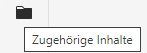
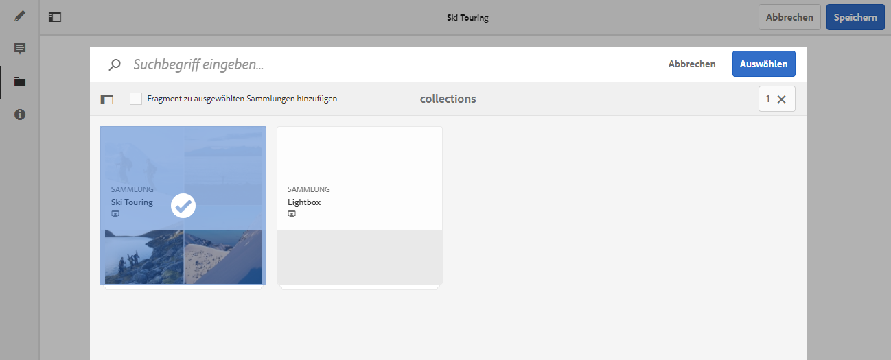
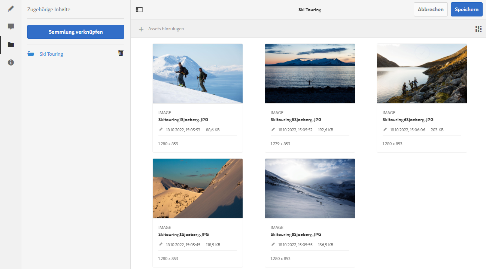

# Zugehörige Inhalte{#associated-content}

Die AEM-Funktion für zugehörige Inhalte stellt die Verbindung bereit, mit der Assets optional für ein Fragment verwendet werden können, wenn es zu einer Inhaltsseite hinzugefügt wird. Dies bietet Ihnen Flexibilität bei der Headless-Bereitstellung von Inhalten, [da Sie eine Reihe von Assets zur Verfügung haben, auf die Sie zugreifen können, wenn Sie das Inhaltsfragment auf einer Seite verwenden.](/help/sites-authoring/content-fragments.md#using-associated-content) Darüber hinaus wird so der Zeitaufwand für die Suche nach dem passenden Asset reduziert.

## Hinzufügen von zugehörigen Inhalten {#adding-associated-content}

>[!NOTE]
>
>Es gibt diverse Methoden, um [visuelle Assets (zum Beispiel Fotos)](/help/assets/content-fragments/content-fragments.md#fragments-with-visual-assets) zum Fragment und/oder der Seite hinzuzufügen.

Um zugehörige Inhalte zu verknüpfen, müssen zunächst [Medien-Assets zu einer Sammlung hinzugefügt werden](/help/assets/manage-collections.md). Danach können Sie Folgendes tun:

1. Öffnen Sie das Fragment und wählen Sie im seitlichen Bedienfeld **Zugehörige Inhalte** aus.

   

1. Je nachdem, ob bereits Sammlungen zugeordnet wurden oder nicht, wählen Sie eine der folgenden Optionen aus:

   * **Inhalt verknüpfen**: dies wird die erste zugehörige Sammlung
   * **Sammlung verknüpfen**: Zugehörige Sammlungen sind bereits konfiguriert

1. Wählen Sie die erforderliche Sammlung aus.

   Optional können Sie das eigentliche Fragment zur ausgewählten Sammlung hinzufügen. Dies hilft bei der Nachverfolgung.

   

1. Bestätigen (mit **Auswählen**). Die Sammlung wird als verknüpft aufgeführt.

   

## Bearbeiten zugehöriger Inhalte {#editing-associated-content}

Nachdem Sie eine Sammlung zugewiesen haben, können Sie Folgendes tun:

* **Entfernen** den Verband.
* **Hinzufügen von Assets** in die Sammlung ein.
* Wählen Sie ein Asset für weitere Aktionen aus.
* Bearbeiten Sie das Asset.
