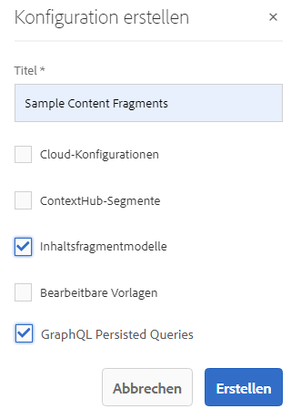
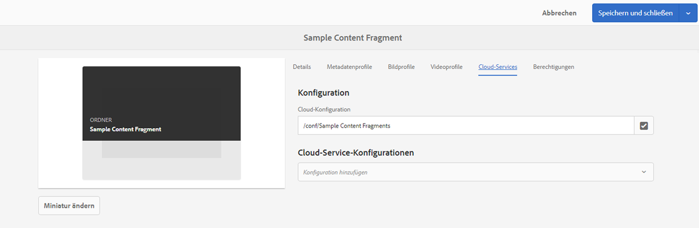

# Inhaltsfragmente – Konfigurations-Browser{#content-fragments-configuration-browser}

Erfahren Sie, wie Sie bestimmte Inhaltsfragmentfunktionen im Konfigurationsbrowser aktivieren, um die leistungsstarken Funktionen der Adobe Experience Manager (AEM) Headless-Bereitstellung zu verwenden.

## Aktivieren der Funktionen für Inhaltsfragmente für Ihre Instanz {#enable-content-fragment-functionality-instance}

Bevor Sie Inhaltsfragmente verwenden, verwenden Sie die **Konfigurationsbrowser** um Folgendes zu aktivieren:

* **Inhaltsfragmentmodelle** – obligatorisch
* **Persistente GraphQL-Abfragen** – optional

>[!CAUTION]
>
>Wenn Sie **Inhaltsfragmentmodelle** nicht aktivieren:
>
>* die **Erstellen** nicht zum Erstellen von Modellen verfügbar.
>* kann [Wählen Sie die Sites-Konfiguration aus, um den zugehörigen Endpunkt zu erstellen.](/help/sites-developing/headless/graphql-api/graphql-endpoint.md#enabling-graphql-endpoint).

Um die Funktion für Inhaltsfragmente zu aktivieren, müssen Sie die folgenden Schritte ausführen:

* Aktivieren der Verwendung der Inhaltsfragmentfunktionalität über den Konfigurationsbrowser
* Wenden Sie die Konfiguration auf Ihren Assets-Ordner an.

### Aktivieren der Funktionen für Inhaltsfragmente im Konfigurations-Browser {#enable-content-fragment-functionality-in-configuration-browser}

nach [Verwenden bestimmter Inhaltsfragmentfunktionen](#creating-a-content-fragment-model), **must** sie zunächst über die **Konfigurationsbrowser**:

>[!NOTE]
>
>Weitere Informationen finden Sie unter [Konfigurationsbrowser:](/help/sites-administering/configurations.md#using-configuration-browser).

1. Navigieren Sie zu **Tools** > **Allgemein** und öffnen Sie dann den **Konfigurations-Browser**.

1. Öffnen Sie über **Erstellen** das Dialogfeld, in dem Sie:

   1. einen **Titel** angeben,
   1. Um ihre Verwendung zu aktivieren, wählen Sie
      * **Inhaltsfragmentmodelle**
      * **Persistente GraphQL-Abfragen**

      

1. Wählen Sie **Erstellen** aus, um die Definition zu speichern.

<!-- 1. Select the location appropriate to your website. -->

### Anwenden der Konfiguration auf Ihren Assets-Ordner {#apply-the-configuration-to-your-assets-folder}

Wenn die Konfiguration **Global** für die Inhaltsfragmentfunktionalität aktiviert ist, gilt sie für jeden Assets-Ordner.

Um andere Konfigurationen (d. h. ohne globale Konfigurationen) mit einem vergleichbaren Asset-Ordner zu verwenden, müssen Sie die Verbindung definieren. Wählen Sie dazu die entsprechende **Konfiguration** in der Registerkarte **Cloud-Services** der **Ordnereigenschaften** des entsprechenden Ordners aus.

