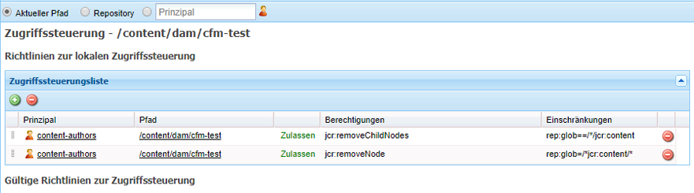

# Inhaltsfragmente – Überlegungen zum Löschen {#content-fragments-delete-considerations}

Lesen Sie diese wichtigen Überlegungen, bevor Sie Ihre Richtlinien zum Löschen von Inhaltsfragmenten in AEM definieren. Inhaltsfragmente sind ein leistungsstarkes Tool für die Bereitstellung von Headless-Inhalten. Die Auswirkungen des Löschens müssen sorgfältig berücksichtigt werden.

## Berechtigungen – Löschen oder nicht löschen {#permissions-delete-or-not-delete}

Die Möglichkeit, Inhalt zu löschen, ist wirkungsvoll, muss aber mit Bedacht verwendet werden, da viele Branchen die Erteilung dieser Berechtigungen einschränken und kontrollieren müssen.

In Bezug auf die Berechtigung zum Löschen müssen Inhaltsfragmente aus zwei Perspektiven betrachtet werden:

1. **Das Inhaltsfragment als einzelne Entität.**

   * **Nutzungsszenario:** Ein Benutzer, der ein Inhaltsfragment bearbeiten oder aktualisieren und **ein ganzes Fragment löschen muss**.
   * **Berechtigungen**: Die Berechtigung zum [Löschen](/help/sites-administering/security.md#actions) kann [über die Benutzer- und/oder Gruppenverwaltung zugewiesen](/help/sites-administering/security.md#managing-permissions) werden.

2. **Die verschiedenen Unterentitäten, die ein Inhaltsfragment bilden. Z. B. Varianten, Unterknoten.**

   Die grundlegende Funktionsweise des Inhaltsfragment-Editors erfordert, dass solche temporären Unterelemente gelöscht werden können. Beispielsweise wenn Varianten bearbeitet oder Metadaten oder verknüpfte Inhalte verwaltet werden.

   * **Nutzungsszenario:** Ein Benutzer, der ein Inhaltsfragment bearbeiten oder aktualisieren muss, **aber kein ganzes Fragment löschen darf**.
   * **Berechtigungen:** Siehe [Nur für Editor-Funktionen erforderliche Berechtigungen](#permissions-required-for-editor-functionality-only).

>[!NOTE]
>
>Wenn Benutzende nicht über die Berechtigung zum [Löschen](/help/sites-administering/security.md#actions) verfügen, wird der Inhaltsfragment-Editor im *schreibgeschützten* Modus ausgeführt.

>[!NOTE]
>
>Siehe auch [Prüfen von Benutzerverwaltungsvorgängen in AEM](/help/sites-administering/audit-user-management-operations.md).

## Nur für Editor-Funktionen erforderliche Berechtigungen {#permissions-required-for-editor-functionality-only}

Benutzer, die ein Fragment bearbeiten oder aktualisieren müssen, **aber keine kompletten Fragmente löschen dürfen**, benötigen bestimmte Berechtigungen, da die grundlegende Funktionsweise des Inhaltsfragmente-Editors erfordert, dass diese temporären Unterelemente gelöscht werden können.

Beispielsweise wenn Varianten bearbeitet oder Metadaten oder verknüpfte Inhalte verwaltet werden.

>[!NOTE]
>
>Die zum Bearbeiten oder Aktualisieren eines Inhaltsfragments benötigten Rechte zum Löschen erhalten sie mit der Löschberechtigung, die [über die Benutzer- und/oder Gruppenverwaltung zugewiesen wird](/help/sites-administering/security.md#managing-permissions).

Die zum Bearbeiten oder Aktualisieren eines Fragments benötigten Rechte müssen auf den Knoten, der das Fragment enthält, oder einen entsprechenden übergeordneten Knoten angewendet werden (auf allen Ebenen unter `/content/dam`). Wenn die Zuweisung an einen übergeordneten Knoten erfolgt, werden die Berechtigungen auf alle Knoten in dieser Verzweigung angewendet.

Beispiel: Ein Ordner, der alle Inhaltsfragmente enthält, z. B.:

* `/content/dam/contentfragments`

>[!CAUTION]
>
>Die Berechtigungen können auch auf `/content/dam` festgelegt werden, weil hier alle Inhaltsfragmente gespeichert werden.
>
>Allerdings wird die Löschberechtigung dadurch auch für *alle* anderen Asset-Typen gewährt.

Die Berechtigungsvoraussetzungen, die es bestimmten Benutzenden und/oder einer bestimmten Gruppe gestattet, ein Inhaltsfragment zu bearbeiten/zu aktualisieren, sind:

>[!NOTE]
>
>Diese Liste zeigt alle erforderlichen Berechtigungen, nicht nur die Berechtigungen zum Löschen.

* Für die Inhaltsfragmentknoten oder -ordner:

   * `jcr:addChildNodes`, `jcr:modifyProperties`

* Für den `jcr:content`-Knoten aller Inhaltsfragmente:

   * `jcr:addChildNodes`, `jcr:modifyProperties` und `jcr:removeChildNodes`

* Für alle Knoten unter `jcr:content` aller Inhaltsfragmente:

   * `jcr:addChildNodes`, `jcr:modifyProperties` und `jcr:removeChildNodes`, `jcr:removeNode`

Diese Berechtigungen zum `remove` müssen [mit Zugriffssteuerungslisten in CRXDE Lite verwaltet werden](/help/sites-administering/user-group-ac-admin.md#access-right-management).

Die Berechtigungen zum `add` und `modify` können ebenfalls in CRXDE Lite oder über die User Management-Konsole verwaltet werden.

Beispielsweise die Definition der Berechtigungen zum `remove` für eine Gruppe `content-authors-no-delete`:

