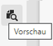
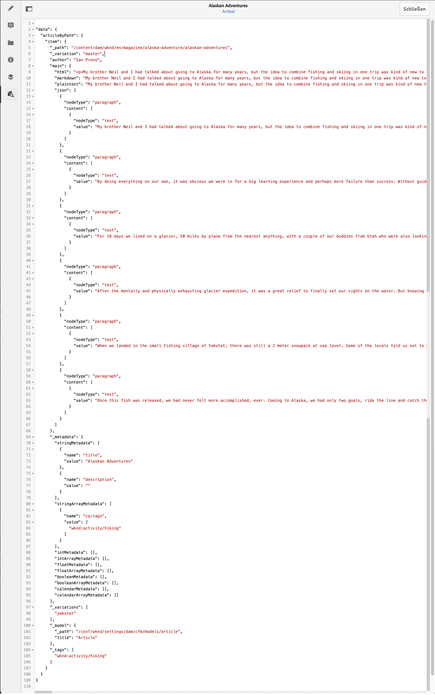

# Vorschau – JSON-Darstellung {#preview-json-representation}

Beim Entwickeln der Modelle für Inhaltsfragmente als Teil der AEM-Headless-Implementierung können Sie mit dem Inhaltsfragment-Editor eine JSON-Beispielausgabe für ein Inhaltsfragment auf der Grundlage eines Modells anzeigen. So erhalten Sie beispielsweise eine Vorstellung davon, wie die endgültige Ausgabe aussehen wird. Dies könnte bei der Validierung der Modell-JSON-Struktur hilfreich sein, ggf. mit standardmäßigen Beispielinhalten pro Datentyp.

Verwendung des **Vorschau**-Symbols:

Sie können die JSON-Repräsentation des aktuellen Fragments anzeigen. Zum Beispiel:

<!--
**Copy URL** lets you copy to clipboard the URL for either author or publish.
-->
