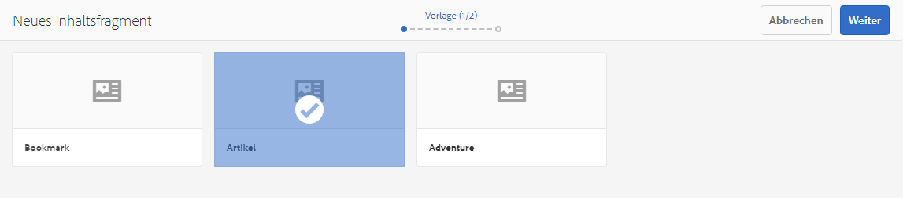
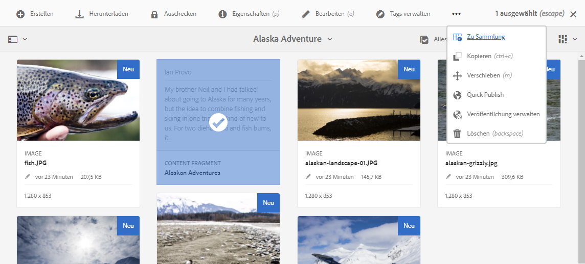
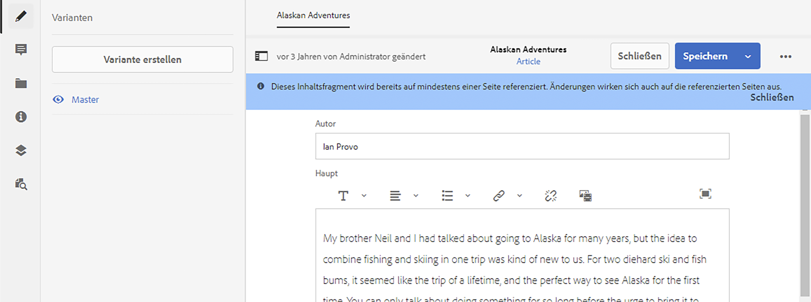
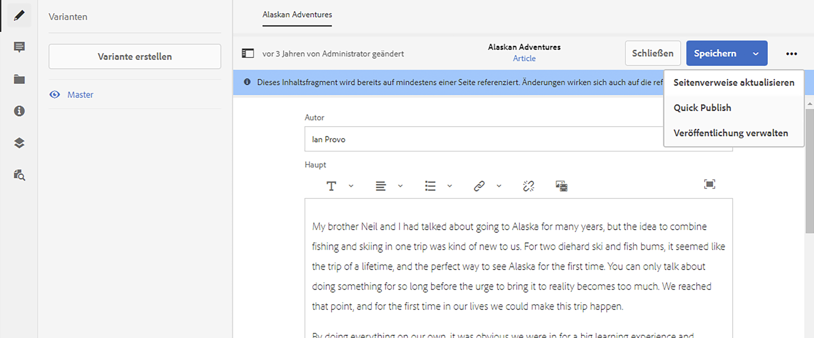
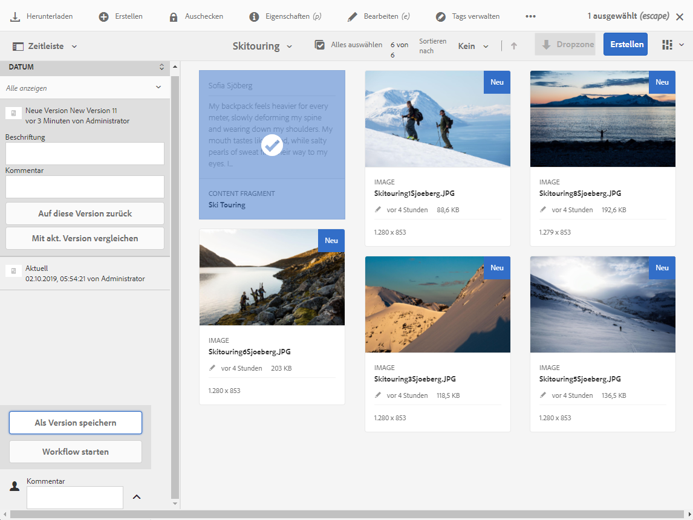
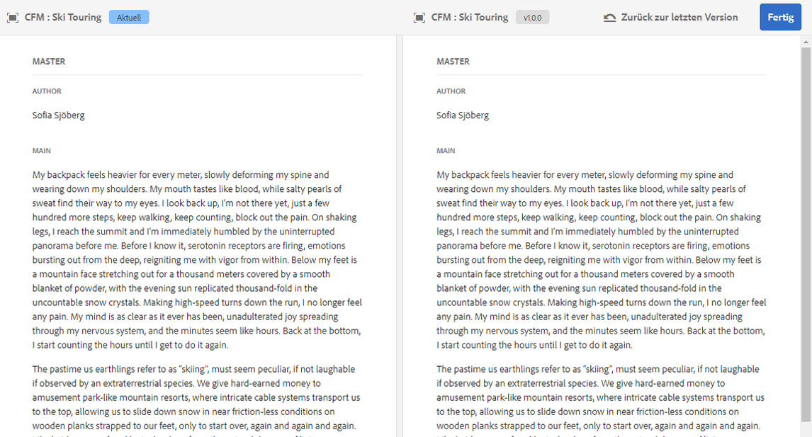

# Verwalten von Inhaltsfragmenten {#managing-content-fragments}

Erfahren Sie, wie Sie mit der Assets-Konsole Ihre AEM-Inhaltsfragmente verwalten können, die die Grundlage für Ihren Headless-Content bilden.

Nachdem Sie Ihre [Inhaltsfragmentmodelle](#creating-a-content-model) definiert haben, können Sie diese verwenden, um [Ihre Inhaltsfragmente](#creating-a-content-fragment) zu erstellen.

Der [Inhaltsfragment-Editor](#opening-the-fragment-editor) bietet verschiedene [Modi](#modes-in-the-content-fragment-editor), die Folgendes ermöglichen:

* [Bearbeiten der Inhalte](#editing-the-content-of-your-fragment) und [Verwalten von Varianten](#creating-and-managing-variations-within-your-fragment)
* [Hinzufügen von Anmerkungen zu Fragmenten](/help/assets/content-fragments/content-fragments-variations.md#annotating-a-content-fragment)
* [Verknüpfen von Inhalten mit Ihrem Fragment](#associating-content-with-your-fragment)
* [Konfigurieren der Metadaten](#viewing-and-editing-the-metadata-properties-of-your-fragment)
* [Strukturbaum anzeigen](/help/assets/content-fragments/content-fragments-structure-tree.md)
* [Anzeigen der JSON-Repräsentation in der Vorschau](/help/assets/content-fragments/content-fragments-json-preview.md)

>[!NOTE]
>
>Inhaltsfragmente können in folgenden Fällen verwendet werden:
>
>* Beim Erstellung von Seiten. Siehe [Seitenbearbeitung mit Inhaltsfragmenten](/help/sites-authoring/content-fragments.md).
>* Für [Headless-Bereitstellung mithilfe von Inhaltsfragmenten mit GraphQL](/help/assets/content-fragments/content-fragments-graphql.md).

>[!NOTE]
>
>Inhaltsfragmente werden als **Assets** gespeichert und daher hauptsächlich über die **Assets-Konsole** verwaltet.

## Erstellen von Inhaltsfragmenten {#creating-content-fragments}

### Erstellen von Inhaltsmodellen {#creating-a-content-model}

[Inhaltsfragmentmodelle](/help/assets/content-fragments/content-fragments-models.md) können vor dem Erstellen von Inhaltsfragmenten mit strukturiertem Inhalt aktiviert und erstellt werden.

### Erstellen eines Inhaltsfragments {#creating-a-content-fragment}

Die Methode zum Erstellen eines Inhaltsfragments ist folgende:

1. Navigieren Sie zum Ordner **Assets**, in dem Sie das Fragment erstellen möchten.
1. Wählen Sie **Erstellen** und danach **Inhaltsfragment** aus, um den Assistenten zu öffnen.
1. Im ersten Schritt des Assistenten müssen Sie die Grundlage des neuen Fragments angeben.

   * [Modell](/help/assets/content-fragments/content-fragments-models.md) – wird verwendet, um ein Fragment zu erstellen, für das strukturierte Inhalte erforderlich sind; beispielsweise das **Abenteuer**-Modell

      * Alle verfügbaren Modelle werden angezeigt.

   Wählen Sie **Weiter** aus, wenn Sie Ihre Auswahl getroffen haben.

   

1. Geben Sie im Schritt **Eigenschaften** Folgendes an:

   * **Allgemein**

      * **Titel**

         Der Titel des Fragments.

         Obligatorisch.

      * **Beschreibung**

      * **Tags**
   * **Erweitert**

      * **Name**

         Der Name, der für die URL verwendet wird.

         Obligatorisch. Wird automatisch aus dem Titel abgeleitet, kann jedoch aktualisiert werden.

1. Wählen Sie **Erstellen** aus, um den Vorgang abzuschließen, und **öffnen** Sie das Fragment zur Bearbeitung oder wechseln Sie über **Fertig** wieder zur Konsole.

   >[!NOTE]
   >Im **Listenmodus** der Konsole können Sie die **Anzeigeeinstellungen** aktualisieren, um die Spalte **Inhaltsfragmentmodell** zu aktivieren.

## Aktionen für ein Inhaltsfragment in der Asset-Konsole {#actions-for-a-content-fragment-assets-console}

In der **Assets-Konsole** können Sie eine Reihe von Aktionen für Ihre Inhaltsfragmente vornehmen, die Sie wie folgt erreichen:

* Über die Symbolleiste – nachdem Sie das Fragment ausgewählt haben, sind alle geeigneten Aktionen verfügbar.
* Als [Schnellaktionen](/help/sites-authoring/basic-handling.md#quick-actions) – ein Teil der Aktionen, die für die individuellen Fragmentkarten verfügbar sind.

Wählen Sie das Fragment aus, um die Symbolleiste mit entsprechenden Aktionen anzuzeigen:

* **Download**

   * Speichern Sie das Fragment als ZIP-Datei. Sie können festlegen, ob die betreffenden Elemente, Varianten und Metadaten enthalten sein sollen.

* **Erstellen**
* **Checkout**
* **Eigenschaften**

   * Ermöglicht das Anzeigen bzw. Bearbeiten der Metadaten des Fragments.

* **Bearbeiten**

   * Hier können Sie [das Fragment zum Bearbeiten des Inhalts](/help/assets/content-fragments/content-fragments-variations.md) zusammen mit seinen Elementen, Varianten, verknüpften Inhalten und Metadaten öffnen.

* **Tags verwalten**
* **Zu Sammlung**
* **Kopieren** (und **einfügen**)
* **Verschieben**
* **Quick Publish**
* **Veröffentlichung verwalten**
* **Löschen**

>[!NOTE]
>
>Viele sind [Standardaktionen für Assets](/help/assets/manage-assets.md) bzw. das [AEM-Desktop-Programm](https://helpx.adobe.com/de/experience-manager/desktop-app/aem-desktop-app.html).

## Öffnen des Fragmenteditors {#opening-the-fragment-editor}

So öffnen Sie ein Fragment zur Bearbeitung:

>[!CAUTION]
>
>Um ein Inhaltsfragment zu bearbeiten, benötigen Sie [die entsprechenden Berechtigungen](/help/sites-developing/customizing-content-fragments.md#asset-permissions). Wenden Sie sich an Ihren Systemadministrator, falls Probleme auftreten.

>[!CAUTION]
>
>Um ein Inhaltsfragment zu bearbeiten, benötigen Sie die entsprechenden Berechtigungen. Wenden Sie sich an Ihren Systemadministrator, falls Probleme auftreten.

1. Navigieren Sie in der Konsole **Assets** zum Speicherort des gewünschten Inhaltsfragments.
1. Öffnen Sie das Fragment zur Bearbeitung. Befolgen Sie dazu einen der folgenden Schritte:

   * Klicken/tippen Sie auf das Fragment oder den Fragment-Link (abhängig von der Konsolenansicht).
   * Wählen Sie das Fragment und anschließend in der Symbolleiste die Option **Bearbeiten** aus.

1. Der Fragment-Editor wird geöffnet. Nehmen Sie die gewünschten Änderungen vor:

   

1. Nachdem Sie Änderungen vorgenommen haben, verwenden Sie **Speichern und schließen**.

<!-- 
1. After making changes, use **Save**, **Save & close** or **Close** as required.

   >[!NOTE]
   >
   >**Save & close** is available via the **Save** dropdown.

   >[!NOTE]
   >
   >Both **Save & Close** and **Close** will exit the editor - see [Save, Close and Versions](#save-close-and-versions) for full information on how the various options operate for content fragments.
-->

## Modi und Aktionen im Inhaltsfragment-Editor {#modes-actions-content-fragment-editor}

Im Inhaltsfragment-Editor stehen verschiedene Modi und Aktionen zur Verfügung.

### Modi im Inhaltsfragment-Editor {#modes-in-the-content-fragment-editor}

Navigieren Sie mit den Symbolen im seitlichen Bedienfeld durch die vier Modi:

* Varianten: [Bearbeiten des Inhalts](#editing-the-content-of-your-fragment) und [Verwalten Ihrer Varianten](#creating-and-managing-variations-within-your-fragment)

* [Anmerkungen](/help/assets/content-fragments/content-fragments-variations.md#annotating-a-content-fragment)
* [Zugehörige Inhalte](#associating-content-with-your-fragment)
* [Metadaten](#viewing-and-editing-the-metadata-properties-of-your-fragment)
* [Strukturbaum](/help/assets/content-fragments/content-fragments-structure-tree.md)
* [Vorschau](/help/assets/content-fragments/content-fragments-json-preview.md)

### Symbolleisten-Aktionen im Inhaltsfragment-Editor {#toolbar-actions-in-the-content-fragment-editor}

Einige Funktionen in der oberen Symbolleiste stehen in mehreren Modi zur Verfügung:

<!-- screenshot changed from original text see commented out below -->

* Es wird eine Benachrichtigung angezeigt, wenn das Fragment bereits auf einer Inhaltsseite referenziert wird. Sie können die Nachricht **schließen**

* Das seitliche Bedienfeld kann über das Symbol **Seitliches Bedienfeld ein/aus** ein- oder ausgeblendet werden.

* Unter dem Fragmentnamen sehen Sie den Namen des [Inhaltsfragmentmodells](/help/assets/content-fragments/content-fragments-models.md), das zum Erstellen des aktuellen Fragments verwendet wurde:

   * Der Name ist auch ein Link, über den der Modell-Editor geöffnet wird.

* Zeigen Sie den Status des Fragments an, zum Beispiel Informationen zum Zeitpunkt der Erstellung, Änderung oder Veröffentlichung.

* **Speichern und schließen**

<!--
Some features in the top toolbar are available from multiple modes:

* A message will be shown when the fragment is already referenced on a content page. You can **Close** the message.

* The side panel can be hidden/shown using the **Toggle Side Panel** icon.

* Underneath the fragment name you can see the name of the [Content Fragment Model](/help/assets/content-fragments/content-fragments-models.md) used for creating the current fragment:

  * The name is also a link that will open the model editor.

* See the status of the fragment; for example, information about when it was created, modified or published. The status is also color-coded:

  * **New**: grey
  * **Draft**: blue
  * **Published**: green
  * **Modified**: orange
  * **Deactivated**: red

* **Save** provides access to the **Save & close** option.
  
* The three dots (**...**) drop-down provides access to additional actions:
  * **Update page references**
    * This updates any page references. 
  * **[Quick publish](#publishing-and-referencing-a-fragment)**
  * **[Manage Publication](#publishing-and-referencing-a-fragment)**
-->

<!--
This updates any page references and ensures that the Dispatcher is flushed as required. -->

<!--
## Save, Close and Versions {#save-close-and-versions}

>[!NOTE]
>
>Versions can also be [created, compared and reverted from the Timeline](/help/assets/content-fragments/content-fragments-managing.md#timeline-for-content-fragments).

The editor has various options:

* **Save** and **Save & close**

  * **Save** will save the latest changes and remain in the editor.
  * **Save & close** will save the latest changes and exit the editor.

  >[!CAUTION]
  >
  >To edit a content fragment you need [the appropriate permissions](/help/sites-developing/customizing-content-fragments.md#asset-permissions). Please contact your system administrator if you are experiencing issues. 

  >[!NOTE]
  >
  >It is possible to remain in the editor, making a series of changes, before saving.

  >[!CAUTION]
  >
  >In addition to simply saving your changes, the actions also update any references and ensures that the Dispatcher is flushed as required. These changes can take time to process. Due to this, there can be a performance impact on a large/complex/heavily-loaded system.
  >
  >Please bear this in mind when using **Save & close** and then quickly re-entering the fragment editor to make and save further changes.

* **Close**

  Will exit the editor without saving the latest changes (i.e made since the last **Save**).

While editing your content fragment AEM automatically creates versions to ensure that prior content can be restored if you cancel your changes (using **Close** without saving):

1. When a content fragment is opened for editing AEM checks for the existence of the cookie-based token that indicates whether an *editing session* exists:

   1. If the token is found, the fragment is considered to be part of the existing editing session.
   2. If the token is *not* available and the user starts editing content, a version is created and a token for this new editing session is sent to the client, where it is saved in a cookie.

2. While there is an *active* editing session, the content being edited is automatically saved every 600 seconds (default).

   >[!NOTE]
   >
   >The auto save interval is configurable using the `/conf` mechanism.
   >
   >Default value, see:
   >&nbsp;&nbsp;`/libs/settings/dam/cfm/jcr:content/autoSaveInterval`

3. If the user cancels the edit, the version created at the start of the editing session is restored and the token is removed to end the editing session.
4. If the user selects to **Save** the edits, the updated elements/variations are persisted and the token is removed to end the editing session.
-->

## Bearbeiten des Inhalts Ihres Fragments {#editing-the-content-of-your-fragment}

Wenn Sie das Fragment geöffnet haben, können Sie die Registerkarte [Varianten](/help/assets/content-fragments/content-fragments-variations.md) verwenden, um Ihren Inhalt zu erstellen.

## Erstellen und Verwalten von Varianten innerhalb Ihres Fragments {#creating-and-managing-variations-within-your-fragment}

Sobald Sie den primären Inhalt erstellt haben, können Sie [Varianten](/help/assets/content-fragments/content-fragments-variations.md) dieses Inhalts erstellen und verwalten.

## Verknüpfen von Inhalt mit Ihrem Fragment {#associating-content-with-your-fragment}

Sie können auch Inhalt mit einem Fragment [verknüpfen](/help/assets/content-fragments/content-fragments-assoc-content.md). So entsteht eine Verbindung, mit der Assets (d. h. Bilder) für ein Fragment verwendet werden können (falls gewünscht), wenn sie zu einer Inhaltsseite hinzugefügt werden.

## Anzeigen und Bearbeiten von Metadaten (Eigenschaften) des Fragments {#viewing-and-editing-the-metadata-properties-of-your-fragment}

Sie können die Eigenschaften eines Fragments über die Registerkarte [Metadaten](/help/assets/content-fragments/content-fragments-metadata.md) anzeigen und bearbeiten.

## Zeitleiste für Inhaltsfragmente {#timeline-for-content-fragments}

Neben den Standardoptionen enthält die [Zeitleiste](/help/assets/manage-assets.md#timeline) Informationen und Aktionen für Inhaltsfragmente.

* Anzeigen von Informationen zu Versionen, Kommentaren und Anmerkungen
* Aktionen für Versionen

   * **[Auf diese Version zurück](#reverting-to-a-version)** (ein vorhandenes Fragment und eine bestimmte Version auswählen)

   * **[Mit aktueller Version vergleichen](#comparing-fragment-versions)** (ein vorhandenes Fragment und eine bestimmte Version auswählen)

   * **Beschriftung** und/oder **Kommentar** hinzufügen (ein vorhandenes Fragment und eine bestimmte Version auswählen)

   * **Als Version speichern** (ein vorhandenes Fragment und dann den Pfeil nach oben am unteren Rand der Zeitleiste auswählen)

* Aktionen für Anmerkungen

   * **Löschen**

>[!NOTE]
>
>Kommentare sind:
>
>* Standardfunktionen für alle Assets
>* In der Zeitleiste erstellt worden
>* Mit dem Fragment-Asset verbunden

>
>Anmerkungen (für Inhaltsfragmente) sind:
>
>* Im Fragmenteditor eingegeben worden
>* Spezifisch für ein ausgewähltes Textsegment innerhalb des Fragments

>

Beispiel:

## Vergleichen von Fragment-Versionen {#comparing-fragment-versions}

Die Aktion **Mit aktueller Version vergleichen** ist in der [Zeitleiste](/help/assets/content-fragments/content-fragments-managing.md#timeline-for-content-fragments) verfügbar, sobald Sie eine bestimmte Version ausgewählt haben.

Folgendes wird geöffnet:

* die **aktuelle** (neueste) Version (links)

* die ausgewählte Version **v&lt;*x.y*>** (rechts)

Sie werden nebeneinander angezeigt, wobei:

* Unterschiede werden hervorgehoben

   * Gelöschter Text: Rot
   * Eingefügter Text: Grün
   * Ersetzter Text: Blau

* Über das Vollbildsymbol können Sie jede Version separat öffnen. Wechseln Sie dann wieder zur parallelen Ansicht.
* Sie können die jeweilige Version **wiederherstellen**.
* Über **Fertig** kehren Sie zur Konsole zurück.

>[!NOTE]
>
>Sie können den Fragmentinhalt nicht bearbeiten, während Sie Fragmente vergleichen.

## Wiederherstellen einer früheren Version   {#reverting-to-a-version}

Sie können eine frühere Version wiederherstellen.

* Direkt über die [Zeitleiste](/help/assets/content-fragments/content-fragments-managing.md#timeline-for-content-fragments).

   Wählen Sie die gewünschte Version und dann die Aktion **Auf diese Version zurück** aus.

* Beim [Vergleichen einer Version mit der aktuellen Version](/help/assets/content-fragments/content-fragments-managing.md#comparing-fragment-versions) können Sie die ausgewählte Version **wiederherstellen**.

## Veröffentlichen und Referenzieren von Fragmenten {#publishing-and-referencing-a-fragment}

>[!CAUTION]
>
>Wenn das Fragment auf einem Modell basiert, sollten Sie sicherstellen, dass das [Modell veröffentlicht wurde](/help/assets/content-fragments/content-fragments-models.md#publishing-a-content-fragment-model).
>
>Wenn Sie Inhaltsfragmente veröffentlichen, deren Modell noch nicht veröffentlicht wurde, wird dies in der Auswahlliste angezeigt und das Modell wird mit dem Fragment veröffentlicht.

Inhaltsfragmente müssen veröffentlicht werden, um in der Veröffentlichungsumgebung genutzt werden zu können. Sie können folgendermaßen veröffentlicht werden:

* Nach der Erstellung; Verwenden von [Aktionen, die in der Assets-Konsole verfügbar sind](#actions-for-a-content-fragment-assets-console).
* Im [Inhaltsfragment-Editor](#toolbar-actions-in-the-content-fragment-editor)
* Wenn Sie [eine Seite veröffentlichen, in der das Fragment verwendet wird](/help/sites-authoring/content-fragments.md#publishing), wird das Fragment in den Seitenverweisen aufgeführt.

>[!CAUTION]
>
>Nachdem ein Fragment veröffentlicht und/oder referenziert wurde, zeigt AEM eine Warnmeldung an, wenn ein Autor das Fragment erneut zur Bearbeitung öffnet. Dies dient als Hinweis darauf, dass am Fragment vorgenommene Änderungen sich auch auf die referenzierten Seiten auswirken.

## Löschen von Fragmenten {#deleting-a-fragment}

So löschen Sie ein Fragment:

1. Navigieren Sie in der Konsole **Assets** zum Speicherort des Inhaltsfragments.
2. Wählen Sie das Fragment aus.

   >[!NOTE]
   >
   >Die Aktion **Löschen** ist nicht als Schnellzugriff verfügbar.

3. Wählen Sie **Löschen** in der Symbolleiste aus.
4. Bestätigen Sie die **Löschaktion**.

   >[!CAUTION]
   >
   >Wenn das Fragment bereits in einer Seite referenziert wird, werden Sie in einer Warnung zur Bestätigung des **erzwungenen Löschens** aufgefordert. Das Fragment wird zusammen mit seiner Inhaltsfragmentkomponente aus allen Inhaltsseiten gelöscht.
