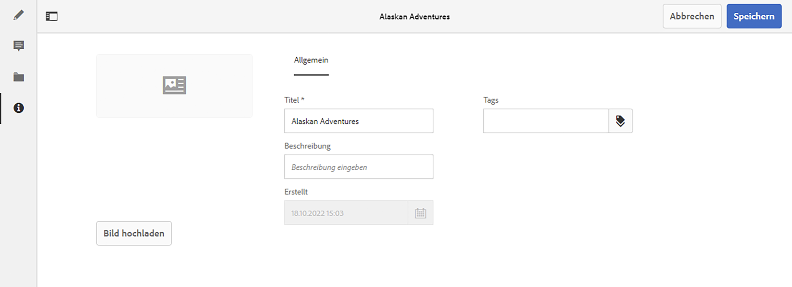

# Metadaten – Fragmenteigenschaften {#metadata-fragment-properties}

Erfahren Sie, wie Sie die Metadateneigenschaften für Inhaltsfragmente in AEM anzeigen und bearbeiten können, um Ihren Headless-Content anzupassen.

## Bearbeiten von Eigenschaften/Metadaten {#editing-properties-meta-data}

Sie können die Metadaten (Eigenschaften) für das Inhaltsfragment anzeigen und bearbeiten:

1. Navigieren Sie in der Konsole **Assets** zum Speicherort des Inhaltsfragments.
2. Führen Sie einen der folgenden Schritte durch:

   * Wählen Sie [**Eigenschaften anzeigen** aus, um das Dialogfeld zu öffnen](/help/assets/manage-assets.md#editing-properties). Sobald es zur Anzeige geöffnet wurde, können Sie auch Bearbeitungen vornehmen.
   * Öffnen Sie das Inhaltsfragment zum Bearbeiten und wählen Sie anschließend im seitlichen Bedienfeld **Metadaten** aus.

   

3. Auf der Registerkarte **Allgemein** können Sie die folgenden Optionen anzeigen oder bearbeiten:

   * Miniaturansicht, für die Sie ein **Bild hochladen** können
   * **Inhaltsfragmentmodell**, womit das zum Erstellen des aktuellen Fragments verwendete Modell angegeben wird
   * **Titel**
   * **Beschreibung**
   * **Tags**
      *  Tags sind besonders leistungsstark bei der Organisation Ihrer Fragmente, da sie für die Inhaltsklassifizierung und Taxonomie verwendet werden können. Tags können zum Suchen von Inhalten (nach Tags) und zum Anwenden von Massenvorgängen verwendet werden.
Beispielsweise können Sie relevante Fragmente als &quot;Weihnachtsstart&quot;taggen, um nur diese als Teilmenge durchsuchen zu können oder sie für einen anderen zukünftigen Launch in einen neuen Ordner zu kopieren.
   * Erstellt (nur Anzeige)
   
