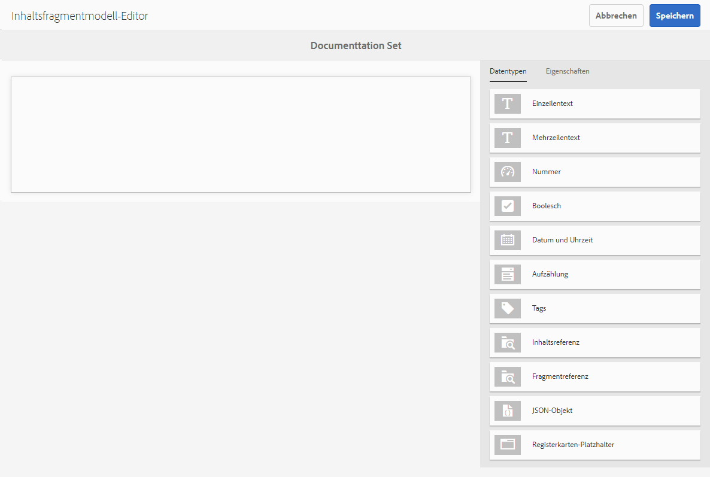

# Inhaltsfragmentmodelle {#content-fragment-models}

Inhaltsfragmentmodelle in AEM definieren die Inhaltsstruktur für Ihre [Inhaltsfragmente](/help/assets/content-fragments/content-fragments.md), die als Grundlage für Ihren Headless-Content dienen.

Um Inhaltsfragmentmodelle zu verwenden, haben Sie folgende Möglichkeiten:

1. [Aktivieren Sie die Funktionalität des Inhaltsfragmentmodells für Ihre Instanz](/help/assets/content-fragments/content-fragments-configuration-browser.md).
1. [Erstellen](#creating-a-content-fragment-model) und [Konfigurieren](#defining-your-content-fragment-model) Ihrer Inhaltsfragmentmodelle.
1. [Aktivieren Ihrer Inhaltsfragmentmodelle](#enabling-disabling-a-content-fragment-model) zur Verwendung beim Erstellen von Inhaltsfragmenten.
1. [Lassen Sie Ihre Inhaltsfragmentmodelle in den erforderlichen Asset-Ordnern zu](#allowing-content-fragment-models-assets-folder), indem Sie **Richtlinien** konfigurieren.

## Erstellen eines Inhaltsfragmentmodells {#creating-a-content-fragment-model}

1. Navigieren Sie zu **Tools** > **Assets** und öffnen Sie dann **Inhaltsfragmentmodelle**.
1. Navigieren Sie zu dem Ordner, der Ihrer [Konfiguration](/help/assets/content-fragments/content-fragments-configuration-browser.md).
1. Verwendung **Erstellen** , um den Assistenten zu öffnen.

   >[!CAUTION]
   >
   >Wenn die Variable [Verwendung von Inhaltsfragmentmodellen wurde nicht aktiviert](/help/assets/content-fragments/content-fragments-configuration-browser.md), die **Erstellen** ist nicht verfügbar.

1. Geben Sie den **Modell-Titel** an. Sie können auch **Tags**, a **Beschreibung** und wählen Sie **Modell aktivieren** nach [das Modell aktivieren](#enabling-disabling-a-content-fragment-model) falls erforderlich.

   

1. Verwendung **Erstellen** , um das leere Modell zu speichern. Eine Meldung weist auf den Erfolg der Aktion hin. Sie können **Öffnen** das Modell sofort bearbeiten oder **Fertig** , um zur Konsole zurückzukehren.

## Definieren des Inhaltsfragmentmodells {#defining-your-content-fragment-model}

Das Inhaltsfragmentmodell definiert effektiv die Struktur der resultierenden Inhaltsfragmente unter Verwendung unterschiedlicher **[Datentypen](#data-types)**. Mithilfe des Modell-Editors können Sie Instanzen der Datentypen hinzufügen und diese dann so konfigurieren, dass die erforderlichen Felder erstellt werden:

>[!CAUTION]
>
>Die Bearbeitung eines vorhandenen Inhaltsfragmentmodells kann sich auf abhängige Fragmente auswirken.

1. Navigieren Sie zu **Tools** > **Assets** und öffnen Sie dann **Inhaltsfragmentmodelle**.

1. Navigieren Sie zu dem Ordner, der Ihr Inhaltsfragmentmodell enthält.

1. Öffnen Sie das zu **bearbeitende** Modell; nutzen Sie dazu entweder die entsprechende Schnellaktion oder wählen Sie das Modell und anschließend die Aktion aus der Symbolleiste aus.

   Nach dem Öffnen zeigt der Modell-Editor Folgendes an:

   * left: Felder bereits definiert
   * Rechts: verfügbare **Datentypen** für das Erstellen von Feldern (und **Eigenschaften**, die für erstellte Felder verwendet werden können)

   >[!NOTE]
   >
   >Wenn ein Feld als **Erforderlich**, die **Titel** im linken Bereich mit einem Sternchen (**&#42;**).

   

1. **So fügen Sie ein Feld hinzu**

   * Ziehen Sie einen erforderlichen Datentyp an die entsprechende Stelle für ein Feld:

     

   * Nachdem dem Modell ein Feld hinzugefügt wurde, zeigt das rechte Bedienfeld die **Eigenschaften** , die für diesen Datentyp definiert werden können. Hier können Sie festlegen, was für dieses Feld erforderlich ist.

      * Viele Eigenschaften sind selbsterklärend. Weitere Informationen finden Sie unter [Eigenschaften](#properties).
      * Typisierung **Feldbezeichnung** schließt automatisch die **Eigenschaftsname**  - wenn leer, und kann danach manuell aktualisiert werden.

        >[!CAUTION]
        >
        >Beim manuellen Aktualisieren der Eigenschaft **Eigenschaftsname** für einen Datentyp dürfen Namen nur A-Z, a-z, 0-9 und den Unterstrich &quot;_&quot;als Sonderzeichen enthalten.
        >
        >Wenn in früheren Versionen von AEM erstellte Modelle unzulässige Zeichen enthalten, entfernen oder aktualisieren Sie diese Zeichen.

     Beispiel:

     

1. **So entfernen Sie ein Feld**

   Wählen Sie das entsprechende Feld aus und klicken/tippen Sie auf das Papierkorb-Symbol. Sie werden aufgefordert, die Aktion zu bestätigen.

   

1. Fügen Sie alle erforderlichen Felder hinzu und definieren Sie die zugehörigen Eigenschaften nach Bedarf. Beispiel:

   

1. Wählen Sie **Speichern**, um die Definition beizubehalten.

## Datentypen {#data-types}

Zum Definieren Ihres Modells stehen unterschiedliche Datentypen zur Verfügung:

* **Einzeilentext**
   * Fügen Sie ein oder mehrere Felder mit einer einzelnen Textzeile hinzu. Die maximale Länge kann festgelegt werden.
* **Mehrzeilentext**
   * Ein Textbereich, der Rich-Text, Klartext oder Markdown sein kann
* **Zahl**
   * Fügen Sie ein oder mehrere numerische Felder hinzu.
* **Boolesch**
   * Fügen Sie ein boolesches Kontrollkästchen hinzu.
* **Datum und Uhrzeit**
   * Fügen Sie ein Datum und/oder eine Uhrzeit hinzu.
* **Aufzählung**
   * Hinzufügen von Kontrollkästchen, Optionsfeldern oder Dropdown-Feldern
* **Tags**
   * Ermöglicht Fragmentautoren den Zugriff auf und die Auswahl von Tag-Bereichen.
* **Inhaltsreferenz**
   * Verweist auf andere Inhalte jeden Typs. Kann zum [Erstellen verschachtelter Inhalte](#using-references-to-form-nested-content) verwendet werden.
   * Wenn ein Bild referenziert wird, kann wahlweise eine Miniatur angezeigt werden.
* **Fragmentreferenz**
   * Verweist auf andere Inhaltsfragmente. Kann zum [Erstellen verschachtelter Inhalte](#using-references-to-form-nested-content) verwendet werden.
   * Der Datentyp kann so konfiguriert werden, dass Fragmentautoren folgende Möglichkeiten haben:
      * Direktes Bearbeiten des referenzierten Fragments
      * Erstellen eines Inhaltsfragments basierend auf dem entsprechenden Modell
* **JSON-Objekt**
   * Ermöglicht es dem Autor des Inhaltsfragments, JSON-Syntax in die entsprechenden Elemente eines Fragments einzugeben.
      * Damit AEM direkte JSON speichern kann, die Sie kopiert und von einem anderen Dienst eingefügt haben.
      * Die JSON-Datei wird in GraphQL als JSON-Datei übergeben und ausgegeben.
      * Enthält JSON-Syntaxhervorhebung, automatische Vervollständigung und Fehlerhervorhebung im Inhaltsfragment-Editor.
* **Registerkarten-Platzhalter**
   * Ermöglicht die Einführung von Registerkarten zur Bearbeitung des Inhalts von Inhaltsfragmenten.
Dies wird als Trennzeichen im Modell-Editor angezeigt, der Abschnitte der Liste der Inhaltsdatentypen trennt. Jede Instanz stellt den Beginn einer neuen Registerkarte dar.
Im Fragment-Editor wird jede Instanz als Registerkarte angezeigt.

     >[!NOTE]
     >
     >Dieser Datentyp dient ausschließlich zur Formatierung und wird vom GraphQL-Schema von AEM ignoriert.

## Eigenschaften {#properties}

Viele Eigenschaften sind selbsterklärend. Im Folgenden finden Sie weitere Informationen zu bestimmten Eigenschaften:


* **Eigenschaftsname**

  Beim manuellen Aktualisieren dieser Eigenschaft für einen Datentyp werden die Namen **must** contain *only* A-Z, a-z, 0-9 und der Unterstrich &quot;_&quot;als Sonderzeichen.

  >[!CAUTION]
  >
  >Wenn in früheren Versionen von AEM erstellte Modelle unzulässige Zeichen enthalten, entfernen oder aktualisieren Sie diese Zeichen.

* **Rendern als**
Die verschiedenen Möglichkeiten, das Feld in einem Fragment zu erstellen/zu rendern. Auf diese Weise können Sie häufig definieren, ob der Autor eine einzelne Instanz des Felds sieht oder ob es möglich ist, mehrere Instanzen zu erstellen.

* **Feldbezeichnung**
Eingabe einer **Feldbezeichnung** automatisch generiert eine **Eigenschaftsname**, die dann bei Bedarf manuell aktualisiert werden kann.

* **Validierung**
Die grundlegende Basic ist mittels Mechanismen wie etwa die Eigenschaft **Erforderlich** verfügbar. Einige Datentypen verfügen über zusätzliche Validierungsfelder. Weitere Informationen finden Sie unter [Validierung](#validation).

* Beim Datentyp **Mehrzeilentext** können Sie den **Standardtyp** folgendermaßen definieren:

   * **Rich-Text**
   * **Markdown**
   * **Nur Text**

  Wenn Sie keinen Typ angeben, wird der Standardwert **Rich-Text** in diesem Feld verwendet.

  Ändern der **Standardtyp** in einem Inhaltsfragmentmodell wird nur auf ein vorhandenes, verwandtes Inhaltsfragment wirksam, nachdem dieses Fragment im Editor geöffnet und gespeichert wurde.

* **Eindeutiger**
Content (für das spezifische Feld) muss für alle Inhaltsfragmente, die anhand des aktuellen Modells erstellt werden, eindeutig sein.

  Dadurch wird sichergestellt, dass Inhaltsersteller Content, der bereits einem anderen Fragment desselben Modells hinzugefügt wurde, nicht wiederholen können.

  Beispielsweise kann ein **einzeiliges Textfeld** mit dem Namen `Country` im Inhaltsfragmentmodell nicht den Wert `Japan` in zwei abhängigen Inhaltsfragmenten haben. Wenn die zweite Instanz versucht wird, wird eine Warnung angezeigt.

  >[!NOTE]
  >
  >Die Eindeutigkeit wird pro Sprachstamm gewährleistet.

  >[!NOTE]
  >
  >Varianten können denselben *eindeutigen* Wert haben wie Varianten desselben Fragments, jedoch nicht denselben Wert wie Varianten anderer Fragmente.

* Weitere Informationen zu diesem bestimmten Datentyp und seinen Eigenschaften finden Sie unter **[Inhaltsreferenz](#content-reference)**.

* Weitere Informationen zu diesem bestimmten Datentyp und seinen Eigenschaften finden Sie unter **[Fragmentreferenz (verschachtelte Fragmente)](#fragment-reference-nested-fragments)**.

<!--
* **Translatable**
  Checking the **Translatable** checkbox on a field in the Content Fragment Model editor does the following:

  * Ensures that the field's property name is added to the translation configuration, context `/content/dam/<sites-configuration>`, if not already present. 
  * For GraphQL: sets a `<translatable>` property on the Content Fragment field to `yes`, to allow GraphQL query filter for JSON output with only translatable content.
-->

## Validierung {#validation}

Verschiedene Datentypen bieten jetzt die Möglichkeit, Validierungsanforderungen für den Zeitpunkt zu definieren, an dem Inhalt in das resultierende Fragment eingefügt wird:

* **Einzeilentext**
   * Führen Sie einen Vergleich mit einem vordefinierten Regex durch.
* **Zahl**
   * Suchen Sie nach bestimmten Werten.
* **Inhaltsreferenz**
   * Testen Sie, ob bestimmte Content-Typen vorhanden sind.
   * Es können nur Assets bis zur angegebenen maximalen Dateigröße referenziert werden.
   * Es können nur Bilder in einem vordefinierten Bereich von Breite und/oder Höhe (in Pixel) referenziert werden.
* **Fragmentreferenz**
   * Testen Sie, ob ein bestimmtes Inhaltsfragmentmodell vorhanden ist.

## Verwenden von Verweisen, um verschachtelten Inhalt zu bilden {#using-references-to-form-nested-content}

Inhaltsfragmente können mit einem der folgenden Datentypen verschachtelte Inhalte bilden:

* **[Inhaltsreferenz](#content-reference)**
   * Bietet einen einfachen Verweis auf anderen Content jedes Typs.
   * Sie kann für einen oder mehrere Verweise (im resultierenden Fragment) konfiguriert werden.

* **[Fragmentreferenz](#fragment-reference-nested-fragments)** (verschachtelte Fragmente)
   * Verweist auf andere Fragmente, abhängig von den angegebenen Modellen.
   * Ermöglicht das Einschließen/Abrufen strukturierter Daten.

     >[!NOTE]
     >
     >Diese Methode ist für [Headless-Content-Bereitstellung mit Inhaltsfragmenten mit GraphQL](/help/assets/content-fragments/content-fragments-graphql.md).
   * Sie kann für einen oder mehrere Verweise (im resultierenden Fragment) konfiguriert werden.

>[!NOTE]
>
>AEM bietet einen Wiederholungsschutz für:
>
>* Inhaltsreferenzen
>  Verhindert, dass der Benutzer dem aktuellen Fragment einen Verweis hinzufügt. Dies kann zu einem leeren Dialogfeld für die Auswahl von Fragmentreferenzen führen.
>
>* Fragmentverweise in GraphQL
>  Wenn Sie eine Deep-Abfrage erstellen, die mehrere Inhaltsfragmente zurückgibt, auf die sich gegenseitig verweisen, wird beim ersten Auftreten null zurückgegeben.

### Inhaltsreferenz {#content-reference}

Mit der Inhaltsreferenz können Sie Inhalte aus einer anderen Quelle rendern, z. B. aus einem Bild oder einem Inhaltsfragment.

Zusätzlich zu den Standardeigenschaften können Sie Folgendes angeben:

* Den **Stammpfad** für referenzierte Inhalte
* Die Inhaltstypen, auf die verwiesen werden kann
* Einschränkungen bezüglich der Dateigrößen
* Wenn ein Bild referenziert wird:
   * Miniatur anzeigen
   * Bildeinschränkungen hinsichtlich Höhe und Breite


### Fragmentreferenz (verschachtelte Fragmente) {#fragment-reference-nested-fragments}

Die Fragmentreferenz verweist auf mindestens ein Inhaltsfragment. Diese Funktion ist besonders beim Abrufen von Inhalten für die Verwendung in Ihrer App interessant, da Sie damit strukturierte Daten mit mehreren Ebenen abrufen können.

Beispiel:

* Ein Modell, das Details für einen Mitarbeiter definiert, beispielsweise:
   * Ein Verweis auf das Modell, das den Arbeitgeber definiert (Firma)

```xml
type EmployeeModel {
    name: String
    firstName: String
    company: CompanyModel
}

type CompanyModel {
    name: String
    street: String
    city: String
}
```

>[!NOTE]
>
>Dies ist von besonderem Interesse für [Headless-Content-Bereitstellung mit Inhaltsfragmenten mit GraphQL](/help/assets/content-fragments/content-fragments-graphql.md).

Zusätzlich zu den Standardeigenschaften können Sie Folgendes definieren:

* **Rendern als**:

   * **multifield**: Der Fragmentautor kann mehrere einzelne Verweise erstellen.

   * **fragmentreference**: Der Fragmentautor kann einen einzelnen Verweis auf ein Fragment auswählen.

* **Modelltyp**
Es können mehrere Modelle ausgewählt werden. Beim Erstellen des Inhaltsfragments müssen alle referenzierten Fragmente mit diesen Modellen erstellt worden sein.

* **Stammpfad**
Gibt einen Stammpfad für referenzierte Fragmente an.

* **Fragmenterstellung zulassen**

  Dadurch kann der Fragmentautor ein Fragment basierend auf dem entsprechenden Modell erstellen.

   * **fragmentreferencecomposite**: Ermöglicht dem Fragmentautor das Erstellen einer Composite-Datei durch Auswahl mehrerer Fragmente.

  

>[!NOTE]
>
>Es gibt einen Mechanismus zum Wiederholungsschutz. Dieser verhindert, dass Benutzer in der Fragmentreferenz das aktuelle Inhaltsfragment auswählen. Dies kann zu einem leeren Dialogfeld für die Auswahl von Fragmentreferenzen führen.
>
>Es gibt auch einen Wiederholungsschutz für Fragmentreferenzen in GraphQL. Wenn Sie eine tiefe Abfrage über zwei Inhaltsfragmente erstellen, die sich gegenseitig referenzieren, wird null zurückgegeben.

## Aktivieren oder Deaktivieren von Inhaltsfragmentmodellen {#enabling-disabling-a-content-fragment-model}

Um die volle Kontrolle über die Verwendung Ihrer Inhaltsfragmentmodelle zu erhalten, haben sie einen Status, den Sie festlegen können.

### Aktivieren eines Inhaltsfragmentmodells {#enabling-a-content-fragment-model}

Nachdem ein Modell erstellt wurde, muss es aktiviert werden, damit:

* Sie können beim Erstellen eines Inhaltsfragments ausgewählt werden.
* Sie kann in einem Inhaltsfragmentmodell referenziert werden.
* Sie ist für GraphQL verfügbar, sodass das Schema generiert wird.

So aktivieren Sie ein Modell, das folgendermaßen gekennzeichnet ist:

* **Entwurf**: neu (noch nie aktiviert).
* **Behinderte** : wurde deaktiviert.

Sie können die **Aktivieren** -Option entweder:

* Die obere Symbolleiste, wenn das erforderliche Modell ausgewählt ist.
* Die entsprechende Schnellaktion (bewegen Sie den Mauszeiger über das entsprechende Modell).


### Deaktivieren eines Inhaltsfragmentmodells {#disabling-a-content-fragment-model}

Ein Modell lässt sich auch aus folgenden Gründen deaktivieren:

* Das Modell ist nicht mehr als Grundlage für die Erstellung *neuer* Inhaltsfragmente verfügbar.
* Beachten Sie jedoch Folgendes:
   * Das GraphQL-Schema wird weiterhin generiert und kann weiterhin abgefragt werden (um Auswirkungen auf die JSON-API zu vermeiden).
   * Inhaltsfragmente, die auf dem Modell basieren, können weiterhin abgefragt und vom GraphQL-Endpunkt zurückgegeben werden.
* Das Modell kann nicht mehr referenziert werden. Vorhandene Referenzen bleiben jedoch unverändert und können weiterhin abgefragt und vom GraphQL-Endpunkt zurückgegeben werden.

So deaktivieren Sie ein Modell, das als **Aktiviert**, verwenden Sie die **Deaktivieren** -Option entweder:

* Die obere Symbolleiste, wenn das erforderliche Modell ausgewählt ist.
* Die entsprechende Schnellaktion (bewegen Sie den Mauszeiger über das entsprechende Modell).


## Zulassen von Inhaltsfragmentmodellen im Asset-Ordner {#allowing-content-fragment-models-assets-folder}

Um Content Governance zu implementieren, können Sie **Richtlinien** in einem Ordner &quot;Assets&quot;, um zu steuern, welche Inhaltsfragmentmodelle für die Fragmenterstellung in diesem Ordner zulässig sind.

>[!NOTE]
>
>Der Mechanismus ähnelt dem [Zulassen von Seitenvorlagen](/help/sites-authoring/templates.md#allowing-a-template-author) für eine Seite und deren untergeordnete Elemente in den erweiterten Eigenschaften einer Seite.

So konfigurieren Sie die **Richtlinien** für **Zulässige Inhaltsfragmentmodelle**:

1. Navigieren Sie zum gewünschten Asset-Ordner und öffnen Sie **Eigenschaften**.

1. Öffnen Sie die Registerkarte **Richtlinien**, in der Sie Folgendes konfigurieren können:

   * **Vererbt von`<folder>`**

     Richtlinien werden beim Erstellen von untergeordneten Ordnern automatisch vererbt. Die Richtlinie kann neu konfiguriert werden (und die Vererbung ist unterbrochen), wenn Unterordner Modelle zulassen müssen, die sich vom übergeordneten Ordner unterscheiden.

   * **Zugelassene Inhaltsfragmentmodelle nach Pfad**

     Es können mehrere Modelle zugelassen werden.

   * **Zugelassene Inhaltsfragmentmodelle nach Tag**

     Es können mehrere Modelle zugelassen werden.

   

1. **Speichern** Sie die Änderungen.

Die für einen Ordner zulässigen Inhaltsfragmentmodelle werden wie folgt aufgelöst:

* Die **Richtlinien** für **Zulässige Inhaltsfragmentmodelle**.
* Falls leer, versuchen Sie, die Richtlinie mithilfe der Vererbungsregeln zu bestimmen.
* Wenn die Vererbungskette kein Ergebnis liefert, prüfen Sie die **Cloud Services**-Konfiguration für diesen Ordner (auch zuerst direkt und dann über Vererbung).
* Wenn keines der oben genannten Verfahren Ergebnisse liefert, gibt es keine zulässigen Modelle für diesen Ordner.

## Löschen eines Inhaltsfragmentmodells {#deleting-a-content-fragment-model}

>[!CAUTION]
>
>Das Löschen eines Inhaltsfragmentmodells kann sich auf abhängige Fragmente auswirken.

So löschen Sie ein Inhaltsfragmentmodell:

1. Navigieren Sie zu **Tools** > **Assets** und öffnen Sie dann **Inhaltsfragmentmodelle**.

1. Navigieren Sie zu dem Ordner, der Ihr Inhaltsfragmentmodell enthält.
1. Wählen Sie Ihr Modell und anschließend die Option **Löschen** aus der Symbolleiste aus.

   >[!NOTE]
   >
   >Wenn auf das Modell verwiesen wird, wird eine Warnung angezeigt. Ergreifen Sie geeignete Maßnahmen.

## Veröffentlichen eines Inhaltsfragmentmodells {#publishing-a-content-fragment-model}

Inhaltsfragmentmodelle müssen veröffentlicht werden, wenn/bevor abhängige Inhaltsfragmente veröffentlicht werden.

So veröffentlichen Sie ein Inhaltsfragmentmodell:

1. Navigieren Sie zu **Tools** > **Assets** und öffnen Sie dann **Inhaltsfragmentmodelle**.

1. Navigieren Sie zu dem Ordner, der Ihr Inhaltsfragmentmodell enthält.
1. Wählen Sie Ihr Modell und anschließen die Option **Veröffentlichen** aus der Symbolleiste aus.
Der veröffentlichte Status wird in der Konsole angezeigt.

   >[!NOTE]
   >
   >Wenn Sie ein Inhaltsfragment veröffentlichen, für das das Modell noch nicht veröffentlicht wurde, wird dies in einer Auswahlliste angezeigt und das Modell wird mit dem Fragment veröffentlicht.

## Rückgängigmachen der Veröffentlichung eines Inhaltsfragmentmodells {#unpublishing-a-content-fragment-model}

Die Veröffentlichung von Inhaltsfragmentmodellen kann rückgängig gemacht werden, wenn sie nicht von Fragmenten referenziert werden.

So machen Sie die Veröffentlichung eines Inhaltsfragmentmodells rückgängig:

1. Navigieren Sie zu **Tools** > **Assets** und öffnen Sie dann **Inhaltsfragmentmodelle**.

1. Navigieren Sie zu dem Ordner, der Ihr Inhaltsfragmentmodell enthält.
1. Wählen Sie Ihr Modell und anschließen die Option **Veröffentlichung aufheben** aus der Symbolleiste aus.
Der veröffentlichte Status wird in der Konsole angezeigt.

## Inhaltsfragmentmodell – Eigenschaften {#content-fragment-model-properties}

Sie können die **Eigenschaften** eines Inhaltsfragmentmodells bearbeiten:

* **Allgemein**
   * **Modell-Titel**
   * **Tags**
   * **Beschreibung**
   * **Bild hochladen**
