# Erstellen von Übersetzungsprojekten für Inhaltsfragmente {#creating-translation-projects-for-content-fragments}

Zusätzlich zu Assets unterstützt Adobe Experience Manager (AEM) Assets Sprachkopie-Workflows für [Inhaltsfragmente](/help/assets/content-fragments/content-fragments.md) (einschließlich Varianten). Um Sprachkopie-Workflows auf Inhaltsfragmenten auszuführen, ist keine zusätzliche Optimierung erforderlich. In jedem Workflow wird das gesamte Inhaltsfragment zur Übersetzung gesendet.

Die Typen von Workflows, die Sie für Inhaltsfragmente ausführen können, ähneln den Workflow-Typen, die Sie für Assets ausführen. Außerdem stimmen die in den einzelnen Workflow-Typen verfügbaren Optionen mit den Optionen überein, die unter den entsprechenden Workflow-Typen für Assets verfügbar sind.

Sie können die folgenden Arten von Sprachkopie-Workflows für Inhaltsfragmente ausführen:

**Erstellen und übersetzen**

In diesem Workflow werden zu übersetzende Inhaltsfragmente in den Sprachstamm der Sprache kopiert, in die Sie übersetzen möchten. Darüber hinaus wird, abhängig von den gewählten Optionen, ein Übersetzungsprojekt für die Inhaltsfragmente in der Projektekonsole erstellt. Abhängig von den Einstellungen kann das Übersetzungsprojekt manuell gestartet oder automatisch ausgeführt werden, sobald das Übersetzungsprojekt erstellt wurde.

**Aktualisieren von Sprachkopien**

Wenn das Quellinhaltsfragment aktualisiert oder geändert wird, muss das entsprechende Gebietsschema/das sprachspezifische Inhaltsfragment erneut übersetzt werden. Der Workflow Sprachkopien aktualisieren übersetzt eine zusätzliche Gruppe von Inhaltsfragmenten und fügt sie in eine Sprachkopie für ein bestimmtes Gebietsschema ein. In diesem Fall werden die übersetzten Inhaltsfragmente zum Zielordner hinzugefügt, der bereits zuvor übersetzte Inhaltsfragmente enthält.

## Workflow für das Erstellen und Übersetzen {#create-and-translate-workflow}

Der Workflow Erstellen und Übersetzen umfasst die folgenden Optionen. Die mit der jeweiligen Option verbundenen Verfahrensschritte ähneln denen, die mit der entsprechenden Option für Assets verbunden sind.

* Nur Struktur erstellen: Verfahrensschritte finden Sie unter [Erstellen einer Struktur nur für Assets](translation-projects.md#create-structure-only).
* Erstellen eines neuen Übersetzungsprojekts: Verfahrensschritte finden Sie unter [Erstellen eines neuen Übersetzungsprojekts für Assets](translation-projects.md#create-a-new-translation-project).
* Hinzufügen zu vorhandenem Übersetzungsprojekt: Verfahrensschritte finden Sie unter [Hinzufügen zu einem vorhandenen Übersetzungsprojekt für Assets](translation-projects.md#add-to-existing-translation-project).

## Workflow &quot;Sprachkopien aktualisieren&quot; {#update-language-copies-workflow}

Der Workflow zum Aktualisieren der Sprachkopien umfasst die folgenden Optionen. Die mit der jeweiligen Option verbundenen Verfahrensschritte ähneln denen, die mit der entsprechenden Option für Assets verbunden sind.

* Erstellen eines neuen Übersetzungsprojekts: Verfahrensschritte finden Sie unter [Erstellen eines neuen Übersetzungsprojekts für Assets](translation-projects.md#create-a-new-translation-project) (Update-Workflow).
* Hinzufügen zu vorhandenem Übersetzungsprojekt: Verfahrensschritte finden Sie unter [Hinzufügen zu einem vorhandenen Übersetzungsprojekt für Assets](translation-projects.md#add-to-existing-translation-project) (Update-) Workflow.

Sie können auch temporäre Sprachkopien für Fragmente erstellen, ähnlich wie Sie temporäre Kopien für Assets erstellen. Weitere Informationen finden Sie unter [Erstellen temporärer Sprachkopien für Assets](translation-projects.md#creating-temporary-language-copies).

## Übersetzen von Fragmenten mit gemischten Medien {#translating-mixed-media-fragments}

Mit AEM können Sie Inhaltsfragmente übersetzen, die verschiedene Arten von Medien-Assets und Sammlungen enthalten. Wenn Sie ein Inhaltsfragment übersetzen, das Inline-Assets enthält, werden die übersetzten Kopien dieser Assets im Zielsprachenstamm gespeichert.

Wenn das Inhaltsfragment eine Sammlung enthält, werden die Assets in der Sammlung zusammen mit dem Inhaltsfragment übersetzt. Die übersetzten Kopien der Assets werden im entsprechenden Zielsprachenstamm an einem Speicherort gespeichert, der dem physischen Speicherort der Quell-Assets unter dem Ausgangssprachenstamm entspricht.

Um Inhaltsfragmente, die gemischte Medien enthalten, übersetzen zu können, bearbeiten Sie zunächst das standardmäßige Übersetzungs-Framework, um die Übersetzung von Inline-Assets und Sammlungen zu ermöglichen, die mit Inhaltsfragmenten verknüpft sind.

1. Klicken oder tippen Sie auf das AEM-Logo und navigieren Sie zu **[!UICONTROL Tools > Bereitstellung > Cloud Services]**.
1. Klicken oder tippen Sie unter **[!UICONTROL Adobe Marketing Cloud]** in **[!UICONTROL Übersetzungsintegration]** auf **[!UICONTROL Konfigurationen anzeigen]**.

   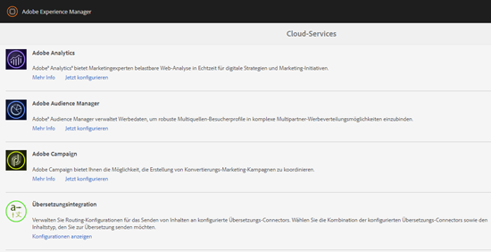

1. Klicken oder tippen Sie in der Liste der verfügbaren Konfigurationen auf **[!UICONTROL Standardkonfiguration (Konfiguration für Übersetzungsintegration)]**, um die Seite **[!UICONTROL Standardkonfiguration]** zu öffnen.

   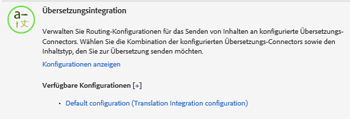

1. Klicken Sie in der Symbolleiste auf **[!UICONTROL Bearbeiten]**, um das Dialogfeld **[!UICONTROL Übersetzungskonfiguration]** anzuzeigen.

   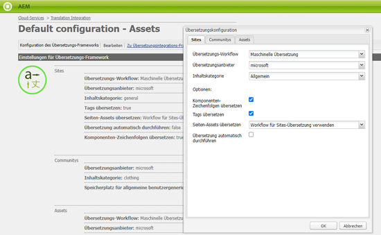

1. Navigieren Sie zum **[!UICONTROL Assets]** und wählen Sie **[!UICONTROL Inline-Medien-Assets und zugehörige Sammlungen]** aus dem **[!UICONTROL Übersetzen von Inhaltsfragment-Assets]** Liste. Klicken/Tippen **[!UICONTROL OK]** , um die Änderungen zu speichern.

   

1. Öffnen Sie aus dem englischen Stammordner ein Inhaltsfragment.

   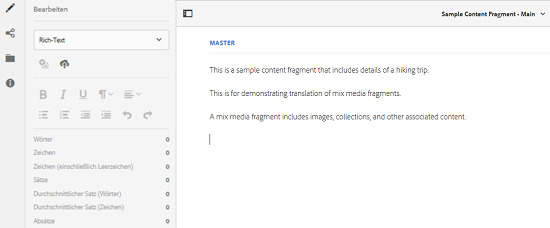

1. Klicken oder tippen Sie auf das Symbol **[!UICONTROL Asset einfügen]**.

   

1. Fügen Sie ein Asset in das Inhaltsfragment ein.

   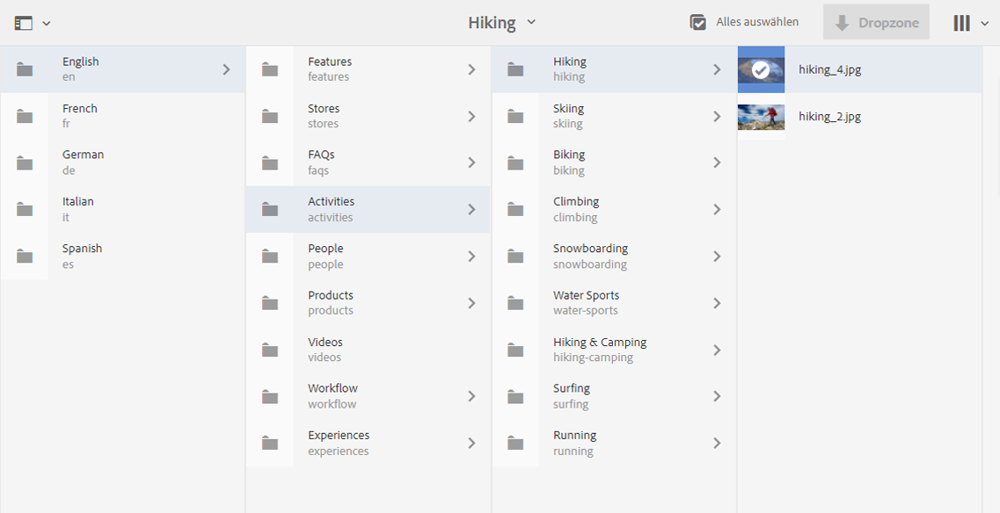

1. Klicken oder tippen Sie auf das Symbol **[!UICONTROL Inhalt verknüpfen]**.

   

1. Klicken oder tippen Sie auf **[!UICONTROL Inhalt verknüpfen]**.

   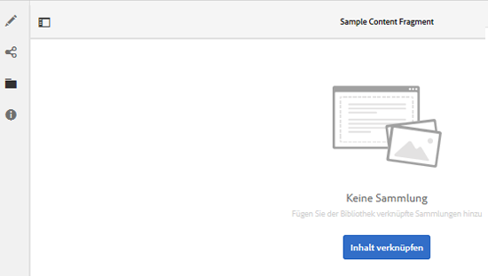

1. Wählen Sie eine Sammlung aus und fügen Sie sie in das Inhaltsfragment ein. Klicken/Tippen **[!UICONTROL Speichern]**.

   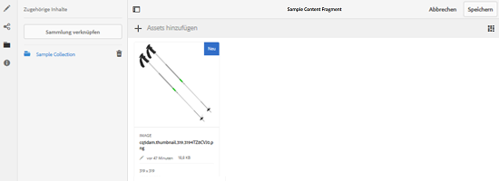

1. Wählen Sie das Inhaltsfragment aus und klicken/tippen Sie auf das **[!UICONTROL GlobalNav]** Symbol.
1. Auswählen **[!UICONTROL Verweise]** aus dem Menü, um die **[!UICONTROL Verweise]** -Bereich.

   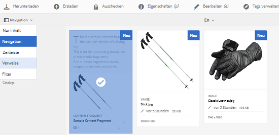

1. Klicken oder tippen Sie unter **[!UICONTROL Kopien]** auf **[!UICONTROL Sprachkopien]**, um die Sprachkopien anzuzeigen.

   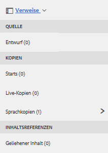

1. Klicken oder tippen Sie im unteren Bereich des Bedienfelds auf **[!UICONTROL Erstellen und übersetzen]**, um das Dialogfeld **[!UICONTROL Erstellen und übersetzen]** anzuzeigen.

   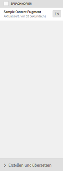

1. Wählen Sie in der Liste **[!UICONTROL Zielsprachen]** die Zielsprache aus.

   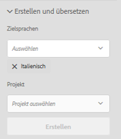

1. Wählen Sie in der Liste **[!UICONTROL Projekt]** den Übersetzungsprojekttyp aus.

   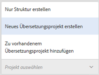

1. Geben Sie im Feld **[!UICONTROL Projekttitel]** den Titel des Projekts ein und klicken oder tippen Sie auf **Erstellen**.

   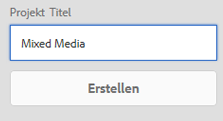

1. Navigieren Sie zur **[!UICONTROL Projekte-Konsole]** und öffnen Sie den Projektordner für das von Ihnen erstellte Übersetzungsprojekt.

   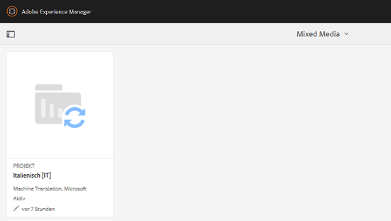

1. Klicken oder tippen Sie auf die Projektkachel, um die Projektdetailseite zu öffnen.

   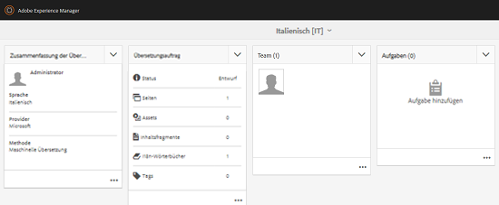

1. Überprüfen Sie in der Kachel Übersetzungsauftrag die Anzahl der zu übersetzenden Assets.
1. Aus dem **[!UICONTROL Übersetzungsauftrag]** Kachel, starten Sie den Übersetzungsauftrag.

   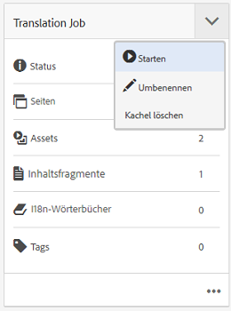

1. Klicken Sie auf die Ellipsen unten auf der Kachel „Übersetzungsauftrag“, um den Status des Übersetzungsauftrags anzuzeigen.

   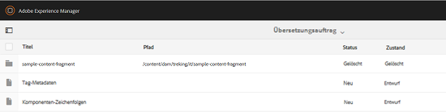

1. Klicken oder tippen Sie auf das Inhaltsfragment, um den Pfad der übersetzten zugehörigen Assets zu überprüfen.

   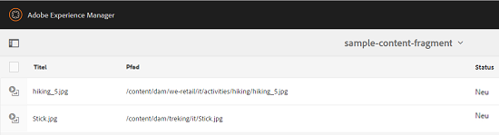

1. Überprüfen Sie in der Sammlungskonsole die Sprachkopie der Sammlung.

   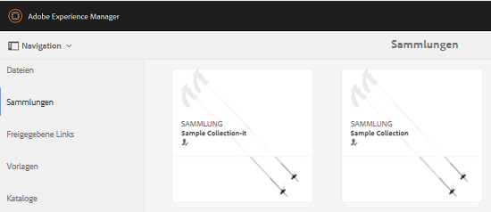

   Beachten Sie, dass nur der Inhalt der Sammlung übersetzt wird. Die Sammlung selbst wird nicht übersetzt.

1. Navigieren Sie zum Pfad des übersetzten verknüpften Assets. Beachten Sie, dass das übersetzte Asset unter dem Zielsprachenstamm gespeichert wird.

   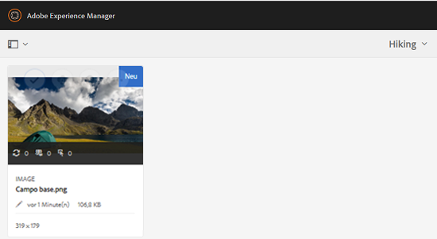

1. Navigieren Sie zu den Assets in der Sammlung, die zusammen mit dem Inhaltsfragment übersetzt werden. Beachten Sie, dass die übersetzten Kopien der Assets im entsprechenden Zielsprachenstamm gespeichert werden.

   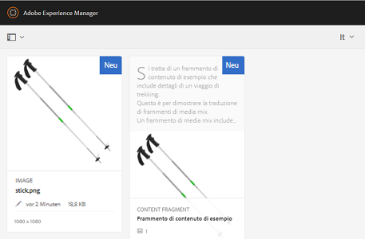

   >[!NOTE]
   >
   >Die Verfahren zum Hinzufügen eines Inhaltsfragments zu einem vorhandenen Projekt oder zum Durchführen von Aktualisierungs-Workflows ähneln den entsprechenden Verfahren für Assets. Eine Anleitung zu diesen Verfahren finden Sie in den für Assets beschriebenen Verfahren.
