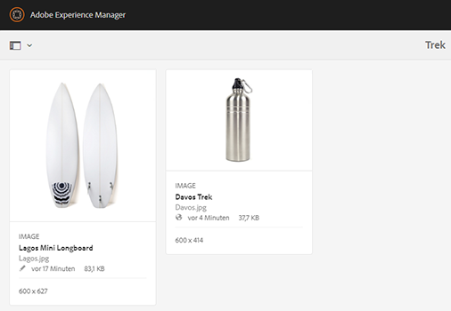
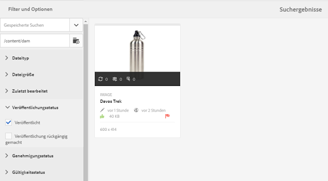

# Digital Rights Management for digital assets {#digital-rights-management-in-assets}

Digitale Assets sind oftmals mit einer Lizenz verbunden, in der die Bedingungen und die Nutzungsdauer festgelegt sind. Da Adobe Experience Manager (AEM) Assets vollständig in die AEM-Plattform integriert sind, können Sie Asset-Ablaufinformationen und Asset-Status effizient verwalten. Sie können Lizenzinformationen mit Assets verknüpfen.

## Asset-Ablauf {#asset-expiration}

Der Asset-Ablauf ist eine effektive Möglichkeit zum Durchsetzen von Lizenzanforderungen für Assets. Wenn ein veröffentlichtes Asset abläuft, wird seine Veröffentlichung aufgehoben und damit die Möglichkeit einer Lizenzverletzung unterbunden. Ein Benutzer ohne Administratorrechte kann ein abgelaufenes Asset weder bearbeiten, kopieren, verschieben, veröffentlichen noch herunterladen.

Sie können den Ablaufstatus für ein Asset in der Asset-Konsole sowohl in den Ansichten &quot;Karte&quot;als auch &quot;Liste&quot;Ansicht haben.

*Abbildung: In der Ansicht der Karte zeigt ein Flag auf einem abgelaufenen Asset an*

**Listenansicht**

*Abbildung: In der Ansicht &quot;Liste&quot;wird in der Spalte &quot;[!UICONTROL Status]&quot;das Banner &quot;[!UICONTROL Abgelaufen]&quot;angezeigt.*

Sie können den Ablaufstatus eines Assets in der Timeline einsehen. Wählen Sie das Asset und danach im GlobalNav-Menü die Option „Timeline“ aus.

You can also view the expiration status of assets in the **[!UICONTROL References]** rail. Hier werden der Assetablaufstatus und die Beziehungen zwischen ebenenübergreifenden Assets und referenzierten Unter-Assets, Sammlungen und Projekten verwaltet.

1. Navigieren Sie zu dem Asset, für das Sie referenzierende Webseiten und ebenenübergreifende Assets anzeigen möchten.
1. Wählen Sie das Asset und das Experience Manager-Logo aus.

1. Choose **[!UICONTROL References]** from the menu.

   

   For expired assets, the References rail displays the expiry status **[!UICONTROL Asset is Expired]** at the top.

   

   If the asset has expired subassets, the References rail displays the status **[!UICONTROL Asset has Expired Sub-Assets]**.

   

### Suchen von abgelaufenen Assets {#search-expired-assets}

Sie können im Suchfeld nach abgelaufenen Assets einschließlich abgelaufener Unter-Assets suchen.

1. In the Assets console, click the **[!UICONTROL Search]** in the toolbar to display the Omnisearch box.

1. Klicken Sie mit dem Cursor in das Feld Omniture Search (Suchergebnis) auf die Eingabetaste, um die Seite Search Results (Suchergebnisse) anzuzeigen.

   

1. Klicken Sie auf das Experience Manager-Logo, um das Suchfeld anzuzeigen.

   

1. Klicken Sie auf die Option **[!UICONTROL Ablaufstatus]**, um sie zu erweitern.

   

1. Wählen Sie **[!UICONTROL Abgelaufen]** aus. Die abgelaufenen Assets werden in den Suchergebnissen angezeigt.

   

When you choose the **Expired** option, the Assets console only displays the expired assets and subassets that are referenced by compound assets. Die ebenenübergreifenden Assets, die auf abgelaufene Unter-Assets verweisen, werden nicht sofort nach Ablauf eines Unter-Assets angezeigt. Stattdessen werden sie angezeigt, nachdem AEM Assets bei der nächsten Ausführung des Planers erkennt, dass sie auf abgelaufene Unter-Assets verweisen.

Wenn Sie das Ablaufdatum eines veröffentlichten Assets in ein Datum ändern, das vor dem aktuellen Planerzyklus liegt, erkennt der Planer das Asset als abgelaufenes Asset, wenn es das nächste Mal aufgeführt wird, und spiegelt dementsprechend seinen Status wider.

Wenn eine Störung oder ein Fehler verhindert, dass der Planer abgelaufene Assets im aktuellen Zyklus erkennt, untersucht der Planer diese Assets im nächsten Zyklus erneut und erkennt dann, dass sie abgelaufen sind.

Damit die Assets-Konsole die verknüpften Assets zusammen mit den abgelaufenen Teil-Assets anzeigen kann, konfigurieren Sie in AEM Configuration Manager einen Workflow für die **Benachrichtigung zum Ablauf von Adobe CQ-DAM**.

1. Öffnen Sie AEM Configuration Manager.
1. Choose **[!UICONTROL Adobe CQ DAM Expiry Notification]**. By default, **[!UICONTROL Time based Scheduler]** is selected, which schedules a job to check at a specific time whether an asset has expired subassets. Nach Abschluss des Auftrags werden Assets mit abgelaufenen Unter-Assets und verwiesenen Assets in den Suchergebnissen als abgelaufen angezeigt.

   

1. Um den Auftrag regelmäßig auszuführen, löschen Sie das Feld **[!UICONTROL Zeitbasierte Planungsregel]** und ändern Sie die Zeit im Feld **[!UICONTROL Periodische Planung]** in Sekunden. Beispiel: Der Beispielausdruck „0 0 0 &amp;ast; &amp;ast; ?“ löst den Auftrag um 00 Uhr aus.
1. Select **[!UICONTROL send email]** to receive emails when an asset expires.

   >[!NOTE]
   >
   >Nur der Ersteller eines Assets (die Person, die ein bestimmtes Asset in AEM Assets hochlädt) erhält eine E-Mail, wenn das Asset abläuft. Weitere Einzelheiten zur Konfiguration von E-Mail-Benachrichtigungen in AEM im Allgemeinen finden Sie unter [Konfigurieren von E-Mail-Benachrichtigungen](/help/sites-administering/notification.md).

1. Geben Sie im Feld **[!UICONTROL Vorabbenachrichtigung in Sekunden]** den Zeitpunkt in Sekunden vor dem Ablauf eines Assets an, zu dem Sie über den bevorstehenden Ablauf benachrichtigt werden möchten. Wenn Sie ein Administrator oder der Ersteller des Assets sind, werden Sie vor Ablauf des Assets darüber informiert, dass das Asset nach dem angegebenen Zeitraum ablaufen wird.

   Nachdem das Asset abgelaufen ist, erhalten Sie eine weitere Benachrichtigung, die den Ablauf bestätigt. Außerdem werden die abgelaufenen Assets deaktiviert.

1. Klicken Sie auf **[!UICONTROL Speichern]**.

## Asset-Zustände {#asset-states}

Die Konsole „Assets“ in Adobe Experience Manager (AEM) Assets kann verschiedene Zustände für Assets anzeigen. Abhängig vom aktuellen Zustand eines bestimmten Assets zeigt die zugehörige Kartenansicht eine Beschreibung des Zustands an, z. B. „Abgelaufen“, „Veröffentlicht“, „Genehmigt“, „Abgelehnt“ usw.

1. Wählen Sie in der Assets-Benutzeroberfläche ein Asset aus.

   

1. Tippen Sie in der Symbolleiste auf **[!UICONTROL Veröffentlichen]** . Wenn die Symbolleiste keine **Veröffentlichung** enthält, tippen Sie in der Symbolleiste auf **[!UICONTROL Mehr]** und suchen Sie die Option &quot; **[!UICONTROL Veröffentlichen]** &quot;.

   

1. Choose **[!UICONTROL Publish]** from the menu, and then close the confirmation dialog.
1. Beenden Sie den Auswahlmodus. Der Veröffentlichungsstatus des Assets wird in der Kartenansicht im unteren Bereich der Miniaturansicht des Assets angezeigt. In der Listenansicht zeigt die Spalte „Veröffentlicht“ die Zeit an, zu der das Asset veröffentlicht wurde.

   

1. In the Assets UI, select an asset and tap **[!UICONTROL Properties]** to display its asset details page.

   

1. In the Advanced tab, set an expiration date for the asset from the **[!UICONTROL Expires]** field.

   

   *Abbildung: Erweiterte Registerkarte in Asset-Eigenschaften zum Festlegen des Asset-Ablaufs*

1. Click **[!UICONTROL Save]** and then click **[!UICONTROL Close]** to display the Asset console.
1. Der Veröffentlichungsstatus des Assets weist in der Kartenansicht im unteren Bereich der Miniaturansicht darauf hin, dass das Asset abgelaufen ist. In the list view, the status of the asset is displayed as **[!UICONTROL Expired]**.

   

1. Wählen Sie in der Konsole „Assets“ einen Ordner aus und erstellen Sie eine Prüfungsaufgabe für den Ordner.
1. Review and approve/reject the assets in the review task and click **[!UICONTROL Complete]**.
1. Navigieren Sie zu dem Ordner, für den Sie die Prüfungsaufgabe erstellt haben. Der Status des Assets, das Sie bestätigt oder abgelehnt haben, wird unten in der Kartenansicht angezeigt. In der Ansicht &quot;Liste&quot;werden die Genehmigungs- und Ablaufstatus in den entsprechenden Spalten angezeigt.

   

1. Um nach Assets basierend auf ihrem Status zu suchen, tippen Sie auf **[!UICONTROL Suchen]** , um die Suchleiste anzuzeigen.

   

1. Drücken Sie die Eingabetaste und tippen Sie dann auf **[!UICONTROL GlobalNav]** , um das Suchfeld anzuzeigen.
1. Tippen/Klicken Sie im Suchbedienfeld auf **[!UICONTROL Veröffentlichungsstatus]** und wählen Sie **[!UICONTROL Veröffentlicht]**, um in AEM Assets nach veröffentlichten Assets zu suchen.

   

1. Tippen/Klicken Sie auf **[!UICONTROL Genehmigungsstatus]** und dann auf die entsprechende Option, um nach genehmigten oder abgelehnten Assets zu suchen.

   

1. Um nach Assets basierend auf dem Ablaufstatus zu suchen, wählen Sie im Suchfeld die Option **[!UICONTROL Ablaufstatus]** und anschließend die entsprechende Option aus.

   

1. Sie können auch auf Grundlage einer Kombination von Statusangaben mit verschiedenen Suchfacetten nach Assets suchen. Sie können beispielsweise nach veröffentlichten Assets suchen, die in einer Prüfungsaufgabe bestätigt wurden und noch nicht abgelaufen sind, indem Sie die entsprechenden Optionen in den Suchfacetten auswählen.

   

## Digital Rights Management in Assets {#digital-rights-management-in-assets-1}

Diese Funktion setzt die Annahme der Lizenzvereinbarung zwingend voraus. Erst nach diesem Schritt können lizenzierte Assets von Adobe Experience Manager (AEM) Assets heruntergeladen werden.

If you select a protected asset and tap **[!UICONTROL Download]**, you are redirected to a license page where you accept the license agreement. Wenn Sie die Lizenzvereinbarung nicht annehmen, wird die Schaltfläche **[!UICONTROL Herunterladen]** deaktiviert.

Falls die Auswahl mehrere geschützte Assets enthält, wählen Sie jeweils eines aus, nehmen Sie die Lizenzvereinbarung an und fahren Sie mit dem Herunterladen des Assets fort.

Ein Asset gilt als geschützt, wenn eine der folgenden Bedingungen erfüllt ist:

* Die `xmpRights:WebStatement`-Metadateneigenschaft des Assets verweist auf den Pfad der CQ-Seite, die die Lizenzvereinbarung für das Asset enthält.
* Beim Wert der `adobe_dam:restrictions`-Metadateneigenschaft des Assets handelt es sich um nicht formatierten HTML-Code, der die Lizenzvereinbarung angibt.

>[!NOTE]
>
>The location `/etc/dam/drm/licenses` used for storing licenses in earlier releases of AEM is deprecated.
>
>If you create or modify licence pages, or port them from previous AEM releases, Adobe recommends that you store them under `/apps/settings/dam/drm/licenses` or `/conf/&ast;/settings/dam/drm/licenses`.

### Herunterladen von DRM-geschützten Assets {#downloading-drm-assets}

1. In the Card view, select the assets you want to download and click **[!UICONTROL Download]**.
1. Wählen Sie auf der Seite **[!UICONTROL Copyright-Management]** das Asset aus, das Sie herunterladen möchten.
1. Wählen Sie im Lizenzfenster **[!UICONTROL Zustimmen]**. Möglicherweise erscheint ein Häkchen neben dem Asset, für das Sie die Lizenzvereinbarung angenommen haben. Tap/click the **[!UICONTROL Download]** button.

   >[!NOTE]
   >
   >Die Schaltfläche **[!UICONTROL Herunterladen]** ist nur aktiviert, wenn Sie der Lizenzvereinbarung für ein geschütztes Asset zustimmen. Wenn Ihre Auswahl jedoch sowohl geschützte als auch ungeschützte Assets umfasst, werden nur die geschützten Assets im linken Bereich aufgelistet und die Schaltfläche **[!UICONTROL Herunterladen]** ist aktiviert, um die ungeschützten Assets herunterzuladen. Um gleichzeitig Lizenzvereinbarungen für mehrere geschützte Assets zu akzeptieren, wählen Sie die Assets aus der Liste aus und dann **[!UICONTROL Zustimmen]**.

   

1. In the dialog, tap/click **[!UICONTROL Download]** to download the asset or its renditions.
