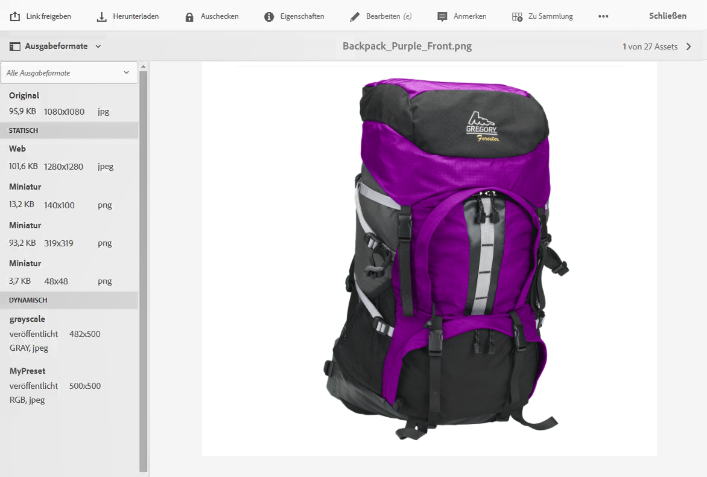
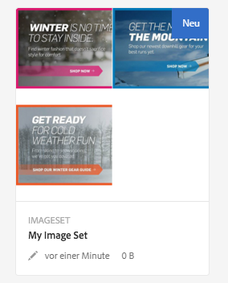
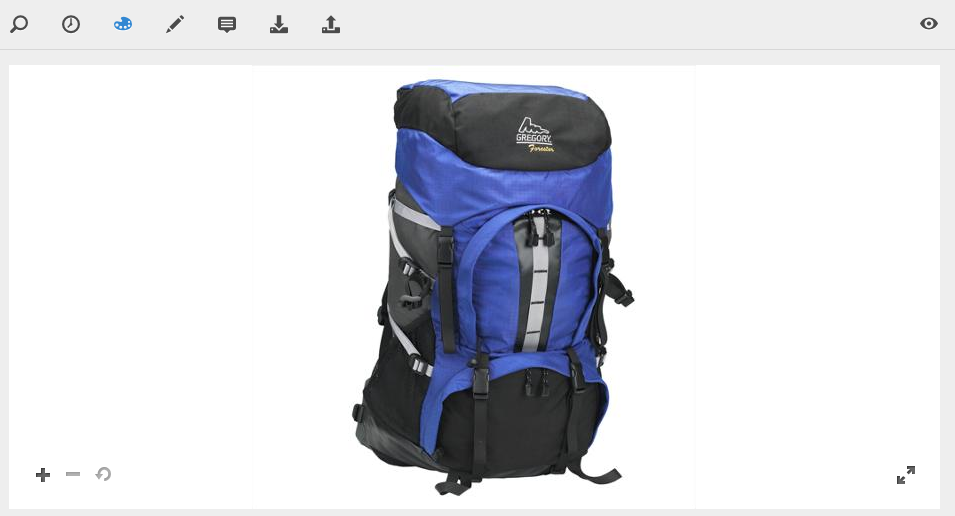

# Arbeiten mit Dynamic Media {#working-with-dynamic-media}

Mit [Dynamic Media](https://www.adobe.com/de/solutions/web-experience-management/dynamic-media.html) können Sie visuell ansprechende Merchandising- und Marketing-Assets nach Bedarf bereitstellen, die automatisch für die Anzeige auf Web- sowie Mobile- und Social-Media-Sites skaliert werden. Anhand eines Sets von Assets aus Primärquellen können Sie mit Dynamic Media mehrere Varianten ansprechender Inhalte in Echtzeit über das globale, skalierbare und leistungsoptimierte Netzwerk generieren und bereitstellen.

Dynamic Media ermöglicht interaktive Anzeigeerlebnisse wie Zoom, Drehen um 360 Grad und Videos. Dynamic Media bindet die Workflows der Adobe Experience Manager-Lösung für die Verwaltung digitaler Assets (Assets) auf einzigartige Weise ein, um das Management digitaler Kampagnen zu vereinfachen und zu optimieren.

>[!NOTE]
>
>Es gibt einen Community-Artikel zum Thema [Arbeiten mit Adobe Experience Manager und Dynamic Media](https://helpx.adobe.com/de/experience-manager/using/aem_dynamic_media.html).

## Einsatzmöglichkeiten für Dynamic Media     {#what-you-can-do-with-dynamic-media}

Mit Dynamic Media können Sie Assets vor ihrer Veröffentlichung verwalten. Eine ausführliche Beschreibung der allgemeinen Arbeit mit digitalen Assets finden Sie in [Arbeiten mit digitalen Assets](manage-assets.md). Die allgemeinen Themen umfassen das Hochladen, Herunterladen, Bearbeiten und Veröffentlichen von Assets, das Anzeigen und Bearbeiten von Eigenschaften und die Suche nach Assets.

Funktionen, die nur für Dynamic Media vorgesehen sind:

* [Karussellbanner](carousel-banners.md)
* [Bild-Sets](image-sets.md)
* [Interaktive Bilder](interactive-images.md)
* [Interaktive Videos](interactive-videos.md)
* [Sets für gemischte Medien](mixed-media-sets.md)
* [Panoramabilder](panoramic-images.md)

* [Rotationssets](spin-sets.md)
* [Video](video.md)
* [Bereitstellen von Dynamic Media-Assets](delivering-dynamic-media-assets.md)
* [Verwalten von Assets](managing-assets.md)
* [Verwenden von Schnellansichten zum Erstellen benutzerdefinierter Popups](custom-pop-ups.md)

Siehe auch [Einrichten dynamischer Medien](administering-dynamic-media.md).

>[!NOTE]
>
>Informationen zu den Unterschieden zwischen der Verwendung von Dynamic Media und der Integration von Dynamic Media Classic mit AEM finden Sie unter [Dynamic Media Classic-Integration versus Dynamic Media](/help/sites-administering/scene7.md#aem-scene-integration-versus-dynamic-media).

## Aktivierte und deaktivierte Dynamic Media-Funktion im Vergleich {#dynamic-media-on-versus-dynamic-media-off}

Anhand der folgenden Merkmale können Sie erkennen, ob Dynamic Media aktiviert ist:

* Dynamische Ausgabeformate sind beim Herunterladen oder Anzeigen von Assets in der Vorschau verfügbar.
* Bild-Sets, Rotations-Sets und Sets für gemischte Medien sind verfügbar.
* PTIFF-Ausgabeformate werden erstellt.

Wenn Sie auf ein Bild-Asset klicken, unterscheidet sich die Ansicht des Assets von Dynamic Media [enabled](config-dynamic.md#enabling-dynamic-media). Dynamic Media nutzt die On-Demand-HTML5-Viewer.

### Dynamische Ausgabeformate {#dynamic-renditions}

Dynamische Ausgabeformate wie Bild- und Viewer-Vorgaben (unter **[!UICONTROL Dynamisch]**) sind verfügbar, wenn Dynamic Media aktiviert ist.

### Bild-Sets, Rotations-Sets und Sets für gemischte Medien {#image-sets-spins-sets-mixed-media-sets}

Bild-Sets, Rotations-Sets und Sets für gemischte Medien sind verfügbar, wenn Dynamic Media aktiviert ist.

### PTIFF-Ausgabeformate {#ptiff-renditions}

Assets mit aktivierter Dynamic Media-Funktion umfassen `pyramid.tiffs`.

### Änderung der Asset-Ansichten {#asset-views-change}

Wenn Dynamic Media aktiviert ist, können Sie die Ansicht durch Klicken auf die Schaltflächen `+` und `-` vergrößern und verkleinern. Sie können durch Klicken oder Tippen auch einen bestimmten Bereich vergrößern. Außerdem können Sie die Originalansicht wiederherstellen und das Bild durch Klicken auf die diagonalen Pfeile im Vollbildmodus anzeigen. Eine Ansicht mit aktivierter Dynamic Media-Funktion sieht wie folgt aus:

Wenn Dynamic Media deaktiviert ist, können Sie die Ansicht vergrößern und verkleinern und die Originalgröße wiederherstellen:

